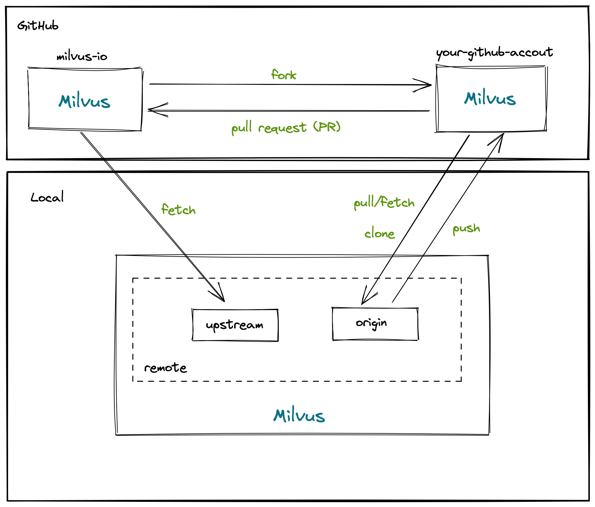
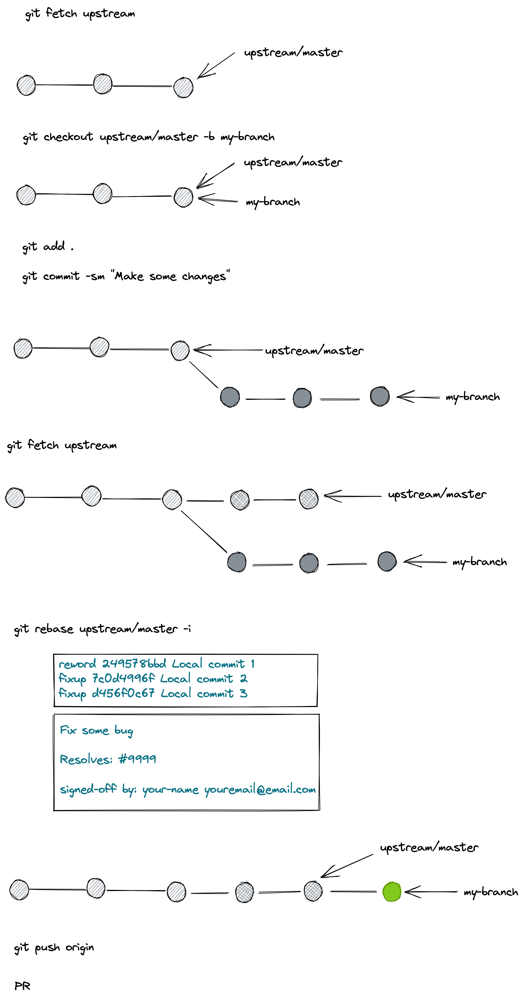

# Contributing to Milvus

Contributions to Milvus are welcome from everyone. We strive to make the contribution process simple and straightforward. Up-to-date information can be found at [milvus.io](https://milvus.io/).

The following are a set of guidelines for contributing to Milvus. Following these guidelines makes contributing to this project easy and transparent. These are mostly guidelines, not rules. Use your best judgment, and feel free to propose changes to this document in a pull request.

As for everything else in the project, the contributions to Milvus are governed by our [Code of Conduct](CODE_OF_CONDUCT.md).

## What contributions can I make?

| Suitable for                             | Projects                                                     | Resources                                                    |
| ---------------------------------------- | ------------------------------------------------------------ | ------------------------------------------------------------ |
| Go developers                            | [milvus](https://github.com/milvus-io/milvus), [milvus-sdk-go](https://github.com/milvus-io/milvus-sdk-go),       |                                                              |
| CPP developers                           | [milvus](https://github.com/milvus-io/milvus)                |                                                              |
| Developers interested in other languages | [pymilvus](https://github.com/milvus-io/pymilvus), [milvus-sdk-node](https://github.com/milvus-io/milvus-sdk-node), [milvus-sdk-java](https://github.com/milvus-io/milvus-sdk-java) | [Contributing to PyMilvus](https://github.com/milvus-io/pymilvus/blob/master/CONTRIBUTING.md) |
| Kubernetes enthusiasts                   | [milvus-helm](https://github.com/milvus-io/milvus-helm)      |                                                              |
| Tech writers and docs enthusiasts        | [milvus-docs](https://github.com/milvus-io/milvus-docs)      | [Contributing to milvus docs](https://github.com/milvus-io/milvus-docs/blob/v2.0.0/CONTRIBUTING.md) |
| Web developers                           | [milvus-insight](https://github.com/milvus-io/milvus-insight)                                                         |                                                              |

## How can I contribute?
### Contributing code

**If you encountered a bug, you can**
- (**Recommended**) File an issue about the bug.
- (*Optional*) Provide clear and concrete ways/scripts to reproduce the bug.
- (*Optional*) Provide possible solutions for the bug.
- (*Optional*) Pull a request to fix the bug.

**If you're interested in existing issues, you can**
- (**Recommended**) Provide answers for issue labeled `question`.
- Provide help for issues labeled `bug`, `improvement`, and `enhancement` by
    - (**Recommended**) Asking questions, reproducing the issue, or providing solutions.
    - Pulling a request to fix the issue.

**If you require new feature or major enhancement, you can**
- (**Recommended**) File an issue about the feature/enhancement with reasons.
- (*Optional*) Provide a MEP for the feature/enhancement.
- (*Optional*) Pull a request to implement the MEP.

**If you are a reviewer/approver of Milvus, you can**
- Participate in [PR review](CODE_REVIEW.md) process.
- Instruct newcomers in the community to complete the PR process.

If you want to become a contributor of Milvus, send us your pull requests! For those just getting started, see [GitHub workflow](#github-workflow) below.

All submissions will be reviewed as quickly as possible.
There will be a reviewer to review the codes, and an approver to review everything aside the codes, see [code review](CODE_REVIEW.md) for details.
If everything is perfect, the reviewer will label `/lgtm`, and the approver will label `/approve`. 
Once the 2 labels are on your PR, and all actions pass, your PR will be merged into base branch automaticaly by our @sre-ci-robot

### GitHub workflow

Generally, we follow the "fork-and-pull" Git workflow.

1.  [Fork](https://docs.github.com/en/github/getting-started-with-github/fork-a-repo) the repository on GitHub.
2.  Clone your fork to your local machine with `git clone git@github.com:<yourname>/milvus.git`.
3.  Create a branch with `git checkout -b my-topic-branch`.
4.  [Commit](https://docs.github.com/en/github/collaborating-with-issues-and-pull-requests/committing-changes-to-a-pull-request-branch-created-from-a-fork) changes to your own branch, then push to to GitHub with `git push origin my-topic-branch`.
5.  Submit a [pull request](https://docs.github.com/en/github/collaborating-with-issues-and-pull-requests/about-pull-requests) so that we can review your changes.



Remember to [sync your forked repository](https://docs.github.com/en/github/getting-started-with-github/fork-a-repo#keep-your-fork-synced) *before* submitting proposed changes upstream. If you have an existing local repository, please update it before you start, to minimize the chance of merge conflicts.

```shell
git remote add upstream git@github.com:milvus-io/milvus.git
git fetch upstream
git checkout upstream/master -b my-topic-branch
```



### General guidelines

Before submitting your pull requests for review, make sure that your changes are consistent with the [coding style](CONTRIBUTING.md#coding-style), and run [unit tests](CONTRIBUTING.md#run-unit-test-with-code-coverage) to check your code coverage rate.

-   Include unit tests when you contribute new features, as they help to prove that your code works correctly, and also guard against future breaking changes to lower the maintenance cost.
-   Bug fixes also require unit tests, because the presence of bugs usually indicates insufficient test coverage.
-   Keep API compatibility in mind when you change code in Milvus. Reviewers of your pull request will comment on any API compatibility issues.
-   When you contribute a new feature to Milvus, the maintenance burden is (by default) transferred to the Milvus team. This means that the benefit of the contribution must be compared against the cost of maintaining the feature.

### Developer Certificate of Origin (DCO)

All contributions to this project must be accompanied by acknowledgment of, and agreement to, the [Developer Certificate of Origin](https://developercertificate.org/). Acknowledgment of and agreement to the Developer Certificate of Origin _must_ be included in the comment section of each contribution and _must_ take the form of `Signed-off-by: {{Full Name}} <{{email address}}>` (without the `{}`). Contributions without this acknowledgment will be required to add it before being accepted. If contributors are unable or unwilling to agree to the Developer Certificate of Origin, their contribution will not be included.

Contributors sign-off that they adhere to DCO by adding the following Signed-off-by line to commit messages:

```text
This is my commit message

Signed-off-by: Random J Developer <random@developer.example.org>
```

Git also has a `-s` command line option to append this automatically to your commit message:

```shell
$ git commit -s -m 'This is my commit message'
```

## Coding Style

Keeping a consistent style for code, code comments, commit messages, and PR descriptions will greatly accelerate your PR review process. We highly recommend you refer to and comply to the following style guides when you put together your pull requests:

### Go
- Coding style: refer to the [Effictive Go Style Guide](https://golang.org/doc/effective_go)

###C++
The c++ coding style used in Milvus generally follow [Google C++ Style Guide](https://google.github.io/styleguide/cppguide.html).
And we made the following changes based on the guide:

-   4 spaces for indentation
-   Adopt .cpp file extension instead of .cc extension
-   120-character line length
-   Camel-Cased file names

### Commits and PRs
- Commit message and PR description style: refer to [good commit messages](https://chris.beams.io/posts/git-commit)

### Format code
#### Go
```shell
$ make fmt
```

####C++
Install clang-format
```shell
$ sudo apt-get install clang-format
$ rm cmake_build/CMakeCache.txt
```
Check code style
```shell
$ ./build.sh -l
```
To format the code
```shell
$ cd cmake_build
$ make clang-format
```

## Run unit test with code coverage
Before submitting your Pull Request, make sure you have run unit test, and your code coverage rate is >= 90%.

### Go
```shell
$ go test -coverprofile fmtcoverage.html  ./internal/allocator
ok  	github.com/milvus-io/milvus/internal/allocator 0.048s	coverage: 69.6% of statements
```
### C++
Install lcov
```shell
$ sudo apt-get install lcov
```
Run unit test and generate code for code coverage check
```shell 
$ ./build.sh -u -c
```

Run MySQL docker
```shell 
docker pull mysql:latest
docker run -p 3306:3306 -e MYSQL_ROOT_PASSWORD=123456 -d mysql:latest
```

Run code coverage

```shell  
$ ./coverage.sh -u root -p 123456 -t 127.0.0.1
```

Or start your own MySQL server, and then run code coverage

```shell
$ ./coverage.sh -u ${MYSQL_USERNAME} -p ${MYSQL_PASSWORD} -t ${MYSQL_SERVER_IP}
```

