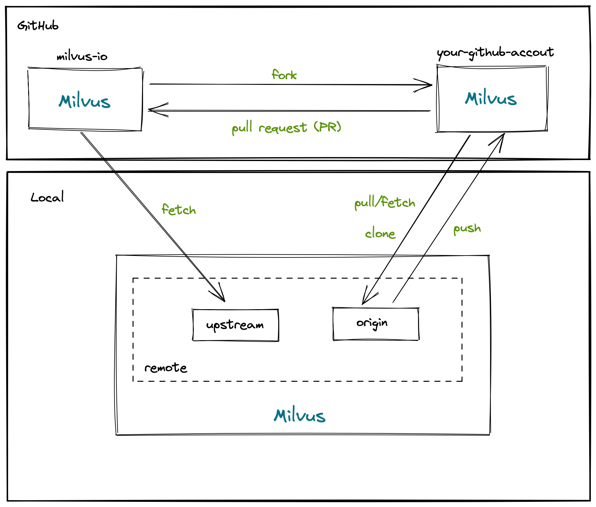
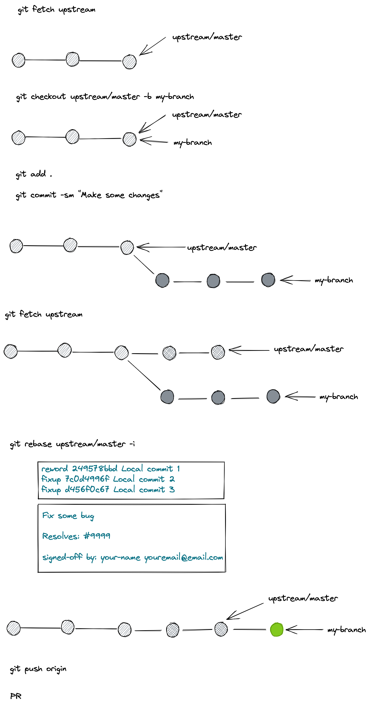

# Contributing to Milvus

Contributions to Milvus are welcome from everyone. We strive to make the contribution process simple and straightforward. Up-to-date information can be found at [milvus.io](https://milvus.io/).

This guide describes contribution requirements and recommended practices. Requirements use "must" or "required"; recommendations use "should" or "recommended". The target branch's [Mergify configuration](.github/mergify.yml), CI configuration, and required GitHub checks define automated gates. If a documented requirement and configuration disagree, raise the discrepancy with maintainers rather than inventing an additional gate or silently ignoring the requirement.

As for everything else in the project, the contributions to Milvus are governed by our [Code of Conduct](CODE_OF_CONDUCT.md).

**Content**

- [Contributing to Milvus](#contributing-to-milvus)
  - [What contributions can you make?](#what-contributions-can-you-make)
  - [How can you contribute?](#how-can-you-contribute)
    - [Contributing code](#contributing-code)
    - [GitHub workflow](#github-workflow)
    - [Design documents](#design-documents)
    - [General guidelines](#general-guidelines)
    - [Developer Certificate of Origin (DCO)](#developer-certificate-of-origin-dco)
  - [Coding Style](#coding-style)
    - [Golang coding style](#golang-coding-style)
    - [C++ coding style](#c-coding-style)
  - [Run unit test with code coverage](#run-unit-test-with-code-coverage)
    - [Golang](#run-golang-unit-tests)
    - [Using mockery](#using-mockery)
    - [C++](#run-c-unit-tests)
  - [Commits and PRs](#commits-and-prs)
    - [Commit history](#commit-history)
    - [PR title and description](#pr-title-and-description)

## What contributions can you make?

| Suitable for                             | Projects                                                                                                                                                                            | Resources                                                                                           |
| ---------------------------------------- | ----------------------------------------------------------------------------------------------------------------------------------------------------------------------------------- | --------------------------------------------------------------------------------------------------- |
| Go developers                            | [milvus](https://github.com/milvus-io/milvus)                                                                           |                                                                                                     |
| CPP developers                           | [milvus](https://github.com/milvus-io/milvus)                                                                                     |                                                                                                     |
| Developers interested in other languages | [pymilvus](https://github.com/milvus-io/pymilvus), [milvus-sdk-node](https://github.com/milvus-io/milvus-sdk-node), [milvus-sdk-java](https://github.com/milvus-io/milvus-sdk-java) | [Contributing to PyMilvus](https://github.com/milvus-io/pymilvus/blob/master/CONTRIBUTING.md)       |
| Tech writers and docs enthusiasts        | [milvus-docs](https://github.com/milvus-io/milvus-docs)                                                                                                                             | [Contributing to milvus docs](https://github.com/milvus-io/milvus-docs/blob/v2.0.0/CONTRIBUTING.md) |
| Web developers                           | [milvus-insight](https://github.com/zilliztech/milvus-insight)                                                                                                                      |                                                                                                     |

## How can you contribute?

### Contributing code

**If you encounter a bug, you can**

- (**Recommended**) File an issue about the bug.
- Provide clear and concrete ways/scripts to reproduce the bug.
- Provide possible solutions for the bug.
- Pull a request to fix the bug.

**If you're interested in existing issues, you can**

- (**Recommended**) Provide answers for issue labeled `question`.
- Provide help for issues labeled `bug`, `improvement`, and `enhancement` by
  - (**Recommended**) Ask questions, reproduce the issue, or provide solutions.
  - Pull a request to fix the issue.

**If you require a new feature or major enhancement, you can**

- (**Recommended**) File an issue about the feature/enhancement with reasons.
- Provide a [design document](#design-documents) for the feature/enhancement.
- Pull a request to implement the design.

**If you are a reviewer/approver of Milvus, you can**

- Participate in [PR review](CODE_REVIEW.md) process.
- Instruct newcomers in the community to complete the PR process.

If you want to become a contributor of Milvus, submit your pull requests! For those just getting started, see [GitHub workflow](#github-workflow) below.

Reviewers assess correctness and maintainability; approvers also assess the overall design and merge readiness. The `/lgtm` and `/approve` commands correspond to the `lgtm` and `approved` labels. Merging also depends on DCO, applicable CI checks, branch protection, and resolution of blocking labels and review requests. See the [code review guide](CODE_REVIEW.md) for details.

### GitHub workflow

Generally, we follow the "fork-and-pull" Git workflow.

* [Fork](https://docs.github.com/en/github/getting-started-with-github/fork-a-repo) the [Milvus repo](https://github.com/milvus-io/milvus/tree/master) on GitHub.
* Clone your fork to your local machine with `git clone git@github.com:<yourname>/milvus.git`.
* Work in your local repo and file a PR. 

In your local repo:

1. [Configure](https://docs.github.com/en/pull-requests/collaborating-with-pull-requests/working-with-forks/configuring-a-remote-repository-for-a-fork) your local repo by adding the remote official repo as upstream. 
2.  Then you can create a branch, make changes and [commit](https://docs.github.com/en/github/collaborating-with-issues-and-pull-requests/committing-changes-to-a-pull-request-branch-created-from-a-fork).
3.  Fetch upstream, update your branch and resolve merge conflicts as needed, then push the changes to origin. You can submit a [pull request](https://docs.github.com/en/github/collaborating-with-issues-and-pull-requests/about-pull-requests) to get your code reviewed. Updating your branch does not require squashing your commits; see [Commits and PRs](#commits-and-prs).
4.  Once getting approved, your code can be merged to `master`, yay!

Here is the process illustrated in details:


Remember to [sync your forked repository](https://docs.github.com/en/github/getting-started-with-github/fork-a-repo#keep-your-fork-synced) _before_ submitting proposed changes upstream. If you have an existing local repository, please update it before you start, to minimize the chance of merge conflicts.

```shell
git remote add upstream git@github.com:milvus-io/milvus.git
git fetch upstream
git checkout upstream/master -b my-topic-branch
```



### Design documents

Milvus feature pull requests must provide a design document. This applies when the pull request title starts with `feat:` or the pull request is labeled `kind/feature`. Large enhancements that introduce new architecture, storage formats, public behavior, or upgrade impact should also include a design document; reviewers may add `kind/feature` when the design-doc requirement applies.

To satisfy the requirement, do one of the following:

- Add or update the design document in the same pull request as the related implementation.
- Link an existing in-repo design document in the pull request description.

Use this pull request description format when linking an existing document:

```markdown
design doc: docs/design-docs/design_docs/YYYYMMDD-short-descriptive-name.md
```

Design documents must live under `docs/design-docs/design_docs/`. Name each file `YYYYMMDD-short-descriptive-name.md`, keep one design per file, and put images or diagrams under `docs/design-docs/assets/graphs/` or `docs/design-docs/assets/images/`. External design-doc repository links do not satisfy this requirement. Mergify adds the `do-not-merge/missing-design-doc` label to feature PRs until this requirement is met.

Start each design document with a clear title and metadata block:

```markdown
# MEP: <Title>

- **Created:** YYYY-MM-DD
- **Author(s):** @github-handle
- **Status:** Draft | Under Review | Approved | Implemented | Deprecated
- **Component:** DataNode | QueryNode | Proxy | Coordinator | Storage | Index | SDK | Other
- **Related Issues:** #xxx
- **Released:** Milvus release version, if applicable
```

Every design document should explain the problem, the proposed design, and how the design will be verified. Use these sections:

- **Summary:** Briefly describe the change.
- **Motivation:** Explain the user problem, operational problem, or architectural limitation being solved.
- **Public Interfaces:** List API, proto, SDK, config, metrics, or behavior changes that users or other components will observe.
- **Design Details:** Describe the architecture, data flow, component responsibilities, persistence/metadata changes, and important failure cases.
- **Compatibility, Deprecation, and Migration Plan:** Call out upgrade, rollback, data-format, API compatibility, and migration impact.
- **Test Plan:** Describe unit, integration, E2E, upgrade, performance, or failure-injection tests needed to prove the design works.
- **Rejected Alternatives:** Record meaningful alternatives and why they were not chosen.
- **References:** Link related issues, pull requests, previous designs, or external references.

Update the design document when review changes the approach, so the merged document matches the implementation.

### General guidelines

Before submitting your pull requests for review, check the [coding style](#coding-style) and run validation appropriate to the change. See [DEVELOPMENT.md](DEVELOPMENT.md) for environment setup and [unit tests](#run-unit-test-with-code-coverage) for test commands.

- Include unit tests when you contribute new features, as they help to prove that your code works correctly, and also guard against future breaking changes to lower the maintenance cost.
- Bug fixes require regression coverage that exercises the failure. Use unit tests where practical, or explain why integration, E2E, or other reproducible validation is appropriate.
- For behavioral changes, validate relevant failure paths as well as successful requests. Describe what was tested and any remaining validation gaps in the PR; do not claim benefits beyond the evidence.
- Documentation-only changes do not require runtime tests; check their accuracy, examples, and links.
- Keep API compatibility in mind when you change code in Milvus. Reviewers of your pull request will comment on any API compatibility issues.
- When you contribute a new feature to Milvus, the maintenance burden is (by default) transferred to the Milvus team. This means that the benefit of the contribution must be compared against the cost of maintaining the feature.

### Developer Certificate of Origin (DCO)

Every commit must include a `Signed-off-by: Full Name <email address>` trailer in its commit message to acknowledge the [Developer Certificate of Origin](https://developercertificate.org/). A sign-off in a PR description or review comment does not replace commit sign-offs. Contributions without DCO compliance cannot be accepted.

Contributors sign-off that they adhere to DCO by adding the following Signed-off-by line to commit messages:

```text
This is my commit message

Signed-off-by: Random J Developer <random@developer.example.org>
```

Git also has a `-s` command line option to append this automatically to your commit message:

```shell
$ git commit -s -m 'This is my commit message'
```

## Coding Style

Keeping a consistent style for code, code comments, commit messages, and PR descriptions will greatly accelerate your PR review process.
We highly recommend you refer to and comply to the following style guides when you put together your pull requests:

### Golang coding style

- Coding style: refer to the [Effective Go Style Guide](https://golang.org/doc/effective_go).

We also use `golangci-lint` to perform code check. Run the following command before submitting your pull request and make sure there is no issue reported:

```shell
$ make static-check
```

To format code

```shell
$ make fmt
```

### C++ coding style

The C++ coding style used in Milvus generally follows [Google C++ Style Guide](https://google.github.io/styleguide/cppguide.html).
Use the applicable [.clang-format](.clang-format) configuration for formatting. The root configuration uses 4-space indentation and an 80-column limit. Use `.cpp` for implementation files and follow the naming conventions of the surrounding module.

Install clang-format

```shell
$ sudo apt-get install clang-format
```

Check code style

```shell
$ make cppcheck
```

## Run unit test with code coverage

Run the relevant tests before submitting your PR and cover the behavior you change, including important failure paths. Coverage targets are configured in [codecov.yml](codecov.yml); applicable CI gates are defined in the target branch's configuration. A coverage percentage alone does not demonstrate correctness.

### Run golang unit tests

You can run all the Golang unit tests using make.

```shell
$ make test-go
```

You can also run unit tests at package level after preparing the build dependencies and environment. Direct Go test commands must include `-tags dynamic,test` and `-gcflags="all=-N -l"` for the build configuration and monkey-patching tests. Use `-count=1` to avoid cached results.

```shell
# run unit tests in datanode package
$ go test -tags dynamic,test -gcflags="all=-N -l" -count=1 -cover ./internal/datanode
```

To run a specific subtest, match both the parent and subtest names. This example selects `Test_getSystemInfoMetrics` under `TestDataNode`. A focused run is useful during development; it does not replace broader regression coverage when the change requires it.

```shell
$ go test -tags dynamic,test -gcflags="all=-N -l" -count=1 ./internal/datanode -run '^TestDataNode$/^Test_getSystemInfoMetrics$'
```

### Using mockery

It is recommended to use [Mockery](https://github.com/vektra/mockery) to generate mock implementations for unit test dependencies.

When an interface changes, regenerate its affected mocks using the appropriate `generate-mockery-<module>` target in the [Makefile](Makefile). For example:

```shell
make generate-mockery-proxy
```

For new mocks, follow the module's existing approach: update its `.mockery.yaml` when it uses configuration-based generation, or extend its Makefile target when it uses CLI arguments. Use the repository-managed Mockery version. The aggregate `make generate-mockery` target does not include every module-specific target; check the Makefile for the affected module. Do not hand-edit generated mocks or protobuf files.

### Run C++ unit tests

Install lcov

```shell
$ sudo apt-get install lcov
```

Run unit test and generate code for code coverage check

```shell
$ make codecov-cpp
```

## Commits and PRs

### Commit history

PRs may contain multiple logically organized commits. Contributors are **not required to squash a PR into a single commit** before review or merge. Each commit must include a [DCO sign-off](#developer-certificate-of-origin-dco).

Commit messages should clearly explain the change; include a body when the rationale is not evident from the subject. Capitalization and trailing punctuation are writing preferences, not merge requirements. See [good commit messages](https://chris.beams.io/posts/git-commit) for recommendations.

### PR title and description

PR titles must use `{type}: {description}`. Supported prefixes are `feat:`, `fix:`, `enhance:`, `test:`, `doc:`, `auto:`, and `build(deps):`. Automation also uses the `[automated]` prefix. These prefixes apply to PR titles, not to every individual commit subject.

The PR description must be non-empty. Explain the problem, the resulting behavior, and the validation performed, including material limitations. Complete the target repository's PR template when one is provided.

- Bug fixes (`fix:` / `kind/bug`) and features (`feat:` / `kind/feature`) must link a related issue, for example `issue: #123`.
- Enhancements labeled `size/L`, `size/XL`, or `size/XXL` must also link a related issue. Documentation and test PRs do not require an issue solely because of their type.
- Features must provide an in-repository [design document](#design-documents).
- PRs targeting `2.x` release branches or `3.0` must link the corresponding master PR, for example `pr: #123`, unless the `kind/branch-feature` exception applies. The current rules also exempt `[automated]` PRs from related-issue, related-PR, and design-document checks.

The detailed label conditions and exceptions are maintained in [.github/mergify.yml](.github/mergify.yml). Reviewers should verify the target branch's rules rather than applying a blanket issue-link requirement to every PR.
