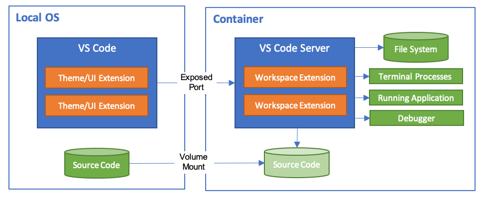
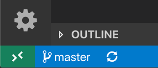
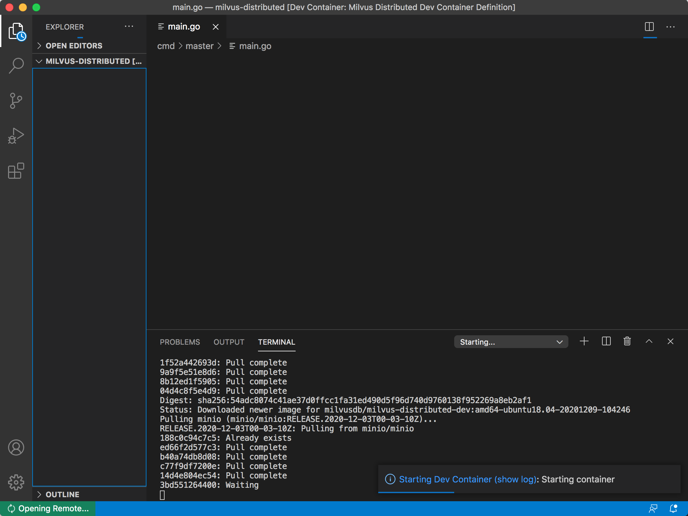
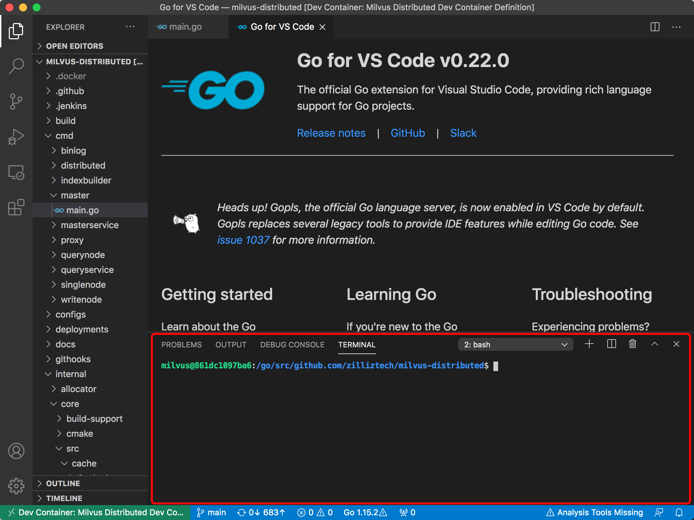
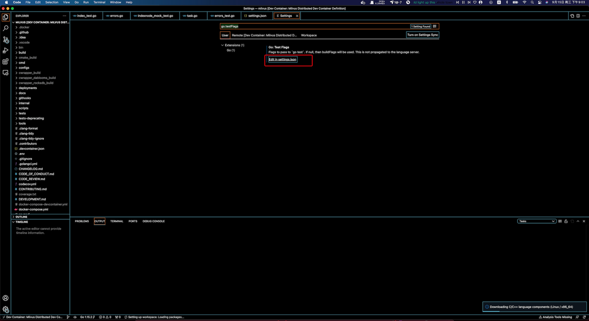

# Building Milvus with Docker

Building Milvus is easy if you take advantage of the containerized build environment. This document will help guide you through understanding this build process.

1. Docker, using one of the following configurations:
  * **macOS** Install Docker for Mac. See installation instructions [here](https://docs.docker.com/docker-for-mac/).
     **Note**: You will want to set the Docker VM to have at least 2 vCPU and 8GB of initial memory or building will likely fail.
  * **Linux with local Docker**  Install Docker according to the [instructions](https://docs.docker.com/installation/#installation) for your OS.
  * **Windows with Docker Desktop WSL2 backend**  Install Docker according to the [instructions](https://docs.docker.com/docker-for-windows/wsl-tech-preview/). Be sure to store your sources in the local Linux file system, not the Windows remote mount at `/mnt/c`.
2. **Optional** [Google Cloud SDK](https://developers.google.com/cloud/sdk/)

You must install and configure Google Cloud SDK if you want to upload your release to Google Cloud Storage and may safely omit this otherwise.

## Overview

While it is possible to build Milvus using a local golang installation, we have a build process that runs in a Docker container.  This simplifies initial set up and provides for a very consistent build and test environment.


## Before You Begin

Before building Milvus, you must check the eligibility of your Docker, Docker Compose, and hardware in line with Milvus' requirements.

<details><summary>Check your Docker and Docker Compose version</summary>

<li>Docker version 19.03 or higher is required. </li>

<div class="alert note">
Follow <a href="https://docs.docker.com/get-docker/">Get Docker</a> to install Docker on your system.
</div>

<li>Docker Compose version 1.25.1 or higher is required. </li>

<div class="alert note">
See <a href="https://docs.docker.com/compose/install/">Install Docker Compose</a> for Docker Compose installation guide.
</div>

</details>


<details><summary>Check whether your CPU supports SIMD extension instruction set</summary>

Milvus' computing operations depend on CPU’s support for SIMD (Single Instruction, Multiple Data) extension instruction set. Whether your CPU supports SIMD extension instruction set is crucial to index building and vector similarity search within Milvus. Ensure that your CPU supports at least one of the following SIMD instruction sets:

- SSE4.2
- AVX
- AVX2
- AVX512

Run the lscpu command to check if your CPU supports the SIMD instruction sets mentioned above:

```
$ lscpu | grep -e sse4_2 -e avx -e avx2 -e avx512
```
</details>


## Key scripts

The following scripts are found in the [`build/`](.) directory. Note that all scripts must be run from the Milvus root directory.

* [`build/builder.sh`](builder.sh): Run a command in a build docker container.  Common invocations:
  * `build/builder.sh make` Build just linux binaries in the container.  Pass options and packages as necessary.
  * `build/builder.sh make verifiers`: Run all pre-submission verification check
  * `build/builder.sh make unittest`: Run all unit tests
  * `build/builder.sh make clean`: Clean up all the generated files

You can specify a different OS for builder by setting `OS_NAME` which defaults to `ubuntu18.04`. Valid OS name are `ubuntu18.04`, `centos7`.

To specify `centos7` builder, use these command:

```shell
export OS_NAME=centos7
build/builder.sh make
```

## Dev Containers
Users can also get into the dev containers for development.

Enter root path of Milvus project on your host machine, execute the following commands:

```shell
$ ./scripts/devcontainer.sh up        # start Dev container

Creating network "milvus-distributed_milvus" with the default driver
Creating milvus_jaeger_1 ... done
Creating milvus_minio_1  ... done
Creating milvus_pulsar_1 ... done
Creating milvus_etcd_1   ... done
Creating milvus_ubuntu_1 ... done
```

Check running state of Dev Container:

```shell
$ docker-compose -f docker-compose-devcontainer.yml ps

      Name                    Command                  State                                      Ports
---------------------------------------------------------------------------------------------------------------------------------------
milvus_builder_1   /tini -- autouseradd --use ...   Up
milvus_etcd_1      etcd -advertise-client-url ...   Up             2379/tcp, 2380/tcp
milvus_jaeger_1    /go/bin/all-in-one-linux         Up             14250/tcp, 14268/tcp, 16686/tcp, 5775/udp, 5778/tcp, 6831/udp,
                                                                   6832/udp
milvus_minio_1     /usr/bin/docker-entrypoint ...   Up (healthy)   9000/tcp
milvus_pulsar_1    bin/pulsar standalone --no ...   Up
```

`milvus_builder_1` is the docker of milvus dev, other containers are used as unit test dependencies. you can run compilation and unit test inside the container, enter it:

```shell
docker exec -ti milvus_builder_1 bash
```

Compile the project and run unit test, see details at the [DEVELOPMENT.md](../DEVELOPMENT.md)

```shell
make all
```

```shell
make unittest
```

Stop Dev Container 

```shell
./scripts/devcontainer.sh down        # close Dev container
```

## E2E Tests

Milvus uses Python SDK to write test cases to verify the correctness of Milvus functions. Before run E2E tests, you need a running Milvus:

```shell
$ cd deployments/docker/dev
$ docker-compose up -d
$ cd ../../../
# Running Milvus
$ build/builder.sh /bin/bash -c "export ROCKSMQ_PATH='/tmp/milvus/rdb_data' && ./scripts/start_standalone.sh && cat"

# or

$ build/builder.sh /bin/bash -c "./scripts/start_cluster.sh && cat"
```

To run E2E tests, use these command:

```shell
MILVUS_SERVICE_IP=$(docker inspect -f '{{range .NetworkSettings.Networks}}{{.IPAddress}}{{end}}' $(docker-compose ps -q builder))
cd tests/docker
docker-compose run --rm pytest /bin/bash -c "pytest --host ${MILVUS_SERVICE_IP}"
```


## Basic Flow

The scripts directly under [`build/`](.) are used to build and test. They will ensure that the `builder` Docker image is built (based on [`build/docker/builder`] ) and then execute the appropriate command in that container. These scripts will both ensure that the right data is cached from run to run for incremental builds and will copy the results back out of the container. You can specify a different registry/name for `builder` by setting `IMAGE_REPO` which defaults to  `milvusdb`.

The `builder.sh` is execute by first creating a “docker volume“ directory in `.docker/`. The `.docker/` directory is used to cache the third-party package and compiler cache data. It speeds up recompilation by caching previous compilations and detecting when the same compilation is being done again.

## Debug on Host Machine

### Integrate vscode with docker

* Install [Visual Studio Code](https://code.visualstudio.com/)

* Install [Remote Development extension pack](https://marketplace.visualstudio.com/items?itemName=ms-vscode-remote.vscode-remote-extensionpack)

* Integrate with VS Code 

The working principle is as follows: mount the local file system to the workspace inside the container, or copy it to the container. The extension of vs code is installed inside the container and runs in it, so that the vs Code of the host can fully access the tools, platforms and file systems inside the container. This means that you just need to connect to different containers to switch the entire development environment seamlessly.



Taking the Milvus project as an example, there is a file named **.devcontainer.json** in the root directory of the project. This file describes how vs code accesses (or creates) a development container environment, and defines the container environment, working directory, extension tool set, etc.

* The steps to configure the development environment are as follows:

Start VS Code，in the command panel ( F1 ) input **“Remote-Containers: Open Folder in Container”** , then select the project folder which contains devcontainer.json file.

or click right-bottom corner button > <  , choose **“Remote-Containers: Open Folder in Container”**，then select the project folder which contains devcontainer.json file.





VS Code begin load and construct Devcontainer,  the progress bar display the construction state.




After Construction, VS Code automatically connects to the container. Now you can code and debug in VS Code, just like developing in your host machine.

You can also use terminal of VS Code to enter the Dev container to do something. Choose **Terminal >> New Terminal** in the navigation bar, then you can enter the container:



Modify vscode go setups if necessary, the setting path is **code -> preference -> settings** 

```shell
"go.testFlags": ["-v"]  //if you want say detailed output when running unit test
"go.coverOnSave": true  //if you want to show coverage
"go.lintOnSave": true   //if you want to auto golint and check code style
```



Enable Code debug by remot debugging with dlv, you can enable debugging by run the following command inside your docker:

```shell
cp /go/bin/dlv /go/bin/dlv-dap
```

### Integrate goland with docker
TBD

