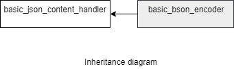

### jsoncons::bson::basic_bson_encoder

```c++
template<
    class Result>
> class basic_bson_encoder : public jsoncons::json_content_handler
```

`basic_bson_encoder` is noncopyable.

#### Header

    #include <jsoncons_ext/bson/bson_encoder.hpp>



Two specializations for common result types are defined:

Type                       |Definition
---------------------------|------------------------------
bson_encoder            |basic_bson_encoder<jsoncons::binary_stream_result>
bson_bytes_encoder     |basic_bson_encoder<jsoncons::binary_buffer_result>

#### Member types

Type                       |Definition
---------------------------|------------------------------
char_type                  |char
result_type                |Result
string_view_type           |

#### Constructors

    explicit basic_bson_encoder(result_type result)
Constructs a new encoder that writes to the specified result.

#### Destructor

    virtual ~basic_bson_encoder()

### Inherited from [basic_json_content_handler](../json_content_handler.md)

#### Member functions

    bool begin_object(semantic_tag tag=semantic_tag::none,
                      const ser_context& context=null_ser_context()); 

    bool begin_object(size_t length, 
                      semantic_tag tag=semantic_tag::none,
                      const ser_context& context=null_ser_context()); 

    bool end_object(const ser_context& context = null_ser_context())

    bool begin_array(semantic_tag tag=semantic_tag::none,
                     const ser_context& context=null_ser_context()); 

    bool begin_array(semantic_tag tag=semantic_tag::none,
                     const ser_context& context=null_ser_context()); 

    bool end_array(const ser_context& context=null_ser_context()); 

    bool name(const string_view_type& name, 
              const ser_context& context=null_ser_context()); 

    bool string_value(const string_view_type& value, 
                      semantic_tag tag = semantic_tag::none, 
                      const ser_context& context=null_ser_context());

    bool byte_string_value(const byte_string_view& b, 
                           semantic_tag tag=semantic_tag::none, 
                           const ser_context& context=null_ser_context()); 

    bool byte_string_value(const uint8_t* p, size_t size, 
                           semantic_tag tag=semantic_tag::none, 
                           const ser_context& context=null_ser_context()); 

    bool int64_value(int64_t value, 
                     semantic_tag tag = semantic_tag::none, 
                     const ser_context& context=null_ser_context());

    bool uint64_value(uint64_t value, 
                      semantic_tag tag = semantic_tag::none, 
                      const ser_context& context=null_ser_context()); 

    bool double_value(double value, 
                      semantic_tag tag = semantic_tag::none, 
                      const ser_context& context=null_ser_context()); 

    bool bool_value(bool value, 
                    semantic_tag tag = semantic_tag::none,
                    const ser_context& context=null_ser_context());  

    bool null_value(semantic_tag tag = semantic_tag::none,
                    const ser_context& context=null_ser_context());  

    void flush()

### Examples

#### Encode to BSON

```c++
#include <jsoncons/json.hpp>
#include <jsoncons_ext/bson/bson.hpp>
#include <iomanip>

int main()
{
    std::vector<uint8_t> buffer;
    bson::bson_bytes_encoder encoder(buffer);
    encoder.begin_array(); // The total number of bytes comprising 
                          // the bson document will be calculated
    encoder.string_value("cat");
    encoder.byte_string_value(byte_string({'p','u','r','r'}));
    encoder.int64_value(1431027667, semantic_tag::timestamp);
    encoder.end_array();
    encoder.flush();

    for (auto c : buffer)
    {
        std::cout << std::hex << std::setprecision(2) << std::setw(2) 
                  << std::noshowbase << std::setfill('0') << static_cast<int>(c);
    }
    std::cout << "\n\n";

/* 
    22000000 -- Total number of bytes comprising the document (34 bytes) 
      02 -- UTF-8 string
        3000 -- "0"
        04000000 -- number bytes in the string (including trailing byte)
          636174  -- "cat"
            00 -- trailing byte
      05 -- binary
        3100 -- "1"
        04000000 -- number of bytes
        70757272 -- 'P''u''r''r'
      09 -- datetime
      3200 -- "2"
        d3bf4b55 -- 1431027667
      00 
*/ 
}
```
Output:
```
2200000002300004000000636174000531000400000070757272093200d3bf4b5500
```
