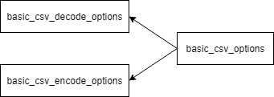

### jsoncons::csv::csv_options

```c++
typedef basic_csv_options<char> csv_options
```
Specifies options for encoding and decoding csv data. The `csv_options` class is an instantiation of the `basic_csv_options` class template that uses `char` as the character type.

#### Header
```c++
#include <jsoncons_ext/csv/csv_options.hpp>
```



#### Constructors

    csv_options()
Constructs an `csv_options` with default values. 

#### Modifiers
    basic_csv_options<CharT>& floating_point_format(chars_format value);
Overrides [floating point format](../chars_format.md) when serializing csv from json. For a floating point value that was previously decoded from json text, preserves the original format when serializing.For a floating point value that was directly inserted into a json value, serializes with [chars_format::general](chars_format.md).

    basic_csv_options<CharT>& precision(int value);
Overrides floating point precision when serializing csv from json. The default, For a floating point value that was previously decoded from json text, preserves the original precision. The fefault, For a floating point value that was directly inserted into a json value, serializes with shortest representation.

    basic_csv_options& header_lines(size_t value);
Number of header lines in the CSV text. Defaults to 1 if assume_header is true, otherwise 0

    basic_csv_options& assume_header(bool value);
Assume first row in file is header, use field names to construct objects. Default is `false`.         

    basic_csv_options& ignore_empty_values(bool value);
Do not read CSV fields that have empty values. Default is `false`.         

    basic_csv_options& ignore_empty_lines(bool value);
If set to true, all lines in the file that are empty (apart from record delimiter characters) are ignored. To ignore lines with only spaces or tabs, set trim to true. Default is `true`.         

    basic_csv_options& trim_leading(bool value);
Trim leading whitespace. Default is `false`.         

    basic_csv_options& trim_trailing(bool value);
Trim trailing whitespace. Default is `false`.         

    basic_csv_options& trim(bool value);
Trim both leading and trailing whitespace. Default is `false`.        

    basic_csv_options& trim_leading_inside_quotes(bool value);
Trim leading whitespace inside quote characters. Default is `false`.         

    basic_csv_options& trim_trailing_inside_quotes(bool value);
Trim trailing whitespace inside quote characters. Default is `false`.         

    basic_csv_options& trim_inside_quotes(bool value);
Trim both leading and trailing whitespace inside quote characters. Default is `false`.        

    basic_csv_options& unquoted_empty_value_is_null(bool value);
Replace empty field with json null value. Default is `false`.         

    basic_csv_options& column_names(const string_type& names);
A comma separated list of names corresponding to the fields in the file. Example: "bool-field,float-field,string-field"

    basic_csv_options& column_types(const string_type& types);
A comma separated list of data types corresponding to the columns in the file. The following data types are supported: string, integer, float and boolean. Example: "bool,float,string"}

    basic_csv_options& column_defaults(const string_type& defaults);
A comma separated list of strings containing default json values corresponding to the columns in the file. Example: "false,0.0,"\"\""

    basic_csv_options& field_delimiter(CharT value);
A delimiter character that indicates the end of a field. Default is `,`             

    basic_csv_options& subfield_delimiter(CharT value);
A delimiter character that indicates the end of a single value in a multi-valued field. Default is no multi-valued fields.

    basic_csv_options& line_delimiter(string_type value);
String to write between records. Default is \n.  

    basic_csv_options& quote_char(CharT value);
Quote character. Default is quote character "             

    basic_csv_options& infer_types(bool value);
Infer null, true, false, integers and floating point values in the CSV source. Default is `true`.

    basic_csv_options& lossless_number(bool value); 
If set to `true`, parse numbers with exponents and fractional parts as strings with semantic tagging `semantic_tag::bigdec`. Default is `false`.

    basic_csv_options& quote_escape_char(CharT value);
Character to escape quote character (by default the quote character is doubled). Default is quote character `"`.

    basic_csv_options& comment_starter(CharT value);
Character to comment out a line, must be at column 1. Default is no comments.

    basic_csv_options& quote_style(quote_style_type value);
quote_style_type::all, quote_style_type::minimal, quote_style_type::none, or quote_style_type::nonnumeric. Default is quote_style_type::minimal

    basic_csv_options& mapping(mapping_type value);
mapping_type::n_rows, mapping_type::n_objects, mapping_type::m_columns. If assume_header is true or column_names is not empty, defaults to mapping_type::n_rows, otherwise mapping_type::n_columns.

    basic_csv_options& max_lines(unsigned long value);
Maximum number of lines to read. Default is unlimited.

#### Static member functions

    static const basic_csv_options<CharT>& default_options()
Default CSV encode and decode options.

### See also

[csv_decode_options](csv_decode_options.md)
[csv_encode_options](csv_encode_options.md)

