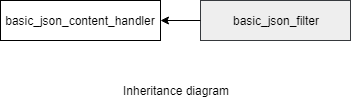

### jsoncons::json_filter

```c++
typedef basic_json_filter<char> json_filter
```

The `json_filter` class is an instantiation of the `basic_json_filter` class template that uses `char` as the character type.

`json_filter` is noncopyable and nonmoveable.

#### Header

    #include <jsoncons/json_filter.hpp>



#### Member types

Member type                         |Definition
------------------------------------|------------------------------
`string_view_type`|A non-owning view of a string, holds a pointer to character data and length. Supports conversion to and from strings. Will be typedefed to the C++ 17 [string view](http://en.cppreference.com/w/cpp/string/basic_string_view) if `JSONCONS_HAS_STRING_VIEW` is defined in `jsoncons_config.hpp`, otherwise proxied.  

#### Constructors

    json_filter(json_content_handler& handler)
All JSON events that pass through the `json_filter` go to the specified `json_content_handler` (e.g. another filter.)
You must ensure that the `handler` exists as long as does `json_filter`, as `json_filter` holds a pointer to but does not own this object.

#### Accessors

    json_content_handler& to_handler()
Returns a reference to the JSON handler that sends json events to a destination handler. 

### See also

- [json_content_handler](json_content_handler.md)

### Examples

#### Rename object member names with the built in filter [rename_object_member_filter](rename_object_member_filter.md)

```c++
#include <sstream>
#include <jsoncons/json.hpp>
#include <jsoncons/json_filter.hpp>

using namespace jsoncons;

int main()
{
    std::string s = R"({"first":1,"second":2,"fourth":3,"fifth":4})";    

    json_encoder encoder(std::cout);

    // Filters can be chained
    rename_object_member_filter filter2("fifth", "fourth", encoder);
    rename_object_member_filter filter1("fourth", "third", filter2);

    // A filter can be passed to any function that takes
    // a json_content_handler ...
    std::cout << "(1) ";
    std::istringstream is(s);
    json_reader reader(is, filter1);
    reader.read();
    std::cout << std::endl;

    // or a json_content_handler    
    std::cout << "(2) ";
    ojson j = ojson::parse(s);
    j.dump(filter1);
    std::cout << std::endl;
}
```
Output:
```json
(1) {"first":1,"second":2,"third":3,"fourth":4}
(2) {"first":1,"second":2,"third":3,"fourth":4}
```

#### Fix up names in an address book JSON file

Example address book file (`address-book.json`):
```json
{
    "address-book" : 
    [
        {
            "name":"Jane Roe",
            "email":"jane.roe@example.com"
        },
        {
             "name":"John",
             "email" : "john.doe@example.com"
         }
    ]
}
```

Suppose you want to break the name into a first name and last name, and report a warning when `name` does not contain a space or tab separated part. 

You can achieve the desired result by subclassing the [json_filter](json_filter.md) class, overriding the default methods for receiving name and string value events, and passing modified events on to the parent [json_content_handler](json_content_handler.md) (which in this example will forward them to a [json_encoder](json_encoder.md).) 
```c++
#include <jsoncons/json_encoder.hpp>
#include <jsoncons/json_filter.hpp>
#include <jsoncons/json_reader.hpp>

using namespace jsoncons;


class name_fix_up_filter : public json_filter
{
    std::string member_name_;

public:
    name_fix_up_filter(json_content_handler& handler)
        : json_filter(handler)
    {
    }

private:
    bool do_name(const string_view_type& name, 
                 const ser_context& context) override
    {
        member_name_ = name;
        if (member_name_ != "name")
        {
            this->to_handler().write_name(name, context);
        }
        return true;
    }

    bool do_string_value(const string_view_type& s, 
                         const ser_context& context) override
    {
        if (member_name_ == "name")
        {
            size_t end_first = val.find_first_of(" \t");
            size_t start_last = val.find_first_not_of(" \t", end_first);
            this->to_handler().write_name("first-name", context);
            string_view_type first = val.substr(0, end_first);
            this->to_handler().value(first, context);
            if (start_last != string_view_type::npos)
            {
                this->to_handler().write_name("last-name", context);
                string_view_type last = val.substr(start_last);
                this->to_handler().value(last, context);
            }
            else
            {
                std::cerr << "Incomplete name \"" << s
                   << "\" at line " << context.line()
                   << " and column " << context.column() << std::endl;
            }
        }
        else
        {
            this->to_handler().value(s, context);
        }
        return true;
    }
};
```
Configure a [rename_object_member_filter](rename_object_member_filter.md) to emit json events to a [json_encoder](json_encoder.md). 
```c++
std::ofstream os("output/new-address-book.json");
json_encoder encoder(os, jsoncons::indenting::indent);
name_fix_up_filter filter(encoder);
```
Parse the input and send the json events into the filter ...
```c++
std::cout << "(1) ";
std::ifstream is("input/address-book.json");
json_reader reader(is, filter);
reader.read();
std:: << "\n";
```
or read into a json value and write to the filter
```c++
std::cout << "(2) ";
json j;
is >> j;
j.dump(filter);
std:: << "\n";
```
Output:
```
(1) Incomplete name "John" at line 9 and column 26 
(2) Incomplete name "John" at line 0 and column 0
```
Note that when filtering `json` events written from a `json` value to an output handler, contexual line and column information in the original file has been lost. 
```

The new address book (`address-book-new.json`) with name fixes is
```json
{
    "address-book":
    [
        {
            "first-name":"Jane",
            "last-name":"Roe",
            "email":"jane.roe@example.com"
        },
        {
            "first-name":"John",
            "email":"john.doe@example.com"
        }
    ]
}
```

