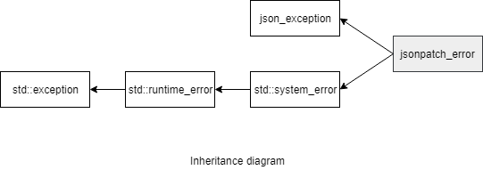

### jsoncons::jsonpatch::jsonpatch_error

#### Header

    #include <jsoncons/jsonpointer/jsonpatch_error.hpp>

`jsoncons::jsonpatch::jsonpatch_error` defines an exception type for reporting failures in jsonpatch operations.



#### Constructors

    jsonpatch_error(std::error_code ec)

    jsonpatch_error(const jsonpatch_error& other)

#### Member functions

    const char* what() const noexcept
Returns a message for this exception

#### Inherited from std::system_error

    const std::error_code code() const noexcept
Returns an error code for this exception

### Example

```c++
#include <jsoncons/json.hpp>
#include <jsoncons_ext/jsonpatch/jsonpatch.hpp>

using jsoncons::json;

int main()
{
    json target = R"(
        { "foo": "bar"}
    )"_json;

    json patch = R"(
        [
            { "op": "add", "path": "/baz", "value": "qux" },
            { "op": "add", "path": "/foo", "value": [ "bar", "baz" ] },
            { "op": "add", "path": "/baz/bat", "value": "qux" } // nonexistent target
        ]
    )"_json;

    try
    {
        jsonpatch::apply_patch(target, patch);
    }
    catch (const jsonpatch::jsonpatch_error& e)
    {
        std::cout << "(1) " << e.what() << std::endl;
        std::cout << "(2) " << target << std::endl;
    }
}
```

Output:
```
(1) JSON Patch add operation failed
(2) {"foo":"bar"}
```
