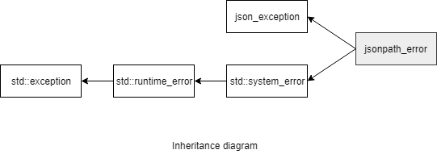

### jsoncons::jsonpath_error

#### Header

    #include <jsoncons_ext/jsonpath/jsonpath_error.hpp>

`jsoncons::jsonpath::jsonpath_error` defines an exception type for reporting failures in jsonpath queries.

#### Constructors

    jsonpath_error(std::error_code ec);

    jsonpath_error(std::error_code ec, size_t line, size_t column);

    jsonpath_error(const jsonpath_error& other);

#### Member functions

    size_t line() const noexcept
Returns the line number to the end of the text where the exception occurred.
Line numbers start at 1.

    size_t column() const noexcept
Returns the column number to the end of the text where the exception occurred.
Column numbers start at 1.

    const char* what() const noexcept
Constructs an error message, including line and column position

#### Inherited from std::system_error

    const std::error_code code() const noexcept
Returns an error code for this exception

### Example

