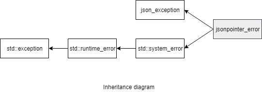

### jsoncons::jsonpointer::jsonpointer_error

#### Header

    #include <jsoncons/jsonpointer/jsonpointer_error.hpp>

`jsoncons::jsonpointer::jsonpointer_error` defines an exception type for reporting failures in jsonpointer operations.



#### Constructors

    jsonpointer_error(std::error_code ec)

    jsonpointer_error(const jsonpointer_error& other)

#### Member functions

    const char* what() const noexcept
Returns an error message

#### Inherited from std::system_error

    const std::error_code code() const noexcept
Returns an error code for this exception

### Example

```c++
#include <jsoncons/json.hpp>
#include <jsoncons_ext/jsonpointer/jsonpointer.hpp>

using jsoncons::json;

int main()
{
    string s = "[1,2,3,4,]";
    try 
    {
        jsoncons::json val = jsoncons::json::parse(s);
    } 
    catch(const jsoncons::jsonpointer_error& e) 
    {
        std::cout << "Caught jsonpointer_error with category " 
                  << e.code().category().name() 
                          << ", code " << e.code().value() 
                  << " and message " << e.what() << std::endl;
    }
}
```

Output:
```
Caught jsonpointer_error with category jsoncons.jsonpointer, code 0x6 and message "Name not found"
```
