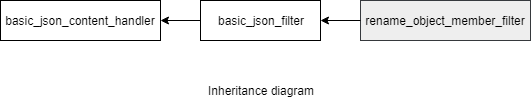

### jsoncons::rename_object_member_filter

```c++
typedef basic_rename_object_member_filter<char> rename_object_member_filter;
```
The `rename_object_member_filter` class is an instantiation of the `basic_rename_object_member_filter` class template that uses `char` as the character type. 

Renames object member names. 

#### Header
```c++
#include <jsoncons/json_filter.hpp>
```



#### Constructors

    rename_object_member_filter(const std::string& name,
                                const std::string& new_name,
                                json_content_handler& handler)

    rename_object_member_filter(const std::string& name,
                                const std::string& new_name,
                                json_content_handler& handler)

### See also

- [json_filter](json_filter.md)

### Examples

#### Rename object member names

```c++
#include <jsoncons/json.hpp>
#include <jsoncons/json_filter.hpp>

using namespace jsoncons;

int main()
{
    ojson j = ojson::parse(R"({"first":1,"second":2,"fourth":3})");

    json_encoder encoder(std::cout);

    rename_object_member_filter filter("fourth","third",encoder);
    j.dump(filter);
}
```
Output:
```json
{"first":1,"second":2,"third":3}
```

