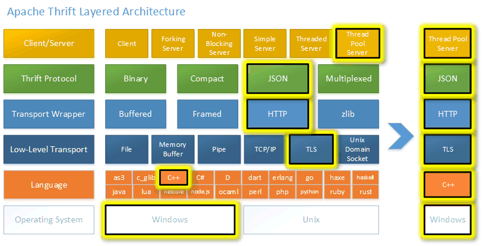

Apache Thrift
=============

Introduction
============

Thrift is a lightweight, language-independent software stack with an
associated code generation mechanism for point-to-point RPC. Thrift provides 
clean abstractions for data transport, data serialization, and application
level processing. The code generation system takes a simple definition
language as input and generates code across programming languages that
uses the abstracted stack to build interoperable RPC clients and servers.

Thrift makes it easy for programs written in different programming
languages to share data and call remote procedures.  With support 
for [25 programming languages](LANGUAGES.md), chances are Thrift 
supports the languages that you currently use.

Thrift is specifically designed to support non-atomic version changes
across client and server code.

For more details on Thrift's design and implementation, see the Thrift
whitepaper included in this distribution, or at the README.md file
in your particular subdirectory of interest.

Status
======

| Branch | Travis | Appveyor | Coverity Scan | codecov.io | Website |
| :----- | :----- | :------- | :------------ | :--------- | :------ |
| [`master`](https://github.com/apache/thrift/tree/master) |  |  |  | |  |

Releases
========

Thrift does not maintain a specific release calendar at this time.  

We strive to release twice yearly.  Download the [current release](http://thrift.apache.org/download).

License
=======

Licensed to the Apache Software Foundation (ASF) under one
or more contributor license agreements. See the NOTICE file
distributed with this work for additional information
regarding copyright ownership. The ASF licenses this file
to you under the Apache License, Version 2.0 (the
"License"); you may not use this file except in compliance
with the License. You may obtain a copy of the License at

  http://www.apache.org/licenses/LICENSE-2.0

Unless required by applicable law or agreed to in writing,
software distributed under the License is distributed on an
"AS IS" BASIS, WITHOUT WARRANTIES OR CONDITIONS OF ANY
KIND, either express or implied. See the License for the
specific language governing permissions and limitations
under the License.

Project Hierarchy
=================

thrift/

  compiler/

    Contains the Thrift compiler, implemented in C++.

  lib/

    Contains the Thrift software library implementation, subdivided by
    language of implementation.

    cpp/
    go/
    java/
    php/
    py/
    rb/
    ...

  test/

    Contains sample Thrift files and test code across the target programming
    languages.

  tutorial/

    Contains a basic tutorial that will teach you how to develop software
    using Thrift.

Development
===========

To build the same way Travis CI builds the project you should use docker.
We have [comprehensive building instructions for docker](build/docker/README.md).

Requirements
============

See http://thrift.apache.org/docs/install for a list of build requirements (may be stale).  Alternatively see the docker build environments for a list of prerequisites.

Resources
=========

More information about Thrift can be obtained on the Thrift webpage at:

     http://thrift.apache.org

Acknowledgments
===============

Thrift was inspired by pillar, a lightweight RPC tool written by Adam D'Angelo,
and also by Google's protocol buffers.

Installation
============

If you are building from the first time out of the source repository, you will
need to generate the configure scripts.  (This is not necessary if you
downloaded a tarball.)  From the top directory, do:

    ./bootstrap.sh

Once the configure scripts are generated, thrift can be configured.
From the top directory, do:

    ./configure

You may need to specify the location of the boost files explicitly.
If you installed boost in /usr/local, you would run configure as follows:

    ./configure --with-boost=/usr/local

Note that by default the thrift C++ library is typically built with debugging
symbols included. If you want to customize these options you should use the
CXXFLAGS option in configure, as such:

    ./configure CXXFLAGS='-g -O2'
    ./configure CFLAGS='-g -O2'
    ./configure CPPFLAGS='-DDEBUG_MY_FEATURE'

To enable gcov required options -fprofile-arcs -ftest-coverage enable them:

    ./configure  --enable-coverage

Run ./configure --help to see other configuration options

Please be aware that the Python library will ignore the --prefix option
and just install wherever Python's distutils puts it (usually along
the lines of /usr/lib/pythonX.Y/site-packages/).  If you need to control
where the Python modules are installed, set the PY_PREFIX variable.
(DESTDIR is respected for Python and C++.)

Make thrift:

	make

From the top directory, become superuser and do:

	make install

Note that some language packages must be installed manually using build tools
better suited to those languages (at the time of this writing, this applies
to Java, Ruby, PHP).

Look for the README.md file in the lib/<language>/ folder for more details on the
installation of each language library package.

Testing
=======

There are a large number of client library tests that can all be run
from the top-level directory.

          make -k check

This will make all of the libraries (as necessary), and run through
the unit tests defined in each of the client libraries. If a single
language fails, the make check will continue on and provide a synopsis
at the end.

To run the cross-language test suite, please run:

          make cross

This will run a set of tests that use different language clients and
servers.

