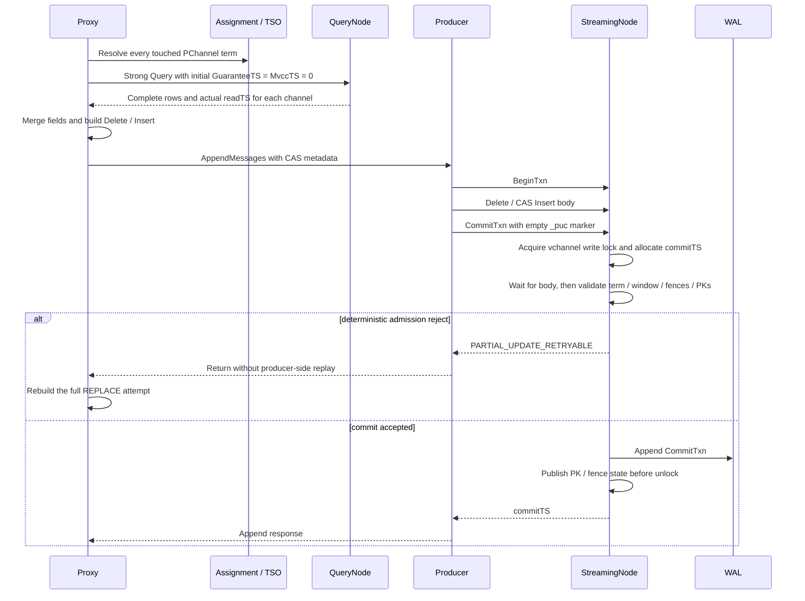

# MEP: Optimistic CAS for Partial Updates

- **Created:** 2026-06-01
- **Feature DRI:** @weiliu1031
- **Primary Approver:** @chyezh
- **Independent Approver:** @liliu-z
- **Design Review:** 2026-08-07
- **Component:** Proxy / StreamingNode / Streaming
- **Related Issues:** [#49980](https://github.com/milvus-io/milvus/issues/49980)
- **Released:** N/A

## Summary

The Strong-read extension at the end of this document replaces the first
fixed-snapshot reads with Strong reads for both initial attempts and CAS
retries. It assumes every participating component is upgraded and adds actual
query snapshot reporting and a WAL lifecycle history floor. The extension is
pending review; the review metadata above applies to the original CAS design.

Milvus partial update currently uses a read-merge-write flow. Proxy reads the
current row, merges the user-provided fields into a complete row, and writes a
standard Delete/Insert transaction. Two concurrent requests can read the same
snapshot and silently overwrite each other's changes because commit does not
validate the snapshot used by the merge.

This proposal keeps query and merge in Proxy and adds optimistic commit
admission at StreamingNode. Every attempt follows this order:

```text
resolve all touched PChannel terms
  -> Strong query and collect actual per-channel readTS
  -> merge
  -> commit(term, readTS)
```

StreamingNode maintains an in-memory, per-WAL-term index of recent primary-key
writes. A local partial-update `CommitTxn` acquires the existing vchannel write
lock, validates the observed term and read snapshot, appends the commit, and
publishes the transaction write set before releasing the lock.

The design does not add a public RPC, SDK field, configuration option,
partial-update-specific WAL message type, or persistent row-version store.
Downstream consumers continue to receive standard Delete/Insert transactions.

## Motivation

Consider a row with two independently updated fields:

```text
initial row:       {pk: 1, name: "old", score: 10}
request A updates: {pk: 1, name: "new"}
request B updates: {pk: 1, score: 20}
```

Without commit validation, both requests can read the initial row. Request A
writes `{name: "new", score: 10}` and request B writes
`{name: "old", score: 20}`. Whichever commits last destroys the other update.

Proxy already owns the complete partial-update semantics, including nullable
and default values, dynamic fields, generated function output, relative array
operations, partition-key validation, and row merge. Moving query and merge to
StreamingNode would duplicate these responsibilities and add QueryCoord and
QueryNode dependencies to the WAL owner.

StreamingNode already owns the WAL ordering point. Commit-side optimistic
validation therefore provides the required lost-update protection while
preserving the existing read and merge path.

### Goals

- Prevent lost updates when concurrent partial updates modify the same PK.
- Keep query routing, schema handling, function generation, and merge in Proxy.
- Keep the persisted data path as standard Delete/Insert WAL transactions.
- Reject stale attempts after a PChannel term change.
- Preserve correctness across WAL recovery and transaction replay without
  rebuilding historical row-level state.
- Bound the memory used for recent PK versions and fail closed when the retained
  history is incomplete.
- Retry only operations that can safely rebuild the complete request.

### Non-Goals

- Cross-vchannel or cross-collection atomicity.
- Strict serializability.
- A persistent row-version store.
- Transaction-level exactly-once semantics or an idempotency token.
- Automatic replay of relative `ARRAY_APPEND` or `ARRAY_REMOVE` operations
  after a deterministic CAS conflict.
- Correctness when partial update runs concurrently with Import,
  RestoreSnapshot, or backfill visibility changes.
- A feature flag or runtime activation gate.

## Public Interfaces

### Public API and SDK behavior

No public RPC or SDK request field is added. Existing partial-update requests
continue to use the current Upsert API.

The observable behavior changes are:

- A conflicting replacement update is rebuilt and retried by Proxy.
- A conflicting relative update returns
  `ErrCollectionPartialUpdateConflict` with `Retriable=false`.
- A replacement update that exhausts its retry budget returns
  `ErrServiceUnavailable` with `Retriable=true`.
- AutoID partial update preserves existing PKs. Missing rows receive new AutoIDs
  and use insert semantics; the mutation result returns the destination PKs in
  request order.

Ordinary non-partial AutoID upsert continues to allocate a new PK.

### Internal protocol

The internal message proto adds attempt-scoped commit-admission proof:

```proto
message PartialUpdateCAS {
    uint64 read_ts = 1;
    int64 observed_pchannel_term = 2;
}
```

`read_ts` and `observed_pchannel_term` cannot be derived by StreamingNode
and therefore come from Proxy. Collection and PK identity are not duplicated
in the proof: StreamingNode reads `collection_id` and `schema_version`
from the Insert header, then resolves the authoritative PK descriptor from
ShardManager.

The internal streaming error enum adds:

```proto
STREAMING_CODE_PARTIAL_UPDATE_RETRYABLE = 17;
```

The metadata is encoded in the Insert body's
`MsgBase.Properties["_puc"]`. The outer message property uses the same key
with an empty value as a control marker. The outer marker contains no PK,
`readTS`, term, or other user data.

### Configuration and metrics

The proposal adds one internal, non-refreshable StreamingNode configuration
parameter. The remaining values are internal constants:

| Parameter or constant | Default | Purpose |
|---|---|---|
| `defaultVersionIndexTTL` | 30 seconds | Limits how long each vchannel retains recent PK-write versions and also bounds the valid window from `readTS` to `commitTS` for one partial-update attempt. When the window is exceeded, StreamingNode returns a retryable CAS rejection; Proxy automatically retries only replacement updates that can be rebuilt safely. |
| `streaming.partialUpdate.versionIndexMaxBytes` | 640,000,000 bytes, approximately 610 MiB | Caps the estimated memory used by all PK-version indexes on one StreamingNode. When the shared budget is unavailable, ordinary writes continue, but CAS on the affected vchannel fails closed until the omitted write leaves the valid read window. |
| `partialUpdateCASMaxRetryAttempts` | 5 attempts, including the first attempt | Limits the total number of Proxy attempts used to rebuild a complete replacement update after a deterministic CAS conflict. Requests containing relative field operations do not use this automatic retry. |
| `partialUpdateCASRetryBackoff` | Starts at 10 ms with exponential backoff; each sleep is capped at 40 ms | Controls the delay between Proxy CAS attempts and reduces sustained contention caused by immediately retrying concurrent conflicts. The 40 ms cap is calculated as `4 * partialUpdateCASRetryBackoff`. |

The PK-index budget is an estimate, not a hard process-RSS limit. Each Int64 PK
entry is charged 128 bytes; each VarChar PK entry is charged
`128 + PK byte length`. StreamingNode exports node-level used-byte,
configured-limit, and missed-write metrics for this shared budget.

### Durable format

The proposal adds no new WAL message type. BeginTxn, Delete, Insert, and
CommitTxn keep their existing formats and transaction semantics. CAS metadata
uses an existing properties map inside the Insert body, and the commit marker
uses the existing outer properties map.

No persistent PK index, schema migration, or restore-time gate is introduced.

## Design Details

### Correctness invariants

The design depends on six invariants:

1. **Attempt proof:** a term snapshot and `readTS` belong to the same attempt,
   and terms are resolved before the Strong query starts.
2. **Exact query snapshot:** every CAS `readTS` is the nonzero snapshot
   reported by that channel's successful Strong query.
3. **Atomic admission boundary:** local CAS validation, CommitTxn append, write
   publication, and transaction transition are serialized by the same
   vchannel write lock.
4. **Complete write coverage:** every supported WAL write that changes logical
   row data updates either exact PK versions or a conservative fence.
5. **Fail closed:** missing history, malformed proof, or incomplete local CAS
   recovery never degrades to an unchecked ordinary commit.
6. **Authoritative write identity:** a CAS Insert derives its collection and
   schema version from the Insert header and its PK field from ShardManager;
   attempt proof never supplies a competing collection or PK identity.

### Architecture and state ownership


| State | Owner | Lifetime | Persistence |
|---|---|---|---|
| Original partial payload, attempt `readTS`, and vchannel term snapshot | Proxy `upsertTask` | One client request; rebuilt per retry | None |
| Local transaction packaging and empty `_puc` commit marker | Producer | One vchannel message group | Standard WAL properties |
| PChannel global lock and keyed vchannel RW locks | Lock interceptor | One WAL instance | None |
| `pendingTxn`, PK versions, collection fences, and incomplete-txn fences | Partial-update interceptor | One PChannel WAL term | None |
| PK-version byte budget and aggregate used/limit/missed-write metrics | Partial-update interceptor builder | One StreamingNode process | None |
| Live and recovered transaction sessions | TxnManager | Transaction and WAL recovery lifecycle | Existing TxnBuffer recovery |
| Collection schema and immutable PK descriptor | ShardManager | Collection lifecycle in one WAL | Existing recovery snapshot |

Each WAL open creates independent PK, fence, and transaction state, while all
WALs built by the StreamingNode share one byte budget. The interceptor does not
reconstruct row-level proof from TxnBuffer. Closing a WAL releases its maps and
heaps and returns their estimated bytes to the node-wide budget.

### End-to-end flow



Proxy fans the request out with the existing PK hash or namespace-sharding
rules. Each vchannel group is an independent transaction. The design does not
make a multi-vchannel request atomic.

### Proxy attempt construction

Proxy builds the first attempt and every eligible retry in the same order:

```text
clone original user fields and overlay previously allocated AutoIDs by row
  -> generate function output
  -> resolve and snapshot terms for all possible write channels
     (all collection shards for AutoID, or the fixed namespace channel)
  -> enqueue a new Strong Query with GuaranteeTimestamp = MvccTimestamp = 0
  -> collect actual nonzero readTS from each successful write channel
  -> normalize fields and validate row alignment
  -> classify existing and missing rows, validate insert fields for missing rows
  -> if an unconverted AutoID PK is missing: allocate
     its destination PK, record the row-to-ID mapping, update the working PK column
  -> select final write channels from this query's captured terms and snapshots
  -> merge without querying freshly allocated IDs
  -> attach that channel's term and readTS to every CAS Insert chunk
```

The outer task ID and `BeginTs` remain stable across retries. Each Strong query
receives its own BeginTs from normal query scheduling; Proxy does not allocate
a separate CAS read timestamp. Strong optimization may use the current WAL MVCC
barrier, and QueryNode reports the snapshot actually used for the returned rows.
Every retry discards prior proofs and query results before rebuilding. WAL
lifecycle floor validation ensures a snapshot cannot precede the history covered
by the current owner's index, even if the PChannel term did not change.

### Query and merge semantics

Proxy retains the existing merge implementation, including:

- nullable and default values;
- dynamic fields;
- generated function output;
- relative array operations;
- compact nullable-vector representation;
- partition-key immutability validation.

For AutoID collections, a PK present in the query snapshot keeps its identity.
A missing PK selects insert semantics and receives a fresh AutoID. This decision
uses the source row's query snapshot; a later insert of the supplied source PK
does not redirect the newly allocated entity back to that source PK. Required
insert fields must be supplied, while nullable/default fields use the ordinary
partial-update insert merge rules.

If a required field is missing, Proxy returns a non-retriable parameter error
identifying the first missing PK, explaining
that the PK was absent from the query scope and insert fallback needs the named
field. For example: `partial update: primary key 100 does not exist
in the query scope; cannot insert a new entity: missing required field "vector"`.
The query scope includes the requested partition and namespace; absence here
must not be interpreted as absence from every partition in the collection.

Proxy keeps the original user fields immutable and stores allocated AutoIDs in
a separate map keyed by the original request row offset. Initial preparation
and CAS retries share the same entry point: clone the original fields, overlay
allocated IDs, generate function output, prepare CAS terms, query, and merge.
`checkPartialUpdatePrimaryFieldData` centralizes PK validation, conversion,
replacement, collision checking, and ID parsing. It reuses the existing
primary-field generation and field-update helpers and publishes a replaced
column only after all checks pass. The task owns allocation and retry state;
the PK helper does not access the allocator or WAL. The PK payload type and row count are
validated before allocating IDs. Primary keys are not supported as function
inputs; allocating AutoIDs retains the existing function outputs.
Field normalization and alignment validation precede row classification and
allocation. Allocation replaces only the working PK column; it does not restore
the original payload or discard normalized values.
Each attempt executes one Strong query. Freshly allocated AutoIDs take insert
semantics without another existence query. Before reading, Proxy captures terms
for every possible destination channel (all collection shards for AutoID, unless
namespace routing fixes one channel), then binds the actual query snapshots.
After allocation it retains only the final write channels and their original
proofs; missing proofs fail closed. Terms and timestamps are not resampled after
allocation. This relies on the normal AutoID allocator's uniqueness guarantee.
AutoID and non-AutoID collections share row classification, required-field
validation, and merge. Allocation consumes the missing-row offsets, and merge
uses the same classification.
The original input is never overwritten by allocated IDs or merged values.
After each successful allocation, Proxy saves the complete destination IDs in
request order. Message packing continues to use merge order; `PostExecute`
publishes the saved IDs without looking up or parsing the PK column again.

Allocated IDs remain stable throughout the request's internal CAS retries,
even when still absent. If another vchannel already committed a generated row,
the next read sees that destination row and rebuilds an update at the same PK.
This retains the existing REPLACE retry behavior without allocating duplicate
entities. Relative operations still do not retry automatically, and unknown
append outcomes still stop retries. This is not cross-request deduplication:
a new client request has a new allocation lifecycle.

A missing source PK produces no Delete. An insert under its new AutoID therefore
writes only the destination vchannel; if later retried as an update, its Delete
and Insert both use that same AutoID. A batch can still span multiple vchannels,
whose transactions commit independently; there is no cross-vchannel atomicity.
After successful execution, Proxy returns destination IDs in input-row order,
while message packing continues to use the merged row order.

### CAS metadata and encryption

Proxy derives the final write vchannels from the current request PKs, including
allocated destination AutoIDs. It selects their proofs from those captured by
the single query; the missing source PK is not included in Delete or final CAS
solely because it was used for the initial lookup. CAS metadata contains only the attempt `readTS` and observed PChannel term; it does not
duplicate the collection ID, schema version, PK field ID, or PK list.

For every CAS Insert, StreamingNode:

1. reads `collection_id` and `schema_version` from the Insert header;
2. requires `schema_version` to be explicitly present;
3. resolves the immutable PK descriptor through ShardManager;
4. decodes the complete Insert body with the generated protobuf codec and
   extracts the descriptor's PK field and CAS metadata;
5. verifies that all CAS chunks in the transaction use the same proof,
   collection, and schema version.

Ordinary legacy Insert keeps its existing rolling-upgrade behavior and may
omit `schema_version`. Only CAS Insert requires an explicit version.

The message builder writes metadata into the Insert body before encryption and
before `BuildMutable()`. When cluster encryption is enabled, the proof is
inside the same encrypted boundary as the DML payload.

Insert and Delete tracking decode complete DML bodies and keep extracted PKs in
typed Int64/VarChar slices. This intentionally accepts the CPU, allocation, GC,
and append-latency cost of decoding unrelated fields, including vectors, to
keep protobuf wire compatibility owned by generated code instead of a custom
parser. If an encrypted payload cannot be decrypted, the current append returns
an error; the StreamingNode process does not panic.

The empty outer `_puc` marker only selects the transaction and lock paths.
After packing, Proxy verifies that:

- every prepared vchannel produced at least one CAS Insert;
- every CAS Insert carries the marker;
- every Insert vchannel belongs to the attempt snapshot;
- no final message exceeds the transport limit.

Missing metadata or a missing marker is an internal invariant violation. Proxy
does not rewrite an already constructed or encrypted body.

### Final-envelope packing

The existing entity-size packer does not include the later streaming header,
schema version, CAS metadata, outer properties, or encrypted envelope. An
entity-only-valid chunk can therefore exceed `pulsar.maxMessageSize` after final
construction.

CAS Insert uses two-stage packing:

1. Run the existing entity packer and retain the original row offsets for each
   chunk.
2. Add the streaming header, CAS metadata, and cipher through the message
   builder.
3. Check `EstimateSize()` on the final message.
4. If a multi-row message is oversized, bisect its contiguous row-offset range
   and rebuild both halves.
5. If a single-row message is still oversized, return
   `ErrParameterTooLarge` before WAL append.
6. Treat any oversized message that escapes this packer as an internal
   invariant violation.

Using contiguous original row-offset ranges preserves row order, field
alignment, partition, vchannel, and attempt metadata. Ordinary non-CAS Insert
keeps the existing packing path.

### Producer transaction packaging

`AppendMessages` groups DML by vchannel. A local group containing a CAS Insert
always uses a transaction, even if it contains only one Insert:

```text
BeginTxn
  -> transaction body
  -> CommitTxn with empty _puc marker
```

The producer does not rewrap a message that already has a `TxnContext` or
`ReplicateHeader`. Replicated messages preserve the source transaction
boundary.

The resumable producer immediately returns
`STREAMING_CODE_PARTIAL_UPDATE_RETRYABLE` to Proxy. It must not retry a
transaction that carries stale merged rows. If a local CAS transaction expires
before commit, the producer converts `TxnExpired` into the same CAS retry signal
so Proxy can rebuild the complete attempt.

Other transport failures keep the existing resumable-producer behavior.
BeginTxn, body, or CommitTxn can be retried after a stream failure, and the
final client outcome may be ambiguous. This proposal does not add
transaction-level idempotency.

### Interceptor ordering and admission lock

The append chain is:

```text
redo -> lock -> replicate -> timetick -> shard -> partialupdate -> WAL
```

The lock interceptor is the outer concurrency boundary:

| Message | Lock |
|---|---|
| Ordinary DML, transaction body, ordinary CommitTxn | `glock.RLock + vchannel.RLock` |
| Local CAS CommitTxn | `glock.RLock + vchannel.Lock` |
| Vchannel-exclusive DDL | `glock.RLock + vchannel.Lock` |
| PChannel-exclusive DDL | `glock.Lock` |

All non-PChannel-exclusive paths acquire the PChannel lock first and then the
vchannel lock. They release in reverse order.

A local CAS CommitTxn has a dedicated lock branch. It must not reuse the
exclusive-DDL cleanup path because that path calls `FailTxnAtVChannel` and
would terminate the transaction being committed.

The local CAS critical region is:

```text
acquire glock.RLock + vchannel.Lock
  -> replicate validation
  -> allocate commitTS
  -> RequestCommitAndWait
  -> validate marker and runtime state
  -> validate term, read window, fences, and PK versions
  -> append CommitTxn
  -> publish PK / fence state
  -> CommitDone or RejectCommit
release vchannel.Lock + glock.RUnlock
```

Ordinary writers hold the same vchannel read lock through WAL append and index
publication. Therefore:

- if an ordinary write enters first, CAS waits and validates after its
  publication;
- if CAS enters first, later ordinary writes wait until CommitTxn append and
  CAS publication finish;
- two CAS commits on the same vchannel serialize, even for different PKs;
- different vchannels remain independent.

The lock covers only the commit critical section. Proxy query and merge, and
transaction-body production, remain outside the exclusive section.

### Transaction state and atomic publication

The partial-update interceptor maintains `pendingTxn` in two phases for each
body message:

- before the inner append, it extracts and validates the attempt proof, derives
  collection and schema identity from the Insert header, resolves the PK
  descriptor from ShardManager, and registers the proof and derived scope. If
  any CAS chunk in the same transaction differs in proof, collection, or
  schema version, that body is rejected before it reaches the WAL backend;
- only after the inner append succeeds does it record whether the current
  interceptor lifecycle observed BeginTxn, the exact PK write set extracted
  from Insert and Delete, and an optional collection-wide fence.

Transaction bodies may append concurrently, so `pendingTxn` is protected by a
mutex. `RequestCommitAndWait` guarantees that no body remains in flight before
commit validation snapshots the write set.

Marker validation is fail closed:

- runtime CAS metadata without a local commit marker is unrecoverable;
- a marker with an observed BeginTxn but no valid proof, derived collection and
  schema scope, or PK write set is unrecoverable;
- a recovered local CAS that lacks a complete runtime proof is retryable and
  never reaches the WAL backend.

Commit admission uses the collection ID stored in `pendingTxn`, never a
collection ID supplied by CAS metadata, for collection-fence validation.

CAS validation runs before the inner CommitTxn append. A deterministic
admission reject is marked separately from a WAL append error:

- admission reject calls `RejectCommit()` and does not publish a write set;
- successful append publishes with the CommitTxn time tick before unlock;
- WAL append error does not publish, but `TxnSession` keeps the existing
  `CommitDone()` transition because the error cannot prove that the commit was
  not persisted.

This distinction changes only the in-process transaction transition. It does
not provide an exactly-once client outcome.

### Per-term PK version index

Each PChannel WAL term owns an independent registry, split by vchannel:

```text
registry[vchannel].pkLastWriteTS[pk] = lastCommitTS
```

The conflict rule is:

```text
conflict iff pkLastWriteTS[vchannel, pk] > readTS
```

The index supports Int64 and VarChar PKs. A newer write to an existing PK
updates the entry in place. The index never reuses state from an earlier WAL
term.

### Retention and memory bound

The PK index has a fixed 30-second TTL. All WAL terms on one StreamingNode
share the configured estimated-byte budget, while each WAL keeps independent
vchannel maps, expiration heaps, retention watermarks, and incomplete-history
markers.

An entry is charged conservatively:

```text
estimated bytes = 128 + VarChar PK bytes
```

The default 640,000,000-byte node budget is approximately five million Int64
entries across all WALs hosted by the StreamingNode.

`Update`, `Verify`, and TimeTick advancement incrementally evict expired
entries. Validation fails closed when:

- `readTS < retainedSinceTS`;
- physical read-to-commit age exceeds the TTL;
- `commitTS < readTS`, which is an unrecoverable internal invariant violation;
- the byte budget previously caused a committed write to be omitted.

If a new distinct PK cannot reserve its estimated bytes, ordinary writes remain
available, but the affected vchannel records `lastMissedWriteTS`. CAS on that
vchannel remains unavailable until the last missed write exits every valid
read window. Other vchannels are not directly failed by this state.

TimeTick advances retention even when no DML arrives, allowing idle channels to
release entries and recover from an incomplete window.

### Recovery and term changes

A newly opened WAL lifecycle starts with empty partial-update indexes and no
warm-up period. Admission requires readTS >= historyStartTs as well as a matching
term. A term change or a snapshot older than the new lifecycle floor rejects
the attempt; only eligible replacement updates are automatically retried.

TxnManager preserves its existing recovery behavior. The partial-update
interceptor uses whether it observed BeginTxn in its own lifecycle as the
write-set completeness signal:

| Recovered path | Commit behavior | Proof publication |
|---|---|---|
| Ordinary transaction, complete Begin and body observed | Preserve normal commit | Exact PKs / collection fence |
| Ordinary transaction, only body suffix or Commit observed | Preserve normal commit | Vchannel incomplete-txn fence |
| Local CAS without a complete runtime proof | Reject before WAL append | None; Proxy rebuilds the attempt |
| Replicated transaction, complete Begin and body observed | Preserve replicated commit | Exact PKs / collection fence |
| Replicated transaction, incomplete replay | Preserve replicated commit | Vchannel incomplete-txn fence |

The interceptor does not read `InitialRecoverSnapshot.TxnBuffer`, query
historical schema, modify `recoveredSessions`, or delay `RecoverDone`.

### Replication

The primary cluster has already performed CAS admission. A replicated commit
does not revalidate the source term or `readTS` on the secondary.

When CDC replays BeginTxn and the complete body, the secondary publishes exact
PK or collection-fence state. If replay resumes from a body suffix or
CommitTxn, the transaction preserves its existing commit semantics and
publishes the vchannel incomplete-transaction fence.

Promotion creates a new term and therefore a new empty per-term index.

### Error and retry semantics

| Origin | Internal classification | Proxy or client result |
|---|---|---|
| Term mismatch, PK conflict, collection fence, incomplete-txn fence, TTL expiry, or budget-incomplete history | `STREAMING_CODE_PARTIAL_UPDATE_RETRYABLE` | Rebuild `REPLACE`; project relative update to non-retriable conflict |
| Recovered local CAS without complete proof | `STREAMING_CODE_PARTIAL_UPDATE_RETRYABLE` | Same as above |
| Local CAS transaction expires before commit | Producer converts to `STREAMING_CODE_PARTIAL_UPDATE_RETRYABLE` | Same as above |
| Malformed marker, proof, Insert schema scope, PK write set, or internal invariant | `STREAMING_CODE_UNRECOVERABLE` | Fail without CAS retry |
| Shard schema version mismatch | `STREAMING_CODE_SCHEMA_VERSION_MISMATCH` | `ErrCollectionSchemaMismatch` |
| Timeout, disconnect, or unknown append result | Original transport or streaming error | Do not classify as deterministic CAS abort |

Proxy automatically retries only when every partial-update field operation is
`REPLACE`. Each retry:

1. restores the original partial field values, retaining any destination AutoIDs
   already allocated for this request;
2. regenerates function output;
3. determines all possible write channels;
4. resolves their terms before reading;
5. runs one Strong query and binds its actual per-channel snapshots; any
   newly missing original AutoID row receives a fresh ID without another read;
6. re-merges the original user payload with the new query results;
7. rebuilds Insert/Delete preprocessing and MutationResult counts;
8. accumulates storage cost from the new query;
9. creates new per-vchannel transactions.

The retry loop allows at most five attempts. Rebuilding the attempt with a
non-CAS error terminates the loop immediately.

Multi-vchannel responses are reduced as follows:

| Vchannel outcomes | Replacement update | Relative update |
|---|---|---|
| All success | Success | Success |
| Some success, remaining outcomes are deterministic CAS rejects | Rebuild and replay the complete request | Return non-retriable conflict |
| CAS reject mixed with timeout, unknown, or another non-CAS error | Return the non-CAS error; do not retry the request | Same |
| Only CAS rejects and retry budget is exhausted | Retriable service-unavailable | Non-retriable conflict |

Replaying a replacement is safe for already committed vchannels because it
reapplies absolute values after reading a newer snapshot. Relative operations
cannot use this rule because another vchannel may already have applied the
incremental change.

This response reduction does not create request-level atomicity. A client can
receive an error after one or more vchannel transactions have committed.

### Performance and capacity

The design adds the following costs:

- one query per partial-update attempt;
- complete protobuf decoding, PK extraction, and recent-version publication
  for ordinary Insert/Delete;
- an expiration-heap update for tracked PKs;
- serialization of CAS commits on the same vchannel;
- a vchannel write lock held through CommitTxn WAL append;
- a final-envelope size check and possible CAS Insert repacking.

Different vchannels remain concurrent. Query, merge, and transaction-body
append do not hold the CAS write lock.

The required PK-index budget is approximately:

```text
required bytes ~= sum(128 + VarChar PK bytes)
                 for distinct PKs written within the TTL
```

With the proposal's budget and Int64 PKs, the index can retain about five
million distinct entries, equivalent to roughly 166,000 distinct PK writes per
second over a 30-second window.

Exceeding the budget reduces CAS availability for the affected vchannel but
does not reject ordinary writes.

Production-scale benchmarks are still required for:

- low-conflict CAS traffic;
- high-conflict traffic on one vchannel;
- slow WAL append while holding the vchannel write lock;
- high distinct-PK churn and long VarChar PKs;
- large batches near the transport message-size limit.

## Open Questions

- Is the 30-second TTL sufficient for production query and commit latency?
- Is the proposal's five-million-entry budget sufficient for high-cardinality
  workloads and long VarChar PKs?
- How should Import, RestoreSnapshot, and backfill coordinate with partial
  update?
- Should Streaming transactions add a persistent request token to provide an
  exactly-once client outcome?


## Strong-read extension (2026-09-09, pending review)

### Read and commit contract

Every initial attempt and eligible retry uses the following Strong-read flow:

```text
resolve terms for all possible write channels
  -> enqueue a Strong Query (GuaranteeTimestamp=0, MvccTimestamp=0)
  -> Query receives its own BeginTs from TSO
  -> each delegator waits for its guarantee and fixes its actual snapshot S[c]
  -> successful channel response reports S[c], including empty results
  -> Proxy validates all write channels have nonzero S[c]
  -> allocate new PKs for missing AutoID rows without another query
  -> retain captured proofs for the final destination channels
  -> merge, then commit(term[c], readTS=S[c])
```

The outer Upsert BeginTs is not reused. This lets the existing Strong-read
optimization use the WAL MVCC barrier without waiting for a separately allocated
fixed read timestamp. QueryNode reports the request's executed MVCC snapshot,
not a later sample of tSafe. Internal `RetrieveResults.mvcc_timestamp` (field 20)
is an additive response field. Proxy's output snapshot map is separate from
query input overrides and is populated only by successful channel responses.
Different channels may use different snapshots; cross-channel atomicity is not
provided.

### WAL lifecycle history floor

Each partial-update interceptor records immutable `historyStartTs = F` from
`InterceptorBuildParam.LastTimeTickMessage.TimeTick()`. The WAL adaptor creates
this message by synchronizing TSO and durably appending the first TimeTick before
making the WAL available. The floor belongs to a WAL open lifecycle, even when a
WAL is reopened with the same PChannel term. It is not the recovered checkpoint
or a timestamp sampled at commit.

After the existing replication bypass and term validation, local CAS admission
requires `F != 0` and `readTS >= F`. An unavailable floor fails closed as an
internal unrecoverable error. A snapshot older than F returns the existing typed
partial-update retryable error before appending CommitTxn. The existing PK
conflict index, retention window, missed-write fence, and collection fence checks
still apply under the vchannel write lock.

For example, B committed at 80 in the old lifecycle, and the new lifecycle starts
at F=90. Its index may not contain B. A read at S=70 is rejected even if its term
matches. A read at S>=90 includes B under the normal WAL visibility contract;
subsequent conflicting commits are covered by the current lifecycle's index.
Uncommitted recovered transactions retain their existing recovery fencing.
Import, restore, and backfill remain subject to the original non-goals.

### Missing proofs and retries

A missing or zero snapshot means a channel response cannot support CAS proof.
Proxy rejects the attempt before merge or any DML. Query errors propagate.
No compatibility fallback or feature flag is provided for old QueryNodes.

After a deterministic CAS rejection, existing eligible replacement updates
restore the original user fields and rebuild using a new Strong query.
Relative array operations keep their existing no-replay rule. Unknown commit
outcomes and mixed CAS/non-CAS failures do not become automatic retries.

Both first reads and retries start with zero internal MVCC and guarantee
placeholders, then let normal Strong query scheduling and execution determine
snapshots. No partial-update-specific read timestamp allocator or read-mode
switch remains. Ordinary non-partial query and Search requery timestamp
handling retain their existing contracts.

Strong snapshots remain subject to the existing 30-second CAS history window.
If a read is too old or the history index is incomplete, admission rejects it;
repeated rejections can exhaust the existing bounded retry budget. This design
does not force snapshot advancement with a fixed-timestamp fallback.

### Deployment assumption

All participating Proxies, QueryNodes, and StreamingNodes must run this protocol.
Every possible WAL owner must enforce the history floor, and every QueryNode
must report the executed snapshot. Mixed-version rollout and downgrade are
outside this design's scope; there is no capability negotiation or runtime
switch. QueryNode snapshot reporting alone does not prove WAL floor enforcement.
Reopens and frequent conflicts can increase Strong-query retries. Performance
improvement requires measurement and is not established by unit tests.
