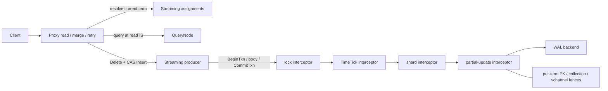
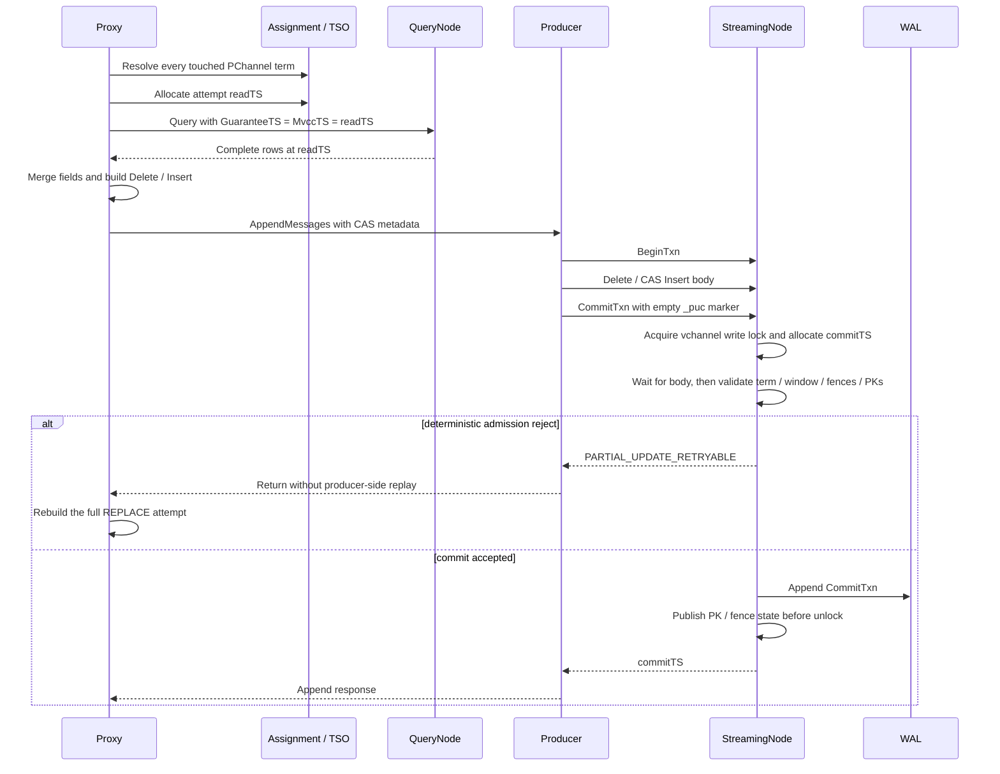

# MEP：Partial Update 的乐观 CAS

- **创建时间：** 2026-06-01
- **Feature DRI:** @weiliu1031
- **Primary Approver:** TBD
- **Independent Approver:** TBD
- **Design Review:** TBD
- **状态：** 评审中
- **组件：** Proxy / StreamingNode / Streaming
- **关联 Issue：** [#49980](https://github.com/milvus-io/milvus/issues/49980)
- **发布版本：** N/A

## 摘要

Milvus 的 Partial Update 目前采用“读取、合并、写入”的流程。Proxy 先读取
当前行，把用户提供的字段合并成完整行，再写入一个标准的 Delete/Insert
事务。两个并发请求可能读取同一个快照；提交时又不会校验合并所依据的快照，
因此后提交的请求可能无声地覆盖先提交请求的修改。

本提案保留 Proxy 中现有的查询和合并逻辑，在 StreamingNode 增加乐观提交
准入校验。每次尝试都按以下顺序执行：

```text
resolve all touched PChannel terms
  -> allocate an attempt-scoped readTS
  -> query at readTS
  -> merge
  -> commit(term, readTS)
```

StreamingNode 为每个 WAL term 维护一个内存中的近期主键写入索引。Local
Partial Update 的 `CommitTxn` 会获取现有的 vchannel 写锁，校验请求观察到的
term 和读取快照，追加 commit，并在释放锁之前发布该事务的写集合。

本设计不新增公共 RPC、SDK 字段、配置项、Partial Update 专用 WAL 消息类型
或持久化行版本存储。下游消费者仍然接收标准的 Delete/Insert 事务。

## 动机

假设一行数据中有两个可以独立更新的字段：

```text
initial row:       {pk: 1, name: "old", score: 10}
request A updates: {pk: 1, name: "new"}
request B updates: {pk: 1, score: 20}
```

如果提交时不做校验，两个请求都可能读取初始行。请求 A 写入
`{name: "new", score: 10}`，请求 B 写入
`{name: "old", score: 20}`。最后提交的请求会覆盖另一个请求的更新。

Proxy 已经负责完整的 Partial Update 语义，包括 nullable 和默认值、动态字段、
函数生成结果、相对数组操作、partition key 校验以及行合并。把查询和合并移到
StreamingNode，会重复实现这些职责，还会让 WAL owner 依赖 QueryCoord 和
QueryNode。

StreamingNode 已经是 WAL 排序点。因此，在提交侧执行乐观校验，可以在保留
现有读取和合并路径的同时防止更新丢失。

### 目标

- 防止并发 Partial Update 修改同一 PK 时发生更新丢失。
- 查询路由、schema 处理、函数生成和合并继续由 Proxy 负责。
- 持久化数据路径继续使用标准的 Delete/Insert WAL 事务。
- PChannel term 发生变化后拒绝过期的尝试。
- WAL 恢复和事务重放期间保持正确性，且不需要重建历史行级状态。
- 限制近期 PK 版本占用的内存；保留历史不完整时按失败处理。
- 只重试能够安全重建完整请求的操作。

### 非目标

- 跨 vchannel 或跨 collection 原子性。
- 严格可串行化。
- 持久化行版本存储。
- 事务级 exactly-once 语义或幂等 token。
- 确定性 CAS 冲突后自动重放相对 `ARRAY_APPEND` 或 `ARRAY_REMOVE` 操作。
- Partial Update 与 Import、RestoreSnapshot 或 backfill 可见性变更并发执行时
  的正确性。
- Feature flag 或运行时启用开关。

## 公共接口

### 公共 API 与 SDK 行为

本提案不新增公共 RPC 或 SDK 请求字段。现有 Partial Update 请求继续使用当前
的 Upsert API。

用户可观察到的行为变化如下：

- 发生冲突的 replacement update 由 Proxy 重建并重试。
- 发生冲突的 relative update 返回
  `ErrCollectionPartialUpdateConflict`，且 `Retriable=false`。
- replacement update 耗尽重试次数后返回
  `ErrServiceUnavailable`，且 `Retriable=true`。
- AutoID Partial Update 改为仅更新：请求提供的每个 PK 都必须存在于查询
  快照中，合并后的 Insert 保留该 PK。

普通的非 Partial Update AutoID upsert 仍然分配新 PK。

### 内部协议

内部消息 proto 增加事务级提交准入元数据：

```proto
message PartialUpdateCAS {
    uint64 read_ts = 1;
    int64 observed_pchannel_term = 2;
    int64 primary_key_field_id = 3;
    int64 collection_id = 4;
}
```

内部 streaming error enum 增加：

```proto
STREAMING_CODE_PARTIAL_UPDATE_RETRYABLE = 17;
```

元数据编码到 Insert body 的 `MsgBase.Properties["_puc"]`。外层消息的
property 使用相同的 key，并以空字符串作为控制标记。外层标记不包含 PK、
`readTS`、term 或其他用户数据。

### 配置与指标

本提案不增加公共配置。以下内部常量均由本提案的功能实现新增，不是 Milvus
已有的配置参数。它们没有对应的 `paramtable` key 或 `milvus.yaml` 配置项，
不能在运行时修改：

| 拟新增内部常量 | 提案默认值 | 用途 |
|---|---|---|
| `defaultVersionIndexTTL` | 30 秒 | 限制每个 vchannel 保留近期 PK 写入版本的时间，同时限制一次 Partial Update 从 `readTS` 到 `commitTS` 的最大有效窗口。超过该窗口时，StreamingNode 返回可重试 CAS 拒绝；Proxy 只对可安全重建的 replacement update 自动重试。 |
| `defaultVersionIndexBudgetBytes` | 640,000,000 字节，约 610 MiB | 限制一个 PChannel WAL term 内所有 vchannel 共享的 PK 版本索引估算内存。预算不足时普通写入继续执行，但受影响 vchannel 的 CAS 在遗漏写入退出有效读取窗口前按失败处理。 |
| `partialUpdateCASMaxRetryAttempts` | 5 次，包含第一次尝试 | 限制 Proxy 对确定性 CAS 冲突重建完整 replacement update 的总尝试次数。包含相对字段操作的请求不使用该自动重试。 |
| `partialUpdateCASRetryBackoff` | 初始 10 ms，指数退避，单次最多 40 ms | 控制两次 Proxy CAS 尝试之间的等待，减少并发冲突后立即重试造成的持续竞争。40 ms 上限由 `4 * partialUpdateCASRetryBackoff` 计算。 |

PK 索引预算是估算值，并非进程 RSS 的硬上限。每个 Int64 PK entry 按
128 字节计费；VarChar PK entry 按 `128 + PK 字节长度` 计费。调整上述提案
默认值需要修改代码并重新编译、部署。

### 持久化格式

本提案不增加新的 WAL 消息类型。BeginTxn、Delete、Insert 和 CommitTxn
保持现有格式及事务语义。CAS 元数据使用 Insert body 中已有的 properties
map，commit 标记使用外层消息中已有的 properties map。

不引入持久化 PK 索引、schema 迁移或恢复阶段的 gate。

## 设计细节

### 正确性不变量

本设计依赖以下五个不变量：

1. **尝试证明：** term 快照与 `readTS` 必须来自同一次尝试，并且先解析 term，
   再分配 `readTS`。
2. **精确查询快照：** QueryNode 收到的
   `GuaranteeTimestamp = MvccTimestamp = readTS`。
3. **原子准入边界：** local CAS 校验、CommitTxn append、写集合发布和事务
   状态转换由同一把 vchannel 写锁串行化。
4. **完整写入覆盖：** 所有会改变逻辑行数据且受支持的 WAL 写入，都必须更新
   精确 PK 版本或保守 fence。
5. **失败关闭：** 历史缺失、proof 格式错误或 local CAS 恢复不完整时，不能
   降级为不经校验的普通提交。

### 架构与状态归属



| 状态 | Owner | 生命周期 | 持久化方式 |
|---|---|---|---|
| 原始 Partial Update payload、单次尝试的 `readTS` 和 vchannel term 快照 | Proxy `upsertTask` | 一个客户端请求；每次重试重新构建 | 无 |
| Local transaction 封装和空 `_puc` commit 标记 | Producer | 一个 vchannel 消息组 | 标准 WAL properties |
| PChannel 全局锁和按 vchannel 区分的 RW lock | Lock interceptor | 一个 WAL 实例 | 无 |
| `pendingTxn`、PK 版本、collection fence 和 incomplete-txn fence | Partial Update interceptor | 一个 PChannel WAL term | 无 |
| 活跃和恢复得到的 transaction session | TxnManager | 事务和 WAL 恢复生命周期 | 现有 TxnBuffer 恢复机制 |
| Collection schema 和不可变 PK descriptor | ShardManager | 一个 WAL 内的 collection 生命周期 | 现有恢复快照 |

每次打开 WAL 都会创建独立的 Partial Update 状态。interceptor 不使用进程级
registry，也不从 TxnBuffer 重建行级 proof。关闭 WAL 后，该 term 的 map、
heap 和 pending transaction 状态都会释放。

### 端到端流程



Proxy 按现有 PK hash 或 namespace sharding 规则拆分请求。每个 vchannel 消息组
都是独立事务。本设计不保证多 vchannel 请求的原子性。

### Proxy 侧单次尝试的构造

Proxy 按以下顺序构造每次尝试：

```text
route original PKs to vchannels
  -> resolve and snapshot every touched PChannel term
  -> allocate readTS from TSO
  -> query at readTS
  -> merge
  -> attach the same term and readTS to every CAS Insert chunk
```

必须先解析 term，再分配 `readTS`。新的 WAL owner 启动时，每个 term 的 PK
索引为空。如果 Proxy 先分配 `readTS`，之后才观察到新的 term，空索引就无法
证明这两个事件之间没有发生写入。

任务 ID 和 `BeginTs` 在重试期间保持不变。`readTS` 是单次尝试范围内的独立
时间戳，第一次尝试和每次重试都重新生成。

内部查询使用自定义一致性：

```text
ConsistencyLevel = Customized
GuaranteeTimestamp = readTS
MvccTimestamp = readTS
```

通用 query preprocessing 可能调整一致性和 schema fence。Partial Update
查询会在 preprocessing 完成后重新设置固定快照，确保实际发给 QueryNode
的请求与 CAS 元数据使用同一个时间戳。

### 查询与合并语义

Proxy 保留现有合并实现，包括：

- nullable 和默认值；
- 动态字段；
- 函数生成结果；
- 相对数组操作；
- 紧凑 nullable vector 表示；
- partition key 不可变性校验。

对于 AutoID collection，Partial Update 要求请求中的每个 PK 都存在于查询
快照中。如果有 PK 不存在，完整请求会在 WAL append 之前被拒绝。合并后的
Insert 保留请求 PK，保证 Delete、Insert、路由和 CAS 操作的是同一行。

### CAS 元数据与加密

Proxy 从原始请求的 PK 推导涉及的 vchannel。元数据不重复保存 PK 列表，只
标识 PK 字段；StreamingNode 从每个完整 Insert chunk 中提取 PK。

message builder 在加密和 `BuildMutable()` 之前，把元数据写入 Insert body。
开启 cluster encryption 后，proof 与 DML payload 位于同一个加密边界内。

外层的空 `_puc` 标记只用于选择事务路径和锁路径。完成打包后，Proxy 校验：

- 每个已准备的 vchannel 至少生成一个 CAS Insert；
- 每个 CAS Insert 都带有标记；
- 每个 Insert 的 vchannel 都属于本次尝试的快照；
- 最终消息均未超过 transport limit。

缺失元数据或标记属于内部不变量被破坏。Proxy 不会改写已经构建或加密的 body。

### 最终消息封装与拆分

现有 entity-size packer 没有计算后续添加的 streaming header、schema
version、CAS 元数据、外层 properties 或加密 envelope。因此，只按 entity
判断合法的 chunk，在最终构造完成后仍可能超过 `pulsar.maxMessageSize`。

CAS Insert 使用两阶段打包：

1. 执行现有 entity packer，并保留每个 chunk 的原始行 offset。
2. 通过 message builder 添加 streaming header、CAS 元数据和 cipher。
3. 对最终消息执行 `EstimateSize()`。
4. 多行消息超限时，把连续的行 offset 范围二分，并重新构建两半。
5. 单行消息仍然超限时，在 WAL append 之前返回 `ErrParameterTooLarge`。
6. 如果仍有超限消息逃过 packer，将其视为内部不变量错误。

连续使用原始行 offset 范围，可以保持行顺序、字段对齐、partition、vchannel
和本次尝试的元数据不变。普通非 CAS Insert 继续使用现有打包路径。

### Producer 事务封装

`AppendMessages` 按 vchannel 对 DML 分组。只要 local group 包含 CAS Insert，
即使只有一条 Insert，也必须使用事务：

```text
BeginTxn
  -> transaction body
  -> CommitTxn with empty _puc marker
```

Producer 不会再次封装已经带有 `TxnContext` 或 `ReplicateHeader` 的消息。
复制消息保留来源事务边界。

resumable producer 会立即把 `STREAMING_CODE_PARTIAL_UPDATE_RETRYABLE`
返回给 Proxy，不得重试携带过期合并行的事务。如果 local CAS transaction
在 commit 前过期，producer 把 `TxnExpired` 转成同一个 CAS retry signal，
由 Proxy 重建完整尝试。

其他 transport failure 继续使用现有 resumable producer 行为。stream
failure 之后，BeginTxn、body 或 CommitTxn 都可能重试，最终客户端结果可能
不确定。本提案不增加事务级幂等机制。

### 拦截器顺序与准入锁

append chain 如下：

```text
redo -> lock -> replicate -> timetick -> shard -> partialupdate -> WAL
```

lock interceptor 是最外层的并发边界：

| 消息 | 锁 |
|---|---|
| 普通 DML、transaction body、普通 CommitTxn | `glock.RLock + vchannel.RLock` |
| Local CAS CommitTxn | `glock.RLock + vchannel.Lock` |
| vchannel exclusive DDL | `glock.RLock + vchannel.Lock` |
| PChannel exclusive DDL | `glock.Lock` |

所有非 PChannel exclusive 路径都先获取 PChannel lock，再获取 vchannel lock，
并按相反顺序释放。

Local CAS CommitTxn 使用专用的锁分支，不能复用 exclusive DDL cleanup 路径，
因为该路径会调用 `FailTxnAtVChannel`，导致正在提交的事务被终止。

Local CAS 的 critical region 如下：

```text
acquire glock.RLock + vchannel.Lock
  -> replicate validation
  -> allocate commitTS
  -> RequestCommitAndWait
  -> validate marker and runtime state
  -> validate term, read window, fences, and PK versions
  -> append CommitTxn
  -> publish PK / fence state
  -> CommitDone or RejectCommit
release vchannel.Lock + glock.RUnlock
```

普通写入在 WAL append 和索引发布期间持有同一把 vchannel read lock。因此：

- 普通写入先进入时，CAS 等待，直到普通写入发布完成后再校验；
- CAS 先进入时，后续普通写入等待 CommitTxn append 和 CAS 发布完成；
- 同一 vchannel 上的两个 CAS commit 会串行执行，即使修改不同 PK；
- 不同 vchannel 仍可并发执行。

锁只覆盖 commit 的 critical section。Proxy query 和 merge，以及 transaction
body 的生产过程，不持有这把 exclusive lock。

### 事务状态与原子发布

Partial Update interceptor 对每条 body message 分两个阶段维护
`pendingTxn`：

- 在 inner append 之前提取、校验并登记 CAS 元数据。如果同一事务中
  已登记的 CAS 元数据与当前 body 不同，当前 body 在进入 WAL
  backend 之前被拒绝；
- 只有 inner append 成功后，才记录当前 interceptor 生命周期内是否
  观察到 BeginTxn、从 Insert 和 Delete 提取的精确 PK 写集合，以及
  可选的 collection-wide fence。

transaction body 可以并发 append，因此 `pendingTxn` 由 mutex 保护。
`RequestCommitAndWait` 保证 commit validation 对写集合取快照之前，不再有
body 处于处理中。

marker validation 按失败处理：

- runtime CAS 元数据存在，但 local commit marker 缺失，状态不可恢复；
- 已观察到 BeginTxn 和 marker，但没有有效元数据或 PK 写集合，状态不可恢复；
- 恢复得到的 local CAS 缺少完整 runtime proof 时返回 retryable error，且
  永远不会到达 WAL backend。

CAS validation 在 inner CommitTxn append 之前执行。确定性的准入拒绝与 WAL
append error 分开标记：

- 准入拒绝调用 `RejectCommit()`，不发布写集合；
- append 成功后，以 CommitTxn time tick 发布状态，再释放锁；
- WAL append error 不发布状态，但 `TxnSession` 保留现有的 `CommitDone()`
  状态转换，因为该错误不能证明 commit 没有持久化。

这一区分只改变进程内的事务状态转换，不提供 exactly-once 客户端结果。

### 每个 term 的 PK 版本索引

每个 PChannel WAL term 都拥有独立 registry，并按 vchannel 拆分：

```text
registry[vchannel].pkLastWriteTS[pk] = lastCommitTS
```

冲突判断规则如下：

```text
conflict iff pkLastWriteTS[vchannel, pk] > readTS
```

索引支持 Int64 和 VarChar PK。对已有 PK 的新写入会原地更新该 entry。索引
不会复用上一个 WAL term 的状态。

### 保留窗口与内存上限

PK 索引使用固定的 30 秒 TTL，同一 PChannel term 的所有 vchannel 共享一个
估算字节数上限。每个 vchannel 分别拥有独立的 map、expiration heap、
retention watermark 和 incomplete-history marker。

每个 entry 按以下方式保守估算：

```text
estimated bytes = 128 + VarChar PK bytes
```

本提案设定的 640,000,000 字节预算大约可以容纳五百万个 Int64 entry。

`Update`、`Verify` 和 TimeTick advancement 会增量淘汰过期 entry。出现以下
情况时，validation 按失败处理：

- `readTS < retainedSinceTS`；
- 从读取到提交的物理时间超过 TTL；
- `commitTS < readTS`，这是不可恢复的内部不变量错误；
- 受字节预算限制，之前某次已提交写入未能进入索引。

新的 distinct PK 无法预留估算内存时，普通写入仍然可用，但对应 vchannel
会记录 `lastMissedWriteTS`。在最后一次遗漏写入离开所有合法读取窗口之前，
该 vchannel 上的 CAS 不可用。其他 vchannel 不会直接因这一状态失败。

即使没有 DML，TimeTick 也会推进 retention，使空闲 channel 能够释放 entry，
并从不完整窗口中恢复。

### 恢复与 term 变更

新打开的 WAL term 使用空的 Partial Update 索引，不需要 warm-up。这样做是
安全的，因为合法尝试会先观察当前 term，再分配 `readTS`。query 和 commit
之间一旦发生 term 变更，term mismatch 会迫使 Proxy 发起新尝试。

TxnManager 保留现有恢复行为。Partial Update interceptor 以自身生命周期
内是否观察到 BeginTxn，判断 write set 是否完整：

| 恢复路径 | Commit 行为 | Proof 发布 |
|---|---|---|
| 完整观察到 Begin 和 body 的普通事务 | 保留普通 commit 行为 | 精确 PK / collection fence |
| 只观察到 body 后缀或 Commit 的普通事务 | 保留普通 commit 行为 | vchannel incomplete-txn fence |
| 缺少完整 runtime proof 的 local CAS | 在 WAL append 前拒绝 | 不发布；Proxy 重建尝试 |
| 完整观察到 Begin 和 body 的复制事务 | 保留复制 commit 行为 | 精确 PK / collection fence |
| replay 不完整的复制事务 | 保留复制 commit 行为 | vchannel incomplete-txn fence |

interceptor 不读取 `InitialRecoverSnapshot.TxnBuffer`，不查询历史 schema，
不修改 `recoveredSessions`，也不延迟 `RecoverDone`。

### 复制

主集群已经完成 CAS 准入。复制到 secondary 的 commit 不会再次校验来源 term
或 `readTS`。

CDC 重放 BeginTxn 和完整 body 时，secondary 发布精确 PK 或 collection
fence 状态。如果重放从 body 后缀或 CommitTxn 继续，事务保留现有 commit
语义，并发布 vchannel incomplete-transaction fence。

promotion 会创建新 term，因此也会创建一个新的空 per-term index。

### 错误与重试语义

| 来源 | 内部分类 | Proxy 或客户端结果 |
|---|---|---|
| term mismatch、PK conflict、collection fence、incomplete-txn fence、TTL 过期或预算导致的历史不完整 | `STREAMING_CODE_PARTIAL_UPDATE_RETRYABLE` | 重建 `REPLACE`；relative update 转换为不可重试冲突 |
| 缺少完整 proof 的恢复 local CAS | `STREAMING_CODE_PARTIAL_UPDATE_RETRYABLE` | 同上 |
| local CAS transaction 在 commit 前过期 | Producer 转换为 `STREAMING_CODE_PARTIAL_UPDATE_RETRYABLE` | 同上 |
| marker、metadata、PK write set 格式错误或内部不变量被破坏 | `STREAMING_CODE_UNRECOVERABLE` | 失败，不执行 CAS retry |
| shard schema version mismatch | `STREAMING_CODE_SCHEMA_VERSION_MISMATCH` | `ErrCollectionSchemaMismatch` |
| timeout、disconnect 或 append 结果未知 | 保留原 transport 或 streaming error | 不分类为确定性 CAS abort |

仅当 Partial Update 的所有 field operation 都是 `REPLACE` 时，Proxy 才自动
重试。每次重试都执行以下步骤：

1. 恢复在函数生成之前保存的原始 Partial Update payload；
2. 重新生成函数输出；
3. 重新路由原始 PK；
4. 解析所有涉及的 term；
5. 分配新的 `readTS`；
6. 重新查询并合并；
7. 重新构建 Insert/Delete preprocessing 和 MutationResult count；
8. 累加新查询产生的 storage cost；
9. 创建新的 per-vchannel transaction。

retry loop 最多尝试五次。重建过程中一旦出现非 CAS error，loop 立即终止。

多 vchannel response 按以下规则归并：

| vchannel 结果 | Replacement update | Relative update |
|---|---|---|
| 全部成功 | 成功 | 成功 |
| 部分成功，其余均为确定性 CAS reject | 重建并重放完整请求 | 返回不可重试冲突 |
| CAS reject 与 timeout、unknown 或其他非 CAS error 混合出现 | 返回非 CAS error，不重试请求 | 相同 |
| 只有 CAS reject，且 retry budget 已耗尽 | 可重试的 service unavailable | 不可重试冲突 |

已经提交的 vchannel 可以安全重放 replacement，因为它会读取更新后的快照，
再重新应用绝对值。relative operation 不能使用这一规则，因为其他 vchannel
可能已经应用了增量变更。

response reduction 不提供请求级原子性。一个或多个 vchannel transaction
提交后，客户端仍可能收到错误。

### 性能与容量

本设计增加以下成本：

- 每次 Partial Update 尝试执行一次查询；
- 普通 Insert/Delete 的 PK 提取和近期版本发布；
- 被跟踪 PK 的 expiration-heap 更新；
- 同一 vchannel 上的 CAS commit 串行化；
- CommitTxn WAL append 期间持有 vchannel 写锁；
- 最终 envelope size 校验，以及可能发生的 CAS Insert 重新打包。

不同 vchannel 仍可并发执行。Query、merge 和 transaction-body append 不持有
CAS 写锁。

PK 索引所需预算大致为：

```text
required bytes ~= sum(128 + VarChar PK bytes)
                 for distinct PKs written within the TTL
```

使用本提案设定的预算和 Int64 PK 时，索引可保留约五百万个 distinct entry，
相当于在 30 秒窗口内每秒约 166,000 次 distinct PK write。

超过预算会降低对应 vchannel 的 CAS 可用性，但不会拒绝普通写入。

发布前仍需执行生产规模 benchmark，覆盖：

- 低冲突 CAS 流量；
- 单一 vchannel 上的高冲突流量；
- 持有 vchannel 写锁期间出现的慢 WAL append；
- 高 distinct-PK churn 和长 VarChar PK；
- 接近 transport message-size limit 的大 batch。

## 待讨论问题

- 30 秒 TTL 是否能覆盖生产环境中的查询和提交延迟？
- 本提案拟定的五百万 entry 预算是否足以覆盖高基数 workload 和长 VarChar PK？
- Import、RestoreSnapshot 和 backfill 应如何与 Partial Update 协调？
- Streaming transaction 是否应增加持久化 request token，以提供
  exactly-once 客户端结果？

## 参考资料

- [同一 PK 上的并发 Partial Update](https://github.com/milvus-io/milvus/issues/49980)
- [协议与设计文档 PR](https://github.com/milvus-io/milvus/pull/52235)
- [功能实现 PR](https://github.com/milvus-io/milvus/pull/51845)
- [Partial Update CAS OpenSpec](../../../openspec/specs/partial-update-cas/spec.md)
- [Streaming System 指南](../../agent_guides/streaming-system/streaming-system.md)
- [Milvus 设计文档要求](../../../CONTRIBUTING.md#design-documents)
