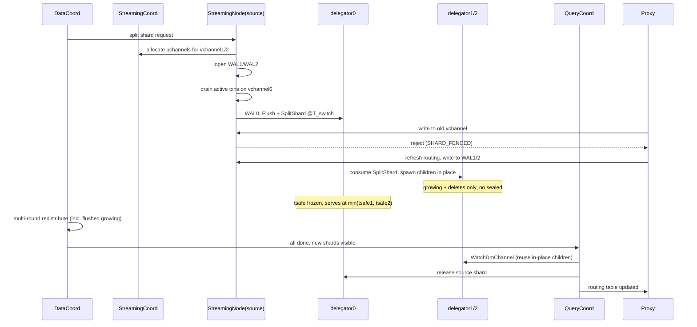
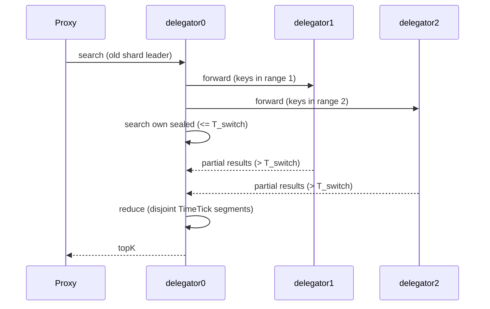
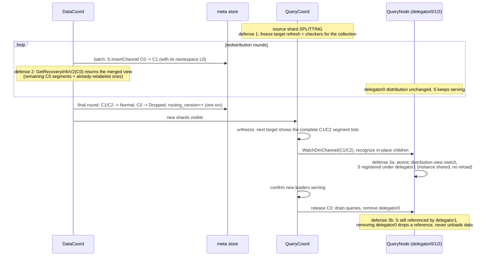

# Design Document: Online Shard Split for Namespace Collections

**Branch**: `worktree-shard-split-c0-splitshard-message`
**Date**: June 2026
**Related Issue**: [#50463](https://github.com/milvus-io/milvus/issues/50463)

---

## 1. Overview

### 1.1 Motivation

The number of shards (vchannels) of a collection is fixed at creation time
(`ShardsNum` → `AllocVirtualChannels`, `internal/rootcoord/create_collection_task.go`)
and cannot be changed afterwards. As data grows, a single shard becomes a
bottleneck in three places at once: WAL write throughput on the
StreamingNode, delegator memory and compute on the QueryNode, and the
backlog of compaction/index jobs on that shard. Today the only way out is
to create a new collection and re-import all data, which is unacceptable
for online workloads.

In the multi-tenant architecture, a collection follows the hierarchy
**Collection → Shard → Namespace(=Partition) → Segment**. A namespace is
the tenant-isolation unit: its data is physically isolated in object
storage from L0/L1 on, per-namespace vector indexes move together with the
namespace folder, and a single namespace has a hard product limit (500M
rows / 2TB) equal to the capacity of one shard. A namespace therefore
never spans shards and is the natural atomic unit of splitting.

This design adds **online shard split** for namespace-enabled (multi-tenant)
collections: a loaded shard is split into two shards without stopping reads
or writes, with **zero data rewrite** — segments only need to be relabeled
to their new shard, because every segment belongs to exactly one partition
(namespace) and the split point always falls on a namespace boundary.

### 1.2 Goals

- Split one shard of a namespace collection into two shards online; reads
  and writes keep working through the whole procedure (a short latency
  increase is acceptable, data loss or inconsistency is not).
- No data rewrite: redistribution is a metadata-only relabel of segments
  (including the namespace-scoped L0 segments).
- Full consistency: no message loss or duplication, ordering preserved,
  no MVCC ghost reads, deletes correct throughout the transition window.
- Crash safety: every step is idempotent and resumable; before the write
  fence the split can be aborted, after the fence it can only roll forward.
- The feature is fully gated by configuration and disabled by default.

## 2. Background and Constraints

The following properties of the current system shape the design:

1. **The channel set of a collection is fixed.** vchannels are allocated
   once at create-collection; the whole stack assumes they never change.
2. **The WAL is the only sequencer.** Every message gets its TimeTick from
   the per-pchannel `AckManager` (serialized allocation from the global
   TSO), and the confirmed watermark advances only over a contiguous
   acknowledged prefix. Forwarding an already-sequenced message into
   another WAL would sequence it twice and break the monotonic-arrival
   invariant that MVCC and `LastConfirmedMessageID` rely on. Therefore the
   design never relays messages between WALs: a message is sequenced
   exactly once, in its destination WAL.
3. **Delete forwarding follows the delegator's distribution.** A delegator
   forwards a delete to the segments found in its own distribution
   (filtered by partition and bloom filter,
   `internal/querynodev2/delegator/distribution.go`). If sealed-segment
   ownership were ambiguous during a split, deletes would be missed.
4. **QueryCoord cannot represent intermediate states.** The query target is
   built from `GetRecoveryInfoV2`, and `Segment.InsertChannel` is a single
   value: a segment serving two channels at once does not exist in the
   data model.
5. **Growing segments are released only via `SyncTargetVersion`** issued by
   QueryCoord; a delegator invisible to QueryCoord cannot hand its growing
   segments over to sealed ones.

## 3. Routing Design

### 3.1 Range routing

A shard owns a contiguous range `[lower, upper)` of a byte-comparable
routing-key space. For a namespace collection the routing key is

```
routing_key = big_endian(hash(namespace)) || namespace_utf8
```

The hash prefix spreads namespaces uniformly to avoid hotspots; appending
the original value makes the key unique and deterministic per namespace,
and big-endian encoding keeps byte order equal to logical order. Lookup is
a binary search over the shard ranges, `O(log #shards)`.

A split picks a split key on a namespace boundary (chosen from per-namespace
size statistics so the two halves are balanced) and divides one range into
two. A single oversized namespace can be isolated into a dedicated shard
(its range degenerates to a single key prefix).

Collections that do not enable namespaces keep the existing
`hash(pk) % shardNum` routing unchanged.

### 3.2 Metadata

The collection meta is already the authoritative source of the vchannel
list, so the shard routing facts live next to it and are updated in the
same transaction:

- `etcdpb.CollectionShardInfo` (parallel to `virtual_channel_names`) gains
  `routing_key_lower`, `routing_key_upper` and a `ShardState`
  (`Normal / Creating / Splitting / Dropped`).
- `etcdpb.CollectionInfo` gains `routing_version` (monotonically increased
  by every routing change) and `routing_mode` (`Hash` for legacy
  collections, `Range` for namespace collections subject to split).

All new fields default to legacy-compatible zero values, so existing
collections are unaffected. The in-memory routing table is *derived* from
the collection meta; it is not persisted separately.

### 3.3 Version negotiation

The proxy caches the routing table and attaches `routing_version` to write
messages. The StreamingNode compares versions on append:

- equal → process;
- proxy older but the target shard is still `Normal` → process and return
  the latest version;
- target shard fenced → reject with `STREAMING_CODE_SHARD_FENCED`;
- stale version that can no longer be served → reject with
  `STREAMING_CODE_ROUTING_STALE`.

Both rejection codes are classified *unrecoverable* in the streaming
client, so the resumable producer does not retry the same vchannel; the
error surfaces to the proxy, which refreshes the routing table through the
existing collection-meta invalidation path and re-dispatches.

## 4. Design Overview

Four principles work around the constraints of §2 simultaneously:

1. **The old delegator spawns child delegators in place.** When the old
   delegator consumes the split message, it creates the two child
   delegators for the new shards locally on the same QueryNode and fronts
   them (forward + reduce). During the window QueryCoord does not need to
   know they exist.
2. **Child delegators own no sealed segments.** All sealed segments stay
   with the old delegator (loaded exactly once) for the whole window; the
   children only consume growing data and deletes from the new WALs. This
   avoids double loading and any 1:N `InsertChannel` model change.
3. **Service ownership moves late, adoption is one-shot.** The DataCoord
   redistributes segment metadata in the background; the new shards become
   visible to QueryCoord only after *all* segments of the old shard are
   processed. There is no partial ownership migration and no bidirectional
   delete forwarding.
4. **The write switch is a fence message plus reject-and-refetch.** The
   StreamingNode writes a `Flush` message followed by a `SplitShard`
   message into the old WAL; the split message's TimeTick is `T_switch`.
   From then on new writes to the old vchannel are rejected and the proxy
   re-routes them to the new vchannels. Each message is sequenced exactly
   once, in its destination WAL.

## 5. Roles and State Machine

- **DataCoord** detects the need to split, creates the target shard
  metadata, drives the split task FSM, redistributes segments in rounds,
  and finally makes the new shards visible to QueryCoord. It freezes
  compaction/GC on the source shard during the window.
- **StreamingCoord** allocates pchannels for the new vchannels. The
  invariant "one collection has at most one vchannel per pchannel" is
  kept, so the shard count of a collection is capped by the pchannel
  count; when pchannels run short they are expanded dynamically via
  `AddPChannels()`, and if the WAL backend cannot host more topics the
  split round is skipped with an alert.
- **StreamingNode (source)** creates the new WALs, waits for active
  transactions on the old vchannel to finish, writes `Flush` +
  `SplitShard` (= `T_switch`), and afterwards rejects new writes to the
  old vchannel.
- **delegator0 (old)** consumes up to the split message, spawns
  delegator1/2 in place, keeps all sealed segments, fronts all queries,
  and applies the deletes forwarded back from the children.
- **delegator1/2 (children)** start with empty sealed sets, consume
  growing data and deletes of the new WALs from their beginnings, and
  forward every delete (and their TimeTick progress) to delegator0.
- **QueryCoord** sees only the old shard during the window (the source
  shard is flagged so the balancer leaves it alone); after adoption it
  watches the new shards, converts the existing child delegators without
  a restart, and releases the old shard.

```mermaid
flowchart LR
    IDLE["Normal"] -->|"split triggered"| PREP["Preparing: target shard meta + new WALs"]
    PREP -->|"abort (no external side effects)"| IDLE
    PREP -->|"active txns drained"| FENCE["Fencing: Flush + SplitShard @T_switch"]
    FENCE -->|"forward-only"| WIN["Window: in-place children + multi-round redistribute"]
    WIN -->|"all segments processed"| ADOPT["Adopting: new shards visible, watch/load"]
    ADOPT -->|"release source shard, bump routing"| DONE["Done"]
```



## 6. End-to-End Flow

### 6.1 Trigger and write switch

1. DataCoord decides to split shard0 (per-shard data size, tenant count,
   or a single oversized namespace), checks the gates (feature switch,
   concurrency limit, pchannel headroom), creates the target shard
   metadata in state `Creating`, and sends a split request to the source
   StreamingNode. The request is idempotent.
2. The StreamingNode allocates the new vchannels via StreamingCoord and
   opens WAL1/WAL2 (possibly on other nodes), waits for all active
   transactions on vchannel0 to commit or abort, then appends a `Flush`
   message (sealing all growing segments) and the `SplitShard` message.
   The split message carries the target vchannels and their key ranges;
   its TimeTick is `T_switch`. Afterwards every new write to vchannel0 is
   rejected with `SHARD_FENCED`.
   With `T_switch` known, an initialization message is appended to each
   target vchannel carrying `BarrierTimeTick = T_switch`: the TimeTick
   interceptor then allocates through `BarrierUntil`, which discards the
   hosting node's prefetched TSO batch and re-syncs until the allocation
   passes the barrier. Per-node allocation is monotonic, so every later
   message on the new WALs is strictly greater than `T_switch`. A target
   vchannel rejects DML until its initialization message is processed, so
   no write can slip in before the barrier.
3. On rejection the proxy refreshes the routing table (now containing the
   split boundary and the new vchannels) and re-dispatches the writes.
   Writes go directly to the new WALs from then on.

WAL transactions need no special machinery: the `SplitShard` message type
is marked `ExclusiveRequired`, so the lock interceptor appends it under
the vchannel-exclusive lock and force-fails active transactions, which the
client-side transaction retry loop already handles — the retried
transaction hits the fence, triggers the routing refresh, and replays on
the new vchannel. The only special case is a replicated transaction whose
keepalive is infinite; split is therefore not allowed on clusters with
replication enabled (see §8).



### 6.2 Read path during the window

1. delegator0 consumes WAL0 in order. The split message is the last entry,
   so every delete ≤ `T_switch` has already been applied to its sealed
   segments before the children exist — backlogged deletes cannot be lost.
2. On the split message, delegator0 creates delegator1/2 locally (empty
   sealed sets). Each child consumes its WAL from the beginning; those
   WALs only contain data > `T_switch`.
3. Queries still arrive at delegator0 (QueryCoord keeps returning the old
   shard leader). delegator0 fans the query out to the children, searches
   its own sealed (and pre-switch growing) data, reduces, and replies. The
   two result sets partition the TimeTick axis at `T_switch`, so the
   reduce neither duplicates nor misses rows.
4. The children apply every delete (> `T_switch`) to their own segments
   and forward a copy to delegator0, which applies it to the sealed
   segments it owns through the existing bloom-filter path. Deletes are
   durable in the L0 segments of the new vchannels.
5. **Serviceable timestamp.** After the fence delegator0 consumes nothing,
   so its own tsafe freezes at `T_switch`. The children forward their
   TimeTick progress, and delegator0 serves at
   `min(tsafe1, tsafe2)` — it never answers a query at timestamp `t`
   before all deletes ≤ `t` have been forwarded to it.



### 6.3 Redistribution and adoption

1. DataCoord relabels every segment of the source shard to its target
   shard: same segment ID, new `InsertChannel`, done in batches. The
   namespace-scoped L0 segments are relabeled together with the sealed
   segments of their namespace. Segments flushed by the fence (the former
   growing data of WAL0) are included.
2. Redistribution runs in rounds: each round processes the segments
   visible at that time, until the source shard has none left.
3. Only then do the target shards leave state `Creating`; QueryCoord picks
   them up, issues `WatchDmChannel`, and — because the child delegators
   already exist on that QueryNode with all segments loaded — converts
   them in place: the segment distribution view switches atomically to the
   two new channels, segments are shared on the node, nothing is released
   or reloaded, and the consume positions are kept.
4. QueryCoord releases the source shard (draining in-flight queries
   first), the routing version is bumped, and proxy caches are
   invalidated. The split is complete.

### 6.4 Release safety during redistribution

Relabeling moves a segment out of the source channel's recovery view. If
QueryCoord refreshed its target at that moment, the segment checker would
see a segment present in the delegator's distribution but absent from the
target and release it while it is still serving. Three defenses make this
impossible — at every instant at least one complete view holds every
segment:



The view of one segment `S` across the phases:

| Phase | meta: `S.InsertChannel` | QC target | delegator0 dist. | delegator1 dist. | physical instance |
|-------|------|------|------|------|------|
| before window | C0 | C0 holds S | holds S (serving) | — | loaded |
| window, S relabeled | **C1** | **frozen = old view, C0 holds S** | holds S (serving) | empty sealed | loaded |
| after adoption flip | C1 | C1 holds S | holds S (to release) | **holds S (shared)** | loaded, 2 refs |
| after C0 release | C1 | C1 holds S | removed | holds S | loaded, 1 ref |

- **Defense 1 (QueryCoord freeze, primary).** The `Splitting` flag freezes
  target refresh and the segment/channel checkers for the collection;
  release tasks originate only from checker diffs, so none are produced.
- **Defense 2 (merged recovery view).** While the source shard is
  `Splitting`, `GetRecoveryInfoV2` for it returns the union of its
  remaining segments and the segments already relabeled to the targets
  (the split task keeps the source→target mapping anyway). Even a refresh
  that slips past the freeze (e.g. a passive rebuild after a QueryNode
  restart) sees a complete list and diffs out nothing.
- **Defense 3 (register-then-release with shared instances).** Adoption is
  an atomic old-complete-view → new-complete-view flip with no missing
  intermediate state. Releasing the source shard is ordered strictly after
  the children's distributions are registered and the new leaders confirm
  serving; on the QueryNode, segment instances are shared by ID, so
  removing delegator0 only drops a reference — physical unload happens
  only when no distribution references the segment.

## 7. Consistency Guarantees

- **Total order.** WAL0 holds only messages ≤ `T_switch`, WAL1/2 hold only
  messages > `T_switch`, all on the same global TSO axis. A message is
  sequenced exactly once. The TSO allocator is a per-node singleton with
  prefetched batches, so a node hosting a new WAL could otherwise hold a
  batch older than `T_switch`; the `BarrierTimeTick` on the target
  vchannels' initialization messages (§6.1) closes this hole, and the
  TimeTicks of the new WALs' first messages are additionally asserted to
  exceed `T_switch` as a defensive check.
- **No loss, no duplication.** Writes go directly to their final WAL with
  unchanged ack semantics. The fence rejects in the lock interceptor,
  which runs before TimeTick allocation and the backend append
  (interceptor order: lock → replicate → timetick → shard), so a rejected
  write was never sequenced nor persisted and the retry after refresh
  cannot double-write. A transaction force-failed by the fence never
  committed — its body messages already in WAL0 are dropped by the
  consumer-side TxnBuffer — so retrying it as a whole on the new vchannel
  cannot duplicate either. No append-level request deduplication is
  needed; only the split RPC itself is idempotent.
- **Ordering.** Within a WAL, order equals TimeTick order. Across the
  switch, the proxy re-dispatches rejected writes in order after the
  refresh.
- **MVCC without ghosts.** A read is the union of delegator0's segments
  (≤ `T_switch`, with forwarded deletes applied) and the children's
  growing data (> `T_switch`) — two disjoint intervals of one axis. The
  serviceable timestamp `min(tsafe1, tsafe2)` guarantees the sealed part
  is never served ahead of the forwarded deletes.
- **Delete correctness in three layers.** *Serving layer*: deletes
  > `T_switch` are consumed by the children and forwarded to delegator0
  in memory, so reads are correct from the moment of the switch,
  independent of redistribution progress. *Durable layer*: those deletes
  persist as L0 segments of the new vchannels. *Bake-in layer*: after
  adoption, the standard L0-forward / delete-buffer replay applies them to
  the relabeled sealed segments at load time.
- **Crash recovery.** The split message is durable in WAL0 and the task
  state in the meta store. If the QueryNode hosting delegator0 crashes,
  QueryCoord rebuilds it, it re-consumes WAL0 up to the split message and
  re-spawns the children, whose state is reconstructed by replaying their
  WALs. If DataCoord crashes it resumes the task FSM from the persisted
  state. If the StreamingNode crashes, standard WAL recovery applies and
  the fence persists with the split message.

## 8. Engineering Constraints

1. **Delete retention is L0-based, not memory-based.** L0 segments holding
   deletes for not-yet-adopted sealed segments must not be compacted or
   garbage-collected before adoption applies them.
2. **Source-shard freeze.** During the window the source shard is excluded
   from compaction, clustering and GC on the DataCoord side, and from
   balancing and channel moves on the QueryCoord side.
3. **In-place handoff.** QueryCoord's watch path must recognize an
   existing child delegator on the node and convert it (change owner, keep
   consume positions, no reload) instead of release-and-rewatch.
4. **Old-vchannel lifecycle.** WAL0 stays replayable for the whole window
   (no truncation); after adoption the vchannel is dropped and its L0
   segments are discarded only after their content is relabeled.
5. **Shard count cap.** With the one-vchannel-per-pchannel-per-collection
   invariant, a collection's shard count is capped by the pchannel count
   (`rootCoord.dmlChannelNum`). pchannels are expanded dynamically via
   configuration; if the WAL backend's topic limit prevents expansion, the
   split round is skipped with an alert.
6. **Replication exclusion.** Clusters with replication/CDC enabled reject
   split (checked at the DataCoord trigger and again at the StreamingNode),
   because replicated transactions never expire and the secondary cluster
   maps pchannels by index position.
7. **BM25 statistics** are shard-level and are rebuilt for the two new
   shards before adoption; per-namespace vector indexes move with their
   namespace folders and need no rebuild.
8. **Rolling upgrade.** Old nodes do not understand the `SplitShard`
   message type; the feature switch must stay off until the whole cluster
   runs a version that does.
9. **No accidental release.** The three defenses of §6.4 must all hold:
   the splitting flag freezes target refresh and checkers, the source
   shard's recovery info serves the merged view during the window, and
   the source delegator is released only after the children's
   distributions are registered — with segment instances shared by ID so
   that the release never unloads data still referenced by a new shard.

## 9. Configuration

| Key | Default | Description |
|-----|---------|-------------|
| `dataCoord.shardSplit.enable` | `false` | Master switch, refreshable. Gates the trigger (automatic and manual); disabling stops new tasks but never interrupts a task already past the fence. |
| `dataCoord.shardSplit.maxSizeThreshold` | 2TB | Per-shard size that triggers a split. |
| `dataCoord.shardSplit.maxRowsThreshold` | 500M | Per-shard row count that triggers a split. |
| `dataCoord.shardSplit.namespaceCountLimit` | 100K | Per-shard namespace count that triggers a split. |
| `dataCoord.shardSplit.maxConcurrentTasks` | 1 | Cluster-wide concurrent split tasks. |

Even with the switch on, split stays disabled on clusters with replication
enabled, and on WAL backends that cannot host additional topics.

## 10. Failure Handling

- **Before the fence** (state `Preparing`): abort is allowed — drop the
  target shard metadata and the empty new vchannels; there are no external
  side effects.
- **After the fence**: forward-only. Every step is idempotent and resumed
  from the persisted task state; routing versions never go backwards.
- **BM25/index rebuild failure**: the new shards stay un-adopted (the
  window simply extends), the rebuild is retried.

## 11. Implementation Surface

| Component | Work |
|-----------|------|
| Common | `SplitShard` message type (codegen, `ExclusiveRequired`); `SHARD_FENCED` / `ROUTING_STALE` error codes (unrecoverable); `etcdpb` shard routing fields; range routing table derived from collection meta |
| DataCoord | Split task FSM, trigger and split-point selection, batched relabel (segments + L0), multi-round redistribution, source-shard freeze, adoption gate |
| StreamingCoord | vchannel allocation for existing collections (per-collection increasing shard index, distinct pchannels), pchannel headroom and expansion |
| StreamingNode | Split RPC (idempotent), vchannel fence on the lock interceptor, persisted fence state, rejection codes, target-vchannel initialization with `BarrierTimeTick = T_switch` plus a TimeTick lower-bound assertion, flush-then-split ordering |
| Proxy | Range routing lookup, reject-and-refetch loop, routing-version header, cache invalidation on adoption |
| QueryNode | In-place child delegator spawn, fronting fan-out + reduce, delete/TimeTick forwarding, `min(tsafe)` serving timestamp, idempotent re-spawn on recovery, in-place handoff |
| QueryCoord | Splitting flag (balance freeze), one-shot adoption, in-place delegator conversion, source-shard release |
