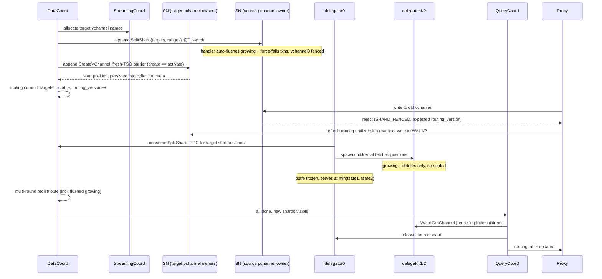
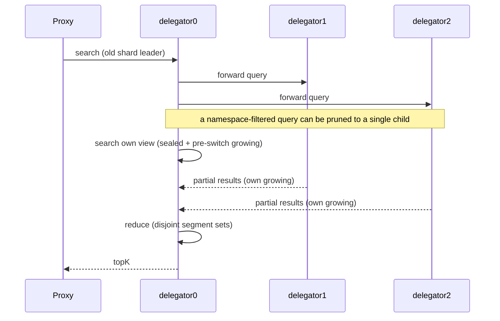
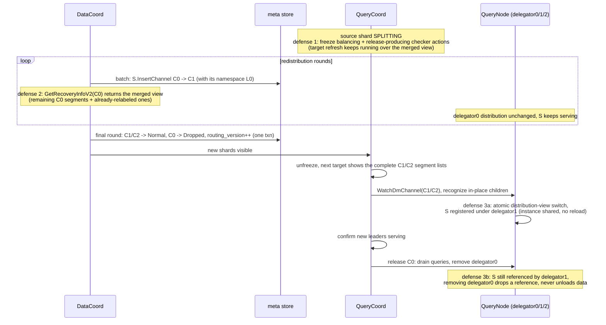

# Design Document: Online Shard Split for Namespace Collections

**Date**: June 2026
**Related Issue**: [#50463](https://github.com/milvus-io/milvus/issues/50463)

---

## 1. Overview

### 1.1 Motivation

The number of shards (vchannels) of a collection is fixed at creation time
(`ShardsNum` → `AllocVirtualChannels`, `internal/rootcoord/create_collection_task.go`)
and cannot be changed afterwards. As data grows, a single shard becomes a
bottleneck in three places at once: WAL write throughput on the
StreamingNode, delegator memory and compute on the QueryNode, and the
backlog of compaction/index jobs on that shard. Today the only way out is
to create a new collection and re-import all data, which is unacceptable
for online workloads.

In the multi-tenant architecture, a collection follows the hierarchy
**Collection → Shard → Namespace(=Partition) → Segment**. A namespace is
the tenant-isolation unit: its data is physically isolated in object
storage from L0/L1 on, per-namespace vector indexes move together with the
namespace folder, and a single namespace has a hard product limit (500M
rows / 2TB) equal to the capacity of one shard. A namespace therefore
never spans shards and is the natural atomic unit of splitting.

This design adds **online shard split** for namespace-enabled (multi-tenant)
collections: a loaded shard is split into two shards without stopping reads
or writes, with **zero data rewrite** — segments only need to be relabeled
to their new shard, because every segment belongs to exactly one partition
(namespace) and the split point always falls on a namespace boundary.

**Prerequisite.** Current master implements namespaces as a hidden VarChar
partition-key field with isolation (`handleNamespaceField`,
`internal/rootcoord/create_collection_task.go`), and segments only carry an
`is_sorted_by_namespace` flag — there is no per-namespace partition, no
one-namespace-per-segment guarantee, and no namespace-scoped L0 isolation
yet. This design **depends on the in-progress namespace(=partition) work**
delivering exactly those guarantees (every segment belongs to one
namespace; L0 segments are namespace-scoped). Without them, the
zero-data-rewrite relabel argument does not hold for segments containing
multiple namespaces that straddle the split key.

### 1.2 Goals

- Split one shard of a namespace collection into two shards online; reads
  and writes keep working through the whole procedure (a short latency
  increase is acceptable, data loss or inconsistency is not).
- No data rewrite: redistribution is a metadata-only relabel of segments
  (including the namespace-scoped L0 segments).
- Full consistency: no message loss or duplication, ordering preserved,
  no MVCC ghost reads, deletes correct throughout the transition window.
- Crash safety: every step is idempotent and resumable; before the write
  fence the split can be aborted, after the fence it can only roll forward.
- The feature is fully gated by configuration and disabled by default.

## 2. Background and Constraints

The following properties of the current system shape the design:

1. **The channel set of a collection is fixed.** vchannels are allocated
   once at create-collection; the whole stack assumes they never change.
2. **The WAL is the only sequencer.** Every message gets its TimeTick from
   the per-pchannel `AckManager` (serialized allocation from the global
   TSO), and the confirmed watermark advances only over a contiguous
   acknowledged prefix. Forwarding an already-sequenced message into
   another WAL would sequence it twice and break the monotonic-arrival
   invariant that MVCC and `LastConfirmedMessageID` rely on. Therefore the
   design never relays messages between WALs: a message is sequenced
   exactly once, in its destination WAL.
3. **Delete forwarding follows the delegator's distribution.** A delegator
   forwards a delete to the segments found in its own distribution
   (filtered by partition and bloom filter,
   `internal/querynodev2/delegator/distribution.go`). If sealed-segment
   ownership were ambiguous during a split, deletes would be missed.
4. **QueryCoord cannot represent intermediate states.** The query target is
   built from `GetRecoveryInfoV2`, and `Segment.InsertChannel` is a single
   value: a segment serving two channels at once does not exist in the
   data model.
5. **Growing segments are released only via `SyncTargetVersion`** issued by
   QueryCoord; a delegator invisible to QueryCoord cannot hand its growing
   segments over to sealed ones.

## 3. Routing Design

### 3.1 Range routing

A shard owns a contiguous range `[lower, upper)` of a byte-comparable
routing-key space. For a namespace collection the routing key is

```
routing_key = big_endian(hash(namespace)) || namespace_utf8
```

The hash prefix spreads namespaces uniformly to avoid hotspots; appending
the original value makes the key unique and deterministic per namespace,
and big-endian encoding keeps byte order equal to logical order. Lookup is
a binary search over the shard ranges, `O(log #shards)`.

A split picks a split key on a namespace boundary (chosen from per-namespace
size statistics so the two halves are balanced) and divides one range into
two. A single oversized namespace can be isolated into a dedicated shard
(its range degenerates to a single key prefix).

Collections that do not enable namespaces keep the existing
`hash(pk) % shardNum` routing unchanged.

### 3.2 Metadata

The collection meta is already the authoritative source of the vchannel
list, so the shard routing facts live next to it and are updated in the
same transaction:

- `etcdpb.CollectionShardInfo` (parallel to `virtual_channel_names`) gains
  `routing_key_lower`, `routing_key_upper` and a `ShardState`
  (`Normal / Creating / Splitting / Dropped`).
- `etcdpb.CollectionInfo` gains `routing_version` (monotonically increased
  by every routing change) and `routing_mode` (`Hash` for legacy
  collections, `Range` for namespace collections subject to split).

All new fields default to legacy-compatible zero values, so existing
collections are unaffected. The in-memory routing table is *derived* from
the collection meta; it is not persisted separately.

### 3.3 Version negotiation

The proxy caches the routing table and attaches `routing_version` to write
messages. The StreamingNode compares versions on append:

- equal → process;
- proxy older but the target shard is still `Normal` → process and return
  the latest version;
- target shard fenced → reject with `STREAMING_CODE_SHARD_FENCED`; the
  response carries the routing version that contains the split, and the
  proxy retries its refresh (with backoff) until its cached table reaches
  that version — the reject→refresh loop terminates by construction
  instead of bouncing off a not-yet-committed routing table;
- stale version that can no longer be served → reject with
  `STREAMING_CODE_ROUTING_STALE`.

`SHARD_FENCED` is distinct from the existing `CHANNEL_FENCED`:
`CHANNEL_FENCED` is term-based fencing of a pchannel, recovered by
reconnecting to the *same* channel after reassignment; `SHARD_FENCED` is
permanent for the vchannel and is recovered by refreshing the routing
table and writing to a *different* vchannel.

Both rejection codes are classified *unrecoverable* in the streaming
client, so the resumable producer does not retry the same vchannel; the
error surfaces to the proxy, which refreshes the routing table through the
existing collection-meta invalidation path and re-dispatches.

## 4. Design Overview

Four principles work around the constraints of §2 simultaneously:

1. **The old delegator spawns child delegators in place.** When the old
   delegator consumes the split message, it creates the two child
   delegators for the new shards locally on the same QueryNode and fronts
   them (forward + reduce). During the window QueryCoord does not need to
   know they exist.
2. **Child delegators own no sealed segments.** All sealed segments are
   served by the old delegator (each loaded exactly once) for the whole
   window; the children consume growing data and deletes from the new
   WALs. Growing→sealed handoff keeps running during the window: segments
   flushed after the fence — the former growing data of WAL0 as well as
   the children's growing flushed from the new WALs — are loaded as sealed
   into the old delegator's view, and the handoff atomically swaps a
   child's growing segment for the sealed instance there, so the children
   still own no sealed segments. This avoids double loading and any 1:N
   `InsertChannel` model change.
3. **Service ownership moves late, adoption is one-shot.** The DataCoord
   redistributes segment metadata in the background; the new shards become
   visible to QueryCoord only after *all* segments of the old shard are
   processed. There is no partial ownership migration and no bidirectional
   delete forwarding.
4. **Fence first, then create the new shards.** A single `SplitShard`
   message is appended into the old WAL; the StreamingNode that owns it
   auto-flushes and fences the old vchannel on processing it, and its
   TimeTick becomes `T_switch`. Only then are the new vchannels created —
   each `CreateVChannel` starts its WAL from a fresh TSO sync, which (after
   the fence, on a monotonic global TSO) is necessarily after `T_switch`,
   so the new WALs are born strictly after `T_switch` and creation doubles
   as activation (no separate step, no `T_switch` value to carry). From then on new writes to the old
   vchannel are rejected and the proxy re-routes them to the new
   vchannels. Each message is sequenced exactly once, in its destination
   WAL.

## 5. Roles and State Machine

- **DataCoord** detects the need to split, creates the target shard
  metadata, and drives the split task FSM entirely by appending messages
  through the streaming client (`SplitShard` to fence the old WAL →
  `CreateVChannel` on the new pchannels → routing commit; there is no
  coordinator→StreamingNode RPC, and no separate flush or activate message
  — flush is auto-triggered inside the source SN's handler, and the
  fresh-TSO barrier the target SN applies on `CreateVChannel` doubles as
  activation. DataCoord neither captures nor persists `T_switch`). It
  redistributes segments in rounds, finally makes the new
  shards visible to QueryCoord, and freezes compaction/GC on the source
  shard during the window.
- **StreamingCoord** allocates pchannels for the new vchannels. The
  invariant "one collection has at most one vchannel per pchannel" is
  kept, so the shard count of a collection is capped by the pchannel
  count; when pchannels run short they are expanded dynamically via
  `AddPChannels()`, and if the WAL backend cannot host more topics the
  split round is skipped with an alert.
- **StreamingNode (source)** receives the fence on the normal append
  path, simply by being the current owner of the source pchannel: on
  processing `SplitShard` its shard handler auto-flushes the growing
  segments (embedding their IDs in the message, as the AlterCollection
  schema-change path already does) and force-fails active transactions
  under the vchannel-exclusive lock; afterwards the node rejects new
  writes to the old vchannel. The target vchannels live on whichever
  StreamingNodes own the target pchannels (a node cannot open a WAL for
  another node) and are created by the `CreateVChannel` messages appended
  there, each starting its WAL from a fresh TSO sync (necessarily past
  `T_switch`).
- **delegator0 (old)** consumes up to the split message; from it learns
  the target vchannels and key ranges, fetches their consume start
  positions via a one-shot Coordinator RPC (the positions were persisted
  to the collection meta when the targets were created), spawns
  delegator1/2 in place, serves all sealed segments (including those
  flushed during the window), fronts all queries, and applies the deletes
  forwarded back from the children.
- **delegator1/2 (children)** own no sealed segments, consume growing
  data and deletes of the new WALs from the start positions delegator0
  fetched, and forward every delete (and their TimeTick progress) to
  delegator0.
- **QueryCoord** sees only the old shard during the window (the source
  shard is flagged so the balancer leaves it alone); after adoption it
  watches the new shards, converts the existing child delegators without
  a restart, and releases the old shard.

```mermaid
flowchart LR
    IDLE["Normal"] -->|"split triggered"| PREP["Preparing, target shard meta and vchannel names allocated"]
    PREP -->|"abort, no external side effects"| IDLE
    PREP -->|"append SplitShard, SN auto-flush and fence"| FENCE["Fenced at T_switch, old vchannel rejects writes"]
    FENCE -->|"forward-only, CreateVChannel fresh-TSO barrier, routing commit"| WIN["Window, in-place children and multi-round redistribute"]
    WIN -->|"all segments processed"| ADOPT["Adopting, new shards visible, watch and load"]
    ADOPT -->|"release source shard, bump routing"| DONE["Done"]
```



## 6. End-to-End Flow

### 6.1 Trigger and write switch

The whole sequence is driven by the DataCoord split task FSM **appending
messages through the streaming client** — there is no
coordinator→StreamingNode RPC. The streaming client already solves owner
discovery, retry across pchannel reassignment, and term fencing, exactly
as existing WAL-visible operations do (`ManualFlush` is appended by the
proxy; DataCoord drives snapshot and manifest operations the same way).
The source StreamingNode "receives" the split simply by being the current
owner of the source pchannel, on the normal append path through the
interceptor chain.

1. DataCoord decides to split shard0 (per-shard data size, tenant count,
   or a single oversized namespace), checks the gates (feature switch,
   concurrency limit, pchannel headroom, and one active task per
   vchannel — a shard is skipped while an unfinished task references it
   as the source or as a target, otherwise the trigger would re-fire on
   the same over-threshold shard every tick during the long
   redistribution window), creates the target shard
   metadata in state `Creating`, and allocates the new vchannel names and
   their target pchannels via StreamingCoord (so the fence message can
   carry the target names). Shards holding a single namespace are
   excluded from the trigger: they satisfy the size thresholds but cannot
   be split further (the split point must fall on a namespace boundary),
   and writes to them are rejected at the namespace hard limit — without
   the exclusion the trigger would loop on them.
2. **Fence.** DataCoord appends a single `SplitShard` message to
   vchannel0, carrying the target vchannel names and their key ranges
   (allocated in step 1) — but *not* start positions, which do not exist
   yet. On processing it the source StreamingNode's shard handler
   auto-flushes every growing segment of the vchannel (embedding the
   sealed segment IDs into the message header, exactly as the
   AlterCollection schema-change path does) and, because `SplitShard` is
   `ExclusiveRequired`, force-fails active transactions under the
   vchannel-exclusive lock. The message's TimeTick is `T_switch`.
   Afterwards every new write to vchannel0 is rejected with `SHARD_FENCED`.
3. **Create targets (after the fence; barrier doubles as activation).**
   DataCoord appends a `CreateVChannel` message — carrying the collection
   schema, partition list and key range — to each target pchannel (whose
   WALs are hosted by whichever StreamingNodes own them; a node cannot open
   a WAL for another node). The target StreamingNode allocates the genesis
   timetick from a **fresh TSO sync** (it discards its prefetched batch and
   re-fetches the latest TSO) rather than from a possibly-stale prefetched
   batch. The barrier needs no value: because the fence already committed
   and the global TSO is strictly monotonic, any freshly fetched TSO is
   necessarily `> T_switch`, so the genesis message and every later message
   on the new WAL are strictly greater than `T_switch` — **DataCoord never
   captures or persists `T_switch`; this is entirely a StreamingNode-local
   operation.** Creation and activation are one step, with no
   `Creating`/`Activate` two-phase state. Each consumer that special-cases `CreateCollection` as the
   vchannel-genesis message needs a `CreateVChannel` handler; there are
   three: the shard manager (registers the collection for DML and segment
   assignment), the RecoveryStorage (its `vchannel not found` check exempts
   only `CreateCollection`/`DropCollection` and needs the same exemption,
   plus an observe handler seeding the vchannel meta), and the flusher (the
   `CreateCollection` hook spawns the data sync service). The message body
   keeps the same shape as `CreateCollection`'s, so the three handlers
   share the existing schema parser. The append result yields the new
   vchannel's consume start position (`LastConfirmedMessageID`), which
   DataCoord persists into the collection meta — the same `StartPositions`
   field `CreateCollection` already populates.
4. **Routing commit.** DataCoord commits the routing meta in one
   transaction: the target shards become routable for writes and
   `routing_version` is incremented.
5. On rejection the proxy refreshes the routing table. The `SHARD_FENCED`
   response carries the routing version that contains the split, and the
   proxy retries the refresh (with backoff) until its cached table reaches
   that version, then re-dispatches the writes in order — the
   reject→refresh loop terminates by construction. Writes go directly to
   the new WALs from then on. The new shards are routable only after the
   routing/meta commit (the proxy cannot see a shard before its
   collection-meta write lands), so the write-unavailability window —
   fence → routing commit → proxy refresh, scoped to the split shard's key
   range — has the same shape in any ordering (§10), and fits the
   short-latency-increase goal of §1.2.

WAL transactions need no special machinery and there is no drain step:
the `SplitShard` message type is marked `ExclusiveRequired`, so the lock
interceptor appends it under the vchannel-exclusive lock and force-fails
active transactions, which the client-side transaction retry loop already
handles — the retried transaction hits the fence, triggers the routing
refresh, and replays on the new vchannel. The only special case is a
replicated transaction whose keepalive is infinite; split is therefore
not allowed on clusters with replication enabled (see §8).

Collection DDL is fenced out of the critical section. DDL
(AlterCollection, CreatePartition, …) broadcasts to all of the
collection's vchannels; if it interleaved between the fence and target
creation it could change the schema/partition set that `CreateVChannel`
embeds, leaving the new shards out of sync. The split task therefore
holds the Broadcaster's `ExclusiveCollectionName` resource key — the same
key CreateCollection and DropPartition already take — for the
seconds-long fence → create → routing-commit section, so no collection
DDL can interleave; afterwards the new vchannels join the collection's
broadcast targets normally.



### 6.2 Read path during the window

1. delegator0 consumes WAL0 in order. The split message is the last entry,
   so every delete ≤ `T_switch` has already been applied to its sealed
   segments before the children exist — backlogged deletes cannot be lost.
2. On the split message, delegator0 fetches the target vchannels' consume
   start positions via a one-shot Coordinator RPC (persisted to the
   collection meta when the targets were created, §6.1 step 3; it retries
   until they appear, since creation runs just after the fence) and
   creates delegator1/2 locally (empty sealed sets). Each child subscribes
   at its start position, so it replays none of the target pchannel's
   unrelated history; the new vchannels contain only data > `T_switch`
   (their genesis message is already past the barrier).
3. Queries still arrive at delegator0 (QueryCoord keeps returning the old
   shard leader). delegator0 fans the query out to the children, searches
   the segments in its own view (sealed and pre-switch growing), reduces,
   and replies. The result sets come from **disjoint segment sets** —
   every row lives either in a segment of delegator0's view or in a
   child's growing segment, never both (the handoff of step 5 swaps the
   two atomically) — so the reduce neither duplicates nor misses rows.
4. The children apply every delete (> `T_switch`) to their own growing
   segments and forward a copy to delegator0, which applies it to all the
   segments it serves — sealed (including those flushed during the
   window) and pre-switch growing — through the existing bloom-filter
   path. Deletes are durable in the L0 segments of the new vchannels.
5. **In-window growing→sealed handoff.** Flushing keeps running during
   the window: the fence-flushed former growing of WAL0, and later the
   children's growing flushed from the new WALs, become sealed segments.
   QueryCoord's target refresh for the source shard keeps running over
   the merged recovery view (§6.4, defense 2), which both delivers the
   newly flushed segments and never lets a segment disappear; what the
   splitting flag freezes is balancing and the release-producing checker
   actions, not the refresh itself. The handoff lands in delegator0's
   view (`SyncTargetVersion` to the visible leader): delegator0 loads the
   sealed instance, and for a segment flushed from a child's WAL the
   child's growing segment is swapped out atomically — the children own
   no sealed segments at any point.
6. **Serviceable timestamp.** After the fence delegator0 consumes nothing,
   so its own tsafe freezes at `T_switch`. The children forward their
   TimeTick progress, and delegator0 serves at
   `min(tsafe1, tsafe2)` — it never answers a query at timestamp `t`
   before all deletes ≤ `t` have been forwarded to it.



### 6.3 Redistribution and adoption

1. DataCoord relabels every segment of the source shard to its target
   shard: same segment ID, new `InsertChannel`, done in batches. The
   namespace-scoped L0 segments are relabeled together with the sealed
   segments of their namespace. Segments flushed by the fence (the former
   growing data of WAL0) are included; segments flushed from the
   children's WALs are born on the target vchannels and need no relabel.
   `IsImporting` segments are skipped to the next round (the same shape as
   the `isCompacting` skip the compaction policies already apply): an
   import worker is still committing binlogs through meta updates on those
   segments, and relabeling mid-import would race with those writes. They
   are picked up once flushed.
2. Redistribution runs in rounds: each round processes the segments
   visible at that time. The source shard is "drained" only when **both**
   DC-local conditions hold: no healthy segment remains on the source
   vchannel (any state — `isSegmentHealthy` already keeps `Importing`
   segments visible until they reach a terminal state), **and** no active
   import job has the source vchannel in its `Vchannels`. The second
   conjunct closes a blind window: a job still in `Pending`/`PreImporting`
   has not registered any segment in meta yet (`AllocImportSegment` adds
   `SegmentInfo{State: Importing, IsImporting: true}` only when it starts
   writing), so a job planned against the pre-split routing is invisible
   to the segment scan and could otherwise allocate its segments onto the
   just-dropped shard after the empty check passed. A job's target
   vchannels are fixed at creation (`ImportJob.GetVchannels()`), so this
   check is purely DataCoord-local and needs no import/split mutual
   exclusion.
3. Only then do the target shards leave state `Creating`; QueryCoord picks
   them up, issues `WatchDmChannel`, and — because the child delegators
   already exist on that QueryNode with all segments loaded — converts
   them in place rather than building fresh ones:
   - **No re-subscribe / no new pipeline.** `WatchDmChannel` already
     no-ops when the channel's delegator is present (`services.go`: "channel
     already subscribed"). The child is registered in the node's delegator
     map from the moment delegator0 spawns it, so the watch reuses it
     instead of creating a new delegator and replaying the WAL from a seek
     position. The convert path must, beyond the bare no-op, adopt
     QueryCoord's `version`/target version, drop the delegator0-fronting
     wiring, and keep the consume position.
   - **No segment reload.** `LoadSegments` filters out segments already
     present on the node (`segment_loader.go`: "skip loaded/loading
     segment"), and segment instances are shared by ID in the
     SegmentManager. The new shard's sealed segments are already loaded —
     relabel keeps the same segment ID; hash-rewrite IDs were produced and
     loaded into delegator0's view via the in-window handoff (§6.2, step 5)
     — so `LoadSegments` degrades to a distribution-view update that
     attributes the already-loaded instances to the child, not a physical
     load.
   - **No premature reads (the gate is `Serviceable`, not map
     membership).** Registering the child early does *not* expose it to
     proxy reads: proxies route reads via QueryCoord's `GetShardLeaders`,
     and QueryCoord learns leaders from each QueryNode's
     `GetDataDistribution`, which **skips non-serviceable delegators**
     (`services.go`: `if !delegator.Serviceable() { return }`). During the
     window the child is naturally non-serviceable — it owns no sealed
     segment and has no QueryCoord target version yet
     (`channelQueryView.Serviceable()` requires `loadedRatio == 1.0` and a
     ready target) — so it is never reported, never returned by
     `GetShardLeaders`, and never read by a proxy. delegator0's internal
     fan-out reaches the child through a direct in-process handle, not
     through this leader path, so fronting still works while the child is
     externally invisible. The convert in this step injects the QueryCoord
     target version (`SyncTargetVersion`); the child becomes serviceable,
     is reported on the next `GetDataDistribution`, and only then does
     `GetShardLeaders` flip proxy reads onto it.

   At the flip itself no segment data is unloaded or reloaded; segments
   flushed during the window were already loaded into delegator0's view as
   they appeared (§6.2, step 5).
4. QueryCoord releases the source shard (draining in-flight queries
   first), the routing version is bumped, and proxy caches are
   invalidated. The split is complete.

### 6.4 Release safety during redistribution

Relabeling moves a segment out of the source channel's recovery view. If
QueryCoord refreshed its target at that moment, the segment checker would
see a segment present in the delegator's distribution but absent from the
target and release it while it is still serving. Three defenses make this
impossible — at every instant at least one complete view holds every
segment:



The view of one segment `S` across the phases:

| Phase | meta: `S.InsertChannel` | QC target | delegator0 dist. | delegator1 dist. | physical instance |
|-------|------|------|------|------|------|
| before window | C0 | C0 holds S | holds S (serving) | — | loaded |
| window, S relabeled | **C1** | **merged view under C0, always holds S** | holds S (serving) | empty sealed | loaded |
| after adoption flip | C1 | C1 holds S | holds S (to release) | **holds S (shared)** | loaded, 2 refs |
| after C0 release | C1 | C1 holds S | removed | holds S | loaded, 1 ref |

- **Defense 1 (QueryCoord freeze, primary).** The `Splitting` flag freezes
  balancing, channel moves, and the release-producing segment/channel
  checker actions for the collection; release tasks originate only from
  those checker diffs, so none are produced. Target refresh itself keeps
  running — over the merged view of defense 2 it only ever *adds*
  segments (the ones flushed during the window, driving the §6.2 handoff)
  and never loses any.
- **Defense 2 (merged recovery view).** While the source shard is
  `Splitting`, `GetRecoveryInfoV2` for it returns the union of its
  remaining segments, the segments already relabeled to the targets, and
  the segments flushed from the target WALs during the window (the split
  task keeps the source→target mapping anyway). Any refresh — including a
  passive rebuild after a QueryNode restart — sees a complete list and
  diffs out nothing.
- **Defense 3 (register-then-release with shared instances).** Adoption is
  an atomic old-complete-view → new-complete-view flip with no missing
  intermediate state. Releasing the source shard is ordered strictly after
  the children's distributions are registered and the new leaders confirm
  serving; on the QueryNode, segment instances are shared by ID, so
  removing delegator0 only drops a reference — physical unload happens
  only when no distribution references the segment.

## 7. Consistency Guarantees

- **Total order.** WAL0 holds only messages ≤ `T_switch`; the new
  vchannels hold *no* message ≤ `T_switch` at all — because their
  `CreateVChannel` genesis is appended only after the fence committed and
  the target SN allocates it from a fresh TSO sync, so even the creation
  message is past `T_switch`. Collection DDL cannot interleave with the
  fence→create section because the split task holds the Broadcaster's
  `ExclusiveCollectionName` key (§6.1). All messages sit on the same global
  TSO axis and each is sequenced exactly once. The TSO allocator is a
  per-node singleton with prefetched batches, so a node hosting a new WAL
  could otherwise hold a batch older than `T_switch`; the fresh TSO sync on
  `CreateVChannel` (§6.1) closes this hole by discarding that stale batch.
  Note the boundary needs only `> T_switch`, not the exact value: a fresh
  fetch is necessarily greater than any earlier-allocated timetick
  (including `T_switch`) on the monotonic global TSO — which is why the
  barrier carries no value and DataCoord need not know `T_switch`.
- **No loss, no duplication.** Writes go directly to their final WAL with
  unchanged ack semantics. The fence rejects in the lock interceptor,
  which runs before TimeTick allocation and the backend append
  (interceptor order: redo → lock → replicate → timetick → shard), so a rejected
  write was never sequenced nor persisted and the retry after refresh
  cannot double-write. A transaction force-failed by the fence never
  committed — its body messages already in WAL0 are dropped by the
  consumer-side TxnBuffer — so retrying it as a whole on the new vchannel
  cannot duplicate either. No append-level request deduplication is
  needed; the split task's own appends are idempotent against the
  vchannel state machine (a duplicate `CreateVChannel` is a no-op — the
  vchannel already exists — and a duplicate `SplitShard` is recognized by
  the persisted fence state).
- **Ordering.** Within a WAL, order equals TimeTick order. Across the
  switch, the proxy re-dispatches rejected writes in order after the
  refresh.
- **MVCC without ghosts.** A read is the union of delegator0's view
  (sealed — including segments flushed during the window — and pre-switch
  growing, with forwarded deletes applied) and the children's growing
  data — disjoint segment sets: the in-window handoff atomically swaps a
  child's growing segment for the sealed instance in delegator0's view,
  so no row is visible from both sides. The serviceable timestamp
  `min(tsafe1, tsafe2)` guarantees delegator0's part is never served
  ahead of the forwarded deletes.
- **Delete correctness in three layers.** *Serving layer*: deletes
  > `T_switch` are consumed by the children and forwarded to delegator0
  in memory, so reads are correct from the moment of the switch,
  independent of redistribution progress. *Durable layer*: those deletes
  persist as L0 segments of the new vchannels. *Bake-in layer*: after
  adoption, the standard L0-forward / delete-buffer replay applies them to
  the relabeled sealed segments at load time.
- **Crash recovery.** The split message is durable in WAL0 and the task
  state in the meta store. If the QueryNode hosting delegator0 crashes,
  QueryCoord rebuilds it, it re-consumes WAL0 up to the split message,
  re-fetches the target start positions from the collection meta via the
  Coordinator RPC, and re-spawns the children, whose state is then
  reconstructed by replaying their vchannels. (The positions live in the
  collection meta rather than in the `SplitShard` message, so recovery
  depends on the Coordinator being reachable — an accepted trade for the
  fence-first ordering, see §10.) If DataCoord crashes it resumes the task
  FSM from the persisted state. If the StreamingNode crashes, standard WAL
  recovery applies and the fence persists with the split message.

## 8. Engineering Constraints

1. **Delete retention is L0-based, not memory-based.** L0 segments holding
   deletes for not-yet-adopted sealed segments must not be compacted or
   garbage-collected before adoption applies them.
2. **Source-shard freeze.** During the window the source shard is excluded
   from compaction, clustering and GC on the DataCoord side, and from
   balancing and channel moves on the QueryCoord side.
3. **In-place handoff.** QueryCoord's watch path must recognize an
   existing child delegator on the node and convert it (change owner, keep
   consume positions, no reload) instead of release-and-rewatch — the
   `WatchDmChannel` no-op-when-present and `LoadSegments` skip-when-loaded
   paths already give the no-reload half (§6.3, step 3). The child is
   registered in the delegator map early (so the watch finds it) but kept
   **non-serviceable** until the convert: `GetDataDistribution` skips
   non-serviceable delegators, so QueryCoord never exposes the child via
   `GetShardLeaders` and no proxy read reaches it before adoption; the
   convert injects the QueryCoord target version, which flips it
   serviceable and routes reads onto it.
4. **Old-vchannel lifecycle.** WAL0 stays replayable for the whole window
   (no truncation); after adoption the vchannel is dropped. Its
   namespace-scoped L0 segments have been relabeled to the target shards
   by then (§6.3), so dropping the vchannel discards no delete data.
5. **Shard count cap.** With the one-vchannel-per-pchannel-per-collection
   invariant, a collection's shard count is capped by the pchannel count
   (`rootCoord.dmlChannelNum`). pchannels are expanded dynamically via
   configuration; if the WAL backend's topic limit prevents expansion, the
   split round is skipped with an alert.
6. **Replication exclusion.** Clusters with replication/CDC enabled reject
   split (checked at the DataCoord trigger and again at the StreamingNode),
   because replicated transactions never expire and the secondary cluster
   maps pchannels by index position.
7. **BM25 statistics** are shard-level and are rebuilt for the two new
   shards before adoption; per-namespace vector indexes move with their
   namespace folders and need no rebuild.
8. **Rolling upgrade.** Old nodes do not understand the `SplitShard`
   message type; the feature switch must stay off until the whole cluster
   runs a version that does.
9. **No accidental release.** The three defenses of §6.4 must all hold:
   the splitting flag freezes balancing and the release-producing checker
   actions, the source shard's recovery info serves the merged view during
   the window (target refresh keeps running over it to drive the in-window
   handoff), and the source delegator is released only after the
   children's distributions are registered — with segment instances shared
   by ID so that the release never unloads data still referenced by a new
   shard.
10. **Import × split interaction.** No mutual exclusion between import and
    split is needed — the conjunction completion check of §6.3 step 2
    already waits out every import that has registered segments, and
    relabel skips `IsImporting` segments (§6.3 step 1). The one case that
    needs handling is an import job *created during the split*: an `Import`
    broadcast targets the collection's vchannels, so a job created in the
    fence→activation gap includes the source vchannel and bounces with
    `SHARD_FENCED`. Job creation is queued while the split task is in
    `Fencing` (the same seconds-long critical section that already holds
    the Broadcaster's `ExclusiveCollectionName` key, §6.1) and re-planned
    against the new routing after activation. Jobs created after
    activation plan against the new shards directly and are fully
    orthogonal to redistribution.

## 9. Configuration

| Key | Default | Description |
|-----|---------|-------------|
| `dataCoord.shardSplit.enable` | `false` | Master switch, refreshable. Gates the trigger (automatic and manual); disabling stops new tasks but never interrupts a task already past the fence. |
| `dataCoord.shardSplit.checkInterval` | 3600s | Interval at which the trigger inspects the per-shard statistics. |
| `dataCoord.shardSplit.maxShardSize` | 2048 (GB) | Per-shard data size that triggers a split. |
| `dataCoord.shardSplit.maxShardRows` | 500M | Per-shard row count that triggers a split. |
| `dataCoord.shardSplit.maxNamespaceCount` | 100K | Per-shard namespace count that triggers a split. |
| `dataCoord.shardSplit.maxConcurrentTasks` | 1 | Cluster-wide concurrent split tasks. |
| `dataCoord.shardSplit.relabelBatchSize` | 256 | Segments relabeled to the target shards per redistribution round. |

Even with the switch on, split stays disabled on clusters with replication
enabled, and on WAL backends that cannot host additional topics. The
thresholds never trigger on a shard holding a single namespace (§6.1,
step 1): such a shard cannot be split further, and its growth is bounded
by the namespace hard limit instead.

## 10. Failure Handling

- **Ordering: fence first.** The `SplitShard` fence is the first WAL
  action and the single commit point; the new vchannels are created only
  *after* it, because the target's fresh-TSO barrier guarantees `>
  T_switch` only when the fence has already committed (a TSO fetched after
  the fence is necessarily past `T_switch`). This
  does not change write availability: in *either* ordering the new shards
  become routable only at the final routing/meta commit (the proxy cannot
  see a new shard before its collection-meta write lands), so the
  write-unavailability window for the split key range is fence → routing
  commit either way, gated on one idempotent post-fence append (here
  `CreateVChannel`; create-first would instead gate on `Activate`). The
  one property fence-first gives up is a clean abort on a *target-creation*
  failure: in create-first the targets are built before the fence, so a
  creation failure aborts with no commitment; in fence-first the fence is
  already committed, so a creation failure must roll forward — the append
  is idempotent and retried across pchannel reassignment to success. We
  accept losing that clean-abort for fewer phases, a cleaner disjoint
  axis, and CDC uniformity.
- **Before the fence** (state `Preparing`): abort is allowed — drop the
  target shard metadata and the allocated vchannel names; nothing has been
  written to any WAL, so there are no external side effects.
- **After the fence**: forward-only, and crash recovery needs no special
  state because **DataCoord never has to recover `T_switch`**. The barrier
  is value-free (a fresh TSO sync, §6.1/§7), so on restart DataCoord just
  re-drives the FSM by re-sending the same messages, and the StreamingNode
  makes each idempotent: a re-sent `SplitShard` is a no-op once the source
  vchannel is already fenced (persisted `VCHANNEL_STATE_SPLITTED`), and a
  re-sent `CreateVChannel` is a no-op once the target vchannel exists (a
  fresh re-create would still barrier past `T_switch`). Target creation,
  routing commit and redistribution are all idempotent appends or metadata
  transactions; routing versions never go backwards. DataCoord's only
  persisted state is which FSM step it is on — and even that can be probed
  from the StreamingNode (is the source fenced? do the targets exist?). No
  `T_switch` value is captured, persisted, or recovered anywhere on the
  coordinator side.
- **BM25/index rebuild failure**: the new shards stay un-adopted (the
  window simply extends), the rebuild is retried.

## 11. Implementation Surface

| Component | Work |
|-----------|------|
| Common | `SplitShard` / `CreateVChannel` message types (codegen; `SplitShard` is `ExclusiveRequired` and its handler auto-flushes growing; `CreateVChannel` triggers a fresh-TSO barrier on the target SN and carries no `T_switch` value); no separate `Activate` or `ManualFlush` message; `SHARD_FENCED` / `ROUTING_STALE` error codes (unrecoverable, `SHARD_FENCED` carries the expected routing version); `etcdpb` shard routing fields; range routing table derived from collection meta |
| DataCoord | Split task FSM driving the sequence via streaming-client appends (`SplitShard` to fence → `CreateVChannel` → routing commit; no `T_switch` captured or persisted — the barrier is a StreamingNode-local fresh-TSO sync; start positions persisted into the collection meta; Broadcaster `ExclusiveCollectionName` key held across fence→create→routing-commit; recovery re-sends idempotent messages), trigger and split-point selection, batched relabel (segments + L0, skipping `IsImporting`), multi-round redistribution with the segment-and-import-job conjunction drain check, import-job queueing during `Fencing`, source-shard freeze, adoption gate |
| StreamingCoord | vchannel allocation for existing collections (per-collection increasing shard index, distinct pchannels), pchannel headroom and expansion |
| StreamingNode | Source side: `SplitShard` handler auto-flushes growing segments (embedding their IDs) and fences the vchannel on the lock interceptor, persisted fence state (the `VCHANNEL_STATE_SPLITTED = 3` reservation in `streaming.proto` covers this fenced source vchannel), rejection codes. Target side: `CreateVChannel` handler runs the three genesis paths (shard manager / RecoveryStorage observe / flusher) and allocates the genesis timetick from a fresh TSO sync (discard prefetched batch, re-fetch latest) so the vchannel is born past `T_switch` without carrying its value (no separate `Creating`/`Activate` state); the append's `LastConfirmedMessageID` is returned so DataCoord can persist it as the child start position |
| Proxy | Range routing lookup, reject-and-refetch loop, routing-version header, cache invalidation on adoption |
| QueryNode | In-place child delegator spawn, fronting fan-out + reduce, delete/TimeTick forwarding, `min(tsafe)` serving timestamp, idempotent re-spawn on recovery, in-place handoff |
| QueryCoord | Splitting flag (balance freeze), one-shot adoption, in-place delegator conversion, source-shard release |
