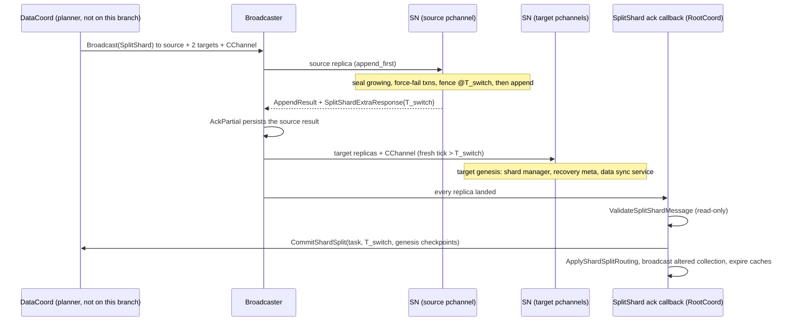
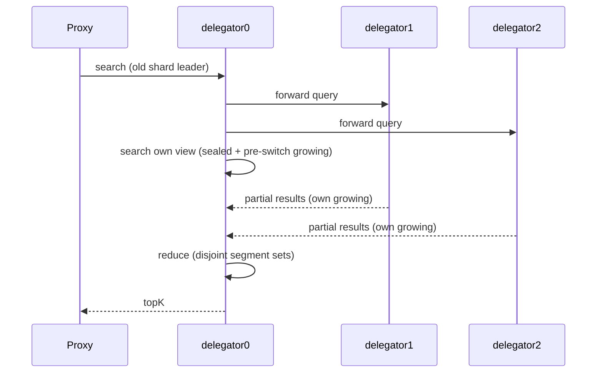
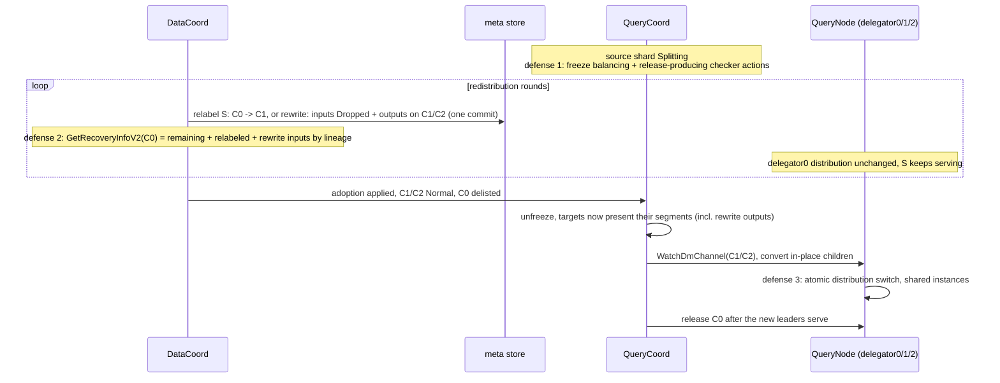

# Design Document: Online Shard Split for Namespace Collections

**Date**: June 2026
**Related Issue**: [#50463](https://github.com/milvus-io/milvus/issues/50463)

---

**What this branch implements.** The write switch (§6.1), the drain
predicate and the adoption commit's apply path (§6.3), the per-cluster
replication pieces (§6.5), and the StreamingNode lifecycle of a fenced source.
Nothing on this branch issues a split, and for now no split is issued for a
namespace collection at all (§1.3). Everything else this document describes
is marked **not on this branch**, and §11 lists all of it.

## 1. Overview

### 1.1 Motivation

A collection's shard (vchannel) count is fixed when the collection is created
(`ShardsNum` → `AllocVirtualChannels`, `internal/rootcoord/create_collection_task.go`).
As data grows, one shard becomes a bottleneck in three places at once:

- WAL write throughput on the StreamingNode;
- delegator memory and compute on the QueryNode;
- the compaction and index backlog of that shard.

Today the only way out is to create a new collection and re-import everything,
which is not acceptable for an online workload.

In the multi-tenant architecture a collection is organized as
**Collection → Shard → Namespace(=Partition) → Segment**. A namespace is the
tenant-isolation unit. Its data is physically isolated in object storage from
L0/L1 on, and a single namespace has a hard product limit equal to the capacity
of one shard. A namespace therefore never spans shards.

This design adds **online shard split**. One loaded shard is split into two
while reads and writes continue. For a namespace collection the split moves no
data: segments are only relabeled to their new shard.

**Prerequisite.** Master implements a namespace as a hidden VarChar
partition-key field (`handleNamespaceField`,
`internal/rootcoord/create_collection_task.go`). Segments carry only an
`is_sorted_by_namespace` flag. This design depends on the in-progress
namespace(=partition) work guaranteeing that every segment belongs to one
partition-key bucket, and that the L0 segment of a namespace delete is scoped
the same way. An L0 written by a primary-key-only delete is not, and §6.3
handles it. Without that guarantee the relabel argument of §3.1 does not hold.

### 1.2 Goals

- Split **one** shard into **two** shards online. Reads and writes keep working;
  a short latency increase is acceptable, data loss or inconsistency is not.
- A namespace collection redistributes by metadata-only relabel *(deferred:
  namespace collections are not split until the namespace(=partition) work
  lands, §1.3)*. A collection placed by primary key redistributes by rewrite
  (§6.3).
- Full consistency: no message loss or duplication, ordering preserved, no MVCC
  ghost reads, and correct deletes throughout the window.
- Crash safety: every step is idempotent and resumable. Before the fence a
  split can be aborted; after it, a split can only roll forward.
- The feature is gated by configuration and ships off:
  `dataCoord.shardSplit.enable` defaults to `false` (§9). On this branch
  nothing issues a split; the trigger lands later.

Out of scope: changing several shards at once, shrinking, a declared
shard count, and isolating a named tenant into its own shard.

### 1.3 Current scope: namespace collections are not split yet

**Convention.** Until the namespace(=partition) work §1.1 depends on lands on
master, no split is issued for a namespace collection
(`schema.enable_namespace=true`), in either `namespace.mode`. The planner must
not select one. Only collections placed by primary key are split, and they
split by rewrite (§6.3 step 2).

**Why.** Relabel needs every segment to lie wholly on one residue of the new
routing. Neither namespace mode on master provides that:

- `namespace.mode=partition`: a namespace is a real partition, but the proxy
  places rows by `hash(pk)` (`assignChannelsByPK`), so partition and shard are
  orthogonal and a segment holds rows of every residue.
- `namespace.mode=partition_key` with `namespace.sharding.enabled=true`: rows are
  placed by `hash($namespace_id)`, but the collection has a single partition-key
  bucket. The namespace field is added in rootcoord `prepareSchema`, after
  `broadcastCreateCollectionV1` has already set `NumPartitions = 1` for a schema
  without a partition-key field, and the proxy refuses `num_partitions` on such
  a schema. Every namespace therefore shares one partition, and with P = 1
  `routing.CheckNamespaceRelabelGranularity` refuses every M ≥ 2.

Splitting either shape today would take a rewrite of every row. That is
deliberately not done: namespace collections will split by the relabel this
document describes, once their data layout supports it.

**What the document keeps.** The namespace design (`hash($namespace_id)`
routing, relabel as its redistribution, and the admission and granularity
checks of §3.1) stays as the target for when the namespace(=partition) work
lands, with every partition's segments on one shard. It is marked
*deferred* where it appears. The checks on this branch are unchanged. They
refuse a `hash($namespace_id)` post-image that the layout cannot relabel, but
they do not refuse a `hash(pk)` split of a namespace collection: the
convention above is the planner's to enforce.

**To revisit when that work lands:** the planner's selection rule, and whether
the granularity rule still applies. If a namespace is its own partition and is
placed by its own hash, every segment is single-residue and relabel needs no
divisibility.

## 2. Background and Constraints

These properties of the current system shape the design:

1. **The channel set of a collection is fixed.** vchannels are allocated once
   at create-collection, and the whole stack assumes they never change.
2. **The WAL is the only sequencer.** Every message gets its TimeTick from the
   per-pchannel `AckManager`, and the confirmed watermark advances only over a
   contiguous acknowledged prefix. Forwarding an already-sequenced message
   into another WAL would sequence it twice and break the monotonic-arrival
   invariant that MVCC and `LastConfirmedMessageID` rely on. So the design
   never relays messages between WALs: each message is sequenced exactly once,
   in its destination WAL.
3. **Delete forwarding follows the delegator's distribution.** A delegator
   forwards a delete to the segments in its own distribution, filtered by
   partition and bloom filter (`internal/querynodev2/delegator/distribution.go`).
   If sealed-segment ownership were ambiguous during a split, deletes would be
   missed.
4. **QueryCoord cannot represent intermediate states.** The query target is
   built from `GetRecoveryInfoV2`, and `Segment.InsertChannel` is one value. A
   segment serving two channels at once does not exist in the data model.
5. **Growing segments are released only via `SyncTargetVersion`** from
   QueryCoord. A delegator QueryCoord cannot see cannot hand its growing
   segments over to sealed ones.

## 3. Routing Design

### 3.1 Residue routing

A collection carries one **routing modulus** M. Each shard owns a set of
**residues** modulo M, and the sets partition `[0, M)`, so placement is a
single array index:

```
routing_value = hash(<the field shard_by names>)
route(row)    = slots[routing_value % M]
```

`shard_by` names what is hashed: `hash($namespace_id)` for a namespace
collection, the primary key otherwise. It says nothing about placement:
`hash(pk)` does **not** mean `hash(pk) % <shard count>`, which stops holding the
moment a collection is split.

M is not the shard count. A never-split N-shard collection is M = N with one
residue per shard. That is exactly the legacy `hash % N` placement: a residue
table built from the channel order, not a second code path.

A split divides the source's residue set in two, and **M does not move**; that
is the common case. A shard down to a single residue `r` has nothing left to
divide, so M doubles and `r` becomes `{r}` and `{r+M}`. A doubling is
collection-wide: every untouched shard is re-expressed at the new modulus, and
both halves land in the one atomic meta update that commits the split. Deriving
the table (`routing.Derive`) checks that the residue sets tile `[0, M)` exactly
and that M does not exceed `2^15`. A gap or an overlap is refused, so malformed
routing meta fails loudly instead of misplacing writes.

**Admission for `hash($namespace_id)`** *(deferred with namespace splits,
§1.3; the checks run on this branch)*. The namespace key is valid only for a
collection whose rows have *always* been placed by it. The proxy places a row
by namespace only when `namespace.sharding.enabled=true` **and**
`namespace.mode=partition_key`. `sharding.enabled` is written as `false` at
create time unless the request sets it, and a `partition`-mode collection is
always placed by `hash(pk)`. So a default namespace collection has every row
spread over all shards by primary key. Routing it by namespace would send a
namespace's new rows to one shard while its old rows stay everywhere, and a
delete routed by the namespace hash would miss the rest. Both properties are
immutable after creation, so `routing.CheckShardByAdmission` decides this from
the properties alone. Any other collection splits under `hash(pk)` or not at
all.

**The relabel unit is the partition-key bucket.** In `partition_key` mode a row
lands in bucket `k = HashString2Uint32(namespace) % P`, where P is the
collection's partition count, and a segment holds one bucket. The row's residue
is the same hash `% M`. A bucket, and so every segment of it, lies wholly on
one residue (`k % M`) if and only if **M divides P**. Any other modulus cuts a
bucket's segments across two shards, which no relabel can place.
`routing.CheckNamespaceRelabelGranularity` therefore refuses a namespace
post-image whose modulus does not divide P, where P is the size of the split
message's partition snapshot.

Two consequences follow:

- A namespace collection's shard count is capped by its bucket count, because
  every shard owns at least one residue and M divides P.
- Untouched shards are re-expressed from the initial modulus N by doubling, so
  a namespace collection is splittable only when N divides P. Nothing checks
  this at create time on this branch.

**When the checks run.** Every refusal the split message alone can answer runs
before the fence, in `SplitShardParam.Validate`:

- names and shape of the post-image;
- tiling and the modulus cap;
- the source listed as `Splitting`, each target as `Creating` with at least
  one residue, and no shard listed as `Dropped` (a shard reaches `Dropped` only
  by being delisted, §6.3 step 4);
- namespace admission, read from the genesis schema's properties;
- the modulus dividing the bucket count.

The SplitShard ack callback re-runs the same function
(`streaming.ValidateSplitShardMessage`) as a read-only assertion before it
commits anything (§6.1 step 4). Checks that need the collection's current meta
run at apply time (§6.3 step 4). The planner must also run them before the
fence, against the meta it holds under the collection lock
(`streaming.CheckSplitShardAgainstCollection`, §6.1 step 2), because once the
source is fenced a refusal can only be retried.

**Representation cost.** A shard's residues are an explicit list, which is
`O(M)`, not `O(shards)`. Each doubling re-expresses every untouched shard's
list and doubles its length. At the cap the lists total 32,768 `uint64`s in the
collection meta and in every `DescribeCollectionResponse`. This is accepted
because a list makes the tiling check a set operation and the cap bounds the
worst case at a few hundred kilobytes. A range encoding is a later optimization
the wire format does not preclude.

**What this model gives up.** Residues cannot carve one oversized namespace
into a dedicated shard: the smallest unit is a residue, and a doubling cuts on
a hash bit rather than by size. Balancing is therefore statistical. Isolating a
named tenant needs a second placement scheme, which is why
`CollectionShardInfo.routing` is a `oneof`.

### 3.2 Metadata

The collection meta is the authoritative source of the vchannel list, so the
routing facts live next to it and change in the same transaction:

- `schema.CollectionShardInfo`, parallel to `virtual_channel_names`, gains a
  `ShardState` (`Normal / Creating / Splitting / Dropped`), the owning
  `vchannel_name`, and a `oneof` routing predicate. Today the only variant is
  `HashRouting`, the residue list. It is unset on a never-split collection and
  on a fenced source.
  - `routing.ShardsFromMeta` admits `Normal` and `Creating` shards, excludes
    `Splitting` and `Dropped`, and refuses the whole table when a state is
    unknown to this build.
  - This is deliberate: an unknown state is a newer server talking to an older
    reader, and routing around it would place rows by a rule this build cannot
    see. (Defined in milvus-proto #618; `model.ShardInfo` mirrors it.)
- `routing_modulus` is one number per collection, `0` before the first split.
  The modulus, not the presence of residues, says a collection has been split.
  A non-zero modulus with no residues behind it is malformed and refused.
  Falling back to the legacy modulo over a grown vchannel list would re-place
  every row.
- `shard_by`.
- New fields default to legacy-compatible zero values. The routing table is
  derived from the meta (`internal/util/routing`) and is not persisted
  separately.
- `DescribeCollectionResponse` carries `shard_infos`, `routing_modulus` and
  `shard_by`. The proxy's `DescribeCollection` returns all three on both the
  remote path and the cached path.

### 3.3 Routing refresh on fence

There is no routing version on the write path. When a write reaches a vchannel
a split has fenced, the StreamingNode's shard interceptor rejects it with
`STREAMING_CODE_SHARD_FENCED` and never appends it. **On this branch** that
code is classified unrecoverable in the streaming client, so the producer does
not retry the same vchannel.

`SHARD_FENCED` is distinct from `CHANNEL_FENCED`:

- `CHANNEL_FENCED` is term fencing of a pchannel, recovered by reconnecting to
  the *same* channel.
- `SHARD_FENCED` is permanent for the vchannel, recovered by refreshing routing
  and writing to a *different* vchannel.

**Not on this branch:** the proxy's reaction. The proxy is to invalidate the
cached collection meta, refetch it, re-resolve the write to the new owner, and
retry with bounded backoff, because the refresh can race the routing commit. A
namespace write maps to exactly one shard, so the retry is all-or-nothing.

`STREAMING_CODE_ROUTING_STALE` has been removed. It had no producer, and its
number, 19, is reserved in `streaming.proto`.

## 4. Design Overview

Five principles work around §2:

1. **The old delegator spawns child delegators in place** *(not on this
   branch)*. When delegator0 consumes the split message, it creates the two
   children on the same QueryNode and fronts them (forward + reduce).
   QueryCoord does not need to know they exist during the window.
2. **Children own no sealed segments** *(not on this branch)*. delegator0
   serves every sealed segment for the whole window. The children consume
   growing data and deletes from the new WALs. The growing→sealed handoff
   keeps running and lands in delegator0's view.
3. **Service ownership moves late; adoption is one-shot.** The new shards
   become visible to QueryCoord only after the source has drained. The commit
   that retires the source is applied by a cluster only once *that cluster's*
   DataCoord reports it drained. There is no partial ownership migration.
4. **The whole write switch is one broadcast.** One `SplitShard` message goes
   to exactly three kinds of vchannel: the source, the two targets, and the
   control channel. Every replica carries the same header and body, and what a
   replica does is decided by its vchannel's role (`message.SplitShardRoleOf`):
   - **source**: the write fence. Its node seals every growing segment of the
     vchannel, embeds their ids in the header, and tears the registration down,
     leaving a fence tombstone keyed by name. After `T_switch` the vchannel
     never accepts DML again.
   - **target**: the genesis of a new vchannel, registered exactly as
     `CreateCollection` does. The body carries the schema (in
     `CreateCollection`'s body shape) and the header the partition snapshot.
   - **control channel**: no effect in any consumer; it orders the ack
     callback.
   - **anything else**: a misroute. It is refused on the append path, and
     another shard of the same collection is no exception.

   The source is named in `BroadcastHeader.append_first_vchannels`. The
   broadcaster appends *and persists* it before any other replica, and
   `SplitShard` is `FreshTimeTick`, so every other replica takes a freshly
   allocated tick. The source holds no message after `T_switch`, and the
   targets hold none at or before it.
5. **Only facts travel in the WAL; coordinator actions happen in ack
   callbacks.**
   - The header names the collection, the task id, the source, the two
     targets, the sealed segments, and the partition snapshot.
   - The body carries the genesis schema and the routing post-image, which is
     the *only* copy of the residues and the modulus.
   - When to redistribute, when the source has drained, and when to adopt are
     local decisions. The cluster that planned the split and a cluster that
     only replayed it run the same callbacks. That is what makes the split
     replicable (§6.5).

## 5. Roles and State Machine

- **DataCoord, planning cluster** *(not on this branch)*. It detects the need,
  allocates the task id, the target names and pchannels, and the post-image, and
  **persists them before the first send** (§6.1 step 1). It then issues **one**
  `SplitShard` broadcast and reads nothing back from its result. Afterwards it
  redistributes, freezes the source (§8.2), and issues the adoption once its
  own drain predicate holds.
- **DataCoord, every cluster.** Two internal RPCs the callbacks call:
  - `CommitShardSplit`: an idempotent upsert of the task record by task id,
    with the source's `T_switch`; then the channel-added mark for each target
    (`catalog.MarkChannelAdded`, what `WatchChannels` gives a created
    collection's vchannels and what the garbage collector's `ChannelExists`
    guard reads); then seeding of each target's genesis channel checkpoint.
    The mark goes before the seed, in `WatchChannels`'s order, and the whole
    read-merge-upsert-mark-seed sequence is serialized per task id
    (`lock.KeyLock`), so a redelivered callback and a planner writing the
    same task cannot lose each other's fields (§6.1 step 4).
  - `CheckShardSplitDrained` (§6.3 step 3).

  It also counts a drained split source as flushed in flush-state checks
  (§6.3).
- **RootCoord.** Owns both callbacks: the `SplitShard` one (§6.1 step 4) and
  the `AlterCollection(shard_split_routing)` one, which judges and
  drain-gates an adoption before applying it (§6.3 step 4). Both write the
  meta through one path, `MetaTable.ApplyShardSplitRouting`.
- **StreamingCoord.**
  - On this branch: the broadcaster's append-first ordering with `AckPartial`,
    persisting each replica's extra append response, and `WaitVChannelsAcked`
    for a secondary's append gate (§6.5).
  - Not on this branch: allocating pchannels for new vchannels. The invariant
    of at most one vchannel per collection per pchannel is kept, so shard count
    is capped by pchannel count.
- **StreamingNode (source).** It receives the fence on the normal append path
  by owning the source pchannel. Under the vchannel-exclusive lock the shard
  handler seals the growing segments, embeds their ids, and force-fails active
  transactions. It installs the fence *before* it appends the fence record, and
  keeps it whatever the append returns (§6.1 step 3). Three things then happen
  at different times:
  - **Shard-manager registration.** It is torn down in the same critical
    section as the fence, leaving `SplitFence{TimeTick, TaskID}` keyed by name.
    This frees the pchannel's per-collection slot, so a target can be placed
    there at once. The tombstone answers a stale route with `SHARD_FENCED` and
    gives a re-sent fence its recorded tick.
  - **Data sync service.** It receives the source record, and its `dd_node`
    seals every growing segment of the vchannel, not only the ids in the header.
    It is closed on the flusher's dispatch goroutine once its acked channel
    checkpoint reaches its close gate
    (`flusherComponents.closeDrainedFencedSources`). The gate is the own tick of
    the first source record dispatched to the service, i.e. the seal record it
    actually consumed. It is not `T_switch`: after a failed first append, the
    first record in the WAL is the re-drive, whose tick is later, and gating on
    `T_switch` could close the service before that record reached it. On
    restart the gate is reseeded from `max(split_time_tick, checkpoint tick)`.
    An ack that would open the gate is not taken at its word: DataCoord
    answers Success to an update it stored clamped (for a collection with TEXT
    fields, to the earliest segment still Growing there, which a sealed
    segment with an empty buffer can be when the checkpoint passes the fence),
    so the flusher reads the checkpoint DataCoord holds
    (`GetChannelRecoveryInfo`'s seek position) and counts that one
    (`flusherComponents.ObserveCheckpointAck`). While it is short of the gate
    the service stays open and keeps reporting.
    It is never closed from
    the checkpoint callback, and the drop-collection teardown is not reused,
    because that teardown reaches DataCoord's `DropVirtualChannel`. Once
    closed, the source's flusher checkpoint is frozen at or past that gate.
    RecoveryStorage keeps the same gate (`recovery.SplitFenceGate`, one
    definition shared with the flusher) and calls a source whose own flusher
    checkpoint has reached it *drained* (`DrainedPastFence`): that is what an
    `AlterWAL` FLUSHING wait skips (§8.4) and what makes a retired source
    collectable (§6.5).
  - **Recovery meta.** It moves to `VCHANNEL_STATE_SPLITTED` with
    `split_time_tick = T_switch`, read from the record's `_ae`, and stays there
    until retired and collected (§6.5). A `CreateSegment` the storage observes
    on a `SPLITTED` vchannel -- only a replay can deliver one -- is skipped and
    reported as an inconsistency, as on a `DROPPED` vchannel (§8.11).
- **StreamingNode (targets).** Whichever nodes own the target pchannels create
  the targets from their replicas of the same broadcast. The recovery meta
  records each target's genesis position in
  `VChannelMeta.split_genesis_checkpoint`, and the flusher never recovers a
  target from before it (§10).
- **delegator0, delegator1/2, QueryCoord** *(not on this branch)*. See §6.2 to
  §6.4.
- **Proxy.**
  - On this branch: on a secondary, the replicate service's name remap and
    append gate (§6.5).
  - Not on this branch: routing by residue and reacting to `SHARD_FENCED`.


```mermaid
flowchart LR
    IDLE["Normal"] -->|"split planned and persisted"| PREP["Preparing"]
    PREP -->|"abort, no external side effects"| IDLE
    PREP -->|"one SplitShard broadcast, source appended and persisted first"| FENCE["Fenced at T_switch"]
    FENCE -->|"ack callback records the task and applies the post-image"| WIN["Window, redistribution"]
    WIN -->|"this cluster drained"| ADOPT["Adopting, AlterCollection(shard_split_routing) delists the source"]
    ADOPT -->|"source retired and collected locally"| DONE["Done"]
```

## 6. End-to-End Flow

### 6.1 Trigger and write switch

The write switch is **one broadcast and its ack callback**. There is no
coordinator→StreamingNode RPC: the streaming client already handles owner
discovery, retry across pchannel reassignment, and term fencing.

1. **Trigger** *(not on this branch)*. DataCoord decides to split a shard and
   checks its gates:
   - a concurrency limit;
   - a pchannel free of the collection for each target;
   - one active task per vchannel, so a shard is skipped while an unfinished
     task names it as source or target; otherwise the trigger would re-fire on
     it every tick.

   Shards holding a single namespace, or a single bucket, are excluded because
   they cannot be divided. The planner allocates the task id, the two target
   names, and the post-image, and **persists them before the first send**. The
   broadcast is deduplicated by an idempotency key built from the task id
   alone, and the broadcaster does not compare message content. A re-send of
   the same task with different targets therefore silently resolves to the
   first broadcast.

2. **One broadcast** (`streaming.NewSplitShardBroadcastMessage`).

   | Part | Contents |
   |---|---|
   | Header (`SplitShardMessageHeader`) | `collection_id`, `split_task_id` (never zero), `source_vchannel`, `target_vchannels` (exactly two), `flushed_segment_ids` (filled on the source replica), `partition_ids` |
   | Body | `genesis`: a `CreateCollectionRequest` whose schema carries the collection properties. `routing`: the post-image, which is the grown vchannel list, every shard's state and residues, the modulus and `shard_by` |
   | Recipients | the source, the two targets, the control channel |
   | Idempotency key | collection-scoped, `shard-split-<task id>` |
   | Resource keys | An obligation on the issuer, not a property of the message: the planner must start the broadcast under `SharedDBName + ExclusiveCollectionName` (DataCoord's `startBroadcastWithCollectionID`), which the broadcaster then holds until the ack callback returns. No issuer exists on this branch, so nothing takes these keys yet. Keys are collection names; §10 says what that means for ordering on a secondary |

   Nothing is derived from mutable meta later, so a retry and a replay commit
   the same topology. `SplitShardParam.Validate` runs every message-only
   refusal of §3.1 before anything is appended, and also refuses:
   - a zero task id;
   - an empty partition snapshot;
   - a target placed on a pchannel another listed vchannel of the collection
     occupies. The source's own pchannel is free, because the fence frees its
     slot;
   - a control channel that is not one (`funcutil.IsControlChannel`), and a
     control channel named as the source or a target. The control-channel
     result is found in the broadcast result by name, so a plain vchannel in
     that role builds a broadcast with no control-channel replica, whose
     callback could never take its commit tick; a control channel as the
     source reaches a builder invariant that panics instead of erroring.

   `Validate` cannot make the checks that need the collection's meta. **The
   planner must call `streaming.CheckSplitShardAgainstCollection` under the
   collection lock, immediately before `Broadcast`.** That function:
   - runs `Validate`'s checks;
   - requires the genesis properties to agree with the meta's on namespace
     admission;
   - requires the source to be a shard of the collection, and every shard of
     the collection to be listed by the post-image: a split retires nothing,
     so a forgotten live shard is a planning bug, not a retirement the apply
     would wait for;
   - runs the apply's own judgement (`routing.JudgeCommit`, §6.3 step 4) with
     the split's own delta: the header's source fenced, the header's two
     targets created, nothing else changed;
   - requires the source to be `Normal` in the meta and no target to exist yet.

   **The planner must also check DataCoord's split task store before
   `Broadcast`.** A split task id already recorded there for a different
   collection or a different source passes every check above. DataCoord's
   `validateCommitShardSplit` refuses it only inside the SplitShard ack callback,
   after the fence.

   A refusal after the fence can only be retried forever.

3. **Two-phase append and the fresh tick.** The broadcaster appends the source
   replica alone and **persists** it with a partial ack (`AckPartial`) before it
   appends anything else. On the source replica, the StreamingNode's shard
   handler does the following:
   - it refuses the replica (unrecoverable) if `split_task_id` is zero, before
     sealing or fencing anything;
   - on a first fence, it seals every growing segment
     (`FlushAndFenceSegmentAllocUntil`), embeds their ids, and fences the
     vchannel: tombstone, registration teardown and function-runner key
     release. The replica's own tick is `T_switch`. `SplitShard` is
     `ExclusiveRequired`, so active transactions on the vchannel are
     force-failed. The fence is installed **before** the record is appended and
     is kept whatever the append returns. An append error does not prove the
     record is absent: the WAL adaptor returns a canceled or expired context, or
     a fenced WAL term, as it gets it, and the backend may already have written
     the record;
   - on a re-fence by the **same** task, it appends again and **moves nothing**.
     The broadcaster re-drives a source replica whose append it has not
     persisted, whether that append landed or failed. The tombstone,
     `split_time_tick` and the flusher's close gate do not move;
   - on a fence already placed by **another** task, it refuses with
     `SHARD_FENCED`, carrying the recorded tick and task id on the error. No
     extra response is reported.

   On a first fence and on a same-task re-fence the handler reports the
   recorded tick back as `SplitShardExtraResponse{split_time_tick}`, in two
   places: on the append result, and on the record itself under the reserved
   `_ae` property. An ack from either side therefore carries it, and the
   broadcaster persists it in `AckedCheckpoint.extra`. RecoveryStorage reads
   `split_time_tick` from `_ae` too, falling back to the record's own tick only
   when the record carries none.

   **A first append that definitely failed.** No record carries `T_switch`
   then. Nothing was accepted after it either, so it is still a valid
   `T_switch` for the record the re-drive persists, and the re-drive reports it.
   Until the re-drive lands, DML on the source is refused with `SHARD_FENCED`.
   If the StreamingNode restarts first, the fence is lost with its memory and
   nothing recorded it, so the re-drive is a genuine first fence at a new tick.
   This is also why the flusher's close gate is the tick of the seal record it
   consumed rather than `T_switch` (§5).

   **A chunked fence record.** Chunking happens below every interceptor, so a
   source replica whose payload is split into chunks carries the same time tick
   and `_ae` on every chunk. An incomplete chunk set is never delivered to any
   reader and is discarded at the next time tick, and the append that wrote it
   only gives up when the WAL itself is going away. A partial write is therefore
   either the definite-failure case above or, if every chunk landed, the
   ambiguous one.

   The targets and the control channel are appended only after the source is
   durable. `SplitShard` is `FreshTimeTick`, so each of them takes a freshly
   allocated tick, strictly greater than `T_switch`. No barrier value is
   computed, carried or compared. The three consumers that treat
   `CreateCollection` as vchannel genesis (the shard manager, RecoveryStorage
   and the flusher) read a target replica by its role and share the schema
   parser.

   > **The source must be persisted before the rest is appended.** The
   > `> T_switch` guarantee rests on that order alone. Appending concurrently
   > would keep every primary-side test green, and would break the secondary's
   > append-gate liveness argument (§6.5).

4. **Ack callback** (`splitShardV2AckCallback`). It runs on every cluster the
   broadcast reached, once every replica has landed, and is retried with
   backoff until it returns nil while the resource keys stay held.
   1. If the collection is gone, or is not `Available()` (a `Dropping`
      collection, §6.1), it logs a Warn and stops, writing neither commit
      half: the routing apply would re-count shards and re-register targets
      that `DropCollection` has already settled, and the DataCoord record would
      mark targets added and seed checkpoints the drop never tears down (it
      drops only the vchannels the collection lists). `ApplyShardSplitRouting`
      refuses a non-`Available()` collection too, under its lock and before
      the judge (`errShardSplitRoutingCollectionUnavailable`), so a drop that
      lands between this check and the apply also stops the callback, before
      `BroadcastAlteredCollection`, which cannot resolve a `Dropping`
      collection. A result with no control-channel
      replica (found by name, so only a broadcast built around `Validate` has
      none) is returned as a retriable `ServiceUnavailable`, logged as the
      wedge it is, before either commit half: the control channel's tick is
      what the routing commit is stamped with. On the issuing cluster that
      tick is above `T_switch`; on a secondary it is local to the control
      pchannel and may be below the local `T_switch`, which nothing reads
      (§6.5).
   2. It re-runs `streaming.ValidateSplitShardMessage` as a **read-only
      assertion**. A failure is logged at Error, naming the wedge, and returned
      as a System error; nothing is committed.
   3. It checks that the genesis schema's collection properties agree with the
      meta's on what namespace admission reads
      (`routing.CheckAdmissionPropertiesAgree`). Admission was answered before
      the fence from the genesis copy, and the apply answers it from the meta's
      copy. A disagreement is logged at Error and returned; nothing is
      committed.
   4. **Judge** (`routing.JudgeCommit`, §6.3 step 4) with the split's own
      delta: the header's source fenced, the header's two targets created.
      Every other shard must be exactly what the meta holds. A post-image
      ahead of the meta -- it reflects a routing commit of the collection this
      cluster has not applied, which on a secondary happens when this
      callback overtook that commit's (§10) -- is returned as a retriable
      `ServiceUnavailable` before anything is committed, so no task is
      recorded for a split this cluster cannot apply yet. A source the meta
      does not list is told apart by DataCoord's record of the task
      (`CheckShardSplitDrained`): recorded means retired, a redelivery; not
      recorded means never created here, ahead. An incoherent post-image is
      logged at Error and returned.
   5. **DataCoord** (`CommitShardSplit`). It records the task with the
      source's `T_switch`, taken from the source result's
      `SplitShardExtraResponse`. A missing, foreign or zero extra is a
      retriable `ServiceUnavailable`, never a fallback to the append tick. The
      tick of a re-driven append is later than the fence it re-sent, and the
      source may already have drained past the first one. It also records the
      targets with residues taken from the post-image, marks each target
      added (`catalog.MarkChannelAdded`, an idempotent save; a target already
      marked for removal by `DropVirtualChannel` is left alone, so a late
      redelivery cannot revive it), and only then seeds each target's genesis
      channel checkpoint from the target's own append result, only if the
      target has none. The mark goes before the seed, as in `WatchChannels`:
      it is what the garbage collector's `ChannelExists` guard reads to keep a
      compacted-away segment's meta while the channel checkpoint is still
      behind it, so a consumer replaying from that checkpoint still finds it
      in `DroppedSegmentIds` and filters its rows; a target with a checkpoint
      but no mark had those rows replayed next to the compaction output. The
      record's read, merge and upsert, and the mark and seed after them, run
      under a per-task-id lock, so two writers of one task cannot lose each
      other's fields. DataCoord refuses a commit that does not name exactly
      one source and two targets, or that reuses a recorded task id for
      another collection or another source.
   6. **Meta** (`MetaTable.ApplyShardSplitRouting`, one catalog write under
      `ddLock`). The targets become write-routable. It judges again, under
      the lock, with the same delta; a post-image whose delta the collection
      already carries is a no-op, and a refusal is returned.
   7. `BroadcastAlteredCollection`, then the proxy caches are expired.

   DataCoord goes first because seeding is what makes a target safe for a
   coordinator-side reader to discover. Until a target has a checkpoint,
   DataCoord's seek position for it falls back to the collection's creation
   position, and the post-image is what makes the target discoverable to
   QueryCoord. The StreamingNode flusher does not depend on the seed. It
   recovers a target from `split_genesis_checkpoint` when DataCoord has no
   position for it, and never recovers a target from before its genesis (§10).
   Both halves are idempotent, so a crash between them is repaired by the
   retry.

5. **Proxy refresh** *(not on this branch)*. The proxy still places rows by
   vchannel position (`typeutil.HashPK2Channels`), and nothing refreshes
   routing on `SHARD_FENCED`. With the switch enabled as the code stands, the
   cache expiry in step 4 would hand the proxy a longer vchannel list, and
   every row would re-place against it. **The switch must not be enabled
   before the proxy routes by residue.**

WAL transactions need no extra machinery. The lock interceptor appends each
data replica under its vchannel-exclusive lock and force-fails active
transactions; the client retry loop replays them after the refresh. Only the
source and the targets pay this cost, since no other shard receives a replica.

Collection DDL must not interleave with the switch. That is the issuer's
obligation from step 2: a broadcast started under `ExclusiveCollectionName`
holds it from issue until its callback returns, and only under that key is the
partition snapshot the message carries exact. Neither the message nor any of
its consumers checks it. The keys are the issuer's lock guards stamped into the
broadcast header, not a property of the message, so the builder cannot add
them. This holds on the **issuing cluster** only. A secondary orders ack
callbacks by the replicated headers' keys, which are collection *names*: a
rename between the split and a `DropCollection` gives the two different
`ExclusiveCollectionName` keys, and the drop's callback can mark the collection
`Dropping` while the split's (or its adoption's) callback is still retrying. No
name-based key survives a rename, so no key was added; both callbacks ignore a
collection that is not `Available()` instead (step 4.1, §6.3).


```mermaid
sequenceDiagram
    participant DC as DataCoord (planner, not on this branch)
    participant BC as Broadcaster
    participant SN0 as SN (source pchannel)
    participant SNT as SN (target pchannels)
    participant CB as SplitShard ack callback (RootCoord)
    DC->>BC: Broadcast(SplitShard) to source + 2 targets + CChannel
    BC->>SN0: source replica (append_first)
    Note over SN0: seal growing, force-fail txns, fence @T_switch, then append
    SN0-->>BC: AppendResult + SplitShardExtraResponse{T_switch}
    BC->>BC: AckPartial persists the source result
    BC->>SNT: target replicas + CChannel (fresh tick > T_switch)
    Note over SNT: target genesis: shard manager, recovery meta, data sync service
    BC->>CB: every replica landed
    CB->>CB: ValidateSplitShardMessage (read-only)
    CB->>DC: CommitShardSplit(task, T_switch, genesis checkpoints)
    CB->>CB: ApplyShardSplitRouting, broadcast altered collection, expire caches
```

### 6.2 Read path during the window *(not on this branch)*

1. delegator0 consumes WAL0 in order, and the split message is the source's
   last entry. Every delete ≤ `T_switch` has been applied before the children
   exist.
2. On the split message, delegator0 reads the targets' consume start positions
   through the channel-checkpoint seek path, retrying until the callback has
   seeded them. It then spawns delegator1/2 with empty sealed sets. The new
   vchannels hold only data > `T_switch`.
3. Queries still arrive at delegator0. It fans them out to the children,
   searches its own view (sealed segments plus pre-switch growing), and
   reduces. The result sets come from disjoint segment sets (step 5).
4. The children apply every delete (> `T_switch`) to their own growing
   segments and forward a copy to delegator0, which applies it to everything
   it serves. Deletes are durable in the targets' L0 segments.
5. **In-window handoff.** Segments flushed during the window become sealed.
   This covers WAL0's fence-sealed segments and, later, the children's flushed
   growing segments. They are loaded into delegator0's view, and a child's
   growing segment is swapped out atomically, so the children never own a
   sealed segment.
6. **Serviceable timestamp.** delegator0's own tsafe freezes at `T_switch`.
   It serves at `min(tsafe1, tsafe2)`, so it never answers at `t` before every
   delete ≤ `t` has been forwarded.


```mermaid
sequenceDiagram
    participant PX as Proxy
    participant D0 as delegator0
    participant D1 as delegator1
    participant D2 as delegator2
    PX->>D0: search (old shard leader)
    D0->>D1: forward query
    D0->>D2: forward query
    D0->>D0: search own view (sealed + pre-switch growing)
    D1-->>D0: partial results (own growing)
    D2-->>D0: partial results (own growing)
    D0->>D0: reduce (disjoint segment sets)
    D0-->>PX: topK
```

### 6.3 Redistribution and adoption

1. **Relabel** *(deferred, §1.3; not on this branch)*. This is the
   redistribution for a collection routed by `hash($namespace_id)`. Each
   segment of the source moves to the target owning its bucket's residue: same segment id, new
   `InsertChannel`, done in batches. Namespace-scoped L0 segments move with
   their bucket. Segments the fence sealed are included; segments flushed from
   the targets' WALs are born there and need no relabel. `IsImporting`
   segments are skipped to a later round, because an import is still
   committing binlogs to them.

   Relabel is metadata-only and does not run on a DataNode. Like rewrite, it is
   mutually exclusive with compaction tasks on the source channel, so
   compaction keeps running on the source during the window and interleaves
   with relabel batches.

   **AllPartitions L0.** A delete by primary key only is written with
   `common.AllPartitionsID`, so its L0 segment belongs to no bucket and cannot
   be relabeled. Ordinary L0 compaction consumes it into the source's sealed
   segments. An L0 plan on the channel selects every flushed, non-importing
   L1/L2 segment of any partition whose effective timestamp is below the plan
   position. In one catalog transaction it adds the merged deltalogs to those
   segments and marks the L0 inputs `Dropped` (`compaction_task_l0.go`,
   `selectFlushedSegment` / `saveSegmentMeta`). Relabel or rewrite then moves
   the segments with the deletes already applied. The drain waits for all of
   it through "no non-`Dropped` segment on the source", and the split manager
   must make sure every such L0 is compacted within the window.

2. **Rewrite** *(not on this branch)*. This is the redistribution for a
   collection routed by `hash(pk)`. It is the contract the split manager's
   rewrite must implement:
   1. A rewrite is a **compaction-like task**. Its inputs are source segments,
      possibly only some of the source channel's segments per task. When it
      completes, **in one commit**, its inputs become `Dropped` and its outputs
      are committed on the target channels.
   2. Before adoption, the view QueryCoord fetches is derived from lineage
      (`compaction_from`), so it never contains both an input and its outputs.
      The source channel's view keeps presenting the rewritten inputs, and the
      outputs are not presented as target sealed segments. After adoption the
      targets' views present the outputs (§6.4).
   3. GC must not reclaim a `Dropped` rewrite input while the pre-adoption view
      still derives it.
   4. A rewrite, like relabel, is mutually exclusive with compaction tasks on
      the source channel, as mix and L0 compaction already exclude each other
      per channel in the compaction inspector.
   5. The drain predicate below is unchanged and is satisfied by rewrite
      through (1): a rewritten input is `Dropped`.

3. **Drain predicate** (`CheckShardSplitDrained`, on this branch). DataCoord
   answers per task. A task id it holds no record of is not an error: the
   answer is `recorded=false` with a Success status, and it is the adoption
   callback that treats it as ahead of the collection (step 4). The source is
   drained only when all of the following hold:
   - no segment in a non-`Dropped` state remains on the source vchannel;
   - the source's recorded `T_switch` is non-zero;
   - the source's channel checkpoint exists and is ≥ that `T_switch`;
   - no unfinished import job names the source vchannel.

   The checkpoint conjunct closes the async-flush window. The fence only writes
   the message, and the sealed segments reach DataCoord meta asynchronously.
   The checkpoint passes a position only after that position's data is synced
   and reported, so `checkpoint ≥ T_switch` proves the fence-sealed set is in
   meta. This is why the task carries the `T_switch` the fence actually landed
   on in *this* cluster.

   The import conjunct covers a job still in `Pending`/`PreImporting`, which has
   registered no segment yet and is invisible to the segment scan (§8.10).

   **The predicate cannot be satisfied on this branch.** The fence leaves the
   source's segments `Flushed`; only relabel (step 1) and rewrite (step 2) move
   them to `Dropped`, and neither is here. Until they land,
   `CheckShardSplitDrained` answers not drained for every real task, so the
   adoption's drain gate is exercised by unit tests only.

   **Flush state during the window.** Once the source's data sync service
   closes, its checkpoint stops near `T_switch`. The source stays in the
   collection's vchannel list until adoption. DataCoord's `GetFlushState` and
   `GetFlushAllState` therefore count a split source as flushed once its
   channel checkpoint ≥ its recorded `T_switch`; zero never counts.
   Everything the source ever accepted is ≤ `T_switch`, so this is exact, and a
   flush taken during the window does not wait for adoption. A
   `TruncateCollection` issued during the window waits on the same rule
   (`DropSegmentsByTime` asks `channelCheckpointCovers`): the source's
   checkpoint never reaches the truncate tick, and the waiting callback holds
   the `ExclusiveCollectionName` key the adoption needs. Dropping the source's
   segments by time stays exact, since each has its DML position at or before
   `T_switch`, below the truncate tick. `CommitShardSplit` wakes a truncate
   already waiting when it records `T_switch`. The exception
   needs a recorded `T_switch`, and only `CommitShardSplit` records one. While
   the SplitShard ack callback is wedged or still retrying, a flush wait whose
   timestamp is past the source's frozen checkpoint therefore stays false.

4. **Adoption.** It is an ordinary `AlterCollection` broadcast under the
   `shard_split_routing` field mask, carrying a post-image that moves the
   targets to `Normal` and delists the source, plus its `split_task_id`.
   Issuing it is not on this branch, and the issuer carries two obligations.
   It must broadcast to the control channel, every vchannel the collection
   lists (the source included, whose own replica is what retires it), and
   every vchannel the post-image names; the callback enforces only the part
   whose omission would leave state behind for good -- a commit that retires
   a vchannel must have been broadcast to it (the reach check, item 3 below).
   A target or an untouched shard the broadcast missed is not detected. It
   must also start the broadcast under the collection's name keys like any
   other `AlterCollection`; nothing about those keys orders its callback
   behind the split's on a secondary (§10).

   Its ack callback (`shardSplitRoutingAlterV2AckCallback`) **is** on this
   branch, runs on every cluster, and goes through the single apply path:
   1. **Shape.** The routing mask must travel alone: no other mask, no dropped
      fields, no load-config change, no bound index.
   2. **Judge before drain** (`routing.JudgeCommit`, on a snapshot of the
      meta). A commit carries a full post-image but may move the collection
      only by its **own delta** (`routing.CommitDelta`): a `SplitShard` fences
      its header's source (`Normal → Splitting`) and creates its header's two
      targets (born `Creating`); an adoption retires its task's source
      (delisted from `Splitting`) and adopts its task's targets
      (`Creating → Normal`), keeping their residues. The adoption message does
      not name the shard it retires, so the callback reads its delta off this
      cluster's DataCoord record of the task: `CheckShardSplitDrained`
      describes the record (`recorded`, `source_vchannels`,
      `target_vchannels`) as well as the drain. What the message alone can
      answer -- its shape and its tiling, the first rows of the table below --
      is refused before that record is asked for. Only a modulus grown by a
      split re-expresses the untouched shards' residues; an adoption changes
      no modulus. The outcomes are:
      - **Already applied.** A redelivered commit whose own delta is in the
        local meta, or has since been superseded by later commits -- its
        source delisted with the task recorded here, its targets adopted or
        since retired by a later split's adoption -- skips both the drain
        gate and the apply. Only the delta is judged: what the meta carries
        beyond it came from those later commits and is not this commit's to
        judge. An exact redelivery is recognized before DataCoord is asked,
        since a reclaimed task record could not name the delta. The one
        write outside a delta is back-filling `shard_by` onto an identical
        topology that has none.
      - **Ahead of the collection.** A post-image that differs from the meta
        by more than this commit's delta, in the forward direction, reflects
        a routing commit of the collection this cluster has not applied: a
        vchannel the collection does not carry and this commit does not
        create; another split's source retired, or its targets adopted; an
        untouched shard fenced; a modulus grown under an adoption; this
        commit's own source not yet in the state its delta starts from; or a
        task this cluster has no record of. Refused as a retriable
        `ServiceUnavailable`; it never reaches the reach check or the drain
        gate, and applies once the earlier commit has.
      - **Incoherent.** A post-image behind the meta, or one no commit
        produces, is logged at Error and returned:

      | Refusal |
      |---|
      | a post-image whose vchannel, pchannel and shard-info arrays are not parallel and non-empty, or that lists a vchannel twice (`routing.CheckPostImageShape`; a pchannel may repeat, since a split's targets live on their source's pchannel), or whose writable shards do not tile the key space at its modulus (`routing.CheckPostImageTiling`: `ShardsFromMeta`, then `Derive`). Judged from the message alone, first, and shared with `ValidateSplitShardMessage`, so an adoption -- whose post-image no builder validates before this judge -- is refused without its task record being asked for and never reaches the drain gate. `ApplyUpdates` is reached with this mask only after the judge, so its bounds guards never pad a persisted record |
      | a collection listing no vchannel: a never-split collection's modulus is its vchannel count, which every modulus comparison divides by, and no create or routing commit produces such meta |
      | a shard listed as `Dropped`: a shard reaches `Dropped` only by being delisted, which is what the reach check and the drain gate cover |
      | the modulus revoked to zero, shrinking, or (under a split) not a multiple of the collection's |
      | `hash($namespace_id)` on a collection not admitted (§3.1), read from the meta's properties |
      | an adoption that names no split task; no DataCoord could name its delta or answer its drain, so the callback refuses it itself before asking |
      | an untouched shard, or this commit's own shard, moved backwards (`Splitting` listed as `Normal`, `Normal` as `Creating`), or given residues that are not the collection's |
      | a split whose delta is partly in the meta and partly not (its apply is one write) or whose post-image does not list its source `Splitting` and its targets `Creating` with residues |

   3. **Reach.** A commit that retires a vchannel -- by now, only its own
      source -- must have been broadcast to it; otherwise it is refused.
   4. **Drain gate.** `CheckShardSplitDrained` for this cluster. Not drained is
      a retriable `ServiceUnavailable`, and the broadcaster retries. The gate
      runs on every cluster, but the primary's issuer is expected to send the
      adoption only once its own drain holds, so in practice the wait is seen
      on a secondary (§6.5).
   5. **Apply** through `MetaTable.ApplyShardSplitRouting`, which judges again
      under `ddLock`. Then the altered collection is broadcast and the proxy
      caches are expired from the collection the callback loaded -- its name
      and the aliases this cluster holds for it (`getCacheExpireForCollection`,
      as the `SplitShard` callback does) -- plus whatever the header's
      `cache_expirations` names, deduplicated. The header's list is an
      addition, never the only source: no adoption issuer fills it on this
      branch, and on a secondary a rename applied between the primary's issue
      and this apply leaves it naming a collection this cluster no longer
      knows, while a proxy whose cache survives keeps placing 1/N of the
      inserts on the retired source. A collection that entered `Dropping` in
      between expires only what the header names.

   The QueryCoord side of adoption is not on
   this branch. QueryCoord picks the targets up and issues `WatchDmChannel`. It
   converts the existing children in place rather than building fresh
   delegators:
   - **No re-subscribe.** `WatchDmChannel` already no-ops when the channel's
     delegator exists. The convert must also adopt QueryCoord's target
     version, drop the fronting wiring, and keep the consume position.
   - **No reload of relabeled segments.** `LoadSegments` skips segments
     already present, and relabel keeps the segment id. Rewrite outputs are
     new segments the targets present only after adoption, so they are loaded
     then.
   - **No premature reads.** `GetDataDistribution` skips non-serviceable
     delegators. A child has no sealed segments and no QueryCoord target
     version until the convert, so it is never returned by `GetShardLeaders`
     before adoption. delegator0 reaches it through an in-process handle.

5. QueryCoord releases the source shard after draining in-flight queries, and
   proxy caches are invalidated.

### 6.4 Release safety during redistribution *(not on this branch)*

Redistribution moves segments out of the source channel's recovery view. If
QueryCoord refreshed its target at that moment, the checker would release a
segment that is still serving. Three defenses keep every segment in at least
one complete view at every instant:

- **Defense 1: QueryCoord freeze.** The `Splitting` flag freezes balancing,
  channel moves, and the release-producing checker actions for the
  collection. Target refresh keeps running over defense 2's view, which only
  ever adds segments.
- **Defense 2: lineage-derived view.** While the source is `Splitting`,
  `GetRecoveryInfoV2` for it returns:
  - its remaining segments;
  - the segments relabeled to the targets;
  - the segments flushed from the target WALs;
  - the rewrite **inputs**, derived back from their outputs' `compaction_from`
    lineage, but never those outputs.

  The targets present no rewrite output until adoption, so no view holds an
  input and its output together. GC must keep a `Dropped` rewrite input while
  this view still derives it. A passive rebuild after a QueryNode restart sees
  the same complete list.
- **Defense 3: register-then-release with shared instances.** Adoption flips
  from an old complete view to a new complete view. The source is released
  only after the children's distributions are registered and the new leaders
  confirm serving. Segment instances are shared by id, so removing delegator0
  drops a reference and never unloads data still referenced.


```mermaid
sequenceDiagram
    participant DC as DataCoord
    participant META as meta store
    participant QC as QueryCoord
    participant QN as QueryNode (delegator0/1/2)

    Note over QC: source shard Splitting<br/>defense 1: freeze balancing + release-producing checker actions
    loop redistribution rounds
        DC->>META: relabel S: C0 -> C1, or rewrite: inputs Dropped + outputs on C1/C2 (one commit)
        Note over DC: defense 2: GetRecoveryInfoV2(C0) = remaining + relabeled + rewrite inputs by lineage
        Note over QN: delegator0 distribution unchanged, S keeps serving
    end
    DC->>QC: adoption applied, C1/C2 Normal, C0 delisted
    QC->>QC: unfreeze, targets now present their segments (incl. rewrite outputs)
    QC->>QN: WatchDmChannel(C1/C2), convert in-place children
    QN->>QN: defense 3: atomic distribution switch, shared instances
    QC->>QN: release C0 after the new leaders serve
```

The view of one relabeled segment `S` across the phases:

| Phase | meta: `S.InsertChannel` | QC target | delegator0 dist. | delegator1 dist. | physical instance |
|-------|------|------|------|------|------|
| before window | C0 | C0 holds S | holds S (serving) | — | loaded |
| window, S relabeled | **C1** | **view under C0 holds S** | holds S (serving) | empty sealed | loaded |
| after adoption flip | C1 | C1 holds S | holds S (to release) | **holds S (shared)** | loaded, 2 refs |
| after C0 release | C1 | C1 holds S | removed | holds S | loaded, 1 ref |

### 6.5 Replication

`SplitShard` and the adoption `AlterCollection` travel down the replicate
streams like any other DDL. A secondary ends up with the same topology, task
id, residues and modulus as the primary. Nothing flows back.

**Name remap.** Every channel name in the message names a *primary* channel.
The secondary proxy rewrites them before appending
(`replicateService.overwriteReplicateMessage`), by the rule `CreateCollection`
uses: pchannels correspond by index, and a vchannel name gets its pchannel
prefix replaced.

- `SplitShard`: the header's `source_vchannel` and `target_vchannels`; the
  post-image's `virtual_channel_names`, `physical_channel_names` and each shard
  info's `vchannel_name` (a mismatched name makes the table unreadable); and the
  genesis channel lists. The header's `flushed_segment_ids` is cleared: the ids
  are the primary's sealed segments, a same-task re-fence appends the header as
  received, and no consumer reads them off the record (the flusher seals every
  growing segment of the vchannel).
- `AlterCollection` with the `shard_split_routing` mask: the same lists and
  shard infos. No other `AlterCollection` carries channel names.

`append_first_vchannels` is remapped through the broadcast's own vchannel list.
The remap re-checks every invariant the builder enforces by panicking and
refuses a violation once, as a `ReplicateViolation`, rather than crashing on
every redelivery: a name not in that list; ack-sync-up combined with an
append-first vchannel; more than one append-first vchannel. A forced promotion
re-drives such a task through the broadcaster's own append path, where the
same invariants are asserted with panics. Collection id, partition ids,
task id, residues and modulus are the same facts in both clusters and are not
remapped. The `_ae` property is stripped when a record becomes a replicate
message, and again when it is rebuilt into a broadcast: an extra response
answers for the WAL that appended it, never for another cluster's.

**The append gate.** The replicate streams carry each pchannel independently
and restore no order between them. Without a gate, a target's genesis could be
appended on a secondary before its source's fence. So **a replica whose
vchannel is not in `append_first_vchannels` is not appended until the source
replica of the same broadcast has been acked in this cluster.** The gate sits in
`replicateService.Append`, after the remap, and waits on
`StreamingCoordBroadcastService.WaitVChannelsAcked(broadcast_id, vchannels)`.
That wait also covers the broadcast task's creation. A vchannel the wait names
that is not in this cluster's task for the broadcast is answered as a
`ReplicateViolation` too: the primary's replicas disagree about the broadcast's
own topology, and the code survives the streaming RPC, which collapses a
`merr` error to `UNKNOWN`. The gate logs it as an error that will not clear
and returns it; the replicate stream, which has no terminal state, still
retries from its checkpoint.

The control-channel replica is **never gated**. A gated replica blocks its
whole pchannel stream, and the control channel's stream carries the
control-channel replica of every collection's DDL, so a wait there would stall
replicated DDL for **every** collection on the secondary behind one split's
source pchannel. The wait would buy nothing: the replica has no shard, flusher
or recovery effect, and the ack callback still runs only once every replica,
the source included, is appended here. The cost is that the commit tick
(§6.1 step 4) is, on a secondary, a tick local to the control pchannel that may
be below the local `T_switch`. No reader compares it with a data pchannel's
tick: `T_switch` and the drain gate come from the source replica's own result,
cache expiry uses a fresh TSO, and the proxy's guarantee-ts floor and
QueryCoord's schema barrier only need it past the last schema change, which a
split is not. `CreateCollection`, `CreatePartition` and `DropPartition` stamp
their meta with the same kind of tick on a secondary. The exemption cannot skip
a legitimate wait, because a control channel is never append-first.

The gate first **short-circuits** a replica this cluster already appended:
- the pchannel's replicate checkpoint is from the same source cluster, and
- the replica's replicate tick ≤ that checkpoint's tick.

This matters because a redelivery whose broadcast task was already tombstoned
and collected here would otherwise wait for a task that is never recreated.

The short-circuit does not cover a **second copy** of a target replica. The
primary's broadcaster retries a replica whose append answered an error even if
it landed, and `SplitShard` has no WAL-level dedup, so the primary WAL can hold
two copies of one target's genesis; the second carries a later replicate tick.
It can reach a secondary after the broadcast completed there, and then the task
cannot answer for it: once the task is collected nothing recreates it, and once
a first copy has passed, its ack rebuilds a task that holds only that replica,
so a second copy would wait on a source ack that is never delivered again. So
`WaitVChannelsAcked` also opens when every named vchannel's replica is **on
record** as landed on this cluster, asked through a checker DataCoord registers
with the broadcaster registry (`registry.IsAppendFirstReplicaRecorded`): a
recorded non-zero `T_switch` for that source (`splitSourceFenceRecorded`). The
record is sufficient on its own: `CommitShardSplit` writes it from the source's
append result on this cluster, a source is fenced by at most one split (another
task's fence is refused before any of its targets is appended), and task records
are never removed. It is asked before the wait and every 5s during it; a checker
error counts as not recorded. No timeout lets a replica through.

*Why it cannot wedge replication.* A gated replica blocks its whole pchannel
stream, so "the source never waits" is not the argument. Progress rests on
three facts:

- (a) the source replica's tick is strictly below every other replica's,
  because the primary appends *and* persists it first;
- (b) ticks are totally ordered across pchannels, coming from one TSO;
- (c) each stream delivers its pchannel in tick order.

Take the minimum-tick head among all streams. If it is the source replica, it
is not gated. If it is gated, its source replica has a smaller tick and is
either already appended or queued behind a smaller head, which contradicts
minimality. Fact (a) lives in the broadcaster (`pendingBroadcastTask.Execute`),
not in the gate.

The wait is observable, because head-of-line blocking otherwise looks like
wedged replication:
- a Warn after 30s naming the broadcast and the vchannels;
- the gauge `milvus_streaming_replicate_gated_appends`, per pchannel, which
  returns to zero when the wait ends.

`broadcaster.Close()` releases every waiter.

A gated replica also leaves its replicate stream idle. Behind a proxy with a
stream idle timeout (envoy's default `stream_idle_timeout` is 5 minutes) the
stream is cut once per idle period: the sending cluster logs one Warn
(`restart replicate stream client due to unexpected error`), reconnects,
re-sends from its checkpoint, and the replica re-enters the gate. Semantics
are unaffected; expect one such Warn and re-send per idle period for as long
as the gate holds.

**Callback parity.** Both clusters run the same callbacks. On a secondary,
`CommitShardSplit` finds no task and creates it in `Redistributing` with the
**local** `T_switch` and the **local** genesis checkpoints; the two clusters'
ticks differ and neither reads the other's. A secondary's acks come from its
consuming nodes, which is why `T_switch` also travels on the record (`_ae`).
The secondary's DataCoord then redistributes and drains on its own, and
broadcasts nothing.

**Adoption is gated per cluster.** A replicated adoption passes through the same
shape check, judge, reach check, drain gate and `ApplyShardSplitRouting` as the
primary's; it carries no extra trust. The primary is drained when it sends
(an obligation on the issuer, which is not on this branch), so the drain wait
below is a secondary-only phenomenon. A secondary refuses with a retriable
`ServiceUnavailable` until its own drain holds, and the broadcaster retries.
A collection that is not `Available()` skips the judge and the drain gate --
one being dropped may never drain -- and `ApplyShardSplitRouting` refuses it,
so the callback logs a Warn and stops before `BroadcastAlteredCollection`.
While it retries, the callback holds the broadcast's keys -- `SharedDBName`,
`ExclusiveCollectionName`, and the `SharedCluster` key that
`appendSharedClusterRK` puts on every broadcast -- and the ack callback of
every replicated DDL whose keys conflict is deferred behind it (the scheduler
fast-locks a task's keys before running its callback; the replicas themselves
are still appended):

- same collection: index DDL, `Import`, snapshot DDL and manifest updates
  (DataCoord); load, release, transfer-replica and drop-load-info
  (`AlterLoadConfig`, QueryCoord); `CreatePartition`/`DropPartition`, every
  other `AlterCollection`, `TruncateCollection`, `DropCollection`;
- same database, because they take `ExclusiveDBName`: `RenameCollection`,
  alias DDL, `AlterDatabase`, `DropDatabase`;
- cluster-level, because `ExclusiveCluster` is the same lock as
  `SharedCluster`: `FlushAll`, resource-group DDL,
  `UpdateReplicateConfiguration`, and a forced promotion's own callback.

Nothing orders its callback behind the split's on a secondary:
resource keys are collection names, and a rename between the two gives them
different keys, so the adoption's callback can run while the split's is still
retrying. The delta-only judge then refuses it as ahead of the collection and
it is retried (§10). No key was added for this.

**Retiring the source's WAL-side state.** When the adoption replica reaches the
source's node:
- the shard interceptor's name gate appends it with no shard effect, since the
  registration is gone;
- the flusher does not forward it;
- the data sync service has been closed, or will be, on the dispatch goroutine
  once its acked checkpoint passes its close gate (§5). On a secondary the adoption
  can arrive before the fenced segments are flushed, which is why the adoption
  itself closes nothing.

RecoveryStorage marks the `SPLITTED` meta `retired` and removes the row once
the source's **own** flusher checkpoint has reached its fence gate
(`vchannelRecoveryInfo.DrainedPastFence`): the seal record's tick, which is
`split_time_tick` except after a re-driven fence, where it is later, and is
reseeded on restart as `max(split_time_tick, checkpoint tick)`
(`recovery.SplitFenceGate`, the flusher's close gate). That is the condition
the flusher closed the source's data sync service on, so it holds once that
service closed; a source whose checkpoint passed `T_switch` but whose service
has not consumed the seal record is not collected, since its segments are
still growing. It is judged per vchannel, not by the pchannel-wide minimum
flusher checkpoint: with two splits on one pchannel that minimum is the first
source's frozen checkpoint, below the second's fence until the first is
adopted, and a vchannel with no checkpoint yet (a data sync service just
rebuilt) would pause every collection on the pchannel. The pchannel-wide
minimum keeps one job, the truncation bound (§8.4). The flusher checkpoint
update wakes the persist loop the moment a pending retirement crosses its
gate. It removes it by handing
the catalog a `DROPPED` snapshot with `retired` still set, which
`dropAllVirtualChannel` recognizes and skips `DropVirtualChannel` for. There is
no `DropVChannel` message, because when a source may be collected is a local
fact.

**Operator rules.** These are rules, not mechanisms:

1. **Replicate `SplitShard` and `AlterCollection` together**, or neither.
2. **No graceful switchover while a split is in flight.** A *forced* promotion
   is handled while the adoption has not yet replicated:
   `fixIncompleteBroadcastsForForcePromote` strips the replicate header from the
   pending replicas and re-drives them through the normal path, which
   reproduces the two-phase order. After that point, rule 4 applies.
3. **The trigger runs on the primary only** (not on this branch).
4. **Do not force-promote a secondary between an adoption replicating to it and
   that secondary draining.** The retrying adoption callback holds the
   broadcast's resource keys. Those include `SharedCluster`, which
   `appendSharedClusterRK` adds to every broadcast, and the locker keys on
   domain+name only, so `SharedCluster` and `ExclusiveCluster` are the same
   lock. Every cluster-exclusive DDL callback therefore queues behind the
   drain, including the promotion's own callback, `FlushAll`, resource-group
   DDL, and `UpdateReplicateConfiguration` -- on top of the same-collection
   and same-database DDL listed above. Fixing it changes locker semantics
   and is a follow-up (§11).

## 7. Consistency Guarantees

**Every invariant is scoped to one cluster.** `T_switch` is the tick the local
fence landed on.

- **Total order.** The source holds only messages ≤ `T_switch`, and the targets
  hold none ≤ `T_switch`, genesis included. On the issuing cluster this comes
  from appending and persisting the source first, plus `FreshTimeTick`, which
  closes the hole a batch-prefetching TSO allocator would otherwise open. On a
  secondary the append gate supplies the order. Collection DDL cannot
  interleave on the issuing cluster; on a secondary a rename can let a drop in,
  and the callbacks then stop on the `Dropping` collection (§6.1). `T_switch` is recorded on the task by the callback, from
  `SplitShardExtraResponse`, because the drain gates on it.
- **No loss, no duplication.** A write the fence rejects is refused in the shard
  interceptor, before the backend append (interceptor order: idempotency →
  redo → lock → replicate → timetick → shard). It is never persisted, and its
  allocated tick is acked with the error. The fence does not invalidate the
  source vchannel's idempotency window (`InvalidatesIdempotencyWindow` lists
  only DropCollection, TruncateCollection and DropPartition): a split drops no
  data, so a retried keyed insert that landed before the fence is answered as a
  duplicate with its original result, which is correct, while one the fence
  refused never entered the window (the owner's failed append releases its key)
  and is refused with `SHARD_FENCED` again. The WAL summary records nothing for
  a `SplitShard` or an adoption, so a retired source keeps its dedup history
  until the summary's retention GC drops it. This covers a retry that still
  reaches the source. A retry the proxy re-routes to a target after
  `SHARD_FENCED` is not covered, because the target's window does not know the
  key (§11, the proxy write path). A transaction force-failed by the fence never
  committed, so its body messages in WAL0 are dropped by the consumer-side
  TxnBuffer. The split's own appends are idempotent:
  - a duplicate target replica is a no-op;
  - a duplicate source replica of the same task appends again and moves
    nothing, reporting the first tick;
  - a source append that returns an error keeps its fence, so no DML lands
    after `T_switch` whether or not the record persisted;
  - a fence from another task is refused with `SHARD_FENCED`;
  - a fence whose own task id is zero is refused before anything else.

  The broadcast itself is deduplicated by the task id's idempotency key.
- **Ordering.** Within a WAL, order equals TimeTick order. Across the switch the
  proxy re-dispatches rejected writes in order *(not on this branch)*.
- **MVCC without ghosts** *(read path, not on this branch)*. A read is the
  union of delegator0's view and the children's growing data, which are
  disjoint segment sets. The serviceable timestamp `min(tsafe1, tsafe2)` keeps
  delegator0 behind the forwarded deletes. Rewrite outputs appear only after
  adoption, when their inputs leave the source view (§6.4).
- **Delete correctness in three layers.**
  - *Serving*: deletes > `T_switch` are forwarded to delegator0 in memory.
  - *Durable*: they persist as the targets' L0 segments.
  - *Bake-in*: after adoption, L0 forwarding applies them to the redistributed
    segments at load.
- **Crash recovery.** The split message is durable in the source WAL, and the
  broadcast task is durable in the streamingcoord catalog, including each
  replica's persisted extra response. The task record and genesis checkpoints
  are written by the callback, which is retried until it succeeds. If the
  StreamingNode restarts, the fence persists with the message, and the
  tombstone and the flusher's close gate are rebuilt from every `SPLITTED`
  vchannel. §10 has the full table.

## 8. Engineering Constraints

1. **Delete retention is L0-based.** An L0 segment's deletes must reach the
   segments they apply to before the L0 is dropped, and nothing is lost either
   way. An L0 compaction on the source bakes them into the source's sealed
   segments in the same transaction that drops the L0. A namespace-scoped L0
   that is relabeled keeps its deletes until L0 forwarding applies them after
   adoption.
2. **No compaction freeze; a QueryCoord freeze** *(not on this branch)*.
   Compaction and clustering on the source are **not** frozen during the
   window. They interleave with relabel and rewrite, which are mutually
   exclusive with compaction tasks on the source channel (§6.3). On the
   QueryCoord side the source is excluded from balancing and channel moves.
   GC must not reclaim a `Dropped` rewrite input the pre-adoption view still
   derives (§6.4).
3. **In-place handoff** *(not on this branch)*. QueryCoord's watch path must
   convert an existing child instead of releasing and re-watching (§6.3 step 4).
4. **Old-vchannel lifecycle.** WAL truncation of the source's pchannel is bounded
   by the minimum flusher checkpoint over its vchannels. It therefore proceeds
   up to the source's frozen flusher checkpoint and no further, until the source
   is retired and collected. Two gauges per pchannel signal that pin:
   - `milvus_wal_recovery_oldest_splitted_vchannel_age_seconds` is the age of
     the oldest `SPLITTED` vchannel not yet collected, 0 when there is none;
   - `milvus_wal_recovery_truncation_lag_seconds` is now minus the minimum
     flusher checkpoint, absent while some vchannel has none.

   Both refresh on each persist-loop round. On this branch nothing issues the
   adoption, so a fenced source stays pinned until one does. After adoption the
   source is *retired*, not dropped, and DataCoord's `DropVirtualChannel` is
   never called for it (§6.5).

   The truncation bound is deliberately the pchannel-wide minimum, drained
   sources included: on restart the flusher rebuilds every vchannel of the
   snapshot, the source included, from the position DataCoord holds for it, so
   the WAL must keep that position until the source is collected. A WAL backend
   switch (`AlterWAL`) asks a different question, whether everything is
   persisted, and its FLUSHING wait (`GetFlusherCheckpointByTimeTick`) skips a
   `SPLITTED` source that has drained past its fence gate (`DrainedPastFence`,
   §5): the source's checkpoint is frozen there for as long as adoption takes,
   and counting it made the wait a deadlock the RW WAL never came back from. A
   source that has not drained yet, or has no checkpoint yet, is still waited
   on; a pchannel whose vchannels are all drained sources answers with the
   storage's own checkpoint. The switch's advance stage still seeds a new-WAL
   position for the drained source, like every other vchannel, because the
   position DataCoord holds for a vchannel is decoded under the current WAL's
   name on the next open; the rebuilt service acks past its reseeded gate at
   once and closes again, and DataCoord's drain predicate keeps holding.
5. **Shard count cap.** One vchannel per collection per pchannel, so a
   collection's shard count is capped by `rootCoord.dmlChannelNum`. A
   namespace collection is additionally capped by its bucket count (§3.1).
6. **Replication.** A split is allowed with replication enabled. The
   obligations are operational (§6.5 operator rules).
7. **BM25 statistics** are shard-level and are rebuilt for the new shards before
   adoption *(not on this branch)*.
8. **Rolling upgrade.** See Rollout.
9. **No accidental release.** All three §6.4 defenses must hold.
10. **Import × split.** Nothing in the WAL fences `Import`: the shard interceptor
    has no handler for it and takes no shard-manager action on any vchannel.
    For an import running when a split happens:
    - its segments stay on the source vchannel;
    - the drain waits for it, because an unfinished job naming the source fails
      the drain predicate (§6.3 step 3);
    - relabel skips its `IsImporting` segments until they finish;
    - an `Import` replica on a fenced source appends with no shard effect.

    An import planned after a split is not handled on this branch (§11).
11. **Collection-keyed messages addressed to a vchannel this pchannel does not hold.** The
    registration map is keyed by collection id, and the fence frees the source's
    slot. A replica can therefore reach a pchannel that no longer holds its
    vchannel: one addressed to the fenced source, or to a source whose slot a
    target now occupies. The shard interceptor gates such messages **once**, in
    `DoAppend`, with `CheckIfVChannelCanBeWritten` on the message's own
    vchannel:

    | Message | Vchannel not held by this pchannel |
    |---|---|
    | `CreatePartition`, `DropPartition`, `SchemaChange`, `AlterCollection` | appended with no effect on shard state |
    | `TruncateCollection` | appended with no effect on shard state. DataCoord's `DropSegmentsByTime` then waits for each vchannel's checkpoint to reach the truncate tick. A source whose checkpoint has reached its recorded `T_switch` counts as covered (the `GetFlushState` rule), because its data sync service has closed and the checkpoint will not move again. All of the source's segments fall inside the truncate range and are dropped. Without the exception the callback would wait forever while holding the collection's key, and the adoption could never be issued. |
    | `DropCollection` | appended; only the addressed vchannel's function-runner key is released |
    | `ManualFlush` | fenced source: appended with an empty segment list and `ManualFlushExtraResponse{[]}`, so `Flush` succeeds; never held: refused unrecoverable, as before |
    | `Insert`, `Delete` | not gated here; their own admission refuses a fenced vchannel with `SHARD_FENCED` and any other with an unrecoverable error. The redo interceptor, which re-resolves the partition outside the vchannel lock, asks `CheckIfVChannelCanBeWritten` when that lookup fails, so an insert racing a fence that lands between its iterations is `SHARD_FENCED` too, not unrecoverable |
    | `CreateCollection`, `SplitShard` | not gated; they create or release the registration themselves |
    | `CreateSegment`, `Flush` | refused: `SHARD_FENCED` on a fenced source, unrecoverable on a vchannel never held; a `Flush` from the old architecture is exempt |
    | `FlushAll`, `Import` | not gated; pchannel-level, or no handler |

    A broadcast replica is appended rather than refused because the broadcaster
    retries a refused replica forever while holding the collection's key.

    `CreateSegment` and `Flush` are not broadcast replicas. This node's own
    segment workers append them, and the workers stop on either error. Their
    handlers look a partition up by (collection, partition), not by vchannel,
    and a target of the same collection on the same pchannel registers the same
    partitions. So a source worker still retrying after the fence would
    otherwise act on the target. `ShardManager.CreateSegment` and
    `FlushSegment` also re-check the vchannel name under the manager lock.
    Dropping a partition manager (at the fence, `DropCollection` or
    `DropPartition`) cancels its segment-alloc worker. The source's segments
    are sealed by the fence itself: the flusher seals every growing segment of
    the vchannel when it consumes the fence record (§5).

    On the consume side, RecoveryStorage skips a `CreateSegment` it observes on
    a `SPLITTED` vchannel and reports it as an inconsistency, as it skips one on
    a `DROPPED` vchannel. The name gate keeps one from being written, so one
    observed can only be a replay -- a WAL offset reset, or a snapshot
    persisted `SPLITTED` with a checkpoint from before the fence -- and
    registering it would leave a `GROWING` assignment nothing ever seals: the
    fence record, the only thing that seals the source's segments, was already
    consumed.

    A real `DropCollection` of a split collection is a drop, not a retirement.
    The source's recovery meta goes `DROPPED` with `retired` cleared, and
    `DropVirtualChannel` is called for it. This is intended: the
    "never `DropVirtualChannel`" rule is about retirement only.

12. **Snapshots.** `CreateSnapshot` of a collection with a non-zero routing
    modulus is refused with `OperationNotSupported` (3000). A snapshot records
    only the vchannel list and the shard count. While a source is still listed,
    a restore fails on the channel count. After adoption, a restore would not
    recognize the residue layout and would rebuild the collection under
    `hash % N`. Supporting it needs the modulus and the shard infos in the
    snapshot.

## 9. Configuration

| Key | Default | Refreshable | Effect |
|---|---|---|---|
| `dataCoord.shardSplit.enable` | `false` | yes | Gates issuing a new split, at the builder: `streaming.NewSplitShardBroadcastMessage` refuses with `OperationNotSupported` (3000) while it is off. A split already in the WAL is always carried through on every cluster, including a secondary whose switch is off. |

The trigger's thresholds land with the trigger.

## 10. Failure Handling

- **Ordering: the source first, inside one broadcast.** The source replica is
  the first WAL action and the commit point. The cost is that a target-creation
  failure cannot abort: the fence is already committed. The append is
  idempotent, and the broadcaster retries it across reassignment. This is why
  every message-only refusal runs before the broadcast (§6.1 step 2).
- **Before the broadcast** (`Preparing`): abort is allowed, and nothing is in
  any WAL. Once the fence is in the WAL the task is forward-only. A target is
  write-routable from the moment the post-image publishes it, so it is never
  abandoned.
- **Shard states advance monotonically**: `Normal → Splitting` for a source,
  which then leaves the vchannel list (it reaches `Dropped` only by being
  delisted), and `Creating → Normal` for a target. A commit may move the
  collection only by its own delta (§6.3 step 4); a redelivered commit, whose
  delta is already in the meta or has since been superseded by later commits
  (its source delisted and recorded, its targets since retired), is a no-op.
  A post-image ahead of the
  collection by more than that is a retriable `ServiceUnavailable` that is
  waited out; one behind it, or one no commit produces, is an incoherent
  post-image and stays an error.

  **Ordering of routing commits.** The WAL order is the primary's, on every
  cluster; what can differ is the order the ack callbacks run in.
  - *Primary.* A broadcast holds its keys from issue.
    `broadcastTask.MarkAckCallbackDone` persists the tombstone before it
    releases them, and recovery re-takes the keys of every non-tombstone task.
    So while an earlier routing commit's callback can still re-run, no later
    one of the same collection can be issued: callbacks run in WAL order.
  - *Secondary.* A `REPLICATED` task holds no key from issue. Tasks join the
    ack callback scheduler as their control-channel replica is acked, and each
    pass fast-locks a task's keys and runs its callback while holding them; a
    task that fails to lock stays pending and reserves nothing, so a later
    task whose keys are free runs first. Keys are collection names. Two
    routing commits of one collection issued on either side of a rename
    therefore hold different keys, and while the earlier one's callback is
    still retrying -- an adoption waits for this cluster's drain, which can
    take hours -- the later one runs. Its post-image, derived on the primary
    after the earlier commit, already reflects that commit.
  - *The judge.* Rather than a new key that would survive a rename, the judge
    lets a commit apply only its own delta. The later commit is refused as
    ahead of the collection, retriably, until the earlier one has applied; a
    `SplitShard` refused this way records no DataCoord task (§6.1 step 4), and
    an adoption refused this way never asks the drain. Nothing is ever applied
    on another commit's behalf, so the earlier commit's own gates -- the
    adoption's drain, the split's task record and target seeding -- are never
    skipped. Every other replicated DDL keeps its existing scheduling.

| Crash point | Behavior |
|---|---|
| `Preparing` | The task can be aborted; no trace in any WAL or meta. |
| Broadcast persisted, around any replica's append | The broadcaster re-drives it. A source result already persisted by `AckPartial` is not re-appended. A re-appended source replica of the same task succeeds and moves nothing, reporting the first `T_switch`. A re-appended target replica is a no-op. |
| Source append returns an error | The fence was installed before the append and stays. The re-drive takes the same-task path and reports the first `T_switch`. After a definite failure, DML on the source is refused with `SHARD_FENCED` until the re-drive lands. If the StreamingNode restarts before that, the fence is lost with nothing recording it, and the re-drive is a genuine first fence. |
| Secondary: a routing commit acked while an earlier one of the collection still retries, after a rename gave them different keys | Its callback may run first. The judge refuses it as ahead of the collection, retriably, and it applies once the earlier commit has. A `SplitShard` refused this way records no task; an adoption refused this way never asks the drain. |
| During the ack callback | Retried to success. `CommitShardSplit` upserts by task id, and the routing apply is idempotent. `T_switch` is read from the persisted extra response, so a coordinator restart does not lose it. |
| DataCoord dies before `Broadcast()` returns | It re-issues under the same idempotency key and gets the original broadcast's result. The planner must have persisted the parameters (§6.1 step 1). |
| StreamingNode restart | `SPLITTED` vchannels are restored and tombstones rebuilt by name (`split_time_tick`, `split_task_id`). The flusher's close gate is reseeded from `max(split_time_tick, checkpoint tick)`. The flusher recovers every vchannel of the recovery snapshot, the source included, so a source whose data sync service had already closed is rebuilt from its DataCoord checkpoint. The pchannel's scan then starts no later than that checkpoint, about `T_switch`, and the service closes again once drained. A target is rebuilt from its own recovery meta and recovered no earlier than `split_genesis_checkpoint`. That covers both cases before `CommitShardSplit` seeds the target: DataCoord has no position for it, or DataCoord falls back to the collection's creation position. A target whose genesis was recorded before a WAL backend switch recovers from the checkpoint the switch gave DataCoord: the genesis is compared by time tick, and by message id only on the same WAL. |
| `AlterWAL` while a drained split source is closed | The FLUSHING wait skips the source, since its own flusher checkpoint has reached its fence gate; the advance stage seeds it a new-WAL position like every other vchannel; the rebuilt service closes again on its first ack (§8.4). A source that has not drained yet is waited on. |
| Secondary proxy restart while gated | The stream reconnects, replays from its checkpoint, and either short-circuits on the replicate checkpoint or re-enters the wait. |
| Forced promotion, adoption not yet replicated | `fixIncompleteBroadcastsForForcePromote` re-drives the pending replicas through the normal path, reproducing the two-phase order. The new primary drains and adopts. |
| Forced promotion after the adoption replicated, before the local drain | The promotion's callback queues behind the retrying adoption, which holds the cluster key. **Operator rule** (§6.5 rule 4). |
| Graceful switchover mid-split | Not reconciled. **Operator rule** (§6.5 rule 2). |

- **A source result without `SplitShardExtraResponse`** (a node that does not
  report it) makes the callback return `ServiceUnavailable` and retry forever.
  Upgrading the node does not clear it: the persisted checkpoint is never
  replaced, and an acked source replica is never re-driven. It needs manual
  repair of the broadcast task (Rollout).
- **A broadcast acked with no control-channel replica** makes the `SplitShard`
  callback return a retriable `ServiceUnavailable`, logged as a wedge, on
  every retry. `Validate` refuses to build one (§6.1 step 2); this covers a
  message built around it.
- **A replica append refused with an unrecoverable streaming code** (a
  vchannel fenced by another task, `ErrVChannelConflict`, an unknown role, an
  old node) is retried exactly like a transient failure, with backoff, while
  the task holds its resource keys; there is no terminal state (§11). It is
  logged as unrecoverable and counted by
  `milvus_streamingcoord_broadcaster_append_unrecoverable_total{message_type,
  streaming_code}`, which is what tells a task that will never be accepted
  from a slow one: a rate that does not return to zero is the signal.
- **BM25/index rebuild failure** *(not on this branch)*: the window extends and
  the rebuild is retried.

## 11. Implementation Surface

**On this branch:**

| Component | Work |
|-----------|------|
| Common | The `SplitShard` message type (49; `ExclusiveRequired`, `FreshTimeTick`, replicable) with its header, body and `message.SplitShardRoleOf`. `SplitShardExtraResponse`. `BroadcastHeader.append_first_vchannels`. The `_ae` record property (`message.SetAppendExtra`). `AckedCheckpoint.extra`. `AlterCollectionMessageUpdates.split_task_id` and `messageutil.RetiresVChannel`. `SplitShard` in the delegator msgstream whitelist (`delegatorMessageTypes`); the querynode filter node still drops it. `STREAMING_CODE_SHARD_FENCED` = 18 (unrecoverable; carries tick and task id only on a re-fence refusal; 19, the former `ROUTING_STALE`, stays reserved). The `schemapb` routing fields. `internal/util/routing`: `ShardsFromMeta`, `Derive`, `CheckShardByAdmission`, `CheckNamespaceRelabelGranularity`, `CheckAdmissionPropertiesAgree`, `JudgeCommit` with `CommitDelta`, `CheckNoListedDroppedShard`, and `CheckPostImageShape` / `CheckPostImageTiling`, the message-only checks shared with `ValidateSplitShardMessage`. |
| DataCoord | `CommitShardSplit` and `CheckShardSplitDrained` as internal RPCs; the former marks each target added before seeding its checkpoint and is serialized per task id; the latter describes the recorded task (`recorded`, source and target vchannels) as well as the drain, and answers `recorded=false` for a task it does not hold. The `SplitShardTask` record and store, indexed by source vchannel. The flush-state exception for a drained split source (`channelCheckpointCovers`). `CreateSnapshot` refusal for a split collection. The append gate's record checker (`splitSourceFenceRecorded`). |
| RootCoord | The `SplitShard` ack callback, with its properties-agreement check, its refusal of a result with no control-channel replica, and its judge before `CommitShardSplit`. The `AlterCollection(shard_split_routing)` callback: shape, judge with the task record's delta, reach, drain gate, apply, cache expiry from the loaded collection's name and aliases plus the header's list. `MetaTable.ApplyShardSplitRouting` with `routing.JudgeCommit`, and the topology bookkeeping a changed vchannel list needs (`generalCnt`, pchannel stats). |
| StreamingCoord | The broadcaster's two-phase append with `AckPartial`. Persisting the extra append response. `WaitVChannelsAcked`, its shutdown release and its exit on a recorded append-first replica (`registry.RegisterAppendFirstReplicaRecordedChecker`); a vchannel outside the broadcast is answered as a `ReplicateViolation`. The counter `milvus_streamingcoord_broadcaster_append_unrecoverable_total` for replica appends refused as unrecoverable (still retried). The ack callback scheduler and the resource key locker are unchanged. |
| StreamingNode | Source: the fence (task id required, seal, tombstone, registration teardown, function-runner key release, installed before the append and kept on error, first-tick re-fence); `SPLITTED` + `split_time_tick` (from `_ae`) + `retired` with local collection; the flusher sealing every growing segment of the vchannel, and the data sync service closed on the dispatch goroutine at the seal record's tick; the two truncation gauges. Target: the three genesis paths, and `VChannelMeta.split_genesis_checkpoint`, from which the flusher recovers a target and before which it never recovers one. The single name gate (§8.11), covering `CreateSegment` and `Flush`; a dropped partition manager cancels its segment-alloc worker. Misroute refusal. The fence gate shared by the flusher and RecoveryStorage (`recovery.SplitFenceGate`, `DrainedPastFence`): a drained source is skipped by the `AlterWAL` FLUSHING wait and, once retired, collected by its own checkpoint. A `CreateSegment` replayed onto a `SPLITTED` vchannel is skipped with an inconsistency. The redo interceptor answers `SHARD_FENCED` to an insert racing the fence. |
| Proxy | On a secondary: name remap for `SplitShard` and `AlterCollection(shard_split_routing)` (clearing `flushed_segment_ids`; refusing a malformed broadcast header -- ack-sync-up with append-first, more than one append-first, a name outside the broadcast -- as `ReplicateViolation`), the append gate with its checkpoint short-circuit, and the gated-appends gauge. `DescribeCollection` returns the routing fields on both paths. |
| `streaming` package | `SplitShardParam.Validate` / `ValidateSplitShardMessage`, shared by the builder and the callback; `Validate` requires a real control channel, and neither accepts one as the source or a target. `CheckSplitShardAgainstCollection`, for the planner. |

**Not on this branch**; these land with the split manager:

- **The trigger and planner.** Primary only. It covers target pchannel
  allocation in StreamingCoord and persisting split parameters before the first
  send (§6.1 step 1). It must put the collection properties on
  `SplitShardParam.Schema`, call `streaming.CheckSplitShardAgainstCollection`
  under the collection lock right before `Broadcast` (§6.1 step 2), check
  DataCoord's split task store for the task id already recorded against a
  different collection or source (§6.1 step 2). It must never select a
  namespace collection (§1.3). The feature switch and configuration (§9) come
  with it.
- **Redistribution.**
  - Relabel for namespace collections (§6.3 step 1), *deferred* until the
    namespace(=partition) work lands (§1.3): metadata-only, mutually
    exclusive with compaction tasks on the source channel, and making sure
    every AllPartitions L0 on the source is L0-compacted within the window.
  - The rewrite contract for pk-routed collections (§6.3 step 2): a
    compaction-like one-commit task, the lineage-derived pre-adoption view, GC
    retention of `Dropped` inputs, and exclusion with compaction tasks.
  - Issuing the adoption, and the QueryCoord balance and channel-move freeze.
- **The split task record's lifecycle.** The DataCoord catalog has
  `ListSplitShardTask` and `SaveSplitShardTask` only, `CommitShardSplit` puts
  a record in `Redistributing` and nothing moves it further, and nothing runs
  on collection drop, so the `split-shard-task/` keys and the in-memory store
  only grow. A reaper on `Done` and on collection drop is a follow-up.
- **The proxy write path.** Residue lookup, reject-and-refetch on
  `SHARD_FENCED`, and cache invalidation on adoption. Also a keyed insert
  retried onto a target. If the response to a keyed insert that landed on the
  source is lost, the retry is re-routed to a target once the proxy reacts to
  `SHARD_FENCED`. The target's idempotency window does not know the key, so the
  rows are written twice (§7 covers only a retry that still reaches the
  source). Two options: ask the source's window before re-routing, or hand the
  source's keys over to the targets at the fence. **The switch must not be
  enabled before this lands.**
- **The read path.** QueryNode: in-place children, fronting fan-out and reduce,
  delete and TimeTick forwarding, `min(tsafe)`, and in-window handoff.
  QueryCoord: the `Splitting` freeze, the lineage-derived recovery view, the
  in-place convert, and the source release. All of §6.2 and §6.4.
- **Import planned after a split.**
- **Snapshots of a split collection** (§8.12).

Follow-ups on code that *is* here:

- The adoption callback should not hold the cluster resource key across its
  drain wait (§6.5 rule 4). Fixing it changes locker semantics, so it is
  tracked separately.
- **A streaming-version gate for `SplitShard`.** Nothing before
  `NewSplitShardBroadcastMessage` checks that every node understands type 49
  (there is no `WaitUntilWALbasedDDLReady`-style marker for it); the mixed
  version cases under Rollout are what such a gate would prevent.
- **A terminal state for a persisted broadcast task.** `pendingBroadcastTask`
  retries every append error identically, so a task that hits a permanent
  refusal (`SHARD_FENCED` by another task, `ErrVChannelConflict`, an unknown
  role, an old node) retries forever holding `ExclusiveCollectionName`. That
  is a broadcaster framework change, not a split change. On this branch such
  a refusal is logged as unrecoverable and counted
  (`milvus_streamingcoord_broadcaster_append_unrecoverable_total`, §10); the
  retry semantics are unchanged.
- **The split task record's lifecycle** (a reaper on `Done` and on collection
  drop) is listed above under "not on this branch"; it is a follow-up on
  `CommitShardSplit`, which is here.
- **A per-channel result contract for `UpdateChannelCheckpoint`.** DataCoord
  filters out a channel whose `GetLatestWALLocated` fails or names another
  node and still answers Success for the batch; the StreamingNode's
  checkpoint updater then runs every task's callback, so the flusher counts
  the source's checkpoint as acked -- and closes its data sync service once
  that ack reaches the gate -- on an ack DataCoord never persisted. The
  flowgraph's close message reports the checkpoint once more; if that is
  filtered too, DataCoord's drain predicate is not satisfied until a restart
  rebuilds the service and re-reports it. Fixing it needs DataCoord to answer
  per channel. The close gate no longer depends on it: an ack that would open
  the gate is checked against the checkpoint DataCoord holds (§5), which
  covers a filtered update as well as one DataCoord clamped
  (`GetMinGrowingSegmentCheckpoint`, TEXT collections). What still trusts the
  bare ack is the flusher checkpoint RecoveryStorage keeps
  (`DrainedPastFence`, WAL truncation), on every vchannel as on master; with
  the persisted position in the answer the extra read goes away too.
- **DDL whose broadcast vchannels differ from the local list.** A split lets
  a secondary list a source the primary has already delisted while its own
  adoption waits for its drain (a rename in between gives the two callbacks
  different resource keys, so nothing orders them). `TruncateCollection`
  then skips the shard info of a listed vchannel the broadcast did not reach,
  but the secondary does not truncate the source's segments, which a
  redistribution (not on this branch) would then carry into the targets;
  `DropCollection` likewise never
  calls `DropVirtualChannel` for that source, and an `Import` job is not
  started while its ready vchannels differ from the listed ones.
- **A duplicate target replica of a split whose collection was being dropped.**
  The append gate opens for a collected broadcast on DataCoord's record of the
  fence (§6.5). A SplitShard callback that found its collection gone or
  `Dropping` records nothing, so a second copy of one of its target replicas
  that reaches a secondary after that broadcast was collected there still waits
  forever. It needs a duplicate written by a retried append, a drop racing the
  split's callback on that secondary, and 24h (or 8192 tombstones) between the
  two copies. Closing it needs a record that the fence landed which does not
  depend on the collection: recording the task for a dropping collection too,
  with its targets' channel marks and checkpoints cleaned up by the drop, or a
  landed-fence fact kept by the broadcaster itself.
- **A retired source's channel mark stays "added".** `CommitShardSplit` marks
  the targets added, and nothing ever marks a retired source removed, because
  retirement never calls `DropVirtualChannel` (§6.5). Harmless: the mark only
  keeps the GC guard on, and a fenced source gets no new segments. Like every
  channel mark on master, the key is never deleted.

**Rollout.** `dataCoord.shardSplit.enable` is off by default, and no trigger
exists on this branch to issue a split, so the mixed-version cases below are
the constraints for turning the switch on, not live risks: upgrade before
enabling it.

Wire changes:
- All proto changes on the Milvus side are additive: message type 49,
  `SplitShardMessageHeader`/`Body`, `SplitShardExtraResponse`,
  `AckedCheckpoint.extra` (field 4), `VChannelMeta.split_genesis_checkpoint`
  (field 8), and the DataCoord split RPCs, whose
  `CheckShardSplitDrainedResponse` carries `recorded` (3), `source_vchannels`
  (4) and `target_vchannels` (5). Streaming code 19 is reserved.
- `etcd_meta.proto`'s `shard_infos` moved from a local `CollectionShardInfo`
  to `schemapb.CollectionShardInfo`, whose field 1 is the same
  `last_truncate_time_tick` varint, so persisted bytes stay compatible.
- The milvus-proto pin moves from `c39cddab3fac` (master) to `a301a6af926b`.
  From #618, part of this feature: `commonpb.MsgType_SplitShard = 120`,
  `DescribeCollectionResponse.shard_infos = 20 / shard_by = 21 /
  routing_modulus = 22`, and `CollectionShardInfo`/`HashRouting`/`ShardState`.
  The bump also brings unrelated fields the server does not implement:
  - `CreateSnapshotRequest.skip_index = 7`,
    `DescribeSnapshotResponse.skip_index = 8`,
    `RestoreSnapshotRequest.skip_index = 8`,
    `RestoreExternalSnapshotRequest.skip_index = 6` (#658);
  - `SubSearchRequest.function_chains = 8` (#659).

What is not compatible is behavior:

- An **old StreamingNode** has no handler for type 49. Its produce server
  refuses the append outright (`MessageType.Valid` looks the type up in the
  node's own enum), so a broadcast whose phase 1 already fenced the source on
  a new node retries the rest forever, holding the collection key, until the
  old node is upgraded. An old node that takes over a pchannel holding a
  `SplitShard` record does not fence, and its flusher forwards the source
  replica into the data sync service, where `fromMessageToTsMsgV2` panics on
  the unknown type.
- A **StreamingNode without `SplitShardExtraResponse`** (neither the append
  extra nor `_ae`) makes the SplitShard callback return `ServiceUnavailable`,
  and the collection's DDL is wedged. Upgrading the node does not clear it: a
  checkpoint persisted without the extra is never replaced, and an acked
  source is never re-driven. Only manual repair of the broadcast task clears
  it, so every StreamingNode must be upgraded before any split is issued.
- **A flush wait while the SplitShard callback is wedged** stays false for the
  split collection once its timestamp passes the source's frozen checkpoint,
  because the flush-state exception needs the `T_switch` that only
  `CommitShardSplit` records (§6.3 step 3).
- An **old secondary proxy** neither remaps a replicated `SplitShard` nor gates
  it, so the secondary would create targets under primary names, in any order.
- A **new secondary proxy with an old secondary StreamingCoord**: the append
  gate's `WaitVChannelsAcked` comes back `Unimplemented`, the gate returns it
  as it stands, and the replicate stream retries from its checkpoint into the
  same answer, so that pchannel's replication stops until the coord is
  upgraded.
- An **un-upgraded secondary** has neither the delta-only judge nor the extra
  response. A routing commit that overtakes an earlier one there is applied
  instead of retried, and its SplitShard callback wedges as above. Every
  secondary must be upgraded before any split is issued.
- **Rolling back** to a version without `VCHANNEL_STATE_SPLITTED` (4), after a
  source was fenced, registers that source as a live shard again.
- **Rolling back StreamingCoord** while a two-phase broadcast is `PENDING`:
  the old recovery knows no `append_first_vchannels` and re-drives every
  remaining replica in one `AppendMessages` call, so a target genesis can land
  with a tick at or below `T_switch`.
- **A split collection cannot be snapshotted** (§8.12).

So: upgrade every secondary and every StreamingNode (and every other node)
before any split is issued, and do not roll back across a split that has
fenced.
