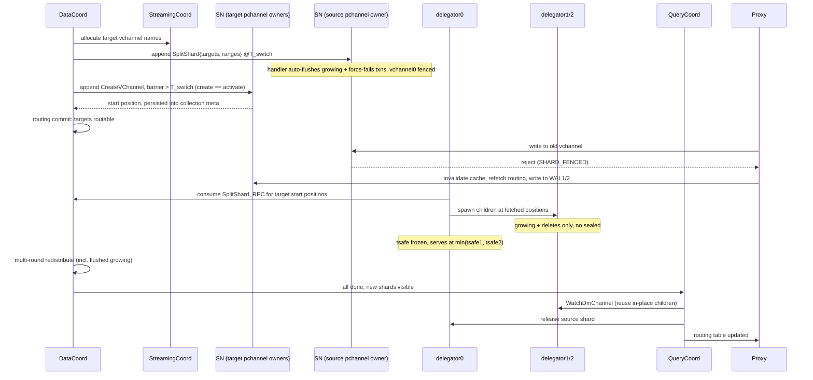
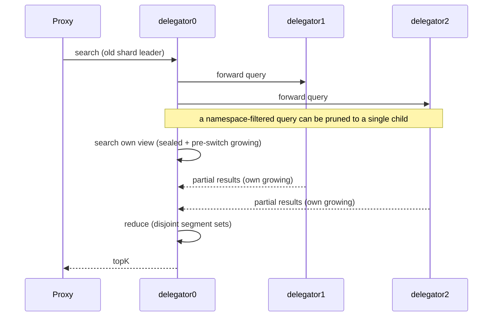
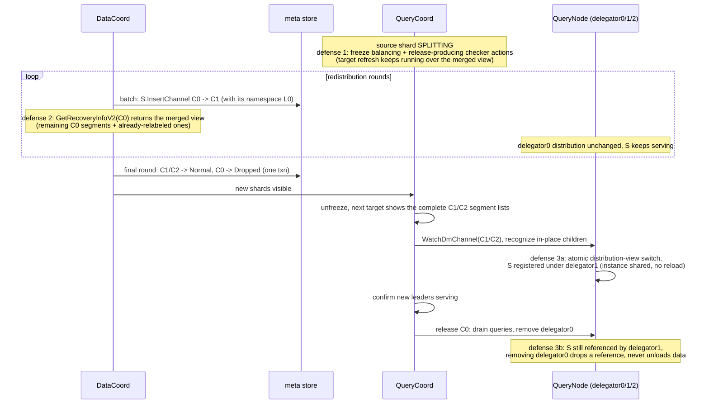

# Design Document: Online Shard Split

**Date**: June 2026
**Related Issue**: [#50463](https://github.com/milvus-io/milvus/issues/50463)

**Revision, September 2026.** Two changes, both recorded in place:

- **Routing is by residues** against one collection-wide modulus, not by the
  byte-comparable key ranges this document originally specified. §3.1 records
  why. Everything from §4 on is unaffected by that change.
- **The design now covers hash-routed (primary-key) collections too**, not only
  namespace ones. They share the whole spine — the fence, target genesis, the
  write switch, the fronting read window, the freeze defenses, adoption — and
  diverge in exactly three places, each marked *hash-routed* where it appears:
  the redistribution rewrites rows instead of relabeling segments (§6.5), a
  request's fence retry is per row rather than per request (§3.3), and the shard
  count can be set to an arbitrary value, which fences every shard at once
  (§3.5, §6.6).

---

## 1. Overview

### 1.1 Motivation

The number of shards (vchannels) of a collection is fixed at creation time
(`ShardsNum` → `AllocVirtualChannels`, `internal/rootcoord/create_collection_task.go`)
and cannot be changed afterwards. As data grows, a single shard becomes a
bottleneck in three places at once: WAL write throughput on the
StreamingNode, delegator memory and compute on the QueryNode, and the
backlog of compaction/index jobs on that shard. Today the only way out is
to create a new collection and re-import all data, which is unacceptable
for online workloads.

In the multi-tenant architecture, a collection follows the hierarchy
**Collection → Shard → Namespace(=Partition) → Segment**. A namespace is
the tenant-isolation unit: its data is physically isolated in object
storage from L0/L1 on, per-namespace vector indexes move together with the
namespace folder, and a single namespace has a hard product limit (500M
rows / 2TB) equal to the capacity of one shard. A namespace therefore
never spans shards and is the natural atomic unit of splitting.

This design adds **online shard split** for namespace-enabled (multi-tenant)
collections: a loaded shard is split into two shards without stopping reads
or writes, with **zero data rewrite** — segments only need to be relabeled
to their new shard, because every segment belongs to exactly one partition
(namespace) and a namespace never spans shards (§3.1).

**Hash-routed collections.** An ordinary collection is routed by
`hash(pk) % shardNum`. Its shard's segments hold rows whose primary keys spread
uniformly over the whole key space, so there is no boundary on which a segment
can be cut whole and the relabel argument above does not apply. Such a collection
is split by the same machinery with one phase replaced: the redistribution
**rewrites** the source shard's rows into per-target segments (§6.5) instead of
relabeling them. Everything else — the fence, the target genesis, the write
switch, the fronting window, the freeze defenses, adoption — is shared.

That also makes the shard count settable to an arbitrary value rather than only
doubled, because a rewrite can move a row anywhere. A **rehash** fences every
shard at once and rewrites the whole collection (§3.5, §6.6); it is never
proposed automatically.

**Prerequisite.** Current master implements namespaces as a hidden VarChar
partition-key field with isolation (`handleNamespaceField`,
`internal/rootcoord/create_collection_task.go`), and segments only carry an
`is_sorted_by_namespace` flag — there is no per-namespace partition, no
one-namespace-per-segment guarantee, and no namespace-scoped L0 isolation
yet. This design **depends on the in-progress namespace(=partition) work**
delivering exactly those guarantees (every segment belongs to one
namespace; L0 segments are namespace-scoped). Without them, the
zero-data-rewrite relabel argument does not hold for segments containing
multiple namespaces that straddle the split.

### 1.2 Goals

- Split one shard of a namespace collection into two shards online; reads
  and writes keep working through the whole procedure (a short latency
  increase is acceptable, data loss or inconsistency is not).
- Change a hash-routed collection's shard count to an arbitrary `M`, online,
  with the same guarantees.
- No data rewrite **for a namespace collection**: its redistribution is a
  metadata-only relabel of segments (including the namespace-scoped L0
  segments). A hash-routed collection cannot have that — its segments straddle
  every boundary — and pays an `O(bytes)` rewrite instead (§6.5).
- Full consistency: no message loss or duplication, ordering preserved,
  no MVCC ghost reads, deletes correct throughout the transition window.
- Crash safety: every step is idempotent and resumable; before the write
  fence the split can be aborted, after the fence it can only roll forward.
- The feature is fully gated by configuration and disabled by default.

## 2. Background and Constraints

The following properties of the current system shape the design:

1. **The channel set of a collection is fixed.** vchannels are allocated
   once at create-collection; the whole stack assumes they never change.
2. **The WAL is the only sequencer.** Every message gets its TimeTick from
   the per-pchannel `AckManager` (serialized allocation from the global
   TSO), and the confirmed watermark advances only over a contiguous
   acknowledged prefix. Forwarding an already-sequenced message into
   another WAL would sequence it twice and break the monotonic-arrival
   invariant that MVCC and `LastConfirmedMessageID` rely on. Therefore the
   design never relays messages between WALs: a message is sequenced
   exactly once, in its destination WAL.
3. **Delete forwarding follows the delegator's distribution.** A delegator
   forwards a delete to the segments found in its own distribution
   (filtered by partition and bloom filter,
   `internal/querynodev2/delegator/distribution.go`). If sealed-segment
   ownership were ambiguous during a split, deletes would be missed.
4. **QueryCoord cannot represent intermediate states.** The query target is
   built from `GetRecoveryInfoV2`, and `Segment.InsertChannel` is a single
   value: a segment serving two channels at once does not exist in the
   data model.
5. **Growing segments are released only via `SyncTargetVersion`** issued by
   QueryCoord; a delegator invisible to QueryCoord cannot hand its growing
   segments over to sealed ones.

## 3. Routing Design

### 3.1 Residue routing

A collection has one **routing modulus** `M`, and each shard owns a set of
**residues** taken against it. A shard's predicate is

```
hash(namespace) % M  ∈  residues(shard)
```

where `hash` is `typeutil.HashString2Uint32`. The residues of all shards tile
`[0, M)` exactly, so every namespace has exactly one owning shard.

Initial state of an `N`-shard collection: `M = N`, shard `k` owns `{k}`. That
state is **implicit** — a collection that has never been split carries no
residues in meta, and a shard list with no residues anywhere is read as "shard
`i` owns residue `i` at modulus `len(shards)`". Since the legacy
`HashNamespace2Channels` is `HashString2Uint32(namespace) % len(channels)`, this
is the existing assignment bit for bit, and an existing collection needs no
migration.

Splitting a shard **divides the residues it owns**: the set is cut in two,
weighted by the data actually sitting on each residue, and `M` does not move. Only
a shard down to a single residue has nothing left to divide; then `M` doubles and
the residue `r` becomes `{r}` and `{r + M}`.

> **A doubling is a collection-wide change.** Residue `r` at `M` covers
> `{r, r + M}` at `2M`, so when `M` doubles every untouched shard's residues must
> be re-expressed at the new modulus in the same commit, or half of that shard's
> keys route nowhere.

**A namespace still never spans shards.** One namespace has one hash, so it falls
on one residue at any modulus and therefore belongs to exactly one shard. That is
what keeps the zero-rewrite relabel of §1.2 valid: a segment holds one namespace,
so it moves whole.

For the same reason a shard holding a **single namespace** is still excluded from
the trigger (§6.1): every key in it hashes alike, so no division and no doubling
separates anything, and its growth is bounded by the namespace hard limit
instead.

**Why residues rather than the key ranges this design originally specified.** An
earlier revision routed on a byte-comparable key space,
`big_endian(hash(namespace)) || namespace_utf8`, with each shard owning a list of
`[lower, upper)` ranges and a binary search at lookup. Three things decided
against it:

1. Extending the split to hash-routed collections needs hash routing regardless.
   Two routing models means two derivations, two write paths, and two places to
   get the tiling check wrong; one model means the proxy, the routing commit and
   the DataNode partitioner all derive from the same package.
2. The legacy assignment already **is** a residue assignment, so backward
   compatibility is an identity rather than a special case.
3. Balance came from *searching* for a split point; with residues the same
   per-namespace statistics are used to **weigh** the division instead, and the
   encoding no longer has to carry byte-comparable keys.

What is given up is ordering: a range table could keep adjacent namespaces on one
shard, and residues cannot. Nothing in this design relied on that.

### 3.2 Metadata

The collection meta is already the authoritative source of the vchannel list, so
the shard routing facts live next to it and are updated in the same transaction
(all defined in milvus-proto #618):

- `etcdpb.CollectionShardInfo` (parallel to `virtual_channel_names`) gains a
  `ShardState` (`Normal / Creating / Splitting / Dropped`) and its residues, as
  `schema.HashRouting { repeated uint64 buckets; }`. A shard owns a *set*, not a
  single residue, so a shard produced by an earlier division can be halved again
  without moving the modulus.
- `etcdpb.CollectionInfo` gains `routing_modulus` — the one modulus every
  shard's residues are taken against — and `shard_by`, which records the field
  the hash is taken over (the namespace here, the primary key for a hash-routed
  collection).

All new fields default to legacy-compatible zero values, so existing collections
are unaffected; the implicit form of §3.1 is what a zero modulus and empty
residue sets mean. The in-memory routing table is *derived* from the collection
meta and is not persisted separately.

**Provenance is not here.** Which sources a target was carved from lives in the
split task and is discarded with it, so the collection meta never carries it and
nothing has to sweep it. An earlier revision put `source_vchannels` on the shard
info; the readiness question that needed it is asked collection-wide instead
(§6.3).

### 3.3 Routing refresh on fence

There is no routing version on the write path. The proxy derives the routing
table once, when the meta cache fills the collection's entry, and routes each
write directly to the owning shard's vchannel. When a write reaches a vchannel
already fenced by a split, the StreamingNode's shard interceptor rejects it with
`STREAMING_CODE_SHARD_FENCED` (the source vchannel is `Splitting`/`Dropped`).
The proxy treats this as a stale-routing signal: it invalidates the cached
collection meta, refetches `DescribeCollection`, re-derives the table, re-resolves
the write to the new owning shard, and retries. The refresh can race the routing
commit (the new table may not be visible yet), so the retry is bounded with
backoff; once the commit lands the refreshed table routes to the target and the
loop terminates.

**For a namespace collection the retry is all-or-nothing**, because a namespace
write maps to exactly one shard: either it was refused or it was not, and
re-sending it cannot double-write.

> ***Hash-routed*: the retry unit is the ROW.** `AppendMessages` hands one
> message per vchannel to its own producer and commits them **independently**. A
> hash-routed request spans several shards, and a doubling fences exactly one of
> them, so the request's other shards commit while the fenced one is refused —
> and re-sending the whole request would write the committed rows twice. Only the
> rows of a refused message are re-routed, against the post-split topology they
> now belong to. Per-message granularity is what makes this exact: a message
> belongs to one vchannel and is appended or refused whole, never in part, so the
> rows of a refused message are precisely the rows still to write.
>
> Upsert retries its two halves differently, because they fail differently: the
> insert half by row for the reason above, the delete half re-packed whole — safe
> because applying a delete twice is indistinguishable from applying it once. A
> partial update keeps its own CAS unwrapping and never enters the fence retry,
> so a CAS outcome is never swallowed as a fence.

(`STREAMING_CODE_ROUTING_STALE` is defined alongside `SHARD_FENCED` for a
future routing-version fast path, but is not on the implemented write path —
the fence rejection above is the only signal the proxy acts on.)

`SHARD_FENCED` is distinct from the existing `CHANNEL_FENCED`:
`CHANNEL_FENCED` is term-based fencing of a pchannel, recovered by
reconnecting to the *same* channel after reassignment; `SHARD_FENCED` is
permanent for the vchannel and is recovered by refreshing the routing
table and writing to a *different* vchannel.

Both rejection codes are classified *unrecoverable* in the streaming
client, so the resumable producer does not retry the same vchannel; the
error surfaces to the proxy, which refreshes the routing table through the
existing collection-meta invalidation path and re-dispatches.

### 3.4 Why a hash-routed doubling always relieves the shard

Halving a shard by hash relies on the two halves coming out roughly equal. For a
hash-routed collection that holds because **a primary key is unique**: it is
either auto-generated or a user-supplied identifier, so every key contributes one
row and the hashes spread evenly. No single routing key can dominate the shard.

This is the substantive difference from a namespace collection, whose routing key
is a *tenant*: one tenant legitimately holds a large share of a shard, which is
why that case must weigh the residues before dividing them (§3.1) and must
exclude a shard holding a single namespace from the trigger.

A pathological workload — inserting the same primary key millions of times, which
Milvus does not forbid — could still defeat a doubling: every copy of that key
has the same hash, so one half comes out holding everything, is still over the
threshold, and is split again. §10.2 is the guard that stops that looping.

### 3.5 Rehash to an arbitrary shard count

A split refines one shard's residues and leaves the rest of the assignment
intact. Setting the shard count to an arbitrary `M` cannot work that way: the new
assignment is `M` shards owning one residue each at modulus `M`, and those
residues do **not** nest inside the old ones unless `M` is a multiple of the old
modulus. For `N = 3 → M = 4`, the keys of residue `0` at modulus `4` are
scattered across all three old shards, because `hash % 4 == 0` says nothing about
`hash % 3`. So:

> **Every target draws keys from every source.**

Three consequences follow, and they are the whole reason a rehash is more than a
bigger split:

1. **Every shard is a source.** The task holds `N` sources, not one.
2. **The routing flip is global.** It cannot be applied one source at a time,
   because no target's key set is contained in one source. That is what forces
   the multi-source fence ordering of §6.6.
3. **The whole collection is rewritten**, `O(collection size)` rather than
   `O(shard size)`.

Decomposition is deliberately not used. `3 → 6` *could* be done as three
independent single-source splits, since every intermediate state is a legal
residue table at a shared modulus — but it leaves the collection observable at 4
and then 5 shards, and a failure partway leaves a shape nobody asked for. A
non-multiple `M` does not decompose at all: expressing `3 → 4` through doublings
means refining to 12 shards and merging back down, which rewrites the data twice.
A manual change therefore always takes the one-shot multi-source path, whatever
the arithmetic between `N` and `M`.

**Shrinking** (`M < N`) is the same operation. The split machinery is symmetric
in the source and target counts: `M` targets owning one residue each tiles the
key space for any `M`, every shard is a source either way, and a target fed by
several sources is already the normal case for a rehash. What shrinking needs
beyond that is that the retired vchannels are actually reclaimed — a shrink that
left them behind would raise the collection's shard count back up on the next
restart.

A rehash is **never proposed automatically**: it makes the collection briefly
write-unavailable while every shard is fenced, and keeps it resident twice until
adoption, which is not a decision to take on a size threshold. It arrives as a
declarative property (`collection.shardNum` on AlterCollection) that DataCoord
reconciles toward, so it survives a coordinator restart and a request that
arrives while another split is running simply waits its turn.

## 4. Design Overview

Four principles work around the constraints of §2 simultaneously:

1. **The old delegator spawns child delegators in place.** When the old
   delegator consumes the split message, it creates the two child
   delegators for the new shards locally on the same QueryNode and fronts
   them (forward + reduce). During the window QueryCoord does not need to
   know they exist.
2. **Child delegators own no sealed segments.** All sealed segments are
   served by the old delegator (each loaded exactly once) for the whole
   window; the children consume growing data and deletes from the new
   WALs. Growing→sealed handoff keeps running during the window: segments
   flushed after the fence — the former growing data of WAL0 as well as
   the children's growing flushed from the new WALs — are loaded as sealed
   into the old delegator's view, and the handoff atomically swaps a
   child's growing segment for the sealed instance there, so the children
   still own no sealed segments. This avoids double loading and any 1:N
   `InsertChannel` model change.
3. **Service ownership moves late, adoption is one-shot.** The DataCoord
   redistributes segment metadata in the background; the new shards become
   visible to QueryCoord only after *all* segments of the old shard are
   processed. There is no partial ownership migration and no bidirectional
   delete forwarding.
4. **Fence first, then create the new shards.** A single `SplitShard`
   message is appended into the old WAL; the StreamingNode that owns it
   auto-flushes and fences the old vchannel on processing it, and its
   TimeTick becomes `T_switch`. Only then are the new vchannels created —
   each `CreateVChannel` carries a barrier timetick DataCoord allocates
   after the fence ack, which (on a monotonic global TSO) is necessarily
   after `T_switch`, so the new WALs are born strictly after `T_switch` and
   creation doubles as activation (no separate step; the barrier is a lower
   bound, not `T_switch`'s value). From then on new writes to the old
   vchannel are rejected and the proxy re-routes them to the new
   vchannels. Each message is sequenced exactly once, in its destination
   WAL.

## 5. Roles and State Machine

- **DataCoord** detects the need to split, creates the target shard
  metadata, and drives the split task FSM entirely by appending messages
  through the streaming client (`SplitShard` to fence the old WAL →
  `CreateVChannel` on the new pchannels → routing commit; there is no
  coordinator→StreamingNode RPC, and no separate flush or activate message
  — flush is auto-triggered inside the source SN's handler, and the barrier
  timetick DataCoord allocates after the fence ack and carries on
  `CreateVChannel` doubles as activation. DataCoord records `T_switch`
  (returned on the `SplitShard` ack) on the task, because the
  redistribution drain gates on it — see §6.3). It
  redistributes segments in rounds, finally makes the new
  shards visible to QueryCoord, and freezes compaction/GC on the source
  shard during the window.
- **StreamingCoord** allocates pchannels for the new vchannels. The
  invariant "one collection has at most one vchannel per pchannel" is
  kept, so the shard count of a collection is capped by the pchannel
  count; when pchannels run short they are expanded dynamically via
  `AddPChannels()`, and if the WAL backend cannot host more topics the
  split round is skipped with an alert.
- **StreamingNode (source)** receives the fence on the normal append
  path, simply by being the current owner of the source pchannel: on
  processing `SplitShard` its shard handler auto-flushes the growing
  segments (embedding their IDs in the message, as the AlterCollection
  schema-change path already does) and force-fails active transactions
  under the vchannel-exclusive lock; afterwards the node rejects new
  writes to the old vchannel. The target vchannels live on whichever
  StreamingNodes own the target pchannels (a node cannot open a WAL for
  another node) and are created by the `CreateVChannel` messages appended
  there, each born at the barrier timetick DataCoord allocates after the
  fence ack (necessarily past `T_switch`).
- **delegator0 (old)** consumes up to the split message; from it learns
  the target vchannels and their residues, fetches their consume start
  positions via a one-shot Coordinator RPC (the positions were persisted
  to the collection meta when the targets were created), spawns
  delegator1/2 in place, serves all sealed segments (including those
  flushed during the window), fronts all queries, and applies the deletes
  forwarded back from the children.
- **delegator1/2 (children)** own no sealed segments, consume growing
  data and deletes of the new WALs from the start positions delegator0
  fetched, and forward every delete (and their TimeTick progress) to
  delegator0.
- **QueryCoord** sees only the old shard during the window (the source
  shard is flagged so the balancer leaves it alone); after adoption it
  watches the new shards, converts the existing child delegators without
  a restart, and releases the old shard.


```mermaid
flowchart LR
    IDLE["Normal"] -->|"split triggered"| PREP["Preparing, target shard meta and vchannel names allocated"]
    PREP -->|"abort, no external side effects"| IDLE
    PREP -->|"append SplitShard, SN auto-flush and fence"| FENCE["Fenced at T_switch, old vchannel rejects writes"]
    FENCE -->|"forward-only, CreateVChannel barrier > T_switch, routing commit"| WIN["Window, in-place children and multi-round redistribute"]
    WIN -->|"all segments processed"| ADOPT["Adopting, new shards visible, watch and load"]
    ADOPT -->|"release source shard, bump routing"| DONE["Done"]
```

## 6. End-to-End Flow

### 6.1 Trigger and write switch

The whole sequence is driven by the DataCoord split task FSM **appending
messages through the streaming client** — there is no
coordinator→StreamingNode RPC. The streaming client already solves owner
discovery, retry across pchannel reassignment, and term fencing, exactly
as existing WAL-visible operations do (`ManualFlush` is appended by the
proxy; DataCoord drives snapshot and manifest operations the same way).
The source StreamingNode "receives" the split simply by being the current
owner of the source pchannel, on the normal append path through the
interceptor chain.

1. DataCoord decides to split shard0 (per-shard data size, tenant count,
   or a single oversized namespace), checks the gates (feature switch,
   concurrency limit, pchannel headroom, and one active task per
   vchannel — a shard is skipped while an unfinished task references it
   as the source or as a target, otherwise the trigger would re-fire on
   the same over-threshold shard every tick during the long
   redistribution window), creates the target shard
   metadata in state `Creating`, and allocates the new vchannel names and
   their target pchannels via StreamingCoord (so the fence message can
   carry the target names). Shards holding a single namespace are
   excluded from the trigger: they satisfy the size thresholds but cannot
   be split further (every key in them hashes alike, so no division and no
   doubling separates anything — §3.1), and writes to them are rejected at
   the namespace hard limit — without the exclusion the trigger would loop
   on them.

   *Hash-routed*: the same size thresholds apply and `maxNamespaceCount` is
   inert. There is no boundary search and no single-namespace exclusion — the
   residues divide evenly by construction (§3.4) — so the plan is simply to
   halve the largest over-threshold shard's residues. A shard still over
   threshold afterwards is split again on a later tick, and §10.2 stops that
   from looping when a doubling relieves nothing.
2. **Fence.** DataCoord appends a single `SplitShard` message to
   vchannel0, carrying the target vchannel names, the residues each one takes
   and the collection's routing modulus (allocated in step 1) — but *not* start positions, which do not exist
   yet. On processing it the source StreamingNode's shard handler
   auto-flushes every growing segment of the vchannel (embedding the
   sealed segment IDs into the message header, exactly as the
   AlterCollection schema-change path does) and, because `SplitShard` is
   `ExclusiveRequired`, force-fails active transactions under the
   vchannel-exclusive lock. The message's TimeTick is `T_switch`.
   Afterwards every new write to vchannel0 is rejected with `SHARD_FENCED`.
3. **Create targets (after the fence; barrier doubles as activation).**
   DataCoord **awaits the `SplitShard` append result** (so `T_switch` is
   allocated and sequenced) and only then allocates a **barrier timetick**
   from the global TSO and appends a `CreateVChannel` message — carrying the
   collection schema, partition list, the target's residues, the routing
   modulus and that barrier
   (`BarrierTimeTick`) — to each target pchannel (whose WALs are hosted by
   whichever StreamingNodes own them; a node cannot open a WAL for another
   node). The target StreamingNode floors the genesis timetick at the
   barrier, so even a node holding a prefetched TSO batch older than
   `T_switch` cannot place the genesis at or before it. The barrier value
   matters only as a lower bound: because it is allocated **strictly after**
   the fence ack and the global TSO is monotonic, it is necessarily
   `> T_switch`, so the genesis message and every later message on the new
   WAL are strictly greater than `T_switch`.

   > **The fence ack must precede the `CreateVChannel` append — never
   > pipelined.** The `> T_switch` guarantee rests entirely on the barrier
   > being allocated *after* `T_switch`. If the two appends were issued
   > concurrently, the barrier (or a target's fresh fetch) could be sequenced
   > before or concurrently with `T_switch`'s allocation on the source
   > pchannel's AckManager, and `> T_switch` would break silently (an
   > occasional ghost message `≤ T_switch` on the new WAL). The FSM therefore
   > serializes: append `SplitShard`, await its ack, allocate the barrier,
   > then append `CreateVChannel`.

   Creation and activation are one step, with no
   `Creating`/`Activate` two-phase state. Each consumer that special-cases `CreateCollection` as the
   vchannel-genesis message needs a `CreateVChannel` handler; there are
   three: the shard manager (registers the collection for DML and segment
   assignment), the RecoveryStorage (its `vchannel not found` check exempts
   only `CreateCollection`/`DropCollection` and needs the same exemption,
   plus an observe handler seeding the vchannel meta), and the flusher (the
   `CreateCollection` hook spawns the data sync service). The message body
   keeps the same shape as `CreateCollection`'s, so the three handlers
   share the existing schema parser. The append result yields the new
   vchannel's consume start position (`LastConfirmedMessageID`), which
   DataCoord persists into the collection meta — the same `StartPositions`
   field `CreateCollection` already populates.
4. **Routing commit.** DataCoord commits the routing meta in one
   transaction: the target shards become routable for writes.
5. On rejection the proxy refreshes the routing table. A write to the fenced
   source vchannel is rejected with `SHARD_FENCED`; the proxy invalidates its
   cached collection meta, refetches it, re-resolves to the new owning shard
   and retries (bounded with backoff, since the refresh can race the routing
   commit), then re-dispatches the writes in order. Writes go directly to
   the new WALs from then on. The new shards are routable only after the
   routing/meta commit (the proxy cannot see a shard before its
   collection-meta write lands), so the write-unavailability window —
   fence → routing commit → proxy refresh, scoped to the split shard's key
   range — has the same shape in any ordering (§10), and fits the
   short-latency-increase goal of §1.2.

WAL transactions need no special machinery and there is no drain step:
the `SplitShard` message type is marked `ExclusiveRequired`, so the lock
interceptor appends it under the vchannel-exclusive lock and force-fails
active transactions, which the client-side transaction retry loop already
handles — the retried transaction hits the fence, triggers the routing
refresh, and replays on the new vchannel. The only special case is a
replicated transaction whose keepalive is infinite; split is therefore
not allowed on clusters with replication enabled (see §8).

Collection DDL is fenced out of the critical section. DDL
(AlterCollection, CreatePartition, …) broadcasts to all of the
collection's vchannels; if it interleaved between the fence and target
creation it could change the schema/partition set that `CreateVChannel`
embeds, leaving the new shards out of sync. The split task therefore
holds the Broadcaster's `ExclusiveCollectionName` resource key — the same
key CreateCollection and DropPartition already take — for the
seconds-long fence → create → routing-commit section, so no collection
DDL can interleave; afterwards the new vchannels join the collection's
broadcast targets normally.


```mermaid
sequenceDiagram
    participant DC as DataCoord
    participant SC as StreamingCoord
    participant SNT as SN (target pchannel owners)
    participant SN0 as SN (source pchannel owner)
    participant D0 as delegator0
    participant D12 as delegator1/2
    participant QC as QueryCoord
    participant PX as Proxy
    DC->>SC: allocate target vchannel names
    DC->>SN0: append SplitShard{targets, ranges} @T_switch
    Note over SN0: handler auto-flushes growing + force-fails txns, vchannel0 fenced
    DC->>SNT: append CreateVChannel, barrier > T_switch (create == activate)
    SNT-->>DC: start position, persisted into collection meta
    DC->>DC: routing commit: targets routable
    PX->>SN0: write to old vchannel
    SN0-->>PX: reject (SHARD_FENCED)
    PX->>SNT: invalidate cache, refetch routing, write to WAL1/2
    D0->>DC: consume SplitShard, RPC for target start positions
    D0->>D12: spawn children at fetched positions
    Note over D12: growing + deletes only, no sealed
    Note over D0: tsafe frozen, serves at min(tsafe1, tsafe2)
    DC->>DC: multi-round redistribute (incl. flushed growing)
    DC->>QC: all done, new shards visible
    QC->>D12: WatchDmChannel (reuse in-place children)
    QC->>D0: release source shard
    QC->>PX: routing table updated
```

### 6.2 Read path during the window

1. delegator0 consumes WAL0 in order. The split message is the last entry,
   so every delete ≤ `T_switch` has already been applied to its sealed
   segments before the children exist — backlogged deletes cannot be lost.
2. On the split message, delegator0 fetches the target vchannels' consume
   start positions via a one-shot Coordinator RPC (persisted to the
   collection meta when the targets were created, §6.1 step 3; it retries
   until they appear, since creation runs just after the fence) and
   creates delegator1/2 locally (empty sealed sets). Each child subscribes
   at its start position, so it replays none of the target pchannel's
   unrelated history; the new vchannels contain only data > `T_switch`
   (their genesis message is already past the barrier).
3. Queries still arrive at delegator0 (QueryCoord keeps returning the old
   shard leader). delegator0 fans the query out to the children, searches
   the segments in its own view (sealed and pre-switch growing), reduces,
   and replies. The result sets come from **disjoint segment sets** —
   every row lives either in a segment of delegator0's view or in a
   child's growing segment, never both (the handoff of step 5 swaps the
   two atomically) — so the reduce neither duplicates nor misses rows.
4. The children apply every delete (> `T_switch`) to their own growing
   segments and forward a copy to delegator0, which applies it to all the
   segments it serves — sealed (including those flushed during the
   window) and pre-switch growing — through the existing bloom-filter
   path. Deletes are durable in the L0 segments of the new vchannels.
5. **In-window growing→sealed handoff.** Flushing keeps running during
   the window: the fence-flushed former growing of WAL0, and later the
   children's growing flushed from the new WALs, become sealed segments.
   QueryCoord's target refresh for the source shard keeps running over
   the merged recovery view (§6.4, defense 2), which both delivers the
   newly flushed segments and never lets a segment disappear; what the
   splitting flag freezes is balancing and the release-producing checker
   actions, not the refresh itself. The handoff lands in delegator0's
   view (`SyncTargetVersion` to the visible leader): delegator0 loads the
   sealed instance, and for a segment flushed from a child's WAL the
   child's growing segment is swapped out atomically — the children own
   no sealed segments at any point.
6. **Serviceable timestamp.** After the fence delegator0 consumes nothing,
   so its own tsafe freezes at `T_switch`. The children forward their
   TimeTick progress, and delegator0 serves at
   `min(tsafe1, tsafe2)` — it never answers a query at timestamp `t`
   before all deletes ≤ `t` have been forwarded to it.


```mermaid
sequenceDiagram
    participant PX as Proxy
    participant D0 as delegator0
    participant D1 as delegator1
    participant D2 as delegator2
    PX->>D0: search (old shard leader)
    D0->>D1: forward query
    D0->>D2: forward query
    Note over D0,D2: a namespace-filtered query can be pruned to a single child
    D0->>D0: search own view (sealed + pre-switch growing)
    D1-->>D0: partial results (own growing)
    D2-->>D0: partial results (own growing)
    D0->>D0: reduce (disjoint segment sets)
    D0-->>PX: topK
```

### 6.3 Redistribution and adoption

1. DataCoord relabels every segment of the source shard to its target
   shard: same segment ID, new `InsertChannel`, done in batches. The
   namespace-scoped L0 segments are relabeled together with the sealed
   segments of their namespace. Segments flushed by the fence (the former
   growing data of WAL0) are included; segments flushed from the
   children's WALs are born on the target vchannels and need no relabel.
   `IsImporting` segments are skipped to the next round (the same shape as
   the `isCompacting` skip the compaction policies already apply): an
   import worker is still committing binlogs through meta updates on those
   segments, and relabeling mid-import would race with those writes. They
   are picked up once flushed.
2. Redistribution runs in rounds: each round processes the segments
   visible at that time. The source shard is "drained" only when **all
   three** DC-local conditions hold: no healthy segment remains on the
   source vchannel (any state — `isSegmentHealthy` already keeps `Importing`
   segments visible until they reach a terminal state); the source channel
   checkpoint has advanced to `≥ T_switch` (`fenceFlushed`); **and** no
   active import job has the source vchannel in its `Vchannels`.

   The checkpoint conjunct closes the **async-flush window**. The fence only
   *writes* the `SplitShard` WAL message; the growing segments it sealed are
   flushed and reported to DataCoord *asynchronously* by the streamingnode
   flusher. If the drain declared the source drained before those segments
   reached DataCoord meta, they would orphan on the just-dropped shard. The
   source channel checkpoint advances past a position only after the
   segments holding that position's data are durably synced and reported
   (the write buffer holds the checkpoint at the earliest un-synced
   position), so `channelCheckpoint(source) ≥ T_switch` proves the entire
   fence-sealed set is in DataCoord meta and relabelable. This is why
   DataCoord records `T_switch` (§5): the drain needs its value. (`T_switch`
   is recovered after a crash that lost it — see §10.)

   The import conjunct closes another blind window: a job still in
   `Pending`/`PreImporting`
   has not registered any segment in meta yet (`AllocImportSegment` adds
   `SegmentInfo{State: Importing, IsImporting: true}` only when it starts
   writing), so a job planned against the pre-split routing is invisible
   to the segment scan and could otherwise allocate its segments onto the
   just-dropped shard after the empty check passed. A job's target
   vchannels are fixed at creation (`ImportJob.GetVchannels()`), so this
   check is purely DataCoord-local and needs no import/split mutual
   exclusion.
3. Only then do the target shards leave state `Creating`; QueryCoord picks
   them up, issues `WatchDmChannel`, and — because the child delegators
   already exist on that QueryNode with all segments loaded — converts
   them in place rather than building fresh ones:
   - **No re-subscribe / no new pipeline.** `WatchDmChannel` already
     no-ops when the channel's delegator is present (`services.go`: "channel
     already subscribed"). The child is registered in the node's delegator
     map from the moment delegator0 spawns it, so the watch reuses it
     instead of creating a new delegator and replaying the WAL from a seek
     position. The convert path must, beyond the bare no-op, adopt
     QueryCoord's `version`/target version, drop the delegator0-fronting
     wiring, and keep the consume position.
   - **No segment reload.** `LoadSegments` filters out segments already
     present on the node (`segment_loader.go`: "skip loaded/loading
     segment"), and segment instances are shared by ID in the
     SegmentManager. The new shard's sealed segments are already loaded —
     relabel keeps the same segment ID; hash-rewrite IDs were produced and
     loaded into delegator0's view via the in-window handoff (§6.2, step 5)
     — so `LoadSegments` degrades to a distribution-view update that
     attributes the already-loaded instances to the child, not a physical
     load.
   - **No premature reads (the gate is `Serviceable`, not map
     membership).** Registering the child early does *not* expose it to
     proxy reads: proxies route reads via QueryCoord's `GetShardLeaders`,
     and QueryCoord learns leaders from each QueryNode's
     `GetDataDistribution`, which **skips non-serviceable delegators**
     (`services.go`: `if !delegator.Serviceable() { return }`). During the
     window the child is naturally non-serviceable — it owns no sealed
     segment and has no QueryCoord target version yet
     (`channelQueryView.Serviceable()` requires `loadedRatio == 1.0` and a
     ready target) — so it is never reported, never returned by
     `GetShardLeaders`, and never read by a proxy. delegator0's internal
     fan-out reaches the child through a direct in-process handle, not
     through this leader path, so fronting still works while the child is
     externally invisible. The convert in this step injects the QueryCoord
     target version (`SyncTargetVersion`); the child becomes serviceable,
     is reported on the next `GetDataDistribution`, and only then does
     `GetShardLeaders` flip proxy reads onto it.

   At the flip itself no segment data is unloaded or reloaded; segments
   flushed during the window were already loaded into delegator0's view as
   they appeared (§6.2, step 5).
4. QueryCoord releases the source shard (draining in-flight queries
   first), and proxy caches are invalidated. The split is complete.

### 6.4 Release safety during redistribution

Relabeling moves a segment out of the source channel's recovery view. If
QueryCoord refreshed its target at that moment, the segment checker would
see a segment present in the delegator's distribution but absent from the
target and release it while it is still serving. Three defenses make this
impossible — at every instant at least one complete view holds every
segment:


```mermaid
sequenceDiagram
    participant DC as DataCoord
    participant META as meta store
    participant QC as QueryCoord
    participant QN as QueryNode (delegator0/1/2)

    Note over QC: source shard SPLITTING<br/>defense 1: freeze balancing + release-producing checker actions<br/>(target refresh keeps running over the merged view)
    loop redistribution rounds
        DC->>META: batch: S.InsertChannel C0 -> C1 (with its namespace L0)
        Note over DC: defense 2: GetRecoveryInfoV2(C0) returns the merged view<br/>(remaining C0 segments + already-relabeled ones)
        Note over QN: delegator0 distribution unchanged, S keeps serving
    end
    DC->>META: final round: C1/C2 -> Normal, C0 -> Dropped (one txn)
    DC->>QC: new shards visible
    QC->>QC: unfreeze, next target shows the complete C1/C2 segment lists
    QC->>QN: WatchDmChannel(C1/C2), recognize in-place children
    QN->>QN: defense 3a: atomic distribution-view switch,<br/>S registered under delegator1 (instance shared, no reload)
    QC->>QC: confirm new leaders serving
    QC->>QN: release C0: drain queries, remove delegator0
    Note over QN: defense 3b: S still referenced by delegator1,<br/>removing delegator0 drops a reference, never unloads data
```

The view of one segment `S` across the phases:

| Phase | meta: `S.InsertChannel` | QC target | delegator0 dist. | delegator1 dist. | physical instance |
|-------|------|------|------|------|------|
| before window | C0 | C0 holds S | holds S (serving) | — | loaded |
| window, S relabeled | **C1** | **merged view under C0, always holds S** | holds S (serving) | empty sealed | loaded |
| after adoption flip | C1 | C1 holds S | holds S (to release) | **holds S (shared)** | loaded, 2 refs |
| after C0 release | C1 | C1 holds S | removed | holds S | loaded, 1 ref |

- **Defense 1 (QueryCoord freeze, primary).** The `Splitting` flag freezes
  balancing, channel moves, and the release-producing segment/channel
  checker actions for the collection; release tasks originate only from
  those checker diffs, so none are produced. Target refresh itself keeps
  running — over the merged view of defense 2 it only ever *adds*
  segments (the ones flushed during the window, driving the §6.2 handoff)
  and never loses any.
- **Defense 2 (merged recovery view).** While the source shard is
  `Splitting`, `GetRecoveryInfoV2` for it returns the union of its
  remaining segments, the segments already relabeled to the targets, and
  the segments flushed from the target WALs during the window (the split
  task keeps the source→target mapping anyway). Any refresh — including a
  passive rebuild after a QueryNode restart — sees a complete list and
  diffs out nothing.
- **Defense 3 (register-then-release with shared instances).** Adoption is
  an atomic old-complete-view → new-complete-view flip with no missing
  intermediate state. Releasing the source shard is ordered strictly after
  the children's distributions are registered and the new leaders confirm
  serving; on the QueryNode, segment instances are shared by ID, so
  removing delegator0 only drops a reference — physical unload happens
  only when no distribution references the segment.

### 6.5 Redistribution by rewrite (hash-routed collections)

A namespace segment holds one namespace and therefore belongs to one shard, which
is what makes §6.3 a metadata relabel. A hash-routed segment holds rows whose keys
spread over the whole key space, so it straddles every boundary, and a segment
cannot belong to two shards at once (§2.4). It has to be **physically divided**.

For each sealed segment `S` of a source shard, produce one output segment per
target, each on that target's vchannel, by partitioning `S`'s rows on the targets'
residues:

```
for each row r in S:
    dest = the unique target owning  hash(pk(r)) % M
    write r into the dest segment
```

Structurally this is the existing clustering compaction
(`internal/datanode/compactor/clustering_compactor.go`), which already streams a
segment's rows through a `MultiSegmentWriter` and routes each row to a buffer by a
key; here there is one output buffer per target, pinned to that target's vchannel,
and only the row-routing predicate is new. A dedicated lightweight compaction type
avoids overloading clustering semantics (no clustering-key stats, no
clustering-key requirement).

Three things about this are worth a reader's attention:

- **The modulus travels with the plan.** Residues are meaningless without it, and
  a DataNode that assumed one would partition by a different rule than the routing
  commit published. It rides on the compaction plan and task beside the targets; a
  plan without one is refused rather than defaulted.
- **The predicate is the routing package's own table**, derived from the plan's
  targets and modulus — one package, one derivation, so the row a proxy would
  place on a target is the row the rewrite puts there. It is derived as a
  *partial* table: a doubling's targets tile only their source's residues, not the
  whole key space. What is still rejected is a residue claimed twice (one row
  written into two output segments and counted twice), and a key claimed by no
  target fails the plan rather than being placed by a guess.
- **Getting it wrong is quiet.** A fan-out read still finds a misplaced row, so a
  misrouted rewrite looks fine until a delete of that row resolves to the shard
  that *does* own the key and finds nothing there — arbitrarily later, with
  nothing in the logs pointing back here.

Consequences for the surrounding phases:

- The **merged recovery view** of §6.4 applies to a relabel only. A relabel moves
  a segment off the source channel, so the source's recovery info would lose it
  mid-window; a rewrite's outputs are *copies*, and merging them in would make the
  source delegator serve every rewritten row twice.
- **Adoption retires the source segments** for a rewrite only. A relabel already
  moved them, so anything left on the source channel at adoption is a state to
  notice, not to clean up.
- The children **load real sealed segments** rather than reusing relabeled
  instances, so the adoption flip is not free of I/O the way §6.3 step 3 is.
- A rewrite is **idempotent under retry**: it is deterministic in its inputs (the
  source segment) and its partition function (fixed residues at a fixed modulus),
  so a re-dispatch after a crash produces the same outputs. The task records the
  dispatched plan IDs and commits a source segment as rewritten only when its plan
  completes.
- Because an import is deliberately *not* stopped by the fence, the rewrite
  re-derives its work list every round, so the segments an import adds after the
  fence are rewritten rather than retired unread at adoption.

An import routes its rows the same way. A job snapshots the collection's topology
when it is created and routes against that snapshot, so a split that starts
mid-import cannot pair a stale vchannel list with newer residues; a job with no
snapshot keeps the legacy `hash % shardNum` placement bit for bit.

### 6.6 Multi-source fencing (rehash)

A split and a doubling fence one shard. A rehash fences every shard, because every
target draws keys from every source (§3.5), and that changes what the fence
ordering has to guarantee.

What must hold is that **no key has two live writers**. With one source, the
per-source fence gives it: the source is fenced, the targets are routable, and
nothing else owned those keys. With `N` sources it does not follow from the
per-source fences alone — a target's keys come from all of them, so a target that
became routable while any source was still accepting writes for the same key would
have two writers for it.

The ordering that closes this needs no distributed commit:

1. Append `SplitShard` to **every** source concurrently and record each one's
   `T_switch`.
2. Only once **all** are recorded, allocate the barrier and append
   `CreateVChannel` per target — the barrier is then later than every source's
   `T_switch`, not just one.
3. Only then commit the routing, which is the single instant at which any target
   becomes routable.

Because the routing commit is one transaction and is the only thing that makes a
target routable, the flip is global by construction; the fences merely have to all
precede it. A fence appended to a source that another task already fenced is
rejected, which is what enforces the exclusion between a rehash and an automatic
split on the same collection rather than assuming it.

The cost is a **write-unavailability window on the whole collection** rather than
on one shard, lasting from the first landed fence to the routing commit. That is
the main reason a rehash is user-requested and never automatic (§3.5).

## 7. Consistency Guarantees

- **Total order.** WAL0 holds only messages ≤ `T_switch`; the new
  vchannels hold *no* message ≤ `T_switch` at all — because their
  `CreateVChannel` genesis is floored at the barrier timetick, which
  DataCoord allocates strictly after the fence ack, so even the creation
  message is past `T_switch`. Collection DDL cannot interleave with the
  fence→create section because the split task holds the Broadcaster's
  `ExclusiveCollectionName` key (§6.1). All messages sit on the same global
  TSO axis and each is sequenced exactly once. The TSO allocator is a
  per-node singleton with prefetched batches, so a node hosting a new WAL
  could otherwise hold a batch older than `T_switch`; the barrier floor on
  `CreateVChannel` (§6.1) closes this hole regardless of any stale batch the
  target node holds. The boundary needs only `> T_switch`, not the exact
  value, for *this* invariant: the barrier is necessarily greater than any
  earlier-allocated timetick (including `T_switch`) on the monotonic global
  TSO. DataCoord does record `T_switch` itself — not for the barrier, which
  needs only the lower bound, but for the redistribution drain (§6.3), which
  gates on `channelCheckpoint(source) ≥ T_switch`.
- **No loss, no duplication.** Writes go directly to their final WAL with
  unchanged ack semantics. The fence rejects in the lock interceptor,
  which runs before TimeTick allocation and the backend append
  (interceptor order: redo → lock → replicate → timetick → shard), so a rejected
  write was never sequenced nor persisted and the retry after refresh
  cannot double-write. A transaction force-failed by the fence never
  committed — its body messages already in WAL0 are dropped by the
  consumer-side TxnBuffer — so retrying it as a whole on the new vchannel
  cannot duplicate either. No append-level request deduplication is
  needed; the split task's own appends are idempotent against the
  vchannel state machine (a duplicate `CreateVChannel` is a no-op — the
  vchannel already exists — and a duplicate `SplitShard` is recognized by
  the persisted fence state).
- **Ordering.** Within a WAL, order equals TimeTick order. Across the
  switch, the proxy re-dispatches rejected writes in order after the
  refresh.
- **MVCC without ghosts.** A read is the union of delegator0's view
  (sealed — including segments flushed during the window — and pre-switch
  growing, with forwarded deletes applied) and the children's growing
  data — disjoint segment sets: the in-window handoff atomically swaps a
  child's growing segment for the sealed instance in delegator0's view,
  so no row is visible from both sides. The serviceable timestamp
  `min(tsafe1, tsafe2)` guarantees delegator0's part is never served
  ahead of the forwarded deletes.
- **Delete correctness in three layers.** *Serving layer*: deletes
  > `T_switch` are consumed by the children and forwarded to delegator0
  in memory, so reads are correct from the moment of the switch,
  independent of redistribution progress. *Durable layer*: those deletes
  persist as L0 segments of the new vchannels. *Bake-in layer*: after
  adoption, the standard L0-forward / delete-buffer replay applies them to
  the relabeled sealed segments at load time.
- **Crash recovery.** The split message is durable in WAL0 and the task
  state in the meta store. If the QueryNode hosting delegator0 crashes,
  QueryCoord rebuilds it, it re-consumes WAL0 up to the split message,
  re-fetches the target start positions from the collection meta via the
  Coordinator RPC, and re-spawns the children, whose state is then
  reconstructed by replaying their vchannels. (The positions live in the
  collection meta rather than in the `SplitShard` message, so recovery
  depends on the Coordinator being reachable — an accepted trade for the
  fence-first ordering, see §10.) If DataCoord crashes it resumes the task
  FSM from the persisted state. If the StreamingNode crashes, standard WAL
  recovery applies and the fence persists with the split message.

## 8. Engineering Constraints

1. **Delete retention is L0-based, not memory-based.** L0 segments holding
   deletes for not-yet-adopted sealed segments must not be compacted or
   garbage-collected before adoption applies them.
2. **Source-shard freeze.** During the window the source shard is excluded
   from compaction, clustering and GC on the DataCoord side, and from
   balancing and channel moves on the QueryCoord side.
3. **In-place handoff.** QueryCoord's watch path must recognize an
   existing child delegator on the node and convert it (change owner, keep
   consume positions, no reload) instead of release-and-rewatch — the
   `WatchDmChannel` no-op-when-present and `LoadSegments` skip-when-loaded
   paths already give the no-reload half (§6.3, step 3). The child is
   registered in the delegator map early (so the watch finds it) but kept
   **non-serviceable** until the convert: `GetDataDistribution` skips
   non-serviceable delegators, so QueryCoord never exposes the child via
   `GetShardLeaders` and no proxy read reaches it before adoption; the
   convert injects the QueryCoord target version, which flips it
   serviceable and routes reads onto it.
4. **Old-vchannel lifecycle.** WAL0 stays replayable for the whole window
   (no truncation); after adoption the vchannel is dropped. Its
   namespace-scoped L0 segments have been relabeled to the target shards
   by then (§6.3), so dropping the vchannel discards no delete data.
5. **Shard count cap.** With the one-vchannel-per-pchannel-per-collection
   invariant, a collection's shard count is capped by the pchannel count
   (`rootCoord.dmlChannelNum`). pchannels are expanded dynamically via
   configuration; if the WAL backend's topic limit prevents expansion, the
   split round is skipped with an alert.
6. **Replication exclusion.** Clusters with replication/CDC enabled reject
   split (checked at the DataCoord trigger and again at the StreamingNode),
   because replicated transactions never expire and the secondary cluster
   maps pchannels by index position.
7. **BM25 statistics** are shard-level and are rebuilt for the two new
   shards before adoption; per-namespace vector indexes move with their
   namespace folders and need no rebuild.
8. **Rolling upgrade.** Old nodes do not understand the `SplitShard`
   message type; the feature switch must stay off until the whole cluster
   runs a version that does.
9. **No accidental release.** The three defenses of §6.4 must all hold:
   the splitting flag freezes balancing and the release-producing checker
   actions, the source shard's recovery info serves the merged view during
   the window (target refresh keeps running over it to drive the in-window
   handoff), and the source delegator is released only after the
   children's distributions are registered — with segment instances shared
   by ID so that the release never unloads data still referenced by a new
   shard.
10. ***Hash-routed*: DataNodes upgrade first.** Once a collection has been split
    its shards own explicit residues and no modulo over the vchannel list
    reproduces them, so every write entry point routes by the table — import
    included, carrying the collection's routing snapshot on the job. The three
    new pieces behave differently under version skew and only one can go wrong
    quietly: a new compaction type falls into an old DataNode's `default:` branch
    and the plan is re-dispatched; a new WAL message is never delivered to a node
    that does not know it; but a new *optional field* on an existing import
    request is silently dropped by proto3, and the rows land on shards that do
    not own their keys. The ordering closes it with no version check: residues
    are written in exactly one place, the routing commit in DataCoord, so no
    collection can carry a residue until DataCoord runs the new binary — and
    while DataCoord is old, no snapshot exists and a new DataNode takes the
    legacy modulo, bit for bit what the old one did.
11. ***Hash-routed*: the collection is resident twice during the window.** The
    source data and its rewrite outputs coexist until adoption drops the source.
    A doubling costs one shard's worth of that; a rehash costs the whole
    collection, which is what `rehashMaxCollectionSize` bounds (§9).
12. **Import × split interaction.** No mutual exclusion between import and
    split is needed — the conjunction completion check of §6.3 step 2
    already waits out every import that has registered segments, and
    relabel skips `IsImporting` segments (§6.3 step 1). The one case that
    needs handling is an import job *created during the split*: an `Import`
    broadcast targets the collection's vchannels, so a job created in the
    fence→activation gap includes the source vchannel and bounces with
    `SHARD_FENCED`. Job creation is queued while the split task is in
    `Fencing` (the same seconds-long critical section that already holds
    the Broadcaster's `ExclusiveCollectionName` key, §6.1) and re-planned
    against the new routing after activation. Jobs created after
    activation plan against the new shards directly and are fully
    orthogonal to redistribution.

## 9. Configuration

| Key | Default | Description |
|-----|---------|-------------|
| `dataCoord.shardSplit.enable` | `false` | Master switch, refreshable. Gates the trigger (automatic and manual); disabling stops new tasks but never interrupts a task already past the fence. |
| `dataCoord.shardSplit.checkInterval` | 3600s | Interval at which the trigger inspects the per-shard statistics. |
| `dataCoord.shardSplit.maxShardSize` | 2048 (GB) | Per-shard data size that triggers a split. |
| `dataCoord.shardSplit.maxShardRows` | 500M | Per-shard row count that triggers a split. |
| `dataCoord.shardSplit.maxNamespaceCount` | 100K | Per-shard namespace count that triggers a split. |
| `dataCoord.shardSplit.maxConcurrentTasks` | 1 | Cluster-wide concurrent split tasks. |
| `dataCoord.shardSplit.relabelBatchSize` | 256 | Segments processed per redistribution round — relabeled, or rewritten for a hash-routed collection. |
| `dataCoord.shardSplit.autoTriggerEnable` | `true` | Selects the mode, and the two are exclusive. `true`: the size trigger sizes shards on its own and a manual `collection.shardNum` is refused. `false`: the trigger is off and the count is the user's to set. Letting both act would have them fence the same shards from two directions. |
| `dataCoord.shardSplit.minSiblingRatio` | 0.05 | Guards the automatic path only: refuses to double a shard whose last doubling relieved nothing (§10.2). |
| `dataCoord.shardSplit.rehashMaxCollectionSize` | 0 (off) | Largest collection, in GB, whose shard count may be changed by hand. A rehash keeps the collection resident twice until adoption (§8), so set this to the largest collection the query nodes can hold twice. |
| `dataCoord.shardSplit.taskRetention` | 1800s | How long a terminal (`Done`/`Aborted`) task is kept before it is reaped. The task is where a target's provenance lives (§3.2), so it must outlive adoption. |

Even with the switch on, split stays disabled on clusters with replication
enabled, and on WAL backends that cannot host additional topics. The
thresholds never trigger on a shard holding a single namespace (§6.1,
step 1): such a shard cannot be split further, and its growth is bounded
by the namespace hard limit instead. `maxNamespaceCount` is inert for a
hash-routed collection.

## 10. Failure Handling

### 10.1 Ordering and recovery

- **Ordering: fence first.** The `SplitShard` fence is the first WAL
  action and the single commit point; the new vchannels are created only
  *after* it, because the barrier (allocated by DataCoord strictly after the
  fence ack) guarantees `> T_switch` only when the fence has already
  committed — a timetick allocated after `T_switch` is necessarily past it
  on the monotonic global TSO (§6.1). This
  does not change write availability: in *either* ordering the new shards
  become routable only at the final routing/meta commit (the proxy cannot
  see a new shard before its collection-meta write lands), so the
  write-unavailability window for the split shard's keys is fence → routing
  commit either way, gated on one idempotent post-fence append (here
  `CreateVChannel`; create-first would instead gate on `Activate`). The
  one property fence-first gives up is a clean abort on a *target-creation*
  failure: in create-first the targets are built before the fence, so a
  creation failure aborts with no commitment; in fence-first the fence is
  already committed, so a creation failure must roll forward — the append
  is idempotent and retried across pchannel reassignment to success. We
  accept losing that clean-abort for fewer phases, a cleaner disjoint
  axis, and CDC uniformity.
- **Before the fence** (state `Preparing`): abort is allowed — drop the
  target shard metadata and the allocated vchannel names; nothing has been
  written to any WAL, so there are no external side effects.
- **After the fence**: forward-only. DataCoord records `T_switch` (returned
  on the fence ack) on the task because the drain gates on it (§6.3). The
  one window is a crash *after* the `SplitShard` append succeeds but
  *before* `T_switch` is persisted: on restart DataCoord re-drives the FSM
  and re-sends `SplitShard`, which hits the already-fenced source and
  returns `SHARD_FENCED` — **carrying `T_switch` back**. The StreamingNode
  persists `T_switch` durably in `VChannelMeta.split_time_tick` when it
  fences (restored into the shard manager on its own restart) and returns it
  on that error, so DataCoord re-records it and the drain stays correct even
  across a DataCoord-crash + StreamingNode-restart double fault. The rest of
  recovery is idempotent re-sends: a re-sent `SplitShard` is a no-op fence
  (persisted `VCHANNEL_STATE_SPLITTED`), and a re-sent `CreateVChannel` is a
  no-op once the target vchannel exists (a fresh re-create still floors past
  `T_switch`). Target creation,
  routing commit and redistribution are all idempotent appends or metadata
  transactions; shard states advance monotonically and never go backwards.
  DataCoord's only
  persisted state is which FSM step it is on — and even that can be probed
  from the StreamingNode (is the source fenced? do the targets exist?). No
  `T_switch` value is captured, persisted, or recovered anywhere on the
  coordinator side.
- **BM25/index rebuild failure**: the new shards stay un-adopted (the
  window simply extends), the rebuild is retried.

### 10.2 The runaway-doubling guard (hash-routed)

A doubling relieves a shard by cutting its key space on the next hash bit, which
works because primary keys are unique and the hash spreads them (§3.4). It stops
working if the **same key** is inserted enough times to dominate the shard —
Milvus does not enforce uniqueness on insert — because every copy of that key has
the same hash and lands on the same half. The shard is rewritten in full, one half
comes out holding everything, it is still over the threshold, and the trigger
splits it again. Nothing is relieved and a full rewrite burns every round,
forever.

The test is made from **live state rather than remembered history**: a doubling
produces a sibling pair, residues `r` and `r + M/2` at modulus `M`, so if the last
one relieved nothing then this shard's sibling half is nearly empty. Deciding it
from the sibling rather than from "how big was my parent" is what makes it survive
task reaping, GC and a coordinator restart — there is nothing to remember.

Because the residues tile `[0, M)`, exactly one shard owns the sibling residue, so
this is a lookup rather than the interval arithmetic a per-shard modulus would
have needed (§3.1). A shard whose modulus is odd has no doubling in its ancestry —
the collection was rehashed to an odd shard count, and its shards were carved from
every source at once rather than cut from a parent — so it has no sibling to
compare against and is never refused. `minSiblingRatio` (§9) is the threshold.

## 11. Implementation Surface

| Component | Work |
|-----------|------|
| Common | `SplitShard` / `CreateVChannel` message types (codegen; `SplitShard` is `ExclusiveRequired` and its handler auto-flushes growing; `CreateVChannel` carries a DataCoord-allocated `BarrierTimeTick` lower bound, not `T_switch`'s value); no separate `Activate` or `ManualFlush` message; `SHARD_FENCED` / `ROUTING_STALE` error codes (unrecoverable; `SHARD_FENCED` carries `fenced_time_tick` = `T_switch`, read back on a re-fence to recover it); `etcdpb` shard routing fields (`routing_modulus`, `shard_by`, per-shard residues); the residue routing table derived from collection meta, shared with the primary-key split |
| DataCoord | Split task FSM driving the sequence via streaming-client appends (`SplitShard` to fence → `CreateVChannel` → routing commit; `T_switch` recorded on the task for the drain gate and recovered on a re-fence; the barrier is a DataCoord-allocated lower bound carried on `CreateVChannel`; start positions persisted into the collection meta; Broadcaster `ExclusiveCollectionName` key held across fence→create→routing-commit; recovery re-sends idempotent messages), trigger and split-point selection, batched relabel (segments + L0, skipping `IsImporting`), multi-round redistribution with the three-way (no source segment / checkpoint ≥ `T_switch` / no active import job) drain check, import-job queueing during `Fencing`, source-shard freeze, adoption gate |
| StreamingCoord | vchannel allocation for existing collections (per-collection increasing shard index, distinct pchannels), pchannel headroom and expansion |
| StreamingNode | Source side: `SplitShard` handler auto-flushes growing segments (embedding their IDs) and fences the vchannel on the lock interceptor, persisted fence state (the `VCHANNEL_STATE_SPLITTED = 3` reservation in `streaming.proto` covers this fenced source vchannel), rejection codes. Target side: `CreateVChannel` handler runs the three genesis paths (shard manager / RecoveryStorage observe / flusher) and floors the genesis timetick at the `BarrierTimeTick` DataCoord allocates after the fence ack, so the vchannel is born past `T_switch` (the barrier is a lower bound, not `T_switch`'s value; no separate `Creating`/`Activate` state); it also persists `split_time_tick` on the source `VChannelMeta` so a re-fence can return `T_switch`. The append's `LastConfirmedMessageID` is returned so DataCoord can persist it as the child start position |
| Proxy | Residue routing lookup derived once when the meta cache fills the entry, reject-and-refetch loop on `SHARD_FENCED` (no routing-version header), cache invalidation on adoption |
| QueryNode | In-place child delegator spawn, fronting fan-out + reduce, delete/TimeTick forwarding, `min(tsafe)` serving timestamp, idempotent re-spawn on recovery, in-place handoff |
| QueryCoord | Splitting flag (balance freeze), one-shot adoption, in-place delegator conversion, source-shard release |
| DataCoord (*hash-routed*) | Rewrite phase dispatching hash-split compactions and tracking per-source-segment completion (§6.5); concurrent multi-source fencing with a per-source `T_switch` and the all-sources-fenced precondition on the routing commit (§6.6); the reconciler that drives `collection.shardNum` toward its target; the runaway-doubling guard (§10.2) |
| DataNode (*hash-routed*) | Hash-split compactor — a specialization of the clustering compactor with an `M`-way partition driven by the routing table and target-vchannel-pinned output buffers, with the modulus carried on the plan (§6.5); import rows routed by the job's routing snapshot |
| `internal/util/routing` | The residue table and its `route[M]` derivation from `CollectionShardInfo`, in two flavours — whole-space cover for live routing, and disjoint-but-not-covering for a plan's targets — sharing one validation path; plus the split plan (divide, or double) and the rebase of a shard's residues onto a doubled modulus (§3.1) |
