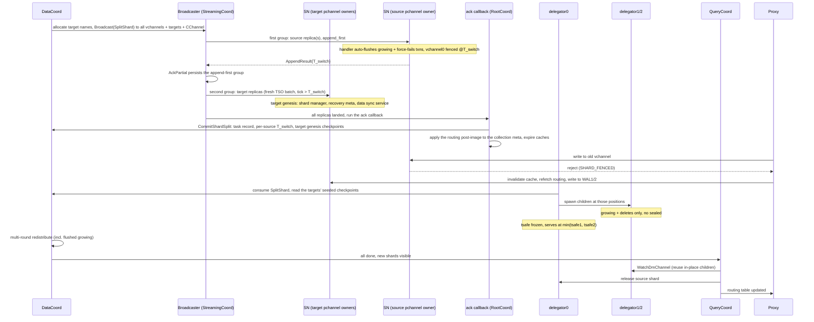
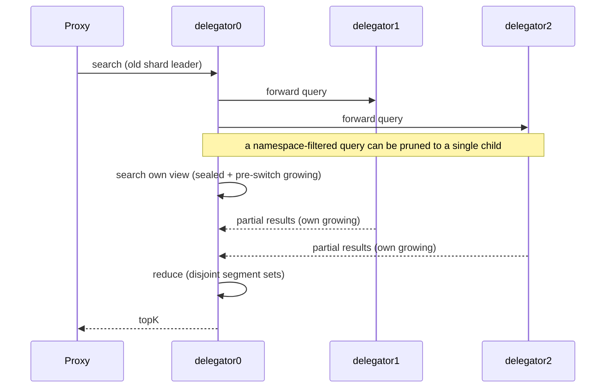
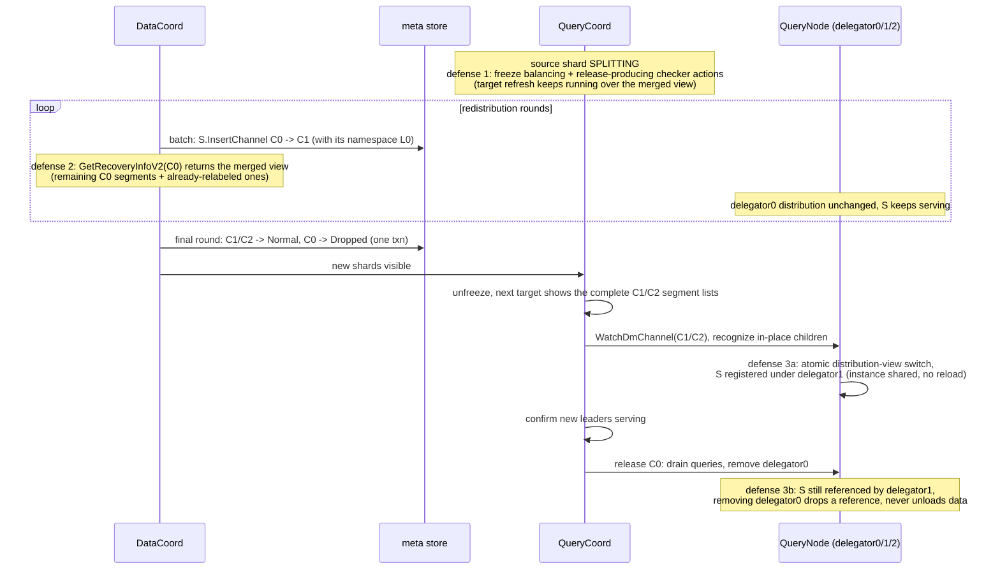

# Design Document: Online Shard Split for Namespace Collections

**Date**: June 2026
**Related Issue**: [#50463](https://github.com/milvus-io/milvus/issues/50463)

---

## 1. Overview

### 1.1 Motivation

The number of shards (vchannels) of a collection is fixed at creation time
(`ShardsNum` → `AllocVirtualChannels`, `internal/rootcoord/create_collection_task.go`)
and cannot be changed afterwards. As data grows, a single shard becomes a
bottleneck in three places at once: WAL write throughput on the
StreamingNode, delegator memory and compute on the QueryNode, and the
backlog of compaction/index jobs on that shard. Today the only way out is
to create a new collection and re-import all data, which is unacceptable
for online workloads.

In the multi-tenant architecture, a collection follows the hierarchy
**Collection → Shard → Namespace(=Partition) → Segment**. A namespace is
the tenant-isolation unit: its data is physically isolated in object
storage from L0/L1 on, per-namespace vector indexes move together with the
namespace folder, and a single namespace has a hard product limit (500M
rows / 2TB) equal to the capacity of one shard. A namespace therefore
never spans shards and is the natural atomic unit of splitting.

This design adds **online shard split** for namespace-enabled (multi-tenant)
collections: a loaded shard is split into two shards without stopping reads
or writes, with **zero data rewrite** — segments only need to be relabeled
to their new shard, because every segment belongs to exactly one partition
(namespace) and a namespace has a single routing value, so a split never
divides one.

**Prerequisite.** Current master implements namespaces as a hidden VarChar
partition-key field with isolation (`handleNamespaceField`,
`internal/rootcoord/create_collection_task.go`), and segments only carry an
`is_sorted_by_namespace` flag — there is no per-namespace partition, no
one-namespace-per-segment guarantee, and no namespace-scoped L0 isolation
yet. This design **depends on the in-progress namespace(=partition) work**
delivering exactly those guarantees (every segment belongs to one
namespace; L0 segments are namespace-scoped). Without them, the
zero-data-rewrite relabel argument does not hold for segments containing
multiple namespaces that straddle the split.

### 1.2 Goals

- Split one shard of a namespace collection into two shards online; reads
  and writes keep working through the whole procedure (a short latency
  increase is acceptable, data loss or inconsistency is not).
- No data rewrite: redistribution is a metadata-only relabel of segments
  (including the namespace-scoped L0 segments).
- Full consistency: no message loss or duplication, ordering preserved,
  no MVCC ghost reads, deletes correct throughout the transition window.
- Crash safety: every step is idempotent and resumable; before the write
  fence the split can be aborted, after the fence it can only roll forward.
- The feature is fully gated by configuration and disabled by default.

## 2. Background and Constraints

The following properties of the current system shape the design:

1. **The channel set of a collection is fixed.** vchannels are allocated
   once at create-collection; the whole stack assumes they never change.
2. **The WAL is the only sequencer.** Every message gets its TimeTick from
   the per-pchannel `AckManager` (serialized allocation from the global
   TSO), and the confirmed watermark advances only over a contiguous
   acknowledged prefix. Forwarding an already-sequenced message into
   another WAL would sequence it twice and break the monotonic-arrival
   invariant that MVCC and `LastConfirmedMessageID` rely on. Therefore the
   design never relays messages between WALs: a message is sequenced
   exactly once, in its destination WAL.
3. **Delete forwarding follows the delegator's distribution.** A delegator
   forwards a delete to the segments found in its own distribution
   (filtered by partition and bloom filter,
   `internal/querynodev2/delegator/distribution.go`). If sealed-segment
   ownership were ambiguous during a split, deletes would be missed.
4. **QueryCoord cannot represent intermediate states.** The query target is
   built from `GetRecoveryInfoV2`, and `Segment.InsertChannel` is a single
   value: a segment serving two channels at once does not exist in the
   data model.
5. **Growing segments are released only via `SyncTargetVersion`** issued by
   QueryCoord; a delegator invisible to QueryCoord cannot hand its growing
   segments over to sealed ones.

## 3. Routing Design

### 3.1 Residue routing

A collection carries one **routing modulus** M, and each shard owns a set of
**residues** modulo M. The sets partition `[0, M)`, so placement is a single
array index:

```
routing_value = hash(<the field shard_by names>)
route(row)    = slots[routing_value % M]
```

`shard_by` names what is hashed: `hash($namespace_id)` for a namespace
collection, the primary key otherwise. It says nothing about placement —
`hash(pk)` does **not** mean `hash(pk) % shardNum`, which stops holding the
moment a collection is split.

**Admission precondition for `hash($namespace_id)`.** The namespace routing
key is only valid for a collection whose rows have ALWAYS been placed by it,
and on master that is one build-time configuration, not every namespace
collection. The proxy places a row by namespace only when
`namespace.sharding.enabled=true` **and** `namespace.mode=partition_key`
(`namespacePartitionKeyModeEnabled`, consulted by insert directly and by delete
and upsert through `namespaceShardingChannelID`). `sharding.enabled` is written
as `false` at create time unless the request sets it, and a `partition`-mode
collection is always placed by `hash(pk)`. So the default namespace collection
has every existing row spread over all shards by primary key. Back-filling
`shard_by = hash($namespace_id)` onto such a collection at its first split would
send a namespace's NEW rows to one shard while its existing rows stay
everywhere, and a delete routed by the namespace hash would reach one shard and
silently miss the rest; the zero-rewrite relabel argument above rests on the
same premise. Both properties are immutable after creation
(`ValidateNamespaceShardingEnabledNotAltered`, `validateNamespaceModeImmutable`),
so "placement history equals the current rule" is decidable from the
collection's own properties. The routing commit MUST check them before
accepting a `hash($namespace_id)` back-fill; any other namespace collection
splits under `hash(pk)` or is refused.

**Representation cost.** A shard's residues are stored as an explicit list,
and that list is `O(M)`, not `O(shards)`. Every shard starts with a single
residue, so a collection's FIRST split always doubles the modulus, and each
later doubling re-expresses every untouched shard's list at the new modulus --
doubling its length. At the cap, `M = 2^15`, the lists total 32,768 `uint64`s
carried in the collection meta and in every `DescribeCollectionResponse`,
including the ones SDK users receive. Accepted because a residue list is the
only shape that makes the tiling check a set operation, the cap bounds the
worst case at a few hundred kilobytes, and reaching it takes as many
consecutive doublings as fit under the cap from the collection's initial
shard count (fifteen from one shard, thirteen from three, since M starts at
that count and only ever doubles); a compressed
representation (ranges of residues) is a later optimization the wire format
does not preclude.

M is not the shard count. A never-split N-shard collection is M = N with one
residue per shard, which is the legacy `hash % N` placement bit for bit —
not a second code path, just a residue table built from the channel order.

A split halves one shard by dividing its residue set in two, and **M does not
move**; that is the common case. Only a shard down to a single residue `r`
has nothing left to divide: M doubles and `r` becomes `{r}` and `{r+M}`, the
same value space cut on one more hash bit. A doubling is collection-wide, so
every untouched shard is first re-expressed at the new modulus, and both
halves land in the one atomic meta update that commits the split.

Lookup is an array index, `O(1)`. Deriving the table validates that the
residue sets tile `[0, M)` exactly: a gap (some value routes nowhere) or an
overlap (some value routes to two shards) is rejected, so malformed routing
meta fails loudly instead of silently mis-placing writes.

**Zero data rewrite still holds.** A namespace has exactly one routing value,
so it falls in exactly one residue, and neither dividing a residue set nor
doubling the modulus can put one namespace on both sides. A segment, which
belongs to one namespace, therefore belongs to exactly one of the two halves
and only needs relabeling.

**What this model gives up.** An earlier revision of this design routed by
byte-comparable `[lower, upper)` ranges over
`big_endian(hash(namespace)) || namespace_utf8`, which let a split choose its
key from per-namespace size statistics and carve a single oversized namespace
into a dedicated shard. Residues cannot express that: the smallest unit is a
residue, which holds many namespaces, and a doubling cuts on a hash bit
rather than by size — so balancing is statistical, exact over residues and
only in expectation over namespaces. **Isolating a named tenant into its own
shard is therefore out of scope for this design**; it needs a second
placement scheme, which is why `CollectionShardInfo.routing` is a `oneof`
with room for one. What residues buy in exchange is a write path that is a
single array index over a value the split's rewrite partitioner computes
identically, and a "the shards tile the key space" invariant that is checked
before a split commits rather than argued about.

Collections that do not enable namespaces are unaffected until they are
split, and split by the same model over `hash(pk)`.

### 3.2 Metadata

The collection meta is already the authoritative source of the vchannel
list, so the shard routing facts live next to it and are updated in the
same transaction:

- `schema.CollectionShardInfo` (parallel to `virtual_channel_names`, and
  reported on `DescribeCollectionResponse` as `shard_infos`) gains a
  `ShardState` (`Normal / Creating / Splitting / Dropped`) and a routing
  predicate carried as a `oneof`: `HashRouting` — the list of residues the
  shard owns. A shard owns a *list*, not one value, because its share spans
  more residues as the modulus grows. Unset means the collection has never
  been split, or the shard is a fenced split source, whose predicate the
  write switch strips. A state this build does not know may own keys, so the
  table is refused as a whole -- every write to the collection fails, not only
  the keys of that shard -- rather than that shard being silently dropped. The
  choice is deliberate: an unknown state is a newer server talking to an older
  proxy, and routing around it would place rows by a rule this build cannot
  see. It is also the rolling-upgrade cost to plan for. (Defined in
  milvus-proto #618; `model.ShardInfo` mirrors it.)
- `DescribeCollectionResponse` gains `routing_modulus` — one number for the
  whole collection, `0` before its first split — and `shard_by`. The
  modulus, not the presence of residues, is what says a collection has been
  split: a non-zero modulus with no residues behind it is malformed meta and
  is refused, because falling back to the legacy modulo over a vchannel list
  the split has already grown would re-place every row in the collection.
- All new fields default to legacy-compatible zero values, so existing
  collections are unaffected. The in-memory routing table is *derived* from
  the collection meta (`internal/util/routing`); it is not persisted
  separately, and the same derivation runs in rootcoord before a routing
  change is committed, so a topology that does not tile is rejected while it
  is still only a failed DDL.

### 3.3 Routing refresh on fence

There is no routing version on the write path. The proxy caches the routing
table (derived from `DescribeCollection`) and routes each write directly to
the owning shard's vchannel. When a write reaches a vchannel already fenced
by a split, the StreamingNode's shard interceptor rejects it with
`STREAMING_CODE_SHARD_FENCED` (the source vchannel is `Splitting`/`Dropped`).
The proxy treats this as a stale-routing signal: it invalidates the cached
collection meta, refetches `DescribeCollection`, re-resolves the write to the
new owning shard, and retries. A single namespace write maps to exactly one
shard, so the retry is all-or-nothing and cannot double-write. The refresh
can race the routing commit (the new table may not be visible yet), so the
retry is bounded with backoff; once the commit lands the refreshed table
routes to the target and the loop terminates.

(`STREAMING_CODE_ROUTING_STALE` is defined alongside `SHARD_FENCED` for a
future routing-version fast path, but is not on the implemented write path —
the fence rejection above is the only signal the proxy acts on.)

`SHARD_FENCED` is distinct from the existing `CHANNEL_FENCED`:
`CHANNEL_FENCED` is term-based fencing of a pchannel, recovered by
reconnecting to the *same* channel after reassignment; `SHARD_FENCED` is
permanent for the vchannel and is recovered by refreshing the routing
table and writing to a *different* vchannel.

Both rejection codes are classified *unrecoverable* in the streaming
client, so the resumable producer does not retry the same vchannel; the
error surfaces to the proxy, which refreshes the routing table through the
existing collection-meta invalidation path and re-dispatches.

## 4. Design Overview

Five principles work around the constraints of §2 simultaneously:

1. **The old delegator spawns child delegators in place.** When the old
   delegator consumes the split message, it creates the two child
   delegators for the new shards locally on the same QueryNode and fronts
   them (forward + reduce). During the window QueryCoord does not need to
   know they exist.
2. **Child delegators own no sealed segments.** All sealed segments are
   served by the old delegator (each loaded exactly once) for the whole
   window; the children consume growing data and deletes from the new
   WALs. Growing→sealed handoff keeps running during the window: segments
   flushed after the fence — the former growing data of WAL0 as well as
   the children's growing flushed from the new WALs — are loaded as sealed
   into the old delegator's view, and the handoff atomically swaps a
   child's growing segment for the sealed instance there, so the children
   still own no sealed segments. This avoids double loading and any 1:N
   `InsertChannel` model change.
3. **Service ownership moves late, adoption is one-shot.** The DataCoord
   redistributes segment metadata in the background; the new shards become
   visible to QueryCoord only after *all* segments of the old shard are
   processed, and the routing commit that retires the source is applied by a
   cluster only once *that cluster's* DataCoord reports the source drained.
   There is no partial ownership migration and no bidirectional delete
   forwarding.
4. **The whole write switch is one broadcast.** A single `SplitShard`
   message is broadcast to every vchannel the collection has today, to the
   target vchannels the split creates, and to the control channel. Every
   replica carries the same header and body; what a replica *does* is decided
   by the role its own vchannel plays in that header
   (`message.SplitShardRoleOf`):

   - **source** — the write fence. The StreamingNode that owns the source
     pchannel seals every growing segment of the vchannel, embeds their ids
     in the header, and tears the vchannel's registration down, leaving a
     fence tombstone by name. The replica's TimeTick is `T_switch`; after it
     the vchannel never accepts DML again.
   - **target** — the genesis of a new vchannel. The body carries the schema
     (in `CreateCollection`'s own body shape) and the header the partition
     snapshot, so the shard manager, the recovery storage and the flusher
     register the vchannel exactly as `CreateCollection` does. There is no
     separate creation message and no barrier timetick.
   - **control channel** — no effect in any consumer; it exists only to give
     the ack callback a TimeTick to order against.
   - **bystander** — a shard of the same collection this split neither fences
     nor creates. It receives the replica and passes it through every
     consumer without effect. Bystanders are in the broadcast because the
     message also carries the collection's routing post-image: a shard the
     split leaves alone still has to be covered by the broadcast that
     redefines the collection's channel list. A replica landing on a vchannel
     of a *different* collection is a misroute and is refused.

   Ordering inside the broadcast is what makes `T_switch` a boundary rather
   than a race. `BroadcastHeader.append_first_vchannels` names the sources;
   the broadcaster appends *and persists* that group before it appends any
   other replica, and the `SplitShard` message type is `FreshTimeTick`, so
   every other replica discards its node's prefetched TSO batch and takes a
   freshly allocated tick. The source vchannel therefore holds no message
   after `T_switch`, and the targets hold none at or before it. Each message
   is still sequenced exactly once, in its destination WAL.
5. **Only facts travel in the WAL; every coordinator action happens in the
   ack callback.** The message states that the split happened, with
   everything a cluster needs to reproduce the topology: collection id, task
   id, partition ids, residues, modulus, schema, routing post-image. When to
   redistribute, when a source has drained and when to adopt are local
   decisions each cluster makes for itself and never travel in a message.
   All collection-meta and DataCoord bookkeeping is done by the broadcast's
   ack callback, so the cluster that planned the split and a cluster that
   only replayed the message run the same code; the planner's extra step is
   issuing the broadcast. That is what makes the split replicable (§6.5).

## 5. Roles and State Machine

- **DataCoord (the cluster that plans the split)** detects the need to
  split, allocates the task id, the target vchannel names and their target
  pchannels (via StreamingCoord), the residues each target owns and the
  routing post-image, and then issues **one** `SplitShard` broadcast. It
  reads nothing back from that broadcast's return value: the ack callback is
  what records the task and `T_switch` (§6.1). Afterwards it redistributes
  segments in rounds, freezes compaction/GC on the source shard during the
  window, and once its own drain predicate holds it issues the adoption
  `AlterCollection` that retires the source.
- **DataCoord (every cluster)** exposes two internal RPCs the ack callbacks
  call: `CommitShardSplit`, which upserts the split task record by task id
  and seeds each target vchannel's genesis channel checkpoint, and
  `CheckShardSplitDrained`, which answers whether *this* cluster's sources
  have drained (§6.3). A cluster that only replayed the broadcast learns of
  the split solely through `CommitShardSplit`, and the record it leaves is
  what later lets it answer the drain check and adopt the targets.
- **RootCoord** owns both ack callbacks: the `SplitShard` one, which
  validates the routing post-image, calls `CommitShardSplit`, applies the
  post-image to the collection meta and expires the proxy caches (§6.1); and
  the `AlterCollection` one, which gates a routing commit that delists a
  vchannel on `CheckShardSplitDrained` before applying it (§6.3).
- **StreamingCoord** allocates pchannels for the new vchannels. The
  invariant "one collection has at most one vchannel per pchannel" is
  kept, so the shard count of a collection is capped by the pchannel
  count; when pchannels run short they are expanded dynamically via
  `AddPChannels()`, and if the WAL backend cannot host more topics the
  split round is skipped with an alert. Its Broadcaster is what enforces the
  append-first ordering of the split's replicas, and its
  `WaitVChannelsAcked` RPC is what a secondary cluster's append gate waits on
  (§6.5).
- **StreamingNode (source)** receives the fence on the normal append
  path, simply by being the current owner of the source pchannel: on
  processing the source replica of `SplitShard` its shard handler
  auto-flushes the growing segments (embedding their IDs in the message, as
  the AlterCollection schema-change path already does) and force-fails active
  transactions under the vchannel-exclusive lock. Three things then happen at
  different times, and each has to happen where it does:
  - the **shard-manager registration** is torn down in the same critical
    section as the fence, leaving a `SplitFence{TimeTick, TaskID}` tombstone
    keyed by vchannel *name*. Dropping the registration immediately frees the
    pchannel's per-collection slot, so a successor vchannel can be placed
    there without waiting for a routing commit; the tombstone is what still
    answers a stale proxy route with `SHARD_FENCED` (rather than
    `CollectionNotFound`) and what returns `T_switch` to a re-sent fence.
  - the **data sync service** is *not* closed here. The sealed segments are
    flushed asynchronously, so the flusher records the fence tick and lets
    the service close itself once its own checkpoint passes it
    (`flusherComponents.CloseIfDrained`). The drop-collection teardown is
    deliberately not reused: it reaches DataCoord's `DropVirtualChannel`
    through the sync manager, which must never fire for a split source.
  - the **recovery meta** moves to `VCHANNEL_STATE_SPLITTED` with
    `split_time_tick = T_switch`, and stays there. Moving it to `DROPPED`
    would both call `DropVirtualChannel` and, once the row left the catalog,
    lose the tombstone across a restart. Its collection is described in §6.5.
  The target vchannels live on whichever StreamingNodes own the target
  pchannels (a node cannot open a WAL for another node) and are created by
  the target replicas of the same broadcast.
- **delegator0 (old)** consumes up to the split message; from it learns
  the target vchannels and the residues each owns, reads their consume
  start positions through the ordinary channel-checkpoint seek path (the ack
  callback seeded each target's genesis position into DataCoord's channel
  checkpoints), spawns delegator1/2 in place, serves all sealed segments
  (including those flushed during the window), fronts all queries, and
  applies the deletes forwarded back from the children.
- **delegator1/2 (children)** own no sealed segments, consume growing
  data and deletes of the new WALs from the start positions delegator0
  fetched, and forward every delete (and their TimeTick progress) to
  delegator0.
- **QueryCoord** sees only the old shard during the window (the source
  shard is flagged so the balancer leaves it alone); after adoption it
  watches the new shards, converts the existing child delegators without
  a restart, and releases the old shard.
- **Proxy (secondary cluster)** is where a replicated split enters: its
  replicate service rewrites every channel name the message carries into the
  local namespace and holds a non-append-first replica until this cluster has
  landed the split's append-first replicas (§6.5). Every other role above is
  the same code on both clusters.


```mermaid
flowchart LR
    IDLE["Normal"] -->|"split triggered"| PREP["Preparing, task id, target names, residues and routing post-image allocated"]
    PREP -->|"abort, no external side effects"| IDLE
    PREP -->|"one SplitShard broadcast, sources appended and persisted first"| FENCE["Fenced at T_switch, source rejects writes, targets born past T_switch"]
    FENCE -->|"forward-only, ack callback records the task and commits the routing post-image"| WIN["Window, in-place children and multi-round redistribute"]
    WIN -->|"this cluster's sources drained"| ADOPT["Adopting, AlterCollection(shard_split_routing) delists the source"]
    ADOPT -->|"release source shard, retire its recovery meta"| DONE["Done"]
```

## 6. End-to-End Flow

### 6.1 Trigger and write switch

The write switch is **one broadcast and its ack callback** — there is no
coordinator→StreamingNode RPC. The streaming client already solves owner
discovery, retry across pchannel reassignment, and term fencing, exactly
as existing WAL-visible operations do (`ManualFlush` is appended by the
proxy; DataCoord drives snapshot and manifest operations the same way).
The source StreamingNode "receives" the split simply by being the current
owner of the source pchannel, on the normal append path through the
interceptor chain.

1. DataCoord decides to split shard0 (per-shard data size, tenant count,
   or a single oversized namespace), checks the gates (feature switch,
   concurrency limit, pchannel headroom, and one active task per
   vchannel — a shard is skipped while an unfinished task references it
   as the source or as a target, otherwise the trigger would re-fire on
   the same over-threshold shard every tick during the long
   redistribution window), creates the target shard
   metadata in state `Creating`, and allocates the new vchannel names and
   their target pchannels via StreamingCoord (so the fence message can
   carry the target names). Shards holding a single namespace are
   excluded from the trigger: they satisfy the size thresholds but cannot
   be split usefully (its one namespace has one routing value and would land
   wholly on one of the two halves),
   and writes to them are rejected at the namespace hard limit — without
   the exclusion the trigger would loop on them.
2. **One broadcast.** DataCoord builds a single `SplitShard` message
   (`streaming.NewSplitShardBroadcastMessage`) and broadcasts it. Its header
   carries the collection id, the split task id, the source vchannels, the
   targets with the residues each owns, the routing modulus, the partition
   snapshot and the db id; its body carries the target genesis schema (in
   `CreateCollection`'s body shape) and the **routing post-image** — the
   grown vchannel list, every shard's state and residues, the modulus and
   `shard_by`. Nothing is derived from mutable meta later, so a retry and a
   replay commit the identical topology. The broadcast reaches every
   vchannel of the collection, every target, and the control channel; the
   broadcast is deduplicated by a collection-scoped idempotency key built
   from the split task id, so a retry of the same task is the *same*
   broadcast, not a second one. It holds `SharedDBName +
   ExclusiveCollectionName` for its whole life, which is what keeps
   collection DDL out of the switch.
3. **Two-phase append and the fresh tick.** The broadcaster appends the
   source replicas first — they are named in
   `BroadcastHeader.append_first_vchannels` — and **persists** them with a
   partial ack before it appends anything else. On processing a source
   replica the StreamingNode's shard handler auto-flushes every growing
   segment of the vchannel (embedding the sealed segment IDs into the
   message header, exactly as the AlterCollection schema-change path does)
   and, because `SplitShard` is `ExclusiveRequired`, force-fails active
   transactions under the vchannel-exclusive lock. That replica's TimeTick
   is `T_switch`; afterwards every new write to the source is rejected with
   `SHARD_FENCED`.

   The remaining replicas — targets, bystanders, control channel — are
   appended only after the first group is durable, and `SplitShard` is
   `FreshTimeTick`, so each of them discards its node's prefetched TSO batch
   and takes a freshly allocated tick. A target's genesis is therefore
   strictly greater than every `T_switch` of the same broadcast, without any
   barrier value being computed, carried or compared. There is no separate
   creation message and no `Creating`/`Activate` two-phase state: the three
   consumers that special-case `CreateCollection` as the vchannel-genesis
   message (the shard manager, which registers the collection for DML and
   segment assignment; the RecoveryStorage, whose `vchannel not found` check
   is exempted for it and which seeds the vchannel meta; and the flusher,
   which spawns the data sync service) each read the target replica by its
   role and share the existing schema parser.

   > **The first group must be persisted before the rest is appended.** The
   > `> T_switch` guarantee rests on that order alone. Appending the rest
   > concurrently with the append-first group would leave every primary-side
   > test green while allowing a target replica to take a tick below its
   > source's — and, on a secondary, it would break the liveness argument of
   > the append gate (§6.5), which assumes exactly this ordering.

4. **Ack callback.** Once every replica has landed, the broadcaster runs the
   ack callback (retried with backoff until it returns nil, holding the
   collection's resource keys meanwhile). It runs on **every** cluster the
   broadcast reached, in this order:

   1. validate the routing post-image — the shards must tile `[0, M)` with
      no gap or overlap, and the header's residues and modulus must agree
      with the body's copy. This is the only place the two copies are read
      together;
   2. **DataCoord first** (`CommitShardSplit`): upsert the split task record
      by task id, recording each source's `T_switch` *as its fence actually
      landed*, and seed each target vchannel's genesis channel checkpoint
      from that target's own append result;
   3. apply the routing post-image to the collection meta
      (`MetaTable.ApplyShardSplitRouting`, one atomic catalog write under
      `ddLock`): the target shards become routable for writes;
   4. `BroadcastAlteredCollection` and expire the proxy caches.

   DataCoord goes first because it is the seeding step: until a target has a
   channel checkpoint, a reader that discovered it would fall back to the
   collection's creation position, and the routing post-image is what makes
   the target discoverable. Both halves are independently idempotent, so a
   crash between them is repaired by the retry. A post-image the collection
   already carries is a no-op; one that a later commit has already overtaken
   is skipped with a warning rather than failed, because failing it forever
   would queue every later DDL of the collection behind it.
5. On rejection the proxy refreshes the routing table. A write to the fenced
   source vchannel is rejected with `SHARD_FENCED`; the proxy invalidates its
   cached collection meta, refetches it, re-resolves to the new owning shard
   and retries (bounded with backoff, since the refresh can race the routing
   commit), then re-dispatches the writes in order. Writes go directly to
   the new WALs from then on. The new shards are routable only after the ack
   callback's meta commit (the proxy cannot see a shard before its
   collection-meta write lands), so the write-unavailability window —
   fence → routing commit → proxy refresh, scoped to the residues the split
   moves — has the same shape in any ordering (§10), and fits the
   short-latency-increase goal of §1.2.

WAL transactions need no special machinery and there is no drain step:
the `SplitShard` message type is marked `ExclusiveRequired`, so the lock
interceptor appends each data replica under its own vchannel-exclusive lock
and force-fails active transactions, which the client-side transaction retry
loop already handles — the retried transaction hits the fence, triggers the
routing refresh, and replays on the new vchannel. This is the same cost any
AlterCollection broadcast already pays on the collection's vchannels.

Collection DDL is fenced out of the switch by the broadcast itself. DDL
(AlterCollection, CreatePartition, …) broadcasts to all of the
collection's vchannels; if it interleaved with the split it could change the
schema/partition set the target genesis embeds, leaving the new shards out of
sync. The `SplitShard` broadcast holds the Broadcaster's `SharedDBName +
ExclusiveCollectionName` resource keys — the same keys CreateCollection and
DropPartition already take — from the moment it is issued until its ack
callback returns, so no collection DDL can interleave and the partition
snapshot the message carries is exact. Afterwards the new vchannels join the
collection's broadcast targets normally.


```mermaid
sequenceDiagram
    participant DC as DataCoord
    participant BC as Broadcaster (StreamingCoord)
    participant SNT as SN (target pchannel owners)
    participant SN0 as SN (source pchannel owner)
    participant CB as ack callback (RootCoord)
    participant D0 as delegator0
    participant D12 as delegator1/2
    participant QC as QueryCoord
    participant PX as Proxy
    DC->>BC: allocate target names, Broadcast(SplitShard) to all vchannels + targets + CChannel
    BC->>SN0: first group: source replica(s), append_first
    Note over SN0: handler auto-flushes growing + force-fails txns, vchannel0 fenced @T_switch
    SN0-->>BC: AppendResult{T_switch}
    BC->>BC: AckPartial persists the append-first group
    BC->>SNT: second group: target replicas (fresh TSO batch, tick > T_switch)
    Note over SNT: target genesis: shard manager, recovery meta, data sync service
    BC->>CB: all replicas landed, run the ack callback
    CB->>DC: CommitShardSplit: task record, per-source T_switch, target genesis checkpoints
    CB->>CB: apply the routing post-image to the collection meta, expire caches
    PX->>SN0: write to old vchannel
    SN0-->>PX: reject (SHARD_FENCED)
    PX->>SNT: invalidate cache, refetch routing, write to WAL1/2
    D0->>DC: consume SplitShard, read the targets' seeded checkpoints
    D0->>D12: spawn children at those positions
    Note over D12: growing + deletes only, no sealed
    Note over D0: tsafe frozen, serves at min(tsafe1, tsafe2)
    DC->>DC: multi-round redistribute (incl. flushed growing)
    DC->>QC: all done, new shards visible
    QC->>D12: WatchDmChannel (reuse in-place children)
    QC->>D0: release source shard
    QC->>PX: routing table updated
```

### 6.2 Read path during the window

1. delegator0 consumes WAL0 in order. The split message is the last entry,
   so every delete ≤ `T_switch` has already been applied to its sealed
   segments before the children exist — backlogged deletes cannot be lost.
2. On the split message, delegator0 reads the target vchannels' consume
   start positions from DataCoord (the ack callback seeded each target's
   genesis position as that vchannel's first channel checkpoint, §6.1
   step 4; it retries until they appear, since the callback runs just after
   the replicas land) and creates delegator1/2 locally (empty sealed sets).
   Each child subscribes at its start position, so it replays none of the
   target pchannel's unrelated history; the new vchannels contain only data
   > `T_switch` (their genesis replica already took a fresh tick after the
   fence was persisted).
3. Queries still arrive at delegator0 (QueryCoord keeps returning the old
   shard leader). delegator0 fans the query out to the children, searches
   the segments in its own view (sealed and pre-switch growing), reduces,
   and replies. The result sets come from **disjoint segment sets** —
   every row lives either in a segment of delegator0's view or in a
   child's growing segment, never both (the handoff of step 5 swaps the
   two atomically) — so the reduce neither duplicates nor misses rows.
4. The children apply every delete (> `T_switch`) to their own growing
   segments and forward a copy to delegator0, which applies it to all the
   segments it serves — sealed (including those flushed during the
   window) and pre-switch growing — through the existing bloom-filter
   path. Deletes are durable in the L0 segments of the new vchannels.
5. **In-window growing→sealed handoff.** Flushing keeps running during
   the window: the fence-flushed former growing of WAL0, and later the
   children's growing flushed from the new WALs, become sealed segments.
   QueryCoord's target refresh for the source shard keeps running over
   the merged recovery view (§6.4, defense 2), which both delivers the
   newly flushed segments and never lets a segment disappear; what the
   splitting flag freezes is balancing and the release-producing checker
   actions, not the refresh itself. The handoff lands in delegator0's
   view (`SyncTargetVersion` to the visible leader): delegator0 loads the
   sealed instance, and for a segment flushed from a child's WAL the
   child's growing segment is swapped out atomically — the children own
   no sealed segments at any point.
6. **Serviceable timestamp.** After the fence delegator0 consumes nothing,
   so its own tsafe freezes at `T_switch`. The children forward their
   TimeTick progress, and delegator0 serves at
   `min(tsafe1, tsafe2)` — it never answers a query at timestamp `t`
   before all deletes ≤ `t` have been forwarded to it.


```mermaid
sequenceDiagram
    participant PX as Proxy
    participant D0 as delegator0
    participant D1 as delegator1
    participant D2 as delegator2
    PX->>D0: search (old shard leader)
    D0->>D1: forward query
    D0->>D2: forward query
    Note over D0,D2: a namespace-filtered query can be pruned to a single child
    D0->>D0: search own view (sealed + pre-switch growing)
    D1-->>D0: partial results (own growing)
    D2-->>D0: partial results (own growing)
    D0->>D0: reduce (disjoint segment sets)
    D0-->>PX: topK
```

### 6.3 Redistribution and adoption

1. DataCoord relabels every segment of the source shard to its target
   shard: same segment ID, new `InsertChannel`, done in batches. The
   namespace-scoped L0 segments are relabeled together with the sealed
   segments of their namespace. Segments flushed by the fence (the former
   growing data of WAL0) are included; segments flushed from the
   children's WALs are born on the target vchannels and need no relabel.
   `IsImporting` segments are skipped to the next round (the same shape as
   the `isCompacting` skip the compaction policies already apply): an
   import worker is still committing binlogs through meta updates on those
   segments, and relabeling mid-import would race with those writes. They
   are picked up once flushed.
2. Redistribution runs in rounds: each round processes the segments
   visible at that time. The source shard is "drained" only when **all
   three** DataCoord-local conditions hold, per source
   (`CheckShardSplitDrained`): no segment in a non-`Dropped` state remains on
   the source vchannel; the source channel checkpoint has advanced to
   `≥ that source's own T_switch`, and a source whose recorded `T_switch` is
   still zero is never drained (its fence has not been recorded, so it may
   still be accepting writes); **and** no unfinished import job has any
   source vchannel in its `Vchannels`. The predicate is answered
   independently by each cluster's own DataCoord — see §6.5.

   The checkpoint conjunct closes the **async-flush window**. The fence only
   *writes* the `SplitShard` WAL message; the growing segments it sealed are
   flushed and reported to DataCoord *asynchronously* by the streamingnode
   flusher. If the drain declared the source drained before those segments
   reached DataCoord meta, they would orphan on the just-dropped shard. The
   source channel checkpoint advances past a position only after the
   segments holding that position's data are durably synced and reported
   (the write buffer holds the checkpoint at the earliest un-synced
   position), so `channelCheckpoint(source) ≥ T_switch` proves the entire
   fence-sealed set is in DataCoord meta and relabelable. This is why the
   split task record carries a per-source `T_switch`, written by the ack
   callback from the fence's own append result (§6.1 step 4): the drain needs
   its value, and the value that matters is the one the fence actually landed
   on in *this* cluster.

   The import conjunct closes another blind window: a job still in
   `Pending`/`PreImporting`
   has not registered any segment in meta yet (`AllocImportSegment` adds
   `SegmentInfo{State: Importing, IsImporting: true}` only when it starts
   writing), so a job planned against the pre-split routing is invisible
   to the segment scan and could otherwise allocate its segments onto the
   just-dropped shard after the empty check passed. A job's target
   vchannels are fixed at creation (`ImportJob.GetVchannels()`), so this
   check is purely DataCoord-local and needs no import/split mutual
   exclusion.
3. Only then is the **adoption** issued: an ordinary `AlterCollection`
   broadcast under the `shard_split_routing` field mask, carrying the
   post-image that moves the targets to `Normal` and drops the source from
   the vchannel list, plus the `split_task_id` it belongs to. Its ack
   callback asks *this* cluster's DataCoord whether that task has drained
   (`CheckShardSplitDrained`) and refuses to apply the commit until the
   answer is yes; the broadcaster retries with backoff. The broadcast reaches
   the control channel, every vchannel the collection has today — the
   delisted source included — and every vchannel the post-image names,
   because the source's own replica is what retires it and a vchannel the
   collection no longer names can receive nothing later. A commit that
   delists a vchannel without naming a split task is refused outright, as is
   one that would delist a shard not in state `Splitting`. QueryCoord picks
   the targets up, issues `WatchDmChannel`, and — because the child delegators
   already exist on that QueryNode with all segments loaded — converts
   them in place rather than building fresh ones:
   - **No re-subscribe / no new pipeline.** `WatchDmChannel` already
     no-ops when the channel's delegator is present (`services.go`: "channel
     already subscribed"). The child is registered in the node's delegator
     map from the moment delegator0 spawns it, so the watch reuses it
     instead of creating a new delegator and replaying the WAL from a seek
     position. The convert path must, beyond the bare no-op, adopt
     QueryCoord's `version`/target version, drop the delegator0-fronting
     wiring, and keep the consume position.
   - **No segment reload.** `LoadSegments` filters out segments already
     present on the node (`segment_loader.go`: "skip loaded/loading
     segment"), and segment instances are shared by ID in the
     SegmentManager. The new shard's sealed segments are already loaded —
     relabel keeps the same segment ID; hash-rewrite IDs were produced and
     loaded into delegator0's view via the in-window handoff (§6.2, step 5)
     — so `LoadSegments` degrades to a distribution-view update that
     attributes the already-loaded instances to the child, not a physical
     load.
   - **No premature reads (the gate is `Serviceable`, not map
     membership).** Registering the child early does *not* expose it to
     proxy reads: proxies route reads via QueryCoord's `GetShardLeaders`,
     and QueryCoord learns leaders from each QueryNode's
     `GetDataDistribution`, which **skips non-serviceable delegators**
     (`services.go`: `if !delegator.Serviceable() { return }`). During the
     window the child is naturally non-serviceable — it owns no sealed
     segment and has no QueryCoord target version yet
     (`channelQueryView.Serviceable()` requires `loadedRatio == 1.0` and a
     ready target) — so it is never reported, never returned by
     `GetShardLeaders`, and never read by a proxy. delegator0's internal
     fan-out reaches the child through a direct in-process handle, not
     through this leader path, so fronting still works while the child is
     externally invisible. The convert in this step injects the QueryCoord
     target version (`SyncTargetVersion`); the child becomes serviceable,
     is reported on the next `GetDataDistribution`, and only then does
     `GetShardLeaders` flip proxy reads onto it.

   At the flip itself no segment data is unloaded or reloaded; segments
   flushed during the window were already loaded into delegator0's view as
   they appeared (§6.2, step 5).
4. QueryCoord releases the source shard (draining in-flight queries
   first), and proxy caches are invalidated. The split is complete.

### 6.4 Release safety during redistribution

Relabeling moves a segment out of the source channel's recovery view. If
QueryCoord refreshed its target at that moment, the segment checker would
see a segment present in the delegator's distribution but absent from the
target and release it while it is still serving. Three defenses make this
impossible — at every instant at least one complete view holds every
segment:


```mermaid
sequenceDiagram
    participant DC as DataCoord
    participant META as meta store
    participant QC as QueryCoord
    participant QN as QueryNode (delegator0/1/2)

    Note over QC: source shard SPLITTING<br/>defense 1: freeze balancing + release-producing checker actions<br/>(target refresh keeps running over the merged view)
    loop redistribution rounds
        DC->>META: batch: S.InsertChannel C0 -> C1 (with its namespace L0)
        Note over DC: defense 2: GetRecoveryInfoV2(C0) returns the merged view<br/>(remaining C0 segments + already-relabeled ones)
        Note over QN: delegator0 distribution unchanged, S keeps serving
    end
    DC->>META: final round: C1/C2 -> Normal, C0 -> Dropped (one txn)
    DC->>QC: new shards visible
    QC->>QC: unfreeze, next target shows the complete C1/C2 segment lists
    QC->>QN: WatchDmChannel(C1/C2), recognize in-place children
    QN->>QN: defense 3a: atomic distribution-view switch,<br/>S registered under delegator1 (instance shared, no reload)
    QC->>QC: confirm new leaders serving
    QC->>QN: release C0: drain queries, remove delegator0
    Note over QN: defense 3b: S still referenced by delegator1,<br/>removing delegator0 drops a reference, never unloads data
```

The view of one segment `S` across the phases:

| Phase | meta: `S.InsertChannel` | QC target | delegator0 dist. | delegator1 dist. | physical instance |
|-------|------|------|------|------|------|
| before window | C0 | C0 holds S | holds S (serving) | — | loaded |
| window, S relabeled | **C1** | **merged view under C0, always holds S** | holds S (serving) | empty sealed | loaded |
| after adoption flip | C1 | C1 holds S | holds S (to release) | **holds S (shared)** | loaded, 2 refs |
| after C0 release | C1 | C1 holds S | removed | holds S | loaded, 1 ref |

- **Defense 1 (QueryCoord freeze, primary).** The `Splitting` flag freezes
  balancing, channel moves, and the release-producing segment/channel
  checker actions for the collection; release tasks originate only from
  those checker diffs, so none are produced. Target refresh itself keeps
  running — over the merged view of defense 2 it only ever *adds*
  segments (the ones flushed during the window, driving the §6.2 handoff)
  and never loses any.
- **Defense 2 (merged recovery view).** While the source shard is
  `Splitting`, `GetRecoveryInfoV2` for it returns the union of its
  remaining segments, the segments already relabeled to the targets, and
  the segments flushed from the target WALs during the window (the split
  task keeps the source→target mapping anyway). Any refresh — including a
  passive rebuild after a QueryNode restart — sees a complete list and
  diffs out nothing.
- **Defense 3 (register-then-release with shared instances).** Adoption is
  an atomic old-complete-view → new-complete-view flip with no missing
  intermediate state. Releasing the source shard is ordered strictly after
  the children's distributions are registered and the new leaders confirm
  serving; on the QueryNode, segment instances are shared by ID, so
  removing delegator0 only drops a reference — physical unload happens
  only when no distribution references the segment.

### 6.5 Replication

A shard split replicates. `SplitShard` and the adoption `AlterCollection`
travel down the replicate streams like any other DDL, and a secondary cluster
ends up with the same shard topology, the same task id, the same residues and
the same modulus as the primary. Nothing flows back: there is no secondary→
primary channel and no coordinator→StreamingNode RPC on either side.

**Name remap.** Every channel name the message carries names a channel of the
*primary*. The secondary's proxy rewrites all of them into its own namespace
before the replica is appended (`replicateService.overwriteReplicateMessage`),
by the same rule `CreateCollection` already uses: pchannels correspond by index
position, and a vchannel name is the source name with its pchannel prefix
replaced. Two message types need a case of their own:

- `SplitShard` — the header's `source_vchannels` and `targets[].vchannel`, and
  the body's routing post-image (its `virtual_channel_names`,
  `physical_channel_names`, **and** each shard info's own `vchannel_name`,
  which the routing table refuses if it disagrees with the list) and genesis
  channel lists;
- `AlterCollection` carrying the `shard_split_routing` mask — the same two
  name lists and shard infos in its updates. Every other `AlterCollection` is
  left alone; the routing mask is the only one whose updates carry channel
  names at all.

`BroadcastHeader.append_first_vchannels` is remapped with the broadcast's own
vchannel list, position by position, so the two can never disagree. Collection
id, partition ids, split task id, residues and modulus are **not** remapped:
they are the same facts in both clusters, and rewriting them would break the
correspondence replication exists to keep.

**The append gate.** The primary's ordering — sources appended and persisted
before anything else — is produced by the broadcaster and is *not* carried by
the replicate streams, which deliver each pchannel independently and restore no
order between them. Without a gate a target's genesis could be appended on the
secondary before its source's fence, inverting the one invariant the split
rests on and, with it, the order of a delete against an insert of the same
primary key. So: **a replicated replica whose vchannel is not in the (remapped)
`append_first_vchannels` may not be appended until every append-first replica
of the same broadcast has been acked in this cluster.** The gate sits in the
secondary proxy's `replicateService.Append`, after the remap and before the
append, and waits on the streamingcoord RPC
`StreamingCoordBroadcastService.WaitVChannelsAcked(broadcast_id, vchannels)`,
which blocks until those vchannels have a recorded checkpoint here — including
waiting for the broadcast task itself to be created, since a secondary learns
of a broadcast only from whichever replica arrives first.

It has to be on the receiving side: the sender sees one replica at a time and
cannot observe another cluster's ticks, while the streamingcoord ack state is a
fact the receiver already has.

*Why it cannot wedge replication.* "A source never waits, so the wait graph is
acyclic" is **not** the argument — a gated replica blocks its whole pchannel
stream, so a parked target also blocks every append-first replica queued behind
it. Progress rests on three facts: (a) for each broadcast every append-first
replica's tick is strictly below every other replica's, because the primary
appends *and* `AckPartial`-persists that group before it starts on the rest;
(b) ticks are totally ordered across pchannels, coming from one TSO; (c) each
replicate stream delivers its pchannel in tick order. Take the minimum-tick
message among all stream heads on this cluster: if it is append-first it is not
gated; if it is gated, each of its append-first replicas has a strictly smaller
tick and is therefore either already appended here or queued behind a head with
a smaller tick, contradicting minimality. Something always moves. Fact (a)
lives in the broadcaster, not in the gate — an "optimization" that appended the
rest concurrently with the append-first group would keep every primary-side
test green and wedge a secondary.

The wait is observable, because head-of-line blocking is otherwise
indistinguishable from wedged replication: a `Warn` after 30s naming the
broadcast id and the vchannels it is waiting on, and a gauge of currently gated
appends that an alert can watch. `broadcaster.Close()` releases every waiter
with an on-shutdown error rather than holding the process until SIGKILL.

**Callback parity.** Both clusters run the same `SplitShard` ack callback and
therefore the same commit (§6.1 step 4). On the secondary, `CommitShardSplit`
finds no task and creates one outright, already in `Redistributing` — the fence
it acknowledges has by definition already landed — with the **local** append
result's `T_switch` and the **local** genesis checkpoints. `T_switch` is a
different number in the two clusters and neither ever reads the other's.
Afterwards the secondary's DataCoord does only local relabel/rewrite and its
own drain accounting; it broadcasts nothing.

**Adoption is gated per cluster.** The adoption `AlterCollection` is
replicated, and both clusters' callbacks check their own drain predicate first,
because "the source's data has moved" is a per-cluster fact: a secondary
replays the same WAL but compacts, imports and flushes on its own schedule. The
primary is drained when it sends, so it passes immediately; a secondary refuses
with a System error and the broadcaster retries with backoff, which queues the
same collection's later DDL callbacks behind it and leaves other collections
untouched. Two redeliveries are exempted and apply *nothing*: a post-image the
collection already carries, and one a later commit has overtaken — DataCoord
reclaims a finished split's task record, so asking about it would be an error
retried forever.

**Retiring the source's WAL-side state.** When the adoption replica reaches the
source's StreamingNode there is nothing left for the shard manager to do (the
fence already tore the registration down) and the data sync service has either
closed itself or will when its checkpoint passes the fence. The recovery
storage marks the `SPLITTED` meta `retired`, and its background persist loop
removes the row only once **both** local conditions hold: `retired`, and the
flusher checkpoint has passed `split_time_tick`. The catalog has no
"retired-and-drained" state of its own, so the snapshot handed to it at that
moment is rewritten `DROPPED` — with `retired` still set, which is exactly how
`dropAllVirtualChannel` tells it apart from a genuine drop and skips calling
DataCoord's `DropVirtualChannel`. DataCoord retires the source itself, as part
of its own bookkeeping. There is no `DropVChannel` message: when a source may
be collected is a local fact, and a message announcing it would either arrive
before a secondary had drained (and be refused, wedging replication) or be
obeyed and lose data.

**Operator rules.** Three, and they are rules rather than mechanisms:

1. **`SplitShard` and `AlterCollection` must be replicated together.**
   Skipping one while replicating the other leaves a secondary with targets
   created but their routing never committed, or the reverse.
2. **Do not perform a graceful switchover while a split is in flight.** No
   code reconciles a half-replicated split across a planned role swap. A
   *forced* promotion is handled: `fixIncompleteBroadcastsForForcePromote`
   strips the replicate header from the incomplete task's pending replicas
   and re-drives them through the normal broadcast path, which reproduces the
   two-phase order; the ack callback then creates or advances the task, and
   the new primary continues draining and issues the adoption itself.
3. The trigger must run on the primary only — a secondary's split tasks may
   come from ack callbacks alone. The trigger is not in this branch; see §11.

## 7. Consistency Guarantees

**Every invariant below is scoped to one cluster.** `T_switch` is a different
number on the primary and on each secondary — it is the tick its own fence
landed on — and each cluster's DataCoord only ever reads its own.

- **Total order (within a cluster).** The source vchannel holds only messages
  ≤ `T_switch`; the target vchannels hold *no* message ≤ `T_switch` at all,
  their genesis included. On the cluster that issues the split this comes from
  the broadcaster's two-phase append — the source replicas are appended and
  persisted before any other replica is appended — plus the `FreshTimeTick`
  property, which makes every later replica discard its node's prefetched TSO
  batch and take a freshly allocated tick. That closes the one hole a
  per-node, batch-prefetching TSO allocator opens: a node hosting a target
  could otherwise stamp it from a batch older than `T_switch`. On a secondary
  the same two facts hold for the same reason, with the append gate (§6.5)
  supplying the ordering the replicate streams do not carry. No barrier value
  is computed, carried or compared anywhere. Collection DDL cannot interleave,
  because the broadcast holds the Broadcaster's `ExclusiveCollectionName` key
  from issue until its ack callback returns (§6.1). All messages of a cluster
  sit on that cluster's global TSO axis and each is sequenced exactly once.
  `T_switch` is recorded per source on the split task — by the ack callback,
  from the fence's own append result — because the redistribution drain (§6.3)
  gates on `channelCheckpoint(source) ≥ T_switch`.
- **No loss, no duplication.** Writes go directly to their final WAL with
  unchanged ack semantics. The fence rejects in the lock interceptor,
  which runs before TimeTick allocation and the backend append
  (interceptor order: redo → lock → replicate → timetick → shard), so a rejected
  write was never sequenced nor persisted and the retry after refresh
  cannot double-write. A transaction force-failed by the fence never
  committed — its body messages already in WAL0 are dropped by the
  consumer-side TxnBuffer — so retrying it as a whole on the new vchannel
  cannot duplicate either. The split's own appends are idempotent against the
  vchannel state machine: a duplicate target replica is a no-op — the vchannel
  already exists — and a duplicate source replica is recognized by the
  persisted fence state, appended again and accepted when it belongs to the
  same task (raising the recorded tick to the later record's, which is safe
  because the vchannel took no DML in between), and refused with
  `SHARD_FENCED` when it belongs to any other task, including one whose task
  id reads zero. Above the append path, the broadcast itself is deduplicated
  by a collection-scoped idempotency key derived from the split task id, so a
  retry of the same task resolves to the same broadcast.
- **Ordering.** Within a WAL, order equals TimeTick order. Across the
  switch, the proxy re-dispatches rejected writes in order after the
  refresh.
- **MVCC without ghosts.** A read is the union of delegator0's view
  (sealed — including segments flushed during the window — and pre-switch
  growing, with forwarded deletes applied) and the children's growing
  data — disjoint segment sets: the in-window handoff atomically swaps a
  child's growing segment for the sealed instance in delegator0's view,
  so no row is visible from both sides. The serviceable timestamp
  `min(tsafe1, tsafe2)` guarantees delegator0's part is never served
  ahead of the forwarded deletes.
- **Delete correctness in three layers.** *Serving layer*: deletes
  > `T_switch` are consumed by the children and forwarded to delegator0
  in memory, so reads are correct from the moment of the switch,
  independent of redistribution progress. *Durable layer*: those deletes
  persist as L0 segments of the new vchannels. *Bake-in layer*: after
  adoption, the standard L0-forward / delete-buffer replay applies them to
  the relabeled sealed segments at load time.
- **Crash recovery.** The split message is durable in the source WAL and the
  broadcast task in the streamingcoord catalog; the split task record and the
  targets' genesis checkpoints are written by the ack callback, which the
  broadcaster retries until it succeeds. If the QueryNode hosting delegator0
  crashes, QueryCoord rebuilds it, it re-consumes the source WAL up to the
  split message, re-reads the targets' seeded checkpoints from DataCoord, and
  re-spawns the children, whose state is then reconstructed by replaying their
  vchannels. If DataCoord crashes it re-drives the same broadcast under the
  same idempotency key, which resolves to the original and returns its result.
  If the StreamingNode crashes, standard WAL recovery applies: the fence
  persists with the split message, and the fence tombstone is rebuilt by name
  from every `SPLITTED` vchannel in the recovery snapshot. §10 has the full
  table.

## 8. Engineering Constraints

1. **Delete retention is L0-based, not memory-based.** L0 segments holding
   deletes for not-yet-adopted sealed segments must not be compacted or
   garbage-collected before adoption applies them.
2. **Source-shard freeze.** During the window the source shard is excluded
   from compaction, clustering and GC on the DataCoord side, and from
   balancing and channel moves on the QueryCoord side.
3. **In-place handoff.** QueryCoord's watch path must recognize an
   existing child delegator on the node and convert it (change owner, keep
   consume positions, no reload) instead of release-and-rewatch — the
   `WatchDmChannel` no-op-when-present and `LoadSegments` skip-when-loaded
   paths already give the no-reload half (§6.3, step 3). The child is
   registered in the delegator map early (so the watch finds it) but kept
   **non-serviceable** until the convert: `GetDataDistribution` skips
   non-serviceable delegators, so QueryCoord never exposes the child via
   `GetShardLeaders` and no proxy read reaches it before adoption; the
   convert injects the QueryCoord target version, which flips it
   serviceable and routes reads onto it.
4. **Old-vchannel lifecycle.** The source WAL stays replayable for the whole
   window (no truncation); after adoption the vchannel is *retired*, not
   dropped — its recovery meta stays `SPLITTED` with a `retired` flag and is
   collected locally once the flusher checkpoint passes `split_time_tick`,
   and DataCoord's `DropVirtualChannel` is never called for it (§6.5). Its
   namespace-scoped L0 segments have been relabeled to the target shards
   by then (§6.3), so retiring the vchannel discards no delete data.
5. **Shard count cap.** With the one-vchannel-per-pchannel-per-collection
   invariant, a collection's shard count is capped by the pchannel count
   (`rootCoord.dmlChannelNum`). pchannels are expanded dynamically via
   configuration; if the WAL backend's topic limit prevents expansion, the
   split round is skipped with an alert.
6. **Replication.** Split *is* allowed with replication/CDC enabled: the
   write switch is one replicable broadcast and the adoption is an ordinary
   `AlterCollection`, both remapped and ordered on the secondary as §6.5
   describes. The obligations that come with it are operational rather than
   mechanical: replicate `SplitShard` and `AlterCollection` together or not at
   all; do not perform a graceful switchover while a split is in flight (a
   forced promotion is handled); and let only the primary trigger splits, so
   that a secondary's split tasks come from ack callbacks alone.
7. **BM25 statistics** are shard-level and are rebuilt for the two new
   shards before adoption; per-namespace vector indexes move with their
   namespace folders and need no rebuild.
8. **Rolling upgrade.** Old nodes do not understand the `SplitShard`
   message type; the feature switch must stay off until the whole cluster
   runs a version that does.
9. **No accidental release.** The three defenses of §6.4 must all hold:
   the splitting flag freezes balancing and the release-producing checker
   actions, the source shard's recovery info serves the merged view during
   the window (target refresh keeps running over it to drive the in-window
   handoff), and the source delegator is released only after the
   children's distributions are registered — with segment instances shared
   by ID so that the release never unloads data still referenced by a new
   shard.
10. **Import × split interaction.** No mutual exclusion between import and
    split is needed — the conjunction completion check of §6.3 step 2
    already waits out every import that has registered segments, and
    relabel skips `IsImporting` segments (§6.3 step 1). The one case that
    needs handling is an import job *created during the split*: an `Import`
    broadcast targets the collection's vchannels, so a job planned against
    the pre-split routing includes the source vchannel and bounces with
    `SHARD_FENCED`. The write switch's own broadcast holds the collection's
    exclusive key until its ack callback returns (§6.1), so no import can be
    created between the fence and the routing commit; a job planned after it
    plans against the new shards directly and is fully orthogonal to
    redistribution.

## 9. Configuration

| Key | Default | Description |
|-----|---------|-------------|
| `dataCoord.shardSplit.enable` | `false` | Master switch, refreshable. Gates the trigger (automatic and manual); disabling stops new tasks but never interrupts a task already past the fence. |
| `dataCoord.shardSplit.checkInterval` | 3600s | Interval at which the trigger inspects the per-shard statistics. |
| `dataCoord.shardSplit.maxShardSize` | 2048 (GB) | Per-shard data size that triggers a split. |
| `dataCoord.shardSplit.maxShardRows` | 500M | Per-shard row count that triggers a split. |
| `dataCoord.shardSplit.maxNamespaceCount` | 100K | Per-shard namespace count that triggers a split. |
| `dataCoord.shardSplit.maxConcurrentTasks` | 1 | Cluster-wide concurrent split tasks. |
| `dataCoord.shardSplit.relabelBatchSize` | 256 | Segments relabeled to the target shards per redistribution round. |

Even with the switch on, split stays disabled on WAL backends that cannot host
additional topics. The thresholds never trigger on a shard holding a single
namespace (§6.1, step 1): such a shard cannot be split further, and its growth
is bounded by the namespace hard limit instead. On a replicated deployment the
trigger belongs to the primary alone; a secondary's split tasks come from ack
callbacks (§6.5).

## 10. Failure Handling

- **Ordering: sources first, inside one broadcast.** The source replicas are
  the first WAL action and the single commit point; every other replica is
  appended only after they are durable, which is what makes a target's fresh
  tick necessarily greater than `T_switch` (§6.1). The write-unavailability
  window for the residues being moved is fence → routing commit either way,
  because the proxy cannot see a new shard before its collection-meta write
  lands. What this ordering gives up is a clean abort on a *target-creation*
  failure: the fence is already committed, so a failure to place a target
  must roll forward — the append is idempotent and the broadcaster retries it
  across pchannel reassignment until it succeeds. Accepted for fewer phases,
  a cleaner disjoint axis, and replication uniformity.
- **Before the broadcast** (state `Preparing`): abort is allowed — drop the
  target shard metadata and the allocated vchannel names; nothing has been
  written to any WAL, so there are no external side effects. Once the fence
  is in the WAL the task is forward-only, and a target is never abandoned:
  it is write-routable from the moment the post-image publishes it, so
  moving it to `Dropped` would discard rows already accepted and leave its
  residues unowned. A split that cannot finish is finished forward.
- **Shard states advance monotonically.** `Normal → Splitting → Dropped` for
  a source, `Creating → Normal` for a target; staying put is always legal,
  which is what makes a redelivered commit a no-op rather than a rejection.
  A commit that would move a shard backwards is refused; one a *later*
  commit has already overtaken is skipped rather than refused, so a retrying
  callback cannot wedge the collection's DDL queue.

| Crash point | Behaviour |
|---|---|
| `Preparing` | Task can be aborted; no trace in any WAL or meta. After the fence, abort is no longer allowed. |
| After the broadcast is persisted, before/after any replica's append | The broadcaster re-drives it: the append-first group already persisted by `AckPartial` is not re-appended; a re-appended source replica of the *same* task succeeds idempotently and raises the recorded tick; a re-appended target or bystander replica is a no-op in every consumer. |
| During the ack callback | The callback is retried to success. The routing apply is idempotent over the whole topology, and `CommitShardSplit` upserts by split task id. |
| DataCoord dies before `Broadcast()` returns | On restart it re-issues the same message under the same idempotency key; the broadcaster resolves it to the original broadcast and returns that result. The callback had already recorded the task. |
| StreamingNode restart | `SPLITTED` vchannels are restored from the recovery snapshot and their fence tombstones rebuilt by name (`split_time_tick`, `split_task_id`); a target is rebuilt from its own recovery meta; a still-fenced source's data sync service is recovered with its fence tick so it can still close itself once drained. |
| Secondary proxy restart while gated | The replicate stream reconnects, replays from its checkpoint, and re-enters the wait. |
| Forced promotion mid-split | `fixIncompleteBroadcastsForForcePromote` strips the replicate header from the incomplete task's pending replicas and re-drives them through the normal broadcast path, reproducing the two-phase order; the ack callback then creates or advances the task, and the new primary drains and adopts as primary. |
| Graceful switchover mid-split | Not reconciled by any code. **Operator rule: do not switch over while a split is in flight** (§6.5). |

- **A re-sent fence recovers `T_switch`.** The StreamingNode persists it in
  `VChannelMeta.split_time_tick` when it fences and keeps it in the shard
  manager's tombstone, so a fence from a *different* task is refused with
  `SHARD_FENCED` carrying the recorded tick and task id, and a fence from the
  *same* task is accepted, appended again, and raises the recorded tick to
  the later record's. Both fence records of one task seal the same data — the
  vchannel took no DML in between — and the tick the ack callback records is
  the one the last record landed on, so the drain gate stays exact.
- **BM25/index rebuild failure**: the new shards stay un-adopted (the
  window simply extends), the rebuild is retried.

## 11. Implementation Surface

| Component | Work |
|-----------|------|
| Common | The `SplitShard` message type (`ExclusiveRequired` + `FreshTimeTick`, replicable, on the delegator whitelist), its header (collection/task id, sources, targets with residues, modulus, partition ids, flushed segment ids) and body (target genesis schema + routing post-image); `message.SplitShardRoleOf` — the one place a replica's role is decided; `BroadcastHeader.append_first_vchannels`; `AlterCollectionMessageUpdates.split_task_id` and `messageutil.RetiresVChannel`; no `CreateVChannel`, `DropVChannel`, `Activate` or `ManualFlush` message (message-type numbers 50 and 51 are reserved for the two that were folded in); `SHARD_FENCED` / `ROUTING_STALE` error codes (unrecoverable; `SHARD_FENCED` carries the recorded `T_switch` and the task that placed it); `schemapb` shard routing fields (`CollectionShardInfo`, `HashRouting`, `ShardState`, `routing_modulus`, `shard_by`); residue routing table derived from collection meta (`internal/util/routing`) |
| DataCoord | Issue the one `SplitShard` broadcast and nothing else on the write switch (`broadcastShardSplit` reads nothing back from it); `CommitShardSplit` (idempotent upsert of the split task by task id, per-source `T_switch`, target genesis checkpoints) and `CheckShardSplitDrained` (no live source segment / checkpoint ≥ that source's `T_switch` / no unfinished import job) as internal RPCs; the persisted `SplitShardTask` record and its store; trigger and split-point selection; batched relabel (segments + L0, skipping `IsImporting`); multi-round redistribution; source-shard freeze; issuing the adoption `AlterCollection` once drained |
| RootCoord | The `SplitShard` ack callback (validate the post-image and cross-check it against the header → `CommitShardSplit` → `MetaTable.ApplyShardSplitRouting` → `BroadcastAlteredCollection` → expire caches), the drain gate on an `AlterCollection` that delists a vchannel, `CommitShardSplitRouting` (the adoption broadcast, over CChannel ∪ the current vchannels ∪ the post-image's, taking the collection's own resource keys), and the topology bookkeeping an alter that changes the vchannel list must now do (`generalCnt`, pchannel stats) |
| StreamingCoord | vchannel allocation for existing collections (per-collection increasing shard index, distinct pchannels), pchannel headroom and expansion; the broadcaster's two-phase append with `AckPartial`; `WaitVChannelsAcked` and its shutdown release |
| StreamingNode | Source side: the source replica auto-flushes growing segments (embedding their IDs), fences the vchannel and tears its registration down leaving a named `SplitFence` tombstone; recovery meta `VCHANNEL_STATE_SPLITTED` with `split_time_tick`, later `retired` and collected locally; the data sync service closes itself when its checkpoint passes the fence. Target side: the target replica runs the three genesis paths (shard manager / RecoveryStorage / flusher) from the body's `CreateCollection`-shaped schema, with no barrier and no `Creating`/`Activate` state. Bystander replicas are a deliberate no-op in all three; an unknown-role replica is refused |
| Proxy | Residue routing lookup, reject-and-refetch loop, cache invalidation on adoption; on a secondary, the replicate service's name remap for `SplitShard` and for `AlterCollection(shard_split_routing)`, and the append gate |
| QueryNode | In-place child delegator spawn, fronting fan-out + reduce, delete/TimeTick forwarding, `min(tsafe)` serving timestamp, idempotent re-spawn on recovery, in-place handoff |
| QueryCoord | Splitting flag (balance freeze), one-shot adoption, in-place delegator conversion, source-shard release |

Two pieces the design assumes are **not** on this branch and land with the
split manager's rebase: the primary-only trigger, and deriving a task's
`redistribution` mode (relabel vs. rewrite) from the collection's routing mode
— the ack callback deliberately does not set it, and a task left `Unknown`
must be refused rather than guessed.
