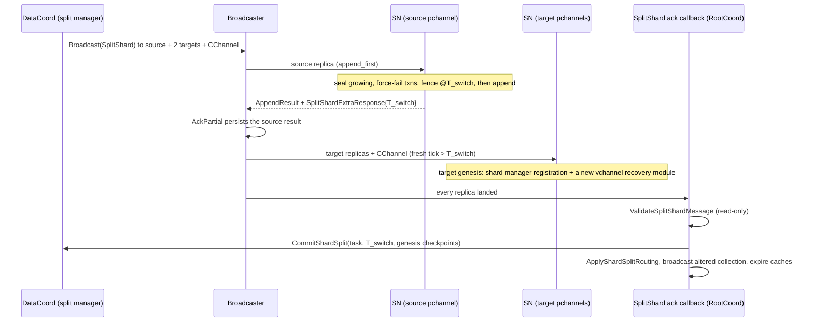
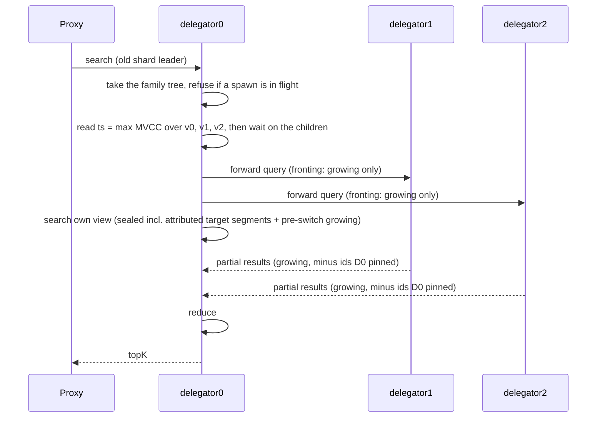
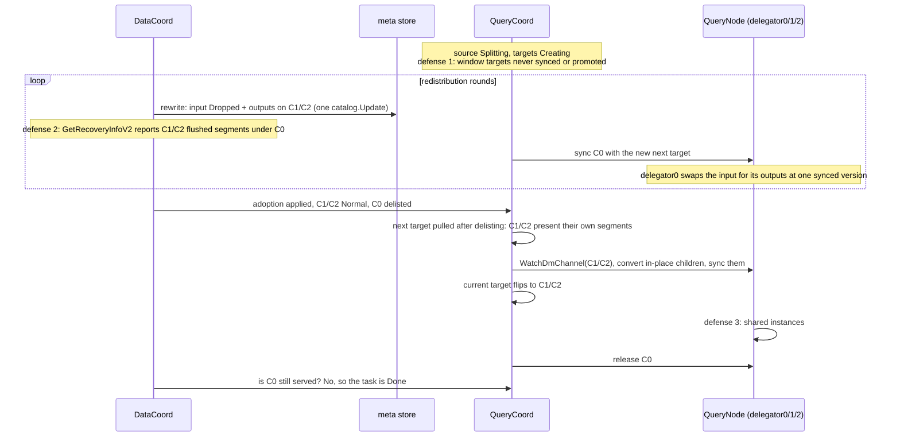

# Design Document: Online Shard Split for Namespace Collections

**Date**: June 2026
**Related Issue**: [#50463](https://github.com/milvus-io/milvus/issues/50463)

---

**What is implemented.** The whole split of a collection placed by primary
key: DataCoord's trigger and split manager (§6.1), the write switch (§6.1),
the rewrite, the drain and the adoption (§6.3), the Done check (§5), the read
path on the QueryNode and in QueryCoord (§6.2, §6.4), the proxy's residue
routing and fence retry (§3.3), and the per-cluster replication pieces (§6.5).
No split of a namespace collection is issued for now: the trigger never selects
one and the split message's own validation refuses one (§1.3). What this
document describes but the code does not do is marked **not implemented** or
*deferred* where it appears, §11 lists it with every known limitation, and §12
says what has actually been run.
The feature ships off (`dataCoord.shardSplit.enable`, §9).

**Base.** The implementation sits on master *after* the WAL recovery and
`WALSummary` refactor (#53595). That refactor deleted
`internal/streamingnode/server/flusher` and made vchannel lifecycle, L1
persistence and Delete→L0 materialization the job of one per-vchannel
`VChannelRecoveryModule` under a `PChannelRecoveryManager`
(`internal/streamingnode/server/wal/vchannel`), with a single global recovery
checkpoint per pchannel. The split's write switch is built on that module: the
fence is a field of the source's `VChannelMeta`, a target vchannel is created
by the `SplitShard` message itself, and the source is retired by the module's
own drop path (§5, §6.1 step 3, §6.5). §13 lists what the refactor absorbed
and what was deleted with it.

## 1. Overview

### 1.1 Motivation

A collection's shard (vchannel) count is fixed when the collection is created
(`ShardsNum` → `AllocVirtualChannels`, `internal/rootcoord/create_collection_task.go`).
As data grows, one shard becomes a bottleneck in three places at once:

- WAL write throughput on the StreamingNode;
- delegator memory and compute on the QueryNode;
- the compaction and index backlog of that shard.

Today the only way out is to create a new collection and re-import everything,
which is not acceptable for an online workload.

In the multi-tenant architecture a collection is organized as
**Collection → Shard → Namespace(=Partition) → Segment**. A namespace is the
tenant-isolation unit. Its data is physically isolated in object storage from
L0/L1 on, and a single namespace has a hard product limit equal to the capacity
of one shard. A namespace therefore never spans shards.

This design adds **online shard split**. One loaded shard is split into two
while reads and writes continue. For a namespace collection the split moves no
data: segments are only relabeled to their new shard *(deferred, §1.3)*. A
collection placed by primary key is rewritten onto the new shards (§6.3).

**Prerequisite.** Master implements a namespace as a hidden VarChar
partition-key field (`handleNamespaceField`,
`internal/rootcoord/create_collection_task.go`). Segments carry only an
`is_sorted_by_namespace` flag. This design depends on the in-progress
namespace(=partition) work guaranteeing that every segment belongs to one
partition-key bucket, and that the L0 segment of a namespace delete is scoped
the same way. An L0 written by a primary-key-only delete is not, and §6.3
handles it. Without that guarantee the relabel argument of §3.1 does not hold.

### 1.2 Goals

- Split **one** shard into **two** shards online. Reads and writes keep working;
  a short latency increase is acceptable, data loss or inconsistency is not.
- A namespace collection redistributes by metadata-only relabel *(deferred:
  namespace collections are not split until the namespace(=partition) work
  lands, §1.3)*. A collection placed by primary key redistributes by rewrite
  (§6.3).
- Full consistency: no message loss or duplication, ordering preserved, no MVCC
  ghost reads, and correct deletes throughout the window.
- Crash safety: every step is idempotent and resumable. Before the fence a
  split can be aborted; after it, a split can only roll forward.
- The feature is gated by configuration and ships off:
  `dataCoord.shardSplit.enable` defaults to `false` (§9). While it is off the
  trigger plans nothing and the builder refuses a new split; a split already in
  the WAL is always carried through, on every cluster.

Out of scope: changing several shards at once, shrinking, a declared
shard count, and isolating a named tenant into its own shard.

### 1.3 Current scope: namespace collections are not split yet

**Convention.** Until the namespace(=partition) work §1.1 depends on lands on
master, no split is issued for a namespace collection
(`schema.enable_namespace=true`), in either `namespace.mode`. The trigger
never selects one, the planner re-checks rootcoord's record before it plans,
and the split message's validation refuses one. Only
collections placed by primary key are split, and they split by rewrite (§6.3
step 2).

**Why.** Relabel needs every segment to lie wholly on one residue of the new
routing. Neither namespace mode on master provides that:

- `namespace.mode=partition`: a namespace is a real partition, but the proxy
  places rows by `hash(pk)` (`assignChannelsByPK`), so partition and shard are
  orthogonal and a segment holds rows of every residue.
- `namespace.mode=partition_key` with `namespace.sharding.enabled=true`: rows are
  placed by `hash($namespace_id)`, but the collection has a single partition-key
  bucket. The namespace field is added in rootcoord `prepareSchema`, after
  `broadcastCreateCollectionV1` has already set `NumPartitions = 1` for a schema
  without a partition-key field, and the proxy refuses `num_partitions` on such
  a schema. Every namespace therefore shares one partition, and with P = 1
  `routing.CheckNamespaceRelabelGranularity` refuses every M ≥ 2.

Splitting either shape today would take a rewrite of every row. That is
deliberately not done: namespace collections will split by the relabel this
document describes, once their data layout supports it.

**What the document keeps.** The namespace design (`hash($namespace_id)`
routing, relabel as its redistribution, and the admission and granularity
checks of §3.1) stays as the target for when the namespace(=partition) work
lands, with every partition's segments on one shard. It is marked
*deferred* where it appears.

**What the code enforces.** `streaming.ValidateSplitShardMessage` refuses a
split whose genesis schema has `enable_namespace` set, whatever its
`shard_by`, as a System error. It runs before the fence and again in the ack
callback, on the same message (§3.1). It runs after the admission and
granularity checks, which are unchanged: a `hash($namespace_id)` post-image
they refuse is still refused with their own message.

**To revisit when that work lands:** the planner's selection rule, the
refusal above, and whether the granularity rule still applies. If a namespace
is its own partition and is placed by its own hash, every segment is
single-residue and relabel needs no divisibility.

## 2. Background and Constraints

These properties of the current system shape the design:

1. **The channel set of a collection is fixed.** vchannels are allocated once
   at create-collection, and the whole stack assumes they never change.
2. **The WAL is the only sequencer.** Every message gets its TimeTick from the
   per-pchannel `AckManager`, and the confirmed watermark advances only over a
   contiguous acknowledged prefix. Forwarding an already-sequenced message
   into another WAL would sequence it twice and break the monotonic-arrival
   invariant that MVCC and `LastConfirmedMessageID` rely on. So the design
   never relays messages between WALs: each message is sequenced exactly once,
   in its destination WAL.
3. **Delete forwarding follows the delegator's distribution.** A delegator
   forwards a delete to the segments in its own distribution, filtered by
   partition and bloom filter (`internal/querynodev2/delegator/distribution.go`).
   If sealed-segment ownership were ambiguous during a split, deletes would be
   missed.
4. **QueryCoord cannot represent intermediate states.** The query target is
   built from `GetRecoveryInfoV2`, and `Segment.InsertChannel` is one value. A
   segment serving two channels at once does not exist in the data model.
5. **Growing segments are released only via `SyncTargetVersion`** from
   QueryCoord. A delegator QueryCoord cannot see cannot hand its growing
   segments over to sealed ones.
6. **A vchannel's lifecycle, its L1 persistence and its deletes belong to one
   recovery module, and a pchannel has one checkpoint.** Since #53595 every
   vchannel of a pchannel has a `VChannelRecoveryModule`: it is created by a
   genesis message, it publishes the vchannel's segments and L0 output, and it
   is closed by a *drop* that fences metadata publication at the drop tick and
   completes only once the module's own dependencies have finished (the L0
   materialization frontier has passed that tick, every segment created before
   it has a durable tombstone), after which the vchannel is `TOMBSTONED` and
   its catalog row is collected. The pchannel's recovery checkpoint is one
   value, published after the component snapshots behind it are durable, and
   it obeys the **handle-release rule**: it passes a time tick only once every
   message handle at that tick has been released, an Insert handle is held
   until its growing segment is published to DataCoord
   (`segment/lifecycle_writer.go PersistGrowingSegment`) and a Delete handle
   until its L0 output is registered with DataCoord
   (`l0materializer`'s `WALMaterializer`). So `cp(pchannel) >= T` means every
   Insert and every Delete of that pchannel at or below `T` is in DataCoord's
   meta. The split's fence, genesis, retirement and drain are all expressed in
   these terms (§5, §6.3). The checkpoint DataCoord still receives *per
   vchannel* is this one pchannel value, reported under every active vchannel
   of the pchannel (`vchannel/checkpoint_updater.go`), which is why the drain
   is stronger per source than it used to be and why it couples a source to
   its pchannel neighbours (§6.3 step 3).

## 3. Routing Design

### 3.1 Residue routing

A collection carries one **routing modulus** M. Each shard owns a set of
**residues** modulo M, and the sets partition `[0, M)`, so placement is a
single array index:

```
routing_value = hash(<the field shard_by names>)
route(row)    = slots[routing_value % M]
```

`shard_by` names what is hashed: `hash($namespace_id)` for a namespace
collection, the primary key otherwise. It says nothing about placement:
`hash(pk)` does **not** mean `hash(pk) % <shard count>`, which stops holding the
moment a collection is split.

M is not the shard count. A never-split N-shard collection is M = N with one
residue per shard. That is exactly the legacy `hash % N` placement: a residue
table built from the channel order, not a second code path.

A split divides the source's residue set in two, and **M does not move**. A
shard down to a single residue `r` has nothing left to divide, so M doubles
and `r` becomes `{r}` and `{r+M}`. Every shard of a never-split collection owns
one residue, so the first split of a never-split shard always doubles M; M
stays put only when the source already owns several residues, as a doubling
leaves every untouched shard. A doubling is
collection-wide: every untouched shard is re-expressed at the new modulus, and
both halves land in the one atomic meta update that commits the split. Deriving
the table (`routing.Derive`) checks that the residue sets tile `[0, M)` exactly
and that M does not exceed `2^15`. A gap or an overlap is refused, so malformed
routing meta fails loudly instead of misplacing writes.

**Admission for `hash($namespace_id)`** *(deferred with namespace splits,
§1.3; the checks run in the code)*. The namespace key is valid only for a
collection whose rows have *always* been placed by it. The proxy places a row
by namespace only when `namespace.sharding.enabled=true` **and**
`namespace.mode=partition_key`. `sharding.enabled` is written as `false` at
create time unless the request sets it, and a `partition`-mode collection is
always placed by `hash(pk)`. So a default namespace collection has every row
spread over all shards by primary key. Routing it by namespace would send a
namespace's new rows to one shard while its old rows stay everywhere, and a
delete routed by the namespace hash would miss the rest. Both properties are
immutable after creation, so `routing.CheckShardByAdmission` decides this from
the properties alone. Any other collection splits under `hash(pk)` or not at
all.

**The relabel unit is the partition-key bucket.** In `partition_key` mode a row
lands in bucket `k = HashString2Uint32(namespace) % P`, where P is the
collection's partition count, and a segment holds one bucket. The row's residue
is the same hash `% M`. A bucket, and so every segment of it, lies wholly on
one residue (`k % M`) if and only if **M divides P**. Any other modulus cuts a
bucket's segments across two shards, which no relabel can place.
`routing.CheckNamespaceRelabelGranularity` therefore refuses a namespace
post-image whose modulus does not divide P, where P is the size of the split
message's partition snapshot.

Two consequences follow:

- A namespace collection's shard count is capped by its bucket count, because
  every shard owns at least one residue and M divides P.
- Untouched shards are re-expressed from the initial modulus N by doubling, so
  a namespace collection is splittable only when N divides P. Nothing checks
  this at create time.

**When the checks run.** Every refusal the split message alone can answer runs
before the fence, in `SplitShardParam.Validate`:

- names and shape of the post-image;
- tiling and the modulus cap;
- the source listed as `Splitting`, each target as `Creating` with at least
  one residue, and no shard listed as `Dropped` (a shard reaches `Dropped` only
  by being delisted, §6.3 step 4);
- namespace admission, read from the genesis schema's properties;
- the modulus dividing the bucket count;
- no namespace collection at all (§1.3), read from the genesis schema's
  `enable_namespace`, checked last.

The SplitShard ack callback re-runs the same function
(`streaming.ValidateSplitShardMessage`) as a read-only assertion before it
commits anything (§6.1 step 4). Checks that need the collection's current meta
run at apply time (§6.3 step 4). The issuer also runs them before the fence,
against the meta it reads under the collection's resource keys
(`streaming.CheckSplitShardAgainstCollection`, §6.1 step 2), because once the
source is fenced a refusal can only be retried.

**Representation cost.** A shard's residues are an explicit list, which is
`O(M)`, not `O(shards)`. Each doubling re-expresses every untouched shard's
list and doubles its length. At the cap the lists total 32,768 `uint64`s in the
collection meta and in every `DescribeCollectionResponse`. This is accepted
because a list makes the tiling check a set operation and the cap bounds the
worst case at a few hundred kilobytes. A range encoding is a later optimization
the wire format does not preclude.

**What this model gives up.** Residues cannot carve one oversized namespace
into a dedicated shard: the smallest unit is a residue, and a doubling cuts on
a hash bit rather than by size. Balancing is therefore statistical. Isolating a
named tenant needs a second placement scheme, which is why
`CollectionShardInfo.routing` is a `oneof`.

### 3.2 Metadata

The collection meta is the authoritative source of the vchannel list, so the
routing facts live next to it and change in the same transaction:

- `schema.CollectionShardInfo`, parallel to `virtual_channel_names`, gains a
  `ShardState` (`Normal / Creating / Splitting / Dropped`), the owning
  `vchannel_name`, and a `oneof` routing predicate. Today the only variant is
  `HashRouting`, the residue list. It is unset on a never-split collection and
  on a fenced source.
  - `routing.ShardsFromMeta` admits `Normal` and `Creating` shards, excludes
    `Splitting` and `Dropped`, and refuses the whole table when a state is
    unknown to this build.
  - This is deliberate: an unknown state is a newer server talking to an older
    reader, and routing around it would place rows by a rule this build cannot
    see. (Defined in milvus-proto #618; `model.ShardInfo` mirrors it.)
- `routing_modulus` is one number per collection, `0` before the first split.
  The modulus, not the presence of residues, says a collection has been split.
  A non-zero modulus with no residues behind it is malformed and refused.
  Falling back to the legacy modulo over a grown vchannel list would re-place
  every row.
- `shard_by`.
- New fields default to legacy-compatible zero values. The routing table is
  derived from the meta (`internal/util/routing`) and is not persisted
  separately.
- `DescribeCollectionResponse` carries `shard_infos`, `routing_modulus` and
  `shard_by`. The proxy's `DescribeCollection` returns all three on both the
  remote path and the cached path.

### 3.3 Routing refresh on fence

There is no routing version on the write path. When a write reaches a vchannel
a split has fenced, the StreamingNode's shard interceptor rejects it with
`STREAMING_CODE_SHARD_FENCED` and never appends it. The streaming client
classifies that code unrecoverable, so the producer does not retry the same
vchannel; the proxy does the retry, against refreshed routing.

`SHARD_FENCED` is distinct from `CHANNEL_FENCED`:

- `CHANNEL_FENCED` is term fencing of a pchannel, recovered by reconnecting to
  the *same* channel.
- `SHARD_FENCED` is permanent for the vchannel, recovered by refreshing routing
  and writing to a *different* vchannel.

**The proxy's reaction** (`internal/proxy/dml/shard_fenced_retry.go`; the
write path lives in `internal/proxy/dml` since #53806 extracted it, and so do
the split's three files). The proxy
places every row by residue (`split_routing.go`; a never-split collection keeps
`typeutil.HashPK2Channels` verbatim). On `SHARD_FENCED` it evicts that one
collection's entry from its meta cache (`Cache.RefreshCollectionByID`) and
describes it again. The eviction does not drain the proxy's in-flight cache
fills of other collections; a racing fill that writes back a stale entry only
costs one more refusal and refresh, and the fence keeps it from misplacing
anything. It re-sends only the
rows, or the delete tombstones, that the fenced vchannel refused, each
re-resolved to its new owner by residue. A batch that spans shards is partial:
the rows the other shards accepted are already persisted, so retrying the whole
request would write them twice. Deletes are settled per message the same way:
a tombstone re-sent to a vchannel that already committed it would take a later
tick and delete what was written there in between.

- **Retry contract.** A refresh can land before the routing commit and still
  name the fenced source; the rows routed there are held back, not sent to be
  refused again, and wait for the next refresh. Attempts are unbounded, with
  backoff doubling from 200 ms to 2 s, until the request's deadline, or, for a
  request without one, `proxy.shardSplit.maxFenceRetryWait` (60 s) after the
  first refusal (§9). The request then fails with a retriable
  `ServiceUnavailable`; a cause that carries no Milvus code is wrapped as
  `ServiceUnavailable` too. A request that fails this way may have partly
  landed.
- **Transient failures during a retry back off.** A failure preparing the next
  attempt -- the routing read, building the delete messages -- goes through the
  same backoff instead of ending a request that is already partly written. Only
  a canceled context or a non-retriable Milvus error ends it. A keyed insert's
  probe (below) writes nothing, so a failed probe *answer* is judged on every
  attempt, the first included, by what can cure it
  (`classifyProbeAnswer`):
  - a transient answer (no streaming code, i.e. a transport error or an ended
    context; `CHANNEL_NOT_EXIST`, `CHANNEL_FENCED`, `UNMATCHED_CHANNEL_TERM`,
    `ON_SHUTDOWN`, `INNER`, `RESOURCE_ACQUIRED`, `RATE_LIMIT_REJECTED`; a
    retriable Milvus error) backs off and retries. `RATE_LIMIT_REJECTED` is
    also what the WAL's recovery-tail reject mode answers
    (`wal_adaptor.go`, `streaming.walRecovery.tail.highWatermark`, 16 GB): it
    is decided *ahead of* the interceptor chain, so a probe refused that way
    never reached the window and asking again is sound. It can hold for
    minutes behind a large recovery backlog, and it is the one answer that can
    exhaust `proxy.shardSplit.maxFenceRetryWait` on an otherwise healthy
    split;
  - `UNRECOVERABLE`, which is the redo interceptor's answer for a collection it
    no longer finds on that vchannel (a source already retired), refreshes the
    routing once per vchannel and retries; if the refreshed routing still
    lists that vchannel and it answers the same way, the request ends;
  - any other answer ends the request at once with that answer, classified as
    any failed append is.

  A probe that cannot even resolve its row's partition keeps the older rule:
  it backs off only during a retry.
- **Auto ids.** An idempotent auto-id insert buckets row `i` by residue
  (`i % M`, then the residue's owner), so a retry across a split keeps the rows
  an unsplit shard already holds on that shard; a split only refines residues.
  The pinning holds for every row at the moment it is placed: on each attempt,
  a row still pending whose id no longer routes to the owner of its offset's
  residue under the current routing gets a fresh id
  (`insertTask.repinPendingAutoIDs`), in the row ids, the primary-key column
  and the returned ids alike, so an in-request re-route lands it where a client
  retry would send it. A pending row was written nowhere, so its id is free to
  replace; rows already placed keep theirs, and ids are never recycled. The
  re-pin is skipped while the routing is the one the ids were last pinned
  against.
- **Partial updates** whose compare-and-set proof predates a routing change are
  refused as retriable.
- **Import** into a collection a split has touched (a non-zero routing
  modulus, or a shard listed `Splitting`) is refused by the proxy with
  `OperationNotSupported` for now; DataCoord refuses an import that names a
  shard a split is moving with a retriable `ServiceUnavailable` (§8.10).

**Keyed inserts across the fence (N-4).** Deduplication covers exactly the
inserts a client keyed explicitly, with an `idempotency-key`. There is no
global and no per-collection enable switch, and the proxy never derives a key
from the payload (#53595 deleted both), so **an insert with no key is not
deduplicated at all** -- by a split or without one. An unkeyed insert whose
response is lost while a split is in flight and which the client retries
writes its rows twice, exactly as it would with no split in flight: unkeyed
writes are at-least-once, across a fence as anywhere else (§7, §11). The rest
of this paragraph is about a keyed insert.

A keyed insert whose first attempt
landed on the source, and whose response was lost, would be re-routed to a
target, whose idempotency window never saw the key. So before it places a row,
a keyed insert asks the window of every fenced vchannel it knows of -- the
shards the collection lists `Splitting`, and any that refused it during this
request -- with a one-row probe carrying the key. The source's window is frozen
at the fence and is consulted before the shard interceptor refuses (§7): a
duplicate answer settles exactly the offsets the window names; otherwise the
probe is refused with `SHARD_FENCED` and changes nothing. Each duplicate
answer is merged into the request's result as soon as it is settled.

**The idempotent-write contract.** On a collection no split has touched, and
for a request that met no fence, a keyed insert behaves exactly as on master:
settling takes the offsets the message carried plus the ones the window
answered, and a key reused with another payload returns the first result (an
answered offset outside the request is `ParameterInvalid`, as before). Once rows
may have been re-routed -- the collection has split routing (a residue table,
or a shard listed `Splitting`), or this request met a fence
(`pendingRows.checkPlacementFrom`) -- a duplicate answer settles **only** the
offsets the window answered, never the answered message's other offsets, and
the answer must match where this request placed each row:
- an answered offset outside the request, or an offset the message carried
  that the answer leaves out, is a key reused with another payload:
  `ParameterInvalid` (when a probe answer shows it, before any row of the
  request is placed). After the
  re-pin above, an identical retry sends each vchannel exactly the offsets the
  first request wrote there, so neither can happen on a genuine retry;
- an answer for a row this request placed on another vchannel, or a row landing
  after another vchannel's window has answered for it, is an inconsistent
  placement: a non-retriable `ServiceInternal`.

An append response in the batch with neither an error nor a result counts as
not landed.

The guarantee holds **only for a retry that arrives before adoption**. Once
adoption delists the source, the proxy no longer learns its name from the
collection's meta, and a retry after that is treated as if its key had been
evicted from the window: it is written again, on the targets, and can
duplicate rows. This is accepted. Three ways to extend it were rejected:
- a minimum delay before adoption only moves the bound -- the window is
  byte-bounded and has no TTL anyway -- and lengthens every split;
- probing retired sources is unsafe for a different reason than it used to
  be. No message type invalidates a window any more (§7), so a retired
  source's window keeps answering for as long as the summary retains it --
  which means it would answer "duplicate" for rows a `TruncateCollection` or
  a `DropPartition` has since removed, with no mechanism left that clears the
  key. The binding limit is anyway the proxy's routing view, not the
  window's retention: once the adoption delists the source the proxy never
  learns its name again;
- handing the source's keys to the targets at the fence needs a new WAL-level
  mechanism to seed a window with answers that belong to another vchannel's
  append, and would still not make the guarantee unconditional, since windows
  evict keys.

`STREAMING_CODE_ROUTING_STALE` has been removed. It had no producer, and its
number, 19, is reserved in `streaming.proto`.

## 4. Design Overview

Five principles work around §2:

1. **The old delegator spawns child delegators in place.** When delegator0
   consumes the split message, it creates the two children on the same
   QueryNode and fronts them (forward + reduce). QueryCoord sees the targets
   from the fence commit on, listed `Creating`, but never watches, syncs or
   promotes one from a target pulled inside the window (§6.2).
2. **Children own no sealed segments until adoption.** delegator0 serves
   every sealed segment for the whole window, including the targets' visible
   flushed segments, which DataCoord reports under the source while it is
   listed (§6.3 step 2). The children consume growing data and deletes from the
   new WALs.
3. **Service ownership moves late; adoption is one-shot.** The targets serve
   reads of their own only after adoption has delisted the source and
   QueryCoord has synced them from a target pulled after that. The commit that
   retires the source is applied by a cluster only once *that cluster's*
   DataCoord reports it drained. There is no partial ownership migration.
4. **The whole write switch is one broadcast.** One `SplitShard` message goes
   to exactly three kinds of vchannel: the source, the two targets, and the
   control channel (which the broadcaster adds to every broadcast it issues,
   so the builder does not name it). Every replica carries the same header and
   body, and what a replica does is decided by its vchannel's role
   (`message.SplitShardRoleOf`):
   - **source**: the write fence. Its node seals every growing segment of the
     vchannel, embeds their ids in the header, and tears the registration down,
     leaving a fence tombstone keyed by name. After `T_switch` the vchannel
     never accepts DML again. The record is also the source vchannel's **seal
     record** and an explicit **L0 boundary**: its recovery module flushes the
     growing L1 at the fence tick and materializes every delete below
     `T_switch` at `T_switch`, rather than whenever the stale-flush timer next
     comes round (§5, §6.3 step 2).
   - **target**: the genesis of a new vchannel. The replica *creates* the
     vchannel's recovery module -- `vchannel.Manager.moduleForMessage` builds
     one for a genesis message, and a `SplitShard` replica in the target role
     is one, exactly as `CreateCollection` is -- and seeds its meta from the
     body, which carries the schema in `CreateCollection`'s body shape, and
     from the header's partition snapshot. The target's first checkpoint is
     this message.
   - **control channel**: no effect in any consumer; it orders the ack
     callback.
   - **anything else**: a misroute. It is refused on the append path, and
     another shard of the same collection is no exception.

   The source is named in `BroadcastHeader.append_first_vchannels`. The
   broadcaster appends *and persists* it before any other replica, and
   `SplitShard` is `FreshTimeTick`, so every other replica takes a freshly
   allocated tick. The source holds no message after `T_switch`, and the
   targets hold none at or before it.
5. **Only facts travel in the WAL; coordinator actions happen in ack
   callbacks.**
   - The header names the collection, the task id, the source, the two
     targets, the sealed segments, and the partition snapshot.
   - The body carries the genesis schema and the routing post-image, which is
     the *only* copy of the residues and the modulus.
   - When to redistribute, when the source has drained, and when to adopt are
     local decisions. The cluster that planned the split and a cluster that
     only replayed it run the same callbacks. That is what makes the split
     replicable (§6.5).

## 5. Roles and State Machine

- **DataCoord, planning cluster** (the split manager,
  `internal/datacoord/shard_split_*.go`). Its trigger detects the need and
  persists a `Preparing` task (task id, source, the two targets' residues and
  the modulus after the split); it then allocates the target vchannel names
  and pchannels and persists them too, before the first send (§6.1 step 1).
  It issues **one** `SplitShard` broadcast under the collection's resource
  keys, building the post-image and partition snapshot from the meta it reads
  under them, and reads nothing back from its result. Compaction on the source
  and the targets is frozen from the task's creation until Done (§8.2). The
  manager redistributes (§6.3), issues the adoption once its own drain
  predicate holds, and moves the task to Done once this cluster's QueryCoord no
  longer serves the source (below). The write switch and the adoption are
  issued off the manager's loop (`issueOffLoop`), at most one issue in flight
  per task: taking the collection's resource keys cannot be canceled, so an
  issue stuck behind a long DDL stops only its own task, every other task keeps
  advancing, and `Stop()` does not wait for it. While a task's issue is in
  flight, `Preparing` skips the task entirely (no re-allocation, no
  re-preemption) and `Adopting` still runs its drain check but does not issue
  again. A detached issue that gets the keys after `Stop()` ends on the
  canceled context; anything it writes is idempotent.
- **DataCoord, every cluster.** The split manager runs everywhere: on a
  secondary the SplitShard ack callback creates the task already in
  `Redistributing`, and the manager rewrites and drains it like any other; it
  never issues a split or an adoption there. Two internal RPCs the callbacks
  call:
  - `CommitShardSplit`: an idempotent upsert of the task record by task id,
    with the source's `T_switch`; then the channel-added mark for each target
    (`catalog.MarkChannelAdded`, what `WatchChannels` gives a created
    collection's vchannels and what the garbage collector's `ChannelExists`
    guard reads); then seeding of each target's genesis channel checkpoint.
    The mark goes before the seed, in `WatchChannels`'s order, and the whole
    read-merge-upsert-mark-seed sequence is serialized per task id
    (`lock.KeyLock`), so a redelivered callback and a planner writing the
    same task cannot lose each other's fields (§6.1 step 4).
  - `CheckShardSplitDrained` (§6.3 step 3).

  Flush state needs no exception for a split source any more: the checkpoint
  DataCoord receives for the source keeps advancing with its pchannel, so
  `GetFlushState` and `GetFlushAllState` are master's (§6.3 step 3).
- **RootCoord.** Owns both callbacks: the `SplitShard` one (§6.1 step 4) and
  the `AlterCollection(shard_split_routing)` one, which judges and
  drain-gates an adoption before applying it (§6.3 step 4). Both write the
  meta through one path, `MetaTable.ApplyShardSplitRouting`.
- **StreamingCoord.**
  - The broadcaster's append-first ordering with `AckPartial`, persisting each
    replica's extra append response, and `WaitVChannelsAcked` for a
    secondary's append gate (§6.5).
  - Allocating the targets' vchannels (`AllocVirtualChannels` with the
    collection's known vchannels: the listed ones plus every source and target
    of its unfinished splits). Their pchannels are excluded and the shard index
    continues after the largest of them, so a target name is never reused. The
    invariant of at most one vchannel per collection per pchannel is kept, so
    shard count is capped by pchannel count (§8.5; §11 M5).
- **StreamingNode (source).** It receives the fence on the normal append path
  by owning the source pchannel. Under the vchannel-exclusive lock the shard
  handler seals the growing segments (`FlushAndFenceSegmentAllocUntil`, so each
  of them takes `SEGMENT_ASSIGNMENT_STATE_SEALED`), embeds their ids, and
  force-fails active transactions. It installs the fence *before* it appends
  the fence record, and keeps it whatever the append returns (§6.1 step 3).
  Two things then happen, in the write path and in the recovery module:
  - **Shard-manager registration** (write path). It is torn down in the same
    critical section as the fence, leaving `SplitFence{TimeTick, TaskID}` keyed
    by name. This frees the pchannel's per-collection slot, so a target can be
    placed there at once. The tombstone answers a stale route with
    `SHARD_FENCED` and gives a re-sent fence its recorded tick. It is rebuilt
    after a restart from the write-path recovery snapshot, from the persisted
    fence below (`shards.newFencedVChannels` over
    `moduleapi.VChannelWritePathRecoveryState.SplitFenceTimeTick` /
    `.SplitFenceTaskID`): a restart therefore lands on the same state, the
    source's registration deliberately *not* rebuilt, since a live successor
    may already hold that pchannel's single slot for the collection.
  - **The source's recovery module** (`vchannel.VChannelRecoveryModule`). It
    observes its own replica and does three things with it, all in
    `ObserveSplitShardSourceMessageV2` and the module's dispatch
    (`vchannel/split.go`, `vchannel/module.go`):
    - it flushes every segment created before the record, because the record
      *is* the seal record for `T_switch` (there is no `ManualFlush` ahead of
      it any more, and no `SealAllSegments` either);
    - it records the fence in the vchannel meta:
      `VChannelMeta.split_fence_time_tick` = `T_switch` and
      `split_fence_task_id` = the task that placed it. `T_switch` is read from
      the record's `_ae` (`SplitShardExtraResponse`), so a re-driven first
      fence records the first attempt's tick, not the record's own. The fence
      is written once and never moved; it is also written through every
      outstanding pending drop's stable pre-image, exactly as the L0
      materialization frontier is, so a fence landing while a partition drop
      is pending cannot be withheld from the published snapshot (§7, crash
      recovery);
    - the record is an **L0 boundary** (`WALMaterializer.isL0Boundary`), so
      the batch it ends materializes every delete of the vchannel below
      `T_switch` at `T_switch`.

    The vchannel stays `VCHANNEL_STATE_NORMAL`. There is no `SPLITTED` state:
    enum 4 is `reserved` in `streaming.proto` with a comment saying why. A
    fenced source is still on the collection's vchannel list, still observes
    the collection's DDL, and still drains its own data, so the fence is one
    field and the retirement is a separate, later observation
    (`ObserveRetireVChannel`, §6.5). Nothing closes anything at the fence:
    there is no data sync service, no close gate, and no per-vchannel flusher
    checkpoint to freeze.
- **StreamingNode (targets).** Whichever nodes own the target pchannels create
  the targets from their replicas of the same broadcast: the replica is a
  genesis message, so `vchannel.Manager.moduleForMessage` builds the
  vchannel's recovery module for it
  (`isVChannelGenesisMessage`), and the module seeds the meta from the body's
  genesis schema and the header's partition snapshot
  (`NewVChannelMetaFromSplitShardTargetMessage`). The target's own
  `checkpoint_time_tick` is the message's tick, exactly as a fresh
  `CreateCollection`'s is, so **no genesis position is persisted beside it**
  (`split_genesis_checkpoint` is gone): a split target is an ordinary vchannel
  from there on. A replay of the genesis is ignored; a target name reused
  after its predecessor was collected starts a new lifetime only past the
  retained checkpoint (`CanStartNewCollectionAt`).
- **delegator0, delegator1/2, QueryCoord.** See §6.2 to §6.4.
- **Proxy.**
  - Routing by residue, reacting to `SHARD_FENCED`, and the keyed-insert probe
    (§3.3).
  - On a secondary, the replicate service's name remap and append gate (§6.5).


```mermaid
flowchart LR
    IDLE["Normal"] -->|"split planned and persisted"| PREP["Preparing"]
    PREP -->|"abort, never broadcast"| IDLE
    PREP -->|"one SplitShard broadcast, source appended and persisted first"| FENCE["Fencing, fenced at T_switch"]
    FENCE -->|"ack callback records the task and applies the post-image"| WIN["Redistributing, the window"]
    WIN -->|"this cluster drained"| ADOPT["Adopting, AlterCollection(shard_split_routing) delists the source"]
    ADOPT -->|"drain regressed, source still listed"| WIN
    ADOPT -->|"this cluster's QueryCoord no longer serves the source"| DONE["Done"]
```

The split task record moves through `Preparing → Fencing → Redistributing →
Adopting → Done`, with `Aborted` reachable from `Preparing` only (§10).
`Preparing` is planned and persisted; `Fencing` means the write switch was
issued and its ack callback has not recorded the fence yet; the callback puts
the task in `Redistributing` (on a secondary it creates it there); the manager
moves it to `Adopting` once this cluster's drain predicate holds, and to
`Done` as below. A drain that stops holding while the task is `Adopting` and
the collection still lists the source -- data landed on the source after the
adoption was issued, e.g. from an import started on stale meta, or a late
segment on a secondary -- moves the task back to `Redistributing`
(`reopenRedistribution`), on every cluster. The rewrite then takes the late
segments, and once the drain holds again the task returns to `Adopting`; on
the primary it re-issues the adoption, which is idempotent by task id (one
already applied is success and sends nothing), and a secondary keeps waiting
for the replicated adoption as before. A collection rootcoord reports dropped
ends the task in any state, with the reason recorded: `Aborted` while it is
`Preparing` with no target allocated, `Done` otherwise, since past the fence
there is no abort.

**Done.** A task moves from Adopting to Done when this cluster's QueryCoord no
longer serves the source: the source is not listed by `GetShardLeaders`
(asked with `WithUnserviceableShards`, so every channel of the current target
is listed, served or not), or the collection is not loaded or not found.
DataCoord asks QueryCoord through its mixCoord client. The compaction freeze
(§8.2), the garbage collector's hold on the channels' dropped segments, and
the trigger's exclusion of the collection (§6.1 step 1) hold until Done. A
collection dropped or released mid-split is not served, so its task is Done. A
failed mixCoord query leaves the task in Adopting; the next tick asks again.
There is no deadline on this wait and no operator escape: a QueryCoord that
keeps serving the source keeps the task in `Adopting`, with the freeze, the GC
hold and the trigger exclusion in place, and -- since
`maxConcurrentTasks` defaults to 1 -- blocks every new split in the cluster
(§11).
QueryCoord's own balance freeze follows the shard states and the current
target, not the task: it holds while a shard is `Splitting` and until the
current target stops listing the retired source (§6.4). The StreamingNode's
retirement and collection of the source's WAL-side state (§6.5) is a separate,
local event.

Task records are never removed, in any state. The append gate's exit (§6.5)
and the judge's "recorded means retired" (§6.3 step 4) read them. A fenced
commit that finds its record `Aborted` -- which the abort rules make a bug --
is logged at Error and rolls the record forward to `Redistributing`: the fence
has landed, and a fenced split only moves forward.

## 6. End-to-End Flow

### 6.1 Trigger and write switch

The write switch is **one broadcast and its ack callback**. There is no
coordinator→StreamingNode RPC: the streaming client already handles owner
discovery, retry across pchannel reassignment, and term fencing.

1. **Trigger and planning** (`shardSplitManager.detectOnce`, `planSplit`).
   The manager's loop advances every task by one step each
   `dataCoord.shardSplit.taskInterval`, and runs the trigger once every
   `checkInterval` (§9). The trigger runs only when all of these hold:
   - `dataCoord.shardSplit.enable` is on;
   - `dataCoord.enableCompaction` was on at startup: the trigger is
     policy-driven like every other compaction (a split already created is
     carried through either way, §8.2);
   - this cluster is not a replication secondary; a failed read of the role
     counts as secondary for that round.

   A collection is a candidate only if it has a schema, is not a namespace
   collection (§1.3), is not an external collection, has no TEXT field
   (struct sub-fields included; the rewrite cannot carry TEXT yet, §11), and
   has **no split that is not Done or Aborted**: one split per collection at a
   time, because every split changes the routing the next one would be planned
   against. A shard is split when its healthy segments reach
   `maxShardSize` GB or `maxShardRows` rows, while fewer than
   `maxConcurrentTasks` tasks are active cluster-wide; at most one shard per
   collection is planned per round.

   Planning re-reads the collection from rootcoord and gives up without error
   if the record is a namespace collection, has a TEXT field, or no longer
   lists the shard as `Normal`. The runaway-doubling guard
   (`minSiblingRatio`) refuses to double a single-residue shard whose sibling
   half from the previous doubling holds less than that fraction of its size:
   one primary key inserted many times hashes to one half however often the
   shard is doubled. The residues are halved (`planSplitResidues`): a set of
   several residues is cut in the middle of its sorted order and the modulus
   stays; a single residue doubles the modulus, refused past `2^15`. Before it
   allocates a task id or writes anything, the planner asks the vchannel
   allocator, exactly as `Preparing` will, whether the collection could get its
   two targets now (`probeTargetAllocation`; the allocator reserves nothing).
   If not, no task is recorded and a rate-limited Info log says why, so a
   collection that cannot get two more pchannels leaves no aborted records
   behind. Otherwise the task is persisted `Preparing` with its task id,
   source, the two halves and the modulus after the split.

   In `Preparing` the manager allocates the two target vchannels and persists
   them (§5, StreamingCoord). From then on the task is never re-planned: a
   re-issue must present the same id and topology. It then preempts the
   compactions running on the source (§8.2) and issues the write switch
   (`Server.issueShardSplit`), under the collection's resource keys, off the
   manager's loop (§5). The
   post-image and the partition snapshot are **not** persisted: they are built
   from the meta read under those keys on every issue attempt
   (`buildSplitShardParam`), so they are exactly the meta the broadcast is
   checked against and applied to. The broadcast is deduplicated by an
   idempotency key built from the task id alone, and the broadcaster does not
   compare message content, so a re-issue of a switch that landed resolves to
   the first broadcast; before building anything the issuer asks the task
   store, and a task already recorded fenced needs no broadcast at all. A
   successful issue moves the task to `Fencing`.

2. **One broadcast** (`streaming.NewSplitShardBroadcastMessage`).

   | Part | Contents |
   |---|---|
   | Header (`SplitShardMessageHeader`) | `collection_id`, `split_task_id` (never zero), `source_vchannel`, `target_vchannels` (exactly two), `flushed_segment_ids` (filled on the source replica), `partition_ids` |
   | Body | `genesis`: a `CreateCollectionRequest` whose schema carries the collection properties. `routing`: the post-image, which is the grown vchannel list, every shard's state and residues, the modulus and `shard_by` |
   | Recipients | the source and the two targets, named by the builder; the control channel, added to every broadcast by the broadcaster itself (`message.WithBroadcastControlChannel`), which is why `SplitShardParam` has no `ControlChannel` field |
   | Idempotency key | collection-scoped, `shard-split-<task id>` |
   | Resource keys | An obligation on the issuer, not a property of the message: the broadcast is started under `SharedDBName + ExclusiveCollectionName`, which the broadcaster then holds until the ack callback returns. DataCoord's issuer (`startSplitCollectionBroadcast`) reads the collection's name, takes the keys, reads the collection again under them, and refuses a rename in between as a retriable `ServiceUnavailable`; the next attempt takes the new name's keys. Keys are collection names; §10 says what that means for ordering on a secondary |

   Nothing is derived from mutable meta later, so a retry and a replay commit
   the same topology. `SplitShardParam.Validate` runs every message-only
   refusal of §3.1 before anything is appended, and also refuses:
   - a zero task id;
   - an empty partition snapshot;
   - a target placed on a pchannel another listed vchannel of the collection
     occupies. The source's own pchannel is free, because the fence frees its
     slot;
   - a control channel named as the source or as a target
     (`funcutil.IsControlChannel`). A target named like one would be created
     as a shard nothing routes to and, on the broadcast result, be mistaken
     for the control-channel replica whose tick orders the commit; a control
     channel as the source reaches a builder invariant
     (`OptBuildBroadcastAppendFirst`) that panics instead of erroring. The
     control channel itself is no longer validated as a parameter, because it
     is no longer one.

   `Validate` cannot make the checks that need the collection's meta. **The
   issuer calls `streaming.CheckSplitShardAgainstCollection` under the
   collection's keys, immediately before `Broadcast`.** That function:
   - runs `Validate`'s checks;
   - requires the genesis properties to agree with the meta's on namespace
     admission;
   - requires the source to be a shard of the collection, and every shard of
     the collection to be listed by the post-image: a split retires nothing,
     so a forgotten live shard is a planning bug, not a retirement the apply
     would wait for;
   - runs the apply's own judgement (`routing.JudgeCommit`, §6.3 step 4) with
     the split's own delta: the header's source fenced, the header's two
     targets created, nothing else changed;
   - requires the source to be `Normal` in the meta and no target to exist yet.

   **The issuer also checks DataCoord's split task store first**
   (`checkSplitTaskRecord`). A split task id already recorded there for a
   different collection or a different source passes every check above, and
   DataCoord's `validateCommitShardSplit` would refuse it only inside the
   SplitShard ack callback, after the fence. The issuer also re-checks, under
   the keys, that no TEXT field has appeared since planning.

   A refusal after the fence can only be retried forever. A refusal made under
   the keys before anything is broadcast, while neither the store nor the meta
   shows the switch applied, is marked as such: if it is not retriable (a TEXT
   field added, the switch turned off, a check that the meta now fails) the
   still-`Preparing` task is aborted instead of retrying forever (§10).

3. **Two-phase append and the fresh tick.** The broadcaster appends the source
   replica alone and **persists** it with a partial ack (`AckPartial`) before it
   appends anything else. On the source replica, the StreamingNode's shard
   handler does the following:
   - it refuses the replica (unrecoverable) if `split_task_id` is zero, before
     sealing or fencing anything;
   - on a first fence, it seals every growing segment
     (`FlushAndFenceSegmentAllocUntil`), embeds their ids, and fences the
     vchannel: tombstone, registration teardown and function-runner key
     release. The replica's own tick is `T_switch`. `SplitShard` is
     `ExclusiveRequired`, so active transactions on the vchannel are
     force-failed. The fence is installed **before** the record is appended and
     is kept whatever the append returns. An append error does not prove the
     record is absent: the WAL adaptor returns a canceled or expired context, or
     a fenced WAL term, as it gets it, and the backend may already have written
     the record;
   - on a re-fence by the **same** task, it appends again and **moves nothing**.
     The broadcaster re-drives a source replica whose append it has not
     persisted, whether that append landed or failed. The tombstone and the
     recorded `split_fence_time_tick` do not move, and the re-fence reports
     the recorded tick: raising `T_switch` would be unsafe and not merely
     useless, since DataCoord has recorded the first tick and the drain is
     judged against it;
   - on a fence already placed by **another** task, it refuses with
     `SHARD_FENCED`, carrying the recorded tick and task id on the error. No
     extra response is reported.

   On a first fence and on a same-task re-fence the handler reports the
   recorded tick back as `SplitShardExtraResponse{split_time_tick}`, in two
   places: on the append result, and on the record itself under the reserved
   `_ae` property. An ack from either side therefore carries it, and the
   broadcaster persists it in `AckedCheckpoint.extra`. The source's recovery
   module reads `T_switch` from `_ae` too (`splitSwitchTimeTickOf`), falling
   back to the record's own tick only when the record carries none.

   **A first append that definitely failed.** No record carries `T_switch`
   then. Nothing was accepted after it either, so it is still a valid
   `T_switch` for the record the re-drive persists, and the re-drive reports it.
   Until the re-drive lands, DML on the source is refused with `SHARD_FENCED`.
   If the StreamingNode restarts first, the fence is lost with its memory and
   nothing recorded it, so the re-drive is a genuine first fence at a new tick.

   **A chunked fence record.** Chunking happens below every interceptor, so a
   source replica whose payload is split into chunks carries the same time tick
   and `_ae` on every chunk. An incomplete chunk set is never delivered to any
   reader and is discarded at the next time tick, and the append that wrote it
   only gives up when the WAL itself is going away. A partial write is therefore
   either the definite-failure case above or, if every chunk landed, the
   ambiguous one.

   The targets and the control channel are appended only after the source is
   durable. `SplitShard` is `FreshTimeTick`, so each of them takes a freshly
   allocated tick, strictly greater than `T_switch`. No barrier value is
   computed, carried or compared. The two consumers that treat
   `CreateCollection` as vchannel genesis -- the shard manager on the write
   path and the vchannel recovery module on the consume path -- read a target
   replica by its role and share the schema parser.

   > **The source must be persisted before the rest is appended.** The
   > `> T_switch` guarantee rests on that order alone. Appending concurrently
   > would keep every primary-side test green, and would break the secondary's
   > append-gate liveness argument (§6.5).

4. **Ack callback** (`splitShardV2AckCallback`). It runs on every cluster the
   broadcast reached, once every replica has landed, and is retried with
   backoff until it returns nil while the resource keys stay held.
   1. If the collection is gone, or is not `Available()` (a `Dropping`
      collection, §6.1), it logs a Warn and stops, writing neither commit
      half: the routing apply would re-count shards and re-register targets
      that `DropCollection` has already settled, and the DataCoord record would
      mark targets added and seed checkpoints the drop never tears down (it
      drops only the vchannels the collection lists). `ApplyShardSplitRouting`
      refuses a non-`Available()` collection too, under its lock and before
      the judge (`errShardSplitRoutingCollectionUnavailable`), so a drop that
      lands between this check and the apply also stops the callback, before
      `BroadcastAlteredCollection`, which cannot resolve a `Dropping`
      collection. A result with no control-channel
      replica (found by name, so only a broadcast built around `Validate` has
      none) is returned as a retriable `ServiceUnavailable`, logged as the
      wedge it is, before either commit half. The routing commit is stamped
      with the broadcast's max tick over every replica
      (`result.GetMaxTimeTick()`), the source every other collection-meta
      write uses, the adoption's own commit included -- not the control
      channel replica's own tick, which on a secondary can be smaller than
      another replica's and would move `UpdateTimestamp` and the snapshot ts
      backwards (§6.5).
   2. It re-runs `streaming.ValidateSplitShardMessage` as a **read-only
      assertion**. A failure is logged at Error, naming the wedge, and returned
      as a System error; nothing is committed.
   3. It checks that the genesis schema's collection properties agree with the
      meta's on what namespace admission reads
      (`routing.CheckAdmissionPropertiesAgree`). Admission was answered before
      the fence from the genesis copy, and the apply answers it from the meta's
      copy. A disagreement is logged at Error and returned; nothing is
      committed.
   4. **Judge** (`routing.JudgeCommit`, §6.3 step 4) with the split's own
      delta: the header's source fenced, the header's two targets created.
      Every other shard must be exactly what the meta holds. A post-image
      ahead of the meta -- it reflects a routing commit of the collection this
      cluster has not applied, which on a secondary happens when this
      callback overtook that commit's (§10) -- is returned as a retriable
      `ServiceUnavailable` before anything is committed, so no task is
      recorded for a split this cluster cannot apply yet. A source the meta
      does not list is told apart by DataCoord's record of the task
      (`CheckShardSplitDrained`): recorded means retired, a redelivery; not
      recorded means never created here, ahead. An incoherent post-image is
      logged at Error and returned.
   5. **DataCoord** (`CommitShardSplit`). It records the task with the
      source's `T_switch`, taken from the source result's
      `SplitShardExtraResponse`. A missing, foreign or zero extra is a
      retriable `ServiceUnavailable`, never a fallback to the append tick. The
      tick of a re-driven append is later than the fence it re-sent, and the
      source may already have drained past the first one. `T_switch` is the
      tick of the task's **first** fence: a redelivery that reports another
      tick is logged at Warn and the recorded one is kept. The record's state
      only moves forward (`Preparing`/`Fencing` to `Redistributing`; one
      already `Adopting` or `Done` is left alone; an `Aborted` one is rolled
      forward, §5). It also records the
      targets with residues taken from the post-image, marks each target
      added (`catalog.MarkChannelAdded`, an idempotent save; a target already
      marked for removal by `DropVirtualChannel` is left alone, so a late
      redelivery cannot revive it), and only then seeds each target's genesis
      channel checkpoint from the target's own append result, only if the
      target has none. The mark goes before the seed, as in `WatchChannels`:
      it is what the garbage collector's `ChannelExists` guard reads to keep a
      compacted-away segment's meta while the channel checkpoint is still
      behind it, so a consumer replaying from that checkpoint still finds it
      in `DroppedSegmentIds` and filters its rows; a target with a checkpoint
      but no mark had those rows replayed next to the compaction output. The
      record's read, merge and upsert, and the mark and seed after them, run
      under a per-task-id lock, so two writers of one task cannot lose each
      other's fields. DataCoord refuses a commit that does not name exactly
      one source and two targets, or that reuses a recorded task id for
      another collection or another source.
   6. **Meta** (`MetaTable.ApplyShardSplitRouting`, one catalog write under
      `ddLock`). The targets become write-routable. It judges again, under
      the lock, with the same delta; a post-image whose delta the collection
      already carries is a no-op, and a refusal is returned. The post-image
      was frozen at plan time, so a shard the collection already has keeps its
      live `last_truncate_time_tick` (a `TruncateCollection` inside the window
      writes it directly); only a shard the commit creates takes the
      post-image's value. The same holds for the adoption's commit.
   7. `BroadcastAlteredCollection`, then the proxy caches are expired.

   DataCoord goes first because seeding is what makes a target safe for a
   coordinator-side reader to discover. Until a target has a checkpoint,
   DataCoord's seek position for it falls back to the collection's creation
   position, and the post-image is what makes the target discoverable to
   QueryCoord. The StreamingNode does not depend on the seed at all: the
   target's recovery module was created by the `SplitShard` replica itself and
   its first checkpoint is that record, so there is nothing for the seed to
   tell it (§5). Both halves are idempotent, so a crash between them is
   repaired by the retry.

5. **Proxy refresh.** The cache expiry in step 4, or a `SHARD_FENCED` refusal
   before it reaches the proxy, makes the proxy describe the collection again
   and route by the post-image's residues; only the refused rows and
   tombstones are re-sent (§3.3).

WAL transactions need no extra machinery. The lock interceptor appends each
data replica under its vchannel-exclusive lock and force-fails active
transactions; the client retry loop replays them after the refresh. Only the
source and the targets pay this cost, since no other shard receives a replica.

Collection DDL must not interleave with the switch. That is the issuer's
obligation from step 2: a broadcast started under `ExclusiveCollectionName`
holds it from issue until its callback returns, and only under that key is the
partition snapshot the message carries exact. Neither the message nor any of
its consumers checks it. The keys are the issuer's lock guards stamped into the
broadcast header, not a property of the message, so the builder cannot add
them. This holds on the **issuing cluster** only. A secondary orders ack
callbacks by the replicated headers' keys, which are collection *names*: a
rename between the split and a `DropCollection` gives the two different
`ExclusiveCollectionName` keys, and the drop's callback can mark the collection
`Dropping` while the split's (or its adoption's) callback is still retrying. No
name-based key survives a rename, so no key was added; both callbacks ignore a
collection that is not `Available()` instead (step 4.1, §6.3).


```mermaid
sequenceDiagram
    participant DC as DataCoord (split manager)
    participant BC as Broadcaster
    participant SN0 as SN (source pchannel)
    participant SNT as SN (target pchannels)
    participant CB as SplitShard ack callback (RootCoord)
    DC->>BC: Broadcast(SplitShard) to source + 2 targets + CChannel
    BC->>SN0: source replica (append_first)
    Note over SN0: seal growing, force-fail txns, fence @T_switch, then append
    SN0-->>BC: AppendResult + SplitShardExtraResponse{T_switch}
    BC->>BC: AckPartial persists the source result
    BC->>SNT: target replicas + CChannel (fresh tick > T_switch)
    Note over SNT: target genesis: shard manager registration + a new vchannel recovery module
    BC->>CB: every replica landed
    CB->>CB: ValidateSplitShardMessage (read-only)
    CB->>DC: CommitShardSplit(task, T_switch, genesis checkpoints)
    CB->>CB: ApplyShardSplitRouting, broadcast altered collection, expire caches
```

### 6.2 Read path during the window

delegator0, the source's delegator, serves the source's key range until
QueryCoord releases it. It reaches the targets' delegators, its *children*, in
process. A child that is itself split later fronts its own children, so the
delegators a read reaches form a tree, the source's *family*.

**What QueryCoord sees.** The SplitShard ack callback applies the post-image,
which lists the targets `Creating` (§6.1 step 4), so every target QueryCoord
pulls from then on includes them. QueryCoord keeps them from serving before
their data is complete:

- **QC1, marking.** A next target records its *window targets*: every pulled
  channel that the shard-state read taken before the pull did not see
  `Normal`, `Splitting` or `Dropped`. That covers a target still `Creating`,
  and a target the read predates because the pull raced the fence.
- **QC2, holding back.** A window target is never synced from that next target
  and never promoted with it, and the channel checker never watches it (it
  skips a channel the next target marks as well as one the cached shard
  states call `Creating`). The source keeps being synced from each new next
  target. A window snapshot **is** promoted, narrowed: the current target
  becomes the snapshot minus its window targets -- the source plus every shard
  the split does not touch -- once those channels are synced. So the current
  target does not stay at its pre-fence version for the whole window: it
  advances with each window snapshot, which is how the source's delegator sees
  the outputs and target-flushed segments attributed to it (§6.3 step 2.5),
  and how a load during the window completes (O1). What it never lists is a
  window target.
- **QC3, window end.** Once none of the window targets is still `Creating`,
  the next target is refreshed without waiting for `NextTargetSurviveTime`.
  Only a shard-state read taken after the pull that marked it can end a
  window.

A target's first coordinator watch and sync, and any promotion that routes
reads to it, therefore come from a target pulled after adoption delisted the
source, which is after this cluster's drain.

- **O1, the narrowed promotion** (`TargetManager.GetSplitWindowExclusions`).
  It applies to every loaded collection, including one whose load completes
  during the window: load progress counts only the channels actually served,
  and the promotion's segment-readiness check ignores the segments of the
  excluded targets (`utils.CheckSegmentDataReadyExcluding`).
  The window targets are excluded only while one shard-state read, taken now,
  still describes the window the mark was taken in:
  1. every marked channel is still `Creating`. A marked channel since adopted,
     or only ever over-marked, may hold data the read path must serve, so
     nothing is excluded and the promotion waits for the window-end re-pull;
  2. every shard the read lists as `Splitting` is among the channels the
     promotion keeps (in the snapshot, not marked). A `Splitting` source the
     pull no longer lists means the read is older than an adoption that
     delisted it; excluding the targets then would report the collection
     loaded while nobody serves that key range;
  3. there is at least one `Splitting` shard: a mark with no fenced source
     behind it is not a window this rule can reason about.

  Every refusal falls back to not promoting the snapshot at all.

- **Fail closed.** Without a read of the collection's shard states (no cache
  entry and a failed describe: rootcoord not answering at a restart, or a
  collection dropped but still loaded), QueryCoord cannot tell a `Creating`
  target or a retired source from any other channel. It then watches no
  channel of the collection and freezes its balance, stopping balance
  included, until a describe answers or the collection is released.
- **The retired source after adoption.** From adoption to the flip the
  current target still lists the source, and a window snapshot still in the
  next target may too. QueryCoord never watches, re-watches or moves a
  vchannel the collection no longer lists (the channel checker, and again the
  watch executor against a fresh describe): a rebuilt source would have no
  `Creating` target left to re-derive, so it would serve its key range without
  the targets' writes. The flip releases it. As a safeguard, a QueryNode whose
  watched source is not listed by its collection refuses every read through it
  with a retriable `ServiceUnavailable`, and never serves without its family.
- **Moves versus recovery.** The watch executor also refuses, from its fresh
  describe, a watch that would *move* a channel of a split's family (the
  source, a target, a retired source still current, the targets waiting for
  its flip) while another node of the replica serves it
  (`Executor.checkShardSplitMove`, a retriable `ServiceUnavailable`). A watch
  of such a channel that no node of the replica serves is *recovery* and is
  let through, to be rebuilt by the QueryNode's split recovery (below) -- but
  only once every node of the replica still in the node manager has had a
  distribution pull succeed; before that a node may still serve the channel
  unreported, and the watch is refused retriably. A node gone from the node
  manager serves nothing.
- **A duplicated family channel.** When two delegators of one replica serve a
  channel of a split's family, the channel checker keeps the **older** one
  (lowest version) and releases the others (`keepOlderSplitDelegators`): the
  older one is the source that has been fronting its children. Other channels
  keep master's rule. When the family cannot be determined (shard states
  unreadable, or behind the marks), nothing of that collection is released
  that round.
- **A QueryNode lost between the window-end re-pull and the flip** takes the
  source's delegator and its in-process children with it. The source cannot be
  watched again (above), and the targets become readable only once they are
  watched fresh, synced and flipped into the current target, so reads of the
  collection fail, retriably, until the flip. Known and accepted (§11).

**QueryNode.**

1. delegator0 consumes WAL0 in order, and no DML follows the split message
   there, so every delete ≤ `T_switch` has been applied before the children
   exist.
2. **Spawn.** On consuming its fence, delegator0 spawns the children in
   process. The new vchannels hold only data > `T_switch`. A child is built
   from its target's recovery view the way `WatchDmChannels` builds a
   delegator, on a first spawn and on a recovery respawn alike
   (`loadSplitChildRecovery`):
   - it waits (up to 120 attempts, one second apart) for the target's
     `VchannelInfo` in DataCoord's recovery info, with a seekable position,
     i.e. until the SplitShard callback has seeded the target;
   - it fetches the segment infos of the target's unflushed segments --
     which, at defaults, include every flushed target segment still
     invisible awaiting its sort -- and of the target's L0 segments; it
     excludes the unflushed ones at their DML position and the flushed or
     dropped ones for good, loads the L0 segments, and loads the unflushed and
     invisible ones as growing with those L0 deletes applied. Visible flushed
     target segments are not the child's: DataCoord attributes them to the
     source (§6.3 step 2.5);
   - before its pipeline seeks the target's checkpoint, it forwards every
     delete it already holds -- the records of its L0 segments (loaded for the
     forward and released under the `RemoteLoad` L0 policy) and its delete
     buffer -- to delegator0 through the path live deletes take
     (`ForwardKnownDeletesToParent`). The spawn is not published, and reads
     stay refused, until this is done.

   The rest of the spawn rules:
   - Every delegator the QueryNode builds gets a spawner, a spawned child
     included, so a child that is split again, before or after it is
     promoted, fronts its own children (the *cascade*).
   - While a spawn is in flight, a read through the source is refused with a
     retriable `ServiceUnavailable`. This is checked when the read takes its
     family and again after its wait, at every level of the tree.
   - **Every** failed spawn stays pending, so reads stay refused, and is
     retried with backoff (one second doubling to 30 s) until it succeeds, the
     source is released, or the QueryNode stops. There is no terminal refusal:
     a failed recovery-view load (for example a growing load refused for
     memory), a delegator another source fronts, and a spawned delegator with
     the wrong parent are all retried.
   - A delegator already serving the target that no source fronts
     (QueryCoord's own watch of it) is *attached*: marked adopted, fronted by
     this source, and its held deletes forwarded to it as above; a failed
     forward detaches it again. It is attached only once its own watch has
     finished: while `WatchDmChannels` still holds the channel's claim, the
     spawn yields retriably. A delegator fronted by another source is never
     fronted by this one.
   - **Cost.** The refusal lasts the recovery-info wait, plus the backoff,
     plus the load of the target's recovery view -- at defaults every row
     written through the target since `T_switch`, as growing. The proxy's
     in-request retry budget is a few immediate attempts
     (`len(shardLeaders) + max(retryOnReplica, 1)`), so a slow spawn or respawn is a
     user-visible, retriable read outage on that shard, not a transparent
     retry, and a respawn whose load is refused for memory keeps that shard's
     reads refused until memory frees up or the source is released (§11).
3. **Deletes.** The children apply every delete (> `T_switch`) to their own
   growing segments and forward a copy up the family to delegator0, which
   applies it to everything it serves. Deletes are durable in the targets' L0
   segments. Two children forward independently, so delegator0's delete
   buffer receives them out of timestamp order. The buffer inserts a late
   delete at its timestamp position, so every block stays sorted and
   `ListAfter`'s binary search and the cleanup by head stay correct; every
   buffered delete also carries an arrival sequence, and once a delegator has
   been fed out of order, the catch-up at the end of a segment load lists the
   deletes *arrived* since its snapshot (by sequence, over
   `ListAfter(effectiveTs)`) instead of those *timestamped* after it, so a late
   delete older than the snapshot is not skipped. An in-order delegator keeps
   the timestamp cursor.
4. **Fan-out.** A read takes the family tree once, one snapshot per level.
   The read timestamp, the wait, the fan-out and the re-check after the wait
   all walk that one tree. The read's phase is decided once, over the whole
   tree:
   - **Fronting phase**, while any descendant is not adopted or not yet synced
     by QueryCoord. delegator0 reads its own view: its sealed segments, which
     include the targets' flushed segments DataCoord attributes to it (§6.3
     step 2), and its pre-switch growing segments. Each descendant contributes
     its growing segments only, excluding every segment id delegator0 pinned.
     A child's segment that has been flushed and attributed to the source is
     therefore read once: as delegator0's sealed segment if its view has it,
     otherwise as the child's growing one. The child keeps that growing copy
     until the current target flips.

     With sort compaction on (`dataCoord.sortCompaction.enable`, the default)
     a segment flushed from a target WAL is `IsInvisible` until it is sorted,
     and its sort is frozen until Done (§8.2). The source's view never takes
     in an invisible segment, so at defaults the children keep **every** row
     written through the targets as growing, in memory, for the whole window
     and until those segments are sorted after Done.
   - **Handover phase**, once every descendant is adopted and synced.
     delegator0 reads nothing of its own, and each descendant reads its full
     view. Between adoption and the current-target flip delegator0's view can
     be stale, still holding a rewrite input whose rows a child serves from an
     output under another segment id; no id exclusion could deduplicate them.
5. **Serviceable timestamp.** delegator0's own tsafe does **not** freeze at
   `T_switch`: its pipeline keeps consuming time ticks after the fence,
   although the source takes no more DML. It therefore does not bound the
   family's data. A Strong read lowers the proxy's guarantee timestamp no
   further than the max MVCC over the source's vchannel and every
   descendant's, and keeps it when any of them is unknown. Every descendant is
   told that timestamp before the wait, so it does not filter out the time
   ticks the wait needs. The read then waits on every descendant's tsafe
   **and on delegator0's own**, and serves at the minimum of them all
   (`waitFamilyTSafe`; the family's `GetTSafe` answers the same minimum).
   delegator0's own tsafe still matters: it bounds what delegator0 has applied
   of the deletes and sealed segments it serves. This relies on the property
   above -- the source's own tsafe keeps advancing for the whole window,
   adoption included -- or reads through it would stall, retriably.

   Serving at `min(child tsafe)` is not enough by itself if the timestamp
   waited for was lowered to the source's MVCC. After the fence the source's
   vchannel takes no DML and its MVCC stays behind, while a delete
   acknowledged on a target can carry a higher timestamp. Such a read is
   served below the delete, before a child has consumed it, and the deleted
   row is visible.

**Recovery after a QueryNode restart.** A rebuilt source must front its
children again, and a QueryNode learns that a watched channel is an unfinished
split source from the watch itself, not from a describe of every collection:
- **The signal.** DataCoord sets `VchannelInfo.split_target_channels` on a
  split source's recovery info while its task is `Preparing` through `Adopting`
  (not Done or Aborted) and has allocated targets and a listed source: the
  split's target vchannels, resolved in the same task-state read the view is
  built from (`GetQueryVChanPositionsOfSplitFamily`). It is empty on every
  other channel, the targets included.
- **Kept with the seek.** QueryCoord keeps the field next to the channel's seek
  position: it is persisted in `ChannelTarget.split_target_channels` and
  restored with the seek across a QueryCoord restart
  (`toPbMsg` / `FromPbCollectionTarget`), `MergeDmChannelInfo` takes the union
  of the merged infos' fields so a seek taken from an info that carried it is
  never left without it, and the watch request passes the next target's
  `VchannelInfo` unchanged.
- **Only when it is non-empty**, `WatchDmChannels` marks the source's
  delegator `splitRecoveryPending` before starting it; reads through it are
  refused with a retriable `ServiceUnavailable` until the recovery has made
  every named target a pending spawn. The recovery describes the collection
  (through the per-node singleflight, 10 s per attempt, retried with backoff up
  to 30 s until it answers, the source is released or the node stops) only to
  refuse reads through a source the collection no longer lists; it fronts
  exactly the targets the field names, so two sources of one collection
  splitting at once are recovered correctly. Each child is then spawned as in
  step 2: it loads its target's L0 and unflushed or still-invisible segments
  and forwards their deletes to the rebuilt source, whose held delete
  checkpoint (§6.3 step 2.7) keeps them for the segments it loads later. A
  watch whose field is empty neither describes nor refuses.
- **Secondary-cluster gap (known limitation, §11).** On the primary the task
  has its targets recorded before the write switch is broadcast, so any
  recovery info whose seek is past `T_switch` carries the signal. On a
  secondary the task is created only by the SplitShard ack callback, which runs
  after every replica is appended; between the source replica's append and
  that callback, the source's pchannel can report a recovery checkpoint past
  `T_switch` while its recovery info has no signal. A QueryNode restart inside
  that window
  (or for as long as the callback keeps failing) rebuilds the source without
  its children: target rows missing, target deletes not applied, no error,
  until the flip.


```mermaid
sequenceDiagram
    participant PX as Proxy
    participant D0 as delegator0
    participant D1 as delegator1
    participant D2 as delegator2
    PX->>D0: search (old shard leader)
    D0->>D0: take the family tree, refuse if a spawn is in flight
    D0->>D0: read ts = max MVCC over v0, v1, v2, then wait on the children
    D0->>D1: forward query (fronting: growing only)
    D0->>D2: forward query (fronting: growing only)
    D0->>D0: search own view (sealed incl. attributed target segments + pre-switch growing)
    D1-->>D0: partial results (growing, minus ids D0 pinned)
    D2-->>D0: partial results (growing, minus ids D0 pinned)
    D0->>D0: reduce
    D0-->>PX: topK
```

In the handover phase the same read skips delegator0's own view, and the
children read their full views.

### 6.3 Redistribution and adoption

1. **Relabel** *(deferred, §1.3; not implemented)*. This is the
   redistribution for a collection routed by `hash($namespace_id)`. Each
   segment of the source moves to the target owning its bucket's residue: same segment id, new
   `InsertChannel`, done in batches. Namespace-scoped L0 segments move with
   their bucket. Segments the fence sealed are included; segments flushed from
   the targets' WALs are born there and need no relabel. `IsImporting`
   segments are skipped to a later round, because an import is still
   committing binlogs to them.

   Relabel is metadata-only and does not run on a DataNode. Like rewrite, it
   starts only once the source's channel checkpoint is ≥ `T_switch` (step 2),
   and it runs under the compaction freeze (§8.2).

   **AllPartitions L0.** A delete by primary key only is written with
   `common.AllPartitionsID`, so its L0 segment belongs to no bucket and cannot
   be relabeled. Such an L0 must be applied to the segments it covers before
   any of them is relabeled, or be copied to every target. Applying it at some
   point within the window is not enough: a segment relabeled first has left
   the source channel, and the source's deletes no longer reach it. The drain
   waits for every such L0 through "no non-`Dropped` segment on the source".

2. **Rewrite** (`shard_split_rewriter.go`, `meta_hash_split.go`; the DataNode's
   `hash_split_compactor.go`). This is the redistribution for a collection
   routed by `hash(pk)`. The split manager runs one rewrite round per tick
   while the task is `Redistributing`: it harvests the plans that committed,
   re-scans the source, and dispatches `HashSplitCompaction` plans for the
   rest, keeping the work list and the in-flight plan ids on the task record
   so a restart resumes where it left off:
   1. **Precondition.** Redistribution, rewrite and relabel alike, starts only
      once every source's channel checkpoint is ≥ its `T_switch`
      (`fenceFlushBlockReason`, step 3). What that proves is the
      handle-release rule of §2.6, not a frozen flusher checkpoint: the
      checkpoint is the pchannel's global recovery point, it passes `T_switch`
      only once every Insert handle at or below `T_switch` has published its
      growing segment to DataCoord and every Delete handle has registered its
      L0 output, so from then on every segment the fence sealed is in meta and
      the source's L0 set is complete. The source takes no DML after
      `T_switch` (§6.1 step 3), and the fence is itself an L0 boundary, so its
      last deletes are materialized **at** `T_switch` rather than one sync
      period later. The set is then frozen as far as the WAL is concerned; an
      import is the one other producer of a source L0, which is what step 2.6
      guards against.
   2. **Inputs.** A rewrite is a compaction task with one plan per input,
      run on the source channel. Inputs are the source's `Flushed` non-L0
      segments, except a compaction's invisible staging output (a clustering
      compaction's, published before its inputs drop, which hold the same
      rows); its inputs are rewritten instead. Once the checkpoint is
      ≥ `T_switch` (step 1), no fence-sealed segment is still unflushed.
      Every round still re-scans the source, for an import's segment that
      became an input later and for a plan that must be retried. Two things
      the new write path publishes are deliberately **not** inputs: a
      `Growing` L1, which is now published to DataCoord before its Insert
      completes, so a source can carry real durable rows in `Growing` state --
      it joins the work list when it flushes, while the L0-retire guard
      (step 2.6) and the drain (step 3) both hold for it -- and an **empty**
      L1, which is committed `Dropped` (`CommitL1Segment` with
      `modifiedRows == 0`), so a residue class that took no writes during the
      window holds nothing at all. A round
      dispatches only up to `rewriteBatchSize` plans in flight (§9), and skips
      an input that is compacting or importing, or that a snapshot protects
      (or whose collection's compaction is blocked until a snapshot's
      RefIndex loads): its commit would be refused, as every compaction policy
      skips it. A skipped input stays listed and the drain waits for it, so a
      snapshot-protected source segment **holds the split for as long as the
      snapshot is retained** (§11). The plan carries the targets' residues and
      the modulus, and the collection's TTL, so expired rows are dropped as by
      every other compaction. Each target gets exactly one pre-allocated
      output segment id. When a target's output outgrows the maximum segment
      size, the DataNode's `MultiSegmentWriter` finds the id budget spent
      (`markSegmentIDBudgetExhausted`), logs a Warn and keeps writing the
      current segment: the plan produces one oversized output per target; it
      does not fail.
      A source segment whose plans fail -- failed, timed out, or cleaned up
      without committing -- is dispatched again only after a backoff: 30 s
      after its last failed plan ended, doubling per further failed plan still
      in compaction meta, capped at 30 min (`hashSplitRetryBackoffBase` /
      `Max`, constants). While it backs off nothing is allocated for it and it
      stays listed. It is never given up on, since past the fence the split
      cannot abort. A plan compaction meta shows as running but that neither
      the inspector's queue nor its executing set holds (saved, never queued)
      is taken as lost 5 min after its start time and goes through the same
      backoff. The dispatcher reads the split's plans once per round, as
      digests of the stored tasks rather than clones.
   3. **Delete sources** (plan O). Each plan carries every healthy L0 segment
      of the source channel whose partition is the input's or
      `AllPartitions`. The set is re-queried from meta every time the plan's
      request is built for a DataNode, so a re-dispatch, a retry and a
      coordinator restart all see the full set; no record of which L0s a plan
      folded is persisted. The input's own deltalogs and the L0 set are read
      in **one** meta scan of the source channel (`hashSplitPlanSegments`),
      so an L0 commit cannot fall between the two reads. The set a plan reads
      is complete because the round runs only past the fence checkpoint (step
      2.1) and the fence is an L0 boundary, so the source's last deletes are
      already L0 segments in meta by then. The DataNode folds
      them with the entity-filter rule mix and
      L0 compaction use: a delete applies to a row iff the row's effective
      timestamp is below the delete's. The outputs are written with those
      deletes applied. The L0 segments are not plan inputs: several plans
      share them, and no plan's commit drops them.
   4. **Commit.** One `catalog.Update` publishes the plan's outputs on the
      target channels, each on the channel its DataNode writer was bound to,
      with `compaction_from` naming the input, and makes the input `Dropped`.
      An output is flagged sorted only when the DataNode says so **and** every
      input was sorted (the rewrite keeps its input's row order); likewise for
      the namespace sort flag. An empty output is published `Dropped`, and a
      plan with no output at all only drops its input. Above the transaction's
      op limit the write is split into ordered chunks, outputs first. A crash
      between chunks leaves the outputs published and the input still live
      (a *torn* commit). The recovery view then keeps the input and hides the
      outputs (a compaction child all of whose parents are still present may
      be an incomplete output set), so no row is served twice. The rewrite
      counts a lineage parent as rewritten only when it is `Dropped` or gone
      from meta, so the torn input stays listed and, once its plan is lost, is
      dispatched again with fresh output ids. That plan's commit drops, in the
      same catalog write, every healthy compaction output on its targets whose
      lineage is exactly this input and which is not one of its own outputs
      (`tornHashSplitOutputs`), in the order new outputs, orphan drops, input
      drop; torn again, the input is still live and is served in place of
      every child. A commit overwrites an existing output id only when it is
      its own earlier write (created by compaction, same channel, same
      lineage, same state; `isOwnHashSplitOutput`), so a re-run of a torn
      commit converges; any other segment under the id fails the plan
      (`ErrIllegalCompactionPlan`), meta untouched. A torn output stays frozen
      on its target (§8.2), so it cannot be sorted away under a live input.
   5. **Pre-adoption view** (lineage). While the source is listed, every
      visible flushed non-L0 segment on a target channel -- rewrite outputs
      and segments flushed from the target WALs alike -- is reported under the
      source vchannel (`GetRecoveryInfoV2`). QueryCoord loads them through
      delegator0. An invisible segment is not: a target-flushed segment
      awaiting its sort stays with the child as growing data (§6.2 step 4).
      The view keeps an input or its outputs, never both: once the input is
      `Dropped` it shows the outputs; if a commit stopped between chunks it
      shows the input (step 2.4).
      - An input is never served after its commit. The index fallback, which
        shows an unindexed output as its indexed parent, is refused when the
        parent is on another channel.
      - The cost: outputs are served unindexed until their index is built,
        with brute-force search and their raw data resident. An output of a
        sorted input is published sorted and is indexed at once. An output of
        an unsorted input (the fence-sealed segments, whose sort the freeze
        stops) is sorted on its target during the window -- the freeze lets
        that sort through (§8.2) -- by the periodic sort trigger, which is
        capped per collection per tick, so a large batch is indexed over
        several ticks.
   6. **Source L0 retire.** In a redistribution round, the split manager
      retires a source's L0 segments (marks them `Dropped`) only once **both**
      of these hold:
      - no non-`Dropped` non-L0 data remains on that source
        (`unfoldedSourceData`): every input has then folded them. A published
        `Growing` or `Sealed` segment counts as such data, so the retire waits
        for it;
      - no import job that is neither `Completed` nor `Failed` names any
        vchannel of the split's family
        (`importMayPublishLevelZero`, the same predicate the drain's import
        conjunct applies). An import task that carries delete data and no
        insert data is written at level `L0`
        (`internal/datanode/importv2/util.go`) and reaches DataCoord as
        `SaveBinlogPaths{SegLevel: L0}` → `CreateL0Operator`, stored `Flushed`
        with `IsImporting` unset -- afterwards indistinguishable from an L0
        the WAL materialized. An import already in flight when the split
        started passes both import refusals (§8.10) by construction, so it can
        still publish a **new** L0 on the family after the rewrite has stopped
        folding; that L0 has folded nothing, and retiring the set while it can
        appear would discard deletes that never reached the rows the rewrite
        has already moved to the targets. The guard is the family, not just
        the source, because the job names a family vchannel and nothing else
        can name a target during the window anyway. It cannot be the drain
        predicate instead: the drain counts the source's L0s as live
        segments, so gating the retire on the drain would have the retire wait
        for the drain while the drain waits for the retire. The **dispatch** is
        deliberately not held -- a plan carries the source's L0s and folds
        them, so rewriting on is safe; only discarding them is not.

      They are never retired earlier, and the retirement is its
      own write after the last commit: a crash in between leaves the deletes
      applied twice, harmlessly, and the next round retires them.
   7. **Delete checkpoint.** While its task is not Done or Aborted, a split
      source's `DeleteCheckpoint` is held at min(computed, `T_switch`).
      delegator0 drops buffered deletes below its delete checkpoint; holding
      it keeps the target deletes forwarded to delegator0 (all > `T_switch`)
      in its buffer, for the segments it loads later in the window. The cost
      is that delegator0's delete buffer keeps every delete forwarded from the
      targets for the whole window, with no size bound: it grows with the
      targets' delete rate times the window's length (§11). It shows in
      `milvus_querynode_delete_buffer_size` and
      `milvus_querynode_delete_buffer_row_num` for the source's channel. The
      segments that motivate the hold are target-flushed segments attributed
      to the source; at defaults those stay invisible until Done (step 5), so
      the hold matters for a QueryNode restart that rebuilds the source -- the
      respawned children re-forward the target L0 deletes into the rebuilt
      source's buffer (§6.2, recovery), and the hold keeps them -- and for
      collections with sort compaction off.
   8. **Slot.** A rewrite task's slot is the flat mix-compaction slot for its
      input plus an L0 price over the delete rows it folds, priced the way an
      L0 compaction's is.
   9. **What 1 and 6 rest on (L0-2).** The whole rewrite rests on one rule:
      *every plan carries every L0 of its source channel, folds them into the
      outputs it writes, and the source's L0s are retired only once nothing is
      left on the source to fold them.* Its chain, on the WAL side:
      1. the fence is an explicit L0 boundary
         (`WALMaterializer.isL0Boundary`), and the batch a boundary ends is
         cut there, so every delete below `T_switch` is materialized at
         `T_switch`;
      2. a Delete handle is released only after its L0 output is registered
         with DataCoord, and the pchannel's recovery checkpoint cannot pass a
         message whose handle is still held (§2.6);
      3. therefore `cp(source) >= T_switch` -- the gate both halves of the
         rewrite sit behind (step 2.1) -- implies the source's whole pre-fence
         L0 set is already in meta;
      4. nothing in the WAL path can add to it afterwards: the shard
         interceptor refuses a Delete on a fenced vchannel, `FlushStale` and
         `RequestPersistThrough` only flush what is already pending, and a
         boundary message the source still sees (`ManualFlush`,
         `TruncateCollection` and `CreateSnapshot` through the name gate
         without effect; `FlushAll` and `AlterWAL` because they are
         pchannel-level) is retained and released with an empty entry list, so
         it creates no L0 segment.

      That is strictly stronger than the pre-#53595 argument, which rested on
      the flusher closing the source's data sync service at the fence. What it
      does **not** cover is the second L0 producer, a delete-only import task;
      step 2.6's second conjunct is what covers that. Steps 1, 2 and 4 are
      traced by reading the WAL code, not by fault injection (§12).
   10. The drain predicate below is unchanged. Rewrite satisfies it through 4
       and 6: a rewritten input and a retired L0 are `Dropped`.

3. **Drain predicate** (`CheckShardSplitDrained`). DataCoord
   answers per task. A task id it holds no record of is not an error: the
   answer is `recorded=false` with a Success status, and it is the adoption
   callback that treats it as ahead of the collection (step 4). The source is
   drained only when all of the following hold:
   - no segment in a non-`Dropped` state remains on the source vchannel;
   - the source's recorded `T_switch` is non-zero;
   - the source's channel checkpoint exists and is ≥ that `T_switch`;
   - no unfinished import job names the source vchannel.

   The predicate is one function, `splitDrainBlockReason`, which returns the
   first conjunct that does not hold -- naming the segment by id, level and
   state, or the source and its ticks -- or `""` once the source is drained.
   `splitSourcesDrained` is defined as that string being empty, and the
   manager's stall logs, the adoption gate and the answer
   `CheckShardSplitDrained` gives all read it, so nothing that logs why a
   split is waiting can disagree with what the RPC answers.

   **What the checkpoint conjunct proves, and what it costs.** Not what it
   used to. Before #53595 the flusher closed the fenced source's data sync
   service, so the source's own vchannel checkpoint froze at `T_switch`. There
   is no flusher; the value DataCoord receives under a vchannel's name is the
   recovery checkpoint of its **whole pchannel**, and a fenced source keeps
   reporting it until adoption drops its module, so it never freezes. What
   carries the proof is the handle-release rule (§2.6): `cp(source) >=
   T_switch` says every Insert and every Delete of that pchannel at or below
   `T_switch` is in DataCoord's meta. That is strictly stronger per source
   than the old statement, and it is what makes the segment scan conclusive
   rather than merely empty -- including for the source's last L0, which the
   fence itself cuts.

   The cost is a liveness coupling the old mechanism did not have: the point
   is pchannel-wide, so a **different** collection's vchannel on the same
   pchannel that cannot persist (its L0 materialization failing, DataCoord
   unreachable, a poisoned handle) holds this split's drain back with it. The
   segment scan runs first, so when this conjunct is the one that blocks, the
   source itself has nothing left in meta; what remains is either the source's
   own deletes not yet materialized or a neighbour of the pchannel, and
   DataCoord cannot tell the two apart. Rather than claim a distinction it
   cannot make, the reason string names the pchannel so an operator knows
   where else to look. There is **no metric** for this stall mode (§11), and
   no second safety net: `meta.UpdateChannelCheckpoints` clamps an incoming
   position to `GetMinGrowingSegmentCheckpoint`, but that clamp applies only
   to TEXT collections, and a collection with a TEXT field is refused a split
   outright.

   This is also why the task carries the `T_switch` the fence actually landed
   on in *this* cluster.

   The import conjunct covers a job still in `Pending`/`PreImporting`, which has
   registered no segment yet and is invisible to the segment scan (§8.10).

   A source L0 segment is a non-`Dropped` segment like any other, so it holds
   the drain until the split manager retires it (step 2.6).

   **Flush, truncate and snapshot during the window.** A fenced source's
   checkpoint no longer freezes, so **none of the exceptions the pre-#53595
   design needed exists any more**: `GetFlushState` and `GetFlushAllState` are
   master's (`cp == nil || cpTs < flushTs`), `channelCheckpointCovers` and
   `WatchChannelCheckpointUntil` are deleted, and `DropSegmentsByTime` waits
   for no checkpoint at all -- `TruncateCollection`'s own consuming-side acks
   are what prove L1/L0 persistence now. Three things take their place:
   - **A flush must reach the targets.** `Server.flushCollection` broadcasts
     `ManualFlush` with `OptBuildBroadcastAckSyncUp()` to the vchannel list in
     DataCoord's **cached** collection, and rootcoord announces a changed list
     only through `BroadcastAlteredCollection`, whose cache-hit path ignored
     the request's list. Refreshing the cached list from that request is
     therefore a correctness fix, not a convenience: without it a `Flush`
     during the whole window would be broadcast to the pre-split list, the
     targets' growing segments would never be persisted, and `Flush` would
     still answer success. `FlushAll` is a pchannel-level broadcast and
     reaches the targets whatever the cache says.
   - **A boundary replica on the fenced source has no effect and is still
     acked.** The source stays on the collection's list until adoption, so it
     keeps receiving `ManualFlush` and `TruncateCollection` replicas -- which
     the name gate appends *without effect* rather than refusing (§8.11) --
     and `FlushAll`, which is pchannel-level and not gated at all. The
     materializer retains and releases each of them with an empty entry list,
     so the consuming-side ack has nothing to wait for. Nobody has observed
     that ack firing on a real fenced source; if it did not, `Flush` and
     `FlushAll` would hang for the length of a split (§11, §12).
   - **A snapshot is refused** for a split collection before any of this
     (§8.12), and `CreateSnapshot` is in the name gate so a replica addressed
     to a fenced source cannot seal a target's segments instead.

4. **Adoption.** It is an ordinary `AlterCollection` broadcast under the
   `shard_split_routing` field mask, carrying a post-image that moves the
   targets to `Normal` and delists the source, plus its `split_task_id`. The
   primary's split manager issues it (`Server.issueShardSplitAdoption`, off
   the manager's loop, §5) from `Adopting`, only once this cluster's drain
   predicate holds; a secondary never issues one and waits for the replicated
   adoption to apply. If the drain stops holding in `Adopting`, the task goes
   back to `Redistributing` on either cluster (§5). The issuer
   meets two obligations. It broadcasts to the control channel, every vchannel
   the collection lists (the source included, whose own replica is what
   retires it), and every vchannel the post-image names; the callback enforces
   only the part whose omission would leave state behind for good -- a commit
   that retires a vchannel must have been broadcast to it (the reach check,
   item 3 below). A target or an untouched shard the broadcast missed is not
   detected. It starts the broadcast under the collection's name keys like any
   other `AlterCollection`; nothing about those keys orders its callback
   behind the split's on a secondary (§10). Under the keys it asks the drain
   again (the callback would otherwise wait holding them) and judges the
   post-image with the adoption's own delta; one already applied is success
   and nothing is sent. The post-image is **one commit**: it delists the
   source and moves both targets to `Normal` together. The judge also accepts
   step-wise shapes, to recognize redeliveries, but a step-wise adoption would
   let QueryCoord pull the source together with `Normal` targets, so the
   issuer never builds one. The broadcast is deduplicated by the idempotency
   key `shard-split-adoption-<task id>`.

   It is deliberately **not** built with `OptBuildBroadcastAckSyncUp()`. A
   consuming-side ack would hold the routing commit -- and with it the
   collection's exclusive keys and every later DDL of the collection -- until
   the source's vchannel module had finished its drop on the StreamingNode,
   which upstream completes asynchronously after its own dependencies pass the
   drop tick. The drop needs no waiting for: the source is fenced, so it takes
   no write after `T_switch`, and the drain this adoption is gated on has
   already proved everything of the source up to `T_switch` is registered in
   DataCoord. Waiting would only add the wedge -- a StreamingNode that cannot
   complete the drop would freeze the collection's DDL instead of just its own
   retirement (§11).

   The source's replica of this very broadcast is what retires it: its
   recovery module takes a routing commit whose post-image no longer names the
   vchannel as that vchannel's **drop** (§6.5).

   Its ack callback (`shardSplitRoutingAlterV2AckCallback`) runs on every
   cluster and goes through the single apply path:
   1. **Shape.** The routing mask must travel alone: no other mask, no dropped
      fields, no load-config change, no bound index.
   2. **Judge before drain** (`routing.JudgeCommit`, on a snapshot of the
      meta). A commit carries a full post-image but may move the collection
      only by its **own delta** (`routing.CommitDelta`): a `SplitShard` fences
      its header's source (`Normal → Splitting`) and creates its header's two
      targets (born `Creating`); an adoption retires its task's source
      (delisted from `Splitting`) and adopts its task's targets
      (`Creating → Normal`), keeping their residues. The adoption message does
      not name the shard it retires, so the callback reads its delta off this
      cluster's DataCoord record of the task: `CheckShardSplitDrained`
      describes the record (`recorded`, `source_vchannels`,
      `target_vchannels`) as well as the drain. What the message alone can
      answer -- its shape and its tiling, the first rows of the table below --
      is refused before that record is asked for. Only a modulus grown by a
      split re-expresses the untouched shards' residues; an adoption changes
      no modulus. The outcomes are:
      - **Already applied.** A redelivered commit whose own delta is in the
        local meta, or has since been superseded by later commits -- its
        source delisted with the task recorded here, its targets adopted or
        since retired by a later split's adoption -- skips both the drain
        gate and the apply. Only the delta is judged: what the meta carries
        beyond it came from those later commits and is not this commit's to
        judge. An exact redelivery is recognized before DataCoord is asked,
        since a reclaimed task record could not name the delta. The one
        write outside a delta is back-filling `shard_by` onto an identical
        topology that has none.
      - **Ahead of the collection.** A post-image that differs from the meta
        by more than this commit's delta, in the forward direction, reflects
        a routing commit of the collection this cluster has not applied: a
        vchannel the collection does not carry and this commit does not
        create; another split's source retired, or its targets adopted; an
        untouched shard fenced; a modulus grown under an adoption; this
        commit's own source not yet in the state its delta starts from; or a
        task this cluster has no record of. Refused as a retriable
        `ServiceUnavailable`; it never reaches the reach check or the drain
        gate, and applies once the earlier commit has.
      - **Incoherent.** A post-image behind the meta, or one no commit
        produces, is logged at Error and returned:

      | Refusal |
      |---|
      | a post-image whose vchannel, pchannel and shard-info arrays are not parallel and non-empty, or that lists a vchannel twice (`routing.CheckPostImageShape`; a pchannel may repeat, since a split's targets live on their source's pchannel), or whose writable shards do not tile the key space at its modulus (`routing.CheckPostImageTiling`: `ShardsFromMeta`, then `Derive`). Judged from the message alone, first, and shared with `ValidateSplitShardMessage`, so an adoption -- whose post-image no builder validates before this judge -- is refused without its task record being asked for and never reaches the drain gate. `ApplyUpdates` is reached with this mask only after the judge, so its bounds guards never pad a persisted record |
      | a collection listing no vchannel: a never-split collection's modulus is its vchannel count, which every modulus comparison divides by, and no create or routing commit produces such meta |
      | a shard listed as `Dropped`: a shard reaches `Dropped` only by being delisted, which is what the reach check and the drain gate cover |
      | the modulus revoked to zero, shrinking, or (under a split) not a multiple of the collection's |
      | `hash($namespace_id)` on a collection not admitted (§3.1), read from the meta's properties |
      | an adoption that names no split task; no DataCoord could name its delta or answer its drain, so the callback refuses it itself before asking |
      | an untouched shard, or this commit's own shard, moved backwards (`Splitting` listed as `Normal`, `Normal` as `Creating`), or given residues that are not the collection's |
      | a split whose delta is partly in the meta and partly not (its apply is one write) or whose post-image does not list its source `Splitting` and its targets `Creating` with residues |

   3. **Reach.** A commit that retires a vchannel -- by now, only its own
      source -- must have been broadcast to it; otherwise it is refused.
   4. **Drain gate.** `CheckShardSplitDrained` for this cluster. Not drained is
      a retriable `ServiceUnavailable`, and the broadcaster retries. The gate
      runs on every cluster, but the primary's issuer is expected to send the
      adoption only once its own drain holds, so in practice the wait is seen
      on a secondary (§6.5). While it waits, the callback holds the
      collection's DDL keys: a slow secondary blocks every DDL of that
      collection there, and every cluster-level DDL too (§6.5, §11).
   5. **Apply** through `MetaTable.ApplyShardSplitRouting`, which judges again
      under `ddLock`. Then the altered collection is broadcast and the proxy
      caches are expired from the collection the callback loaded -- its name
      and the aliases this cluster holds for it (`getCacheExpireForCollection`,
      as the `SplitShard` callback does) -- plus whatever the header's
      `cache_expirations` names, deduplicated. The header's list is an
      addition, never the only source: the split manager's issuer does not
      fill it, and on a secondary a rename applied between the primary's issue
      and this apply leaves it naming a collection this cluster no longer
      knows, while a proxy whose cache survives keeps placing 1/N of the
      inserts on the retired source. A collection that entered `Dropping` in
      between expires only what the header names.

   On the QueryCoord side, once the window-end re-pull lists the targets
   unmarked, the channel checker watches them (`WatchDmChannel`). The watch
   converts the existing children in place rather than building fresh
   delegators:
   - **Placement.** A newly adopted target is placed on the node that serves
     its retired source, while the current target still lists that source, so
     the watch reaches the in-process child. Which source fronts which target
     is not in the collection meta; with every retired source of the replica
     on one node the pairing is forced, and with them on several nodes
     (concurrent splits of one collection, which the trigger rules out)
     nothing is pinned. When that node is not a read-write `Normal` node of
     the replica, the target is placed normally and watched fresh: correct,
     but it reloads the target's half of the shard, the child is never
     adopted, and the source's reads never reach the handover. In-place
     conversion on a multi-node replica is covered by unit tests only; the
     earlier end-to-end runs, which were made against the pre-#53595
     implementation, used one QueryNode (§11, §12).
   - **No re-subscribe.** `WatchDmChannel` no-ops when the channel's
     delegator exists; on an un-adopted child it marks the child adopted and
     reports it to QueryCoord. The child keeps its consume position, and the
     source keeps fronting it until the source itself is released.
   - **No reload.** `LoadSegments` skips segments already present. Relabel
     keeps the segment id, and rewrite outputs were loaded during the window
     through delegator0 (step 2) under the ids the targets present after
     adoption.
   - **No premature reads.** A child is first synced by QueryCoord from a
     target pulled after the source was delisted (§6.2, QC2), and
     `GetShardLeaders` reads the current target, which flips to such a target
     only once every channel is synced. Until then delegator0 reaches the
     child through an in-process handle.

5. QueryCoord releases the source once the current target has flipped to a
   target pulled after delisting, since the source is then in neither target.
   The QueryNode detaches the adopted children, which keep serving, and
   releases any un-adopted child together with its own children. QueryCoord
   invalidates the proxies' cached shard leaders when the current target
   changes its channel set (the flip) and when a QueryNode stops reporting a
   delegator (the release), so a proxy never keeps routing to the released
   source and fails with a non-retriable `ErrChannelNotFound`. Once this
   cluster's QueryCoord no longer serves the source, the task is Done (§5).

### 6.4 Release safety during redistribution

Redistribution moves segments off the source channel in DataCoord meta. If
QueryCoord built its view from each segment's own channel at that moment, the
checker would release a segment that is still serving. Three defenses keep
every row in exactly one served view at every instant:

- **Defense 1: window gating.** QC1–QC3 (§6.2): no split target is watched,
  synced or promoted from a target pulled inside the window, so the current
  target lists the source and never a target until a target pulled after
  delisting replaces it whole; window snapshots only advance it narrowed (O1).
  One predicate, `meta.ShardSplitFreeze`, answers "may this move": its family
  is the window marks, the `Splitting` sources, the `Creating` targets, a
  retired source still in the current target, and the targets waiting for its
  flip; it freezes everything when the shard states are unreadable or behind
  the marks (a marked channel they do not show `Creating`).
  - **Normal balance** and manual moves (`CheckShardSplitMovable`) stay frozen
    for the **whole collection** while it has a family (`CheckCollection`).
  - **Stopping balance** drops only the tasks that would move a channel of the
    family, or a segment of one (`CheckChannel`); everything else on a
    stopping node drains. Since the stopping balancer plans segments only once
    no channel is left on the node, a node whose every planned channel task
    was held gets its segments planned alone
    (`StoppingBalancer.BalanceReplicaSegments`). The family's own channels wait
    on a stopping node for the flip, or for `gracefulStopTimeout` to force the
    node down.
  - The freeze is re-checked on a popped collection's tasks right before they
    are submitted (`dropShardSplitFrozen`), and the executor re-checks a
    channel move against a fresh describe (§6.2, moves versus recovery).
  - The shard states come from a per-collection cache read through the
    internal describe (`DescribeCollectionInternal`, which also answers for a
    `Dropping` collection): one read in flight per collection, run on a
    detached context; a read stamped with its issue time never replaces a
    newer one; `Invalidate` forces a refresh but keeps the last read as a
    fallback; the target observer invalidates it when a pull changes the
    window marks. The states are read only for a collection that has tasks to
    submit or a next-target channel missing from the distribution. A segment
    move of a freshly fenced source can still slip through for up to the
    cache's 5 s TTL; the harmful move, the channel's, is blocked by the
    executor.

  A retired source is never re-watched or moved before the flip (§6.2).
- **Defense 2: the lineage view.** While the source is listed,
  `GetRecoveryInfoV2` reports every flushed non-L0 segment of a target
  channel under the source (§6.3 step 2.5): a segment moved off the source
  is still in the source's view. The view hides a rewrite input whose
  outputs are published, so no view holds both, and the index fallback to a
  parent on another channel is refused, so an input is never served after its
  commit.
  The source's delete checkpoint is held at `T_switch` (§6.3 step 2.7). A
  passive rebuild after a QueryNode restart sees the same list. The garbage
  collector keeps the dropped segments of a splitting channel until Done.
- **Defense 3: register-then-release with shared instances.** Adoption flips
  from an old complete view to a new complete view. The source is released
  only after the current target has flipped to a target pulled after
  delisting, which needs every child synced. Segment instances are shared by
  id, so removing delegator0 drops a reference and never unloads data still
  referenced.


```mermaid
sequenceDiagram
    participant DC as DataCoord
    participant META as meta store
    participant QC as QueryCoord
    participant QN as QueryNode (delegator0/1/2)

    Note over QC: source Splitting, targets Creating<br/>defense 1: window targets never synced or promoted
    loop redistribution rounds
        DC->>META: rewrite: input Dropped + outputs on C1/C2 (one catalog.Update)
        Note over DC: defense 2: GetRecoveryInfoV2 reports C1/C2 flushed segments under C0
        QC->>QN: sync C0 with the new next target
        Note over QN: delegator0 swaps the input for its outputs at one synced version
    end
    DC->>QC: adoption applied, C1/C2 Normal, C0 delisted
    QC->>QC: next target pulled after delisting: C1/C2 present their own segments
    QC->>QN: WatchDmChannel(C1/C2), convert in-place children, sync them
    QC->>QC: current target flips to C1/C2
    QN->>QN: defense 3: shared instances
    QC->>QN: release C0
    DC->>QC: is C0 still served? No, so the task is Done
```

The view of one relabeled segment `S` across the phases *(relabel is
deferred, §1.3)*:

| Phase | meta: `S.InsertChannel` | QC target | delegator0 dist. | delegator1 dist. | physical instance |
|-------|------|------|------|------|------|
| before window | C0 | C0 holds S | holds S (serving) | — | loaded |
| window, S relabeled | **C1** | **view under C0 holds S** | holds S (serving) | empty sealed | loaded |
| after adoption flip | C1 | C1 holds S | holds S (to release) | **holds S (shared)** | loaded, 2 refs |
| after C0 release | C1 | C1 holds S | removed | holds S | loaded, 1 ref |

### 6.5 Replication

`SplitShard` and the adoption `AlterCollection` travel down the replicate
streams like any other DDL. A secondary ends up with the same topology, task
id, residues and modulus as the primary. Nothing flows back.

**Name remap.** Every channel name in the message names a *primary* channel.
The secondary proxy rewrites them before appending
(`replicateService.overwriteReplicateMessage`), by the rule `CreateCollection`
uses: pchannels correspond by index, and a vchannel name gets its pchannel
prefix replaced.

- `SplitShard`: the header's `source_vchannel` and `target_vchannels`; the
  post-image's `virtual_channel_names`, `physical_channel_names` and each shard
  info's `vchannel_name` (a mismatched name makes the table unreadable); and the
  genesis channel lists. The header's `flushed_segment_ids` is cleared: the ids
  are the primary's sealed segments, a same-task re-fence appends the header as
  received, and no consumer reads them off the record (the source's recovery
  module flushes every segment created before the fence record, whatever the
  header lists).
- `AlterCollection` with the `shard_split_routing` mask: the same lists and
  shard infos. No other `AlterCollection` carries channel names.

`append_first_vchannels` is remapped through the broadcast's own vchannel list.
The remap re-checks every invariant the builder enforces by panicking and
refuses a violation once, as a `ReplicateViolation`, rather than crashing on
every redelivery: a name not in that list; ack-sync-up combined with an
append-first vchannel; more than one append-first vchannel. A forced promotion
re-drives such a task through the broadcaster's own append path, where the
same invariants are asserted with panics. Collection id, partition ids,
task id, residues and modulus are the same facts in both clusters and are not
remapped. The `_ae` property is stripped when a record becomes a replicate
message, and again when it is rebuilt into a broadcast: an extra response
answers for the WAL that appended it, never for another cluster's.

**The append gate.** The replicate streams carry each pchannel independently
and restore no order between them. Without a gate, a target's genesis could be
appended on a secondary before its source's fence. So **a replica whose
vchannel is not in `append_first_vchannels` is not appended until the source
replica of the same broadcast has been acked in this cluster.** The gate sits in
`replicateService.Append`, after the remap, and waits on
`StreamingCoordBroadcastService.WaitVChannelsAcked(broadcast_id, vchannels)`.
That wait also covers the broadcast task's creation. A vchannel the wait names
that is not in this cluster's task for the broadcast is answered as a
`ReplicateViolation` too: the primary's replicas disagree about the broadcast's
own topology, and the code survives the streaming RPC, which collapses a
`merr` error to `UNKNOWN`. The gate logs it as an error that will not clear
and returns it; the replicate stream, which has no terminal state, still
retries from its checkpoint.

The control-channel replica is **never gated**. A gated replica blocks its
whole pchannel stream, and the control channel's stream carries the
control-channel replica of every collection's DDL, so a wait there would stall
replicated DDL for **every** collection on the secondary behind one split's
source pchannel. The wait would buy nothing: the replica has no shard or
recovery effect at all, and the ack callback still runs only once every replica,
the source included, is appended here. On a secondary the control-channel
replica's tick is local to the control pchannel and may be below the local
`T_switch`, which is why the routing commit is not stamped with it but with the
broadcast's max tick (§6.1 step 4): a target is appended after the source on
every cluster, so that max is above the local `T_switch`, and
`UpdateTimestamp` never moves backwards against a write that already landed.
`T_switch` and the drain gate come from the source replica's own result, and
cache expiry uses a fresh TSO. The exemption cannot skip a legitimate wait,
because a control channel is never append-first.

The gate first **short-circuits** a replica this cluster already appended:
- the pchannel's replicate checkpoint is from the same source cluster, and
- the replica's replicate tick ≤ that checkpoint's tick.

This matters because a redelivery whose broadcast task was already tombstoned
and collected here would otherwise wait for a task that is never recreated.

The short-circuit does not cover a **second copy** of a target replica. The
primary's broadcaster retries a replica whose append answered an error even if
it landed, and `SplitShard` has no WAL-level dedup, so the primary WAL can hold
two copies of one target's genesis; the second carries a later replicate tick.
It can reach a secondary after the broadcast completed there, and then the task
cannot answer for it: once the task is collected nothing recreates it, and once
a first copy has passed, its ack rebuilds a task that holds only that replica,
so a second copy would wait on a source ack that is never delivered again. So
`WaitVChannelsAcked` also opens when every named vchannel's replica is **on
record** as landed on this cluster, asked through a checker DataCoord registers
with the broadcaster registry (`registry.IsAppendFirstReplicaRecorded`): a
recorded non-zero `T_switch` for that source (`splitSourceFenceRecorded`). The
record is sufficient on its own: `CommitShardSplit` writes it from the source's
append result on this cluster, a source is fenced by at most one split (another
task's fence is refused before any of its targets is appended), and task records
are never removed. It is asked before the wait and every 5s during it; a checker
error counts as not recorded. No timeout lets a replica through.

*Why it cannot wedge replication.* A gated replica blocks its whole pchannel
stream, so "the source never waits" is not the argument. Progress rests on
three facts:

- (a) the source replica's tick is strictly below every other replica's,
  because the primary appends *and* persists it first;
- (b) ticks are totally ordered across pchannels, coming from one TSO;
- (c) each stream delivers its pchannel in tick order.

Take the minimum-tick head among all streams. If it is the source replica, it
is not gated. If it is gated, its source replica has a smaller tick and is
either already appended or queued behind a smaller head, which contradicts
minimality. Fact (a) lives in the broadcaster (`pendingBroadcastTask.Execute`),
not in the gate.

The wait is observable, because head-of-line blocking otherwise looks like
wedged replication:
- a Warn after 30s naming the broadcast and the vchannels;
- the gauge `milvus_streaming_replicate_gated_appends`, per pchannel, which
  returns to zero when the wait ends.

`broadcaster.Close()` releases every waiter.

A gated replica also leaves its replicate stream idle. Behind a proxy with a
stream idle timeout (envoy's default `stream_idle_timeout` is 5 minutes) the
stream is cut once per idle period: the sending cluster logs one Warn
(`restart replicate stream client due to unexpected error`), reconnects,
re-sends from its checkpoint, and the replica re-enters the gate. Semantics
are unaffected; expect one such Warn and re-send per idle period for as long
as the gate holds.

**Callback parity.** Both clusters run the same callbacks. On a secondary,
`CommitShardSplit` finds no task and creates it in `Redistributing` with the
**local** `T_switch` and the **local** genesis checkpoints; the two clusters'
ticks differ and neither reads the other's. A secondary's acks come from its
consuming nodes, which is why `T_switch` also travels on the record (`_ae`).
The secondary's DataCoord then redistributes and drains on its own, and
broadcasts nothing. It does so whatever its `dataCoord.enableCompaction`: the
compaction schedule loop always runs, and with compaction off it admits only
the rewrite's plans (§8.2), so a secondary configured that way still drains
and its adoption callback does not wedge holding the collection's keys.

**Adoption is gated per cluster.** A replicated adoption passes through the same
shape check, judge, reach check, drain gate and `ApplyShardSplitRouting` as the
primary's; it carries no extra trust. The primary is drained when it sends
(its split manager issues the adoption only then, §6.3 step 4), so the drain
wait below is a secondary-only phenomenon. A secondary refuses with a retriable
`ServiceUnavailable` until its own drain holds, and the broadcaster retries.
A collection that is not `Available()` skips the judge and the drain gate --
one being dropped may never drain -- and `ApplyShardSplitRouting` refuses it,
so the callback logs a Warn and stops before `BroadcastAlteredCollection`.
While it retries, the callback holds the broadcast's keys -- `SharedDBName`,
`ExclusiveCollectionName`, and the `SharedCluster` key that
`appendSharedClusterRK` puts on every broadcast -- and the ack callback of
every replicated DDL whose keys conflict is deferred behind it (the scheduler
fast-locks a task's keys before running its callback; the replicas themselves
are still appended):

- same collection: index DDL, `Import`, snapshot DDL and manifest updates
  (DataCoord); load, release, transfer-replica and drop-load-info
  (`AlterLoadConfig`, QueryCoord); `CreatePartition`/`DropPartition`, every
  other `AlterCollection`, `TruncateCollection`, `DropCollection`;
- same database, because they take `ExclusiveDBName`: `RenameCollection`,
  alias DDL, `AlterDatabase`, `DropDatabase`;
- cluster-level, because `ExclusiveCluster` is the same lock as
  `SharedCluster`: `FlushAll`, resource-group DDL,
  `UpdateReplicateConfiguration`, and a forced promotion's own callback.

Nothing orders its callback behind the split's on a secondary:
resource keys are collection names, and a rename between the two gives them
different keys, so the adoption's callback can run while the split's is still
retrying. The delta-only judge then refuses it as ahead of the collection and
it is retried (§10). No key was added for this.

**A cascade reaching a secondary still inside the previous split (known
limitation).** The primary splits a collection's target again (split 2) once
split 1 is Done there. A secondary may still be in split 1's window: its
rewrite and drain run on their own clock. On that secondary, split 2's source
replica -- a split-1 target, fronted in process as a child of split 1's source
-- fences, and the child spawns its own children (split 2's targets). The
spawn waits for each target to appear, with a seekable position, in
DataCoord's recovery info, which lists only the vchannels rootcoord lists; but
split 2's ack callback, which lists them, is refused as ahead of the
collection until split 1's adoption applies on that secondary, i.e. until the
secondary drains split 1. While the spawn is pending, reads through that
family are refused with a retriable `ServiceUnavailable` (§6.2 step 2), for
the rest of the secondary's split-1 rewrite. This is an availability loss on
the secondary, never a correctness one. The fix direction is to let a child
spawn seek from the target's own first checkpoint -- which is the `SplitShard`
record that created the target's recovery module (§5), so it exists on the
StreamingNode before any coordinator lists the vchannel -- instead of waiting
for rootcoord's listing (§11).

**Retiring the source's WAL-side state.** The adoption replica addressed to
the source *is* its retirement. There is no separate message, no `retired`
flag, no drain gate and no close loop of our own: the vchannel is dropped the
way `DropCollection` drops one, by upstream's own drop path.

When the replica reaches the source's node:
- the shard interceptor's name gate appends it with no shard effect, since the
  registration is gone (§8.11);
- the source's recovery module observes it. `ObserveRetireVChannel` takes it as
  the vchannel's drop when, and only when, the header carries the
  `shard_split_routing` field mask (`messageutil.IsShardSplitRouting`, a
  header-only test, so no other `AlterCollection` pays a body decode), the
  post-image's vchannel list no longer names this vchannel
  (`messageutil.RetiresVChannel`), and this vchannel carries a fence. A
  vchannel with no fence takes no action, so a stale or malformed commit can
  never drop a live shard, and a replayed retire is ignored because a closing
  vchannel is left alone;
- that observation calls `beginDropLocked`, the ordinary runtime drop:
  metadata publication is fenced at the drop tick, and the drop **completes**
  only once the module's own dependencies have finished -- the L0
  materialization frontier has passed the drop tick and every segment created
  before it has a durable tombstone. The vchannel then becomes `TOMBSTONED`
  and its catalog row is collected by the ordinary cleanup pass;
- the retiring commit is itself an **L0 boundary**
  (`WALMaterializer.isL0Boundary` special-cases exactly this one
  `AlterCollection`), so the frontier is cut at the drop tick instead of
  waiting for the stale-flush timer. Without it the retirement would sit for
  up to `dataNode.segment.syncPeriod`.

Nothing of the split waits for any of this: the adoption is not ack-sync-up
(§6.3 step 4), and DataCoord's Done check reads QueryCoord, not the
StreamingNode. `DropVirtualChannel` is still never called for a retired source
(§11), and a real `DropCollection` of a split collection is a drop, not a
retirement (§8.11).

**Operator rules.** These are rules, not mechanisms:

1. **Replicate `SplitShard` and `AlterCollection` together**, or neither.
2. **No graceful switchover while a split is in flight.** A *forced* promotion
   is handled while the adoption has not yet replicated:
   `fixIncompleteBroadcastsForForcePromote` strips the replicate header from the
   pending replicas and re-drives them through the normal path, which
   reproduces the two-phase order. After that point, rule 4 applies.
3. **The trigger runs on the primary only.** The split manager suppresses it
   on a replication secondary, and counts a failed read of the replication
   role as secondary (§6.1 step 1).
4. **Do not force-promote a secondary between an adoption replicating to it and
   that secondary draining.** The retrying adoption callback holds the
   broadcast's resource keys. Those include `SharedCluster`, which
   `appendSharedClusterRK` adds to every broadcast, and the locker keys on
   domain+name only, so `SharedCluster` and `ExclusiveCluster` are the same
   lock. Every cluster-exclusive DDL callback therefore queues behind the
   drain, including the promotion's own callback, `FlushAll`, resource-group
   DDL, and `UpdateReplicateConfiguration` -- on top of the same-collection
   and same-database DDL listed above. Fixing it changes locker semantics
   and is a follow-up (§11).

## 7. Consistency Guarantees

**Every invariant is scoped to one cluster.** `T_switch` is the tick the local
fence landed on.

- **Total order.** The source holds only messages ≤ `T_switch`, and the targets
  hold none ≤ `T_switch`, genesis included. On the issuing cluster this comes
  from appending and persisting the source first, plus `FreshTimeTick`, which
  closes the hole a batch-prefetching TSO allocator would otherwise open. On a
  secondary the append gate supplies the order. Collection DDL cannot
  interleave on the issuing cluster; on a secondary a rename can let a drop in,
  and the callbacks then stop on the `Dropping` collection (§6.1). `T_switch` is recorded on the task by the callback, from
  `SplitShardExtraResponse`, because the drain gates on it.
- **No loss, no duplication.** A write the fence rejects is refused in the shard
  interceptor, before the backend append (interceptor order: idempotency →
  redo → lock → replicate → timetick → shard). It is never persisted, and its
  allocated tick is acked with the error. **Deduplication is for keyed inserts
  only**: an insert with no `idempotency-key` is not deduplicated at all, so
  a retry of one across a fence writes its rows twice -- at-least-once, as
  without a split (§3.3, §11).

  For a keyed insert, three facts carry the guarantee, and all three are
  upstream's:
  - **no message type invalidates a window.** A vchannel's window is dropped
    only when its WAL closes (`idempotency_interceptor.go Close`), and DDL --
    `DropCollection`, `TruncateCollection` and `DropPartition` included --
    neither clears it nor filters the retained `WALSummary` records, which are
    rebuilt from the summary at recovery (`recovery_stream.go
    buildIdempotencySnapshots`, a read failure failing the WAL open rather
    than yielding a partial window). Retained history is bounded only by
    `streaming.idempotency.maxBytesPerWindow` per vchannel (16 MiB) and
    `streaming.summary.maxBytesPerPChannel` per pchannel (4 GB);
  - **nothing is written to a fenced vchannel after the fence**, so its window
    is frozen at what it held when the fence landed;
  - **the fence is persisted**, on the source's
    `VChannelMeta.split_fence_time_tick` / `split_fence_task_id` and on
    `moduleapi.VChannelWritePathRecoveryState`, so a StreamingNode that
    restarts mid-split rebuilds the gate and the source keeps refusing writes
    instead of coming back writable.

  So a retried keyed insert that landed before the fence is answered as a
  duplicate with its original result, while one the fence refused never
  entered the window (the owner's failed append releases its key) and is
  refused with `SHARD_FENCED` again. A retry the proxy re-routes to a
  target is covered only while the source is still listed `Splitting`: the
  proxy probes the fenced source's window first (§3.3). The limiting factor is
  the **proxy's routing view**, not the window's retention: once adoption
  delists the source the proxy never asks it again, so a retry that arrives
  after adoption can write the rows twice (N-4, accepted). A transaction
  force-failed by the fence never
  committed, so its body messages in WAL0 are dropped by the consumer-side
  TxnBuffer. The split's own appends are idempotent:
  - a duplicate target replica is a no-op;
  - a duplicate source replica of the same task appends again and moves
    nothing, reporting the first tick;
  - a source append that returns an error keeps its fence, so no DML lands
    after `T_switch` whether or not the record persisted;
  - a fence from another task is refused with `SHARD_FENCED`;
  - a fence whose own task id is zero is refused before anything else.

  The broadcast itself is deduplicated by the task id's idempotency key.
- **Ordering.** Within a WAL, order equals TimeTick order. Across the switch
  the proxy retries only the refused rows (§3.3), which keeps
  the order of writes to one primary key within a request. The order of
  different rows across shards is not guaranteed, as today across shards.
- **MVCC without ghosts.** In the fronting
  phase a read is delegator0's view plus the descendants' growing segments,
  minus every id delegator0 pinned, so no segment is read twice. In the
  handover phase delegator0 contributes nothing (§6.2). A rewrite input and
  its outputs are never in one view (§6.3 step 2). A Strong read is lowered
  no further than the max MVCC over the family's vchannels and is served only
  once every descendant's tsafe, and the source's own, has reached that
  timestamp, so it sees every
  delete acknowledged on the source or a target before it began (§6.2
  step 5).
- **Delete correctness in three layers.**
  - *Serving*: deletes ≤ `T_switch` are in the source's L0 segments, which
    delegator0 applies. Deletes > `T_switch` are forwarded up the family to
    delegator0 in memory, and its held delete checkpoint keeps them buffered
    for segments it loads later (§6.3 step 2.7). A child spawned or respawned
    mid-window loads its target's L0 segments and forwards their deletes, and
    everything in its delete buffer, to the source before it starts
    consuming, so a QueryNode restart does not lose the deletes in
    (`T_switch`, target checkpoint] (§6.2 step 2). The exception is a
    restart on a secondary before the SplitShard callback records the task
    (§6.2, recovery; §11).
  - *Durable*: deletes ≤ `T_switch` are folded into every rewrite output
    before the split manager retires the source's L0 segments (§6.3 step 2).
    Deletes > `T_switch` persist as the targets' L0 segments.
  - *Bake-in*: after adoption, L0 forwarding applies the targets' L0 deletes
    to the redistributed segments at load.
- **Crash recovery.** The split message is durable in the source WAL, and the
  broadcast task is durable in the streamingcoord catalog, including each
  replica's persisted extra response. The task record and genesis checkpoints
  are written by the callback, which is retried until it succeeds. If the
  StreamingNode restarts, the fence persists with the message *and* in the
  source's vchannel meta, and the write path's gate is rebuilt from the
  write-path recovery snapshot (§5). The one window that needs care is between
  the record and that meta being durable: the fence is in the WAL and in the
  shard manager before the append returns, and in the catalog only after the
  next dirty-snapshot round, which is safe because the global recovery
  checkpoint cannot pass a record whose vchannel meta is not yet published --
  the same exposure `CreateCollection` has. Our own code broke that chain
  once, and it is fixed: a fence landing while a **partition** drop was
  pending was published nowhere, because the stable snapshot is the pre-image
  taken before the fence, so a crash in that window recovered a source with no
  fence -- writable again for keys its targets already own. The fence is now
  written through every pending drop's pre-image, as the L0 materialization
  frontier already was (§5). §10 has the full table.

## 8. Engineering Constraints

1. **Delete retention is L0-based.** An L0 segment's deletes must reach the
   segments they apply to before the L0 is dropped. On a split source L0
   compaction is frozen (below). The fence and the retiring routing commit are
   both explicit L0 boundaries, so the source's last deletes are materialized
   at `T_switch` and the retirement is not held by the stale-flush timer (§5,
   §6.5). Every rewrite plan folds the source's L0
   deletes into its outputs, and the split manager retires those L0 segments
   only once every input has folded them and no import can still publish one
   (§6.3 step 2). A namespace-scoped L0
   that is relabeled keeps its deletes until L0 forwarding applies them after
   adoption *(relabel is deferred, §1.3)*.
2. **A compaction freeze** (`shard_split_freeze.go`). From the moment the
   task exists -- `Preparing`, not the fence -- until it is Done (§5), every
   compaction path (mix, L0, clustering, sort, manual, an import's sort step)
   is refused on a channel the task names as source or target; in `Preparing`
   that is the source alone, since the targets are not named yet. The freeze
   is enforced wherever a compaction could start:
   - at creation (`enqueueCompaction`);
   - at dispatch: `schedule()` drops a frozen task at dequeue, and checks again
     under the executing guard right before the task enters `executingTasks`
     -- the lock `preemptTasksByChannel` scans under -- so a freeze landing
     after the dequeue is caught either by the preemption or here;
   - on restart: `loadMeta()` preempts every restored task on a frozen channel
     (aborted on its worker through the scheduler, then cleaned).

   A task dropped this way is cleaned like a preempted one
   (`cleanPreemptedTask`), and a queued one comes off the pending gauge under
   the label it was counted under. Whether a vchannel is a split's is a
   lookup in a vchannel index the task store maintains with its records
   (`IsVChannelSplitting`, `activeSplitRoles`), not a scan of the tasks.
   Exempt, at every one of these points, are:
   - the split's own rewrite (`HashSplitCompaction`), which is the
     redistribution;
   - an import's sort step whose inputs are all still `IsImporting`: no reader
     and no rewrite sees them until the import finishes, and the drain waits
     for the import, so freezing it would deadlock the split;
   - on a **target** channel only, a sort whose every input is a healthy,
     visible compaction output, i.e. a rewrite output (nothing else compacts
     there during the split), **and** each of whose inputs has every lineage
     parent (`compaction_from`) `Dropped` or gone from meta
     (`allParentsDropped`). An output of a torn commit, whose input is still
     live, therefore stays frozen until the re-run drops that input (§6.3
     step 2.4); sorting it away would leave rows readable twice. It takes in
     the sorted replacement at one target
     version, as any sort does. Only an output of an unsorted input needs it:
     a rewrite output inherits the sorted flags, set only when the DataNode
     reports the output sorted and every input was sorted (§6.3 step 2.4).
     A segment flushed from a target WAL stays frozen until Done: the child
     consuming that WAL skips its growing copy by segment id, and a sort
     changes the id.

   What is already running on the source is preempted before the write switch
   is issued and again on every redistribution tick (so a secondary, whose task
   starts in `Redistributing`, preempts too): each victim is removed from the
   inspector and aborted in the global scheduler (`AbortAndRemoveTask`), so it
   can no longer commit -- a mix past the fence, or an L0 that would retire the
   source's L0s before the rewrite folded them. A clustering compaction's
   staging output left by a preempted task is never a rewrite input (§6.3
   step 2.2).
   - The rewrite is dequeued before every other compaction, and runs
     exclusive of any other compaction on its channel, both ways; rewrites of
     one source run concurrently, bounded by `rewriteBatchSize` and the
     scheduler's slots.
   - The compaction schedule loop runs whatever `dataCoord.enableCompaction`
     says. With compaction off it admits only rewrite plans (anything else
     already queued waits until compaction is turned back on), and the
     policy-driven triggers, the split trigger included, do not start: a split
     already in the WAL is still carried through on every cluster.
   - The target freeze may later relax to "no compaction concurrent with the
     split" once cross-channel lineage and the index fallback on targets are
     tested.
   - The QueryCoord side is window gating and the balance freeze (§6.2, §6.4
     defense 1).
3. **In-place handoff.** QueryCoord's watch path converts an existing child
   instead of releasing and re-watching; the adopted target is placed on the
   node that fronts it when it can be (§6.3 step 4).
4. **Old-vchannel lifecycle.** This is where #53595 removed the most. WAL
   truncation is no longer bounded by a per-vchannel flusher checkpoint,
   because there are none: the pchannel truncates at its one published
   recovery checkpoint. A fenced source takes no message after `T_switch` and
   holds no handle past it, so **it does not pin the WAL** -- the pchannel's
   checkpoint advances with its other vchannels while the source waits for
   adoption. The two gauges that used to measure that pin
   (`milvus_wal_recovery_oldest_splitted_vchannel_age_seconds` and
   `milvus_wal_recovery_truncation_lag_seconds`) are deleted with it, and so
   is the fence gate they were about (`recovery.SplitFenceGate`,
   `DrainedPastFence`).

   The same holds for a WAL backend switch. `AlterWAL`'s FLUSHING stage now
   waits for the **published global checkpoint** to pass the switch's time
   tick, not for every vchannel's flusher checkpoint, so the deadlock a
   fenced source used to cause (its checkpoint frozen at the fence, counted by
   the wait, the RW WAL never reopening) is structurally impossible and the
   skip that worked around it is gone. The advance stage reseeds every
   vchannel's checkpoint to the new WAL's initial position, the fenced source
   included.

   What does outlive the adoption is the source's **catalog row**, until its
   drop completes and the cleanup pass collects it (§6.5), and its channel
   mark in DataCoord: after adoption the source is *retired*, not dropped, and
   `DropVirtualChannel` is never called for it (§6.5, §11).
5. **Shard count cap.** One vchannel per collection per pchannel, so a
   collection's shard count is capped by `rootCoord.dmlChannelNum`. Because
   the allocator still counts the source's pchannel as taken, a split needs
   two pchannels no known vchannel of the collection occupies, so a
   collection with `pchannels − 1` or more shards cannot split (§11, M5). A
   namespace collection is additionally capped by its bucket count (§3.1;
   deferred, §1.3).
6. **Replication.** A split is allowed with replication enabled. The
   obligations are operational (§6.5 operator rules).
7. **BM25 statistics** are shard-level and should be rebuilt for the new
   shards before adoption. **Not implemented**: nothing in the split rebuilds
   them (§11).
8. **Rolling upgrade.** See Rollout.
9. **No accidental release.** All three §6.4 defenses must hold.
10. **Import × split.** Nothing in the WAL fences `Import`: the shard interceptor
    has no handler for it and takes no shard-manager action on any vchannel.
    For an import running when a split happens:
    - its segments stay on the source vchannel;
    - the drain waits for it, because an unfinished job naming the source fails
      the drain predicate (§6.3 step 3);
    - relabel and rewrite skip its `IsImporting` segments until they finish,
      and the rewrite's per-round re-scan then picks them up (§6.3 step 2);
    - an `Import` replica on a fenced source appends with no shard effect.

    An import planned after a split is refused for now. The proxy refuses
    `Import` into a collection with a non-zero routing modulus or a shard
    listed `Splitting`, with `OperationNotSupported`: the import path places
    rows by the collection's vchannel count, which no longer matches the
    residues. A proxy whose cached meta predates the split would not refuse, so
    DataCoord's `broadcastImport` has its own guard
    (`refuseImportOnMovingShards`), run under the collection's resource keys,
    the ones a write switch and an adoption are issued under: it refuses an
    import naming a vchannel of a split that is not Done or Aborted (a source
    or a target), or a vchannel the collection no longer lists (a retired
    source), with a retriable `ServiceUnavailable` -- nothing in the request is
    at fault, and after the split's broadcasts refresh the proxy the proxy's
    own refusal applies. An empty listed-vchannel set skips the second rule.
    - An import broadcast before an adoption created its job before the
      adoption could take the keys, so the adoption's drain check under those
      keys sees it and does not issue; one arriving after the adoption was
      issued is refused.
    - A replicated import's ack on a secondary does not pass through
      `ImportV2`; the primary no longer broadcasts such an import, and late
      data on a secondary sends the task back to `Redistributing` (§5).
    - The guard is conservative: it also refuses an import into the source of
      a split that is only `Preparing`, before any fence and while the split
      could still abort. While a write-switch issue is stuck in flight, imports
      into that shard are refused, retriably, the whole time (§11).
    - **A delete-bearing import can produce a source L0.** Both refusals judge
      a *new* import against the collection's current shards, so an import
      that already existed when the split started passes them, and an import
      task with delete data and no insert data is written at level `L0`. The
      rewrite's L0 retire therefore has its own conjunct: while such a job is
      in flight on any vchannel of the family, the source's L0s are not
      retired (§6.3 step 2.6). It costs nothing in liveness, since the drain
      is waiting for that import anyway.
11. **Collection-keyed messages addressed to a vchannel this pchannel does not hold.** The
    registration map is keyed by collection id, and the fence frees the source's
    slot. A replica can therefore reach a pchannel that no longer holds its
    vchannel: one addressed to the fenced source, or to a source whose slot a
    target now occupies. The shard interceptor gates such messages **once**, in
    `DoAppend`, with `CheckIfVChannelCanBeWritten` on the message's own
    vchannel:

    | Message | Vchannel not held by this pchannel |
    |---|---|
    | `CreatePartition`, `DropPartition`, `SchemaChange`, `AlterCollection` | appended with no effect on shard state |
    | `TruncateCollection` | appended with no effect on shard state, and still an L0 boundary for the vchannel, so it is retained and released with an empty entry list. DataCoord's `DropSegmentsByTime` waits for no checkpoint any more -- truncate's own consuming-side acks are what prove persistence -- so the split needs no exception here, and all of the source's segments fall inside the truncate range and are dropped (each has its DML position at or before `T_switch`). |
    | `DropCollection` | appended; only the addressed vchannel's function-runner key is released |
    | `ManualFlush` | fenced source: appended with an empty segment list and `ManualFlushExtraResponse{[]}`, so `Flush` succeeds; never held: refused unrecoverable, as before |
    | `Insert`, `Delete` | not gated here; their own admission refuses a fenced vchannel with `SHARD_FENCED` and any other with an unrecoverable error. The redo interceptor, which re-resolves the partition outside the vchannel lock, asks `CheckIfVChannelCanBeWritten` when that lookup fails, so an insert racing a fence that lands between its iterations is `SHARD_FENCED` too, not unrecoverable |
    | `CreateSnapshot` | appended with no effect on shard state. It flushes and fences by **collection id**, so a replica addressed to a fenced source would otherwise seal whichever vchannel holds this pchannel's entry for the collection -- a split target. Nothing is growing on a fenced source anyway, and refusing a broadcast replica would wedge the broadcaster, so it is appended without effect. (A split collection is refused a snapshot outright one level up, §8.12.) |
    | `CreateCollection`, `SplitShard` | not gated; they create or release the registration themselves |
    | `CreateSegment`, `Flush` | refused: `SHARD_FENCED` on a fenced source, unrecoverable on a vchannel never held; a `Flush` from the old architecture is exempt |
    | `FlushAll`, `Import` | not gated; pchannel-level, or no handler |

    A broadcast replica is appended rather than refused because the broadcaster
    retries a refused replica forever while holding the collection's key.

    `CreateSegment` and `Flush` are not broadcast replicas. This node's own
    segment workers append them, and the workers stop on either error. Their
    handlers look a partition up by (collection, partition), not by vchannel,
    and a target of the same collection on the same pchannel registers the same
    partitions. So a source worker still retrying after the fence would
    otherwise act on the target. `ShardManager.CreateSegment` and
    `FlushSegment` also re-check the vchannel name under the manager lock.
    Dropping a partition manager (at the fence, `DropCollection` or
    `DropPartition`) cancels its segment-alloc worker. The source's segments
    are sealed by the fence itself, twice over: the write path's
    `FlushAndFenceSegmentAllocUntil` marks each of them `SEALED` as the fence
    is placed, and the source's recovery module flushes every segment created
    before the fence record when it observes it (§5).

    On the consume side there is nothing special left to do about a replayed
    `CreateSegment`: a fenced source keeps an ordinary `NORMAL` vchannel meta,
    its module flushes everything created before the fence, and a
    `CreateSegment` can no longer be appended to it (the name gate refuses it).
    The pre-#53595 rule -- skip one observed on a `SPLITTED` vchannel and
    report an inconsistency -- went away with the state.

    A real `DropCollection` of a split collection is a drop, not a retirement:
    the source's module takes it as a drop like any vchannel's, and
    `DropVirtualChannel` is called for it. The "never `DropVirtualChannel`"
    rule is about retirement only (§6.5).

12. **Snapshots.** `CreateSnapshot` of a collection with a non-zero routing
    modulus is refused with `OperationNotSupported` (3000). A snapshot records
    only the vchannel list and the shard count. While a source is still listed,
    a restore fails on the channel count. After adoption, a restore would not
    recognize the residue layout and would rebuild the collection under
    `hash % N`. Supporting it needs the modulus and the shard infos in the
    snapshot.

## 9. Configuration

These nine keys are the whole configuration surface of the feature: they are
all of what the six branches register in
`pkg/util/paramtable/component_param.go`, and nothing else was added. Eight
are DataCoord's (the write-switch layer registers `shardSplit.enable`, the
orchestration layer the trigger's thresholds and the manager's cadence, the
rewrite layer `rewriteBatchSize`); `proxy.shardSplit.maxFenceRetryWait` is the
write path's. The read-path and handover layers register none. Every one is
tagged refreshable, and the manager reads its intervals and thresholds afresh
on every tick. "Exported" means it appears in `configs/milvus.yaml`, which
carries exactly the six exported ones under `dataCoord.shardSplit`.

| Key | Default | Refreshable | Exported | Effect |
|---|---|---|---|---|
| `dataCoord.shardSplit.enable` | `false` | yes | yes | Gates issuing a new split: the trigger plans nothing, and the builder (`streaming.NewSplitShardBroadcastMessage`) refuses with `OperationNotSupported` (3000) while it is off. Turning it off aborts a `Preparing` task whose switch has not been broadcast (the refusal is made under the keys and is not retriable, §10). A split already in the WAL is always carried through on every cluster, including a secondary whose switch is off. |
| `dataCoord.shardSplit.checkInterval` | `3600` (s) | yes | yes | How often the trigger inspects the per-shard statistics. |
| `dataCoord.shardSplit.taskInterval` | `10` (s) | yes | yes | How often the manager advances every task by one step (one rewrite round, one drain check, ...). |
| `dataCoord.shardSplit.maxShardSize` | `2048` (GB) | yes | yes | A shard whose healthy segments reach this size is split. |
| `dataCoord.shardSplit.maxShardRows` | `500000000` | yes | yes | A shard whose healthy segments reach this row count is split. |
| `dataCoord.shardSplit.maxConcurrentTasks` | `1` | yes | yes | Cluster-wide cap on tasks that are not Done or Aborted. Independently of it, a collection has at most one split in flight. |
| `dataCoord.shardSplit.minSiblingRatio` | `0.05` | yes | no | Runaway-doubling guard: refuse to double a single-residue shard whose sibling half from the previous doubling is smaller than this fraction of it, and warn (§6.1 step 1). `0` disables it. |
| `dataCoord.shardSplit.rewriteBatchSize` | `64` | yes | no | The most rewrite plans one split keeps in flight; the compaction scheduler's slots bound how many run at once. |
| `proxy.shardSplit.maxFenceRetryWait` | `60s` | yes | no | How long a write with no deadline keeps re-routing what a fence refused before failing with a retriable `ServiceUnavailable`; a request with a deadline retries until that deadline (§3.3). |

`dataCoord.enableCompaction` (not refreshable) interacts with the split: it is
read once at startup, and while it is off the split trigger does not run, but
the compaction schedule loop still runs and admits only rewrite plans, so a
split already in the WAL finishes on every cluster (§8.2).

Four upstream knobs the design now reasons about, none of them changed by this
feature:

| Key | Default | Why it matters here |
|---|---|---|
| `streaming.idempotency.maxBytesPerWindow` | 16 MiB | per vchannel, one of the two bounds on how long a fenced source can answer a keyed retry (§7) |
| `streaming.summary.maxBytesPerPChannel` | 4 GB | the other one, per pchannel |
| `streaming.walRecovery.tail.highWatermark` | 16 GB | past it the WAL rejects DML with `RATE_LIMIT_REJECTED`, which a fence retry and a keyed probe both treat as transient (§3.3) |
| `dataNode.segment.syncPeriod` | 600 s | what the fence and the retiring commit being L0 boundaries saves: without them the source's last L0, and its retirement, would wait a sync period (§5, §6.5) |

## 10. Failure Handling

- **Ordering: the source first, inside one broadcast.** The source replica is
  the first WAL action and the commit point. The cost is that a target-creation
  failure cannot abort: the fence is already committed. The append is
  idempotent, and the broadcaster retries it across reassignment. This is why
  every message-only refusal runs before the broadcast (§6.1 step 2).
- **Before the broadcast** (`Preparing`): abort is allowed only while nothing
  can be in any WAL. Until its target vchannels are persisted a task is aborted
  on any failure that needs it: the collection dropped, a TEXT field added, the
  allocator unable to place the targets. Once they are persisted a write
  switch may already be in the WAL, so the task is never re-planned, and it is
  aborted only on a refusal made under the collection's keys before any
  broadcast that no retry can change (§6.1 step 2) -- re-checked under the
  task's lock, so a task with a recorded `T_switch`, or `Fenced`, or past
  `Preparing` is never aborted. Every other failure is retried. The abandoned
  target names are harmless: they were never listed, and an `Aborted` task no
  longer reserves them. Once the fence is in the WAL the task is forward-only,
  and a fenced commit that finds its record `Aborted` rolls it forward with an
  Error log (§5). A target is write-routable from the moment the post-image
  publishes it, so it is never abandoned.
- **Shard states advance monotonically**: `Normal → Splitting` for a source,
  which then leaves the vchannel list (it reaches `Dropped` only by being
  delisted), and `Creating → Normal` for a target. A commit may move the
  collection only by its own delta (§6.3 step 4); a redelivered commit, whose
  delta is already in the meta or has since been superseded by later commits
  (its source delisted and recorded, its targets since retired), is a no-op.
  A post-image ahead of the
  collection by more than that is a retriable `ServiceUnavailable` that is
  waited out; one behind it, or one no commit produces, is an incoherent
  post-image and stays an error.

  **Ordering of routing commits.** The WAL order is the primary's, on every
  cluster; what can differ is the order the ack callbacks run in.
  - *Primary.* A broadcast holds its keys from issue.
    `broadcastTask.MarkAckCallbackDone` persists the tombstone before it
    releases them, and recovery re-takes the keys of every non-tombstone task.
    So while an earlier routing commit's callback can still re-run, no later
    one of the same collection can be issued: callbacks run in WAL order.
  - *Secondary.* A `REPLICATED` task holds no key from issue. Tasks join the
    ack callback scheduler as their control-channel replica is acked, and each
    pass fast-locks a task's keys and runs its callback while holding them; a
    task that fails to lock stays pending and reserves nothing, so a later
    task whose keys are free runs first. Keys are collection names. Two
    routing commits of one collection issued on either side of a rename
    therefore hold different keys, and while the earlier one's callback is
    still retrying -- an adoption waits for this cluster's drain, which can
    take hours -- the later one runs. Its post-image, derived on the primary
    after the earlier commit, already reflects that commit.
  - *The judge.* Rather than a new key that would survive a rename, the judge
    lets a commit apply only its own delta. The later commit is refused as
    ahead of the collection, retriably, until the earlier one has applied; a
    `SplitShard` refused this way records no DataCoord task (§6.1 step 4), and
    an adoption refused this way never asks the drain. Nothing is ever applied
    on another commit's behalf, so the earlier commit's own gates -- the
    adoption's drain, the split's task record and target seeding -- are never
    skipped. Every other replicated DDL keeps its existing scheduling.

| Crash point | Behavior |
|---|---|
| `Preparing` | The task is resumed from its persisted record: residues and modulus, then target names once allocated. It can be aborted under the rules above; an aborted task leaves no trace in any WAL or meta. |
| Broadcast persisted, around any replica's append | The broadcaster re-drives it. A source result already persisted by `AckPartial` is not re-appended. A re-appended source replica of the same task succeeds and moves nothing, reporting the first `T_switch`. A re-appended target replica is a no-op. |
| Source append returns an error | The fence was installed before the append and stays. The re-drive takes the same-task path and reports the first `T_switch`. After a definite failure, DML on the source is refused with `SHARD_FENCED` until the re-drive lands. If the StreamingNode restarts before that, the fence is lost with nothing recording it, and the re-drive is a genuine first fence. |
| Secondary: a routing commit acked while an earlier one of the collection still retries, after a rename gave them different keys | Its callback may run first. The judge refuses it as ahead of the collection, retriably, and it applies once the earlier commit has. A `SplitShard` refused this way records no task; an adoption refused this way never asks the drain. |
| During the ack callback | Retried to success. `CommitShardSplit` upserts by task id, and the routing apply is idempotent. `T_switch` is read from the persisted extra response, so a coordinator restart does not lose it. |
| DataCoord dies before `Broadcast()` returns | The task is still `Preparing` with its targets persisted. The next tick re-issues it: the store says whether the callback already recorded the fence (then nothing is sent); otherwise the message is rebuilt under the keys and the idempotency key resolves a broadcast that landed to the original (§6.1 step 1). |
| DataCoord dies mid-rewrite | The work list and in-flight plan ids are on the task record. A plan's outcome is read from compaction meta; one cleaned up since is told committed or lost by its input's lineage, and a lost one is dispatched again. A plan is deterministic in its input and the targets' residues, and a commit refuses an input already dropped, so of two plans for one segment only the first commits. |
| DataCoord dies between the chunks of a rewrite commit | The outputs are published and the input is live. The view serves the input, and the outputs stay frozen on their targets. The rewrite does not count the input as rewritten while it is live, so once its plan is lost it is dispatched again with fresh ids, and that commit drops the torn outputs together with the input (§6.3 step 2.4). No row is served twice. |
| DataCoord restarts with compactions on a frozen channel in meta | `loadMeta()` preempts them: aborted on the worker and cleaned, never revived (§8.2). |
| QueryNode serving the source restarts mid-window | QueryCoord re-watches the source (recovery, not a move: no node of the replica serves it, and every live node has reported its distribution). The watch carries `split_target_channels`, so the QueryNode refuses reads through the source until it has re-derived the children, and each respawned child reloads its target's L0 and unflushed or invisible segments and forwards their deletes to the rebuilt source (§6.2, recovery). On a secondary before the SplitShard callback has recorded the task, the signal can be missing (§11). |
| QueryCoord restarts mid-window | The recovered targets keep each channel's `split_target_channels` next to its seek (`ChannelTarget.split_target_channels`), so a watch made from them still carries the split signal (§6.2, recovery). |
| QueryNode serving the source dies between the window-end re-pull and the flip | The source is not re-watched (the collection no longer lists it), so reads of the collection fail, retriably, until the targets are watched fresh, synced and flipped in (§6.2). |
| StreamingNode restart | The write path's fence tombstones are rebuilt by name from the write-path recovery snapshot's `SplitFenceTimeTick` / `SplitFenceTaskID`, so a fenced source comes back refusing DML, and its registration is deliberately not rebuilt (a live successor may hold the pchannel's slot for the collection). Every vchannel of the snapshot gets its recovery module back, the fenced source included, from the pchannel's published checkpoint; the source has nothing left to publish, so its module only waits for the adoption that drops it. A target comes back from its own vchannel meta, whose `checkpoint_time_tick` is the `SplitShard` record that created it, so it is never recovered from before its genesis and needs no seeded position of its own. |
| `AlterWAL` during a split | Nothing special. The FLUSHING stage waits for the pchannel's published global checkpoint to pass the switch tick, which a fenced source does not hold back, and the advance stage reseeds every vchannel's checkpoint to the new WAL, the source included (§8.4). The pre-#53595 deadlock and the skip that worked around it are both gone. |
| Secondary proxy restart while gated | The stream reconnects, replays from its checkpoint, and either short-circuits on the replicate checkpoint or re-enters the wait. |
| Forced promotion, adoption not yet replicated | `fixIncompleteBroadcastsForForcePromote` re-drives the pending replicas through the normal path, reproducing the two-phase order. The new primary drains and adopts. |
| Forced promotion after the adoption replicated, before the local drain | The promotion's callback queues behind the retrying adoption, which holds the cluster key. **Operator rule** (§6.5 rule 4). |
| Graceful switchover mid-split | Not reconciled. **Operator rule** (§6.5 rule 2). |

- **A source result without `SplitShardExtraResponse`** (a node that does not
  report it) makes the callback return `ServiceUnavailable` and retry forever.
  Upgrading the node does not clear it: the persisted checkpoint is never
  replaced, and an acked source replica is never re-driven. It needs manual
  repair of the broadcast task (Rollout).
- **A broadcast acked with no control-channel replica** makes the `SplitShard`
  callback return a retriable `ServiceUnavailable`, logged as a wedge, on
  every retry. `Validate` refuses to build one (§6.1 step 2); this covers a
  message built around it.
- **A replica append refused with an unrecoverable streaming code** (a
  vchannel fenced by another task, `ErrVChannelConflict`, an unknown role, an
  old node) is retried exactly like a transient failure, with backoff, while
  the task holds its resource keys; there is no terminal state (§11). It is
  logged as unrecoverable and counted by
  `milvus_streamingcoord_broadcaster_append_unrecoverable_total{message_type,
  streaming_code}`, which is what tells a task that will never be accepted
  from a slow one: a rate that does not return to zero is the signal.
- **A rewrite plan that fails** is dispatched again after a backoff (30 s
  doubling to 30 min), forever: past the fence the task cannot abort (§6.3
  step 2.2). A TEXT collection is refused before the fence for this reason
  (§6.1 step 1). An input too large for one output segment per target does
  not fail: its outputs are written oversized (§6.3 step 2.2). A plan that
  keeps timing out (the 60-minute compaction timeout) is retried about once an
  hour with only a rate-limited log line; there is no metric for a stuck
  segment (§11).

## 11. Implementation Surface

**Implemented**, by component:

| Component | Work |
|-----------|------|
| Common | The `SplitShard` message type (50; `ExclusiveRequired`, `FreshTimeTick`, replicable) with its header, body and `message.SplitShardRoleOf`. `SplitShardExtraResponse`. `BroadcastHeader.append_first_vchannels`. The `_ae` record property (`message.SetAppendExtra`). `AckedCheckpoint.extra`. `AlterCollectionMessageUpdates.split_task_id`, `messageutil.IsShardSplitRouting` (header-only, the gate in front of every routing-commit test) and `messageutil.RetiresVChannel`. `SplitShard` in the delegator msgstream whitelist (`delegatorMessageTypes`). `STREAMING_CODE_SHARD_FENCED` = 18 (unrecoverable; carries tick and task id only on a re-fence refusal; 19, the former `ROUTING_STALE`, stays reserved). The `schemapb` routing fields. `internal/util/routing`: `ShardsFromMeta`, `Derive`, `CheckShardByAdmission`, `CheckNamespaceRelabelGranularity`, `CheckAdmissionPropertiesAgree`, `JudgeCommit` with `CommitDelta`, `CheckNoListedDroppedShard`, and `CheckPostImageShape` / `CheckPostImageTiling`, the message-only checks shared with `ValidateSplitShardMessage`; the primary-key residue helpers (`PKResidue`, `PKResidueInt64`, `PKResidueVarChar`, `PKResidues`, `ResidueTable.Modulus` / `Lookup` / `VChannelOfPK`, `TableFromMeta`), which hash exactly as `typeutil.HashPK2Channels` does. |
| DataCoord | `CommitShardSplit` and `CheckShardSplitDrained` as internal RPCs; the former marks each target added before seeding its checkpoint and is serialized per task id; the latter describes the recorded task (`recorded`, source and target vchannels) as well as the drain, and answers `recorded=false` for a task it does not hold. The `SplitShardTask` record and store, indexed by source vchannel. The drain as one function (`splitDrainBlockReason`, naming the first unmet conjunct), with no flush-state exception of any kind. The vchannel-list refresh in `BroadcastAlteredCollection`, without which a `Flush` during the window misses the targets. `CreateSnapshot` refusal for a split collection. The append gate's record checker (`splitSourceFenceRecorded`). The split manager (`shard_split_manager.go`, `_executor.go`): the trigger and planner with the runaway-doubling guard, target allocation, the write-switch issuer under the collection's keys, the task state machine, the adoption issuer and the Done check through `GetShardLeaders`. The trigger's allocation probe (no task recorded whose targets cannot be allocated), issues off the manager's loop with one in flight per task, and the reopen of a regressed drain from `Adopting` to `Redistributing`. The rewrite: rounds, the `HashSplitCompaction` dispatcher with its per-plan source L0s read with the input in one meta scan, the failed-plan backoff and the lost-plan grace, the commit that publishes the outputs and drops the input in one write, drops a torn commit's orphan outputs and refuses to overwrite an output it did not write, the source L0 retire with its unfolded-data and in-flight-import conjuncts, the slot price. The compaction freeze, enforced at enqueue, at dispatch and on restart, and preemption; the target-sort exemption (lineage parents all dropped) and the import-sort exemption; the always-running schedule loop; and the GC hold on splitting channels. The import guard in `broadcastImport`. The lineage view and attribution in `GetRecoveryInfoV2`, `VchannelInfo.split_target_channels` on an unfinished split source, the cross-channel index-fallback refusal, and the held delete checkpoint. The task metrics `milvus_datacoord_shard_split_task_num`, `_task_total` and `_duration`. |
| RootCoord | The `SplitShard` ack callback, with its properties-agreement check, its refusal of a result with no control-channel replica, and its judge before `CommitShardSplit`. The `AlterCollection(shard_split_routing)` callback: shape, judge with the task record's delta, reach, drain gate, apply, cache expiry from the loaded collection's name and aliases plus the header's list. `MetaTable.ApplyShardSplitRouting` with `routing.JudgeCommit`, stamped with the broadcast's max tick and keeping an existing shard's `last_truncate_time_tick`, and the topology bookkeeping a changed vchannel list needs (`generalCnt`, pchannel stats).  `AddCollectionField` and `AlterCollectionSchema` refuse a TEXT field, retriably, while a shard is `Splitting` or `Creating`. |
| StreamingCoord | The broadcaster's two-phase append with `AckPartial`. Persisting the extra append response. `WaitVChannelsAcked`, its shutdown release and its exit on a recorded append-first replica (`registry.RegisterAppendFirstReplicaRecordedChecker`); a vchannel outside the broadcast is answered as a `ReplicateViolation`. The counter `milvus_streamingcoord_broadcaster_append_unrecoverable_total` for replica appends refused as unrecoverable (still retried). The ack callback scheduler and the resource key locker are unchanged. |
| StreamingNode | Source, write path: the fence (task id required, seal through `FlushAndFenceSegmentAllocUntil`, tombstone, registration teardown, function-runner key release, installed before the append and kept on error, first-tick re-fence reporting the recorded tick), and its rebuild after a restart from the write-path recovery snapshot. Source, recovery module (`vchannel/split.go`): `VChannelMeta.split_fence_time_tick` / `split_fence_task_id` written on the fence record and written through every pending drop's pre-image, the flush of every segment created before the fence, the fence as an L0 boundary, and the retirement as an ordinary pending drop driven by the delisting routing commit (`ObserveRetireVChannel`), which is an L0 boundary too (`WALMaterializer.isL0Boundary`). Target: the module created for a genesis `SplitShard` replica (`isVChannelGenesisMessage`) and its meta seeded from the body and the partition snapshot, with the record itself as its first checkpoint. `moduleapi.VChannelWritePathRecoveryState.SplitFenceTimeTick` / `.SplitFenceTaskID`. The single name gate (§8.11), covering `CreateSegment`, `Flush` and `CreateSnapshot`; a dropped partition manager cancels its segment-alloc worker. Misroute refusal. The redo interceptor answers `SHARD_FENCED` to an insert racing the fence. |
| Proxy | On a secondary: name remap for `SplitShard` and `AlterCollection(shard_split_routing)` (clearing `flushed_segment_ids`; refusing a malformed broadcast header -- ack-sync-up with append-first, more than one append-first, a name outside the broadcast -- as `ReplicateViolation`), the append gate with its checkpoint short-circuit, and the gated-appends gauge. `DescribeCollection` returns the routing fields on both paths. |
| Proxy (write path) | Residue routing for inserts, deletes and upserts; the per-row fence retry with held-back rows, its backoff contract and its per-collection cache refresh; the keyed-insert probe of fenced windows with its answer classification, and settling only the offsets a window answers, with the placement guards once rows may have been re-routed; residue bucketing of idempotent auto ids and their re-pin after a re-route; the import refusal (§3.3). |
| DataNode | `HashSplitCompaction`: one input read once, each row written to its target's writer by residue, source L0 deletes and the collection TTL applied, row order kept. |
| QueryNode | In-process children spawned on the fence, built from the target's recovery view (L0 and unflushed or invisible segments) and forwarding their known deletes to the source; re-derived on recovery only for a watch carrying `split_target_channels`, with reads refused until then; a spawner on every delegator (the cascade), refusal while a spawn is pending, every failed spawn retried, attaching a target delegator no source fronts, fronting only its own children, the family-tree fan-out with its two phases, delete forwarding into an order-keeping delete buffer, Strong reads at the family's max MVCC served at the minimum of the family's and the source's own tsafe, the in-place convert on adoption -- which goes through `markLeaderViewUpdated`, so the adopted child's channel is both marked dirty and reported (a mark that only sets the delta can sit unreported on an otherwise idle node) -- detach or release of children with the source, and the retired-source read refusal. The metrics `milvus_querynode_split_child_num`, `_split_child_spawned_total` and `_split_child_adopted_total`. |
| QueryCoord | Window marking, hold-back and window-end refresh (QC1–QC3), the narrowed promotion (O1) with its segment readiness narrowed the same way, the balance freeze (`meta.ShardSplitFreeze`: whole collection for normal balance, per family channel for stopping balance, re-checked at submit) with its shard-state cache, the channel checker's hold-back and fail-closed rule, never re-watching a delisted vchannel, the executor's move-versus-recovery rule, keeping the older delegator of a duplicated family channel, `ChannelTarget.split_target_channels` kept across a restart and a merge, the adopted target's placement on its fronting node, and the shard-leader invalidation at the flip and at a delegator's release. |
| `streaming` package | `SplitShardParam.Validate` / `ValidateSplitShardMessage`, shared by the builder and the callback; neither accepts a control channel as the source or a target, and neither takes one as a parameter (the broadcaster adds it). `ValidateSplitShardMessage` refuses a namespace collection (§1.3). `CheckSplitShardAgainstCollection`, called by DataCoord's issuer, which also refuses a collection whose meta has `enable_namespace` set. |

**Not implemented, and known limitations.** Each is either deferred by
decision or parked with its cost stated; none is a silent correctness gap
unless it says so.

*Not implemented:*

- **Relabel for namespace collections** (§6.3 step 1), *deferred* until the
  namespace(=partition) work lands (§1.3). How an `AllPartitions` L0 would be
  handled under relabel is undecided.
- **Import into a split collection.** Refused at the proxy, and by DataCoord
  for a vchannel a split is moving or the collection no longer lists (§8.10).
- **Snapshots of a split collection** (§8.12).
- **A TEXT-aware rewrite.** A collection with a TEXT field is never split, and
  a TEXT field cannot be added while a split is in flight (§6.1 step 1).
- **BM25 statistics rebuild** for the new shards (§8.7).
- **Dedup for unkeyed inserts, across a fence or anywhere else.** Only an
  insert carrying an explicit `idempotency-key` is deduplicated; an unkeyed
  one is at-least-once, so a client retry of one whose response was lost
  during a split writes its rows twice. This is the pre-existing contract,
  not something the split introduces, and it is deliberately not fixed here
  (§3.3, §7).
- **Keyed-insert dedup after adoption** (N-4). Accepted: a retry after
  adoption can duplicate rows (§3.3, §7).
- **A public compaction type for the rewrite.** `HashSplitCompaction` has no
  `commonpb.CompactionType` member in milvus-proto, so the rewrite is reported
  to clients as `CompactionTypeUndefined` rather than as a numeric value their
  enum cannot name (`publicCompactionType`). It needs a milvus-proto change,
  which is an outward action.
- **Namespace collections are not split at all** (§1.3), until the
  namespace(=partition) work gives every segment a single residue. The
  namespace design in this document -- `hash($namespace_id)` routing, relabel
  as its redistribution, the admission and granularity checks -- is the target
  for then, not what runs now.

*Stalls and availability limits:*

- **A snapshot-protected source segment** is never dispatched, and the drain
  waits for it: the split stays in `Redistributing`, frozen, for as long as the
  snapshot is retained (§6.3 step 2.2).
- **A rewrite that keeps timing out.** A plan that hits the 60-minute
  compaction timeout is retried after the capped backoff, so about once an
  hour, forever; the split never adopts. Nothing but a rate-limited log line
  shows it: there is no metric or alert for a stuck segment, and the backoff
  values are constants, not configuration (§6.3 step 2.2).
- **An oversized rewrite output.** The dispatcher pre-allocates exactly one
  output segment id per target, on the ground that a half is never larger than
  its input. An input larger than the maximum segment size does not fail:
  once the one id is spent, the DataNode keeps writing the current segment, so
  the plan produces one oversized output per target (§6.3 step 2.2).
- **The drain is coupled to the source's pchannel neighbours, and nothing
  meters it.** The checkpoint conjunct reads the pchannel's global recovery
  point, so another collection's vchannel on the same pchannel that cannot
  persist stalls this split's rewrite gate and its drain for as long as it
  lasts. The reason string names the pchannel, and DataCoord cannot tell that
  case from the source's own deletes not yet being materialized. There is no
  metric that separates the two, and none that counts split drains stalled on
  a neighbour (§6.3 step 3).
- **The held dropped-segment backlog has no bound.** The garbage collector
  holds every dropped segment of a splitting channel until the task is Done,
  and every empty L1 is now published `Dropped`, so a long window on a
  write-heavy collection grows that set much faster than it used to. Nothing
  bounds it and no metric counts it (§6.4 defense 2).
- **One stuck task blocks every new split.** `maxConcurrentTasks` defaults to
  1, so a task stuck in `Redistributing` (a snapshot-protected segment, a
  rewrite that keeps timing out) or in `Adopting` (below) keeps the trigger from
  planning a split of any other collection in the cluster.
- **Done waits on QueryCoord without a deadline** (M4). A task in `Adopting`
  whose source this cluster's QueryCoord keeps serving never reaches Done, and
  there is no operator escape. Until it does, compaction on the source and the
  targets stays frozen, their dropped segments are held out of GC, and the
  collection is excluded from the trigger (§5).
- **The adoption holds the collection's DDL keys while a secondary drains**
  (M3). A secondary's adoption callback waits for that secondary's drain
  holding the broadcast's keys, so every replicated DDL of that collection,
  and every cluster-level DDL, queues behind it there for as long as its
  rewrite takes (§6.3 step 4, §6.5 rule 4).
- **The import guard refuses a split that is only `Preparing`.** DataCoord
  refuses an import naming the source of a split that has not fenced and
  could still abort; while a write-switch issue is stuck in flight, imports
  into that shard are refused, retriably, the whole time (§8.10).
- **A secondary still inside the previous split meets a cascade** (§6.5):
  reads through that family are refused, retriably, for the rest of the
  secondary's rewrite. Fix direction: spawn a child from the target's own
  first checkpoint, which is the `SplitShard` record that created its recovery
  module, instead of waiting for rootcoord's listing.
- **A QueryNode lost between the window-end re-pull and the flip** leaves the
  collection unreadable, retriably, until the flip (§6.2).
- **Fail closed without shard states.** When the describe fails with an empty
  cache (rootcoord not answering at a restart, or a collection dropped but
  still loaded), QueryCoord holds stopping balance and channel watches of the
  collection until a describe answers or the collection is released (§6.2).
- **Normal balance is frozen per collection.** Every channel of the
  collection is held by normal balance and manual moves for the window, not
  only the source and the targets (§6.4 defense 1).
- **A split's own channels on a stopping node.** Stopping balance drains
  everything a split does not involve, but the source and targets of a split
  (and a retired source until the flip) stay on a stopping node until the
  flip, or until `gracefulStopTimeout` force-stops the node. This remains an
  upgrade constraint: a rolling restart of the node serving a split's family
  waits for that split or for the timeout.
- **A collection with at least `pchannels − 1` shards cannot split** (M5).
  The allocator counts the source's pchannel as taken although the fence frees
  it, so it finds no pchannels for two targets. The trigger probes the
  allocation before it records anything, so no task is written; it logs a
  rate-limited Info every `checkInterval` instead (§6.1 step 1).
- **A primary that becomes a secondary with a `Preparing` task whose targets
  are allocated** (M6): the issue fails on every tick and the task, whose
  targets are persisted, is not aborted, so it stays `Preparing` and retries.

*Read path:*

- **A split signal missing on a secondary** (known limitation). On a
  secondary the split record is created only by the SplitShard ack callback,
  so between the source replica's append and that callback the source may
  report a checkpoint past `T_switch` while its recovery info carries no
  `split_target_channels`. A QueryNode restart inside that window (or for as
  long as the callback keeps failing) leaves the source serving without its
  children -- target rows missing, target deletes not applied, no error --
  until the flip (§6.2, recovery). Follow-up: hold the source checkpoint at
  `T_switch` until DataCoord has recorded the fence, or have streaming
  re-deliver the fence to a scanner that starts past it.
- **Reads refused while a child spawns** (§6.2 step 2). The refusal (the
  recovery-info wait, up to about 120 s; the backoff, up to 30 s a round; the
  load of the target's recovery view, at defaults every row written through
  the target since `T_switch`) can outlast the proxy's in-request retry
  budget, so it surfaces as retriable read errors on that shard. A respawn
  whose load is refused for memory is retried forever, and that shard's reads
  stay refused until memory frees up or the source is released.
- **The held delete checkpoint is unbounded.** delegator0's delete buffer
  keeps every delete forwarded from the targets for the whole window, with no
  size bound: memory grows with the targets' delete rate times the window's
  length (§6.3 step 2.7). Once a source's buffer has been fed out of order,
  which every split source is, each segment load's catch-up scans the buffer
  past its effective timestamp instead of its tail, a cost proportional to the
  window's delete volume.
- **Attach and respawn rely on the target compaction freeze.** A child
  forwards its target's L0 set and its buffer; that covers every target delete
  only while no L0 compaction folds target L0s away mid-window, which the
  freeze guarantees until Done (§8.2).
- **A cascade on an already-flipped child.** A delegator adopted, synced and
  flipped into the current target, then fenced for a cascade while its own
  source still fronts it, drops the family back to the fronting phase, and its
  own sealed data is not read. It needs a second fence between the
  current-target flip and the source's release, about one channel-checker
  tick.
- **A fresh watch of an adopted target** (placement fallback on a multi-node
  replica, or a QueryNode restart, before the flip). The channel checker now
  watches a target only from a next target that no longer marks it, so the
  new delegator gets a post-adoption version, never a window snapshot's. That
  such a delegator becomes serviceable and is counted correctly before the
  flip is covered by unit tests only, as is in-place conversion on a
  multi-node replica. The earlier end-to-end runs used one QueryNode, and
  they were made against the pre-#53595 implementation (§12).
- **Children keep target-written rows as growing data** for the whole window
  and until the target-flushed segments are sorted after Done (§6.2 step 4):
  a memory cost proportional to the write rate during the window.

*Coordinator bookkeeping:*

- **The garbage collector tracks one output per rewrite input**, so it waits
  for only one target's output to be indexed before collecting the input.
- **Rewrite plan payload.** Each plan carries every source L0 of its
  partition, so the plans of one split repeat the same L0 list N times.
- **v1 `GetRecoveryInfo`** has no split attribution; it has no live caller.
- **Task records are never removed**, on Done or on collection drop (§5), so
  the `split-shard-task/` keys and the in-memory store grow by one record per
  split.
- **A saved-but-never-queued rewrite plan** is taken as lost after 5 min and
  its segment re-dispatched, but its compaction record stays in meta; after a
  DataCoord restart `loadMeta` can revive it next to the newer plan. The
  second commit is then refused by the input-health check, so no row is
  duplicated.
- **The output-overwrite refusal is a tripwire.** With the torn-output freeze
  (§8.2) an output sorted away while its input is live is not reachable; if it
  ever were, the plan would fail and the next plan (fresh ids, after the
  backoff) would commit next to the orphaned sort child. The refusal also
  cannot see an output already collected out of meta.

Other follow-ups:

- The adoption callback should not hold the cluster resource key across its
  drain wait (§6.5 rule 4). Fixing it changes locker semantics, so it is
  tracked separately.
- **A streaming-version gate for `SplitShard`.** Nothing before
  `NewSplitShardBroadcastMessage` checks that every node understands type 50
  (there is no `WaitUntilWALbasedDDLReady`-style marker for it); the mixed
  version cases under Rollout are what such a gate would prevent.
- **A terminal state for a persisted broadcast task.** `pendingBroadcastTask`
  retries every append error identically, so a task that hits a permanent
  refusal (`SHARD_FENCED` by another task, `ErrVChannelConflict`, an unknown
  role, an old node) retries forever holding `ExclusiveCollectionName`. That
  is a broadcaster framework change, not a split change. For now such
  a refusal is logged as unrecoverable and counted
  (`milvus_streamingcoord_broadcaster_append_unrecoverable_total`, §10); the
  retry semantics are unchanged.
- **The adoption is deliberately not ack-sync-up** (§6.3 step 4), so nothing
  waits for the source's vchannel drop to complete on the StreamingNode. That
  is the right trade -- waiting would hold the collection's exclusive keys and
  every later DDL behind a node that cannot finish the drop -- but it means a
  drop that never completes is invisible to the split: the task reaches Done
  on QueryCoord's answer alone, and a source whose module is stuck in a
  pending drop shows up only in that StreamingNode's own logs. Nothing on the
  split's side reports it, and nothing counts vchannels stuck that way.
- **`meta.MarkChannelCheckpointDropped(source)` is deliberately not called**
  on a retired source. Retirement is the StreamingNode's (the routing commit
  drives the module's drop), and the only DataCoord-local place to mark it
  would be the manager at Done -- where a mis-ordering is dangerous, because a
  late publication on a dropped channel becomes `ErrChannelNotFound`, which
  `lifecycle_writer.saveBinlogPaths` **swallows as success**, silently
  discarding a registration instead of failing it. What that leaves open: a
  completed split leaves the source's channel "live" from `SaveBinlogPaths`'
  point of view, so a stale publisher could still be accepted onto a shard
  nobody serves. The drain makes the ordering safe in theory; it has not been
  exercised under a real fence.
- **A delete-bearing import that straddles a split** is handled, on the
  retire guard, and the rule is worth repeating because it is the one place
  the two subsystems meet: *while an import job that is neither `Completed`
  nor `Failed` names any vchannel of the split's family, the source's L0
  segments are not retired* (§6.3 step 2.6, §8.10). It cannot be expressed in
  the drain predicate instead -- that would deadlock, since the drain counts
  those very L0s -- and the dispatch is deliberately not held. What remains
  open is the cheaper alternative nobody took: refusing to *start* a split on
  a channel with an import in flight, which would close the case at the
  trigger instead of in the rewrite.
- **Nothing calls `IntoPoisoned()` on a source replica.** Upstream gives a
  local consumer a first-class way to say "this message's local work failed"
  (`OwnedImmutableMessage.IntoPoisoned`), and the broadcast ack never fires
  for a poisoned message. The split does not use it: a source replica whose
  local work half-applied is recovered only by the broadcaster's retry, never
  by failing the split fast. The cost: while such a replica is unacked the
  collection's exclusive key is held, and a secondary blocked in
  `WaitVChannelsAcked` is blocked with it, bounded only by the replicate
  append's context (it is observable -- the gated-appends gauge and a Warn
  naming the broadcast, §6.5 -- but not acted on).
- **A mid-window pchannel owner change is unverified.** WAL ownership loss is
  terminal (`ErrChannelMisrouted`) and the new owner replays from the
  published checkpoint. The read path is insulated by design (a respawn
  rebuilds from `VchannelInfo.split_target_channels`, which does not depend on
  the WAL owner), and the fence and the targets' metas are durable, but no
  test moves a pchannel while the lineage window is open, and the rewrite's
  commit path has no `ErrChannelMisrouted` handling of its own (a stale
  publisher on a retired source hot-loops rather than failing terminally).
- **DDL whose broadcast vchannels differ from the local list.** A split lets
  a secondary list a source the primary has already delisted while its own
  adoption waits for its drain (a rename in between gives the two callbacks
  different resource keys, so nothing orders them). `TruncateCollection`
  then skips the shard info of a listed vchannel the broadcast did not reach,
  but the secondary does not truncate the source's segments, which the
  rewrite then carries into the targets, so truncated rows reappear there;
  `DropCollection` likewise never
  calls `DropVirtualChannel` for that source, and an `Import` job is not
  started while its ready vchannels differ from the listed ones.
- **A duplicate target replica of a split whose collection was being dropped.**
  The append gate opens for a collected broadcast on DataCoord's record of the
  fence (§6.5). A SplitShard callback that found its collection gone or
  `Dropping` records nothing, so a second copy of one of its target replicas
  that reaches a secondary after that broadcast was collected there still waits
  forever. It needs a duplicate written by a retried append, a drop racing the
  split's callback on that secondary, and 24h (or 8192 tombstones) between the
  two copies. Closing it needs a record that the fence landed which does not
  depend on the collection: recording the task for a dropping collection too,
  with its targets' channel marks and checkpoints cleaned up by the drop, or a
  landed-fence fact kept by the broadcaster itself.
- **A retired source's channel mark stays "added".** `CommitShardSplit` marks
  the targets added, and nothing ever marks a retired source removed, because
  retirement never calls `DropVirtualChannel` (§6.5). Harmless: the mark only
  keeps the GC guard on, and a fenced source gets no new segments. Like every
  channel mark on master, the key is never deleted.
- **Post-image pchannel pairing is not checked.** `CheckPostImageShape` and
  `ApplyUpdates` do not verify that `physical_channel_names[i]` is
  `ToPhysicalChannel(virtual_channel_names[i])`; a planner post-image that
  mis-paired them would persist silently. One check in the shared shape gate
  (`internal/util/routing/commit.go`) would close it.
- **A fenced source may keep its residues.** Nothing requires a fenced source
  to have emptied `hash_routing.buckets`. Nothing routes by it (a `Splitting`
  shard is not routable), but it contradicts `CommitDelta`'s own stated
  invariant that a split strips the source's residues.
- **A stale route to a retired source degrades after a restart.** The write
  path's fence tombstones are never pruned in process, and after a restart
  they are rebuilt only for vchannels the write-path snapshot still carries.
  Once the retired source's row is collected, a proxy route that survived the
  split's cache expiry is answered `ErrCollectionNotFound`, which the proxy
  treats as unrecoverable, instead of `SHARD_FENCED` (refresh and retry).

**Rollout.** `dataCoord.shardSplit.enable` is off by default, and with it off
nothing issues a split, so the mixed-version cases below are the constraints
for turning the switch on, not live risks: upgrade before enabling it. No
earlier release issues a split, so a mixed-version cluster meets these cases
only after this release has issued one.

**Turn `dataCoord.shardSplit.enable` on only after every proxy runs a version
with residue routing.** An older proxy places rows by `hash % len(vchannels)`
over the grown vchannel list the first split publishes, so it silently places
rows on shards that do not own them -- no error, and a delete or upsert
routed by residue never reaches those rows.

Wire changes:
- All proto changes on the Milvus side are additive: message type 50 (49 is
  master's `UpdateImport`),
  `SplitShardMessageHeader`/`Body`, `SplitShardExtraResponse`,
  `AckedCheckpoint.extra` (field 4),
  `VChannelMeta.split_fence_time_tick` (field 6) and `split_fence_task_id`
  (field 7) -- field 5 is master's `transform_materialized_time_tick`, and
  `VChannelState` 4 is `reserved`, since a fenced source stays `NORMAL` --
  and the DataCoord split RPCs, whose
  `CheckShardSplitDrainedResponse` carries `recorded` (3), `source_vchannels`
  (4) and `target_vchannels` (5). Streaming code 19 is reserved. The split
  task record (`datapb.SplitShardTask`, with `pending_segments` (3) on its
  source, `end_time` (9), `fail_reason` (10), `dispatched_plan_ids` (11)),
  `CompactionType.HashSplitCompaction` (13), and the rewrite's
  `hash_split_targets` / `hash_split_modulus` on the compaction task and plan
  are new too, as are the split signal's `VchannelInfo.split_target_channels`
  (15) and `ChannelTarget.split_target_channels` (7). A QueryCoord without the
  latter loses the signal across its restart, and a QueryNode recovers a
  split source's children only from the former (§6.2, recovery).
- `etcd_meta.proto`'s `shard_infos` moved from a local `CollectionShardInfo`
  to `schemapb.CollectionShardInfo`, whose field 1 is the same
  `last_truncate_time_tick` varint, so persisted bytes stay compatible.
- **The milvus-proto pin does not move.** Everything this feature needs from
  milvus-proto #618 is already in the pinned
  `go-api/v3 v3.0.0-20260914122923-ae7fea6ab2f4`:
  `commonpb.MsgType_SplitShard = 120`,
  `DescribeCollectionResponse.shard_infos = 20 / shard_by = 21 /
  routing_modulus = 22`, and `CollectionShardInfo`/`HashRouting`/`ShardState`.
  No `go.mod` change is part of the feature. What is still missing there is a
  `commonpb.CompactionType` member for the rewrite (§11, not implemented).

What is not compatible is behavior:

- An **old StreamingNode** has no handler for type 50. Its produce server
  refuses the append outright (`MessageType.Valid` looks the type up in the
  node's own enum), so a broadcast whose phase 1 already fenced the source on
  a new node retries the rest forever, holding the collection key, until the
  old node is upgraded. An old node that takes over a pchannel holding a
  `SplitShard` record does not fence it, does not create the target's recovery
  module, and does not treat the record as an L0 boundary: the source comes
  back writable for keys its targets own.
- A **StreamingNode without `SplitShardExtraResponse`** (neither the append
  extra nor `_ae`) makes the SplitShard callback return `ServiceUnavailable`,
  and the collection's DDL is wedged. Upgrading the node does not clear it: a
  checkpoint persisted without the extra is never replaced, and an acked
  source is never re-driven. Only manual repair of the broadcast task clears
  it, so every StreamingNode must be upgraded before any split is issued.
- An **old secondary proxy** neither remaps a replicated `SplitShard` nor gates
  it, so the secondary would create targets under primary names, in any order.
- A **new secondary proxy with an old secondary StreamingCoord**: the append
  gate's `WaitVChannelsAcked` comes back `Unimplemented`, the gate returns it
  as it stands, and the replicate stream retries from its checkpoint into the
  same answer, so that pchannel's replication stops until the coord is
  upgraded.
- An **un-upgraded secondary** has neither the delta-only judge nor the extra
  response. A routing commit that overtakes an earlier one there is applied
  instead of retried, and its SplitShard callback wedges as above. Every
  secondary must be upgraded before any split is issued.
- **Rolling back** to a version that does not know
  `VChannelMeta.split_fence_time_tick`, after a source was fenced, loses the
  fence at the next StreamingNode restart and registers that source as a live
  shard again. (A rollback to the pre-#53595 line, which expected
  `VCHANNEL_STATE_SPLITTED`, would do the same for the same reason.)
- **Rolling back StreamingCoord** while a two-phase broadcast is `PENDING`:
  the old recovery knows no `append_first_vchannels` and re-drives every
  remaining replica in one `AppendMessages` call, so a target genesis can land
  with a tick at or below `T_switch`.
- **A split collection cannot be snapshotted** (§8.12).

So: upgrade every secondary and every StreamingNode (and every other node)
before any split is issued, and do not roll back across a split that has
fenced.

## 12. Verification status

This section is about *this* implementation -- the one re-authored on master
after #53595 -- and it is deliberately blunt about what has not been run. The
earlier end-to-end runs this document refers to (the one-QueryNode runs in
§6.3 step 4 and §11) were made against the **pre-#53595** implementation,
whose write switch no longer exists; they are evidence about the read path, the
handover and the rewrite, and no evidence at all about the fence, the target
genesis, the retirement or the drain.

**What has been run.** Per branch, not only on the full stack: `go build` over
`./internal/...` and `pkg/`, `go vet` on every touched tree, and the unit
tests of every package the layer touches, with `-tags dynamic,test
-gcflags="all=-N -l"`. The orchestration and rewrite layers were run against a
C++ core built from this base commit; the write-switch, proxy write-path,
read-path and handover layers were run against a borrowed core behind a header
shim, which leaves three known environmental failures, two of them reproduced
on the unmodified base commit in the same environment: four
`querycoordv2/autoscale` `TestEstimateSegmentsLoadResource*` cases, which call
a core symbol the borrowed core does not export; the root `internal/proxy`
package, which dies on SIGQUIT with no failing test named (its split-specific
tests pass when run by name); and, on the real core,
`datanode/importv2 TestRepublishCopiedManifestIndexes_WritePlacementMatrix`,
which writes to `/files`, and which the stack does not touch but whose
pre-existence was argued from the diff rather than from a baseline run.

The rewrite layer's new behaviour is pinned by tests written
RED first, including the L0-2 gate and the import conjunct; the fence's
pending-partition-drop hole (§7) was found by audit and fixed with a test that
was confirmed to fail without the fix.

**What has not been run.**

- **No end-to-end run, on any cluster.** Nothing below "the unit tests pass"
  has been exercised against a live streamingnode, datanode, querynode or
  querycoord: not a fence on a real WAL, not a target genesis, not a
  retirement, not a drain, not an adoption, not a handover, and not the whole
  path in sequence. Every cross-component claim in this document is a trace by
  reading plus in-process fakes.
- **The L0-2 chain's streaming half is read, not injected** (§6.3 step 2.9).
  Nobody has fenced a real source with pending deletes and watched its L0
  appear at `T_switch` rather than one sync period later, or confirmed in a
  live WAL that the `SplitShard` handle is retained by the materializer. That
  is the single most valuable end-to-end check for the rewrite.
- **A fenced source's boundary-replica ack has not been observed** (§6.3 step
  3). If it does not fire, `Flush` and `FlushAll` hang for the length of a
  split.
- **No restart, no fault injection.** A streamingnode restart between the
  fence and the adoption, a poisoned source replica, a secondary's append
  gate under load, a pchannel handover mid-window, and the pchannel-neighbour
  drain stall are all unexercised.
- **The mocks are hand-edited, not regenerated.** `make generate-mockery`
  cannot run on the toolchain used (the vendored mockery refuses
  `pkg/proto/streamingpb/extends.go`), so a drift check in CI is the first
  real test of them.
- **The two reserved read-path proto fields are declared but dead in the
  branch that owns them** (`VchannelInfo.split_target_channels`,
  `querypb.ChannelTarget.split_target_channels`): their producer and their
  consumers are in later layers, so a wrong number or cardinality would not
  show up until those layers are stacked.

## 13. What the WAL recovery refactor absorbed

#53595 made a large part of the pre-#53595 design unnecessary rather than
wrong: the mechanism it needed is now upstream's, and in each case upstream's
is stronger. This is the list, so a reader of the older document can see what
became of each piece.

| Deleted from the split | What does the job now |
|---|---|
| The whole flusher-side implementation: the fence gates, `WhenCreateVChannel`, `genesisSeekPosition`, `RecordFence`, `ObserveCheckpointAck`, `closeDrainedFencedSources`, `splitTargetGenesisRecoveryInfo`, `HandleSplitShard` (~900 production lines and ~1600 test lines) | `internal/streamingnode/server/flusher` is deleted upstream. The per-vchannel recovery module owns L1 persistence, Delete→L0 and the vchannel's lifecycle (§2.6) |
| Our drain-and-retire scaffolding: `DrainedPastFence`, `SplitFenceGate`, `retiredVChannels`, `hasCollectableRetiredVChannelLocked`, `VChannelMeta.retired`, the `DROPPED`-rewrite hack and the `dropAllVirtualChannel` special case | `beginDrop` → `CompleteDrop` → `TOMBSTONED`, which also waits for L0 materialization and is collected by the ordinary cleanup pass (§6.5) |
| `VCHANNEL_STATE_SPLITTED` | The fence is a field (`split_fence_time_tick`), the source stays `NORMAL`, and enum 4 is `reserved` (§5) |
| `VChannelMeta.split_genesis_checkpoint` | A target's own `checkpoint_time_tick` is the `SplitShard` record that created its module, and DataCoord learns its start position from the ack callback like any new vchannel's (§5) |
| The checkpoint-waiting APIs: `channelCheckpointCovers`, `WatchChannelCheckpointUntil`, `NotifyChannelCheckpointWatchers`, and the `TruncateCollection` checkpoint wait | The pchannel's one published recovery checkpoint, which the drain reads directly, and truncate's own consuming-side acks (§6.3 step 3) |
| The fenced-source exception in `GetFlushState` / `GetFlushAllState` | Nothing: a fenced source's checkpoint keeps advancing with its pchannel, so the flush-state check is master's (§6.3 step 3) |
| The `AlterWAL` FLUSHING deadlock fix, and the metrics that watched for it (`milvus_wal_recovery_oldest_splitted_vchannel_age_seconds`, `milvus_wal_recovery_truncation_lag_seconds`) | The FLUSHING stage waits for the published global checkpoint, so the deadlock is structurally impossible (§8.4) |
| `SplitShardParam.ControlChannel`, its two validations and the explicit control-channel append | `broadcaster_with_rk.go` adds the control channel to every broadcast, idempotently (§4, §6.1 step 2) |
| `SealAllSegments` at the fence | `FlushAndFenceSegmentAllocUntil` plus the per-segment `SEGMENT_ASSIGNMENT_STATE_SEALED`, and the fence record is itself the seal record (§5) |
| Our changes under `internal/flushcommon/pipeline` (`flow_graph_dd_node.go`, `util/msg_handler.go` and the `MsgHandler` mock) | Nothing: the package has no importers upstream, so they were dead code |

Three things moved rather than disappeared, and are worth naming because the
reasoning around them changed even though the code looks similar:

- **The drain's checkpoint conjunct** is unchanged as a predicate and
  completely different as an argument: it used to mean "the source's flusher
  checkpoint froze at the fence", and it now means "every handle of the
  pchannel at or below `T_switch` has been released" (§6.3 step 3).
- **The fence is now an explicit L0 boundary**, and so is the routing commit
  that retires the source. Neither was needed before, because the flusher
  closed the source's data sync service instead (§5, §6.5).
- **Keyed-write dedup across a fence narrowed**, because the auto-derived
  content key and both enable switches are gone: it covers explicitly keyed
  inserts only, and no message type invalidates a window any more (§3.3, §7).
