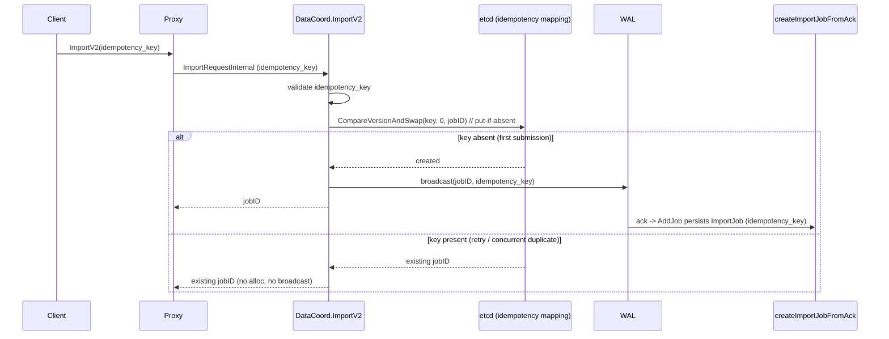

# MEP: Idempotency Key for BulkImport (ImportV2)

- **Created:** 2026-07-09
- **Author(s):** @sagar-arora
- **Status:** Draft
- **Component:** Coordinator (DataCoord), Proxy
- **Related Issues:** #50954
- **Released:** N/A

## Summary

Add an optional, client-supplied `idempotency_key` to the BulkImport
(`ImportV2`) API. When a client submits an import request with a key that
DataCoord has already seen for the same collection, DataCoord returns the
`jobID` from the original submission instead of creating a second import job.
This lets external orchestrators (Airflow, Temporal, etc.) retry import
submissions safely without duplicating data.

## Motivation

BulkImport is used inside distributed data pipelines. A worker stages Parquet
files in object storage and then calls the Milvus BulkImport REST/gRPC API to
ingest them.

Today the API is **not idempotent**. Each `ImportV2` call allocates a fresh
`jobID`. If a client submits a request, Milvus accepts it, and the client
crashes or is preempted before it can persist the returned `jobID`, the
orchestrator retries the task. The retry re-submits the identical set of files,
and because Milvus cannot tell it is a retry, it creates a **second import
job** — duplicating data and bloating segments in the target collection.

There is no reliable way for the client to deduplicate on its own: the failure
window is precisely "request accepted, response not durably received."

Goals:

1. A retried submission (same collection + same `idempotency_key`) returns the
   original `jobID` and creates no new job.
2. **Recover the `jobID` from the key alone** when a submission's response is
   lost in transit: the caller can either re-submit the request or query a
   lookup endpoint with `collectionName + idempotency_key` (see Public
   Interfaces) without resending the payload.
3. Correct behavior across concurrent retries and across the internal
   two-phase job-creation flow (see Design Details).
4. No breaking changes; the key is optional and off by default.

Non-goals:

1. Content-based deduplication (hashing file sets). The key is caller-supplied.
2. Cross-collection or cross-database idempotency. Scope is per-collection.
3. `bulk upsert` semantics (deduplicating rows by primary key) — tracked
   separately.

## Public Interfaces

### Request surface (dedicated `idempotency_key` field)

The key is a dedicated, typed `idempotency_key` field on the import request
messages. The two externally-defined messages already carry it as of
[milvus-proto#633](https://github.com/milvus-io/milvus-proto/pull/633):

- `milvuspb.ImportRequest.idempotency_key = 9` (gRPC v1 client surface).
- `msgpb.ImportMsg.idempotency_key = 10` (the WAL broadcast body).

This design adds the field to the in-repo messages so it threads end-to-end
(regenerated with `make generated-proto-without-cpp`; no external change):

- `internalpb.ImportRequest.idempotency_key` (proxy v2 entry).
- `internalpb.ImportRequestInternal.idempotency_key` (proxy -> DataCoord, and
  ack -> `createImportJobFromAck`).
- `datapb.ImportJob.idempotency_key` (persisted on the job).

Surfaces:

- REST v2: `POST /v2/vectordb/jobs/import/create`, top-level body field
  `idempotencyKey` (`ImportReq.IdempotencyKey`).
- gRPC v2: `internalpb.ImportRequest.idempotency_key`.
- gRPC v1: `milvuspb.ImportRequest.idempotency_key` (copied to v2 by the proxy
  in `convertToV2ImportRequest`).

Validation (`importutilv2.ValidateIdempotencyKey`): max length 256 bytes, no
`/` (it forms one etcd path segment) and no control characters. A malformed key
is rejected as a terminal (non-retriable) import error. An empty key means "no
idempotency" and preserves today's behavior.

### Response surface

Unchanged. `ImportResponse.jobID` is returned as before. On a duplicate
submission the response carries the original `jobID`.

### Lookup by key (recover a lost jobID)

Scope is **per-collection**, so a lookup passes `collectionName` (plus optional
`dbName`) together with the `idempotency_key`; the caller already knows its
target collection at import time.

The existing progress endpoint is extended to accept the key instead of a
`jobID`:

- REST v2: `POST /v2/vectordb/jobs/import/get_progress` (and `.../describe`)
  accepts either `jobId` (as today) or `{ collectionName, idempotencyKey }`.
  Response is the normal progress payload and includes the resolved `jobId`.
- gRPC v2: `internalpb.GetImportProgressRequest` gains `idempotency_key = 3`,
  `collectionID = 4`, and `collection_name = 5`; `GetImportProgressResponse`
  gains `jobID = 11` so a key lookup returns the resolved id. These are in-repo
  proto changes (`pkg/proto/internal.proto`); they do **not** touch the external
  `milvus-proto` repo.

Resolution: the proxy resolves `collection_name -> collectionID` from its meta
cache (as `importTask` already does) and forwards `collectionID +
idempotency_key`; DataCoord resolves `key -> jobID` from the idempotency index
and then serves progress exactly as for a jobID request. If the key is unknown
(never submitted, or the submission failed and the reservation was released),
the lookup returns a not-found error and the caller safely re-submits.

### Persistence

- New etcd key family:
  `datacoord-meta/import-idempotency/{collectionID}/{idempotency_key}` -> `jobID`.
  This is the authoritative reservation store, consulted via atomic
  compare-and-swap on every reserve.
- The key is also stored on the persisted job (`datapb.ImportJob.idempotency_key`).
  On startup the in-memory index is rebuilt from the persisted jobs (not from a
  separate scan); `RemoveJob` uses the stored key to drop the mapping at GC time.

### Config

None required for the core feature. Key length limit is a compile-time
constant; can be promoted to a `paramtable` value if maintainers prefer.

## Design Details

### Background: the two-phase job-creation flow

Import was refactored to a WAL-broadcast model. Job creation is split across
two phases:

1. **RPC phase** — `Server.ImportV2` (`internal/datacoord/services.go`)
   allocates a `jobID`, broadcasts an import message to the WAL, and returns the
   `jobID` immediately. It does **not** persist the job.
2. **Ack phase** — `importV1AckCallback` -> `createImportJobFromAck` ->
   `importMeta.AddJob` (`internal/datacoord/ddl_callbacks_import.go`,
   `internal/datacoord/services.go`) persists the `datapb.ImportJob` to etcd
   after the broadcast is acknowledged.

Consequence: between phase 1 returning a `jobID` and phase 2 persisting the
job, the job is not yet in `importMeta`. A dedup mechanism that only consults
persisted jobs would miss retries that land in this window. Therefore the
idempotency check and reservation must be **synchronous inside `ImportV2`**,
backed by a durable record written before the broadcast.

### Flow

### Components

1. **Validation** (`internal/util/importutilv2/option.go`):
   `ValidateIdempotencyKey` (length bound, no `/` or control characters).

2. **Durable mapping** (metastore):
   - `constant.go`: `ImportIdempotencyPrefix = MetaPrefix + "/import-idempotency"`.
   - `util.go`: `buildImportIdempotencyKey(collectionID, key)`.
   - `DataCoordCatalog` (interface + KV impl): `SaveImportIdempotencyKeyIfAbsent`
     (atomic put-if-absent via `MetaKv.CompareVersionAndSwap(key, 0, value)`;
     on conflict loads and returns the existing `jobID`) and
     `DropImportIdempotencyKey`.

3. **importMeta dedup API** (`internal/datacoord/import_meta.go`): an in-memory
   `idempotencyIndex` (keyed by `collectionID/key`) guarded by the existing
   mutex, rebuilt on restart from the restored jobs' `idempotency_key`, plus
   `CheckAndReserveIdempotencyKey` (checks the index, else the catalog CAS),
   `ReleaseIdempotencyKey`, and `ResolveIdempotencyKey`. `RemoveJob` drops the
   mapping (using the job's stored key) so a GC'd job's key can be reused.

4. **ImportV2 wiring** (`internal/datacoord/services.go`): validate the key
   early; determine the `jobID`; if a key is present, reserve it; on a duplicate
   return the existing `jobID` without allocating or broadcasting; thread the key
   through `broadcastImport` -> `msgpb.ImportMsg` -> ack ->
   `createImportJobFromAck` (persisted on the job); if `broadcastImport` fails,
   release the reservation (best-effort) so a later retry can re-reserve.

5. **Lookup wiring** (key -> jobID):
   - `pkg/proto/internal.proto`: `GetImportProgressRequest` gains
     `idempotency_key`, `collectionID`, `collection_name`;
     `GetImportProgressResponse` gains `jobID`; regenerate.
   - REST (`internal/distributed/proxy/httpserver/`): a dedicated
     `ImportProgressReq` (jobId optional) used by `get_progress`/`describe`, with
     an "exactly one of jobId or collectionName+idempotencyKey" validation; the
     handler returns the resolved `jobId`.
   - Proxy `GetImportProgress` (`internal/proxy`): when `idempotency_key` is set
     and `jobID` is empty, resolve `collection_name -> collectionID` via the meta
     cache and forward it.
   - DataCoord `GetImportProgress` (`internal/datacoord/services.go`): when
     `jobID` is empty and `idempotency_key` is set, resolve via
     `importMeta.ResolveIdempotencyKey(collectionID, key)`; if not found, return
     an import-not-found error. `resp.JobID` is set to the resolved id.

### Concurrency and failure handling

- **Concurrent duplicates** for the same collection+key converge to one
  `jobID` because the reservation is an atomic etcd compare-and-swap; the loser
  reads back the winner's `jobID`.
- **Broadcast failure after reservation**: the mapping is released
  best-effort. If the process crashes between reservation and release, a stale
  mapping may point to a `jobID` whose job was never created; a subsequent
  retry returns that `jobID` and the client's progress poll surfaces the
  terminal/absent state. This edge is documented; a reconciliation sweep is a
  possible follow-up.
- **GC**: when `importChecker.checkGC` removes a completed/failed job, the
  associated mapping is removed, allowing key reuse.

## Compatibility, Deprecation, and Migration Plan

- **Backward compatible.** The key is optional (empty = today's behavior). The
  proto changes are purely additive (new fields with fresh tags); old and new
  binaries interoperate on the wire.
- **No data migration.** New etcd keys are created lazily on first use and
  removed on job GC.
- **Rollback safe.** On downgrade, any leftover
  `datacoord-meta/import-idempotency/*` keys are simply ignored by older
  binaries (they are not read by any other code path). They can be left in
  place or manually cleaned.
- **Cross-cluster (CDC/replication).** The key rides in the WAL `ImportMsg` and
  is preserved on the replicated job for observability; enforcement (the etcd
  reservation) is performed by the primary's `ImportV2` and remains local to
  each cluster's DataCoord.

## Test Plan

- **Unit — importMeta** (`import_meta_test.go`): reserve-new, reserve-duplicate
  returns same `jobID`, release, restore index from job options,
  `RemoveJob` drops the mapping.
- **Unit — catalog** (`kv_catalog_test.go`): put-if-absent creates on first
  call and returns the existing value on conflict.
- **Unit — ImportV2** (`services_test.go`): duplicate key returns the same
  `jobID` with no `AllocN` and no broadcast; mapping released on broadcast
  failure; concurrent same-key submissions converge to one `jobID`.
- **Unit — lookup**: `GetImportProgress` by `collectionName + idempotency_key`
  resolves to the original `jobID` (including in the pre-ack window, where it
  resolves the reserved `jobID` and reports a pending/not-yet-persisted state);
  unknown key returns not-found; REST request validation rejects requests that
  supply neither `jobId` nor a complete `collectionName + idempotencyKey` pair.
- **Verification (repo gate G1/G2)**: audit every site that copies the
  `idempotency_key` field along the path (`convertToV2ImportRequest`,
  `importTask.Execute`, `broadcastImport` -> `ImportMsg`, `importV1AckCallback`
  -> `createImportJobFromAck`) to confirm the key survives to
  `datapb.ImportJob.idempotency_key` and the ack; trace the two real retry modes
  (post-persist index hit, pre-ack etcd hit) and the broadcast-failure release.
- Tests run with `-tags dynamic,test -gcflags="all=-N -l"`.

## Rejected Alternatives

1. **Reserved key in the `options` map** (no proto change). This threads through
   the existing `options` map at every layer with zero proto edits. It was
   rejected in favor of a dedicated typed field because a typed field is clearer
   for SDKs, is self-documenting, and cannot collide with user-defined option
   keys. The dedicated field became viable once
   [milvus-proto#633](https://github.com/milvus-io/milvus-proto/pull/633) added
   `idempotency_key` to the two externally-defined messages
   (`milvuspb.ImportRequest`, `msgpb.ImportMsg`); the remaining fields are in-repo.
2. **In-memory-only dedup** keyed off persisted jobs. Simpler, but leaves the
   pre-ack window open (a retry arriving before phase 2 persists the job would
   create a duplicate). The synchronous etcd reservation closes this window.
3. **Content hash of the file set as the key.** Removes the need for a
   caller-supplied key but changes semantics (a legitimate re-import of the
   same files would be blocked) and is more expensive. Out of scope.
4. **Global (bare-key) scope.** Would allow lookup by the `idempotency_key`
   alone with no collection context, but requires keys to be globally unique and
   risks silent cross-pipeline collisions. Per-collection matches the import
   unit of work, keeps keys naturally partitioned, and only asks the caller to
   pass the `collectionName` it already knows on the lookup. Per-database scope
   was similarly rejected as a middle ground with no clear advantage.

## References

- Issue: https://github.com/milvus-io/milvus/issues/50954
- Proto change (merged): https://github.com/milvus-io/milvus-proto/pull/633
- `internal/datacoord/services.go` (`ImportV2`, `createImportJobFromAck`)
- `internal/datacoord/ddl_callbacks_import.go` (`importV1AckCallback`,
  `broadcastImport`)
- `internal/datacoord/import_meta.go` (`AddJob`, `RemoveJob`)
- `internal/util/importutilv2/option.go` (import option conventions)
- `pkg/kv/kv.go` (`CompareVersionAndSwap`)
