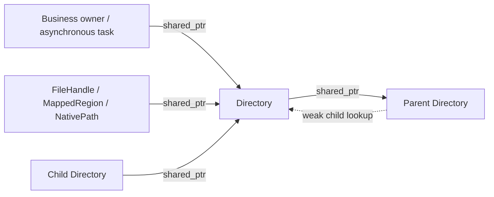

# MEP: Rooted Local File System

- **Created:** 2026-07-12
- **Updated:** 2026-09-11
- **Author(s):** @sparknack
- **Status:** Draft
- **Component:** Local filesystem / Segcore / Index / Caching layer
- **Related Issues:** #51507
- **Related code:** `internal/core/src/local`, `internal/core/src/storage`,
  `internal/core/src/index`, `internal/core/src/segcore`,
  `internal/core/src/exec/expression`

## 1. Summary

Milvus currently accesses node-local files through a singleton, native paths,
and component-specific cleanup code. File and directory operations do not
express which objects must remain alive while indexes, mappings, or background
tasks use their contents.

Introduce a tree of shared directory objects. A child retains its parent;
open files, mappings, and asynchronous or native-library operations retain
the directory they use.
The final directory reference triggers recursive deletion of the directory
and its remaining contents. The root and every child follow the same rule.

A writer retains its directory through the complete I/O operation. A file may
be explicitly unlinked earlier or left for directory cleanup. File closure
alone does not imply unlink. The following example shows the proposed API:

```cpp
auto files = local::FileSystem::Open(node_cache_root);
auto node_cache = files.Root();
auto local_chunk = node_cache->Child("local_chunk");
auto segments = local_chunk->Child("segments");
auto segment = segments->Child("100");

auto output = segment->Open(
    "index.bin", {.mode = local::OpenMode::ReadWrite, .create = true});
// output and any receiving I/O wrapper retain segment.
```

Physical paths and on-disk formats remain unchanged. Persistent
`storageType=local` stays under `milvus::storage`; cache admission and eviction
decisions stay with the existing cache and business owners.

## 2. Motivation and Existing Behavior

### 2.1 Current ownership and cleanup are distributed across components

[`LocalChunkManagerSingleton`](../../../internal/core/src/storage/LocalChunkManagerSingleton.h)
stores a process-wide manager initialized from a root path. Index and file
manager code retrieves it internally, so construction interfaces do not fully
express filesystem dependencies or lifetime requirements.

[`LocalChunkManager::RemoveDir`](../../../internal/core/src/storage/LocalChunkManager.cpp)
accepts a path string and immediately performs recursive deletion. That call
does not establish whether a file, mapping, native consumer, or descendant
directory is still in use. Safety depends on each caller arranging teardown
and coordinating all other users of the path.

Some callers already implement such coordination. For example,
[`DiskFileManagerImpl`](../../../internal/core/src/storage/DiskFileManagerImpl.cpp)
maintains directory-specific write/cleanup state and path generations, while
index destructors and temporary-file owners perform their own cleanup.
These mechanisms have different scopes; a native path string does not carry
the ownership relationship from one component to another. A new asynchronous
user must be integrated into the relevant component's cleanup protocol.

The change makes these relationships explicit in shared directory objects.
Business construction creates and stores each directory, files and tasks
retain it, and children retain their ancestors. Releasing business ownership
allows cleanup after the remaining consumers finish. The local filesystem
layer coordinates directory identity, deletion, and cleanup failure recovery.

### 2.2 Both file and directory cleanup already exist

The existing production code has several cleanup granularities:

| Existing code | Cleanup mechanism |
| --- | --- |
| `LocalChunkManager::Remove` | Single-entry `boost::filesystem::remove` |
| `LocalChunkManager::RemoveDir` | Recursive `boost::filesystem::remove_all` |
| `ExprResCacheManager::RemoveDiskSegmentFile` | Close and remove one segment cache file |
| `TextLobSpillover::~TextLobSpillover` | Close and remove its spillover file |
| `IndexEntryEncryptedLocalWriter` | Unlink its temporary file during cleanup |
| `InvertedIndexTantivy` and `MmapChunkManager` | Remove an owned directory during teardown |

The design preserves these choices. An independent temporary file need not
wait for an entire segment directory to disappear. Conversely, every file in
an index directory need not acquire a separate delete-on-destruction object.

### 2.3 Scope

Goals are explicit dependencies, shared directory identity, lifetime-safe
cleanup, native-library compatibility, and incremental migration by complete
ownership domains.

This work does not introduce cache eviction policy, a filesystem plugin
framework, a registry of every on-disk file, or an OS security sandbox. It
does not promise immediate reclamation while consumers still hold references.

## 3. Public Interfaces

### 3.1 Root context and shared directories

`FileSystem` is the composition-level owner of a root context and cleanup
supervisor. Runtime construction creates it,
injects directory references into consumers, and shuts it down after those
consumers have stopped. Multiple independent physical roots are supported;
there is no default instance or process-global lookup.

```cpp
class Directory;
using DirectoryPtr = std::shared_ptr<Directory>;

class FileSystem final {
 public:
    static FileSystem Open(std::filesystem::path absolute_root);
    DirectoryPtr Root() const;

    FileSystem(const FileSystem&) = delete;
    FileSystem& operator=(const FileSystem&) = delete;
    FileSystem(FileSystem&&) noexcept;
    FileSystem& operator=(FileSystem&&) noexcept;
    ~FileSystem() noexcept;

    // Supervisor operations concern already-retired directories only.
    // Their result types must expose per-attempt failures (section 7).
    CleanupReport RetryFailedCleanup();
    CleanupReport Finish();
};

class Directory final {
 public:
    DirectoryPtr Child(std::string_view name);

    bool Exists(std::string_view name) const;
    uint64_t FileSize(std::string_view name) const;
    FileHandle Open(std::string_view name, const OpenOptions& options);
    io::MappedRegion OpenMappedRegion(
        std::string_view name, const MapOptions& options);

    void RemoveFile(std::string_view name);
    void RenameFile(std::string_view from, std::string_view to);
    NativePath ResolveNativePath(std::string_view name) const;
    NativePath NativeDirectory() const;

    // Streaming enumeration; visitor receives metadata, not new owners.
    void VisitEntries(const EntryVisitor& visitor) const;

    ~Directory() noexcept;

    Directory(const Directory&) = delete;
    Directory& operator=(const Directory&) = delete;
    // Directory objects stay at stable addresses; share DirectoryPtr.
};
```

These declarations summarize responsibilities; reporting and visitor types
will be specified in the implementation PR. Directory constructors are private;
only root/child factories establish registration and the shared control block.
Recursive directory deletion is an internal cleanup primitive, invoked when
directory ownership ends. Callers explicitly remove individual files through
`RemoveFile()`.

### 3.2 String arguments and namespace boundaries

Public calls accept strings. Validation is centralized internally and rejects
empty names, NUL bytes, absolute paths, `.`, `..`, and directory separators.

Operations address an immediate entry. For example:

```cpp
auto segment = segments->Child("100");
auto index = segment->Child("index");
auto output = index->Open("data.bin", options);
```

`segments->Open("100/index/data.bin", options)` is not allowed: holding only
`segments` would not keep the independently owned `100` and `index` children
alive. A future convenience method for multi-component paths must resolve
and retain the relevant directory nodes, rather than concatenate a prefix.

`Child()` creates a missing directory or attaches to an existing ordinary
directory under the startup/migration ownership rules in section 11.
Directory creation goes through `Child()` before opening a file inside it.

### 3.3 One lifetime rule for every directory

Every directory, including the root, owns its disk contents and is deleted
after its last reference is released. This lifetime rule applies uniformly
throughout the tree.
A directory exists while consumers retain it. A live descendant also keeps
its ancestors alive. Different callers may retain references for different
durations; this does not change deletion semantics.

The business owner must retain a directory for as long as its contents should
survive, even between I/O operations. Closing all files does not remove it
while that owner still holds a reference. The composition-level `FileSystem`
retains its root while open; normal `Finish()` releases this reference after
admission stops, allowing root cleanup once all other references disappear.
Each business layer stores its directory reference in its owning object;
ordinary users reuse that reference instead of resolving the directory again
from its parent for each I/O operation (section 4.4).

Opening a root transfers cleanup ownership of that exact directory, including
pre-existing contents accepted during exclusive startup or migration. For
example, own `localStorage.path/cache/<node-id>`, not the shared
`localStorage.path` containing unrelated or persistent data. Its containing
directories are outside this tree and are not deleted. A caller requiring
contents to survive final release must not place those contents in this
ownership domain.

## 4. Design Details: Directory Identity and References

### 4.1 Reference graph



Each child holds a strong parent reference. Parent lookup tables store weak
references and registration metadata, not owning references to live children.
There is no bidirectional strong ownership cycle in the live directory tree.

The lookup table must not itself keep a removable directory alive. Strong
references belong to actual consumers: business objects, children, open
files, mappings, I/O wrappers, and tasks. Registering a child is not a reason
to retain its contents indefinitely.

A cached `DirectoryPtr` is an ownership decision. In particular, putting all
children in an additional strong-reference map would prevent reclamation.
Eviction removes the business map entry; outstanding consumers finish normally.
A parent remains able to provide `Child()` to other callers, so the business
layer must also stop publishing an evicted logical resource. The local layer
does not implement an admission fence before the last reference disappears.

### 4.2 Child lookup and creation

Within a root context, identity is the parent generation plus entry name.
A synchronized child registration contains a generation identifier, a weak
live reference, and lifecycle status. It is reserved through creation and
cleanup, including failures.

Under a short namespace lock, `Child()`:

1. Validates the name.
2. Promotes an existing live weak reference and returns it.
3. Returns a retryable busy result for an in-progress creation.
4. Rejects retiring or failed-cleanup registrations.
5. Reserves an absent name as `Creating`, then performs filesystem work
   outside the namespace lock and publishes one `Live` object.

A failed creation must account for any directory already created. It may
release the reservation only after rollback succeeds or after proving that
no cleanup is owed. It must not recursively remove a pre-existing directory
as compensation for a later allocation or publication failure.

Allocate the registration and first cleanup record before publishing the
directory. Admission failure must occur before handing ownership to callers.
Filesystem I/O, callbacks, and releases that may destroy the last strong
reference run outside namespace locks. Promoted lookup references must be
moved out of locked scopes before they can be dropped; otherwise a destructor
could reenter registration cleanup while the same lock is held.

### 4.3 Expired weak references are not vacant names

There is a race between the last strong decrement and entry into the
destructor: the weak reference may already be expired while the old directory
has not yet been deleted.

`Child()` must treat an expired weak reference with an existing registration
as unavailable. It must not erase it and create a new directory. Only the
old generation's cleanup completion can release that reservation.

A destructor or explicit shared-pointer deleter transitions its preallocated
registration to `Retiring`. It never resurrects a `DirectoryPtr` with
`shared_from_this()` after the final reference has gone away.

On successful cleanup, remove the registration only if its generation still
matches. On failure, retain it. A retry is addressed by registration generation,
not merely by a reusable path string.

### 4.4 Business ownership, acquisition, and reload

Directory creation belongs to construction of the corresponding business
owner. Each layer retains its own directory reference until that owner is
unloaded or evicted. For example, node construction retains `local_chunk`, a
loaded segment retains its segment directory, and an index object retains its
index directory. These are examples of ownership placement, not distinct
directory lifetime policies.

```cpp
// Illustrative business object; not an additional filesystem owner type.
class LoadedSegment {
 public:
    explicit LoadedSegment(local::DirectoryPtr directory)
        : directory_(std::move(directory)) {}

    local::DirectoryPtr LocalDirectory() const { return directory_; }

 private:
    local::DirectoryPtr directory_;
};

// Construction, once for this business instance:
auto loaded = std::make_shared<LoadedSegment>(segments->Child("100"));

// Repeated use obtains the existing instance's directory:
auto directory = loaded->LocalDirectory();
auto file = directory->Open("index.bin", options);
```

The owner keeps the directory alive between operations even when there are
no files open. Consumers first obtain a live business owner or a copy of its
directory reference through the business registry's synchronized acquisition
path. Unload stops publication under that same business synchronization,
then releases the owner outside the registry lock. Existing consumers retain
their references until their work completes. A raw owner pointer or an
unsynchronized reference to its `shared_ptr` member is insufficient.

Business owners hold actual usage references. The low-level retirement
reservation in section 4.3 protects creation/cleanup races independently of
normal business acquisition.

Reload is a separate lifecycle event. Removing a segment from the business
registry does not prove that old files, mappings, or tasks have finished. If
they still retain the directory, `Child("100")` returns that same live node;
it does not create a fresh segment generation or report that the old one is
unloading. The business layer must not treat this successful lookup as
permission to rebuild into the old instance's files.

For reuse of the same physical path, the business lifecycle must retain an
unloading marker and delay the next load until old users have released their
references and old-directory cleanup has succeeded. Observe the registration's
completion without retaining the directory itself, or the wait would prevent
final release. Failed cleanup keeps reload blocked. Concurrent acquisition
either obtains the published old instance before unload begins or follows the
next-load admission path; it must not bypass admission with a direct `Child()`.

This is the default migration rule and preserves existing paths. Where a
consumer already uses distinct physical paths for load instances, preserve
that generation scheme to permit overlap. An in-memory registration generation
alone does not isolate two loads using the same disk path. Introducing new
physical naming schemes is separate migration work, not required by this API.

## 5. Files, Writers, and Mappings

### 5.1 File lifetime

`FileHandle` is move-only and owns a native fd. It retains
the directory containing the entry. Copying a `DirectoryPtr` is allowed;
concurrent mutation of the same `shared_ptr` variable still requires ordinary
C++ synchronization.

```cpp
auto segment = segments->Child("100");
{
    auto file = segment->Open(
        "index.bin", {.mode = OpenMode::ReadWrite, .create = true});

    segment.reset();  // file still retains the directory
    // Positioned I/O uses file.Get() while file is alive.
}  // close fd, then release the directory reference
```

A regular file handle closes its fd but does not unlink the entry. Move
assignment must close the destination fd before releasing its old directory,
then transfer the source fd and directory together. Default/moved-from
handles own neither.

A borrowed `Get()` fd must not outlive the file handle. An adapter that takes
fd ownership must also take its directory reference, either by
moving the complete handle or an explicit ownership bundle. Duplicated fds
need their own retained directory. This rule applies to read handles as well
as write handles for a uniform directory-lifetime contract.

### 5.2 Writers and asynchronous operations

`local::io::FileWriter`, buffering, positioned I/O, alignment, sync, rate
limiting, and completion policies remain separate I/O concerns. A writer
owns a `FileHandle` or `DirectoryPtr` for its complete lifetime.

Tasks retain the directory from submission through actual I/O completion,
including callbacks, cancellation, exceptions, and native-library shutdown.
Retaining it only during submission is insufficient.

```cpp
auto segment = segments->Child("100");
executor.Submit([segment] {
    auto output = segment->Open(
        "index.bin", {.mode = OpenMode::ReadWrite, .create = true});
    BuildIndex(std::move(output));
});
segment.reset();  // the submitted task owns its reference
```

For asynchronous I/O that outlives `BuildIndex`, the completion state retains
the file or directory until the operation is finished.

### 5.3 Individual file deletion

`RemoveFile(name)` removes an immediate non-directory entry and is idempotent
for an already absent entry. It must reject a real directory, even an empty
one. It never falls back to recursive removal. A symlink deletion unlinks the
entry itself without following its target.

File closure, file unlink, and directory cleanup are separate events:

| Event | Result |
| --- | --- |
| Regular handle closes | fd closes; directory reference is released |
| `RemoveFile(name)` | Name is unlinked; existing open fd/mmap may remain usable |
| Scoped temporary-file owner is destroyed | Its close/unlink sequence runs before releasing its directory |
| Last directory reference disappears | Directory and remaining contents are recursively removed |

A temporary-file owner may retain the directory and call `RemoveFile` during
its destructor. Its name must remain exclusive until cleanup completes; it
must not unlink a replacement created by another owner. Shared ownership of
the directory does not serialize mutation or reuse of individual file names.
Callers coordinate `Open`, `RemoveFile`, and `RenameFile` for the same entry.

Unlink does not cancel existing writes and does not imply immediate disk-space
reclamation. Early file unlink and later directory cleanup are compatible;
the recursive cleanup accepts files already removed.

### 5.4 Open options

```cpp
enum class OpenMode { ReadOnly, ReadWrite };

struct OpenOptions {
    OpenMode mode{OpenMode::ReadOnly};
    bool create{false};
    bool truncate{false};
    bool direct_io{false};
};
```

Validate all options before any I/O. Read-only creation or truncation is
rejected. Read-write truncation without creation is valid for an existing
file; `create` controls missing-file creation independently. Unsupported
direct-I/O combinations must fail explicitly, not silently change mode.

Directory creation goes through `Child()`. Implementation must preserve native
failure details through existing error handling rather than convert every
failure to absence.

### 5.5 Mapped regions

`MappedRegion` is a move-only owner of the OS mapping and caller-visible
byte range. It retains the directory until after `munmap`, so a mapped reader
can delay directory cleanup and disk reclamation. Migration must account for
this retention when integrating cache eviction and segment unload.

```cpp
auto region = segment->OpenMappedRegion(
    "field.bin", {.offset = offset, .length = length});
// Demand paging is the default; populate remains false.
auto bytes = region.Data();
```

Explicit file unlink remains possible while mapped. Eager population is an
opt-in for bounded ranges known to be immediately hot. The design does not
make large cold mappings resident or add per-page lifecycle tracking.

## 6. Directory Cleanup

### 6.1 Final-reference cleanup

Dropping one shared directory reference does not request closure. Cleanup
starts only after the final strong reference is released. At that point:

- no open managed file, mapping, task, or registered live child retains it;
- its expired registration prevents reacquisition during cleanup;
- the destructor/deleter invokes the internal cleanup path;
- the parent is held until this directory's cleanup has completed.

Cleanup recursively removes the directory and its remaining contents. This
also applies to the root after its composition-level and consumer references
have been released. There is no public operation that recursively deletes a
live subtree.

Physical cleanup is leaf-first as a consequence of references. A child keeps
its parent alive through its own cleanup; releasing that parent may retire
the next level. A child left alive after the business parent releases its
reference remains fully usable until its own users finish.

### 6.2 Destruction and execution policy

The cleanup engine executes recursive cleanup synchronously at
final release, matching existing destructor-driven cleanup sites. This is
an explicit latency cost, not an assertion that final release is cheap.

The cleanup record is separate from the dying C++ object. It carries the
path, generation, parent reference, and attempt result. A cleanup engine
processes ready records iteratively so a deep ancestor chain
does not require recursive destructor-driven filesystem calls.

If production latency requires offloading, the same records can be handed to
a bounded, injected cleanup executor. The record must retain the parent and
name reservation until completion. Offloading cannot weaken these invariants
or silently drop work when a queue is full. Admission must provision cleanup
record capacity before directory publication; pending memory is accounted
with the directories it represents. Do not enqueue a separate task per file.

Offloading and its concurrency must be justified by the performance
measurements in section 12 before adoption.

### 6.3 State transitions

These states belong to the registration/cleanup record, not to active writers:

```text
Absent -> Creating -> Live -> last reference -> Retiring
             |                                    |
             |                                 Removing
             |                              /      \
             |                         success    failure
             |                            |           |
             |                       unregister      Failed
             |                                        |
             |                                 explicit retry
             |                                        |
             |                                     Removing
             |
             +-- creation failure -> rollback owned changes
                                       /              \
                                  success            failure
                                     |                  |
                                unregister      retain rollback record
```

A cleanly rolled-back creation releases its reservation. A rollback failure
remains unavailable with its cleanup result, just like a failed removal.
Its retry repeats the original rollback obligation, not normal directory
cleanup: only changes owned by that failed creation may be undone. A failed
attempt to attach pre-existing contents does not transfer their ownership.
Successful unregister is terminal for that generation. Missing entries during
recursive cleanup count as already removed; other failures remain visible.

## 7. Failure Recovery and Root Shutdown

All filesystem deletion failures are caught by the destructor/deleter. The
root cleanup supervisor retains a failed cleanup record with its original
error, generation, and parent reference. A root-local tombstone keeps the
name unavailable. Logging alone is not recovery, and an expired weak pointer
must not discard the failure.

`RetryFailedCleanup()` retries already-retired records, never live directories.
Only one attempt can execute for a record at a time. Each attempt has its own
completion result; a later successful retry does not rewrite the failure
observed by an earlier waiter. Partial recursive deletion is retryable while
the path remains reserved and stable.

A failed child keeps its parent alive. Otherwise the parent destructor could
recursively remove the failed child behind the supervisor and invalidate
recovery bookkeeping. Failed-record storage is owned by the composition-level
supervisor, not a strong children map on the live parent.

The root context and supervisor lifetimes must be explicit. `FileSystem`
owns the supervisor; directory objects share the root context, which refers
weakly to the supervisor. The supervisor owns failed records, whose parent
pins may retain directories and the context, but not the supervisor itself.
This avoids a permanent strong cycle on cleanup failure. Cleanup acquires a
temporary supervisor reference through a context guard synchronized with
terminal shutdown. There are no unguarded raw supervisor pointers.

Normal node shutdown:

1. Stop admission and join tasks/native consumers; release files, mappings,
   business directory references, and the root handle.
2. `Finish()` stops context admission, releases any root reference held solely
   by the composition object, drains already-retired work, and reports
   outstanding live users or cleanup failures. It must not forcibly delete
   live directories or wait indefinitely for references held by its own caller.
3. Explicit retries may resolve failures. Persistent failure remains a shutdown
   result, not a successful cleanup.
4. If the process must exit with failures, enter terminal shutdown: reject
   future acquisition/retry, join in-flight cleanup, and suppress new disk
   deletion before releasing failed parent pins. Report the remaining paths,
   then free bookkeeping. No new generation can be created in that closed
   context, and its domain cannot be reopened while old native users survive.

If explicit `Finish()` was skipped, the `FileSystem` destructor first attempts
normal shutdown without throwing, including releasing and cleaning the root.
Terminal fallback is only for failures or a violated shutdown order with live
users; it is not a root-preservation policy. It must not leave those users with
a dangling supervisor pointer. The closed-context guard remains valid until
they finish; unfinished deletion is reported and left for startup recovery.

A crash may leave disk artifacts because reference counting is in-memory.
Before publishing a root on restart, existing Milvus startup/recovery logic
must reconcile leftovers under exclusive ownership. The design does not
promise persistent retry records, crash-atomic recursive deletion, or
cross-process coordination.

## 8. Paths, Namespace Stability, and Native Libraries

### 8.1 Root opening and identity domain

`FileSystem::Open(absolute_root)` requires an absolute path. It creates missing
root components, verifies a directory, and canonicalizes the resulting root
before publishing the owned root node. Publication transfers cleanup ownership
of that exact root as described in section 3.3. Failures are reported; a failed
open does not recursively remove pre-existing root contents.

Runtime composition opens a physical ownership domain once and injects its
references. Separate root contexts must not refer to the same directory,
overlap as ancestor/descendant, or alias through symlinks. A root-local registry
cannot coordinate independently opened roots or other processes.

### 8.2 Stable paths

Registered directories and their ancestors cannot be renamed, replaced, or
unlinked while live or awaiting cleanup. The public API provides only
`RenameFile` within one directory and rejects directory operands; it does not
export directory rename, recursive deletion, or mutable filesystem views.

File operations validate supported symlink targets within their owning scope.
Directory aliases are not supported for registered children. Recursive cleanup
unlinks symlinks themselves instead of traversing their targets. Validation and
native I/O remain separate under the trusted-directory contract. A retained
C++ object does not pin a filesystem inode or prevent external path replacement.

Directory-fd-based protection against untrusted concurrent replacement is
outside the scope of this API's trusted-directory contract.

### 8.3 Native-path ownership

Returning a bare path string encourages asynchronous lifetime escape.
`NativePath` therefore bundles the resolved path with a `DirectoryPtr`.
Borrowing the string is valid only while that owner remains alive.

An adapter passes the path to Knowhere, Tantivy, Arrow, or another library and
retains the directory until all corresponding native objects, background work,
and callbacks finish. A wrapper must destroy its native consumer before
releasing that reference. Extracting and storing only the path is not a valid
ownership transfer.

Holding an ancestor is not enough to keep an independently managed child
alive. A native operation spanning registered children must retain each child
it uses. Alternatively, an opaque native-owned directory tree is represented
by one directory owner, with its internal subdirectories left unregistered.
Do not independently manage children inside that opaque tree while a library
can still access or delete them recursively.

### 8.4 Enumeration

`VisitEntries` streams immediate-entry metadata and preserves entry names.
It neither creates directory owners nor builds a sorted vector of the whole
subtree. Iterator construction and advancement errors must be propagated.

A recursive transfer adapter must retain every registered directory it visits,
including its descendants, or operate entirely within one opaque owner.
Returned metadata is not an ownership handle or a snapshot. Sorting and
materializing a list are caller choices where deterministic ordering is needed.
Recursive cleanup uses the internal deletion primitive, not this listing API.

## 9. Composition and CGo Ownership

The dependency direction remains:

```text
storage transfer ------> local
index / segcore -------> storage + local + cachinglayer
cachinglayer policy ---> local-backed resources
local ----------------X storage / cachinglayer policy
```

The node owns the `FileSystem` context. Construction values carry
`DirectoryPtr` fields for `local_chunk`, `growing_mmap`, `bm25`,
`file_resource`, and `expr_cache`; each consumer receives its required scope.
The context's child index coordinates directory identity. Cache admission
and eviction remain with the business and cache owners.

Across CGo, an opaque directory handle owns one C++ `DirectoryPtr`:

- Create/acquire constructs a wrapper containing a strong reference.
- Retain/clone creates a separately destroyable wrapper sharing that reference.
- Destroy releases exactly that wrapper's reference, not the live subtree.
- A collection, segment, or task accepting a handle borrows the wrapper only
  for the call and copies its `DirectoryPtr` before returning or scheduling work.
- Go must synchronize wrapper destruction against concurrent C calls. A
  finalizer is a fallback; explicit Close defines release timing.
- A root-context wrapper follows the explicit shutdown contract in section 7.

This does not require each receiver to clone a C wrapper: copying the contained
`DirectoryPtr` in C++ is sufficient. No receiver keeps a raw pointer to a
Go-owned wrapper after the call. No C++ exception crosses the C ABI.
Cancellation releases ownership only after the underlying operation has stopped.

## 10. Cost Model

Let D be the number of registered directory generations (including pending
cleanup), H the number of open files/mappings/native wrappers, and F the number
of disk files.

The model uses O(D + H) ownership metadata plus names/paths; it does not retain
O(F) file nodes for unopened files. Path storage costs O(sum of registered
path lengths), not merely O(D) bytes. For example, 100,000 retained paths of
200 bytes alone consume about 20 MB before node, index, allocator, and reference
control-block overhead. Failed records and retained ancestor chains count
toward the same resource accounting.

A per-parent hash index gives expected O(1) child lookup plus name processing.
Only acquisition, registration, and retirement require namespace coordination.
Read/write loops use the already-owned fd and perform no repeated child lookup,
root canonicalization, or ancestor reference increments. One child pins its
parent for its whole lifetime.

Deleting F files across T on-disk directories still requires visiting their
entries; T can exceed D for opaque native-owned subtrees. Existing recursive
deletion already performs that metadata work. Per-file early unlink is
compatible with directory cleanup.
There is no assumed bulk filesystem deletion primitive, no required sort,
and no task per file.

The added costs to measure are shared-reference traffic, directory lookup
contention, path validation, cleanup scheduling, and final-release latency.
A long-lived reader now retains its directory too, potentially delaying space
reclamation. Root-level and business-level strong-reference caches must be
audited for accidental retention. Performance equivalence to existing cleanup
is unverified until measured.

## 11. Compatibility, Deprecation, and Migration Plan

### 11.1 Compatibility

Existing node-local paths, index formats, mmap layouts, and remote keys remain
unchanged. Normal final release now deletes the owned cache root as well as
its children; retaining cache contents across complete context teardown is
not part of this contract. No required user configuration is added. Persistent
local object storage continues using `milvus::storage`; none of its directories
become delete-on-last-reference merely because they use local disk.

This changes internal C++ lifetime contracts: mappings and open files retain
directories, and directory references carry shared cleanup ownership.
CGo projections must migrate with receivers.
Cache accounting must distinguish releasing a business entry from completion
of physical deletion; outstanding references can delay reclaim.

### 11.2 Complete ownership-domain cutover

Migration is incremental across directories, but atomic within each physical
ownership domain, including ancestors that legacy code could recursively delete.

1. Implement the directory tree, reference-carrying file/native/mmap handles,
   generation-safe cleanup records, and supervisor without attaching partially
   migrated production domains to the new ownership model.
2. Inventory every writer, reader, mapping, native path escape, fd transfer,
   directory deletion, and directory rename in the target domain.
3. Quiesce legacy admission and drain legacy operations. Construct one root
   context, attach existing directories under exclusive ownership, inject the
   shared references, and remove legacy ancestor deletion paths.
4. Switch the entire domain to the new API only when all users of those paths
   obey the same ownership contract. After ownership transfer,
   every directory follows final-reference deletion.
   Verify that business owners retain their directories and that same-path
   unload/reload follows section 4.4 before removing legacy lifecycle guards.
5. Migrate QueryNode/segcore and DataNode/index consumers domain by domain.
   Remove singleton access after the last production consumer has migrated.

Rollback also quiesces admission, drains references and pending cleanup, and
closes the new context before legacy code can reuse paths. Outstanding failed
cleanup must be resolved or fenced by terminal shutdown before reuse.

### 11.3 Component changes

| Component | Required change |
| --- | --- |
| Node construction | Open the owned cache root and inject directory references through construction contexts |
| Segment and index owners | Store the directory for the business instance; synchronize acquisition, unload, and reload |
| Local readers, writers, and mappings | Retain the owning directory through resource release and asynchronous completion |
| Disk file managers and directory cleanup callers | Use the shared directory identity and lifetime; retire component-specific directory cleanup after complete cutover |
| Expression cache and temporary-file owners | Retain explicit individual file unlink where independently needed |
| Native-library and CGo adapters | Transfer or copy the directory reference with the native resource |

Reuse existing POSIX I/O, format, and buffering mechanisms while changing their
ownership and construction interfaces. Update the implementation status after
the production call paths and failure modes have been verified.

## 12. Test Plan

The implementation must verify the following behavior before production cutover.

### 12.1 Identity, ownership, and release races

- Concurrent `Child` calls publish one node.
- Every directory, including the root, deletes on final release; references
  held by consumers delay cleanup without changing the deletion rule.
- Root cleanup removes only the acquired ownership domain, leaving its
  containing directory and unrelated siblings untouched.
- A child retains its ancestors after business parent references are dropped.
- An ordinary handle copy does not delete anything on destruction.
- A business owner retains files between I/O operations.
- Repeated operations reuse the directory stored in the business owner;
  releasing temporary files does not trigger cleanup while that owner lives.
- Business acquisition racing with unload either retains the published owner
  before withdrawal or takes the next-load admission path, without a raw-pointer
  lifetime gap or direct `Child()` bypass.
- Reload while an old file/task still retains the same path cannot rebuild
  into the old live node returned by `Child()`; admission waits for cleanup.
- Same-path reload waits without holding the old directory alive, remains
  blocked on failed cleanup, and proceeds after successful completion.
- Existing distinct physical generation paths permit old/new overlap without
  cross-deletion; in-memory generation IDs alone are not treated as isolation.
- Files, mappings, native wrappers, queued tasks, and completion callbacks each
  keep the directory alive through actual resource release.
- Last release races with weak lookup: no resurrection or same-name creation
  occurs before old-generation cleanup completes.
- Weak child indexes and business eviction release nodes without live cycles.
- Final child cleanup precedes parent cleanup, including deep directory chains.

### 12.2 File behavior and namespace boundaries

- Direct string APIs reject invalid names and multi-component bypasses.
- Missing roots and children are created; failed creation does not delete
  pre-existing contents or publish two owners.
- Invalid open options fail before creating or truncating anything.
- File close preserves the entry; explicit unlink and scoped-file cleanup work.
- Single-file deletion/rename rejects real directories.
- A file unlinked before directory cleanup is accepted as already absent.
- File moves, fd transfer, duplicates, and mapping release preserve reference
  order; mapping defaults to demand paging.
- Entry enumeration preserves symlink names, reports advancement failures, and
  does not accidentally acquire/destruct removable child owners.
- Native consumers retain every managed child they access or use one opaque
  subtree owner; ancestor-only retention is not accepted as a substitute.

### 12.3 Cleanup failure and shutdown

- Permission/I/O errors during partial recursive deletion preserve the
  generation, original failure, parent pin, and unavailable name.
- Retry is serialized; old waiters retain their own attempt's result.
- Failure during directory creation/publication has correct rollback ownership.
- Cleanup-record admission failure occurs before publication; destructor paths
  do not require allocating an unbounded new work item.
- Retry success permits same-name reuse; late old-generation completion cannot
  erase the new registration.
- Shutdown with live references reports them without deleting their directories.
- Normal destruction without an explicit `Finish()` also cleans the owned root;
  it does not silently enter a disk-preserving fallback.
- Failed child cleanup cannot trigger parent recursive deletion.
- Terminal shutdown disables further deletion before dropping failed pins;
  late reference release cannot access a destroyed supervisor.
- Startup reconciles crash leftovers before new roots are published.

### 12.4 Production migration and performance

Exercise scalar/vector index build, upload, load, cache eviction, mmap release,
native background completion, cancellation, and node shutdown. Include the
single-file and directory cleanup sites in section 2.2. Audit all legacy
ancestor deletion and raw-path users before enabling a migrated domain.

Compare existing cleanup with the new model using representative file sizes,
file counts, directory depth, storage devices, and concurrent load. Measure
total cleanup throughput, final-release p95/p99 latency, peak metadata memory,
reference retention, and disk reclaim delay. Include at least a large
many-small-file workload and large mmap-backed files. Evaluate a bounded
cleanup executor if synchronous final-release latency is unacceptable.

Neither happy-path tests alone nor ownership-wrapper tests prove migration
safety. Trace or inject the actual failure origin through the real receiver,
and distinguish implemented guarantees from unverified follow-up work.

## 13. Rejected Alternatives

- **Retain path-based cleanup in each component:** every new asynchronous or
  native consumer must be wired into its component's teardown protocol, and
  cross-component directory ownership remains implicit.
- **Replace the singleton with another global manager:** filesystem dependencies
  and shutdown order remain hidden from construction interfaces.
- **Unlink every file when its fd closes:** ordinary reopen/read flows need
  files to survive between operations. Explicit file removal and scoped
  temporary-file owners provide early deletion where needed.

## 14. Review Invariants

1. Every managed physical ownership domain has one injected root context.
2. Child identity is unique within a parent generation; names remain reserved
   through retirement and failed cleanup.
3. Children retain parents; files, mappings, and tasks retain their actual
   owning directory. Parent-only retention cannot substitute for child ownership.
   Each business owner stores its directory; acquisition and unload are
   synchronized, and same-path reload waits for old-generation cleanup.
4. Last strong release triggers cleanup for every directory, including the
   root. Recursive deletion is internal to this lifecycle.
5. File close and unlink remain distinct; early file removal and directory
   cleanup compose without deleting replacements owned by somebody else.
6. Parent cleanup follows child cleanup, including asynchronous and failed work.
7. Root ownership boundaries, stable directory paths, native ownership, and
   startup exclusivity are explicit.
8. No cleanup exception escapes a destructor or C ABI; failures remain
   attributable and recoverable while the context is open.
9. No old-generation task can delete a reused path.
10. Directory trees track ownership, not cache policy or all on-disk files.
11. Migration enables automatic cleanup only after complete domain cutover.
12. Production migration includes verification of real ownership transfers,
    failure handling, and cleanup cost.

## 15. References

- [Node-local filesystem work](https://github.com/milvus-io/milvus/issues/51507)
- [Linux unlink semantics](https://man7.org/linux/man-pages/man2/unlink.2.html)
- [Linux rmdir semantics](https://man7.org/linux/man-pages/man2/rmdir.2.html)
