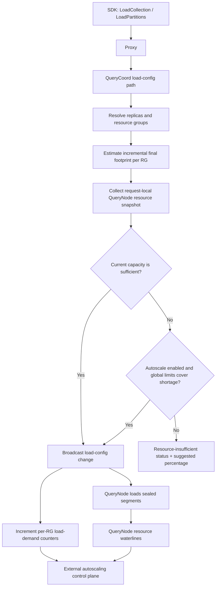
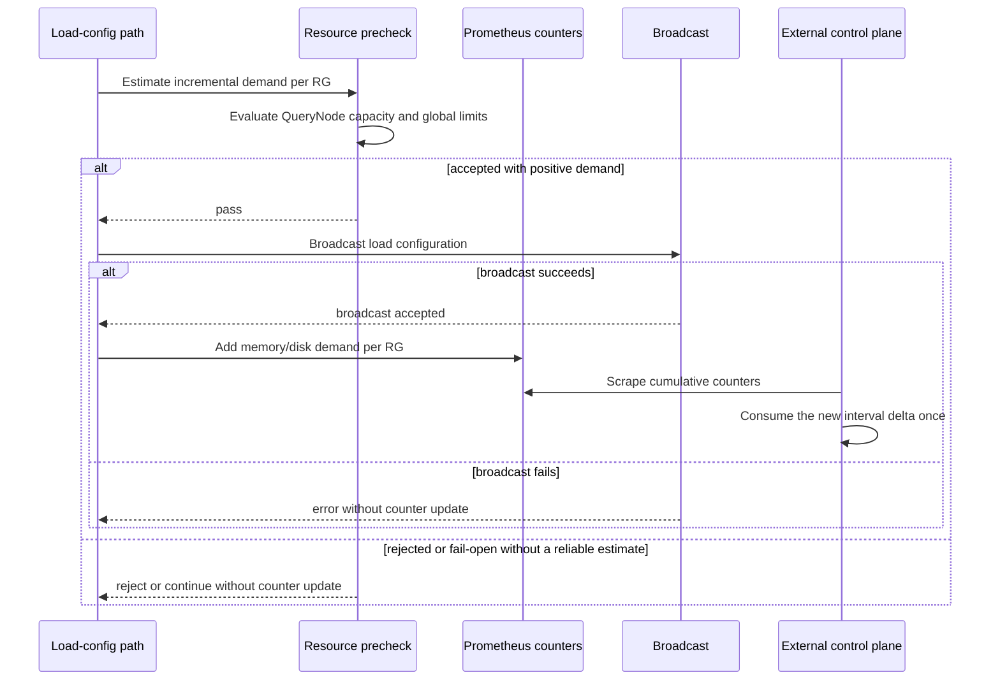

# MEP: Autoscale-Aware Load Resource Admission in QueryCoord

- **Created:** 2026-07-21
- **Author(s):** @sijie-ni-0214
- **Status:** Under Review
- **Component:** QueryCoord / QueryNode / Proxy
- **Related Issue:** [#51217](https://github.com/milvus-io/milvus/issues/51217)
- **Related PR:** [#51218](https://github.com/milvus-io/milvus/pull/51218)
- **Released:** TBD

## Summary

This MEP introduces autoscale-aware load resource admission in QueryCoord. It
adds two related mechanisms:

1. An optional resource precheck for `LoadCollection` and `LoadPartitions`.
   Before QueryCoord broadcasts a load-configuration change, it estimates the
   incremental sealed-segment memory and local-disk footprint required in each
   resource group, compares the estimate with current QueryNode capacity, and
   either admits the request or returns a resource-insufficient status with a
   suggested scale-out percentage.
2. Per-resource-group Prometheus counters for broadcast load demand. After a
   reliable precheck accepts a resource-increasing load configuration and its
   broadcast succeeds, QueryCoord adds the incremental memory and disk
   estimates to monotonic counters. An external control plane consumes each
   sampling-interval delta once and combines it with current QueryNode
   waterlines for scaling decisions.

The load precheck uses the compact recovery payload to discover target segment
identities, then batch-fetches complete `SegmentInfo` metadata with
`GetSegmentInfo` before index lookup and estimation. These lookups supply
raw-field, delete, supported statistics, and Storage V3 load-resource summaries
to the shared estimator.

Milvus does not perform the actual scale-out. QueryCoord works exclusively in
bytes; an external control plane remains responsible for mapping bytes to
instance types, compute units, and node counts, and for applying product limits,
cooldown, approval, and retry policies.

The precheck is disabled by default and fails open on internal or operational
errors. Only a resource shortage produced by a complete evaluation rejects a
load request. QueryNode admission remains the final resource guard.

## Motivation

A collection may grow substantially between its initial deployment and a later
load. Without an early capacity signal, the load configuration can be committed
before QueryNodes discover that memory or local disk is insufficient. The user
then observes slow convergence or repeated segment-load failures without a
direct indication of the required scale-out.

The autoscaling control plane and the Milvus kernel have different information:

- QueryCoord knows the target partitions, replica placement, load fields,
  selected indexes, segment metadata, and QueryNode resource groups.
- QueryNodes know the runtime memory and local-disk capacity and usage.
- The external control plane knows product plans, scaling policy, instance
  shapes, node provisioning, cooldown, and user-configured limits.

This design keeps those responsibilities separate. Milvus provides an admission
decision and byte-based pressure signals; the control plane decides whether and
how to scale.

## Goals

- Estimate the incremental final Worker QueryNode footprint of a load-
  configuration change.
- Evaluate memory and local-disk capacity independently for every affected
  resource group.
- Allow an insufficient request to proceed when the configured global autoscale
  limits can cover the total shortage.
- Return one user-facing scale-out percentage when the request cannot be
  admitted.
- Reuse the shared final-footprint estimator used by QueryNode logical resource
  accounting, while preserving QueryNode's separate loading-peak estimator.
- Preserve existing load behavior by default and avoid rejecting loads because
  an estimation dependency is temporarily unavailable.
- Expose low-cardinality, per-resource-group cumulative load-demand metrics.

## Non-Goals

- Provisioning QueryNodes or calling an autoscaling provider.
- Converting bytes into compute units, instance types, or node counts.
- Scale-from-zero or scale-out suggestions for replica node-count shortages.
- Replacing the existing `AssignReplica` placement feasibility checks.
- Proving that every indivisible segment fits a particular node or modeling the
  candidate-node set of each replica.
- Providing a strict, transactional resource reservation protocol.
- Closing overlap windows among concurrent prechecks and later QueryNode
  waterline updates.
- Reserving global autoscale headroom across concurrent requests or across
  resource groups.
- Estimating resources owned by shard delegators, including sealed BM25 IDF
  statistics.
- Adding a persistent metadata cache, estimator batching layer, or a dedicated
  QueryCoord CGo worker pool.

## Architecture Overview



There is no direct Milvus-to-provider scaling call. The counters report load
demand events; they are neither current resource state nor scaling commands.

## Terminology and Resource Quantities

The design uses five resource quantities, each represented as memory bytes and
disk bytes:

| Quantity | Meaning |
|---|---|
| Required resource | Incremental final footprint introduced by the requested load configuration in one resource group. |
| Available resource | Resource-group capacity currently available for new loads after subtracting QueryNode usage. This value may be negative when the group is already above its admission threshold. |
| Resource-group capacity | The threshold-adjusted usable resource baseline of the current QueryNodes before subtracting usage. It is also the denominator for the scale-out suggestion. |
| Global current capacity | The threshold-free physical memory and disk capacity base of all online QueryNodes. |
| Global autoscale limit | Configured maximum global QueryNode memory and disk capacity base after autoscaling, before admission thresholds are applied. It is an admission upper bound, not a per-resource-group reservation. |

## Load Request Integration

The precheck applies to normal `LoadCollection` and `LoadPartitions` requests.
Refresh requests follow the existing refresh path and do not execute this
precheck.

For a normal load request, QueryCoord performs the following steps under the
existing per-collection broadcast lock:

1. Read collection and partition metadata.
2. Resolve the requested replica count and resource groups.
3. Run `AssignReplica`. For an initial collection load and for
   `LoadPartitions`, the existing node-count feasibility check remains active.
4. Build the expected `AlterLoadConfigRequest` and generate its broadcast
   message.
5. Return immediately if the load configuration is unchanged.
6. Run the resource precheck when
   `queryCoord.autoscale.precheckEnabled` is true.
7. Broadcast the load-configuration message only after the precheck passes or
   fails open.
8. Publish the reliable incremental demand only when the broadcast succeeds.

Because replica placement is checked before resource admission, a resource
group without enough nodes still returns the existing
`ErrResourceGroupNodeNotEnough` error. Memory and disk admission begins only
after the requested replicas are placeable.

## Required Resource Estimation

### Metadata inputs

QueryCoord obtains target sealed-segment identities from `GetRecoveryInfoV2`
for the expected partitions. The compact response is used only to select the
segment set. QueryCoord then calls `GetSegmentInfo` with those IDs; the existing
broker splits the request into batches of at most 1000 segments and returns the
complete `SegmentInfo` payload. Index metadata is obtained separately with
`GetIndexInfo`, batching segment IDs in groups of at most 1024.

The full segment payload supplies the precheck with field binlogs, regular stats
logs, delta logs, JSON key statistics, text statistics, storage version, and the
aggregate `Statistics` message. A failure from recovery, full-segment lookup,
index lookup, or estimation is treated as an internal dependency failure and
causes the precheck to fail open.

For Storage V3, QueryCoord does not read the Loon manifest. The shared estimator
uses the DataCoord-produced `Statistics` summary: `LoadResource.ColumnGroups`
provides raw column-group memory sizes and `DeltaBinlogSize` provides the delete
data size. `ResolveSegmentEstimateLogs` adapts those values into pathless
binlog/deltalog descriptors consumed by the final estimator. JSON key and text
statistics use their corresponding `SegmentInfo` metadata. Resources not
represented by these summaries remain outside the estimate.

The estimator filters the metadata according to the requested load
configuration:

- Only expected partitions are included.
- When `load_fields` is set, only selected fields and Milvus system fields are
  retained.
- Struct child fields retain their shared parent binlog when any child is
  loaded.
- Indexes are filtered by loaded field and the selected field-to-index mapping.

The shared final estimator handles historical metadata after a field is
dropped. An index whose field no longer exists in the current schema is
skipped. For a binlog column group, dropped child fields are ignored; the whole
group is skipped when no live child remains, while a mixed group is classified
using its remaining live fields.

### Incremental load-config calculation

Let:

- `E` be the final footprint of the expected partition, field, and index set.
- `C` be the final footprint already represented by the current load
  configuration.
- `kept(rg)` be replicas that remain in a resource group.
- `incoming(rg)` be newly added replicas in that resource group.

The required incremental resource for a resource group is:

```text
delta_for_kept_replica = max(E - C, 0)       // per resource dimension

required(rg) =
    delta_for_kept_replica * kept(rg)
    + E * incoming(rg)
```

This avoids charging the full collection footprint again when an existing
replica only adds partitions, fields, or indexes. A new replica is charged the
full expected footprint.

## Shared Final-Footprint Estimator

QueryCoord uses `internal/util/segcore/loadresource` to estimate the final
Worker QueryNode footprint. The same package is used by QueryNode logical
resource accounting, while QueryNode's load admission continues to use the
separate loading-peak estimator.

### Indexes

Index estimates are produced by the existing C++ load-index resource logic
through `EstimateLoadIndexResourceFromSerializedInfo`. The estimator constructs
`LoadIndexInfo` from metadata and does not read index files. It returns maximum
and final memory/disk costs; QueryCoord uses the final costs.

Index parameters include mmap, warmup, index-engine version, scalar-index
version, store-path version, row count, and index-specific load parameters.
When an index contains raw field data, the final estimator does not count the
separate field binlog again unless
`queryNode.preferFieldDataWhenIndexHasRawData` is enabled.

### Field data and statistics

When the corresponding metadata is present, the final estimator accounts for:

- loaded raw vector and scalar field data;
- mmap placement between memory and local disk;
- timestamp and variable-length field runtime overhead;
- regular stats logs;
- delta logs, including the legacy delta expansion rule;
- JSON key statistics using `MemorySize` and
  `jsonKeyStatsExpansionFactor`;
- text-match statistics using `MemorySize` and
  `textIndexExpansionFactor`.

The shared final and loading estimators currently use the global vector mmap
option in the raw-vector branch even though they compute the field-level
`mmap.enabled` override. The actual loader honors the field-level override.
Therefore, configurations that override vector mmap per field can classify raw
vector bytes differently between estimation and loading. Aligning both
estimators with the loader is outside this design.

Raw field data and regular stats use `MemorySize` when available and fall back
to `LogSize` for historical metadata that does not carry an in-memory size.
The legacy delta expansion rule compares explicit memory and serialized sizes;
a missing delta `LogSize`, including a Storage V3 resource summary, does not
trigger expansion. JSON key and text statistics do not fall back from
`MemorySize` to serialized `LogSize`. Sealed BM25 statistics are not included
in the Worker segment estimate because they are loaded separately by the shard
delegator's IDF oracle. A future delegator- or channel-level estimator would be
required to cover that resource.

### Tiered storage

The estimator separates evictable and non-evictable resources. When tiered
eviction is disabled, the complete evictable footprint is included. When it is
enabled, the configured memory and disk cache ratios are applied only to the
evictable portion:

```text
final_memory = inevictable_memory
             + tiered_ratio(evictable_memory, memory_cache_ratio)

final_disk = inevictable_disk
           + tiered_ratio(evictable_disk, disk_cache_ratio)
```

No QueryCoord-specific metadata fallback or additional safety multiplier is
applied. Estimation failure is handled by the fail-open policy described below.

## QueryNode Resource Snapshot

QueryCoord builds one request-local snapshot for all nodes needed by the
evaluation:

1. Select non-stopping nodes from every affected resource group.
2. When autoscale upper-bound admission is enabled, also select all online
   QueryNodes for global capacity calculation.
3. Deduplicate the combined set by node ID.
4. Fetch `system_info` metrics with at most 16 concurrent calls and one attempt
   per node.
5. Reuse the same snapshot for resource-group availability, resource-group
   capacity, and global capacity.

If any selected node fails the RPC, returns a non-OK status, returns malformed
metrics, or omits required memory or disk capacity, the entire snapshot is
discarded. QueryCoord does not make an admission decision from partial node
data.

### Memory

For one QueryNode:

```text
memory_capacity_base = physical_memory
memory_usable_capacity =
    memory_capacity_base * queryNodeMemoryHighWaterLevel
memory_available = memory_usable_capacity - current_memory_usage
```

The resource-group capacity uses `memory_usable_capacity`. The global current
capacity uses `memory_capacity_base`, so it has the same threshold-free basis as
the configured global autoscale limit.

The precheck uses `queryNodeMemoryHighWaterLevel`, while the non-tiered Worker
QueryNode load guard uses `overloadedMemoryThresholdPercentage`. Deployments
enabling the precheck are expected to configure the former no higher than the
latter, so the precheck does not admit memory that the final Worker guard will
reject. This ordering is a deployment prerequisite and is not enforced by
QueryCoord.

### Local disk

For one QueryNode:

```text
disk_capacity_base = physical_disk_reported_by_querynode
disk_usable_capacity = disk_capacity_base * maxDiskUsagePercentage
disk_available = max(disk_usable_capacity - current_disk_usage, 0)
```

Resource-group capacity is the sum of `disk_usable_capacity` across its selected
nodes. Global current capacity is the sum of `disk_capacity_base` across all
online QueryNodes; it is not global free space.

`hardware.Disk` is transported by `system_info` as decimal GB and multiplied by
`1e9` to recover the node-reported byte count. QueryCoord does not cap this
value with its own process-local `DiskCapacityLimit`. The current metrics
payload also cannot represent a QueryNode-specific configured disk cap below
physical capacity, so QueryNode admission remains the final guard for that
configuration.

## Load Demand Counters

A successful precheck returns the incremental final footprint for each affected
resource group to the load-config path. QueryCoord publishes that estimate as a
pair of monotonic counters after the load-configuration broadcast succeeds.

A resource-group counter is incremented only when all of the following hold:

- resource precheck is enabled;
- the load configuration introduces positive incremental resource demand;
- every metadata, estimation, and QueryNode snapshot dependency needed by the
  precheck succeeds;
- current capacity or configured autoscale headroom admits the request;
- the load-configuration broadcast succeeds.

An unchanged load configuration returns before the precheck. A rejected
request, a request that fails open because estimation is unavailable, and a
failed broadcast do not update the counters. The counters are never decremented
when segment loading finishes, and scheduler task creation, dispatch, retry,
completion, or removal does not affect them.



The external control plane tracks the last consumed sample for each counter
series and uses non-overlapping deltas. It treats a lower value as a process
restart or series reset. The control plane derives deltas from raw counter
samples; rolling-window PromQL is not the consumption contract. QueryNode
waterlines remain a separate input to the control-plane decision.

## Admission Decision

QueryCoord first evaluates current capacity independently for each resource
group. A group passes only when both dimensions fit:

```text
required_memory <= available_memory
required_disk   <= available_disk
```

For every insufficient group, QueryCoord calculates non-negative memory and
disk shortages. The total shortage is the sum across resource groups.

If `queryCoord.autoscale.enabled` is true, the request may still be admitted
when both total shortage dimensions fit in the remaining configured global
headroom:

```text
remaining_memory_capacity_base =
    max(max_memory_limit - current_global_memory_capacity_base, 0)
remaining_disk_capacity_base =
    max(max_disk_limit - current_global_disk_capacity_base, 0)

memory_headroom =
    remaining_memory_capacity_base * queryNodeMemoryHighWaterLevel
disk_headroom =
    remaining_disk_capacity_base * maxDiskUsagePercentage

total_memory_shortage <= memory_headroom
total_disk_shortage   <= disk_headroom
```

A non-positive limit cannot cover a positive shortage. Applying the admission
thresholds after subtracting the current capacity keeps the shortage and future
headroom on the same usable-capacity basis. These limits do not reserve
resources and do not assign the future capacity to a particular resource group.

### Suggested scale-out percentage

The suggestion is the largest percentage required by any resource dimension
in any affected resource group:

```text
dimension_percentage = ceil(shortage / current_rg_capacity * 100)
suggested_expand_percent = max(all dimension percentages)
```

A positive shortage with zero capacity produces a 100 percent suggestion. The
result is intended as one user-facing scale-out hint, not an exact node-count
or instance-shape recommendation.

## Error and Proxy Propagation

An admission rejection unwraps to `ErrServiceResourceInsufficient` and is
converted into a non-retriable `commonpb.Status`. QueryCoord adds:

```text
ExtraInfo["suggested_expand_percent"] = "<integer percentage>"
```

Proxy preserves the original non-OK status returned by QueryCoord instead of
round-tripping it through `merr.CheckRPCCall`, because the current error
representation cannot retain arbitrary `ExtraInfo`. `LoadCollection` skips
post-load cache work for a non-OK status, and both public Proxy methods return
the status to the client unchanged.

## Failure Handling

The precheck is a best-effort admission aid. The following failures are treated
as internal or operational failures and fail open:

- recovery metadata lookup;
- complete segment metadata lookup;
- index metadata lookup other than an expected index-not-found result;
- shared segment or index estimation;
- QueryNode metrics RPC, status, parsing, or missing-capacity validation;
- global capacity collection.

QueryCoord logs the failure and continues the existing load flow. A complete
evaluation that proves a real shortage does not fail open. A fail-open request
does not increment load-demand counters because it has no reliable estimate.

## Configuration

```yaml
queryCoord:
  autoscale:
    precheckEnabled: false
    enabled: false
    maxMemoryLimit: 0
    maxDiskLimit: 0
```

| Key | Default | Refreshable | Meaning |
|---|---:|---|---|
| `queryCoord.autoscale.precheckEnabled` | `false` | yes | Enable load resource admission and publication of successfully broadcast load-demand counters. |
| `queryCoord.autoscale.enabled` | `false` | yes | Allow the precheck to use global autoscale upper bounds when current capacity is insufficient. Effective only when precheck is enabled. |
| `queryCoord.autoscale.maxMemoryLimit` | `0` GB | yes | Maximum global QueryNode physical memory capacity after autoscaling, before applying the memory admission threshold. Zero cannot cover a positive memory shortage. |
| `queryCoord.autoscale.maxDiskLimit` | `0` GB | yes | Maximum global QueryNode local-disk capacity base after autoscaling, before applying the disk admission threshold. Zero cannot cover a positive disk shortage. |

The implementation converts configured global-limit GB values to bytes using
`1024^3`, the existing Milvus configuration convention. QueryNode
`hardware.Disk` metrics use decimal GB as a transport format and are converted
back to the node-reported byte count with `1e9`; all admission comparisons are
made in bytes. Consequently, `maxDiskLimit` follows the binary configuration
unit rather than the decimal metric transport unit.

## Metrics and Dashboard

QueryCoord exposes two monotonic counters while resource precheck is enabled:

| Metric | Type | Labels | Meaning |
|---|---|---|---|
| `milvus_querycoord_load_demand_memory_bytes` | Counter | `rg` | Cumulative incremental memory bytes from load configurations successfully broadcast after a reliable precheck. |
| `milvus_querycoord_load_demand_disk_bytes` | Counter | `rg` | Cumulative incremental local-disk bytes from load configurations successfully broadcast after a reliable precheck. |

The standard Grafana dashboard displays the raw cumulative memory and disk
counters, grouped by resource group and with cluster totals. The external
control plane maintains its own last-consumed samples, handles counter resets,
and consumes each interval delta once.

## Concurrency and Consistency Boundaries

This design deliberately provides a best-effort demand signal rather than a
strict reservation protocol:

- Load-configuration operations for the same collection use the existing
  collection lock, but different collections can precheck concurrently.
- Two concurrent prechecks can observe the same free capacity before either
  request changes QueryNode usage.
- The global autoscale limit is checked, not reserved. Concurrent requests can
  independently observe the same remaining headroom.
- Prometheus counter additions are thread-safe, so concurrent successfully
  broadcast requests are accumulated without scheduler coordination. The
  counters do not reserve capacity or describe outstanding work.
- The interval between counter publication and QueryNode waterline growth is
  intentionally interpreted by the external control plane. QueryCoord does not
  reconcile or decrement an event after the corresponding load completes.
- Admission compares aggregate memory and disk within each resource group. It
  does not model per-replica candidate-node subsets or the indivisibility of a
  single large segment, so passing the precheck does not guarantee that every
  grow task passes its target QueryNode's per-node guard.

QueryNode's own resource admission and load failure handling remain the final
protection against overcommit.

## Execution and Performance Model

A precheck performs its metadata operations sequentially under the existing
per-collection load-config lock: `GetRecoveryInfoV2`, batched `GetSegmentInfo`,
and batched `GetIndexInfo`. The `GetSegmentInfo` broker reconstructs compressed
binlog paths while returning complete segment metadata. QueryCoord then
estimates segments and indexes sequentially and invokes the shared CGo index
estimator synchronously. Metadata lookup, decompression, or estimation failures
follow the existing fail-open behavior.

Counter publication adds one pair of in-process atomic metric updates for each
affected resource group. Scheduler task registration, checker execution, and
QueryNode task dispatch perform no demand estimation or metric maintenance.
There is no persistent segment/schema/index cache, precheck segment fan-out, or
dedicated QueryCoord CGo runner.

QueryNode has a different execution shape: multiple independent
`LoadSegments` requests can arrive concurrently, so QueryNode executes the
shared CGo work through its existing dynamic pool. QueryCoord does not add a
parallel segment fan-out or a dedicated runner in this design.

QueryNode metrics fan-out is bounded to 16 concurrent calls and uses one
request-local snapshot to avoid duplicate RPCs for resource-group and global
calculations.

## Compatibility and Rollout

- `precheckEnabled` defaults to false, so upgrading does not introduce a new
  load rejection path or publish load-demand events.
- Enabling precheck without enabling autoscale enforces current memory and disk
  capacity only and publishes demand for requests that pass that check.
- Enabling both switches allows admission against configured global upper
  bounds, but does not guarantee that the external control plane will provision
  capacity in time.
- Existing node-count and QueryNode resource guards are unchanged.
- Deployments enabling the precheck must keep
  `queryNodeMemoryHighWaterLevel <= overloadedMemoryThresholdPercentage`.
- Per-field vector mmap overrides and QueryNode-specific configured disk caps
  retain the estimator and metrics limitations described above.
- The precheck batch-fetches complete segment metadata. Operators should
  account for this lookup when validating admission latency under
  representative workloads.

A recommended rollout validates estimator, capacity, counter deltas, and
control-plane reset handling in a representative environment, configures the
global limits, and then enables the precheck and demand consumer together.

## Testing

Focused tests cover:

- per-resource-group admission and global-limit decisions;
- scale-out percentage calculation and zero-capacity handling;
- incremental load-config resource calculation;
- partition, load-field, struct-child, and index filtering;
- index metadata batching;
- QueryNode memory high-water and physical-disk-capacity formulas;
- request-local snapshot reuse and bounded concurrent metric collection;
- preservation of negative memory availability in shortage calculations;
- default-disabled and dependency-failure fail-open behavior;
- separation of accepted demand calculation from monotonic per-resource-group
  counter publication, with no demand returned after resource rejection;
- preservation of real resource-insufficient decisions and `ExtraInfo`;
- shared final and loading estimator semantics, including mmap, tiered ratios,
  JSON key statistics, text statistics, and index estimation;
- enrichment of compact recovery results through `GetSegmentInfo`, including a
  Storage V3 load-resource descriptor, and fail-open handling when that lookup
  fails;
- dropped-field handling for indexes and binlog column groups;
- Proxy propagation of the original resource-insufficient status.

The precheck regression test supplies a compact recovery result followed by a
complete Storage V3 `GetSegmentInfo` result and verifies that the
`Stats.LoadResource` descriptor contributes to admission. This is a
QueryCoord broker-level unit test; it does not run a live DataCoord RPC or read
a Loon manifest.

## Key Source Files

| Area | Files |
|---|---|
| Load precheck and decision | `internal/querycoordv2/autoscale_precheck.go` |
| QueryCoord estimator adapter | `internal/querycoordv2/autoscale/resource.go` |
| Recovery metadata contract | `internal/datacoord/services.go`, `internal/querycoordv2/meta/coordinator_broker.go` |
| Shared segment/index estimators | `internal/util/segcore/loadresource/segment.go`, `internal/util/segcore/loadresource/index.go` |
| C++ index estimate bridge | `internal/core/src/segcore/load_index_c.cpp`, `internal/core/src/segcore/load_index_c.h` |
| Load request integration | `internal/querycoordv2/ddl_callbacks_alter_load_info_load_collection.go`, `internal/querycoordv2/ddl_callbacks_alter_load_info_load_partitions.go`, `internal/querycoordv2/services.go` |
| QueryNode estimator reuse | `internal/querynodev2/segments/segment_loader.go`, `internal/querynodev2/segments/segment.go` |
| Proxy status preservation | `internal/proxy/task.go`, `internal/proxy/impl.go` |
| Configuration and metrics | `pkg/util/paramtable/component_param.go`, `configs/milvus.yaml`, `pkg/metrics/querycoord_metrics.go` |
| Dashboard | `deployments/monitor/grafana/milvus-dashboard.json`, `deployments/monitor/grafana/README.md` |

## Future Work

Possible follow-up designs include:

- node-count-aware scale-from-zero admission and suggestions;
- a strict reservation protocol for concurrent collection loads;
- resource-group-aware reservation of global autoscale headroom;
- delegator- or channel-level resource estimation for sealed BM25 statistics;
- carrying complete segment resource summaries in recovery metadata so the
  precheck can avoid its full `GetSegmentInfo` lookup;
- a projected or field-masked segment metadata API if full `GetSegmentInfo`
  payload construction and binlog-path decompression become a measured
  precheck bottleneck;
- collection-level schema/index caching with explicit invalidation semantics;
- placement-aware admission for per-replica candidate nodes and indivisible
  segments;
- alignment of field-level vector mmap semantics across final estimation,
  loading-peak estimation, and the actual loader;
- a per-QueryNode configured disk-capacity field in the resource metrics;
- a lighter-weight QueryNode resource RPC or a carefully defined capacity
  cache if metric collection becomes a bottleneck.
