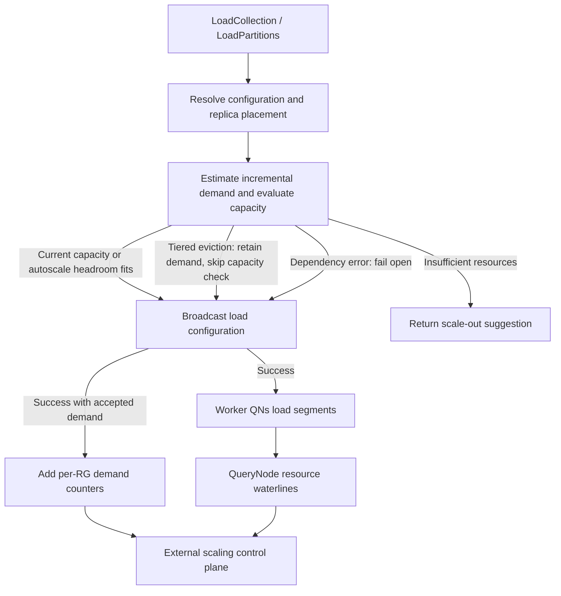

# MEP: Autoscale-Aware Load Resource Admission in QueryCoord

- **Created:** 2026-07-21
- **Updated:** 2026-09-14
- **Author(s):** @sijie-ni-0214
- **Status:** Under Review
- **Component:** QueryCoord / QueryNode / Proxy
- **Related Issue:** [https://github.com/milvus-io/milvus/issues/51217](https://github.com/milvus-io/milvus/issues/51217)
- **Related PR:** [https://github.com/milvus-io/milvus/pull/51218](https://github.com/milvus-io/milvus/pull/51218)

## Summary

QueryCoord evaluates the incremental memory and local-disk demand of
`LoadCollection` and `LoadPartitions` before broadcasting the load
configuration. It admits the request when each resource group has sufficient
capacity, or when the configured global autoscale limits can cover the total
shortage. A resource-insufficient response includes a suggested scale-out
percentage. With tiered eviction enabled, QueryCoord estimates demand without
checking physical availability, because existing caches can be evicted.

After an accepted request's broadcast succeeds, QueryCoord publishes its
incremental demand through per-resource-group Prometheus counters. An external
control plane combines these increments with QueryNode resource waterlines to
make scaling decisions. The feature is optional and disabled by default;
Worker QueryNode admission remains the final node-level resource guard.

## Motivation

Loading a collection introduces demand before QueryNode resource waterlines
reflect it. For example, a collection can be unloaded while new data is
written, then loaded with additional partitions or replicas. A control plane
watching only current memory and disk usage sees little pressure until segment
loading begins. If capacity is insufficient, users encounter repeated load
failures or slow convergence after submitting the request.

QueryCoord knows the requested partitions, fields, indexes, replica placement,
and segment metadata. It can estimate the demand at the point where the load
configuration is accepted. QueryNodes supply physical capacity and usage;
the external control plane owns instance selection, node provisioning,
resource-group placement, cooldown, and product limits.

The design gives the caller an early capacity decision and gives the control
plane a demand signal in bytes. This keeps admission close to the load
configuration while leaving infrastructure policy with the control plane.

## Goals and Non-Goals

The goals are to:

- estimate incremental Worker QN memory and local-disk demand for a load
  configuration;
- evaluate demand independently for each affected resource group;
- support admission within configured global autoscale upper bounds;
- expose a scale-out suggestion and accepted-demand metrics;
- reuse QN resource-estimation formulas and tolerate unavailable estimation
  dependencies.

Node provisioning, scale-from-zero, per-segment placement, and transactional
resource reservations are outside the scope. The estimate covers Worker QN
segment resources; SQN delegator resources, including Bloom and BM25 statistics
loaded through their own paths, require separate accounting.

## Design Details

### Load request flow

The precheck runs under the collection broadcast lock after replica assignment
and load-configuration generation, and before broadcast. Different collections
can execute concurrently.



`LoadCollection` uses the collection's partitions. `LoadPartitions` combines
the requested partitions with those already loaded. Each request supplies the
current and expected configuration to the estimator. Refresh requests use the
refresh path, and an unchanged configuration completes before precheck.

Replica assignment checks node counts for an initial collection load and for
partition loads. Failure returns `ErrResourceGroupNodeNotEnough`; the
resource precheck's byte-based suggestion applies after this placement gate.

When precheck is disabled, the request proceeds to broadcast without a demand
estimate. When enabled, it returns an accepted estimate, a resource-shortage
error, or no estimate after a metadata or estimation failure. Capacity-metrics
failures preserve successfully estimated demand while allowing the load to
proceed. The caller records demand only after the broadcast returns success.

### Resource estimation

QueryCoord uses `GetRecoveryInfoV2` to select target segment IDs, then fetches
complete `SegmentInfo` metadata through `GetSegmentInfo` and indexes through
`GetIndexInfo`. The full-segment broker batches up to 1000 IDs and reconstructs
compressed binlog paths; index requests batch up to 1024 IDs.
`ErrIndexNotFound` is an accepted absence of index metadata.

The shared estimator in `internal/util/segcore/loadresource` computes final
memory and disk footprint from schema, indexes, raw data, regular stats, delta
logs, and JSON/Text statistics. Index estimates use the C++ metadata-based
resource estimator without reading index files. Raw data follows mmap placement
and type-specific overhead rules; Text estimates include index-file bytes and
a separate word-aligned validity bitmap.

Internal Storage V3 segments can supply raw column-group sizes through
`Statistics.load_resource.column_groups` and delete memory through
`Statistics.delta_binlog_size`. A column group records its ID, member fields,
and uncompressed memory total. When raw binlog arrays are present, the estimator
uses the supplied raw/delta arrays. Otherwise, an internal V3 segment with a
manifest and a non-nil load-resource summary uses pathless raw/delta metadata
derived from that summary. This adaptation requires no manifest read and
leaves the load message intact. JSON/Text statistics use their existing
metadata maps.

The final estimator uses a positive binlog `MemorySize`, falling back to
`LogSize` otherwise; the loading estimator uses explicit `MemorySize`.
JSON/Text estimates use `MemorySize` in both paths. A V3 synthetic delta with
positive memory and zero serialized size contributes 1x final memory and 2x
loading memory. An index that supplies raw data can suppress its corresponding
field-binlog entry according to the index and raw-data preference settings.

With tiered eviction enabled, final footprint includes only the configured
cache share of evictable resources:

```text
final_memory = non_evictable_memory + ceil(evictable_memory * memory_cache_ratio)
final_disk   = non_evictable_disk   + ceil(evictable_disk * disk_cache_ratio)
```

With tiered eviction disabled, the complete evictable footprint is included.
Zero cache ratios are valid. QN logical accounting uses the same final
estimator and caches its result before compacting runtime load metadata.
QN `requestResource` uses the separate loading-peak estimator, which also
accounts for transient allocations.

QueryCoord filters each configuration's metadata by partitions and load fields.
All indexes belonging to a loaded field are retained, including multiple JSON
path indexes on the same field. System fields are retained. A physical column
group is kept in full when any member is selected; its size is not split between
children. Delta applies to the whole segment. The estimator receives the full
schema and ignores dropped fields when classifying final resource usage.
Worker QN admission consumes its load-request metadata directly, so shared
formulas do not imply identical input selection.

Metadata and segment/index estimates execute sequentially within a precheck.
QueryCoord invokes CGo synchronously; QN uses its dynamic pool. The estimate is
best-effort: V3 summaries have no completeness or version check and do not
describe every runtime allocation or child-manifest delete source. Raw-vector
placement uses the global mmap option, so per-field vector overrides can
differ from actual loading.

### Incremental demand

Let `E` be the expected configuration's final footprint and `C` the footprint
represented by the current configuration. Both contain memory and disk bytes.
The current estimate uses current partitions within the fetched target segment
set, current fields/indexes, and the stored schema when available. It represents
configured demand rather than measured replica residency.

For each expected resource group:

```text
kept(rg) = min(current_replicas(rg), expected_replicas(rg))
incoming(rg) = max(expected_replicas(rg) - current_replicas(rg), 0)

required(rg) = kept(rg) * max(E - C, 0) + incoming(rg) * E
```

The formula is applied independently to memory and disk. New replicas
contribute the full expected footprint; retained replicas contribute positive
increases. Reductions do not offset positive demand in another dimension or
RG. Zero-demand groups are omitted.

For example, increasing a replica's footprint from 80 MiB to 120 MiB while
adding a second replica in the same RG requires `40 + 120 = 160 MiB`.

### Capacity and admission

With tiered eviction enabled, QueryCoord returns the estimated demand without
collecting QN capacity metrics or checking physical availability and global
autoscale limits. Existing evictable caches make physical usage unsuitable for
this admission decision. Successful broadcasts still add the estimated demand
to the counters; Worker QN enforces its loading-stage resource guard.

The following capacity evaluation applies when tiered eviction is disabled.

QueryCoord collects one request-local set of `system_info` samples for the
non-stopping nodes in affected RGs. Autoscale upper-bound evaluation also
includes all online, non-stopping Worker QNs for global capacity, excluding
QueryNodes embedded in StreamingNodes. Node IDs are
deduplicated; collection uses at most 16 concurrent calls and one attempt per
node, with a shared ten-second timeout for the collection round. Any RPC,
status, parsing, empty eligible-node set, or required-capacity failure
invalidates the capacity evaluation while preserving successfully estimated demand.

Let `hm` be `queryNodeMemoryHighWaterLevel` and `hd` be the parsed
`maxDiskUsagePercentage` ratio:

```text
node_memory_available = physical_memory * hm - memory_usage
node_disk_available   = max(physical_disk * hd - disk_usage, 0)

rg_available = sum(node_available in RG)
rg_usable_capacity = sum(node_physical_capacity in RG) * admission_ratio

shortage(rg) = max(required(rg) - rg_available, 0)
total_shortage = sum(shortage(rg))
```

Memory availability can be negative, preserving existing overcommit in the
shortage calculation. Disk availability is clamped to zero per node. Memory
and disk must both fit, and free capacity in another RG does not offset a
group's shortage.

If a shortage exists and autoscale admission is enabled, the request may use
future usable capacity within global limits:

```text
remaining_capacity = max(global_limit - global_physical_capacity, 0)
usable_headroom.memory = remaining_capacity.memory * hm
usable_headroom.disk   = remaining_capacity.disk * hd

admit if total_shortage.memory <= usable_headroom.memory
     and total_shortage.disk   <= usable_headroom.disk
```

Global physical capacity includes online, non-stopping Worker QNs. The limits express a
cluster-wide upper bound; the control plane supplies the actual nodes and
assigns them to RGs.

For a rejected request, the suggestion uses threshold-adjusted RG capacity:

```text
dimension_percent = ceil(100 * shortage / rg_usable_capacity)
suggested_expand_percent = max(dimension_percent across RGs and dimensions)
```

A positive shortage with zero capacity yields 100 percent. The result is a
capacity hint, not an exact instance shape or node count.

Capacity samples are observations, not reservations. Concurrent collection
loads can see the same availability or headroom, and physical usage can lag
accepted demand. RG aggregate admission also does not guarantee that an
individual segment fits a particular node. Worker QN's loading guard remains
responsible for those node-level decisions.

### Demand metrics

QueryCoord exposes two counters, each with the single application label `rg`:

| Metric | Meaning |
|---|---|
| `milvus_querycoord_load_demand_memory_bytes` | Cumulative accepted incremental memory demand whose load-config broadcast returned success. |
| `milvus_querycoord_load_demand_disk_bytes` | Cumulative accepted incremental local-disk demand whose load-config broadcast returned success. |

A counter increases only when precheck produces positive accepted demand and
the broadcast succeeds. Disabled checks, unchanged configurations, zero demand,
metadata or estimation failures, resource rejections, and failed broadcasts
produce no increment. Fail-open requests caused by unavailable capacity metrics
retain their estimated demand and increment counters after successful broadcast.
Load completion and release do not decrement the counters.

Default and named RG series are initialized at zero during registration and
RG setup; RG deletion removes the corresponding series. The dashboard
displays cumulative demand per RG and cluster totals in MiB.

An external consumer keeps a baseline per source series and consumes
non-overlapping increments, handling restarts, leader changes, and RG
recreation. It combines demand with QN waterlines and its provisioning state
to avoid acting repeatedly on the same demand or counting demand already
reflected in usage. Overlapping rolling-window queries are not a one-time
consumption protocol.

Counters are best-effort telemetry. A process failure between broadcast,
recording, and scraping can lose an observation; the metric is not a durable
event log or a ledger of outstanding loads.

### Failure and response semantics

Metadata lookup, estimation, and QN metrics errors are logged and fail open.
Metadata or estimation failures leave no demand to publish. QN metrics errors,
collection timeouts, and empty eligible-node sets preserve the already computed
demand for publication after a successful broadcast. A completed resource
evaluation that finds insufficient capacity returns
`ErrServiceResourceInsufficient` with:

```text
Retriable = false
ExtraInfo["suggested_expand_percent"] = "<integer percentage>"
```

Proxy forwards the non-OK status and its extra fields intact. Transport
errors and nil responses remain task errors. A resource rejection remains
an application failure even when the transport returns no Go error.
`LoadCollection` post-execution cache work is skipped for a non-OK status.

## Configuration and Compatibility

```yaml
queryCoord:
  autoscale:
    precheckEnabled: false
    enabled: false
    maxMemoryLimit: 0
    maxDiskLimit: 0
```

All four settings are refreshable:

| Key under `queryCoord.autoscale` | Meaning |
|---|---|
| `precheckEnabled` | Enable resource precheck and accepted-demand recording. |
| `enabled` | Allow admission using global autoscale upper bounds. |
| `maxMemoryLimit` | Maximum global QN physical memory capacity after scaling, in GiB. |
| `maxDiskLimit` | Maximum global QN physical disk capacity after scaling, in GiB. |

With precheck disabled, normal load behavior applies. With precheck enabled
and tiered eviction disabled, admission uses current capacity unless autoscale
upper-bound admission is enabled. A zero global limit
cannot cover a positive shortage. Enabling both switches permits admission
within configured limits when tiered eviction is disabled, but does not itself
provision resources. With tiered eviction enabled, precheck estimates demand
only, regardless of the autoscale switch and capacity limits.

Configured capacity limits use GiB: `1 GiB = 1024^3 bytes`. QN `GetMetrics`
disk capacity and usage use decimal GB (`1 GB = 1e9 bytes`) and are converted
back to bytes before comparison. Memory metrics, load demand counters, and all
admission calculations use bytes.

Deployments should keep `queryNodeMemoryHighWaterLevel` no higher than the
non-tiered Worker guard's `overloadedMemoryThresholdPercentage`. QueryCoord
does not enforce this relationship. A QN-local disk cap below reported physical
capacity is also enforced by the Worker guard.

The public load request shape is unchanged. The scale-out suggestion uses
`commonpb.Status.ExtraInfo`; clients may consume it alongside the error reason.
Estimate accuracy depends on supplied metadata and the estimator's local QN
configuration, including mmap and tiered settings.

## Test Plan

Unit tests cover the following behavior:

- incremental demand for initial loads, partition/field/index changes,
  retained replicas, and incoming replicas;
- complete segment metadata lookup, V3 column-group summaries, and
  group-preserving field selection;
- current-capacity and global-limit decisions, negative memory availability,
  percentage rounding, and zero-capacity handling;
- shared final/loading estimates, mmap and tiered settings, JSON/Text
  statistics, and Text validity bitmap memory;
- bounded metrics collection, snapshot reuse, dependency failures, and
  preservation of resource-insufficient statuses;
- counter initialization, RG lifecycle, additive recording, and separation
  of accepted-demand evaluation from publication;
- Proxy status propagation and QN logical-estimate caching.

Integration validation should cover the complete load request through
DataCoord metadata lookup, QueryCoord broadcast, and Worker QN loading,
including V3 loads after metadata recovery. It should verify that only
successfully broadcast, evaluated demand reaches the counters and that
metadata or estimation failures permit loading without a metric increment,
while capacity-metrics failures preserve demand for successful broadcasts. Control-plane
validation should exercise counter resets and demand already reflected in
waterlines. Broker-mock tests alone do not establish these end-to-end results.
