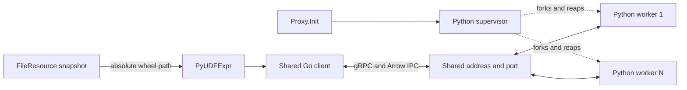

# MEP: PyUDF FunctionChain Worker Pool

- **Created:** 2026-07-22
- **Updated:** 2026-09-17
- **Status:** Worker pool and Proxy integration implemented
- **Component:** FunctionChain / PyUDF

This document describes the current worker-pool design, its execution contract,
and its deployment limits. The implementation links below are the references
for configuration, protocol generation, and tests.

## 1. Scope and decisions

PyUDF executes user Python code in worker processes for Proxy L2 reranking.
`function.pyUDF.enabled` is false by default. A Milvus process hosting Proxy
owns one Python supervisor, which manages workers sharing one configured
address. DataNode and other roles do not start or use this service in v1.

The design has the following boundaries:

- Go calls Python through synchronous gRPC with Arrow IPC. There is no embedded
  CPython interpreter, custom cgo/C++ execution bridge, libpython dependency,
  or embedded fallback in this path.
- Only `Proxy.Init` starts the supervisor. Expression construction and request
  execution never start processes or wait for pool readiness.
- Go has one shared connection pool. There is no application request queue,
  admission semaphore, worker discovery, exclusive connection lease, or
  application-level retry.
- Python uses the gRPC executor and admission limit directly. Each worker
  caches multiple UDF instances and invokes them in its handler threads.
- UDF authors own thread safety. Multiple requests can use the same instance,
  module globals, model, and dependencies concurrently.
- RPC timeout fails the call but does not forcibly terminate running user code.
  Shutdown terminates worker processes without waiting for user callbacks.
- In-process wheel replacement, supervisor automatic recovery, hostile-code
  isolation, remote artifact provisioning, and shared-memory transport are
  outside v1.

## 2. Architecture and ownership



| Component | Responsibility |
|---|---|
| Proxy lifecycle | Start the supervisor during initialization; call process and connection cleanup during shutdown |
| Go supervisor wrapper | Own the command, one process-creation attempt, one `Wait`, and explicit shutdown notification |
| Go client | Share fixed connections, encode inputs, invoke one Execute RPC, decode outputs, and translate errors |
| Python supervisor | Fork, reap, and replace exited workers; terminate workers on shutdown; never load or execute UDFs |
| Python worker | Own the gRPC server, loader, cached instances, and direct UDF invocation |
| FileResource manager | Download files and own their directories and lifetime |
| PyUDF resource snapshot | Resolve a resource name to its latest synchronized local wheel path |

The Python execution objects compose as:

```text
WorkerServer -> PyUDFWorkerService -> PyUDFLoader -> PyUDFInstance
```

IPC conversion, parameter conversion, error encoding, and startup argument
parsing remain stateless helpers.

## 3. Startup and process management

### Go startup

The public lifecycle entry points are:

```go
func StartSupervisor(ctx context.Context) error
func StopSupervisor(ctx context.Context) error
```

`Proxy.Init` calls `StartSupervisor` after its other initialization and before
Proxy becomes Healthy. The enabled check is outside the process-wide
`sync.Once`, so disabled calls do not consume the startup attempt. Concurrent
enabled calls share one process-creation attempt and its result.

Go validates effective configuration and invokes the interpreter on its `PATH`
with argument arrays, without a shell:

```text
python3 -I -m milvus_pyudf_runtime.supervisor \
  --address 127.0.0.1:19090 \
  --worker-count 1 \
  --grpc-concurrency 10 \
  --max-concurrent-rpcs 100 \
  --max-message-bytes 67108864 \
  --shutdown-timeout-ms 30000
```

Startup returns after `cmd.Start`. Success means that the process was created;
it does not mean that Python imports succeeded, workers are listening, resources
are synchronized, or a user model is loaded. There is no startup readiness
queue, Health polling, READY aggregation, or startup timeout setting.

Configuration and process-creation failures are cached by `sync.Once`. Later
Python failure does not change a successful startup result. The startup context
is checked before creation; cancellation after creation does not stop Python.

| Deployment | Pool ownership |
|---|---|
| Standalone with Proxy | One supervisor and pool in the Milvus process |
| Separate cluster Proxy | One supervisor and pool per Proxy process |
| Co-located roles including Proxy | Only Proxy starts and uses the pool |
| No Proxy, or PyUDF disabled | No Python processes are started |

### Python supervisor

The supervisor stays single-threaded and does not import gRPC, PyArrow, or user
models before `fork`. Runtime package exports are lazy so importing the
supervisor does not initialize worker dependencies.

During fork, the supervisor blocks TERM/INT. Each child restores default signal
handling and the previous signal mask, then imports and starts its worker.
Each worker creates its own gRPC server after fork; the supervisor does not
create a server or pass a listening socket to workers.

The maintenance loop checks process exit using `waitpid`, not RPC health.
An exited worker is reaped before its slot is replaced. Repeated failures use
exponential backoff from 100 ms to 3.2 s; a worker that survives 10 s resets
its slot's failure counter. Fork failures also retry with backoff. The loop
normally runs every 50 ms.

`workerCount` counts live worker processes, including those starting or stuck.
A live worker that cannot serve requests is not replaced merely because it is
unready. An ordinary UDF exception does not restart its worker. There is one
additional supervisor process beyond the configured worker count.

### Shared endpoint and platform boundary

Workers bind the same concrete IPv4 address and port using `SO_REUSEPORT`.
There are no per-worker endpoints, port reservations, file locks, Unix sockets,
or pool-identity handshakes.

Deployment must assign each pool an exclusive address within its network
namespace. Separate Pods can each use `127.0.0.1:19090`; separate Milvus processes
sharing a namespace need different ports. Because `SO_REUSEPORT` permits
multiple listeners, a second pool can bind successfully to an address already
used by another pool. `sync.Once` only prevents duplicate startup inside one
Go process.

Linux and macOS are the target platforms. macOS fork safety and port-reuse
behavior require native validation; Linux test results do not establish macOS
traffic distribution or throughput. The supervisor must remain free of
background threads and worker-library initialization before every fork.

## 4. Go client and connection reuse

The Go adapter accepts FunctionChain objects and Arrow columns:

```go
func NewClient(config Config) (*Client, error)
func (c *Client) Execute(ctx context.Context, request ExecuteRequest) ([]*arrow.Chunked, error)
func CloseClients() error

type ExecuteRequest struct {
    ResourceName string
    UDFPath      string
    Stage        string
    Params       *schemapb.FunctionParamObject
    Inputs       []*arrow.Chunked
}
```

This adapter is not the generated protobuf request. `PyUDFExpr` resolves the
resource's absolute `LocalPath` for each execution and passes it as `UDFPath`.
`ResourceName` is descriptive metadata, not a Python-side file locator.

Expression construction validates static parameters without reading runtime
configuration or creating a client. `IsRunnable` only inspects supported stages,
so QueryNode can reject L0/L1 use independently of the enabled flag. Execute
checks stage first and enabled second, then validates inputs and resolves the
resource before obtaining the shared client. Disabled L2 execution returns
ParameterInvalid (1100); runtime configuration and transport failures remain
system errors. The client reference used during Execute is local to that call,
so concurrent calls do not mutate the expression while initializing connections.

`NewClient` returns one process-shared client holding `connectionPoolSize`
independent, long-lived `grpc.ClientConn` objects. Calls with different address,
connection count, timeout, or message limit are rejected while that client
exists. Changing execution configuration requires restarting the service.

After encoding, Execute selects one connection using an atomic round-robin
counter. All query batches in that RPC use the selected connection. Connections
are not exclusively borrowed and can carry multiple concurrent RPCs. Failed
partial client creation closes connections already created and publishes no
partial pool.

All connections target the same endpoint. `SO_REUSEPORT` distributes TCP
connections; requests sharing an HTTP/2 connection generally reach the same
worker. Multiple connections avoid relying on one connection for the entire
Proxy, but do not guarantee one connection per worker, even load, or linear
scaling. Go has no worker address list, load reports, or cache affinity.

Expressions and individual requests do not close shared connections. Execute
borrows input columns and parameters for its duration. Encoding and decoding
are synchronous, with no background encoder retaining unowned input references.
Successful outputs transfer to the caller; partial or failed outputs are
released by the client. Go and Python do not share Arrow pointers.

## 5. Concurrency and UDF execution

Each worker uses a synchronous gRPC server:

```python
server = grpc.server(
    futures.ThreadPoolExecutor(max_workers=grpc_concurrency),
    maximum_concurrent_rpcs=max_concurrent_rpcs,
    options=(("grpc.so_reuseport", 1),),
)
```

`grpcConcurrency` controls handler threads; `maxConcurrentRPCs` controls admitted
in-flight RPCs, including work waiting in the executor's queue. With defaults,
up to 10 handlers execute per worker and up to 100 RPCs are admitted. Excess
calls receive gRPC `RESOURCE_EXHAUSTED`. Queue wait consumes the original RPC
deadline, and an expired request is rejected when its handler observes it.

There is no second executor, custom queue, FIFO contract, work stealing,
application admission counter, or per-request UDF instance pool. The Go
connection count is not a concurrency limit. The worker count, connection
count, handler thread count, and admission limit are independent settings.

A handler decodes the request, gets a cached instance, and calls
`transform_query(params, columns)` directly once per query batch. Query batches
within a request run sequentially; requests can interleave on the same UDF
instance. The worker passes `stage` unchanged to the factory context, including
empty or whitespace values; the current Go expression permits L2 reranking.

UDF authors must make instance fields, module globals, native libraries, and
model dependencies safe for concurrent use. Runtime does not serialize user
calls or repair state after a user exception. Output arrays must not be mutated
concurrently after return. Threads can overlap I/O and native work that releases
the GIL; Python CPU-bound work primarily scales through worker processes.

## 6. Independent protocol and Arrow IPC

The standalone [pyudf.proto](../../../pkg/proto/pyudf.proto) defines the
`milvus.proto.pyudf.PyUDFWorker` service with one unary Execute method.
Standard `grpc.health.v1.Health/Check` is provided separately by the gRPC health
package; it is not copied into this protocol.

The runtime protocol has no imports of Milvus API or internal protobuf files.
It owns `FunctionParamObject`, `FunctionParamArray`, and `FunctionParamValue`.
The Go client recursively translates API parameters to those runtime types.
Python no longer ships or registers `schema.proto` or `common.proto`, avoiding
collisions with SDK descriptors imported by user UDFs.

| ExecuteRequest field | Meaning |
|---|---|
| `resource_name` | Nonblank descriptive resource name |
| `udf_path` | Absolute local `.whl` path supplied by Go |
| `stage` | Factory context value and part of the instance cache key |
| `params` | Recursive bool, int64, double, string, bytes, array, and object values; absent means empty object |
| `inputs` | One complete Arrow IPC stream containing unique input columns |
| `input_column_indices` | UDF argument position to zero-based IPC column index; empty means stored column order |

### Shared column references

FunctionChain preserves repeated argument positions. Its DataFrame resolves
repeated references to a field to the same `*arrow.Chunked` object. The Go client
deduplicates these objects by identity, not by comparing values:

```text
UDF arguments:          [A, B, A, C, B]
IPC columns:            [A, B, C]
input_column_indices:   [0, 1, 0, 2, 1]
```

Only unique columns are encoded. For each query batch, Python obtains the
unique arrays once and constructs the argument sequence from references.
Repeated positions share the same decoded array; independent columns with equal
values remain independent. Out-of-range references fail as an internal protocol
error before the UDF is loaded or executed.

The reference list grows with the argument count, but repeated column data
is not serialized again. This does not establish a global memory bound for
large unique inputs, outputs, concurrent requests, or user models.

### Batch and output contract

Each input RecordBatch represents one query, including zero-row queries.
All batches share a schema. Go names the unique columns `c0`, `c1`, and so on;
positions and references determine arguments, not the generated field names.
Input columns must have matching chunk counts and equal row counts within each
query. At least one input column and one query chunk are required by the Go
encoder. There is no fixed column-count or query-count limit.

Python calls the UDF for zero-row batches as well. `params` is recursively
converted to immutable mappings and tuples. Unset parameter values and logical
nesting beyond 64 are invalid. Protobuf's own recursion limit may reject deeply
nested requests before the handler, so the logical limit is not a guarantee
that every possible 64-level protobuf structure can be decoded.

The response is a oneof: either a complete output IPC stream or an
`ExecuteError` containing code and message. No partial outputs are returned on
failure. Output columns support bool, signed integers, float32/64, and string.
Columns within an output batch must have equal lengths, and all output batches
must have the same schema. Zero output columns are encoded as a zero-row batch.

The generic client/worker layer does not require output row counts to equal
input row counts. The L2 expression checks per-query row counts and supported
types; MapOp checks destination column count and converts numeric `$score`
outputs to Float32. Intermediate scores may contain null, NaN, and infinity.
Sort places numeric values (including infinities) before NaNs and nulls, in that
order, for both ascending and descending sorts. Equal values use the configured
ascending tie-break, or retain their input order when no tie-break is configured.
When exporting to `SearchResultData.Scores`, the final `$score` must be Float32,
non-null, and finite. Other output columns may retain NaN and infinity.
The generic client can decode different output batch layouts, while the L2
caller enforces its own correspondence requirements.

Go uses Arrow `ipc.Reader`; Python uses `open_stream` and
`batch.validate(full=True)`. The readers determine accepted IPC syntax,
including supported compression. There is no additional manual FlatBuffers
scanner, required explicit EOS marker, or blanket rejection of trailing data.
The senders do not enable IPC compression by default.

### Limits and compatibility

Both ends configure gRPC send and receive limits from `maxMessageBytes` for the
complete protobuf message, including metadata. Messages are not split into
application fragments. Input deduplication replaces repeated data with
references; there is no local IPC encoding byte budget. Unique large inputs
or Python outputs may still be fully encoded before gRPC rejects them.

Error messages are limited to 8 KiB of valid UTF-8. Go validates structured
errors, the response oneof, output IPC, and its context before returning results.
The worker protocol has no job registry, request replay identifier, capability
query, or application version field. Removed protobuf fields remain reserved.

Deploy the Go client and Python wheel together. An older worker does not
understand `input_column_indices` and cannot safely serve requests using shared
column references. Empty indices retain stored-order behavior for callers that
do not use references. Future changes must preserve protobuf field numbers and
account for semantic compatibility, not only successful protobuf decoding.

## 7. UDF loading, caching, and wheel updates

The loader opens a local wheel directly through Python's import machinery.
A wheel must provide exactly one `milvus.pyudf` entry point in `module:factory`
form and one top-level Python import root matching that module. It is added to
`sys.path` for lazy imports and package resource access; the runtime does not
run pip to install user wheel dependencies during Execute.

Supported UDF wheels contain Python source (`.py`) in regular packages with
`__init__.py`. Namespace packages and bytecode-only (`.pyc`) wheels are not
supported. Native extensions (`.so`/`.pyd`) cannot be imported directly from a
wheel; dependencies containing native extensions must be installed in the
worker's Python environment before startup.

ZIP64 wheels are unsupported by the bundled Python 3.12 runtime's `zipimport`
and fail during import. Package UDF wheels using standard ZIP format.

The factory receives `PyUDFContext` with resource name, canonical wheel path,
stage, and logger. Instances are cached per canonical full wheel path and stage
inside each worker. Resource name is not the cache key, and caches are not shared
between workers. Required third-party dependencies must already be compatible
with the worker's Python environment.

A short registry lock finds or creates an instance entry. An entry lock ensures
that only one successful instance is created for that key; failed creation does
not publish an instance. Different keys can initialize concurrently. Package
claims and module import locks are process-wide, while Python owns `sys.modules`.
Lock acquisition checks request activity at 50 ms intervals. Factories run
outside module import locks, and all loading locks are released before UDF
execution. Nested callbacks from user code into the loader are unsupported.

A top-level package can belong to only one wheel path in a worker process.
Existing modules from a different location are rejected rather than overwritten.
Instances and module state remain cached for the worker lifetime; there is no
in-process hot replacement, cache eviction, or per-request close callback.
Updating a loaded package requires restarting workers, normally by restarting
Milvus. Clearing one cache map is not a supported update procedure.

Wheel validation checks the ZIP directory and required entry-point metadata.
`ZipFile.read()` checks CRCs for metadata it reads; `zipimport` does not verify
module/resource CRCs. The runtime does not scan an entire potentially large
model wheel or promise artifact integrity verification.

## 8. FileResource boundary

FileResource owns downloads, directory layout, and file lifetime. Python does
not read FileResource configuration, join node/resource identifiers into paths,
or download, move, or delete files.

```text
resource_name -> synchronized ResolvedFileResource.LocalPath
              -> absolute ExecuteRequest.udf_path
              -> Python wheel loader
```

The Go expression resolves the latest synchronized snapshot on each execution.
The wheel must be accessible to the worker at exactly the supplied path, locally
or through matching mounts. A separate Proxy defaults to FileResource `close`
mode, so PyUDF deployments must explicitly configure
`common.fileResource.mode.proxy: sync`. Standalone resolves the effective mode
across co-located roles. PyUDF process startup does not validate or automatically
change FileResource mode; resource availability is checked during execution.

A full path does not pin a file. FileResource can remove obsolete directories
and provides no cross-process lease for cached or active Python UDFs. Do not
remove or replace a wheel while it is in use: stop new calls and allow actual
execution to finish, including work whose client already timed out. Restart
workers when changing a loaded package to discard module and instance caches.

A future remote service without matching mounts needs an artifact-distribution
or locator design. Moving the worker to another host alone does not make
FileResource paths accessible there.

## 9. Timeout, retry, and health

`rpcTimeout` begins at Go Execute entry and covers parameter conversion, IPC
encoding, transport, execution, and decoding. An earlier caller deadline wins.
Go checks cancellation between conversion batches and before publishing results;
synchronous Arrow work is not forcibly interrupted in the middle of a batch.

| Request state | Behavior |
|---|---|
| Waiting in the gRPC executor | Original deadline continues to run; inactive requests do not start UDF work when checked |
| Waiting for loader locks | Periodically check request activity |
| Executing user code | Let the call return naturally; cancellation does not kill its thread or process |
| Between query calls or output encoding batches | Stop subsequent work after observing cancellation |
| Returning a result | Discard late output rather than report success after cancellation |

The handler retains input, output, and instance references while it uses them.
A client timeout is not proof that execution stopped or that side effects did
not occur. Hung calls may occupy handler threads indefinitely. There is no
per-request watchdog, forced cancellation, or automatic worker recycling for a
live but stuck handler.

The Go client disables service-config retries, configured retry policies,
hedging through those policies, and wait-for-ready. It selects one connection
and does not replay a failed Execute on another. grpc-go can still transparently
retry calls that were not processed; the contract is no automatic replay of
potentially executed UDF calls, not exactly one network attempt. SDK or user
resubmission of Search is outside this guarantee, and there is no cross-request
deduplication of UDF side effects.

Every worker exposes standard Health/Check for the empty service name and
`milvus.proto.pyudf.PyUDFWorker`. Unknown service names return NOT_FOUND; Watch
is not implemented. Health reports only the reached worker's local server state,
uses the same executor/admission limit as Execute, and does not identify the
pool or aggregate worker readiness. Neither Go nor the supervisor polls it.

## 10. Errors and propagation

The worker selects a category at the failing operation and returns it in
`ExecuteError`. Protocol enum numbers are not Milvus error numbers. The Go
client maps categories using [client_errors.go](../../../internal/util/function/pyudf/client_errors.go):

| Worker category | Typical origin | Go error / code |
|---|---|---|
| `INVALID_ARGUMENT` | Unset UDF parameter values or excessive parameter nesting detected by the worker | `ErrParameterInvalid` / 1100 (InputError, non-retriable) |
| `UDF_FAILED` | User import, factory or invocation exception; wheel or output contract violation | `ErrFunctionFailed` / 2400 |
| `RESOURCE_NOT_FOUND` | Runtime directly reads a missing wheel | `ErrIoKeyNotFound` / 1000 |
| `RESOURCE_PERMISSION_DENIED` | Runtime wheel read denied | `ErrIoPermissionDenied` / 1005 |
| `RESOURCE_IO_FAILED` | Other direct resource I/O failure | `ErrIoFailed` / 1001 |
| `OUT_OF_MEMORY` | Caught Python `MemoryError` | `ErrServiceMemoryLimitExceeded` / 3 |
| `UNSUPPORTED` | Reserved unsupported-capability category | `ErrServiceUnimplemented` / 10 |
| `INTERNAL`, unspecified, or unknown | Invalid internal request/IPC/reference, runtime invariant, unexpected failure | `ErrServiceInternal` / 5 |

Go translates UDF parameters without interpreting their contents. The worker
validates unset values and the 64-level nesting limit before loading or invoking
the UDF. Protobuf may reject deeply nested messages before handler dispatch;
such transport failures do not carry the worker's `INVALID_ARGUMENT` category.

An `OSError` raised by user code is a UDF failure; an `OSError` raised while the
runtime directly reads a wheel is classified as resource I/O. `MemoryError`
propagates separately. Controlled `BaseException` failures such as `SystemExit`
reach the internal category; native crashes, `os._exit`, and OOM-kills cannot
return a structured Python error and instead affect the process/transport.
Error messages carry context but are not parsed to choose a category.

| Go or transport failure | Go result |
|---|---|
| FileResource snapshot not ready | ServiceUnavailable (2) |
| Resource name absent from a ready snapshot | ParameterInvalid (1100) |
| Invalid internal input layout or response | ServiceInternal (5) |
| gRPC UNAVAILABLE | ServiceUnavailable (2) |
| gRPC RESOURCE_EXHAUSTED | ServiceResourceInsufficient (12), labelled `TRANSPORT_RESOURCE_LIMIT_UNKNOWN` |
| gRPC UNIMPLEMENTED | ServiceUnimplemented (10) |
| Cancellation / deadline | Preserve context cancellation / deadline errors (10000 / 10001) |
| Other non-OK gRPC status | ServiceInternal (5) |
| Disabled PyUDF execution | ParameterInvalid (1100) |
| Invalid Go runtime configuration | ServiceInternal (5) |
| Supervisor process creation failure | ServiceUnavailable (2) returned during initialization |

RESOURCE_EXHAUSTED can represent message size or admission limits; it is not
classified as a custom queue-full condition. Existing merr classifications and
retry flags remain in force. In particular, FunctionFailed retains its existing
System classification; errors are not automatically classified as user input
merely because Python produced them. A retry flag does not make the PyUDF
client replay the call.

`PyUDFExpr` preserves typed merr and context errors. MapOp passes execution
errors through before validating successful output. FunctionChain adds context
with `merr.Wrap/Wrapf`; the Proxy Search path ultimately converts errors using
`merr.Status`. Source-specific fault tests are required for claims about complete
Search/SDK propagation; a client mapping test alone proves only that mapping.

## 11. Shutdown, abnormal exit, and recovery

`Proxy.Stop` unconditionally calls `StopSupervisor` before closing the scheduler,
then calls `CloseClients` after scheduler shutdown. It does not re-read the
enabled flag to decide whether existing resources need cleanup. Supervisor and
client cleanup errors are logged without failing Proxy shutdown. Other Proxy
cleanup continues normally.

`StopSupervisor` sends SIGTERM and waits for the single command waiter. If its
caller cancels the wait, Python cleanup and the sole `cmd.Wait()` continue.
Proxy uses a background context so its canceled component context cannot skip
cleanup. `StopSupervisor` caps the wait at the startup `server.shutdownTimeout`
plus five seconds for process reaping (35 seconds by default); an earlier caller
deadline still applies. On timeout, Proxy logs the error and continues shutdown.
The original command waiter and Python cleanup continue in the background;
returning from this bounded wait does not guarantee descendants have exited.
The outer server's existing shutdown ordering and timeout still apply.

The supervisor stops replenishment, sends TERM to workers, escalates survivors
to KILL after `shutdownTimeout`, and reaps them with `waitpid` before exiting.
Workers use default termination signals; shutdown does not drain their executor
or invoke user `close`, `finally`, or `atexit` hooks.

`CloseClients` marks the shared Go client closed, clears its global reference,
and closes every gRPC connection. It does not kill Python or wait for UDF
execution; outstanding RPCs fail through gRPC. With no client it returns
immediately. With no supervisor process, StopSupervisor also returns, but still
marks its lifecycle stopped; it is a shutdown API, not a reset/restart API.

Python logging writes to stderr with local time (milliseconds and UTC
offset), level, `[PyUDF]`, source filename/line, quoted message, and PID. Worker
processes inherit this format, including the logger exposed to UDFs. Exceptions
are escaped into a `stack` field so each log record occupies one line.
Execute failures are logged at ERROR with resource name, stage, worker error
category, and traceback before returning the error response. Observed request
cancellation/expiry and best-effort instance cleanup failures are logged at WARN.

Go passes stdout/stderr directly to the Milvus process streams. The supervisor
exit log records a termination observed before a stop request, including PID,
exit code, and wait error, without duplicating Python's error logs.
An unsolicited zero exit is
also unexpected. There is no supervisor health monitor or automatic restart;
recovery requires restarting Milvus, normally by restarting its container.

No parent PID monitoring, parent-death signal, or additional lifecycle pipe is
implemented. Standard Docker deployment runs Milvus under Tini in an isolated
PID namespace; Milvus exit ends the container and its descendants. Native or
custom deployments must arrange descendant cleanup themselves. Supervisor-only
failure does not end Milvus or the container, and surviving workers can remain
until container restart. These are accepted deployment limits, not guarantees
that every abnormal exit immediately reaps the entire pool.

## 12. Configuration

Go paramtable supplies a configuration snapshot captured once during Proxy
startup, including the enabled flag. Python startup arguments, execution gating,
and client construction all use that same snapshot. Python does not read Milvus
YAML, environment overlays, or etcd. Later configuration changes take effect only
after restart; there is no cross-process hot reload. When disabled at startup,
worker-only settings are not validated and execution remains disabled until restart.

Malformed or out-of-range PyUDF settings log an error and fall back individually
to their paramtable defaults. The log includes the key, original value, default
value, and validation error. Valid settings are preserved. An invalid enabled flag falls back to false. The resulting
values are frozen in the same startup snapshot and passed to Python; configuration
refresh does not change them. Directly constructed Go Config values and Python
startup arguments still undergo strict validation.

All keys below are under `function.pyUDF`:

| Key | Default | Constraint / use |
|---|---|---|
| `enabled` | `false` | Enable process startup and expression use |
| `address` | `127.0.0.1:19090` | Concrete IPv4 literal, canonical port 1–65535; no hostname, wildcard, multicast, IPv6, URL, or Unix socket |
| `rpcTimeout` | `30s` | 5–300 s; whole milliseconds; complete Execute deadline |
| `connectionPoolSize` | `10` | 1–1024; independent shared Go connections |
| `maxMessageBytes` | `67108864` | 1 MiB–1 GiB; complete protobuf message size |
| `server.workerCount` | `1` | 1–256; worker processes per supervisor |
| `server.grpcConcurrency` | `10` | 1–1024; gRPC executor threads per worker |
| `server.maxConcurrentRPCs` | `100` | 1–65536; admitted RPCs per worker |
| `server.shutdownTimeout` | `30s` | 5–60 s; whole milliseconds; TERM-to-KILL escalation deadline |

The address validator checks representation; actual local bind availability is
established by workers. Health checks do not validate listener ownership.

A minimal enabled configuration is:

```yaml
common:
  fileResource:
    mode:
      proxy: sync
function:
  pyUDF:
    enabled: true
    address: 127.0.0.1:19090
    rpcTimeout: 30s
    connectionPoolSize: 10
    maxMessageBytes: 67108864
    server:
      workerCount: 1
      grpcConcurrency: 10
      maxConcurrentRPCs: 100
      shutdownTimeout: 30s
```

Go passes address, worker count, handler concurrency, admission limit, message
limit, and shutdown timeout to Python. `enabled`, `rpcTimeout`, and
`connectionPoolSize` stay on the Go side. Changes to Python settings require
matching Go validation, argv construction, Python argument parsing, and tests.

## 13. Packaging and generated files

The runtime wheel contains supervisor, worker, loader, IPC/error helpers, and
its generated standalone protocol modules. Building it requires Python >= 3.10,
pip, setuptools >= 61, and wheel. Native developers configure their own Python
environment; the dependency installer does not provision a dedicated PyUDF
environment. See [Development](../../../DEVELOPMENT.md#quick-start).

```bash
make build-pyudf-runtime-wheel PYTHON=/path/to/environment/bin/python
make install-pyudf-runtime-wheel PYTHON=/path/to/environment/bin/python
```

The build output is
`cmake_build/runtime/pyudf/wheels/milvus_pyudf_runtime-0.1.0-py3-none-any.whl`.
The install target modifies the selected Python environment; wheel generation
alone does not install the runtime for Milvus.

Milvus invokes `python3` from its runtime `PATH` with `-I`. Point `PATH` at the
installed environment; setting Makefile's `PYTHON` only selects the build/install
interpreter. Isolated Python does not use `PYTHONPATH` or user site-packages.
The worker needs the runtime wheel and compatible user dependencies installed
in that environment. Core CMake does not select this interpreter.

The package currently pins PyArrow 23.0.1, grpcio and grpcio-health-checking
1.74.0, and protobuf 6.31.1. The codegen extra pins grpcio-tools 1.74.0. Generated
Python files ship in the runtime wheel; deployment needs no protoc or codegen
extra. The user UDF wheel is a separate FileResource artifact loaded at Execute.

Regenerate protocol products after editing `pyudf.proto`:

```bash
make generated-proto-without-cpp
make generate-pyudf-python-proto PYTHON=/path/to/codegen/environment/bin/python
```

The codegen environment must have the package's codegen extra installed. The
Python generator enforces a standalone `pyudf.proto` and removes obsolete
schema/common generated modules. Do not hand-edit generated Go or Python files.

## 14. Implementation references and verification

| Area | Source |
|---|---|
| Proxy startup and shutdown | [proxy.go](../../../internal/proxy/proxy.go) |
| Go process ownership | [supervisor.go](../../../internal/util/function/pyudf/supervisor.go) |
| Configuration and argv | [config.go](../../../internal/util/function/pyudf/config.go), [function_param.go](../../../pkg/util/paramtable/function_param.go) |
| Client and input deduplication | [client.go](../../../internal/util/function/pyudf/client.go), [client_ipc.go](../../../internal/util/function/pyudf/client_ipc.go) |
| Resource resolution | [resource_info.go](../../../internal/util/function/pyudf/resource_info.go), [FileResource manager](../../../internal/util/fileresource/manager.go) |
| Expression and output validation | [pyudf_expr.go](../../../internal/util/function/chain/expr/pyudf_expr.go), [operator_map.go](../../../internal/util/function/chain/operator_map.go) |
| Python process management | [supervisor.py](../../../internal/util/function/pyudf/python/milvus_pyudf_runtime/supervisor.py) |
| Worker and IPC | [worker.py](../../../internal/util/function/pyudf/python/milvus_pyudf_runtime/worker.py), [ipc.py](../../../internal/util/function/pyudf/python/milvus_pyudf_runtime/ipc.py) |
| Loading and UDF contract | [loader.py](../../../internal/util/function/pyudf/python/milvus_pyudf_runtime/loader.py), [instance.py](../../../internal/util/function/pyudf/python/milvus_pyudf_runtime/instance.py) |
| Packaging and codegen | [pyproject.toml](../../../internal/util/function/pyudf/python/pyproject.toml), [generator](../../../scripts/generate_pyudf_python_proto.py) |

Go unit tests use mocked startup hooks and Go helper processes for lifecycle
coverage, without requiring Python. Python tests exercise real workers,
temporary UDF wheels, local gRPC calls, and subprocess cleanup.

```bash
go test -tags dynamic,test -gcflags="all=-N -l" -count=1 ./internal/util/function/pyudf/...
go test -tags dynamic,test -gcflags="all=-N -l" -count=1 ./internal/proxy -run '^TestProxy(Init|Stop)PyUDF$'
make check-pyudf-python
python -m unittest discover -s internal/util/function/pyudf/python/tests -v
```

The existing [Python lint workflow](../../../.github/workflows/python-lint.yaml)
checks runtime formatting and lint, builds and installs the runtime wheel with
dependencies from `pyproject.toml`, and runs the Python tests on 3.12 in the same
job. It includes runtime/protocol
changes in its trigger paths. No separate workflow or job is required, and Go
unit tests do not gain a Python dependency.

CI sets `PYUDF_TEST_INSTALLED_RUNTIME=1` to enable the installed-wheel test.
It runs an isolated interpreter outside the repository, checks the installed
package location, starts the installed supervisor, and executes a temporary UDF
through gRPC. Source-only test runs skip this test unless explicitly enabled
after installing a wheel. The supervisor suite also crashes a worker from
inside a UDF and verifies that the replacement reloads that UDF, returns correct
results, and caches one instance per worker generation.

Full Search coverage is in
[test_milvus_client_pyudf.py](../../../tests/python_client/milvus_client/test_milvus_client_pyudf.py).
These tests require a running Milvus with PyUDF enabled, a synchronized
FileResource manager, the installed runtime, and the configured object store.
The repeated-input case checks shared Python array identity, argument order,
and scores/sorting for two queries.

Acceptance must cover the following independently:

| Area | Required evidence |
|---|---|
| Startup | Disabled calls do not consume once; concurrent calls share creation; no readiness wait; startup errors propagate through Proxy.Init |
| Ownership and exit | Worker replacement after reaping and successful UDF re-execution; TERM/KILL escalation; unexpected supervisor exit logs; normal shutdown is not misreported |
| Go cleanup | Calls are unconditional after an enabled change; cleanup errors do not fail Proxy.Stop; cancellation of a wait does not abandon process reaping |
| Wire | Independent descriptors, recursive parameters, shared column references, invalid indices, empty queries, multiple batches, malformed results, and complete-message limits |
| Concurrency | Shared-instance overlap, cancellable load waits, import failures, package conflicts, executor admission, and timed-out handlers retaining resources until completion |
| Errors | Trace or inject each source failure through worker, client, expression, and Search before asserting an SDK-visible benefit |
| Deployment | Runtime installation, FileResource mode, endpoint ownership, matching Go/Python protocol, and container/native cleanup assumptions |

The table defines acceptance coverage, not a claim that every deployment and
failure combination has been verified. Local unit tests, UDF-only checks, and
test collection do not replace full Search E2E or remote CI execution. Platform
and deployment guarantees require validation in the corresponding environment.

Measure cold/warm loading, real TCP connection count, per-worker request and
handler distribution, throughput, tail latency, RSS, and IPC cost while varying
connections, workers, and handler counts. Include model-library thread pools.
Process/thread counts alone do not establish balanced load or linear scaling.

The [standalone worker benchmark](../../../internal/util/function/pyudf/python/benchmarks/README.md)
uses an `a + b` UDF, pre-encoded input, and configurable worker/client processes,
connections, concurrency, and batch sizes. It reports RPC throughput, latency
percentiles, errors, and process statistics without starting Milvus. Its results
include transport and client scheduling overhead, not just server CPU time.

### Recorded measurements: 2026-09-17

These are single-run local measurements, not a production capacity guarantee.
The load generators and server ran on the same Linux host, with 48 logical CPUs
visible to the benchmark. The environment used Python 3.12.13, grpcio 1.74.0,
PyArrow 23.0.1, and protobuf 6.31.1.

Both runs used the same workload and client settings:

| Setting | Value |
|---|---|
| UDF | Vectorized int64 `a + b` |
| Rows / query batches per RPC | 128 / 1 |
| Client processes | 2 |
| Concurrency | 16 per client process, 32 total |
| Connections | 10 per client process, 20 total |
| Server threads | 10 per worker |
| Server admission limit | 100 RPCs per worker |
| Warmup / measurement window | 3 s / 15 s |
| RPC timeout / message limit | 5 s / 64 MiB |
| Serialized request size | 2,494 bytes |

| Metric | 1 worker | 2 workers |
|---|---:|---:|
| Successful RPCs | 12,973 | 26,679 |
| Elapsed measurement time including drain | 15.040 s | 15.021 s |
| Successful RPC/s | **862.59** | **1,776.07** |
| Rows/s | 110,411 | 227,337 |
| Mean latency | 37.03 ms | 17.99 ms |
| p50 latency | 39.80 ms | 15.30 ms |
| p95 latency | 64.20 ms | 39.90 ms |
| p99 latency | 72.68 ms | 51.08 ms |
| Maximum latency | 86.95 ms | 76.15 ms |
| Approximate worker CPU, summed | 1.50 cores | 3.00 cores |
| Worker RSS at end, summed | 73.4 MiB | 144.6 MiB |
| Failed measured RPCs | 0 | 0 |
| Warmup errors / worker PID changes | 0 / none | 0 / none |

RPC/s counts completed `PyUDFWorker.Execute` calls, not individual rows or
Milvus Search requests. Here each RPC processes 128 additions, so rows/s is
RPC/s multiplied by 128. CPU/RSS values in the table exclude the supervisor and
load generators. CPU is approximate and RSS is not a peak measurement.

Two workers delivered approximately 2.06 times the throughput of one worker in
this run. Latencies include gRPC transport, server processing/queueing, and
client scheduling; input preparation and client output IPC validation are
outside timing. No vector retrieval or complete Milvus Search path was measured.
Longer repeated runs and other batch/concurrency settings are needed to draw
general scaling or capacity conclusions.

To reproduce the configuration, run these sequentially from the repository root
using the Python environment described above:

```bash
for workers in 1 2; do
  python internal/util/function/pyudf/python/benchmarks/bench_worker.py \
    --duration 15 --warmup 3 --rows 128 --queries 1 \
    --workers "$workers" --server-threads 10 --server-max-rpcs 100 \
    --client-processes 2 --concurrency 16 --connections 10 \
    --rpc-timeout 5 --max-message-bytes 67108864 \
    --json "/tmp/pyudf-bench-steady-w${workers}.json"
done
```

## 15. Follow-up work

An independent Milvus UDF role is a possible future design, not a v1 component
or an existing CLI command. A Go role adapter could own one supervisor and its
pool, expose role health, and reap it on shutdown. Python workers would remain
children of that role rather than each becoming a Milvus role.

| Deployment | Possible future arrangement |
|---|---|
| Standalone | One role owned by orchestration, potentially co-located with Proxy in the same OS process |
| Cluster | Separate service/Pod, with Proxy acting only as an execution client |
| Additional UDF consumers | Reuse the protocol without independently launching Python |

Role separation could allow independent upgrades and resource allocation, but
requires CLI/role registration, startup dependencies, shutdown ordering, health
semantics, configuration, images, and manifests. If adopted, it replaces the
Proxy startup path rather than adding a second owner. Shared FileResource paths
still require matching mounts or a separate artifact-distribution design.

Other follow-ups include DataNode integration, connection-pool tuning,
service-side balancing, finer artifact leases and reclamation, safe wheel
replacement, artifact integrity verification, shared-memory transport, and
per-request forced termination. None introduces a hidden v1 queue, exclusive
instance pool, automatic replay, Cancel/GetJobStatus API, or supervisor recovery
loop into the current design.
