# MEP: Async Index Loading

- **Created:** 2026-09-07
- **Author(s):** @sparknack
- **Status:** Under Review
- **Component:** QueryNode, Storage, Index
- **Related Issues:** [#51245](https://github.com/milvus-io/milvus/issues/51245)
- **Implementation:** [#52453](https://github.com/milvus-io/milvus/pull/52453)

## Summary

Load indexes by reading several parts concurrently, placing each part in its
destination as it arrives, then using the existing index parser to reconstruct
an index that can answer queries. While a native storage read is waiting, its
worker can run other loading tasks. Shared limits control how much temporary
memory and concurrent work these reads may use.

This extends the existing async field-data infrastructure to scalar indexes in
V3 and older formats, Knowhere vector indexes, standalone TextMatch indexes,
BSON shared-key indexes, and JSON stats metadata. One process-wide switch selects
the async path; the existing synchronous path remains available for rollback.

## Motivation and Scope

Blocking downloads occupy load workers while waiting for storage. Collecting all
downloaded pieces before copying them into an assembled index also retains
unnecessary temporary buffers. Async reads allow requests to overlap without
assigning a blocked worker to each native read; placing each completed piece
immediately removes that extra collection of buffers.

This design covers loading existing index files and preparing JSON stats readers.
Index building, uploads, on-disk formats, and query semantics remain compatible.
The existing [field-data pipeline](20260811-async-storage-v3-field-data-loading.md)
continues to load field data; index loading reuses its executor and controllers.
Knowhere owns its internal deserialization parallelism and backend-specific lazy
reads. Those reads do not automatically use Milvus's shared loading budget.

## Loading Flow and Vocabulary

An **object** is a file stored in object storage. An **entry** is one named part
of a serialized index, such as Sort's `index_data`. A packed `.v3` object holds
multiple entries. In the legacy format, one entry can span several objects:
`A_0`, `A_1`, etc. For BinarySet loading, `SLICE_META` records how to reassemble
them into entry `A`. A **BinarySet** is the in-memory collection of these named
byte buffers that existing index parsers consume. Auxiliary files, such as null
offsets stored alongside index data, are called **sidecars**.

The common index-loading flow is:

1. **Find the inputs.** Read format metadata to learn the entry names, sizes,
   encodings, and locations. Decide which entries the index needs and whether
   their destination is memory or a local file.
2. **Prepare destinations and choose read ranges.** Allocate the destination
   buffers or prepare local files. Split inputs into independently readable
   pieces, called load slices; [How files are split and loaded](#how-files-are-split-and-loaded)
   explains their boundaries.
3. **Get permission and start reads.** Before starting each task, reserve its
   estimated temporary bytes and one concurrent-task slot from the shared
   process budget. If either is unavailable, wait without occupying a worker.
4. **Place each completed slice.** Decode it if needed, then fill its assigned
   memory region or file offset. Release its temporary buffers and permission
   after placement finishes, allowing another read to start. Tasks may complete
   in a different order from the order they started.
5. **Reconstruct and publish the index.** Wait for the required inputs to finish,
   close writable files or mappings, and run the existing engine's deserialization
   or open call. The caller returns a usable index to the cache only after loading
   and its final checks succeed.

The code calls step 3 **admission**, the permission held by a task a **lease**,
and the tasks allowed to overlap a **window**. None of these is a separate worker
pool. Step 4 is sometimes called **materialization**: filling the chosen
destinations. Step 5's **restoration** means reconstructing query state from the
loaded bytes, not downloading them again.

For indexes opened from local files, **staging** means preparing those files
before opening the index. Heap mode can delete them afterward; mmap mode keeps
the files that the index maps.

JSON stats has a different endpoint: it first prepares metadata and column
readers; later column loading uses the existing field-data pipeline. Its
[section below](#json-stats) separates those two stages.

## Public Interfaces and Selection

`queryNode.segcore.storageV2.enableAsyncLoad` is the process-wide switch and
is false by default. Load functions that accept the operation context (`OpContext`)
read `StorageV2AsyncLoadEnabled()` when loading starts and pass the context's
cancellation signal through the load.

| Setting / entry | Behavior |
| --- | --- |
| Switch enabled | Covered loads use the shared async executor, including encrypted and generic-reader inputs. HIGH/LOW select its priorities. |
| Switch disabled | Existing synchronous payload loaders retain their scheduling, including HIGH/LOW pools. |
| `queryNode.segcore.storageV2.asyncLoadThreadPoolSize` | Resizes the shared CPU executor; default is `max(1, min(CPU_NUM, 16))`. |
| Shared admission bytes and slots | Refreshable process-wide limits, shared with synchronous loads and field data. Zero disables the respective limit. |

Without explicit overrides, admission uses 2 GiB and twice the initialized CPU
count while async loading is enabled; absent limits resolve to zero when it is
disabled. Configuration updates do not move an already started load to another
executor. A later cache reload can select a different path, so resource estimates
must cover both settings.

## Design Details

### Who does the work

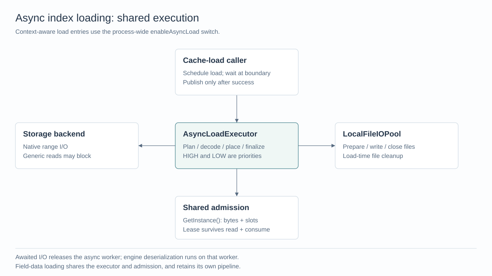

The async executor is the shared CPU worker pool. It schedules reads and runs
decoding and index restoration. Native storage I/O runs in the storage backend;
local file preparation and writes use `LocalFileIOPool`. These responsibilities
are shared across index types.

| Component in `storage/` | Responsibility |
| --- | --- |
| `AsyncLoadExecutor` | Run CPU work and resume loading coroutines after a wait. |
| `LoadAdmissionController::GetInstance()` | Enforce one process-wide budget shared by index and field-data loads. |
| `AsyncIndexEntryReader` / `IndexMaterializer` | Read the V3 directory, split entries, fill their destinations, and verify checksums. |
| `LegacyIndexLoader` | Read and decode older objects, passing each completed byte range and destination offset to the file manager. |
| `MemFileManagerImpl` / `DiskFileManagerImpl` | Reconstruct named memory buffers or local files from legacy objects. |

Index classes choose their inputs and how to reconstruct query state. They reuse
these storage components instead of implementing another download loop. The
field-data loader keeps its own `storagev2translator/AsyncLoadPipeline` and shares
the executor and budget with this design.

| Phase | Executor / owner |
| --- | --- |
| Synchronous cache-load boundary | Existing caller schedules the coroutine and uses `blockingWait`. |
| Read format metadata, plan destinations, request permission, dispatch slices, decode, check checksums and place bytes in memory | Shared async executor. Waiting for admission or native I/O suspends the coroutine. |
| Native range reads and completion | Storage backend. Processing resumes on the async executor. |
| Generic Arrow `ReadAsync` | Arrow/backend I/O context; completion copies the returned buffer before resuming the caller. |
| Provider opens, generic size queries, non-Arrow reads | May block the invoking async worker. They do not fall back to HIGH/LOW. |
| Directory creation, writable-target preparation, positioned writes, flush/close and load-time file cleanup | `LocalFileIOPool`, awaited from the async coroutine. |
| Engine opening, `Deserialize`, `DeserializeFromFile`, read-only mapping and query-state restoration | Shared async worker. Synchronous engine work occupies it until the engine returns. |
| Translator postprocessing and returning the loaded object to the cache | Cache-load caller; publish only after loading, postprocessing and final cancellation checks succeed. |

Children use `co_await`, including when they use the same executor as their
parent. There is no nested blocking wait on an async worker. A local-file executor
token covers only its immediate file operation, never remote I/O or engine
restoration. If that pool is disabled, its existing resolver uses the async
executor. Normal index destruction and cache eviction retain their existing
lifetimes.

### How files are split and loaded

Stored pieces are different from **load slices**: the ranges the loader
reads and processes concurrently. Splitting for loading does not create new
objects or change the stored format. The shared loader chooses these ranges;
individual index implementations choose where the resulting bytes belong.

| Stored input | How the loader chooses a read/decode task |
| --- | --- |
| Plain packed V3 entry | Read its offset and length from the packed directory, then split the entry into ranges of at most **16 MiB**. The last range contains the remaining bytes. |
| Encrypted packed V3 entry | Use the encrypted slice boundaries saved when the object was written. Each slice must be read and decrypted together; it cannot be cut at an arbitrary 16 MiB boundary. |
| Raw legacy object | Skip the format headers and split its index bytes into ranges of at most **16 MiB**. Continue with the next object belonging to the same entry. |
| Encoded/encrypted legacy object | Read and decode the whole object as one task because the existing decoder needs the complete object. The 16 MiB read limit does not apply here. |

For example, a **40 MiB plain V3 entry** produces three tasks. Offsets below are
relative to the entry, and the end offset is excluded:

| Task | Entry range (MiB) | Read size | Position in the destination entry |
| --- | --- | --- | --- |
| 0 | `[0, 16)` | 16 MiB | 0 MiB |
| 1 | `[16, 32)` | 16 MiB | 16 MiB |
| 2 | `[32, 40)` | 8 MiB | 32 MiB |

If the entry begins at byte `P` in the packed object, these reads start at `P`,
`P + 16 MiB`, and `P + 32 MiB`. They fill separate regions of the entry's
preallocated memory or writable file mapping.

For the legacy equivalent, suppose `A_0`, `A_1`, and `A_2` contain 16, 16, and
8 MiB of raw index bytes. Each task reads from its own object, after that object's
headers, and fills the same destination ranges shown above. Destination offsets
use the sum of preceding objects' **decoded lengths**, not their stored sizes
including headers. Stored object boundaries do not set the load slice size: a
raw object containing 32 MiB would itself produce two 16 MiB tasks. The memory
loader copies these ranges into entry `A`; the disk loader writes them at the
same offsets in local file `A` using `PositionedFileWriter::WriteAt`.

Tasks can finish in any order. If task 1 finishes first, it fills `[16, 32)`
immediately; it does not wait for task 0. Packed V3 takes turns dispatching one
slice from each selected entry. Legacy loading dispatches ranges across the
objects of the current entry/file, then waits for that entry/file to finish
before moving to the next one.

Each task follows the same lifetime:

1. On the async executor, wait for permission to use estimated temporary bytes
   and one task slot from the shared process budget.
2. Read the range and decode it if needed, then fill its destination. Native
   remote I/O can overlap other tasks while the coroutine waits. Memory placement
   and decoding run on the async executor; legacy disk and Knowhere mmap writes
   run on `LocalFileIOPool` and are awaited by the coroutine.
3. After placement finishes and temporary buffers are released, return the lease.
   The loader can dispatch another task as soon as **any** task completes.

The per-load **window** is the work allowed to overlap: at most **eight tasks and
128 MiB of estimated temporary memory**, also subject to the shared process
budget. This limits outstanding work, not the number of worker threads. A whole
encoded object or encrypted slice above the byte window runs alone; global byte
admission has the same oversized-task exception.

The following example uses a legacy file or Knowhere mmap destination and
assumes **two shared task slots are available**, with enough byte budget. It uses
the same 40 MiB input above. Slice 0 is slow; after slice 1 is written, its slot
can fund slice 2 while slice 0 is still reading. Two is an example of available
capacity, not another configured window size. The per-index sequence diagrams
expand the preparation and engine phases surrounding this shared behavior.

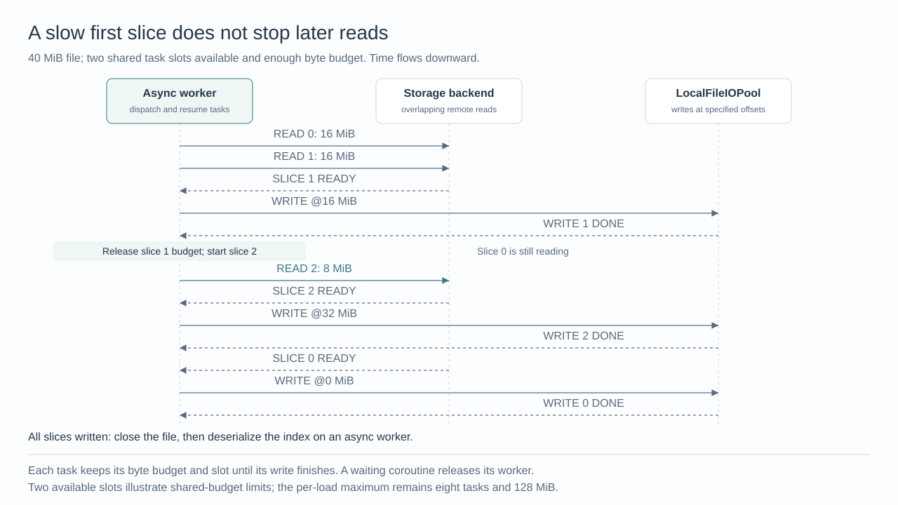

Streaming here means reading and placing ranges without retaining a second
collection of all downloaded slices. It does **not** mean the index engine
deserializes each range as it arrives. Engine restoration starts after all its
inputs are ready and slice leases have been released. Legacy BinarySet consumers
still retain the complete assembled input; the 128 MiB window does not cap that
input or the final index size. Their memory is accounted for separately in
[Resource accounting](#resource-accounting).

The 16 MiB limit is a raw read size, not the admission charge. Raw legacy tasks
reserve the read buffer plus a 4 KiB-rounded aligned write copy; the 128 MiB
window may therefore admit fewer than eight tasks. `WriteAt` copies unaligned
addresses into aligned allocations, pads only the final file tail, and `Finish`
truncates to the exact logical length after writes drain. Slice-size assertions
enforce positive, 4 KiB-aligned production slices and a nonzero dispatch window.
`WriteAt` and `Finish` share existing global write permits with `FileWriter`;
those permits cover blocking local I/O only.

### Packed scalar V3

A packed object contains a directory with entry offsets and lengths, plus
persisted slice boundaries for encrypted entries. The parsed directory is called
the **catalog** in the code. `AsyncIndexEntryReader` reads it under admission.
The index's `PlanLoad` describes which entries to load and where to put them;
`IndexMaterializer` checks destination sizes and overlap, fills those destinations,
and combines per-slice CRC checksums in logical order.

File targets are preallocated before writable mapping. Mappings survive issued
reads and are closed before engine restoration. The filled buffers and files
form an `IndexLoadArtifact`, which owns the loaded inputs and their cleanup.
The index's `FinalizeLoad` borrows those inputs and reuses its existing parsers.
Only after it succeeds do retained files transfer to index ownership; failure
releases the inputs and removes temporary files. This ownership transfer is what
the code calls committing the targets.

For numeric Sort, persisted `index_data` and `idx_to_offsets` can become read-only
mappings, while validity remains in heap. Older artifacts can rebuild auxiliary
state; newly built Sort indexes at scalar engine version >= 3 always persist
these auxiliaries. Conversion to Bitmap's mmap format (its "frozen" representation)
restores state on the async worker and awaits bounded 64 KiB output batches,
with at most one additional large bitmap per batch.

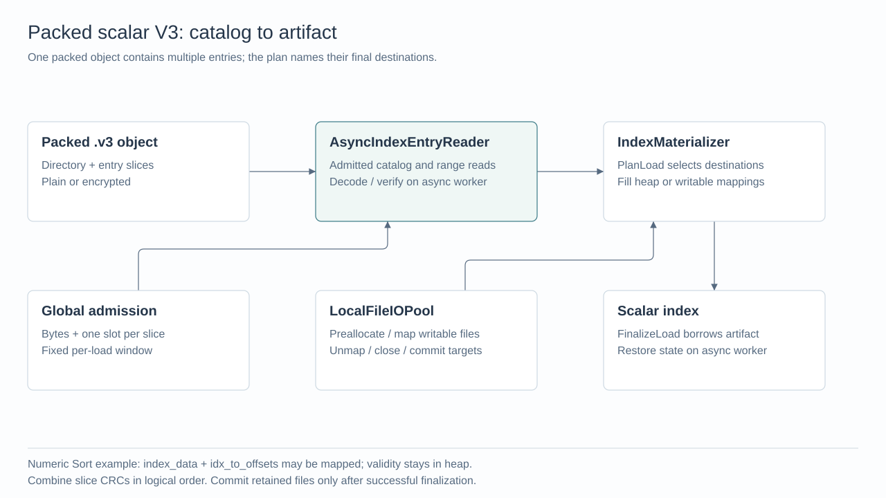

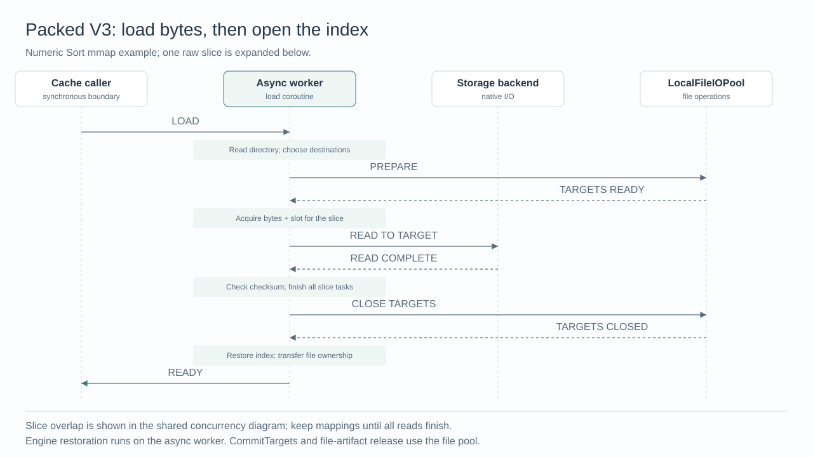

### Legacy scalar

Legacy `A_0`, `A_1`, and `SLICE_META` are separate objects. The file manager validates
slice counts and aggregate lengths, prepares the logical entry `A` once, and
streams decoded ranges into their final offsets. It does not retain a second map
of every decoded slice.

Sort, StringSort, Bitmap, Marisa and Hybrid consume the assembled BinarySet;
Hybrid awaits its selected child's coroutine. Tantivy/Ngram and RTree share disk
staging and restore their engines after file closure. JSON scalar wrappers reuse
the base loader and restore missing/null sidecars. Numeric Sort's legacy mmap
path first assembles its input, then writes its file and restores mappings and
auxiliary state; it is distinct from V3 direct-to-target materialization.

`ScalarIndex<T>` is the shared scalar-index base class; `T` is the value type,
not the index algorithm. Its default legacy async path separates transport from
index-specific restoration:

| Function | What it does | When a derived index changes it |
| --- | --- | --- |
| `ScalarIndex<T>::LoadLegacyAsync` | Ask the file manager to assemble a BinarySet asynchronously, then call the virtual `FinishLegacyLoadAsync`. | When input handling differs: Sort validates its metadata; Hybrid selects and awaits its child; file-based indexes stage files. These paths still reuse the storage loader. |
| `ScalarIndex<T>::FinishLegacyLoadAsync` | Call the existing `LoadWithoutAssemble` parser on the async worker. | When reconstruction needs extra file operations or index-specific preparation. |

For example, `StringIndexMarisa` inherits `LoadLegacyAsync` and overrides only
`FinishLegacyLoadAsync`. It receives the already assembled BinarySet, writes the
trie file on `LocalFileIOPool`, then reads or maps the trie and restores its
lookup state on the async worker. It does not need another slice reader or
admission implementation.

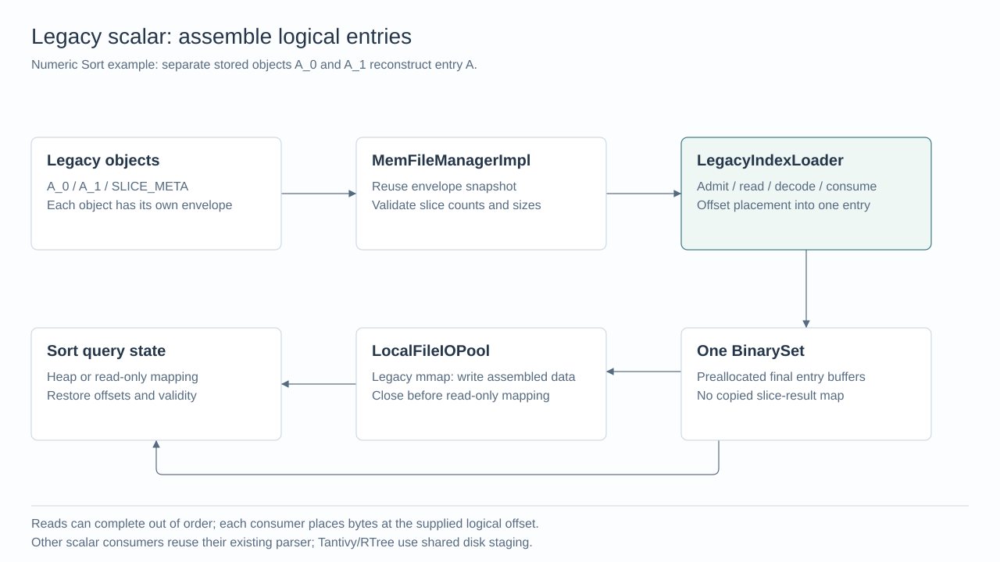

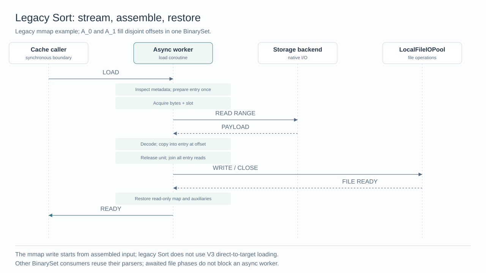

### Knowhere

All three Milvus loading modes reuse the legacy transport and existing sidecar
parsers. Knowhere deserialization remains a synchronous engine call; its own
implementation determines any internal parallelism.

| Mode | Inputs prepared by Milvus | Engine phase on async worker |
| --- | --- | --- |
| Memory | Complete BinarySet plus nullable/empty-list metadata | `LoadWithoutAssemble` / `Deserialize` |
| mmap | Positioned main-index file, separate embedding metadata/raw-index files, heap validity sidecars | `FinalizeMmapLoad` / `DeserializeFromFile` |
| Disk | Files selected by the existing disk-load policy | `FinalizeDiskLoad` / `Deserialize` |

Mmap learns each entry's exact size before opening its writer. One main entry
maps to one file; embedding metadata and optional raw-index entries each have
their own file. A second entry for one writer is rejected. This keeps entry-relative
offsets file-relative, including tails. Configured cache targets are cleared even
for all-null reloads.

`LoadIndexWithStream()` keeps its file-selection contract: Milvus stages nullable
and empty-list sidecars while a stream-capable engine owns other reads. Such
backend-internal reads are not automatically admitted by `LegacyIndexLoader`.
Staging every object would defeat lazy loading. Blocking local or remote reads
inside an engine still occupy its async worker, and cancellation waits for the
engine call to return.

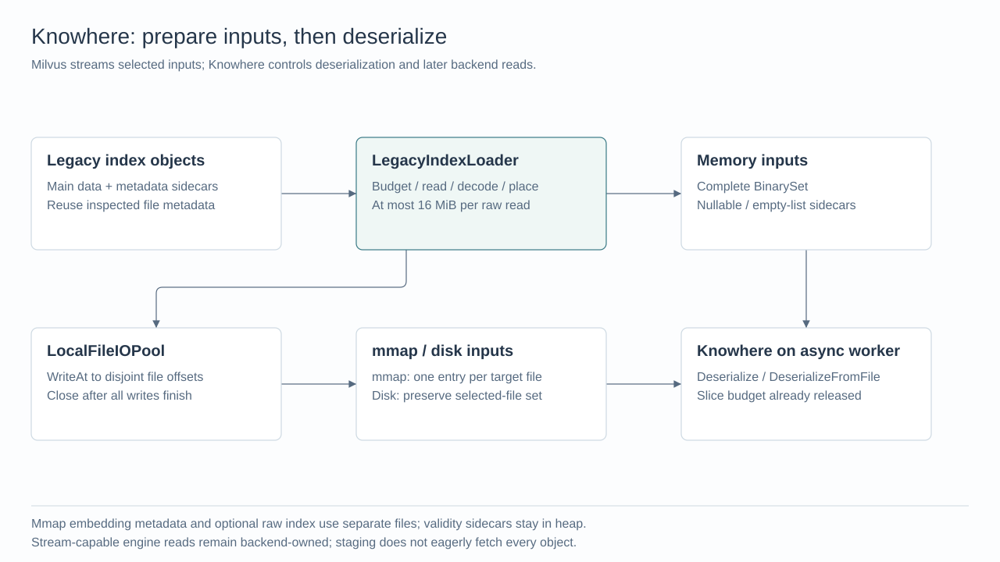

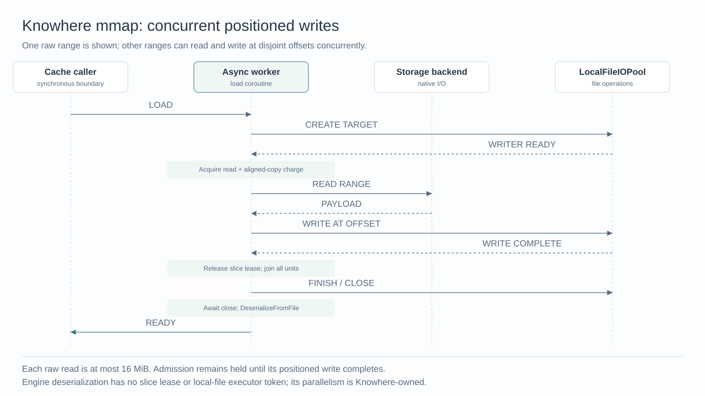

### Independent TextMatch

`TextMatchIndexTranslator` forwards `OpContext`. A single `.v3` text-log object uses
the packed materializer; legacy relative paths are resolved against
`stats_base_path` and use the inherited Tantivy legacy loader. Both reuse Tantivy
planning and restoration, including the auxiliary null-offset data used to
identify valid rows.

The async worker opens Tantivy after staging finishes. Heap loading awaits
staging cleanup; mmap retains files under index ownership. The cache caller
registers the analyzer after `Load` returns. No TextMatch-specific streamer or
executor is introduced.

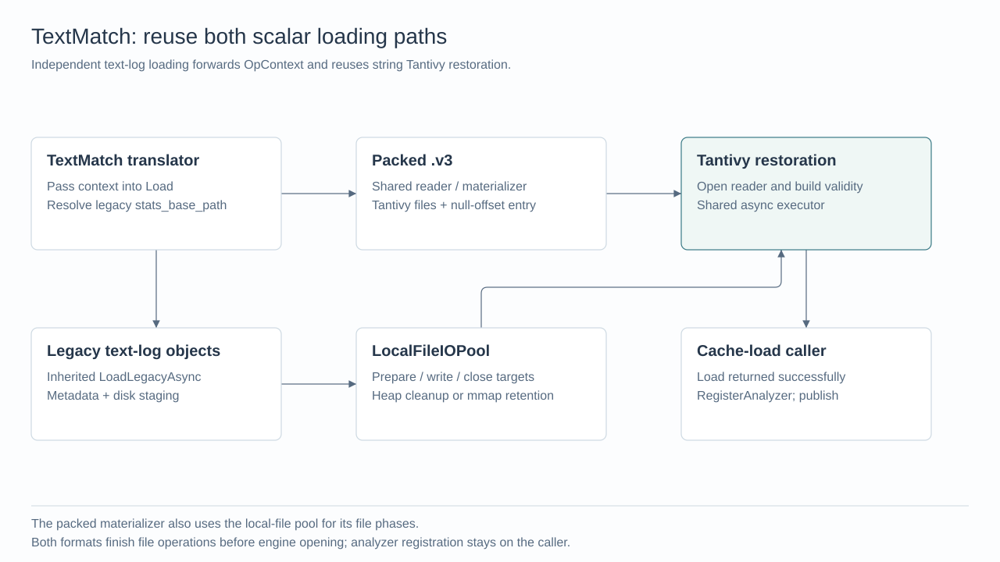

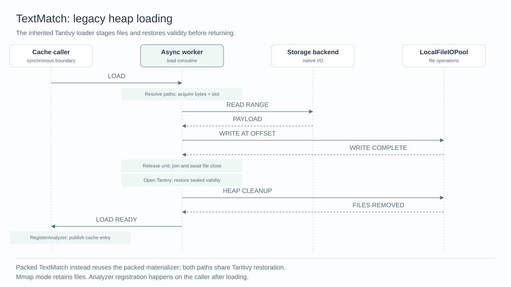

### BSON shared-key

`BsonInvertedIndexTranslator` uses the context-aware `BsonInvertedIndex::LoadIndex`.
The `shared_key_index/*` files, including `meta.json_0`, use the legacy index-file
format with headers around the payload; this path does **not** use packed scalar V3.
`DiskFileManagerImpl` reconstructs the local files by writing each decoded range
at its destination offset, in a directory owned by this load.

After all files close, `FinishLegacyLoad` opens Tantivy on the async worker.
Heap mode removes staging before returning; mmap retains it. A failed load
releases its reader before cleaning its own directory. It does not materialize
all staged files into a BinarySet.

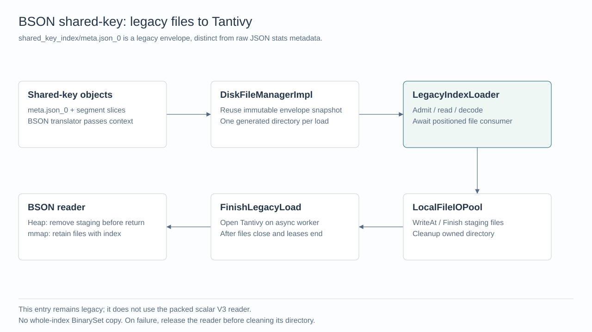

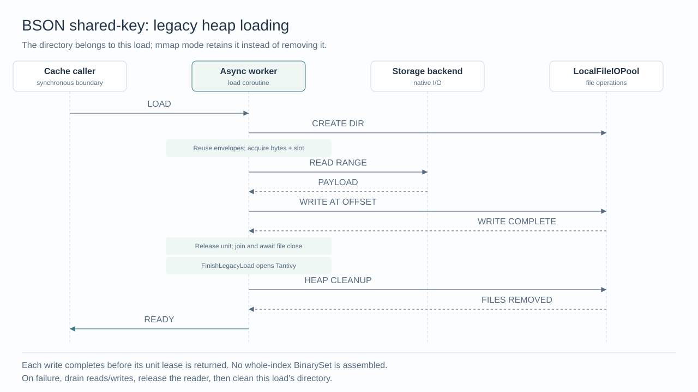

### JSON stats

JSON stats stores values extracted from JSON in Parquet files, organized into
**column groups**. A group has a set of columns and an ordered list of files
containing those columns. Loading must first learn the columns' types and each
file's row count so that later reads can locate the requested rows.

A **projected reader** reads selected columns from that group's files. For
example, if group 0 has columns `a` and `b` in files `0/0` and `0/1`, eager setup
prepares one reader selecting both columns; lazy setup prepares a reader for
`a` and a reader for `b`. Both lazy readers refer to the same two files. Preparing
a reader can open those files and read metadata; it does not load all column
values into memory.

| Phase | Work and result |
| --- | --- |
| Read root `meta.json` | Parse the JSON-key-to-field mapping on the async path. This is raw JSON, distinct from BSON's `meta.json_0` with legacy format headers. If absent, use metadata from the first Parquet file. |
| Inspect each group's files | Read each file's final eight bytes to find the footer, then read and parse that footer for column types and row count. At most 16 file tasks overlap; groups are processed one at a time. |
| Keep the results needed for reads | Preserve file-ID order, one schema per group, and one row count per file. Only the group's first-file task restores shared field mappings. |
| Prepare column readers | After all metadata tasks finish and release their budget, use `OpenChunkReadersAsync` for the eager or lazy selections above. |
| Create column caches and later load values | The caller creates caches using `ManifestGroupTranslator`. Warmup or a later cache load uses the existing field-data async pipeline to read column values. BSON cache slots are created separately. |

Metadata tasks run on the shared async executor and use storage-backend reads;
they do not stage local files. The probe releases its permission before the
footer requests its own, avoiding a nested reservation. The exact temporary-memory
estimates are collected under [Resource accounting](#resource-accounting).

The 16-file limit applies to metadata inspection. Each projected reader may
subsequently open all the files in its own group, so that limit does not bound
the reader's internal opens. The eager/lazy choice determines which columns each
reader selects; it does not change the group's list of files.

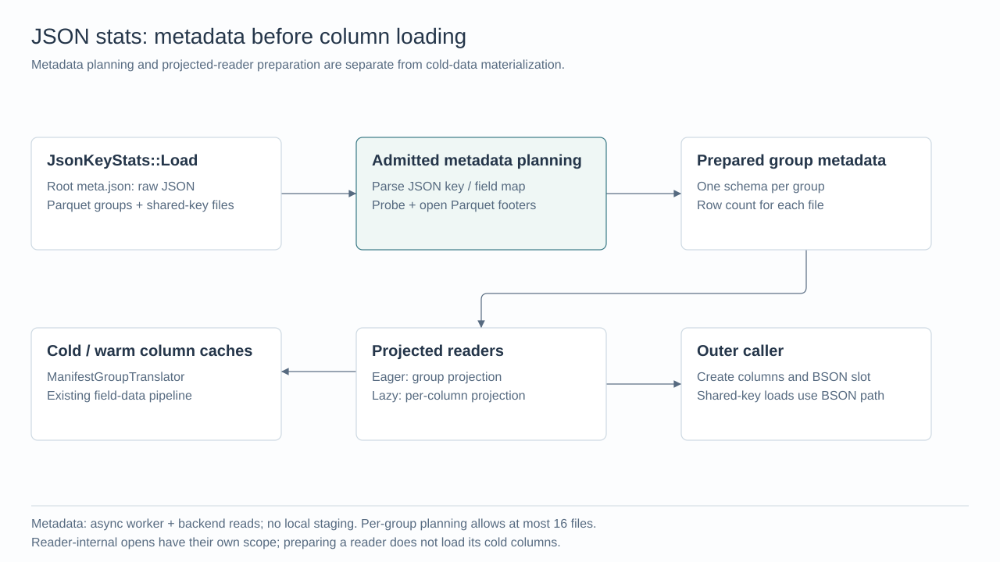

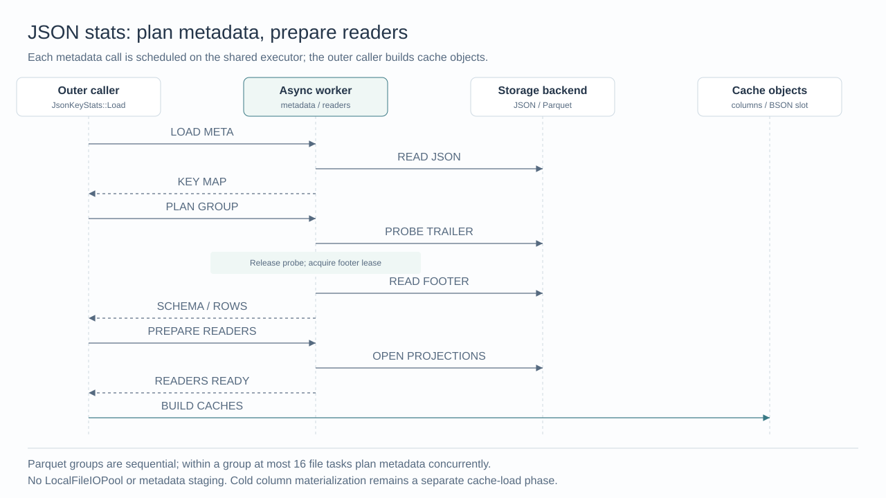

### Resource accounting

Admission limits temporary loading work, while cache reservations account for final
indexes and data retained beyond a slice. FIFO applies within HIGH/LOW priorities;
HIGH waiters precede queued LOW waiters. Waiting requests hold neither bytes nor
slots. An oversized task may run exclusively, so a configured byte limit cannot
be treated as a hard cap below that task's requirement.

| Memory / disk lifetime | Accounting |
| --- | --- |
| Temporary read/decode/write buffers, including aligned copies | Slice admission plus the fixed per-load window |
| Complete BinarySet, retained sidecars, parsed slice metadata, Bitmap conversion input/output | Memory reserved for this load's peak usage |
| Final index and retained mappings/files | Existing representation estimates and cache ownership |
| Overhead fully covered by runtime leases in both load modes | Shared group from `LoadMemoryOverheadController::GetInstance().GetOrCreate()` |

Knowhere memory estimates include the overlap between the assembled BinarySet
and the constructed index. Mmap estimates include heap sidecars, embedding
metadata, decode scratch and compatibility writer buffers. BSON retains the
larger supplied JSON-stats estimate when appropriate. Disk loading keeps a coarse
Knowhere/download allowance; it does not prove a bound on oversized encoded disk
objects or backend-internal scratch.

For a largest legacy task's temporary-memory estimate `s`, the bounded read peak is
`max(s, min(128 MiB, 8 * s))`, calculated with saturating arithmetic. Estimates
cover both rollout paths and do not shrink with CPU worker count or current
admission settings. Suspended reads keep their slots after releasing workers.

Shared accounting follows byte/slot admission limits: a nonzero byte budget uses
the existing budget-based reservation policy (`Budget`). Without a byte limit,
finite slots multiply the largest task estimate. Unlimited slots retain each
load's own reservation (`Passthrough`); worker count does not bound the memory of
coroutines waiting for I/O.
Limit expansion updates accounting before admitting more work; rejection keeps
the old limit. Tightening restricts admission first and retains accounting for
already admitted slots until they drain. Executor resizing does not resize these
resource reservations.

For JSON stats metadata, admission covers both the downloaded bytes and the
temporary objects created while parsing them:

| Metadata task | Bytes reserved, plus one task slot | Lifetime |
| --- | --- | --- |
| Root `meta.json` | `32 * file_bytes + 4096` | One lease spans sequential bounded reads and JSON parsing. |
| Parquet size/trailer probe | 4096 | Release after size discovery and the eight-byte trailer read, before requesting footer permission. |
| Parquet footer | `32 * (serialized_footer_bytes + 8) + 64 KiB` | Hold through footer reads, schema conversion and layout restoration. The extra 64 KiB covers Arrow's tail-read fallback. |

These parser multipliers are conservative estimates, not measured allocator
bounds. The retained key/field map, group schemas and per-file row counts outlive
these temporary parsing tasks.

Legacy size estimation inspects format headers in both switch settings. With
async loading enabled, inspection runs on the async executor; otherwise it runs
on the planning caller. The resulting immutable descriptions record sizes and
encoding, not open readers. `FileManagerContext` carries them so later loads or
reloads of the same paths can reuse the inspection. Sharing this metadata step
does not merge the synchronous and asynchronous payload loaders.

### Cancellation and failure

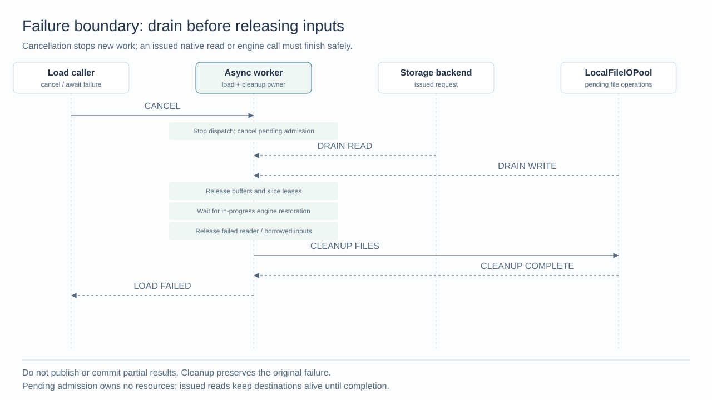

The first failure stops new work and cancels related tasks waiting for admission.
Already issued reads and writes must finish before their buffers, mappings or
writers can be released. The code and diagrams call this waiting **draining**.
Cancellation is checked around synchronous parsers/engine calls and between
Bitmap output batches; it cannot interrupt an engine call in progress.

Packed loads transfer retained files to the index only after restoration succeeds.
Legacy file loads close their writers before opening engines and remove temporary
files from failed loads after issued work finishes. Cleanup is awaited with
cancellation disabled where needed, and the original load failure is retained.
No partial result is published.

Short reads, malformed metadata, CRC mismatches, invalid destination plans and
file-write failures terminate loading. Existing typed storage statuses are kept
where the backend supplies them; this design does not recover categories already
erased by a backend or replace Tantivy's string-based error contract. Backend-owned
retry behavior and actual S3 retries must be checked at the network boundary.

## Compatibility, Deprecation, and Migration Plan

The switch supports gradual rollout and rollback without rebuilding indexes.
Packed readers share format parsing with synchronous readers. Legacy assembly
preserves slice metadata and file naming; Sort can reconstruct missing auxiliary
state, Marisa reconstructs absent string-to-row offset arrays (CSR) but rejects
partially stored arrays, and Hybrid retains its persisted-type/filename/metadata
recovery rule.

Both paths preserve null/missing-value handling and memory/mmap query results.
Independent TextMatch supports packed and legacy artifacts; BSON shared-key remains
legacy. HIGH/LOW pools continue serving compatibility paths. This change adds no
new public index format, per-index async switch, or controller singleton.
Explicit scalar/vector two-argument and BSON three-argument compatibility
overloads remain synchronous; production translators use context-aware entries.

## Test Plan

The implementation keeps deterministic C++ checks at resource/executor boundaries
and Go integration tests for actual loading and object-store traffic. The matrix
specifies coverage; it is not a record of which revision ran each suite.

| Layer | Scenarios and required assertions |
| --- | --- |
| Reader/materializer C++ UT | Plain/encrypted input, metadata admission, short/corrupt reads, CRC and destination validation; incomplete targets are never committed. |
| Streaming/writer C++ UT | Out-of-order reads/writes, slow first slice, byte/slot windows, aligned tails, exact file length and write failure; all buffers/permits return after drain. |
| Executor/lifetime C++ UT | One async worker and one slot, priority and disabled-local-pool routing, engine restoration, cancellation and pool shutdown; no nested worker wait or early input cleanup. |
| Scalar/vector/TextMatch/BSON C++ UT | Legacy/V3 where supported, memory/mmap, nullable and missing sidecars, reloads, query parity, finalizer failure and generated-directory isolation. |
| JSON stats C++ UT | Raw metadata, absent metadata fallback, Parquet probe/footer admission, ordered rows/schema, cancelled size/footer requests and lazy-column reads. |
| Accounting C++ UT | Rollout/worker changes, live budget/slot shrink and expansion, oversized/unlimited units, retained BinarySet/sidecars and rejected reservation expansion. |
| Go loading integration | Build legacy scalar and JSON stats artifacts, load/query/release/reload with the switch off and on. |
| Go object-storage fault integration | An HTTP proxy in front of MinIO injects two `503 SlowDown` responses or pauses a selected GET; verify retry/query success and server-side release followed by reload. |

The paused-GET test exercises server-side teardown with `ReleaseCollection`, not
client RPC cancellation. Exact cancellation observation and lease lifetimes are
checked in C++ UT. Real DiskANN/backend-specific streaming, GPU/remote deployments,
ASAN, production RSS and throughput measurements remain separate validation work;
local correctness tests do not establish those results.

## Rejected Alternatives

- A separate async admission singleton would split the process budget; use the
  existing `GetInstance()` controller and overhead group.
- Routing enabled loads back to HIGH/LOW based on index format or reader capability
  would make the global switch inconsistent; generic reads stay on the async path.
- Running engine deserialization on `LocalFileIOPool` would occupy file workers
  with CPU work and synchronous engine reads; only staging operations use it.
- Waiting for preceding file slices would serialize consumers and delay window
  refill; disjoint positioned writes allow completion in any order.
- Rewriting every index parser or eagerly caching backend-owned lazy files would
  duplicate semantics or change loading behavior; reuse the existing contracts.

## References

- [Shared async field-data design](20260811-async-storage-v3-field-data-loading.md)
- [Implementation PR](https://github.com/milvus-io/milvus/pull/52453)
- Shared transport: `storage/AsyncIndexEntryReader`, `IndexMaterializer`,
  `LegacyIndexLoader`, `MemFileManagerImpl`, `DiskFileManagerImpl`, `FileWriter`.
- Index integration: `index/ScalarIndexAsync.cpp`, `VectorMemIndex.cpp`,
  `VectorDiskIndex.cpp`, `TextMatchIndex.cpp`, `json_stats/bson_inverted.cpp`,
  `json_stats/JsonKeyStats.cpp` (paths relative to `internal/core/src/`).
