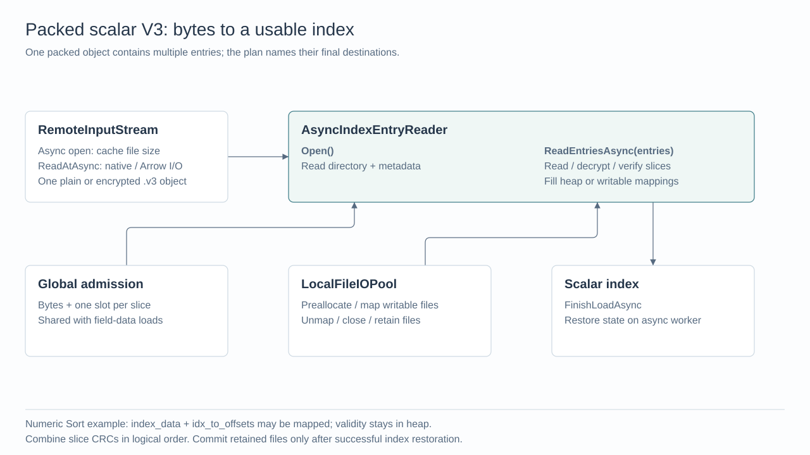
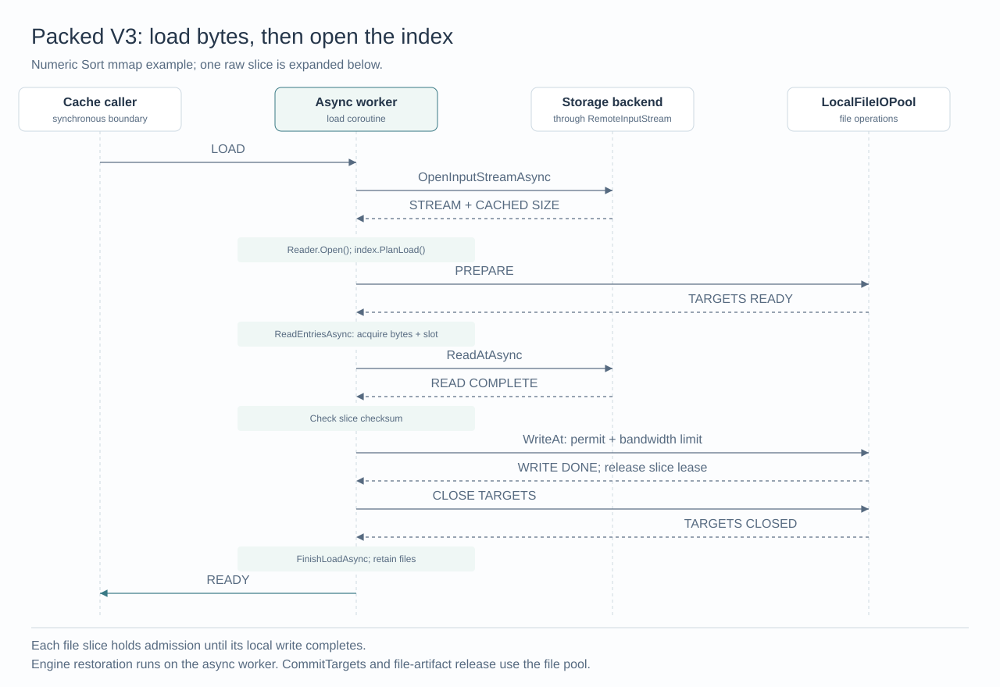

# MEP: Async Packed Scalar Index Loading

- **Created:** 2026-09-07
- **Author:** @sparknack
- **Status:** Under Review
- **Component:** QueryNode, Storage, Index
- **Related issue:** [#51245](https://github.com/milvus-io/milvus/issues/51245)

## Summary

Load a packed scalar index by reading several byte ranges concurrently, placing
completed ranges into their destinations, and then restoring the index's query
state. A native asynchronous storage read releases its worker while waiting for
I/O. The loader shares the existing field-data async executor and process-wide
admission limits.

This change covers scalar indexes stored in packed V3 files: Sort, StringSort,
Marisa, Bitmap, Hybrid, Tantivy inverted, Ngram, RTree, FMIndex, and the JSON scalar
wrappers. TextMatch `.v3` files already use the same scalar loader, so their
estimates and cancellation forwarding are included too. Legacy scalar and
TextMatch files, Knowhere, BSON shared-key indexes, and JSON stats loading are
separate follow-ups. Index building, stored
formats, and query semantics are unchanged.

The existing
[field-data pipeline](20260811-async-storage-v3-field-data-loading.md) continues
to load field data. Index loading reuses its executor and admission controller;
it does not pass index entries through field-data translators.

## Reading the pipeline

A **packed object** is one stored file containing several named **entries** and
a directory describing their offsets, sizes, checksums, and encryption metadata.
For example, a Sort index stores sorted values, row-offset lookup data, and
validity information as separate entries. A **slice** is a byte range read from
an entry during loading; it is not another stored object.

Loading proceeds in five stages:

1. Await `FileManager::OpenInputStreamAsync` to open the packed object and cache
   its size. `AsyncIndexEntryReader::Open` then reads the directory and index
   metadata through `InputStream::ReadAtAsync`. The resulting **directory** describes
   what is stored, without loading every entry. Magic/footer and directory reads
   bypass admission because they are normally small; this choice should be
   revisited if directories become large. The `_meta` entry still uses the same
   slice admission as other entry payloads.
2. Let the scalar index choose the entries it needs and their destinations:
   allocated memory or local files. `PlanLoad` returns an `IndexLoadPlan` that
   owns those destinations and the index-specific initialization context.
3. Call `reader->ReadEntriesAsync(plan.entries, priority)` to prepare destinations and read slices
   under shared admission. The reader places bytes at their destination offsets
   and verifies checksums. It returns `void`; successful completion means the
   original plan targets are filled and file writers are closed.
4. Call the index's `FinishLoadAsync(plan, config)` to adopt the completed targets, initialize
   query state, and update index state using existing representation code.
   File writers close before this stage; read-only mappings and engine
   objects are opened here. Bitmap mmap loading also converts postings to frozen
   format and awaits local-file writes, so this stage remains asynchronous.
5. Retain the files needed by the successful index and release temporary inputs.
   Call `plan.Commit()` to retain persistent files, then destroy the plan. The cache caller publishes the
   index only after loading succeeds.

The call chain is `OpenInputStreamAsync` → reader `Open` → `PlanLoad` →
`ReadEntriesAsync` →
`FinishLoadAsync` → `plan.Commit()`. The reader owns byte transfer and
validation; the scalar index owns destination selection and query-state restoration.
The same plan retains targets and engine-specific context from `PlanLoad` through
`FinishLoadAsync`. The reader borrows its entry descriptions until all submitted
slice tasks join. File plans are released on `LocalFileIOPool`, including after
read or finalization failure. The plan removes uncommitted files before releasing
engine context and directory leases. There is no second set of completed-entry
descriptions or separate result artifact.

`index/IndexLoadPlan.h` defines the full plan. `storage/IndexEntryTarget.h` defines
entry requests and memory/file destinations; the storage reader does not depend
on index-specific context. A `FileEntryTarget` selects a region of a shared
`IndexFileTarget`, which owns the local writer and file cleanup. Finishing writes
closes the writer; successful index finalization commits files marked for
retention. Other files are removed on `LocalFileIOPool` before directory leases
are released, even if the index context still holds a reference to the target.

`Directory()` exposes the validated entry layout; `IndexMeta()` exposes the JSON
from the metadata entry. Both are read-only, perform no I/O, and remain valid for
the reader's lifetime. `PlanLoad` receives these two inputs explicitly. Slice reads are
private so callers always go through admission and entry checksum verification.

`PlanLoad` and `FinishLoadAsync` are public so Hybrid can delegate to its
internal index. `LoadUnifiedAsync` is a private implementation of `LoadUnified`.

The synchronous path keeps `IndexEntryReader` and its HIGH/LOW scheduling. The
async path uses `AsyncIndexEntryReader` for both directory and entry reads. Both
readers reuse pure footer validation and directory parsing in `IndexEntryFormat`,
which directly constructs `IndexEntryDirectory` during `Open`. Each `EntryMeta`
describes a source entry, including absolute file offsets, plaintext sizes,
checksums and encrypted slice ranges. There is no temporary directory-to-catalog
conversion. The reader separately owns the encryption header and parsed index
metadata. Synchronous loading obtains both without `PlanLoad`. Streams,
scheduling, cancellation, decryption and decoded-entry caches remain reader
responsibilities. Stream resource estimates are derived from the validated
directory by the load code. Both readers use the same scalar representation
parsers where applicable.

## Selection and executor ownership

`queryNode.segcore.storageV2.enableAsyncLoad` selects the loading path and defaults
to false. Its `storageV2` name is the existing configuration namespace; packed
scalar files use format V3.

A cache translator captures the global flag in `FileManagerContext` when it is
constructed. Its resource estimate and later reloads use that mode. Newly created
translators observe configuration updates. A direct load without a cache-owned
estimate reads the global flag when loading starts. Within the packed path,
encryption, mmap, and the storage backend do not choose a different Milvus load
executor.

| Work | Executor |
| --- | --- |
| Synchronous cache caller waits for `LoadUnified` | Calling thread |
| Initiate async open; parse directory and metadata; choose destinations | Shared `AsyncLoadExecutor` |
| Open the backing file | Arrow `FileSystem::OpenInputFileAsync`; backend owns I/O scheduling |
| Obtain and cache file size during open | Native `GetSizeAsync`; otherwise the backing file's Arrow I/O executor runs `GetSize` |
| Wait for admission; dispatch slices; decrypt; check CRC; place bytes in memory | Shared `AsyncLoadExecutor`; coroutine waits release the worker |
| `InputStream::ReadAtAsync` on a native remote file | Storage backend asynchronous I/O fills the destination; completion resumes the coroutine |
| `InputStream::ReadAtAsync` on a generic Arrow file | Arrow `ReadAsync`; copy the returned buffer into the destination |
| Memory stream read | Immediate memory copy; no I/O |
| Create directories and positioned file writers | `LocalFileIOPool` |
| Write file slices with disk permits and bandwidth limiting; close writers after all writes drain | `LocalFileIOPool` |
| Deserialize, open engines/read-only mappings, restore query state | Shared `AsyncLoadExecutor` |
| Convert Bitmap postings to frozen representation | Shared `AsyncLoadExecutor` |
| Write Bitmap's derived frozen file and release file-backed staging resources | `LocalFileIOPool` |

The shared executor lives in `storage/AsyncLoadExecutor`, alongside admission and
local file I/O. Its existing thread-count setting is
`queryNode.segcore.storageV2.asyncLoadThreadPoolSize`. HIGH and LOW are priority
views of that executor on the async path. There is no second async executor or
separate admission singleton for scalar indexes.

Local file operations are awaited. If `LocalFileIOPool` is disabled, its existing
resolver uses the shared async executor. No local-file executor token spans a
remote read or an engine call. Slice tasks and their parent coroutine may use the
same async executor because the parent suspends with `co_await` instead of blocking
on its children's completion. The synchronous wait is at the outer caller.

The stream API comes from [milvus-common #132](https://github.com/zilliztech/milvus-common/pull/132).
After async open completes, `Size()` returns the cached value without I/O. The
reader neither downcasts the stream nor accesses an Arrow file directly. Streams
without async support return `Unsupported`; there is no implicit synchronous
`ReadAt` fallback. `RemoteInputStream` owns native/Arrow selection and read retries.
No executor argument is passed through the stream API: the backend schedules I/O,
and the awaiting coroutine resumes on its load executor.

Engine restoration remains a synchronous call on the async worker; async
transport does not make a parser or engine call itself asynchronous.

## How slices overlap

For a plain entry, the reader divides the entry into ranges of at most
**16 MiB**, except that the final range can be shorter. The value comes from the
existing default entry-stream slice size. Compile-time assertions require a
positive supported size and 4 KiB alignment.

A **40 MiB plain entry** becomes:

| Slice | Entry-relative range | Size | Destination offset |
| --- | --- | --- | --- |
| 0 | `[0, 16 MiB)` | 16 MiB | 0 |
| 1 | `[16 MiB, 32 MiB)` | 16 MiB | 16 MiB |
| 2 | `[32 MiB, 40 MiB)` | 8 MiB | 32 MiB |

If the entry begins at object offset `P`, the source reads begin at `P`,
`P + 16 MiB`, and `P + 32 MiB`. They fill disjoint ranges of the same destination.
If slice 1 finishes before slice 0, it can fill its destination and verify its
checksum independently. For a file destination, it awaits its positioned write
before returning the admission lease. That capacity can admit
slice 2 while slice 0 remains in flight. There is no ordered consumer waiting
for the earliest slice before placing later results.

For multiple entries, the reader takes turns submitting one slice from
each entry. Each submission first acquires bytes and one task slot from the
process-wide `LoadAdmissionController`. There is **no additional per-load
8-task or 128 MiB limit**. CPU worker count limits simultaneous CPU execution;
admission controls outstanding reads, including those waiting on storage.

Encrypted entries use the slice boundaries recorded in the packed directory.
Each ciphertext slice must be read and decrypted as a unit; it is not split at
an arbitrary 16 MiB offset. The persisted plaintext slice size determines its
destination offset. Decryption and checksum calculation run on the async worker.

Checksums are calculated per completed slice and combined in logical slice order.
The reader validates the final entry CRC without another full-entry scan.
Engine restoration waits until all selected inputs are complete and verified.

## Example: Sort with mmap enabled

`ScalarIndexSort` plans memory for validity metadata and file destinations for
sorted values and row-offset lookup data. Local file workers create
`PositionedFileWriter` instances. Each file slice reads into a temporary buffer,
then awaits a positioned write on `LocalFileIOPool`. The write uses the shared
disk-write permit and bandwidth limiter. Memory destinations still receive reads
directly; file downloads do not use writable mmap.

Marisa's local CSR file pads the first entry to a 4 KiB boundary. Slice writes
include zero padding only within their reserved entry region. All files follow
the writer's existing configured mode and priority rules.
Aligned layouts retain the configured direct-I/O behavior.

After all reads, CRC checks, and writes finish, local file workers close the
writers. The async worker opens the read-only mappings and restores the Sort
index's lookup state. A successful load retains those files. A failed or
canceled load removes its temporary targets after outstanding work has drained.

Newly built Sort indexes with scalar engine version **>= 3** always persist the
auxiliary entries checked by `has_persisted_aux`. The compatibility branch exists
for older packed artifacts missing those entries and reconstructs the auxiliary
state using the existing logic.

Other index implementations provide their own `PlanLoad` and
`FinishLoadAsync` methods while sharing the same reader, slice scheduling,
admission, and target lifetime:

| Index | Index-specific work |
| --- | --- |
| Sort / StringSort | Restore sorted values, offsets, and validity in heap or mmap mode. |
| Marisa | Stage the trie file, then read/map it and restore string IDs and CSR lookup data. Incomplete persisted CSR sets remain invalid. |
| Bitmap | Restore postings; mmap mode converts them to a frozen file. Conversion uses a 16 MiB batch buffer with at most one additional large bitmap per batch. |
| Hybrid | Recover the persisted internal type using the existing compatibility rule, then delegate to that child's planning and loading methods. |
| Tantivy / Ngram / RTree | Read entries into an owned directory, then open the engine and restore sidecars. Heap-mode temporary files are removed after restoration. |
| TextMatch `.v3` | Reuse the Tantivy planning and loading methods, open the packed object under its text-log prefix, and pass cancellation through the translator. Analyzer registration still finishes before cache publication. |
| FMIndex | Restore its packed entries through the same pipeline, including older scalar-version metadata that still selects the FM packed loader. |
| JSON scalar wrappers | Extend the underlying scalar plan with missing-path sidecars and rebuild the existence bitmap after the underlying index has loaded. These are distinct from JSON stats and BSON shared-key loading. |

## Admission and memory accounting

Admission limits temporary bytes and task slots across field and index loads.
`common.loadTransientBudgetBytes` and `common.loadAdmissionSlots` are
refreshable. With async enabled and no explicit overrides, the existing defaults
are 2 GiB and twice the initialized CPU count. Zero disables the respective limit.

The effective `common.loadAdmissionSlots` value depends on whether it is explicitly
configured:

| Slot configuration | Synchronous loading | Asynchronous loading |
| --- | --- | --- |
| Unset | 0 (unlimited) | Twice the CPU count reported by Milvus at initialization |
| Explicit positive N | N | N |
| Explicit 0 | Unlimited | Unlimited |

Synchronous loading has no admission slot limit by default; HIGH/LOW pool sizes
bound executing tasks, and shared overhead is estimated from their combined
worker count. Admission slots do not automatically track pool resizing.
Explicit slot limits also apply to synchronous paths that acquire admission.
Similarly, an unset `common.loadTransientBudgetBytes` resolves to 0 in synchronous
mode and 2 GiB in asynchronous mode; explicit values apply in either mode.

An indivisible unit larger than a nonzero byte limit may run exclusively so it
can make progress; it still needs a slot. Waiters hold neither resource.

A slice's lease remains alive until the issued read, decryption, checksum, and
placement finish and temporary buffers are released. Memory-target plain slices
charge their length; encrypted slices charge twice the ciphertext length plus
plaintext length. File targets add one plaintext-slice buffer and up to 8190 bytes
of padding across the slice buffer and direct-I/O scratch buffer to this bound. The lease covers waiting for a local worker,
waiting for a disk-write permit, and the complete positioned write. Remote-read
scratch and direct-write scratch are used in separate phases.
Final destinations are reserved separately. Magic/footer and directory reads
bypass admission; the metadata entry is admitted like other payloads.

The cache estimate distinguishes final resident resources, request-local inputs,
and temporary work covered by slice leases. Full-entry buffers or sidecars that
outlive one slice remain request-local reservations. StringSort and Bitmap
validity bits, and FMIndex null bits, are read directly into zero-initialized
final bitmaps and moved into the index after CRC validation. Their async loads
need no separate packed-byte sidecar; synchronous loads still reserve one.
Scalar estimates use the larger compatible path cost and sum the directory's
possible slice scratch before global limits are applied, so a later
admission-limit expansion does not rely on a smaller fixed per-load estimate.

Eligible async memory overhead shares
`LoadMemoryOverheadController::GetInstance().GetOrCreate()` with async field loading.
Scalar staging-file reservations remain local to the load. With a nonzero byte
budget, the shared memory group uses that budget and its oversized-unit allowance.
Without a byte budget, it uses admission slots times the largest admitted unit.
Without either bound, it passes through each load's reservation. An async read
can retain memory while no CPU worker is occupied, so accounting uses admission
capacity rather than HIGH/LOW or async worker counts.

Admission expands accounting bounds before permitting more work; a rejected
accounting update leaves the admission limit unchanged. Shrinking first restricts
new admissions and keeps accounting for already active work until it drains.
Each resource dimension uses one overhead group. Synchronous mode uses HIGH +
LOW thread-pool workers as its concurrency limit; asynchronous mode uses
admission slots and, for memory, the configured byte budget. Only the active
mode's configuration updates the group. Async executor resizing does not affect
these limits. Mode changes require quiescent loading and configuration updates,
and rebuilding readers that captured the old mode before loading resumes. The
policy changes without changing the group's identity; mixed-mode live rollout
is unsupported.

The legacy Storage V2 field loader always uses synchronous workers and keeps
request-local overhead in async mode. Synchronous ordered scalar prefetch retains
completed buffers after its workers return; it keeps request-local reservations rather than sharing a worker-bound
group. The legacy scalar download algorithm and its batch allowance are unchanged.

These estimates cover loader-managed allocations, not every allocation inside
remote SDKs or index engines. This design makes no throughput or peak-RSS claim.

## Cancellation, failures, and ownership

Cancellation stops new slice admissions. A request already writing into a target
must finish before that target can be unmapped or freed. On the first failure,
the reader cancels pending work, joins issued tasks, and then removes its
staging files. The original exception is rethrown after cleanup. Admission leases
return their bytes and slots on success, failure, or cancellation.

`FinishLoadAsync` borrows the original plan after its reads have completed. Synchronous engine calls
return before cancellation is honored and before their inputs are released. Bitmap checks
cancellation between conversion/write batches. Cleanup is awaited without
cancellation; it does not publish an index or retain an incomplete directory.

`RemoteInputStream` retains Arrow status details for the existing bounded read
retry classification (at most five retries). Terminal statuses pass through the
storage error converter. The token-free stream API does not cancel an issued
operation: cancellation stops new slices, then drains outstanding stream reads,
including any internal retries, before releasing destinations and admission.
Async open is likewise drained before the load can exit.
Short reads, malformed directories, CRC mismatches, overlapping destinations,
file preparation failures, and index restoration failures fail the load. This does
not claim to recover error categories already lost inside a storage backend or to
verify end-to-end S3 retry behavior.

## Validation

The accompanying C++ tests cover plain/encrypted entries, out-of-order slice
completion, async open with cached size and typed failures, shared admission
with one async worker, cancellation/draining (including stream retries),
checksum and target validation, file cleanup, index-specific restoration, and
resource estimates. They include packed heap/mmap round trips and checks that
engine restoration uses the async executor while file work uses the local pool.
Existing synchronous and field-data tests provide compatibility coverage.

Native I/O failures are simulated with test readers. Real object-storage fault
injection, throughput measurements, legacy async loading, and the other index
families listed outside this scope remain follow-up work.
