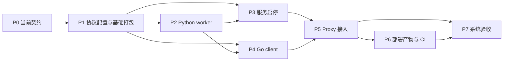

# PyUDF Worker Pool 第一版开发计划

- **创建日期：** 2026-09-14
- **更新日期：** 2026-09-15，按简化 client、单 Execute RPC 和进程直接退出的设计重新规划。
- **状态：** P0–P5 已完成；P6–P7 待执行。P5 验证记录见第 7 节（2026-09-16）。
- **实施依据：** [P0 契约与来源审查](20260915-pyudf-worker-pool-p0.zh-CN.md) / [中文设计](20260914-pyudf-worker-pool.zh-CN.md) / [英文设计](20260914-pyudf-worker-pool.md)

## 1. 交付目标与实现基线

交付 Proxy 上的一条完整路径：启动 Python 服务、通过同步 Execute 执行 UDF、Milvus 退出时终止并回收 Python 子进程。

```text
Proxy.Init
  -> pyudf.StartSupervisor
  -> enabled + 进程级 sync.Once
  -> Go 用 argv 启动 Python supervisor（不传父 PID）
  -> cmd.Start 成功即返回；worker 异步初始化

PyUDFExpr.Execute
  -> FileResource 快照解析完整 UDFPath
  -> 简单 Go client 发起 Execute
  -> worker gRPC 接纳请求，handler 直接运行共享 UDF 实例
  -> Arrow IPC 返回，表达式 / MapOp 校验结果

Milvus 退出
  -> Proxy.Stop 发送 SIGTERM
  -> supervisor 停止补齐，终止 workers
  -> 不等待 executor，不调用用户 close
  -> waitpid / Wait 回收进程
```

配置由 `configs/milvus.yaml` 和 Go paramtable 管理；Python 只接收 argv。连接数、worker 启动数及每 worker 的 gRPC 并发数默认分别为 10、1、10：

```yaml
function:
  pyUDF:
    enabled: false
    address: "127.0.0.1:19090"
    rpcTimeout: 30s
    connectionPoolSize: 10
    maxMessageBytes: 67108864
    server:
      workerCount: 1
      grpcConcurrency: 10
      maxConcurrentRPCs: 100
      shutdownTimeout: 30s
```

这些配置已在 P1 中加入 YAML/paramtable，P2 已实现单 worker 执行；P4 已实现生产 Go client，P5 已接通 Proxy Execute。PyUDF 启用配置独立于 FileResource 模式；资源下载仍由 FileResource 自己的配置控制，执行时按实际快照解析资源。地址、字段范围和 wire 限制以 P0 为准。

| 边界 | 本版实现 |
|---|---|
| 服务接口 | 业务接口仅 Execute；同端口保留标准 Health/Check 供按需查询，不主动检测 |
| Go client | 每次调用发起 RPC；复用配置数量的连接，没有并发额度、接纳限制、队列、限流或 worker 选择 |
| Worker 并发 | 仅配置 gRPC executor 的 max_workers 和 maximum_concurrent_rpcs；不增加额外并发控制层 |
| 实例共享 | 同路径/stage 一个实例；首次加载同步，执行不串行加锁；用户保证并发安全 |
| RPC 超时 | 本次调用失败；运行中的用户调用自然结束，保留引用及 gRPC 额度；不杀 worker、不重放 |
| Milvus 退出 | 直接终止整个 pool；SIGTERM 后超时未退出升级 SIGKILL，worker 按信号直接退出 |
| 文件定位 | Go 传完整 LocalPath；Python 不管理 FileResource 目录，不支持活跃调用期间删除/替换 |
| 接入范围 | 仅 Proxy；DataNode、独立 role、远程文件分发和按请求强制取消留在后续讨论 |

P1 已加入完整配置、单 Execute 的 Go/Python 生成代码、启动参数及 Health/Check，并保留轻量包入口。PyUDFExpr 已使用 Client.Execute；Python 提供 worker 执行与实例缓存；supervisor 和 Proxy 启停、共享连接关闭均已接入。旧 Runtime/Lease、Go 实例缓存及未实现占位入口已删除。embedded CPython 删除已完成，不重复安排这一工作；后续只清理被替换的旧接口和残留引用。

## 2. 阶段重排与依赖

保留 P0–P7 编号以对应 P0 中的验收表，调整各阶段职责和完成门槛。编号不是强制串行执行顺序。

| 阶段 | 开始依赖 | 主要交付物 | 完成门槛 |
|---|---|---|---|
| P0：实施契约 | 已完成 | 最新协议、默认值、错误表、退出策略 | 后续实现按当前契约执行 |
| P1：协议、配置和基础打包（已完成） | P0 | 单 Execute proto、生成流程、配置/argv/标准 Health/Check、可安装基础 wheel | 两端生成模块可用，默认值与参数一致 |
| P2：Python worker（已完成） | P1 | handler、IPC、共享实例、来源明确的错误、worker 信号退出 | 真实单 worker 服务通过功能/并发/失败测试 |
| P3：完整服务启停（已完成） | P1；真实联调需 P2 | Python supervisor + Go 启停入口、直接监听、进程补齐、终止回收 | Go 测试进程能启动真实 workers 并通过退出故障测试 |
| P4：简单 Go client（已完成） | P1；真实联调需 P2 | Client.Execute、固定连接数复用、IPC、超时和错误转换 | Go client ↔ 真实 Python worker 互通，不等到 Proxy 接入再验证 |
| P5：Proxy 接入与旧接口清理（已完成） | P2、P3、P4 | Proxy.Init/退出接线、FileResource 路径、client 替换与连接关闭 | 默认 10/1/10 的真实 Search 路径完整可用 |
| P6：部署产物与 CI | P5；打包基础已在 P1 | wheel 安装、镜像、干净构建和 CI 入口 | 新环境通过安装产物运行 Proxy + workers |
| P7：交付验收与性能基线 | P5 可开始；最终依赖 P6 | 故障验收记录、完整错误传播、退出验证、性能基线 | 在实际交付产物上完成全部必验项 |



主要调整：P1 提前解决 wheel 和生成依赖，P3 包含 Go/Python 两端启停，P4 完成真实跨语言 RPC 联调，P5 集中做 Proxy 接线。模块测试随阶段完成，P7 负责部署级组合故障及最终回归，不把所有失败路径推迟到最后。性能工作先建立基线，不把自动调优、请求级负载均衡或新调度器加入交付范围。

## 3. P1：协议、配置和基础打包

**代码范围：** [pkg/proto](../../../pkg/proto/)、[generate_proto.sh](../../../scripts/generate_proto.sh)、[Makefile](../../../Makefile)、[milvus.yaml](../../../configs/milvus.yaml)、[function_param.go](../../../pkg/util/paramtable/function_param.go)、[pyudf/config.go](../../../internal/util/function/pyudf/config.go)、[Python 打包配置](../../../internal/util/function/pyudf/python/pyproject.toml)。

- 定义独立的 worker proto，仅有 unary Execute；请求包含完整 UDFPath、参数及 inputs IPC，响应为 outputs IPC 或仅含 code/message 的 ExecuteError。
- 保留 FunctionParamObject 的递归值语义；定义生成依赖和模块导入方式，不依赖客户端 pymilvus 包提供 Python 协议代码。
- 增加上述 YAML/paramtable 配置，连接数/worker 数/gRPC 并发数默认分别为 10/1/10；定义 Go 有效配置到 Python argv 的映射，不增加 Go 并发配置。
- 保留标准 Health/Check 服务接口，不增加 Go 主动轮询；不传父 PID，不再使用 READY 消息或控制 FD。
- 固定 grpcio/Protobuf/生成工具版本，保留 PyArrow 版本约束；把生成模块及依赖纳入 wheel。
- 调整包入口的立即导入行为，使 supervisor 后续能够在 fork 前保持无 grpc/PyArrow/用户模型导入；保留仍需使用的 helper API。

**验收：** 生成可重复；基础 wheel 在隔离 Python 环境能导入生成模块；两端参数映射与标准 Health/Check 互通；默认连接数/worker 数/gRPC 并发数为 10/1/10、非法值被拒绝；自定义 proto 仅定义 Execute，Health 使用标准 health/v1。配置覆盖只由 Go 处理，Python 获得完全相同的有效值。此阶段不宣称已有可执行 UDF 服务。

### P1 完成记录（2026-09-15）

- 新增 [pyudf.proto](../../../pkg/proto/pyudf.proto) 及 Go/Python 生成产物，只包含 Execute；参数复用公共 FunctionParamObject，Python wheel 自带 schema/common 依赖。
- YAML/paramtable 默认值、Go Config 校验、SupervisorArgs、Python argparse 和两端 Health/Check 已实现。连接数/worker 数/gRPC 并发数默认分别为 10/1/10，没有 Go 并发控制。
- Python 依赖固定为 grpcio/grpcio-tools 1.74.0、protobuf 6.31.1、PyArrow 23.0.1；包入口延迟加载。生成与验证方式见 [基础包说明](../../../internal/util/function/pyudf/python/README.md)。
- 验证通过：Python 测试；完整 PyUDF Go 包（包含显式启用的 Go/Python argv、Health/Check 和 Protobuf 互通）；PyUDF 表达式回归；pkg 模块配置相关测试；ruff；wheel 构建及隔离安装导入检查。六个新 Go/Python 生成文件重复生成后逐字节一致。
- 本机使用 `/tmp/milvus-pyudf-p1-venv` 隔离依赖，未修改现有 Python 环境。生成时复用已确认与 go.mod 相同的 API checkout `c39cddab3fac`，执行 make 生成目标并使用 `-o download-milvus-proto` 跳过重复下载。

当前只保留标准 Health/Check 接口；不传父 PID；不做启动就绪等待。原 READY codec、共享 mmap、Go 健康轮询及 startupTimeout 均已移除。

P1 的 unary 测试入口已在 P2 改为生产 worker handler，通过测试 wheel 执行 UDF，验证多 query IPC、零行 batch 和超过 4 MiB 的完整输入/输出；发送/接收消息超限由 gRPC 拒绝。P1/P2 完成时尚未接入 Proxy；P5 已补齐实际 standalone Search 和 SDK 错误传播验收，后续部署组合验证留给 P6/P7。

## 4. P2：单 worker 执行服务

**代码范围：** [Python runtime](../../../internal/util/function/pyudf/python/milvus_pyudf_runtime/)及其 [tests](../../../internal/util/function/pyudf/python/tests/)。新增 worker/service/IPC 模块，复用并调整 loader、executor、context。

- 创建同步 grpc.server；handler 线程数使用 grpcConcurrency（默认 10），maximum_concurrent_rpcs 使用 maxConcurrentRPCs（默认 100）。直接在 handler 中接收输入、调用 UDF、校验和返回结果。
- 实现每请求一条完整 Arrow IPC stream、每 query 一个 RecordBatch；校验完整消息和 batch 布局；同一请求的 query chunks 顺序执行，保留重复输入位置和零行 chunk。
- 按完整路径/stage 缓存共享实例；同步首次创建及必要的模块登记，不增加执行锁、实例借还或自动副本。
- 在 loader/executor 错误产生点区分用户执行、包/输出契约、资源 I/O、协议及 runtime 错误。decimal32 在输出序列化前拒绝；null score 的目的列语义保留给 MapOp。
- RPC 超时/取消时尽力跳过未开始的操作，已进入调用自然返回；运行期间不提前释放输入或共享实例，也不增加自定义并发计数。
- worker 完成 server.start 后设置本地服务状态，Health/Check 仅供按需查询本 worker；收到退出信号时直接终止进程，不等待 executor/用户 close。

**验收：** 用真实 gRPC 服务及测试 wheel 验证正常输出、错误输出、普通异常后恢复、IPC 截断/尾随数据和消息大小边界。使用默认 grpcConcurrency=10 验证同实例调用重叠、多 UDF 和首次加载竞争；执行线程占满后，请求在 executor 内置队列等待；在途 RPC 达到 maxConcurrentRPCs 后再拒绝，且排队期间超时的请求不执行 UDF。

分别验证两个行为：服务期间 RPC 已超时但 handler 未返回，gRPC 额度仍被占用；父进程通知退出时，保持任务阻塞也能结束 worker。实际依赖版本必须重跑，P0 的机制实验不替代本阶段测试。

### P2 完成记录（2026-09-15）

P2 后续结构调整：以 `WorkerServer → PyUDFWorkerService → PyUDFLoader → PyUDFInstance` 组合服务对象，分别持有服务资源、请求处理、加载缓存和用户调用行为；原 wrapper/executor 合并为 instance，移除 embedded 过程式导出及 resource_identity 参数。无状态 codec/错误编码继续使用函数；并发、超时及错误分类契约不变。详见 [runtime 结构说明](../../../internal/util/function/pyudf/python/README.md#p2-单-worker)。

结构调整后 39 项 Python 测试通过，包含跨 loader 的包占用保护、缓存归属及真实 Health/Check 状态变化；Go PyUDF 包的真实 worker 调用、wheel 构建和临时目录安装均通过。以下保留原 P2 完成时的验证记录。

后续简化已验证：stage 原样透传；删除 ExecuteRequest.protocol_version 并保留字段号/名称为 reserved；Health 服务名直接读取 proto 服务定义。40 项 Python 测试及 Go 跨语言测试通过，包含携带已删除字段的请求仍可执行、标准服务名健康检查及真实 UDF 调用。

加载逻辑按正常请求简化：短锁定位缓存条目，再在条目锁内检查、创建并缓存实例；失败不发布实例，锁在异常路径也会释放。每模块导入锁处理跨 stage/loader 的正常并发，等待期间检查 RPC。移除初始化事件、结果/异常状态、线程归属与依赖图，并删除人为回调 loader 的重入测试。保留正常并发创建、取消、失败重试、包冲突及真实 gRPC 等待 handler 退出的验证；简化后 45 项 Python 测试及 Go 跨语言测试通过。

- [worker.py](../../../internal/util/function/pyudf/python/milvus_pyudf_runtime/worker.py) 提供真实 unary handler、每路径/stage 一份共享实例、gRPC server 工厂和单 worker 进程入口。只有首次加载同步；普通 Execute 不借还实例或加执行锁。
- [ipc.py](../../../internal/util/function/pyudf/python/milvus_pyudf_runtime/ipc.py) 通过 PyArrow open_stream 读取、batch.validate(full=True) 校验数组并编码输出；保留零行输入 query 和 null，空输出列编码为零行空 batch。完整编码后由 gRPC 检查消息大小，不发布部分结果。
- loader 在打开/读取 wheel 时确定 I/O 类别，import/factory/用户属性异常保留 UDF 归属；PyUDFInstance 在序列化前拒绝 decimal32 等不支持类型，检查同一输出 batch 内各列等长。错误只发送 code/message，普通异常不重建 worker。
- 38 项 Python 测试通过，覆盖真实 wheel 重用、同实例并发、不同 UDF 的 factory 并行、首次加载竞争/等待取消、递归参数冻结、错误分类、IPC/消息限制、RPC 超时后的实际并发额度及后续 query 跳过。
- 进程测试验证收到信号时不等待阻塞 UDF、不执行 close/finally，并实际 wait 回收；也验证父进程消失不会自动结束服务，必须显式发送信号。

边界：Protobuf 自身的消息递归限制可能先于 worker 的逻辑参数深度校验拒绝深嵌套请求，此时返回 gRPC INTERNAL，handler 不会执行；Go 已删除重复参数校验，这类错误按 gRPC INTERNAL 返回并映射为 ServiceInternal(5)。本阶段验证的是 worker 协议 code，尚未证明完整 Search Status/SDK 的 merr 映射。

单 worker CLI 及 WorkerServer.run 已实现信号驱动的进程退出；P3 负责 fork 前保持父进程干净、子进程信号处理、进程补齐和回收，不做整池健康检测。

## 5. P3：完整服务启动与进程回收

**代码范围：** Python supervisor/进程控制模块，以及 [Go pyudf 包](../../../internal/util/function/pyudf/)中独立的进程创建和回收代码。此阶段先由 Go 测试进程调用，不接入 Proxy。

- Go 实现进程级 StartSupervisor：enabled 在 once 外，once 只包含进程创建、缓存创建错误；通过 exec.Command 参数数组启动 Python，不传父 PID。
- Go 直接启动 Python supervisor；Python fork workers，由 worker 直接监听配置地址；每个 worker fork 后独立初始化 gRPC，SO_REUSEPORT 共享唯一配置地址。
- Go/supervisor 不调用 Health；不使用共享就绪状态或启动超时。Health 仅报告被访问 worker 的本地服务状态。

**验收：** 可用可控子进程先验证按需健康查询、显式信号和超时等边界，但阶段完成必须使用 P2 的真实 worker。Go 测试进程能重复并发调用入口且只启动一次；进程创建失败缓存、disabled 不消耗 once；普通绑定失败可见；SO_REUSEPORT 下重复 pool 可能共存，地址独占由部署保证。

故障测试覆盖：显式信号关闭、父进程消失不自动退出、worker 退出后补齐、阻塞 UDF 随 pool 终止、SIGTERM 被忽略后的 SIGKILL、不调用 close/atexit、停止期间不补齐、普通绑定失败、重复 pool 误配边界与重复回收。以进程实际退出及 wait 结果验收，不以“已发送信号”代替成功。跨网络/挂载命名空间测试需要对应容器环境；缺失的环境验证留为 P7 必验项。

### P3 完成记录（2026-09-15）

当前生命周期按信号驱动：入口仍在 supervisor.go，Proxy.Init 末尾直接创建子进程，Proxy.Stop 在调度器关闭前发送 SIGTERM 并等待 supervisor。Python 已删除父 PID 轮询和 parent-pid 参数；55 项 Python 测试、PyUDF Go 测试及 Proxy 退出集成测试通过，验证真实 supervisor/worker 均被回收，且取消 Proxy context 不阻止信号发送。Proxy 启停接线已完成，P4 已完成生产 Execute client；P5 已切换表达式并删除旧接口。

- 最新启动语义：保留标准 Health/Check 供外部按需查询，不做任何主动健康检测；Go 创建进程成功后立即返回，删除 Go 健康轮询、共享 mmap、整池就绪回调和 startupTimeout。57 项 Python 测试、Go PyUDF/配置测试与异步启停 race 检查通过；Go 启停部分通过 Darwin arm64/amd64 交叉编译，macOS 原生运行仍未验证。
- [supervisor.go](../../../internal/util/function/pyudf/supervisor.go) 提供进程级 StartSupervisor/StopSupervisor，禁用不消耗 once，启动错误缓存；启动 context 不控制就绪后的服务生命周期，关闭调用者取消后清理仍继续。
- Go 启停实现收敛到 supervisor.go：通过 `python3 -I -m ...supervisor` 启动 Python，cmd.Start 成功后立即返回；退出只向 supervisor 发送 SIGTERM 并由唯一 cmd.Wait 回收。不传递 FD、不探测端口、不管理进程组。
- [supervisor.py](../../../internal/util/function/pyudf/python/milvus_pyudf_runtime/supervisor.py) 的父进程不导入 grpc/PyArrow、不启动后台线程，fork 后先重置信号，再创建真实 worker。不共享整池就绪状态，也不主动检测 Health。
- worker 退出先 waitpid，再按 100ms–3.2s 指数退避补齐；存活 10s 后重置退避。运行期 fork 失败继续退避；存活但未监听的 replacement 不主动替换。
- 收到退出信号后停止补齐并终止 workers；不等待用户执行、close 或 atexit。Python 到 shutdownTimeout 后升级 KILL 并回收 worker；Go 只通知 supervisor 并等待，调用者取消后 Python 清理和 Go Wait 仍继续。
- Linux 故障测试已验证：创建进程后立即返回、直接监听及绑定失败重试、重复 pool 可能共存的边界、fork/初始化失败重试、正常退出、父进程消失后服务仍存活直到显式信号、阻塞 UDF 与忽略 TERM 的退出、补齐失败重试。异常父退出测试的 subreaper 仅用于测试回收断亲进程，产品不启用它。
- Go 已验证并发启动/关闭、错误缓存、创建前取消、异步退出不改写创建结果、关闭等待者取消后继续清理，以及真实 supervisor/worker 的 Health 和 Execute。端口保护已移除，部署要求独占地址；Health 不提供进程身份保证。
- 最终在隔离 Python 3.12 环境安装构建的 wheel，57 项 Python 测试及 Go PyUDF 包测试通过；安装产物集成测试额外验证真实 `python3 -I -m` 生产启动命令、成功 Execute 及退出。wheel 构建安装、ruff 和 Go 格式检查通过。

平台调整：Go/Python 不做操作系统名称检查，直接使用所需的进程接口，Go 集成测试改为 supervisor_test.go，PID 检查使用 ps/kill 而非 /proc。Python 通用生命周期测试同时面向两平台；只有 Linux 测试回收孤儿进程时使用 subreaper，macOS 交给系统回收后检查退出。当前 Linux 回归通过，macOS 原生运行尚未验证；整个包的 Darwin 交叉编译仍受原有 C/C++ 依赖限制，Go 启停部分（config/supervisor 及对应测试）已通过 Darwin arm64、amd64 交叉编译。

边界：Proxy 进程启停已接入；P3 不替换生产 Runtime/Lease；Go Execute client 已在 P4 完成；完整 Search 错误映射、镜像交付和跨网络/挂载命名空间测试留给 P4–P7。任意用户派生进程、不可中断内核等待和 异常退出绕过信号通知 的清理由部署环境兜底，不作严格有界承诺。

## 6. P4：简单 Go client 与跨语言互通

**代码范围：** [Go pyudf 包](../../../internal/util/function/pyudf/)的 Client 接口、连接复用、IPC 和错误转换；不包含进程启动或任务调度。

- 定义 Client.Execute 和 Go ExecuteRequest 适配结构，包含 ResourceName、UDFPath、Stage、Params、Inputs。
- 复用 connectionPoolSize 个独立 ClientConn，默认 10；单一配置在进程内共享连接，部分构造失败回滚；每次 RPC 选择一次连接，单次 RPC 固定使用它。
- 每次调用都发起 RPC；不加并发上限、接纳信号量、限流、队列或 worker 选择。连接数只决定复用连接数量。
- 实现 Arrow IPC 双向传输；rpcTimeout 覆盖编码到解码全过程，尊重更早的调用者 deadline。按 P0 校验完整消息、响应 result、IPC 布局与最终 gRPC 状态。
- 处理 unary RPC 的结构化错误和最终 gRPC 状态，完成 Arrow 引用及失败结果清理。失败请求不改连接重放，单次超时不关闭共享连接。
- 按 P0 错误表转换来源及状态；按 ExecuteError.code 映射，message 仅提供上下文；保留 context 取消/超时代码，未知内部错误不能落入旧的 2400 兜底。

**验收分两层：** 可控测试 gRPC 服务验证所有并发调用到达服务端、Go 无本地接纳上限、连接轮询/单次调用固定连接、连接数不随调用数增长及部分初始化回滚；真实 P2 worker 验证 Go↔Python IPC、递归参数、用户错误和 gRPC 拒绝/超时。

完成门槛是在独立于 Proxy 的 Go 集成测试中，传入真实 wheel 的绝对路径并完成 Execute，覆盖正常返回、decimal32=2400、资源 I/O、RPC 超时和服务已执行后的断链无业务重放。RPC 层结果以 merr 校验，完整 Search Status/SDK 验证留给 P5/P7。

### 并发配置拆分验证

已将执行线程数与接纳额度分开：grpcConcurrency 默认 10，maxConcurrentRPCs 默认 100，经 YAML → paramtable → Go argv → Python ServerConfig 传入 worker。两项均为正整数、重启生效；不增加自定义队列或 Go 并发控制。56 项 Python 测试、Go PyUDF 协议回归和安装产物的 Go supervisor 启动测试通过；真实 gRPC 测试以 2 个线程、3 个在途 RPC 验证排队、第 4 个请求拒绝和排队超时后不执行 UDF。

### Client 简化

连接管理收敛为进程内一个共享 Client，删除 connectionKey、多配置连接池 map 和 clientConnections 包装；Client 只保存调用所需配置和连接。NewClient 在客户端层初始化和复用，supervisor 不发布 client。CloseClients 统一关闭这组连接。Execute 主流程调用编码、RPC 和错误/结果处理，错误转换移到 client_errors.go；Go 参数校验已交给 worker/protobuf，删除 params.go、旧请求构造/序列化接口及其测试；client 直接透传参数。IPC 布局/长度校验、Arrow 引用释放和超时优先级保持不变。简化后 56 项 Python 测试、Go PyUDF 完整协议回归（含安装产物启动）和 Client race 测试通过。

参数校验清理后，56 项 Python 测试和 Go PyUDF 完整协议回归（含安装产物启动）通过；真实 RPC 覆盖未设置参数、空资源名、非法路径、UTF-8 编码错误和 protobuf 深度超限，错误按 worker/gRPC 结果映射为 5；空嵌套对象/数组与任意 bytes 按 protobuf 语义透传。

列数限制已移除：Go/Python 均不再定义 MaxColumns/MAX_COLUMNS，也不再按固定列数限制 IPC FieldNode/Buffer 数量；只检查元数据实际边界。输入仍需至少一列，输出允许零列，完整消息大小限制保持不变。新增 2048 列 Go → Python UDF → Go 回归，覆盖零行和普通 query。

Query 数量上限已移除：Go/Python 均不再定义 MaxQueryChunks/MAX_QUERY_CHUNKS。每请求仍须至少一个 query；消息大小和各自的 IPC 布局检查保持不变。新增单次 16385 个 query 的真实 Go → Python → Go 回归，交替使用零行和普通 query。

输入 IPC 仅编码唯一的 Arrow 列；Go 按共享列对象身份去重，通过 input_column_indices 记录每个 UDF 参数对应的 IPC 列。Python 按索引恢复参数顺序，重复参数引用同一个解码数组；空索引列表沿用 IPC 原列顺序。移除本地 IPC 编码预算，仅保留两端 gRPC 的完整消息大小限制。Go 与 worker wheel 必须配套更新，旧 worker 不识别列引用。

通用输入/输出布局解除绑定：Go 编码不再返回 rows 数组，解码不比较输入/输出 batch 数或行数。Python execute_query 移除 expected_rows，按 UDF 实际返回数组生成结果；保留同一输出 batch 各列等长的 Arrow 约束。当前逐 query 调用方式允许 n→m 行变换，未新增批量 transform 调用接口；client 已接受不同数量的输出 batches。空输出列编码为零行空 batch。rerank 的按行对应规则留在上层 PyUDFExpr/MapOp，不作为通用 worker 协议限制。

Arrow 解析规则统一采用库实现：Go 删除 validateOutputFrames、validateOutputArray 和解码类型/列名白名单，直接使用 ipc.Reader；Python 删除预扫描和 _compressed，直接使用 open_stream 与 batch.validate(full=True)。发送端仍默认输出无压缩 stream，接收端不另行拒绝库支持的压缩、缺少显式 EOS 或尾随数据。不再承诺解码前提前拒绝所有畸形长度。UDF 实例的返回类型与同一 batch 各列等长约束属于调用接口，保持不变。更新后的 56 项 Python 测试和 Go PyUDF 回归通过，覆盖压缩/字典 IPC、无显式 EOS、尾随数据、任意列名、Go 解码非原白名单类型以及解析失败。

### P4 完成记录（2026-09-15）

- `NewClient(Config)` 获取进程级共享 client；进程只维护一个共享 Client 和一组固定连接，保存 address/rpcTimeout/maxMessageBytes；删除多配置连接池 map。重复创建复用同一个对象，执行配置不一致时明确报错，要求重启。连接创建失败回滚，不等待就绪。
- `Client.Execute(ctx, ExecuteRequest)` 每次选择一次连接，执行单 unary RPC；没有 Go 队列、并发额度、业务重放、Health 探测或 supervisor 调用。`CloseClients()` 供进程统一关闭连接，P5 接入 Proxy，表达式不需要逐实例释放。
- `client_ipc.go` 编码完整 Arrow stream，按 query 保留零行和重复列；解码直接使用 Arrow reader，并保留返回数组引用；不手工扫描帧、EOS、压缩或数组内存布局。失败不返回部分结果。输入/参数由调用者在同步调用期间保持有效且不修改；成功输出由调用者 Release。
- 超时覆盖编码到解码，批次间和结果发布前检查 ctx；单次 Arrow 编解码不会被后台 goroutine 强制抢占，超时可能要等当前操作结束，但不发布过期结果，也不留下后台读取输入。
- 已审查 Python loader/instance/handler 的错误产生点。worker 分类映射到既有 merr；gRPC ResourceExhausted 保留来源不确定的 12，Unavailable 为 2；超时/取消为 10001/10000。`merr.Combine(transportError, category)` 保留上下文及代码，不能换成 `errors.Join`，当前 merr 的代码遍历不识别后者。
- 参数内容和逻辑深度由 worker 检查，UTF-8 和 protobuf 解码深度由 protobuf 处理；Go 不再提前返回 1100。真实 Python 测试验证 32 层嵌套对象加叶子可解码，第 33 层由 gRPC 返回 INTERNAL，client 映射为 5。
- 测试覆盖真实 worker 的多 query、零行、超过 4 MiB 结果、decimal32=2400、用户 OSError=2400、文件不存在=1000、权限不足=1005、读取目录=1001、MemoryError=3、SystemExit=5，以及超时后其他调用可继续。
- 受控服务验证所有错误分类和 Retriable、畸形响应、IPC/消息超限、连接共享/部分构造回滚；单连接 12 个请求同时进入 handler，3 连接轮询分布；已执行并发送 headers 后断链不重放。原并发回归显式设置 maxConcurrentRPCs=10，验证单连接 10 个阻塞调用占满接纳额度，第 11 个被拒绝；取消 RPC 不提前释放运行中的 handler 额度。

验证结果：55 项 Python 测试和 Go PyUDF 协议回归通过；最终 Client 测试（含 `-race`、真实 worker、连接恢复）及 pkg/util/merr 全部测试通过，格式/文档链接检查通过。全量 Go 回归使用 `make -o build-cpp-with-unittest test-go` 复用现有 C++ 库，在 `internal/proxy.TestProxy` 启动 MixCoord 时因端口 22125 被占用而失败，记录失败后停止剩余全量测试；不停止已有服务来解除该冲突。

本阶段完成的是 Go client 到 worker 的调用。P5 已完成表达式切换、Proxy 关闭连接接线和 standalone Search 验证；跨部署和完整组合故障仍由 P6–P7 验收。

## 7. P5：Proxy 接线与旧接口清理

**代码范围：** [pyudf_expr.go](../../../internal/util/function/chain/expr/pyudf_expr.go)、[proxy.go](../../../internal/proxy/proxy.go)、[roles.go](../../../cmd/roles/roles.go)、[client.go](../../../internal/util/function/pyudf/client.go)、[resource_info.go](../../../internal/util/function/pyudf/resource_info.go)及相关测试。

- Proxy.Init/Stop 已直接调用 P3 入口；PyUDF 启动不检查 FileResource 模式，也不等待资源快照或 UDF factory。
- PyUDFExpr 按配置创建轻量 client；执行时从 FileResource 快照读取 LocalPath，规范化为绝对 UDFPath，调用 Client.Execute。
- 替换 Acquire/Run/Release，删除已无调用者的 Runtime/Lease、生产未实现入口和旧构造路径；保留 FileResource 快照解析，删除旧缓存使用的 identity/订阅接口。
- 将 P3 的退出入口接到进程级关闭流程：停止 Proxy 新提交后通知 Python 退出，结束客户端 RPC/编码并关闭连接；不等待 Python 执行完成。异常 os.Exit/SIGKILL 由部署环境处理，Python 不自动跟随退出。
- 保留 MapOp 的目的列数、score 数值和 null 校验；执行错误经 FunctionChain/Search 原路径传递，不 stringify 或重新包装成通用错误码。

**验收：** 通过实际 FileResource 下载 wheel，在默认连接/worker/并发分别为 10/1/10 的配置下完成 Proxy Search。验证 disabled 不启动 Python、进程创建失败向调用方返回错误；不因 worker 就绪等待阻塞 Proxy、请求路径不启动进程、缺快照/缺资源、输出与 score 错误的完整 Status。关闭含阻塞 UDF 的测试 Milvus，确认 P3 回收机制通过真实 Proxy/进程入口触发。

此阶段完成第一个 Proxy 功能里程碑；standalone/cluster 的组合故障、正式镜像与全部 SDK 验收仍需 P6/P7。

### P5 完成记录（2026-09-16）

- PyUDFExpr 使用共享 Client.Execute；每次执行从 FileResource 最新快照读取 LocalPath 并转为绝对路径。没有从请求路径启动 Python，也没有 Go UDF 实例缓存。
- 删除 Runtime/Lease、Cache/ResourceLoader、全局 Runtime provider、未实现占位实现及其专属测试；FileResource 快照保留版本更新与资源查找，删除旧实例缓存使用的 observer/identity 逻辑。
- Proxy.Init 按 PyUDF enabled 启动服务，不与 FileResource 模式做联动校验；资源未就绪或不存在时，由执行时的快照解析返回对应错误。不等待资源快照或 worker Health。
- Proxy.Stop 先通知 Python 终止 worker，再关闭调度器、共享 gRPC 连接并继续其他清理。关闭错误不跳过后续清理。
- L2 rerank 的输入/输出行对应约束保留在表达式，MapOp 保留目的列数、score 数值和 null 校验；通用 client/worker 继续支持 n→m。typed merr/context 原样加上下文，未分类 client 错误映射到 ServiceInternal，不回退到 2400。

验证：

- FunctionChain 全部 Go 单元测试、PyUDF Go 回归、56 项 Python 测试、实际安装包 supervisor 启停及 Proxy 生命周期测试通过。
- 用新构建的 Milvus 在独立 standalone 实例执行完整 `test_milvus_client_pyudf.py`：6 项通过，覆盖 MinIO wheel 上传、FileResource 实际下载、真实 Search rerank、多 UDF、派生列、递归参数、资源移除、UDF 异常、decimal32、输出数量/行数/schema/score/null 错误与后续恢复。更新原 embedded 错误文本断言以匹配当前 code/message 协议。
- 使用独立 collection/resource 做 SDK 故障注入：快照中不存在资源返回 1100；下载后首次执行前临时移走本地 wheel 返回 1000，恢复文件后返回正确分数 [20,40,60]；配置 rpcTimeout=2s，阻塞 UDF 约 2.01s 后返回 10001，随后其他请求仍成功。
- RPC 超时后 UDF 继续阻塞，再向测试 Milvus 发送 SIGTERM；约 4.31s 内 Milvus、supervisor、worker 均退出并回收，UDF finally 未执行。退出测试使用 shutdownTimeout=3s，连接/worker/线程/RPC 接纳默认 10/1/10/100。
- 测试使用独立端口、/tmp 数据目录、etcd 前缀和 MinIO bucket；测试进程与远端测试数据已清理。pytest 自动插件因本机旧 pytest-html 不兼容而禁用，测试本身完整执行。

边界：本次是 standalone 实际验收；原有全量 Go 回归的端口冲突记录仍保留，未宣称整个仓库测试通过。独立 Proxy 集群部署、macOS 原生运行、正式镜像和更全面的断链/资源组合故障仍属于 P6/P7。FileResource 的既有文件回收时序未修改；运行中的用户代码强制终止仅发生在进程退出阶段。

## 8. P6：部署产物与 CI

**代码范围：** [Makefile](../../../Makefile)、[install_milvus.sh](../../../scripts/install_milvus.sh)、[Docker 构建目录](../../../build/docker/)、Python 打包与 CI 入口。

P1 已解决可安装基础 wheel，本阶段补齐实际部署：安装 supervisor/worker 入口及全部生成依赖；明确解释器路径和固定依赖；镜像中使用隔离 Python 模式启动，不依赖开发者 PYTHONPATH 或用户 site-packages。

接入 helper/service、Go client/lifecycle 和 worker E2E 检查；干净构建验证无旧 embedded PyUDF C ABI、native stub 或 libpython 链接。复用现有 wheel 构建/安装目标，不另建重复打包流程。运行说明写清默认 10/1/10、FileResource sync、完整路径可见性和退出直接终止的行为。

**验收：** 在新环境仅安装交付产物即可启动 Proxy + workers 并执行 Search；禁用/非 Proxy 模式不触发 Python 启动；必要的操作系统、端口、对象存储等环境条件明确声明，核心测试不静默跳过。

## 9. P7：交付验收与性能基线

各阶段已完成模块故障测试，这一阶段在 P6 产物上完成部署级复核。保留 P0 第 7 节 S/O/W/E/L/R 测试组，按下面的责任划分汇总证据。

| 验收组 | 模块证据主要来自 | 最终必验项 |
|---|---|---|
| S：启动 | P1、P3 | standalone/cluster Proxy、配置覆盖、创建后立即返回、无主动 Health 请求、一次创建、异步退出状态 |
| O：监听与进程 | P3 | Linux/macOS 直接监听、绑定失败、误配端口边界、显式信号退出、父进程消失不会自动结束后代进程 |
| W：传输 | P2、P4 | 多 query/多列、零行、重复位置、完整消息超限、畸形 IPC、缺 result 及错误时无输出 |
| E：错误 | P2、P4、P5 | P0 错误表逐项从源头追踪到 Search Status/SDK；代码、Retriable、ExtraInfo 均正确 |
| L：生命周期 | P2、P3、P5 | RPC 超时不杀 worker；Milvus 退出终止阻塞 UDF、不等 executor、不调用 close；SIGTERM/SIGKILL、waitpid、停止不补齐 |
| R：连接与重放 | P4 | 无 Go 并发门槛、固定连接数、连接恢复不重放已执行请求、单次失败不影响其他 RPC |

Go 无本地并发上限的测试使用可控测试服务接收所有调用；真实 worker 超过 gRPC 限制时允许框架拒绝，不能要求每个调用都进入用户 handler。容量由 gRPC 框架决定，验收不新增业务 admission 层。

退出测试保持 UDF 阻塞再发送退出信号，不能先释放 UDF 制造回收成功。普通 RPC 超时测试则在 Milvus 保持运行时确认 worker 未被杀。测试环境兜底 kill 不计作产品通过；绕过信号的异常退出、内核不可中断等待及任意用户派生进程的回收，按设计限制记录，不作有界退出承诺。

性能先测默认 10/1/10，再分别提高连接数、worker 数和 gRPC 并发数，记录首次/缓存加载耗时、吞吐、p50/p95/p99、真实 TCP 数、各 worker 请求分布及 RSS。多连接不保证均匀分配，连接数不等于并发额度；不增加自动扩缩容或请求级调度。基线及可复现配置是本版交付物，进一步性能优化单独安排。

FileResource 活跃删除/替换不在支持范围；SDK 对整个 Search 的重发不受 Go client 的不重放保证覆盖。验收报告不得将这两项写成已解决。

## 10. 实施顺序与交付门禁

建议开发顺序为：**P1 → P2/P4 → P3 → P5 → P6/P7**。P3 的进程控制代码可以在 P1 后准备，但真实启停验收依赖 P2；P4 也可先用测试服务开发，完成必须经过真实 worker 联调。各阶段以依赖和验收条件安排顺序。

每阶段形成独立可审查提交；Go 与 Python 的同一契约变更放在同一批次验证。P1–P4 期间生产入口仍明确不可用；P5 接通后，完成 P6 交付产物及 P7 验收才能宣称第一版交付。P0 不重复执行，若实现证据推翻某项契约，先更新契约及两份设计再调整代码。

验证遵守 G1–G4：审查所有新错误产生/包装点，逐类追踪真实失败路径，审查声明仅包含有证据的行为；重点复核混合来源的 Python 异常、晚返回的引用、父子 FD、信号发送与实际回收之间的差异。修改 wire projection、oldCode 映射或指标标签时运行 merr guard tests 和完整 make test-go。

Go 测试统一使用 `-tags dynamic,test -gcflags="all=-N -l" -count=1`。生成 Go proto 使用 `make generated-proto-without-cpp` 对应流程，不手改生成文件。Python 格式、helper/service/wheel 检查随阶段执行；模块检查已通过且没有新风险时不重复扩大测试范围，最终用真实部署补齐跨进程/SDK 证据。

后续提交关联真实 issue 和设计文档，不虚构验证记录或固定工期。当前下一步是 P6：部署产物与 CI，再完成 P7 组合故障与性能验收。本次使用独立测试实例，已有 Milvus 未重启；测试实例、独立 MinIO bucket 和 etcd 前缀已清理。

## 测试职责调整

Go UT 不依赖 Python 环境，不再保留 Python 解释器选择开关或从 Go 启动 Python 的跨语言用例。Go client 用 Go gRPC 服务验证并发、错误、大小限制与 IPC；Go supervisor 用当前测试二进制模拟子进程，覆盖 once、信号、异常退出、取消等待及回收。真实 Python worker/supervisor 由 Python 测试验证，安装产物和完整调用链复用现有 Python E2E。上文历史验收记录不代表仍保留相应 Go 跨语言测试入口。
