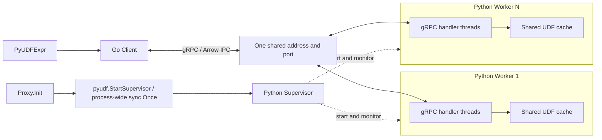

# MEP: PyUDF Worker Pool

- **Created:** 2026-09-14
- **Status:** P0–P5 complete; Proxy Execute integrated and validated with standalone Search
- **Component:** FunctionChain / PyUDF
- **中文版本：** [PyUDF Worker Pool 中文设计](20260914-pyudf-worker-pool.zh-CN.md)
- **Implementation status:** [Embedded removal and retained interfaces](20260722-pyudf-function-chain.md)
- **Implementation plan (Chinese):** [V1 milestones and acceptance](20260914-pyudf-worker-pool-plan.zh-CN.md)

- **P0 contract (Chinese):** [Defaults, startup, wire protocol, errors, and acceptance](20260915-pyudf-worker-pool-p0.zh-CN.md) (2026-09-15)

## 1. Scope and decisions

Implement PyUDF in Go and Python without a custom cgo/C++ execution bridge.
The Milvus OS process owns its supervisor. In v1 only Proxy calls the exported
pyudf.StartSupervisor function during initialization. It checks function.pyUDF.enabled and uses process-wide sync.Once
to create one supervisor process and return immediately. Disabled mode starts no Python. The supervisor manages
workers sharing one address/port. PyUDFExpr creates its own client from the configured address and never triggers
supervisor startup.

V1 follows these rules:

1. Milvus creates its supervisor and reaps it on exit; Python manages workers
   without executing UDFs or forwarding their data in the supervisor.
2. Go, the supervisor, and workers have no application task queues or custom
   task schedulers.
3. An admitted gRPC handler calls the UDF directly. Server configuration controls
   concurrency.
4. Each worker caches multiple UDFs. One instance is shared per full UDF path
   and stage. Users ensure thread safety of instance fields, module globals,
   and dependencies.
5. PyUDFExpr calls client.Execute; it exposes no Runtime.Acquire, Lease.Run,
   or Lease.Release lifecycle.
6. Client timeout means the call failed. There is no subsequent status query
   or automatic replay.
7. When the original RPC expires/disconnects, the worker skips work not yet
   started where possible. Running user calls return naturally while Milvus is serving; an RPC timeout
   does not kill workers. Milvus shutdown terminates the worker processes.
8. The worker pool is the sole implementation, with no embedded fallback.

Scope is Proxy-only L2 rerank and synchronous transform_query against a local
Python service started by Milvus. DataNode and other roles do not integrate UDF
execution or call supervisor startup in v1. Automated remote artifact distribution, shared memory, durable
recovery, automatic replay, per-request forced termination, and hostile-code isolation are
outside v1.

## 2. Components and call path



| Component | Responsibility |
|---|---|
| pyudf.StartSupervisor | Called directly by Proxy.Init; uses process-wide pyudf sync.Once and shares only the startup result, without creating/publishing an execution client |
| Process exit cleanup | Close/reap the shared service after all local consumers stop; no individual role owns it |
| Go Client | Created by PyUDFExpr from configuration for synchronous RPC, timeout, Arrow conversion/errors; no worker selection or queue |
| Python supervisor | Start/monitor/reap exited workers and restore process count; no UDF or job payloads |
| Python worker | Serve gRPC, load/cache UDFs, call directly in handlers, validate output |
| Existing FileResource manager/snapshot | Own downloads, directories, and file lifetime; client passes resolved full UDF paths through RPC |

Implemented in P4; expression integration follows in P5:

```go
func NewClient(config Config) (*Client, error)
func (c *Client) Execute(ctx context.Context, request ExecuteRequest) ([]*arrow.Chunked, error)
func CloseClients() error // Process shutdown, not per expression/request.

type ExecuteRequest struct {
    ResourceName string
    UDFPath      string // Absolute wheel path resolved by FileResource.
    Stage        string
    Params       *schemapb.FunctionParamObject
    Inputs       []*arrow.Chunked
}
```

This Go adapter object is not the generated Protobuf message. UDFPath is required:
Go request assembly fills it with the full FileResource LocalPath, serialized
as RPC udf_path. It is not the remote storage path in FileResource.Path.
ResourceName is identity/log/context metadata, not the file locator. Reject a
missing UDFPath rather than guessing directories from the name. PyUDFExpr
validates input, assembles the request, calls Execute once, and validates output. One call contains all query
chunks of that expression invocation; chunks run sequentially within a request,
and dependent FunctionChain expressions keep their original order.

PyUDFExpr reads address/rpcTimeout and constructs a lightweight client/stub.
The client abstraction owns connection management. Supervisor startup returns
only its startup result and never creates/publishes an execution client.

The single restart-only configuration owns one process-shared Client holding
connectionPoolSize independent grpc.ClientConn objects directly.
Every connection targets the same configured address and is long-lived.
NewClient returns the same object to all expressions; conflicting execution
settings fail initialization instead of creating another pool. Connection count does not grow with traffic.

At the start of Execute, a concurrency-safe round-robin counter selects one
connection. Keep the RPC and all query RecordBatches on that selection.
Connections are not exclusively borrowed: each ClientConn can still carry
concurrent RPCs. Add no checkout wait, application thread pool, or task queue.
This rotates connections, not worker addresses from a gRPC resolver; the client
knows no Python worker IDs, addresses, or load reports.

Select once before sending. Each ClientConn handles establishment/reconnect;
return a failed RPC rather than replay it on another connection. If pool
construction partially fails, close created connections and publish no partial
pool. connectionPoolSize is positive and fixed for the process lifetime.
[gRPC performance guidance](https://grpc.io/docs/guides/performance/)

Each pooled ClientConn handles establishment, HTTP/2 multiplexing, and reconnects.
Expressions and individual Execute calls never close pooled connections.
After Proxy stops submissions and client-side in-flight RPCs finish, client-layer
shutdown closes every connection in the pool; no per-expression connection cleanup method is added to the
[FunctionExpr interface](../../../internal/util/function/chain/types/types.go).

Execute borrows inputs; before return, encoders still reading them must finish
or hold independent references. Successful outputs transfer to the caller;
partial/failed outputs are released by the client. Request completion does not
close the reused connection, stop the supervisor, or forcibly interrupt user code.

## 3. Process startup and shared port

Expose a package-level startup function from expr. It is not a method of an
individual PyUDFExpr. Keep the once state and process handle inside pyudf so
expressions do not each allocate their own once.

```go
// Called directly from Proxy.Init / Proxy.Stop.
func StartSupervisor(ctx context.Context) error
func StopSupervisor(ctx context.Context) error
```

Proxy calls it after parameter initialization and before becoming Healthy.
Do not add a role-capability aggregation table in cmd/roles or startup calls
in other components. Expression construction and Execute do not invoke it
either, keeping service cold-start work off the first request.

```text
Proxy.Init
  -> pyudf.StartSupervisor
     -> check enabled
     -> process-wide sync.Once
     -> create supervisor process and return
     -> return startup success / shared startup error
```

One sync.Once is shared by the whole Milvus OS process. The first enabled call
creates the Python process; concurrent callers wait for that operation and
observe the same result. Check enabled=false outside once so disabled calls do
not consume the attempt. Correct parameter initialization must precede calls,
and co-located components use consistent non-refreshable configuration.

V1 once semantics permit one process-creation attempt. Configuration/exec failures are cached. Once cmd.Start succeeds, later Python initialization or exit does not change the returned startup result. Python replenishes exited workers with backoff; it does not restart the supervisor itself.

ctx is checked before creating the process; it does not own the running supervisor lifetime. Process-level SIGTERM/Wait handles shutdown without health polling.

Startup only creates Python. It does not wait for interpreter/runtime initialization, FileResource snapshots or user UDF loading.

| Topology | V1 interface behavior |
|---|---|
| Standalone with Proxy | Only Proxy calls; one supervisor/pool in the process |
| Separate Proxy process in cluster | One pool per Proxy process |
| Co-located roles including Proxy | Only Proxy integrates; other roles neither start nor use UDF |
| No Proxy or enabled=false | No Python processes |

sync.Once is scoped to one OS process. Repeated/concurrent calls to the public
entry still execute one startup attempt, without introducing a multi-role
consumer protocol in v1. Expressions construct lightweight call clients. Startup state owns the
supervisor lifecycle and the client layer owns reused connections; both have
process-exit cleanup.

Separate Pods/network namespaces can each use `127.0.0.1:19090`. Separate Milvus
processes in one network namespace must use distinct configured ports, e.g.
19090 and 19091, with each supervisor receiving its owner's effective parameters.
Each process still uses one address and every worker of its pool shares that
port; there are no per-worker endpoints.

SO_REUSEPORT is intra-pool only. There is no port-ownership guard; duplicate pools may both bind the same
address. Deployment must dedicate the address to the pool. In-process sync.Once only guards one startup attempt.
Cross-process sharing of one supervisor is a different lifecycle model and is
not part of v1.

Use a lightweight process-idempotent StartSupervisor hook and os/exec with the
packaged interpreter/module and argv built from Go's effective configuration,
for example:

```text
python -I -m milvus_pyudf_runtime.supervisor \
  --address 127.0.0.1:19090 \
  --worker-count 1 \
  --grpc-concurrency 10 \
  --max-concurrent-rpcs 100 \
  --max-message-bytes 67108864 \
  --shutdown-timeout-ms 30000
```

The hook owns only its supervisor handle, startup result, and exit cleanup.
It adds no worker selector, task queue, or UDF resource lease. Supervisor lifetime
belongs to the process, never an individual role or Search context. Expression construction,
validation, first Execute, and later requests never start Python.

Go directly launches supervisor.py; Python manages workers, which bind the configured address directly. Deployment must dedicate the configured address to this pool. Optional external Health/Check reports local worker state, not process identity, and cannot distinguish an existing same-protocol service at a misconfigured address.

Standard grpc.health.v1.Health/Check remains registered on each worker, but neither Go nor the supervisor calls it automatically. It reports only the reached worker's local state. There is no shared mmap, READY aggregation or startupTimeout.

Proxy.Stop explicitly sends SIGTERM to the Python supervisor, which terminates and reaps its workers. No parent PID is passed or monitored. An abnormal parent exit bypassing shutdown does not automatically stop descendants.

Python is created during Milvus initialization, but worker initialization and model loading may still be pending when the first RPC arrives. Early calls can fail with UNAVAILABLE or timeout; no readiness queue or replay is added.

Linux and macOS are supported by the startup code. Keep the supervisor free of
gRPC servers/channels, PyArrow, user models and background threads before fork.
Workers initialize grpc.server after fork and bind the configured address with
grpc.so_reuseport=1. The supervisor creates no guard or reservation socket.
macOS traffic distribution may differ from Linux; native platform validation
remains required. See P0 section 2 for the platform boundary.

Do not start a parent gRPC server and then fork it, or assume Python gRPC can
adopt an arbitrary inherited listening socket. The supported design is
post-fork gRPC initialization with independent same-port servers. Keep the
supervisor clean for subsequent replacement forks as well; otherwise use a
fresh-interpreter spawn/exec path. The current package's eager imports must be
refactored so the supervisor entry point does not import PyArrow/user runtime
before process creation. [gRPC fork support](https://grpc.github.io/grpc/core/md_doc_fork_support.html)

Python checks child process exit, not gRPC health or readiness. Worker initialization/bind failure causes an exit and backoff restart. Live but unready workers are not automatically replaced. All workers continue to use the configured address.

SO_REUSEPORT distributes connections; RPCs on one HTTP/2 connection still stay
with its worker. V1 uses multiple pooled connections so a whole Proxy is not
limited to one connection, but does not guarantee one connection per worker or
even load. Tune connection and worker counts independently using measured
distribution/throughput. Add no worker discovery, cache affinity, or proxy hop.
[gRPC connection behavior](https://grpc.io/docs/guides/performance/)

workerCount counts live workers, including starting, stopping, or stuck processes.
Reap an old process before replacing its slot; never exceed capacity to replace
a still-live hung worker. Use bounded backoff for repeated startup failure.
The supervisor is one additional process.

## 4. gRPC concurrency and direct execution

Use synchronous grpc.server and its own handler thread pool, rather than running
blocking UDFs in a grpc.aio event loop. Configure handler threads with grpcConcurrency (default 10) and in-flight RPC admission with maxConcurrentRPCs (default 100) separately in each worker:

```python
server = grpc.server(
    futures.ThreadPoolExecutor(max_workers=grpc_concurrency),
    maximum_concurrent_rpcs=max_concurrent_rpcs,
    options=(("grpc.so_reuseport", 1),),
)
```

This is the current configuration; futures is from concurrent.futures.
gRPC rejects excess concurrent RPCs with RESOURCE_EXHAUSTED.
[gRPC Python server configuration](https://grpc.github.io/grpc/python/grpc.html#grpc.server)

The handler receives/validates input, obtains the cached shared UDF, directly
calls transform_query, validates output, and returns it. It never submits to
another executor or creates a custom execution queue, reservation queue, or instance
pool. There is no FIFO policy, task stealing, or task migration.

W workers with C handler threads each can run at most W*C handlers. The client's
N=connectionPoolSize connections improve distribution, but N is not an RPC
concurrency limit and does not guarantee balanced use of all workers. Admission includes requests waiting in the executor's built-in queue as well as running handlers. With defaults, the 11th request can wait for a thread; new requests are rejected once 100 RPCs are in flight. Queue wait consumes the original RPC deadline; expired requests skip the UDF when dequeued.

Concurrency admission uses only the worker gRPC executor thread count and
maximum_concurrent_rpcs. Add no extra admission counter, semaphore, or executor.
The Go client sends an RPC for each invocation without an in-flight limit or
capacity derived from worker count. Message size limits apply per RPC; network/gRPC buffering still exists and total client memory is not
globally bounded by these limits. Add no workerQueueCapacity, queue timeout,
or separate UDF execution-thread-pool configuration.

Client timeout cannot forcibly finish a running handler. After pinning grpcio,
verify that actual handler completion releases its concurrency accounting,
rather than only client RPC termination; otherwise new calls could accumulate
behind stuck handlers. This is an acceptance criterion, not a guarantee obtained
solely by setting max_workers.

## 5. gRPC protocol and synchronous calls

Go uses grpc-go and Python a synchronous gRPC server, with one unary Execute request and response for UDF calls, plus standard Health/Check on the same server:

```proto
service PyUDFWorker {
  rpc Execute(ExecuteRequest) returns (ExecuteResponse);
}
```

The request contains only resource_name, udf_path, stage, params, and inputs, plus input_column_indices. inputs is one complete Arrow IPC stream with one RecordBatch per query and unique input columns; input_column_indices restores positional arguments. Preserve repeated positions and zero-row queries. IPC stream describes the data format; the RPC itself is unary.

```text
client -> worker: complete ExecuteRequest containing all Arrow IPC input
worker: validate/decode -> lookup shared instance by udf_path + stage
                           -> absent: synchronize first load and publish instance
                           -> present: reuse instance
        -> execute queries in order -> validate all outputs
worker -> client: complete outputs Arrow IPC or structured error
```

The response uses oneof result for outputs or error. All query results reside in one output IPC stream, without requiring output batch counts or row counts to match the input. Do not publish partial results after an error or decode failure. No application fragments, sequence numbers, terminal events, or separate request ID are needed.

maxMessageBytes defaults to 64 MiB, with a range of 1 MiB–1 GiB. Configure both gRPC send and receive limits on Go/Python using the complete Protobuf message size, including metadata. Oversized calls fail instead of being split into several calls. rpcTimeout includes encoding, transport, execution, and decoding; an earlier caller deadline wins.

Startup does not call Health/Check; the interface is only for on-demand queries. Requests have no application version field: maintain compatibility through protobuf field evolution and gRPC service/message definitions, using new definitions for breaking changes. The RPC correlates request/response without a job registry, status query, automatic replay, or exactly-once guarantee. See [pyudf.proto](../../../pkg/proto/pyudf.proto) for the concrete fields.

## 6. UDF caching and user concurrency responsibility

Cache one shared instance per received full UDF path/stage in each worker.
A short registry lock finds or creates the cache entry, then releases. Under the
entry lock, return an existing instance or create and cache one; failure leaves
the instance unset. Different UDFs initialize concurrently, while one key creates
one instance. Treat resource paths as opaque.

Package claims and per-module import locks are process-wide; Python owns the
actual module cache. Waiting for either entry or module locks checks the RPC's
cancellation. Factories run outside module import locks. This supports normal
worker requests, without nested user callbacks into the loader, initialization
completion events or dependency graphs. Already-running user code finishes
naturally.

After loading, transform_query has no runtime serialization lock, exclusive
instance lease, or automatic per-request replica. Multiple handlers can invoke
the same instance concurrently. The UDF author ensures safety of instance fields,
module globals, libraries, and user locks. Outputs must not be concurrently
mutated after being handed back to runtime.

Calls from different requests may interleave on one instance, while chunks
within one request remain ordered. Unisolated per-request state must not live
in shared instance fields, and cross-request order is not guaranteed. Runtime
does not isolate errors caused by user data races.

Threads overlap I/O and native operations that release the GIL; pure Python
CPU work primarily scales through processes. Include model-library thread pools
in benchmarks; grpcConcurrency is not a CPU speedup multiplier.
[Python threading](https://docs.python.org/3/library/threading.html#gil-and-performance-considerations)

Co-resident wheels require compatible package names/dependencies. Do not overwrite
sys.modules to install conflicting versions. Fail conflicts explicitly without
rerouting. Reuse cached instances for the worker lifetime and never call close
while an active handler uses them. Ordinary UDF exceptions do not rebuild the worker. At Milvus shutdown, terminate
processes without waiting for user calls or invoking user close callbacks.

## 7. Timeout, disconnect, and cleanup

Client timeout returns failure, without querying a later result, waiting for
cleanup acknowledgment, or automatically replaying. Cancel only that Execute
RPC, not the client layer's reused connection or other expressions' calls.
Connection recovery does not automatically replay a failed UDF request.

The worker observes the original RPC context's cancellation/deadline/disconnect:

| Point | V1 behavior |
|---|---|
| Before UDF starts | Skip UDF once inactivity is observed; release received input |
| Inside a user call | Let that call return; do not interrupt its thread or worker |
| After a query chunk returns | Check activity, discard output and skip remaining chunks if inactive |
| During serialization/send | Stop further delivery and release buffers no longer in use |
| Disconnect not yet observed | Client has already failed; do not assume execution stopped or resources freed |

Use gRPC context.is_active checks and cancellation callbacks. Callbacks must not
release arrays or instances still used by a running handler. The actual handler
owns input/output/instance references until return/finally cleanup, independent
of client connection lifetime. [gRPC cancellation](https://grpc.io/docs/guides/cancellation/)

No per-request force option, watchdog kill, or forced runtime recycle is provided.
Milvus shutdown terminates the entire pool as described in section 10. Hung
calls may occupy gRPC handler threads indefinitely; reject additional work when
capacity is exhausted rather than add a task queue or overflow workers. A race
between completion and timeout produces one final caller outcome.

## 8. Data validation and errors

Preserve positional Arrow columns, duplicate arguments, empty query chunks,
nulls, and cross-chunk output count/type consistency. Python validates before
serialization, Go rechecks decoded layout, and MapOp keeps output-count and
numeric/non-null score checks.

Outputs support bool, signed integers, float32/64, and string. Reject decimal32
as UDF_FAILED without an Arrow result, mapped by the client to
FunctionFailed(2400). A UDF may compute with decimal internally but must explicitly
return a supported type.

An ordinary UDF exception fails only its request. The worker keeps serving,
and users own the validity of their shared instance state. Independent worker
crash fails outstanding requests; the supervisor reaps/replaces the process,
without request recovery/replay.

Execution errors carry only code and message. User execution exceptions and
output/wheel-contract failures share UDF_FAILED, mapped to FunctionFailed(2400).
Keep separate categories for missing files, permission failures, other resource
I/O, memory exhaustion, and internal failures; an unsupported-capability category remains reserved for future use. Include
operation/query/column context in message without separate fields; unreadable files, invalidated internal
paths, and runtime initialization defects are not user failures merely because
they occur in Python. The retained
[loader](../../../internal/util/function/pyudf/python/milvus_pyudf_runtime/loader.py)
now records origin codes on PyUDFLoadError, distinguishing direct resource I/O
from user import/factory failures. The worker uses those codes rather than
classifying by exception class or parsing messages. P0 section 5 fixes the origin-to-merr mapping and required end-to-end tests.
Code 2400 retains its existing System classification. Malformed decoded wire
results are ServiceInternal(5), rather than the old runtime output fallback.

Separate structured UDF errors from gRPC transport errors. RESOURCE_EXHAUSTED
can mean server concurrency or message-size limits; do not use the old queue-full
interpretation for all cases. Verify merr mappings at implementation against
actual error origins, not string matching. Preserve typed errors with merr.Wrap/Wrapf.

Disable Execute policy retries, hedging, wait-for-ready, and application replay.
grpc-go v1.82.1 still transparently retries unprocessed calls. The guarantee is no
replay of potentially executed UDFs, not one network attempt; SDK-level Search
resubmission is outside this client guarantee. See P0 sections 4 and 5. Timeout means the call failed, not proof that
user code never ran or produced no side effects.
[gRPC retry semantics](https://grpc.io/docs/guides/retry/)

## 9. FileResource / Python path boundary

FileResource owns directory layout, downloads, and file lifetime. Python does
not read its directory settings, join nodeID/resourceID components, maintain
a resource-to-directory catalog, or download/move/delete those files.

```text
Go FileResource snapshot resolves resource_name -> ResolvedFileResource.LocalPath
Go assembles ExecuteRequest.UDFPath -> client encodes Execute RPC udf_path
Python handler -> load the wheel directly from udf_path
```

Expressions still refer to resources by name. Go request assembly uses the
existing [PyUDF snapshot](../../../internal/util/function/pyudf/resource_info.go)
to obtain [ResolvedFileResource.LocalPath](../../../internal/util/fileresource/util.go)
and fills UDFPath before passing the request to the client. Normalize a relative
path against the Milvus working directory before filling that absolute path. Layout is an internal detail of the
[FileResource manager](../../../internal/util/fileresource/manager.go), not part
of the Python protocol.

The worker's file locator is only udf_path. A resource name may be forwarded
as descriptive metadata for logs or UDF initialization context, but never used
to look up directories. Python need not understand nodeID, resourceID, or
FileResource synchronization. It may validate the path/wheel, but must not
reconstruct it using Milvus directory rules.

The expression still only calls client.Execute, with no Acquire/Release.
V1 requires the Python service to access the same files at the same paths,
locally or through matching mounts. Downloads require effective SyncMode.
A separate Proxy defaults to close, so explicitly set
`common.fileResource.mode.proxy: sync`. Standalone instead aggregates co-located
roles through [resolveFileResourceMode](../../../cmd/roles/roles.go). PyUDF startup does not validate FileResource mode: the settings are independent,
and resource availability is resolved at execution time. There is no additional
artifact-directory configuration.

FileResource still controls deletion/replacement. SyncManager currently removes
obsolete resource directories and provides no cross-process file lease for
active/cached Python UDFs. V1 therefore forbids deletion/replacement concurrent
with active use: stop new calls, await real completion including timed-out
callers' work, and restart Python as needed to clear old module caches.
Receiving a full path does not automatically pin the file.

Future remote deployment without shared files requires artifact distribution
or a locator extension, not reimplementation of FileResource path construction
in Python. Finer pinning/reclamation and safe dynamic replacement remain
separate design work.

## 10. Signal-driven shutdown

Proxy.Init directly calls pyudf.StartSupervisor after other initialization.
Proxy.Stop sends SIGTERM through StopSupervisor before closing its scheduler;
the outer gRPC server's existing graceful-stop order is unchanged.

Python handles SIGTERM/SIGINT by stopping replenishment, sending TERM to workers,
escalating survivors to KILL after shutdownTimeout, and reaping them with waitpid.
It does not drain executors or invoke user close/finally hooks.

No parent-pid argument or parent-process polling is used. Python can run
independently until signalled. SIGKILL/crashes that bypass Proxy.Stop or supervisor
shutdown do not automatically clean up descendants; deployment owns that cleanup.
Health is on-demand only, and ordinary RPC timeout never kills a worker.

## 11. Configuration

Users still configure function.pyUDF in milvus.yaml; only Go paramtable reads
and merges effective settings. Python receives startup arguments, not YAML.
The example explicitly enables Proxy
FileResource sync, avoiding missing downloads with its separate-process close
default. FileResource mode is not a PyUDF startup condition. P0 section 1 fixes the initial
defaults, valid ranges, and limits; this example enables the service:

```yaml
common:
  fileResource:
    mode:
      proxy: sync
function:
  pyUDF:
    enabled: true
    address: "127.0.0.1:19090"
    rpcTimeout: 30s
    connectionPoolSize: 10
    maxMessageBytes: 67108864
    server:
      workerCount: 1
      grpcConcurrency: 10
      maxConcurrentRPCs: 100
      shutdownTimeout: 30s
```

| Consumer | Source | Purpose |
|---|---|---|
| Go startup / client | Effective paramtable enabled, address, rpcTimeout, connectionPoolSize, server settings | Gate startup, construct argv, maintain client connection pool, apply call timeout |
| Python supervisor | --address, --worker-count, --grpc-concurrency, --max-concurrent-rpcs, other required argv | Start configured workers without resolving Milvus configuration sources |

Proxy initialization calls the startup entry. If enabled, Go reads one effective
PyUDF configuration snapshot, validates it, constructs argv, and starts the
supervisor. Disabled mode starts no Python. rpcTimeout and connectionPoolSize
remain Go-client settings and are not sent to Python: they control each RPC's
deadline and the reused connection count, not supervisor lifetime or worker
execution concurrency. The UDF full path
still travels in Execute RPCs rather than startup arguments.

Use exec.Command argument arrays, not a shell command string. P1 implements
the configuration fields and CLI parser; P3 now implements these lifecycle APIs using the installed python3 interpreter:

```go
func StartSupervisor(ctx context.Context) error
func StopSupervisor(ctx context.Context) error
```

Pass only address, process count, RPC concurrency, and other values actually
needed by Python. The supervisor uses standard-library argparse for types/ranges
and passes settings to workers. It reads no milvus.yaml/user.yaml, environment
configuration overlays, or etcd and needs no YAML parsing dependency. No parent PID or extra file descriptor is passed.

The Go client and startup argv derive from the same effective snapshot. YAML
merging, environment variables, and remote overrides run once in Go, with one
address and no competing Python precedence/defaults. New server settings require
matching Go fields, argv mappings, Python arguments, and consistency tests.
V1 has no cross-process hot reload.

Health/Check reports the local worker state for the proto service name. Go and the supervisor do not probe it or wait for readiness. It shares the existing gRPC executor and does not gate Execute.

connectionPoolSize, server.workerCount, server.grpcConcurrency and server.maxConcurrentRPCs
are configured in milvus.yaml, defaulting to 10, 1, 10 and 100. They control reused
client connections, worker processes, execution threads and in-flight RPC admission per worker.
Connection count does not limit concurrent client RPCs. The four settings are
independent, without a one-to-one connection-to-worker mapping guarantee.
The pool belongs only to the client layer; StartSupervisor does not create
or publish it.

User configuration stays unchanged and enabled defaults false. Add no queue,
exclusive-instance-pool, or per-request forced-cancellation settings. Use the startup/shutdown
budgets, payload limits, and endpoint ownership defined by the P0 contract.

## 12. Implementation and verification

The worker passes stage unchanged to PyUDFContext.stage, including empty or whitespace values, without stage-specific validation or dispatch. The cache still uses the full path/stage key. Execute invokes transform_query; the current Milvus caller uses L2_rerank.

Python composes WorkerServer → PyUDFWorkerService → PyUDFLoader → PyUDFInstance.
The loader owns the instance cache and encapsulates process-wide import state;
the instance owns user invocation and output validation. Stateless IPC, parameter
and error conversion remain functions. No task queue or execution lock is added.
See the [runtime structure](../../../internal/util/function/pyudf/python/README.md#p2-单-worker).

Embedded execution code has been removed. P1 provides protocol generation,
configuration, Health/Checks, and the base wheel. P2 implements single-worker
execution, synchronized first loading, IPC validation, and signal-driven shutdown.
P3 implements the supervisor and Go startup/shutdown entry points. P4 implements the production Go client. P5 completes Proxy Execute integration, CloseClients wiring and removal of the legacy Runtime/Lease implementation.

| Existing code | Implementation direction |
|---|---|
| [Client](../../../internal/util/function/pyudf/client.go) | Synchronous Client.Execute, Proxy startup/shutdown already wired; expression Execute integration and connection shutdown are complete; legacy interfaces have been removed |
| [PyUDFExpr](../../../internal/util/function/chain/expr/pyudf_expr.go) | Construct a lightweight client/stub; client layer owns transport reuse/lifetime; preserve input/output validation |
| [Component/process lifecycle](../../../cmd/roles/roles.go) | Only Proxy.Init integrates the public startup entry; process exit cleans up after Proxy stops using the service |
| [Python runtime](../../../internal/util/function/pyudf/python/milvus_pyudf_runtime/) | WorkerServer owns service resources; the servicer owns PyUDFLoader and cached PyUDFInstance objects; supervisor follows |
| [Python package](../../../internal/util/function/pyudf/python/pyproject.toml) | Pin grpcio/PyArrow and generation tools |
| [Search E2E](../../../tests/python_client/milvus_client/test_milvus_client_pyudf.py) | Direct execution, shared-instance concurrency, timeout, and error propagation |

V1 startup acceptance covers:

- Disabled or Proxy-free processes start no Python; enabled Proxy finishes
  Python process creation before becoming Healthy, without waiting for worker readiness.
- Standalone and cluster Proxy integration work, with one pool per Proxy-hosting
  process, with deployment assigning distinct addresses.
- Repeated/concurrent public startup calls share one process-creation attempt and result;
  disabled checks do not consume once.
- Requests never spawn processes and startup never publishes a client. Expressions
  share one bounded connection pool; RPC failure/cancellation does not close it,
  and client shutdown releases every connection once no longer used.
- Verify connection/worker/thread/admission counts default to 10/1/10/100 and concurrent Go calls reach the test
  service without a local admission limit. Verify concurrent round-robin selection, one connection per RPC,
  cleanup after partial initialization, and connection count independent of
  expression/request count.
- Startup failure/timeout and process exit terminate and reap children without
  joining executors. An RPC timeout during service never kills a worker.

Also verify post-fork gRPC initialization, worker replacement, shared-port
connection distribution, concurrency rejection, actual capacity of timed-out
but still-running handlers, shared-instance overlap, load races, natural-return
cleanup, and ordinary exceptions not stopping other requests. Use thread-safe
UDFs without claiming protection of unsafe user code. DataNode integration and
mixed Proxy/DataNode consumer tests are outside v1 acceptance.

Apply G1/G2 to actual error sources through Search and fault-inject before
claiming propagation/isolation benefits. Wire projection/metric-label changes
require merr guards and full make test-go. Go tests use
`-tags dynamic,test -gcflags="all=-N -l"`; generated files are not hand-edited.

Benchmark warm/cold behavior while varying connectionPoolSize, server.workerCount,
and grpcConcurrency together. Measure real TCP count, per-worker requests/active
handlers, throughput/tail latency, RSS, and IPC copies. Verify independent
connections rather than multiple stubs wrapping one ClientConn. Shared ports, processes, and
threads do not imply measured linear scaling.

### 12.1 P0 contract settled (2026-09-15)

The [P0 implementation contract (Chinese)](20260915-pyudf-worker-pool-p0.zh-CN.md) is the shared implementation reference for both designs. It records decisions, source audits, and acceptance assertions.

| Item | Decision / remaining implementation validation |
|---|---|
| Configuration | Effective Go snapshot to argv; Python reads no YAML. Connection count, worker count, and gRPC concurrency default to 10, 1, and 10 respectively; Go has no in-flight limit, and only worker gRPC controls concurrency; see P0 section 1 |
| Listening endpoint | Linux/macOS workers bind the same configured address directly. No ownership guard; deployment must prevent duplicate addresses, since multiple pools may bind successfully |
| Startup/shutdown | Return after process creation without Health polling; shutdownTimeout=30s; once caches creation result; lifetime uses explicit signals |
| Execute | Unary request/response, one Arrow IPC stream per request with per-query batches, message limits, and complete-response validation; Execute is the only UDF RPC; standard Health/Check remains available on demand |
| RPC vs handler | During service, RPC cancellation preserves active references. Milvus shutdown terminates workers without joining executors or calling user close; escalate survivors to SIGKILL and reap |
| Error origins | P0 section 5 fixes source, code, merr, Search Status, and retry boundaries. Single-worker execution is verified; production client/Search propagation remains pending |
| FileResource | Manage resource sync independently; resolve and pass LocalPath at execution, without directory management or live deletion/replacement support |
| Connections/replay | Bounded multi-connection pool, one selection per RPC, no application replay. Transparent unprocessed-call retries and SDK Search resubmission preclude an exactly-once claim |

P0–P5 are complete; P6–P7 remain pending. Proxy-only scope, shared ports, no application queues, user-owned concurrency safety, and no per-request forced cancellation during service remain unchanged. Milvus shutdown terminates workers directly.

## 13. Follow-up work

### 13.1 Independent UDF role (discussion only)

V1 still calls `pyudf.StartSupervisor` from `Proxy.Init`, using process-wide
`sync.Once`. The independent role below is not adopted and adds no v1
implementation, configuration, or acceptance requirements.

An independent Milvus role, tentatively `udfworker`, could own the whole Python
UDF service: one supervisor and multiple Python workers. Individual Python
workers would not each become a Milvus role. The proposed `milvus run udfworker`
command is illustrative and does not exist yet.

A Go role adapter would implement the existing
[component lifecycle](../../../cmd/roles/roles.go) Prepare/Run/Stop/Health methods,
launch the supervisor, expose local health on demand and reap on shutdown. Keep
gRPC, shared ports, direct execution, shared UDF instances, and user-owned thread
safety unchanged; no UDF cgo/C++ execution bridge is needed.

| Deployment | Discussion proposal |
|---|---|
| Standalone | Role orchestration enables one UDF role by configuration; it may share the Milvus OS process with Proxy, while Python workers remain child processes |
| Cluster | Deploy the UDF role as a separate process/Pod; Proxy only accesses its configured gRPC address |
| Future UDF consumer roles | Reuse the client protocol without making each consumer launch Python |

Independent role means separate responsibility/lifecycle, not necessarily a
separate OS process in every deployment. If adopted, UDF role Run replaces
Proxy.Init as the supervisor owner; do not enable both automatic launch paths.
Standalone needs explicit readiness dependencies and shutdown ordering; cluster
deployment owns service readiness/recovery.

Benefits include independent deployment, upgrade, and resource settings while
keeping Proxy as an execution client and simplifying future consumers. Costs
include role/CLI registration, health checks, lifecycle orchestration,
configuration semantics, images, and deployment manifests. Audit shared role
bootstrap so unrelated component dependencies are not initialized unnecessarily.

File visibility remains a constraint: v1 RPCs carry a full `udf_path`, so a
separate process/Pod must see the same FileResource file at that path. Role
separation does not provide cross-host file access; deployments without shared
mounts need a separate artifact-distribution design. Before adoption, decide
service-sharing scope, endpoint ownership, and capacity settings, while retaining
ordinary error/timeout semantics and deferring per-request forced cancellation.

### 13.2 Other follow-up work

Plan DataNode/other-role UDF integration separately. It may reuse the public
startup entry, with tests for co-located consumers, separate processes, and stop
ordering. Do not change DataNode initialization, execution, or shutdown in v1.

Later evaluate connection-pool tuning or service-side request balancing, finer
artifact reclamation, automated remote artifact provisioning, shared memory,
and per-request forced termination during service.
V1 provides no Cancel/GetJobStatus, per-request force option, watchdog kill, execution queue,
or exclusive UDF instance pool.

Go forwards protobuf parameters without duplicate validation. The worker checks parameter content and logical depth (64); protobuf handles UTF-8 and wire decoding limits. Malformed parameters may now return worker/gRPC INTERNAL (mapped to 5), rather than a client-side 1100. Synchronous Arrow conversion checks deadlines between batches and before returning results; it does not use background goroutines to preempt conversion. See the Chinese development plan for real-worker validation and remaining Search integration.

Input IPC stores unique Arrow columns. Go deduplicates by shared column identity and records each argument position in input_column_indices; Python restores the argument order with shared decoded arrays. Empty indices mean the stored IPC order. There is no local IPC encoding budget; gRPC still limits complete messages. Deploy Go and the worker wheel together because older workers do not interpret references.
