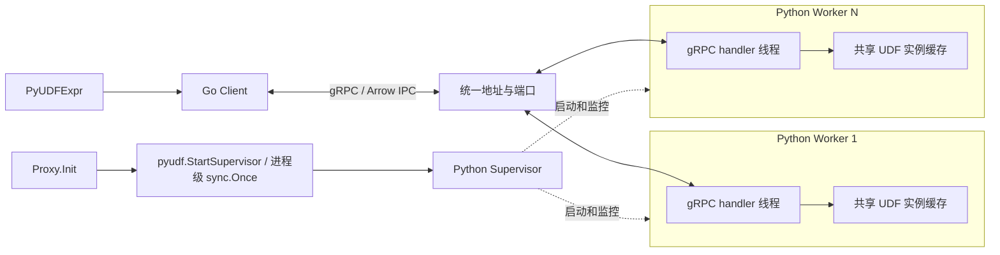

# MEP：PyUDF Worker Pool

- **创建日期：** 2026-09-14
- **状态：** P0–P5 已完成；Proxy Execute 链路已接入并通过 standalone Search 验证
- **所属模块：** FunctionChain / PyUDF
- **英文版本：** [PyUDF Worker Pool](20260914-pyudf-worker-pool.md)
- **实现现状：** [Embedded 实现删除及保留接口](20260722-pyudf-function-chain.md)
- **开发计划：** [第一版分阶段开发与验收](20260914-pyudf-worker-pool-plan.zh-CN.md)

- **P0 契约：** [配置默认值、启动、协议、错误及验收断言](20260915-pyudf-worker-pool-p0.zh-CN.md)（2026-09-15）

## 1. 范围与核心决策

PyUDF 使用 Go 和 Python 实现，不使用自定义 cgo/C++ 执行桥接。以 Milvus OS 进程为 supervisor 的拥有边界。第一版只由 Proxy 在初始化阶段调用 pyudf.StartSupervisor；接口检查 function.pyUDF.enabled，并通过进程级 sync.Once 创建 Python supervisor 进程后即返回。禁用时不启动 Python。supervisor 管理多个 worker，所有 worker 监听相同的地址和端口。PyUDFExpr 根据 milvus.yaml 中的 address 自行创建 client，不触发 supervisor 启动。

第一版采用以下规则：

1. Milvus 启动流程负责按配置启动、等待和回收 supervisor；supervisor 管理 worker，不执行 UDF 或转发任务数据。
2. Go、supervisor 和 worker 均不设计业务任务队列或自定义任务调度器。
3. Go client 有调用就发起 RPC，不控制并发或在途调用数量；全部请求并发接纳仅使用 worker 的 gRPC 原生配置，handler 中直接执行 UDF。
4. 每个 worker 可以缓存多个 UDF。同一个完整 UDF 路径和 stage 共享一个 UDF 实例，用户负责实例字段、模块全局变量和依赖的并发安全。
5. PyUDFExpr 只调用 client.Execute，不暴露 Runtime.Acquire、Lease.Run 或 Lease.Release。
6. client 可以配置调用超时。超时即本次调用失败，不查询后续状态，不自动重放。
7. worker 感知原 RPC 超时或断链后尽力取消尚未开始的操作；已运行的用户调用必须自然返回。第一版不因单次 RPC 超时/取消而强制终止线程或 worker；Milvus 退出时直接终止并回收 workers。
8. worker pool 是唯一执行实现，不保留 embedded backend 或回退路径。

当前范围仅为 Proxy 通过本地 Python 服务执行 L2 rerank 和同步 transform_query。DataNode 及其他角色本版不接入 UDF、不调用 supervisor 启动接口。自动远程资源分发、共享内存、持久化任务恢复、自动重放、运行期间按请求强制终止，以及恶意代码隔离不在第一版范围内。

## 2. 组件与调用关系



| 组件 | 职责 |
|---|---|
| pyudf.StartSupervisor | Proxy.Init 直接调用 pyudf 包入口及进程级 sync.Once，只共享启动结果，不创建或发布 client |
| Proxy.Stop | 在关闭调度器之前通知 Python supervisor 退出并等待回收 |
| Go Client | 由 PyUDFExpr 按配置创建，执行同步 RPC、超时、Arrow 编解码和错误转换；不选择 worker，不排队 |
| Python supervisor | 启动、监控、回收已退出的 worker，补齐进程数；不持有 UDF 或任务数据 |
| Python worker | 提供 gRPC 服务，加载/缓存 UDF，在 handler 中直接调用并校验输出 |
| 现有 FileResource 管理器与快照 | 管理下载、目录及文件生命周期，提供 LocalPath；client 通过 RPC 传入完整 UDF 路径 |

P4 已实现以下 Go client 接口；P5 将表达式切换到该接口：

```go
func NewClient(config Config) (*Client, error)
func (c *Client) Execute(ctx context.Context, request ExecuteRequest) ([]*arrow.Chunked, error)
func CloseClients() error // Process shutdown, not per expression/request.

type ExecuteRequest struct {
    ResourceName string
    UDFPath      string // Absolute wheel path resolved by FileResource.
    Stage        string
    Params       *schemapb.FunctionParamObject
    Inputs       []*arrow.Chunked
}
```

这是 Go 适配对象，不是生成的 Protobuf 消息。UDFPath 必填，由 worker 校验，Go 侧构造请求时填入 FileResource 解析后的完整 LocalPath，编码到 RPC 的 udf_path 字段。它不是 FileResource.Path 中的远端存储路径。ResourceName 用于标识、日志或 UDF context，不替代文件定位。缺少 UDFPath 时明确报错，client 不依据资源名猜测或拼接目录。PyUDFExpr 校验 Arrow 输入、构造请求，调用一次 client.Execute，再校验输出。一次调用包含该表达式的全部 query chunks；任务内部 chunks 顺序执行，有依赖关系的 FunctionChain 表达式保持原有顺序。

PyUDFExpr 从配置读取 address 和 rpcTimeout，创建轻量 client/stub 并调用 Execute；底层连接由 client 封装管理。supervisor 启动接口只返回启动结果，不创建或发布执行 client。

client 层按唯一一套重启生效配置维护一个进程内共享 Client，直接持有 connectionPoolSize 个独立 grpc.ClientConn。每个连接都访问同一个配置地址，长期复用；多个表达式调用 NewClient 得到同一个对象，连接数不随表达式或请求数增长；配置不一致时返回初始化错误，不另建连接组。

每次 Execute 开始时，通过并发安全的轮询计数器选择一条连接；该调用的RPC 和全部 query RecordBatches 始终使用所选连接。连接不是独占借用资源，同一个 ClientConn 仍可承载多个并发 RPC，不引入借还等待、业务线程池或任务队列。这里轮询的是连接，不是 gRPC resolver 返回的 worker 列表；client 不感知 Python worker 的 ID、地址或负载。

连接池只在发送前选择一次。连接建立/重连交给各 ClientConn；选中连接上的 RPC 失败后直接返回，不切换连接重放该请求。构造池时若部分连接创建失败，关闭已经创建的连接，不发布半成品池。connectionPoolSize 必须为正数，运行期间不动态扩容。[gRPC 性能建议](https://grpc.io/docs/guides/performance/)

连接建立、HTTP/2 复用和断线重连由池内各 grpc.ClientConn 处理。表达式和单次 Execute 不调用连接 Close。client 层在 Proxy 不再提交调用、客户端在途 RPC 结束后，统一关闭池内全部连接，无需给 [FunctionExpr 接口](../../../internal/util/function/chain/types/types.go) 增加逐表达式连接释放方法。

Execute 期间借用输入；返回前，仍读取输入的编码操作必须结束或持有独立引用。成功输出交给调用者，部分/失败输出由 client 清理。请求结束不关闭复用连接，也不终止 supervisor 或强制中断 Python UDF。

## 3. 进程启动与共享端口

由 pyudf/supervisor.go 提供简单进程入口，Proxy.Init 直接调用；Proxy.Stop 发送退出信号。表达式只负责请求，不持有进程生命周期。

```go
// Called directly from Proxy.Init / Proxy.Stop.
func StartSupervisor(ctx context.Context) error
func StopSupervisor(ctx context.Context) error
```

Proxy 在参数表初始化完成后、对外 Healthy 之前调用。不在 cmd/roles 中增加角色能力汇总表，不在其他组件中接入启动调用。表达式构造和 Execute 也不调用该入口，避免首请求触发冷启动。

```text
Proxy.Init
  -> pyudf.StartSupervisor
     -> 检查 enabled
     -> 进程级 sync.Once
     -> 创建 supervisor 进程后立即返回
     -> 返回启动成功 / 共享启动错误
```

sync.Once 在整个 Milvus OS 进程内共享。第一个启用调用执行进程创建，其他并发调用等待该操作完成，然后获取同一个结果。enabled=false 的检查放在 once 外；禁用调用不消耗启动机会。调用前必须完成正确配置初始化，同进程内使用一致的不可动态刷新配置。

第一版通过 once 只尝试创建一次 supervisor。配置或 exec 创建错误会缓存；cmd.Start 成功后即返回，Python 解析、worker 初始化和异步退出不改变这个返回结果。退出的 worker 由 Python 退避补齐，supervisor 自身不自动重启。

ctx 用于创建前取消检查，不控制已经创建的 supervisor 的生命周期。句柄归进程级状态持有，退出时通过 SIGTERM/Wait 清理，不等待健康状态。

启动只验证 Python/gRPC runtime，不等待 FileResource 元数据快照或加载具体用户 UDF，避免 standalone 的组件并发初始化形成依赖循环。

| 部署形态 | 第一版接口行为 |
|---|---|
| standalone 含 Proxy | 只有 Proxy 调用接口，进程内启动一套 supervisor/workers |
| cluster 中独立 Proxy 进程 | 每个 Proxy 进程各自一套 |
| 多角色合并且包含 Proxy | 仍只有 Proxy 接入，其他角色不启动或使用 UDF 服务 |
| 不含 Proxy，或 enabled=false | 不创建 Python 进程 |

sync.Once 的范围是同一 OS 进程。重复或并发调用公共入口仍只执行一次启动尝试，但本版不引入多角色共享调用者协议。各表达式创建轻量调用 client；supervisor 生命周期由启动状态管理，复用连接由 client 层管理，两者都在进程退出流程中清理。

独立进程若在不同 Pod/网络命名空间，可以都使用配置中的 `127.0.0.1:19090`。同一网络命名空间中的不同 Milvus 进程，应分别配置不同端口，例如 19090、19091，并将各自的生效参数传给对应 supervisor。每个进程仍只有一个 address，每套 pool 内的 worker 共享该端口；不增加 per-worker 地址。

Go 直接启动 supervisor.py，由 Python 管理 workers，worker 直接监听配置地址。部署应为每套服务分配独占地址；Health/Check 只供外部按需查询单个 worker，不验证进程归属，不为错配端口增加身份握手。

SO_REUSEPORT 只用于一套 pool 内共享监听。本版不做端口保护，重复 pool 误配同端口可能同时监听；部署必须分配独占地址。进程内 sync.Once 只保证本进程的一次启动尝试。跨进程共享一个 supervisor 属于不同的生命周期模型，第一版不采用。

Go 使用轻量、进程级幂等的 StartSupervisor 启动入口，通过 os/exec 执行打包好的 Python 解释器和模块，将 Go 已解析的生效参数作为 argv 传入，形式为：

```text
python -I -m milvus_pyudf_runtime.supervisor \
  --address 127.0.0.1:19090 \
  --worker-count 1 \
  --grpc-concurrency 10 \
  --max-concurrent-rpcs 100 \
  --max-message-bytes 67108864 \
  --shutdown-timeout-ms 30000
```

该入口只持有自己启动的 supervisor 句柄、启动结果和退出回收职责，不重新引入 worker 选择器、任务队列或 UDF 资源租约。supervisor 使用进程级生命周期，不绑定某个角色或某次 Search 的 context。服务只在 Milvus 启动阶段创建，表达式构造、校验、首次 Execute 和后续请求都不启动 Python。

启用后只创建 Python 进程，不设 worker 就绪门槛。首次 RPC 可能遇到 UNAVAILABLE 或超时，由正常调用错误路径处理，不增加等待、重放或请求队列。

Go 只持有自己创建的 supervisor 命令与唯一 Wait。Python 跟踪 worker PID，fork 失败和 worker 退出均退避补齐；存活但未监听的 worker 不主动替换。

保留标准 `grpc.health.v1.Health/Check` 接口，服务名为 `milvus.proto.pyudf.PyUDFWorker`，仅报告被访问 worker 的本地服务状态。Go 和 supervisor 都不主动调用，不使用 mmap 或 READY 汇总。

支持 Linux/macOS。supervisor 不创建 gRPC server/channel、不加载模型、不启动后台线程，保持干净的单线程父进程后 fork workers。各 worker 独立创建 grpc.server，设置 grpc.so_reuseport=1，直接绑定配置地址。supervisor 不创建端口标记或预留 socket。macOS 的分流行为不保证与 Linux 一致，原生环境需要单独验收；见 P0 第 2 节。

不能先在父进程启动 gRPC server，再 fork 继承它，也不能假定 Python gRPC 会接管任意继承的监听 socket。这里采用的是“fork 后在子进程初始化 gRPC，各自同端口监听”。后续补齐 worker 时，supervisor 也必须保持上述条件；不满足时改用全新解释器的 spawn/exec 方式。现有包的立即导入行为需要重构，确保 supervisor 入口不会在创建进程前导入 PyArrow/用户 runtime。[gRPC fork 支持说明](https://grpc.github.io/grpc/core/md_doc_fork_support.html)

Python 只检查子进程是否退出，不验证 gRPC 绑定结果或就绪状态。worker 初始化/绑定失败导致退出后会退避重启。每个 worker 仍使用同一个明确配置的地址，不自动改用其他端口。

SO_REUSEPORT 分配的是连接；一条 HTTP/2 连接中的 RPC 仍由同一个 worker 处理。第一版通过 client 的多连接池增加连接分布机会，避免整个 Proxy 只有一条连接，但不保证每个 worker 恰好分到一条连接或负载完全均匀。连接数与 worker 数独立配置，最终按实测分布和吞吐调优；不增加 worker 发现、缓存亲和或额外代理。[gRPC 连接行为](https://grpc.io/docs/guides/performance/)

workerCount 统计存活的 worker，包括启动中、stopping 或卡住的进程；旧进程退出并完成回收后才补齐对应槽位，不为仍存活的卡死 worker 启动超额替代进程。重复启动失败采用有上限的退避。supervisor 本身是额外的一个进程。

## 4. gRPC 并发与直接执行

使用同步 grpc.server，由 gRPC 自身的线程池执行 handler，而不是在 grpc.aio 的事件循环中直接运行阻塞 UDF。每个 worker 分别配置执行线程数 grpcConcurrency（默认 10）和在途 RPC 接纳上限 maxConcurrentRPCs（默认 100）：

```python
server = grpc.server(
    futures.ThreadPoolExecutor(max_workers=grpc_concurrency),
    maximum_concurrent_rpcs=max_concurrent_rpcs,
    options=(("grpc.so_reuseport", 1),),
)
```

这是当前 server 配置示例，futures 来自 concurrent.futures。RPC 达到 maximum_concurrent_rpcs 后，gRPC 返回 RESOURCE_EXHAUSTED。[gRPC Python 服务配置](https://grpc.github.io/grpc/python/grpc.html#grpc.server)

handler 接收并校验输入，取得缓存的共享 UDF 实例，直接调用 transform_query，校验和返回结果。不再提交到另一个 executor，不创建自定义运行队列、预留队列或 UDF 实例池，也不做 FIFO、任务窃取或任务迁移。

W 个 worker、每个 C 个 handler 线程，最多同时运行 W×C 个 handler。client 的 N=connectionPoolSize 条连接改善分布，但 N 不等于 RPC 并发上限，也不保证均匀利用全部进程。maxConcurrentRPCs 的额度包含 executor 内置队列等待和 handler 执行；线程数只限制实际同时运行的 handler。默认第 11 个请求可以等待空闲线程，100 个 RPC 在途时再来的请求才被拒绝。排队计入原 RPC 超时，超时请求在取得线程后跳过 UDF。

worker 只配置 gRPC 的 handler 线程数和 maximum_concurrent_rpcs，不增加额外接纳计数、信号量或执行池。Go client 有调用就发起 RPC，不限制在途调用数，不按 worker 数计算客户端容量。消息大小限制只针对单次 RPC；网络/gRPC 仍有内部缓冲，不能据此宣称客户端总内存有界。第一版没有 workerQueueCapacity、排队超时或独立执行线程池配置。

client 超时不会强制终止正在运行的 handler。固定 grpcio 版本后，需要验证并发计数随实际 handler 完成释放，而不是仅随客户端 RPC 结束释放，避免卡住的 handler 后面持续积累新调用。该项属于验收要求，不能只根据线程数配置宣称已满足。

## 5. gRPC 协议与同步调用

Go 使用 grpc-go；Python 使用同步 gRPC server，业务接口提供一次请求、一次响应的 unary Execute；同端口另注册标准 Health/Check：

```proto
service PyUDFWorker {
  rpc Execute(ExecuteRequest) returns (ExecuteResponse);
}
```

请求包含 resource_name、udf_path、stage、params、inputs 和 input_column_indices。inputs 是一份完整 Arrow IPC stream，每个 RecordBatch 对应一个 query，仅包含唯一输入列；input_column_indices 恢复全部参数位置，重复位置共享数组，零行 query 保留。IPC stream 是数据格式，RPC 本身是 unary。

```text
client -> worker: 完整 ExecuteRequest，含全部 Arrow IPC 输入
worker: 校验、解码 -> 按 udf_path + stage 查缓存
                     -> 未加载：同步首次加载并发布共享实例
                     -> 已加载：直接复用实例
        -> 顺序执行各 query -> 校验全部输出
worker -> client: 完整 outputs Arrow IPC，或结构化 error
```

gRPC 负责请求接纳；worker 收到完整数据后处理。响应使用 oneof result 表达 outputs 或 error，不能同时返回两者。所有 query 结果放在一份完整输出 IPC 中，通用协议不要求输出 RecordBatch 数量或行数与输入一致。错误或解码失败时不向 FunctionChain 发布部分结果，不增加分片消息、序号、结束事件或单独的请求 ID。

maxMessageBytes 默认 64 MiB，范围 1 MiB–1 GiB；Go/Python 的 gRPC send/receive 均设置此上限，按完整 Protobuf 请求/响应大小计算，包含元数据开销。超过上限明确失败，不自动拆成多次调用。单次调用的 rpcTimeout 包含编码、传输、执行和解码；调用者更早的 deadline 优先。

启动不调用 Health/Check；该接口仅供按需查询。请求不包含额外版本字段，兼容性通过 protobuf 字段演进及 gRPC 服务/消息定义维护；破坏性变更使用新的服务或消息定义。RPC 本身关联请求/响应；没有任务注册表、状态查询、自动重放或 exactly-once 保证。详细字段以 [pyudf.proto](../../../pkg/proto/pyudf.proto) 为准。

## 6. UDF 缓存与并发责任

每个 worker 按收到的完整 UDF 路径和 stage 缓存一个共享实例，将路径视为不透明定位信息。短状态锁查找/创建缓存条目后立即释放，再取得该条目的实例锁：已有实例直接返回，没有则创建并缓存，失败不写入实例；退出时释放锁。不同 UDF 可并行初始化，同一 UDF 只创建一次。

包登记和每模块的导入锁在进程内共享，实际模块缓存由 Python 管理。等待实例锁或模块锁时检查 RPC 是否取消；factory 在模块导入锁之外执行。只支持正常 worker 请求加载，不设计用户回调 loader 的嵌套加载、初始化完成事件或依赖图。已开始执行的用户代码仍自然结束。

加载完成后的 transform_query 调用不加 runtime 串行锁，不使用独占实例租约，也不为并发请求自动复制实例。多个 handler 可以同时调用同一实例。实例字段、模块全局变量、第三方库和用户内部锁的并发安全由 UDF 作者保证。输出交给 runtime 后，UDF 不能从其他线程继续修改对应数据。

不同请求可以交错调用同一实例；单个请求自己的 query chunks 仍保持顺序。UDF 不应使用实例字段保存未经隔离的单请求临时状态，也不能依赖跨请求调用顺序。runtime 不隔离用户数据竞争导致的错误。

线程可重叠执行 I/O 和释放 GIL 的原生操作，纯 Python CPU 计算主要靠多进程扩展。压测要考虑模型库自己的线程池，不能将 grpcConcurrency 直接解释为 CPU 加速倍数。[Python 线程说明](https://docs.python.org/3/library/threading.html#gil-and-performance-considerations)

同一进程内的 wheel 必须使用兼容包名和依赖。不覆盖 sys.modules 以加载冲突版本，遇到冲突明确报错，不自动改投其他 worker。缓存的实例在 worker 生命周期内复用，活跃 handler 未结束时不调用 close。运行期间不因普通 UDF 异常自动重建整个 worker。Milvus 退出时直接终止进程，不等待使用者返回，也不调用用户 close；由 OS 回收进程资源。

## 7. 超时、断链与清理

client 超时即返回失败，不查询后续结果、不等待清理确认、不自动重放。只取消当前 Execute RPC，不关闭 client 层复用的连接，不影响其他表达式的调用。连接恢复不等于自动重放已经失败的 UDF 请求。

worker 通过原 RPC context 的取消/deadline/断链状态尽力清理：

| 时机 | 第一版行为 |
|---|---|
| UDF 尚未开始 | 观察到调用失效后跳过 UDF，清理已接收输入 |
| 已进入用户调用 | 继续当前调用，不中断线程或 worker |
| 当前 query chunk 返回后 | 检查调用状态；失效则丢弃结果，不再执行后续 chunks |
| 序列化或发送时失效 | 停止后续交付，安全释放已不再使用的缓冲 |
| worker 未及时观察到断链 | client 仍已失败；不假定后台执行停止或资源已释放 |

使用 gRPC context.is_active 等状态检查及取消回调；回调不能释放正在执行的 handler 仍使用的数组或实例。输入、输出和实例引用由实际 handler 持有到返回/finally 清理，不依赖客户端连接继续存活。[gRPC 取消说明](https://grpc.io/docs/guides/cancellation/)

第一版不提供按请求的 force、watchdog kill 或运行时强制回收；Milvus 退出时允许终止整个 pool。卡住的调用可能长期占用 gRPC handler 线程；容量不足时服务拒绝新请求，而不是另建任务队列或超额 worker。完成与超时竞争时，调用者只得到一个最终结果。

## 8. 数据校验与错误

保留 positional Arrow 列、重复参数、零行 query chunk、null 和跨 chunk 的输出数量/类型一致性。Python 在输出序列化前校验，Go 在解码后再次检查布局，MapOp 保留输出数量和数值/非 null 的 score 检查。

输出支持 bool、有符号整数、float32/64 和 string。decimal32 返回 UDF_FAILED，不传递其 Arrow 结果，并由 client 映射为 FunctionFailed(2400)。UDF 可以内部使用 decimal，但必须显式返回支持类型。

普通 UDF 异常仅使当前请求失败，worker 继续提供服务，共享实例状态正确性由用户负责。worker 自身崩溃时，其未完成请求失败，supervisor 回收后补齐进程；不恢复或重放请求。

执行错误只包含 code 和 message。用户执行异常及用户输出/包契约错误统一为 UDF_FAILED，沿用 FunctionFailed(2400)；资源文件 I/O、内存不足、协议不支持和内部错误使用不同类别。操作、query 和列位置写入 message，不增加独立字段；文件打不开、内部路径失效或 runtime 初始化缺陷不能仅因发生在 Python 就归为用户 UDF 失败。P2 的 [loader](../../../internal/util/function/pyudf/python/milvus_pyudf_runtime/loader.py) 已按产生位置给 PyUDFLoadError 附加来源 code，区分文件读取失败与用户 factory 异常；worker 使用 code，不按异常类名或 message 推断。P0 第 5 节固定 I/O/系统码及来源审查表，后续实现按表做端到端验证。2400 保留现有 System 分类；成功 wire 解码后发现内部布局损坏应归 ServiceInternal(5)，不能继续套用旧 runtime 的用户返回值兜底。

区分结构化 UDF 错误与 gRPC 传输错误。RESOURCE_EXHAUSTED 可来自服务并发限制，也可来自消息大小等限制，不能用旧的“队列满”描述覆盖所有情况。client 的 merr 映射需要在实现时按实际来源验证，不能靠错误字符串推断。传播已类型化错误使用 merr.Wrap/Wrapf。

禁用 Execute 策略重试、hedging、wait-for-ready 和业务重放。grpc-go v1.82.1 仍允许未被对端处理请求的透明重试；保证是不重放可能已执行的 UDF，不是一次网络尝试。SDK 对整个 Search 的重发也不受此 client 保证覆盖，详见 P0 第 4、5 节。超时意味着调用失败，但不证明用户代码从未运行或没有副作用。[gRPC 重试语义](https://grpc.io/docs/guides/retry/)

## 9. FileResource 与 Python 的路径边界

FileResource 负责目录组织、下载和文件生命周期。Python 不读取 FileResource 的目录配置，不拼接 nodeID/resourceID，不维护资源目录映射，也不另行下载、搬迁或清理这些文件。

```text
Go FileResource 快照按 resource_name 解析 -> ResolvedFileResource.LocalPath
Go 构造 ExecuteRequest.UDFPath -> client 编码为 Execute RPC 的 udf_path
Python handler -> 直接从 udf_path 加载 wheel
```

Go 侧表达式仍按资源名配置。构造 ExecuteRequest 时，通过现有 [PyUDF 资源快照](../../../internal/util/function/pyudf/resource_info.go) 取得 [ResolvedFileResource.LocalPath](../../../internal/util/fileresource/util.go)，填入 UDFPath 后交给 client。若路径为相对路径，填入前基于 Milvus 工作目录规范化为完整绝对路径。目录结构是 [FileResource 管理器](../../../internal/util/fileresource/manager.go) 的内部细节，不是 Python 协议的一部分。

worker 的文件定位输入只有 udf_path。资源名如需用于日志或 UDF 初始化 context，可以作为说明性元数据透传，但不能用来查找目录；不要求 Python 理解 nodeID、resourceID 或 FileResource 同步机制。Python 可以校验路径和 wheel 是否可加载，但不能根据 Milvus 的路径规则重新计算它。

表达式继续只调用 client.Execute，无 Acquire/Release。第一版要求 Python 与 Milvus 同机，或通过相同挂载路径访问这些文件。资源下载需要实际 FileResource 模式为 SyncMode：独立 Proxy 默认 close，应显式设置 `common.fileResource.mode.proxy: sync`；standalone 的模式由 [resolveFileResourceMode](../../../cmd/roles/roles.go) 汇总同进程角色后确定。PyUDF 启动不检查 FileResource 模式，两者配置独立；资源是否可用在执行时解析。不增加额外目录配置。

文件删除/替换规则仍由 FileResource 管理。当前 SyncManager 会删除失效资源 ID 的目录，尚无跨进程保护运行中或缓存 UDF 的文件租约。第一版不能在活跃调用期间并发删除/替换资源：变更前停止新调用，等待实际执行结束，包括 client 已超时的调用，并按需要重启 Python 服务清除旧模块缓存。Python 收到完整路径并不自动获得文件保留保证。

未来没有共享文件系统的远程部署需要另外实现文件分发或资源定位扩展，但不应让 Python 复制 FileResource 的目录拼接逻辑。更精细的文件保留/回收和安全动态替换另行设计。

## 10. 按信号退出

Proxy.Init 在初始化末尾调用 pyudf.StartSupervisor。Proxy.Stop 在关闭调度器之前调用 StopSupervisor，向 Python 子进程发送 SIGTERM 并等待其退出。外层 gRPC 服务已有的 graceful-stop 顺序不变。

Python supervisor 收到 SIGTERM/SIGINT 后停止补齐，对 workers 执行 SIGTERM → 超时 SIGKILL → waitpid，然后退出。不等待 executor、UDF close 或 finally。worker 本身也按信号直接退出。

不传 parent-pid，不读取或轮询 Milvus/supervisor 的父 PID；服务可以独立运行。若父进程被 SIGKILL 或崩溃绕过正常 Proxy.Stop/信号流程，后代不会自动退出，需要部署环境清理。Health 仅供按需查询，普通 RPC 超时不终止 worker。

## 11. 配置

用户仍在 milvus.yaml 的 function.pyUDF 下维护配置，只由 Go 的 paramtable 读取并合并生效值；Python supervisor 不读取 YAML，只接收启动参数。下面同时显式开启 Proxy FileResource 同步，避免独立 Proxy 默认 close 导致 wheel 不下载；该配置仅控制资源同步，不作为启用 PyUDF 的启动条件。下面是启用示例；P0 契约第 1 节固定各项默认值、有效范围及限制：

```yaml
common:
  fileResource:
    mode:
      proxy: sync
function:
  pyUDF:
    enabled: true
    address: "127.0.0.1:19090"
    rpcTimeout: 30s
    connectionPoolSize: 10
    maxMessageBytes: 67108864
    server:
      workerCount: 1
      grpcConcurrency: 10
      maxConcurrentRPCs: 100
      shutdownTimeout: 30s
```

| 使用方 | 参数来源 | 用途 |
|---|---|---|
| Go 启动入口 / client | paramtable 生效后的 enabled、address、rpcTimeout、connectionPoolSize 及 server 配置 | 决定是否启动，构造启动参数，维护 client 连接池并设置调用超时 |
| Python supervisor | --address、--worker-count、--grpc-concurrency、--max-concurrent-rpcs 等 argv | 使用指定地址和参数启动 worker，不解析 Milvus 配置来源 |

Proxy 初始化时调用公共启动接口。Go 在 enabled=true 时读取一次已生效的 PyUDF 配置、校验后构造 argv 并启动 supervisor；enabled=false 不启动 Python。rpcTimeout 和 connectionPoolSize 仅由 Go client 使用，不传给 Python；前者设置每次 RPC 的 deadline，后者控制复用连接数。它们都不是 supervisor 运行时限或 worker 并发设置。UDF 完整路径仍随执行 RPC 传递，不放进启动参数。

P3 已实现以下 Go 接口，内部以参数数组调用安装的 python3，不拼接 shell 命令；Proxy 启停已经接线，Execute 表达式接入仍在 P5：

```go
func StartSupervisor(ctx context.Context) error
func StopSupervisor(ctx context.Context) error
```

只有 address、进程数、gRPC 并发和其他确需 Python 使用的服务参数进入 argv。Python 使用标准库 argparse 校验参数类型和范围，再传给 worker；不读取 milvus.yaml、user.yaml、环境配置覆盖或 etcd，不需要 YAML 配置解析依赖。不传父 PID 或额外 FD。

启动使用 Go 的同一份生效配置快照，因此 YAML 合并、环境变量和远程覆盖只处理一次。Go client 与 Python 使用同一个 address；不存在第二套 Python 配置优先级或隐藏地址默认值。未来新增 server 参数时，同步更新 Go 配置字段、argv 映射和 Python 参数定义，测试映射一致性。第一版不做跨进程动态刷新。

Health/Check 按 proto 服务名返回本 worker 的状态，不代表整池就绪；Go/supervisor 不主动查询，不设置启动就绪门槛。

connectionPoolSize、server.workerCount、server.grpcConcurrency 和 server.maxConcurrentRPCs 均在 milvus.yaml 配置，默认分别为 10、1、10、100，分别表示客户端复用连接数、worker 启动数、每 worker 执行线程数和在途 RPC 接纳上限。连接数不限制客户端并发 RPC 数；四者含义独立，不保证连接与进程一一对应。连接池只属于 client 层，不由 StartSupervisor 创建或发布。

用户配置位置不变，enabled 默认 false；不增加队列、独占实例池或按请求强制取消配置。shutdownTimeout 和完整请求/响应消息大小限制采用 P0 第 1 节的定义；端口由部署保证独占。

## 12. 实施与验收

worker 将 stage 原样传给 UDF 的 PyUDFContext.stage，不做阶段白名单或非空校验；缓存仍按完整路径/stage 区分。当前 Execute 调用 transform_query，Milvus 调用方当前仍使用 L2_rerank。

Python 服务采用组合对象：WorkerServer → PyUDFWorkerService → PyUDFLoader → PyUDFInstance。加载缓存归 loader，用户调用及返回值校验归 instance；进程级 import 状态由 loader 封装。无状态 IPC/参数/错误转换保留函数，不增加自定义运行队列或执行锁。详见 [runtime 结构说明](../../../internal/util/function/pyudf/python/README.md#p2-单-worker)。

当前已删除 embedded 执行代码。P1 已完成协议、配置、Health/Check 和基础 wheel，P2 已实现单 worker 的加载/缓存/执行、IPC 和错误处理；P3 已实现 supervisor 和 Go 启停入口，P4 已实现 Go 生产 client；P5 已完成表达式切换、旧 Runtime/Lease 清理和 CloseClients 接线。

| 现有代码 | 实施方向 |
|---|---|
| [Client](../../../internal/util/function/pyudf/client.go) | 替换为同步 Client.Execute；Proxy 已直接接入 pyudf.StartSupervisor/StopSupervisor；表达式、连接关闭已接入，旧接口已删除 |
| [PyUDFExpr](../../../internal/util/function/chain/expr/pyudf_expr.go) | 按配置创建轻量 client/stub，连接交由 client 层复用和管理，保留输入/输出校验 |
| [组件与进程生命周期](../../../cmd/roles/roles.go) | 仅 Proxy.Init 接入公共启动入口；进程退出在 Proxy 停止使用后统一清理 |
| [Python runtime](../../../internal/util/function/pyudf/python/milvus_pyudf_runtime/) | WorkerServer 持有服务资源，servicer 持有 PyUDFLoader，缓存 PyUDFInstance；后续增加 supervisor |
| [Python 打包](../../../internal/util/function/pyudf/python/pyproject.toml) | 固定 grpcio/PyArrow 及代码生成版本 |
| [Search E2E](../../../tests/python_client/milvus_client/test_milvus_client_pyudf.py) | 验证直接执行、共享实例并发、超时与错误传播 |

第一版启动验收包括：

- enabled=false 或不含 Proxy 的进程不创建 Python；含 Proxy 且 enabled=true 时，在 Proxy Healthy 前完成启动。
- standalone 与 cluster 的 Proxy 都能接入；每个 Proxy 所在进程只有一套服务，不同进程由部署分配独立端口。
- 公共入口重复/并发调用只启动一次，共享进程创建结果；创建失败返回同一个错误，禁用检查不消耗 once。
- 请求路径不启动进程；启动接口不发布 client；多个表达式共享同一有界连接池，单次失败或取消不关闭池，进程关闭时由 client 层统一释放所有连接。
- 验证连接数/worker 数/执行线程数/RPC 接纳上限默认分别为 10/1/10/100、Go 并发调用无本地接纳限制且均发往测试服务；轮询在并发调用下正确、一次 RPC 使用同一连接、部分初始化失败不泄漏连接，连接数不随表达式/请求数增长。
- 启动失败/超时及进程退出终止并回收子进程，不等待 executor；运行期间单次 RPC 超时不杀 worker。

另验证 fork 后初始化 gRPC、worker 补齐、共享端口连接分配、并发上限拒绝、超时后仍运行 handler 的真实容量、共享实例重叠调用、首次加载竞争、自然返回清理和普通异常不停止其他请求。用线程安全 UDF 验证并发，不宣称 runtime 自动保护非线程安全 UDF。DataNode 接入与 Proxy/DataNode 混合消费测试不属于本版验收。

按 G1/G2 审查错误来源与完整 Search 路径，故障注入后再宣称错误传播或隔离收益。修改 wire projection/指标标签时运行 merr guard tests 和完整 make test-go。Go 测试使用 `-tags dynamic,test -gcflags="all=-N -l"`；生成文件不手工修改。

压测冷/热路径，联合调整 connectionPoolSize、server.workerCount 和 grpcConcurrency，记录真实 TCP 连接数、各 worker 请求/活跃 handler 分布、吞吐/尾延迟、RSS 和 IPC 拷贝。必须验证多个独立连接，而不是同一个 ClientConn 上创建多个 stub。共享端口、多进程和线程数均不等同于已经获得线性性能增长。

### 12.1 P0 契约已确定（2026-09-15）

完整决定、代码来源审查和验收断言见 [P0 实施契约](20260915-pyudf-worker-pool-p0.zh-CN.md)，该文档是两种语言设计共用的实施依据。

| 项目 | 已确定契约 / 待实施验证 |
|---|---|
| 配置 | Go 有效快照 → argv；Python 不读 YAML；连接数、worker 数和 gRPC 并发数默认分别为 10、1、10；Go 不设置在途上限，仅 worker gRPC 控制并发，见 P0 第 1 节 |
| 监听端口 | Linux/macOS worker 直接监听同一地址；不做端口保护，部署保证地址独占，重复 pool 可能同时监听 |
| 启动与退出 | 创建进程后即返回，不检测 Health；shutdownTimeout=30s；once 缓存创建结果，退出只使用显式信号 |
| Execute | 单次 unary 请求/响应、每 query 一个 RecordBatch、消息上限和完整响应校验；业务接口仅提供 Execute，启动另用标准 Health/Check 校验 |
| RPC 与 handler | 运行期间 RPC 取消不释放活跃引用；Milvus 退出直接终止 workers，不等 executor、不调用用户 close；超时未退出升级 SIGKILL，随后回收 |
| 错误来源 | P0 第 5 节逐项固定来源、code、merr、Search Status 和重试边界；worker 已完成单服务验证，生产 client 已通过真实 worker 测试，完整 Search 尚未验证 |
| FileResource | 独立管理资源同步；执行时解析并传递 LocalPath，不引入目录管理；不支持活跃调用期间删除/替换 |
| 连接与重放 | 有界多连接池、每 RPC 一次轮询、无业务重放；未处理请求的透明重试及 SDK Search 重发不等于 exactly-once |

P0–P5 已完成，P6–P7 尚未交付。Proxy-only、共享端口、无业务队列、用户负责 UDF 并发安全及运行期间不按请求强制取消的范围不变；Milvus 退出时直接终止 workers。

## 13. 后续优化

### 13.1 独立 UDF role（仅供后续讨论）

第一版仍由 `Proxy.Init` 调用 `pyudf.StartSupervisor`，通过进程级 `sync.Once` 启动服务。下面的独立 role 方案尚未采纳，不增加第一版的实现、配置或验收范围。

可以将整套 Python UDF 服务定义为一个独立 Milvus role，暂称 `udfworker`。该 role 管理一个 supervisor 及其多个 Python workers，而不是把每个 Python worker 都注册成一个 Milvus role。拟议的 `milvus run udfworker` 只是接口示意，当前命令尚不存在。

Go role 适配层可对接现有 [组件生命周期](../../../cmd/roles/roles.go) 的 Prepare/Run/Stop/Health，负责创建 Python supervisor 和退出回收；本版不等待 READY 或主动检测 worker。gRPC、共享端口、直接执行、共享 UDF 实例及用户并发安全责任都保持不变；不增加 UDF cgo/C++ 执行桥接。

| 部署形态 | 讨论方案 |
|---|---|
| standalone | 由角色编排根据配置启用一个 UDF role；它可与 Proxy 位于同一 Milvus OS 进程，Python workers 仍为子进程 |
| cluster | UDF role 可以单独作为进程/Pod 部署，Proxy 仅按地址访问 gRPC 服务 |
| 未来增加其他 UDF 消费角色 | 复用同一 client 协议，不再由每个消费组件负责启动 Python |

这里的“独立 role”首先表示生命周期和职责独立，不要求所有部署下都独立 OS 进程。若正式采用，supervisor 的启动责任将从 Proxy.Init 移到 UDF role 的 Run；两条自动启动路径不能同时启用。standalone 需要明确服务与 Proxy 的就绪依赖和关闭顺序，cluster 则由部署系统负责服务就绪与恢复。

收益是 UDF 服务可以独立部署、升级和配置资源，Proxy 只保留执行 client，也更容易增加后续消费者。代价是需要补齐 role/CLI 注册、健康检查、启停编排、配置语义、镜像与部署清单，并审查公共角色启动路径，避免让 UDF 服务初始化无关的组件依赖。

文件可见性仍是限制：第一版 RPC 传完整 `udf_path`，独立进程/Pod 必须能以相同路径访问 FileResource 文件。role 独立不能自动解决跨主机文件访问；没有共享挂载时，需要另行设计资源分发。采用前还要确认服务共享范围、端点归属、容量配置及普通异常/超时的现有行为，不借此引入按请求强制取消。

### 13.2 其他后续工作

DataNode 及其他角色的 UDF 接入单独规划；届时可复用公共启动入口，并补充同进程多角色共享、分进程部署及关闭顺序测试。当前不修改 DataNode 的初始化、执行或停止逻辑。

后续再评估连接池调优或服务端请求级负载均衡、精细文件回收、自动远程资源准备、共享内存及运行期间按请求强制终止。第一版不提供 Cancel/GetJobStatus、force 选项、watchdog kill、自定义运行队列或 UDF 独占实例池。

P4 实施边界：Go 透传参数，worker 检查内容和逻辑深度，protobuf 负责编码/解码合法性；参数错误按 worker 或 gRPC 的实际结果返回，不再保证提前返回 1100。同步编码/解码在批次间及结果发布前检查 deadline，不用后台 goroutine 抢占 Arrow 操作。验证记录见[开发计划第 6 节](20260914-pyudf-worker-pool-plan.zh-CN.md#6-p4简单-go-client-与跨语言互通)。

输入 IPC 仅编码唯一的 Arrow 列；Go 按共享列对象身份去重，通过 input_column_indices 记录每个 UDF 参数对应的 IPC 列。Python 按索引恢复参数顺序，重复参数引用同一个解码数组；空索引列表沿用 IPC 原列顺序。移除本地 IPC 编码预算，仅保留两端 gRPC 的完整消息大小限制。Go 与 worker wheel 必须配套更新，旧 worker 不识别列引用。
