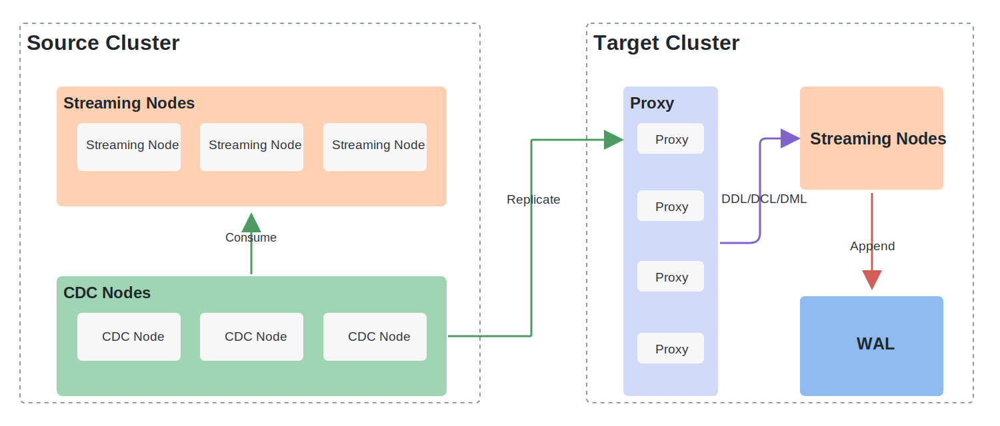

# CDC Replication Overview

Milvus CDC (Change Data Capture) replicates data changes from one Milvus cluster to another. Starting from Milvus v2.6, CDC can be used to build a primary-standby disaster recovery topology.

In a primary-standby topology, one cluster acts as the primary and accepts writes. One or more standby clusters continuously receive changes from the primary and can serve read traffic. When the primary cluster is unavailable or needs maintenance, you can switch service traffic to a standby cluster.

## Architecture

A typical topology contains:

- **Primary cluster**: The source cluster for replication. It accepts reads and writes.
- **Standby cluster**: A target cluster for replication. It receives changes from the primary and is read-only while it remains a standby.
- **CDC node**: A Milvus component that forwards WAL changes from the current primary to standby clusters. Deploy CDC on each cluster that may become primary after switchover or failover.
- **Replication topology**: The configured source-to-target relationship, such as `cluster-a -> cluster-b`.

The most common setup is one primary and one standby:



```text
Application writes
      |
      v
Primary cluster A  -- CDC replication -->  Standby cluster B
```

Milvus also supports a single-primary, multi-standby topology:

```text
Primary cluster A  -- CDC replication -->  Standby cluster B
                  \-- CDC replication -->  Standby cluster C
```

## Primary and Standby Behavior

| Role | Reads | Writes | Replication behavior |
|---|---:|---:|---|
| Primary | Yes | Yes | Sends changes to standby clusters |
| Standby | Yes | No | Receives replicated changes from the primary |

A standby cluster rejects direct write requests. This prevents split brain and keeps the topology consistent.

## Failover Options

Milvus provides two ways to move service traffic from the primary to a standby cluster.

| Operation | Use when | Data loss | Expected recovery behavior |
|---|---|---|---|
| **[Planned switchover](./03-cdc-planned-switchover.md)** | The primary is still reachable, or you are doing maintenance | RPO = 0 | Waits for remaining replicated data before roles change |
| **[Force failover](./04-cdc-force-failover.md)** | The primary is completely unavailable and cannot be recovered quickly | Possible | Promotes the standby immediately so writes can resume |

Use planned switchover whenever the primary can still respond. Use force failover only when restoring availability is more important than waiting for the original primary.

## CDC Lag

CDC lag is the amount of data that has been written to the primary cluster but has not yet been applied to a standby cluster.

CDC lag affects failover behavior:

- During planned switchover, lower CDC lag usually means the switchover completes faster.
- During force failover, CDC lag represents the data window that may be lost if the original primary is unavailable.

Monitor CDC lag continuously and keep it as low as possible. [CDC Replication Quick Start](./02-cdc-replication-quick-start.md) includes a PromQL example for estimating CDC lag.

## FAQ

### Can a standby cluster serve queries?

Yes. A standby cluster can serve read traffic. It cannot accept writes until it becomes primary.

### Does CDC support active-active writes?

No. CDC replication is designed for a single-primary topology. Writing to multiple clusters at the same time can cause split brain and data divergence.

### Does planned switchover lose data?

No. Planned switchover waits for the remaining data to be replicated before the standby becomes primary.

### Does force failover lose data?

It can. Any data written to the old primary but not yet replicated to the standby may be lost.

### How much data can be lost during force failover?

The potential data loss is bounded by CDC lag at the time the primary becomes unavailable.
