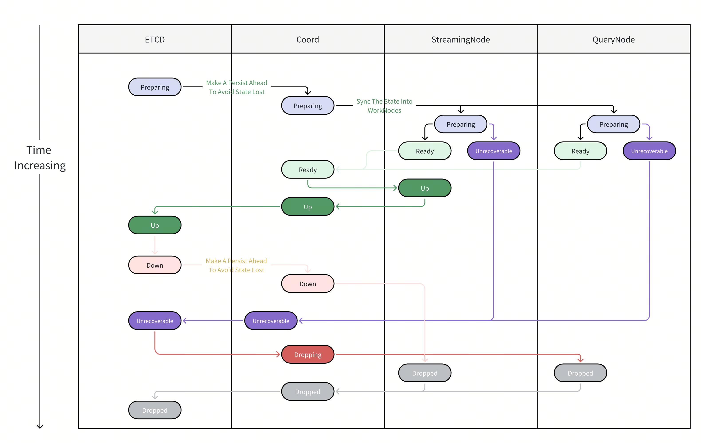

# Distributed Query View Design Document

## 1. Background and Motivation

StreamingNode needs to handle all incremental queries in Milvus while managing all data publish/subscribe operations. If the current delegator logic were placed directly on StreamingNode, it would cause the following problems:

1. All Segment Load/Release operations would need to be forwarded through StreamingNode (including Handoff caused by Compaction and other unrelated operations).
2. All Delete data would need to go through StreamingNode for Segment-level Apply.
3. All queries would need to be triggered through StreamingNode, and Shard-level Reduce would need to be executed by StreamingNode.
4. All QueryNode query result traffic would need to be forwarded through StreamingNode.

StreamingNode would become a compute-intensive and IO-intensive global bottleneck node, and scaling out and implementing multiple replicas would be extremely complex.

## 2. Core Architecture Changes

1. **StreamingNode is no longer responsible for Load/Release of SealedSegments**: QueryCoord directly manages all SealedSegment Load/Release operations. StreamingNode only accepts query view update requests from QueryCoord.
2. **QueryCoord is responsible for generating the globally complete distributed query view**.
3. **StreamingNode is no longer responsible for Search/Query logic forwarding**: Proxy uses a two-phase query approach — it generates a query plan on StreamingNode, then sends the query plan to designated QueryNodes to complete the query, and performs all distributed Reduce operations itself.
4. **StreamingNode no longer actively applies incremental delete data**: After LoadSegment, QueryNode proactively subscribes to the corresponding Delete data from StreamingNode and applies Delete data on its own.

## 3. Two-Phase Query Process

1. **Phase One**: Proxy generates a Shard-level query plan from StreamingNode using the highest version QueryView:
   - Includes MVCC
   - Query optimization (BM25, Segment filtering, etc.)
   - Query view version
2. **Phase Two**: Proxy sends queries to StreamingNode and QueryNode with the query plan:
   - StreamingNode and QueryNode execute query operations using Segments under the corresponding view version
   - Proxy reduces all results and returns them to the user
3. If a node failure or view invalidation occurs during the process, the query is canceled and retried directly.

### Advantages

- StreamingNode logic is simplified; no need to migrate Load/Release and other QueryNode interfaces.
- Query processing load no longer converges on StreamingNode, mitigating the single-point bottleneck.
- The global single-point Delegator role is eliminated; Reduce and RPC bottlenecks can be resolved by scaling Proxy.
- Distributed query views facilitate query state persistence (requery, deletebyexpr, etc.).
- Strong consistency queries can eliminate the original tsafe wait time (100-200ms).
- Idle TimeTick can be completely removed from the system (MVCC).
- Recovery speed is improved; StreamingNode and QueryNode recovery do not interfere with each other.

## 4. Distributed Query View

### 4.1 Basic Requirements for Query Views

- **Completeness**: The query plan must contain a complete list of all segments.
- **No Duplication**: The same data must not be queried twice (the same segment may have both growing and sealed replicas simultaneously).
- **Leasable**: The query view should remain valid within a certain time window; queries should not be frequently interrupted due to view invalidation.
- **Swappable**: Query views can be switched quickly without causing unavailability.

### 4.2 Query View Data Composition

For a single Shard of a Collection, the complete distributed query view consists of:

- **Incremental portion** (maintained on StreamingNode):
  - **[A1]** Sealed and visible to Coord, but also loaded as Growing on StreamingNode.
  - **[A2]** Visible to StreamingNode but not to Coord (StreamingNode directly faces the stream and can see Growing Segments immediately; Coord must wait for Flusher to complete Flush before seeing them).
- **Historical portion**:
  - **[B1]** Maintained on QueryNode; Load operations are applied by Coord and are always visible to Coord.

## 5. Data Side — Storage View (DataView)

### 5.1 Overview

The storage view contains all complete, non-duplicate Sealed Segment data ([B1] and [A1]). A version number DataVersion is introduced:

- **streaming_version**: Incremented when a Growing Segment is flushed.
- **compact_version**: Incremented when a Segment is compacted.

Version numbers are ordered lexicographically by `(streaming_version, compact_version)`.

### 5.2 Data Structures

See the definitions of `DataVersion`, `DataViewOfCollection`, `DataViewOfShard`, and `DataViewOfPartition` in [view.proto](../../../../pkg/proto/view.proto).

### 5.3 Storage View Version Evolution Example

The following timeline shows the version evolution process of the storage view (DataView), with each Segment labeled as `SegmentID @DataVersion`:

| Step | Event | DataView Version | Segments in the View |
|---|---|---|---|
| 1 | Initial state | `1,0` | `Segment 1 @1,0`, `Segment 2 @1,0` |
| 2 | Flush Segment 3 | `2,0` | `Segment 1 @1,0`, `Segment 2 @1,0`, `Segment 3 @2,0` |
| 3 | Compact Segment 1 and 2 into Segment 4 and 5 | `2,1` | `Segment 4 @2,1`, `Segment 5 @2,1`, `Segment 3 @2,0` |
| 4 | Cluster compaction or reshard | `2,2` | `Segment 6 @2,2`, `Segment 7 @2,2`, `Segment 8 @2,2`, `Segment 9 @2,2` |
| 5 | Import Segment 5 | `3,0` | `Segment 6 @2,2`, `Segment 7 @2,2`, `Segment 8 @2,2`, `Segment 9 @2,2`, `Segment 10 @3,0` |

1. **Version 1,0**: Initial state, containing Segment 1 @1,0 and Segment 2 @1,0.
2. **Version 2,0** (Flush Segment 3): Segment 3 @2,0 is added, streaming_version is incremented. Segments 1 and 2 retain their original version number @1,0.
3. **Version 2,1** (Compact Segments 1 and 2 into Segments 4 and 5): Segments 1 and 2 are removed from the view, Segments 4 @2,1 and 5 @2,1 are added. compact_version is incremented. Segment 3 @2,0 remains unchanged.
4. **Version 2,2** (Cluster Compaction or Reshard): All old Segments are replaced by Segments 6–9 @2,2.
5. **Version 3,0** (Import Segment 5): Segment 10 @3,0 is added, streaming_version is incremented. Segments 6–9 retain @2,2.

Key observations:
- Flush operations cause streaming_version to increment (e.g., 1,0 → 2,0 and 2,2 → 3,0).
- Compact operations cause compact_version to increment (e.g., 2,0 → 2,1 → 2,2).
- Each Segment carries the version number at the time it joined the view, and this version number does not change with subsequent view version changes.
- After Compaction, old Segments are permanently removed from the view.

### 5.4 Constraints

- Each SealedSegment (generated by Flush or Compact) corresponds to a storage view version number D1. One version can correspond to multiple Segments.
- Once a Segment is compacted, it is removed from the storage view and will never return.
- The view is not affected by offline tasks such as indexing.
- The storage view version number is at the Collection level (laying the groundwork for future capabilities such as Shard splitting).

## 6. Query Side — Query View (QueryView)

### 6.1 Version Number

Each query view version number is `(D, Q)`, ordered lexicographically:
- **D increases**: Data undergoes storage-level changes.
- **Q increases**: Data undergoes load-level redistribution.

The query view version number is at the **ShardOnReplica level**, and its lifecycle is the same as the Load operation lifecycle of the corresponding replica.

### 6.2 Query View Version Evolution Example

The following timeline shows the version evolution process of the query view (QueryView), with each Segment labeled as `SegmentID @NodeID`:

| Step | Event | QueryView Version | Segment Placement |
|---|---|---|---|
| 1 | Initial placement | `(1,1)` | `Segment 1 @Node1`, `Segment 2 @Node1` |
| 2 | Balance: move Segment 2 from Node1 to Node2 | `(1,2)` | `Segment 1 @Node1`, `Segment 2 @Node2` |
| 3 | DataVersion 2 arrives and adds Segment 3 | `(2,1)` | `Segment 1 @Node1`, `Segment 2 @Node2`, `Segment 3 @Node2` |
| 4 | Recovery balance after Node2 crashes | `(2,2)` | `Segment 1 @Node1`, `Segment 2 @Node1`, `Segment 3 @Node1` |
| 5 | DataVersion 3 arrives with more QueryNodes | `(3,1)` | `Segment 6 @Node1`, `Segment 7 @Node2`, `Segment 8 @Node3`, `Segment 9 @Node1`, `Segment 10 @Node2` |

1. **Version (1,1)**: Initial state, Segment 1 @Node1, Segment 2 @Node1 (all Segments on Node 1).
2. **Version (1,2)** (Balance Operation: Move Segment 2 From Node 1 To Node 2): Segment 2 is migrated to Node 2. DataVersion remains unchanged (D=1), QueryVersion is incremented (Q: 1→2).
3. **Version (2,1)** (Data Version 2 Coming): DataView produces a new version (Flush adds Segment 3), Segment 3 @Node2 joins. DataVersion is incremented (D: 1→2), QueryVersion is reset (Q=1).
4. **Version (2,2)** (Balance Operation For Recovery, such as Node 2 crashes): Node 2 crashes, all Segments are moved back to Node 1. QueryVersion is incremented (Q: 1→2).
5. **Version (3,1)** (Data Version 3 Coming And More QueryNode): A new DataVersion arrives with more QueryNodes available, Segments 6–10 are distributed across Node 1, Node 2, and Node 3. DataVersion is incremented (D: 2→3), QueryVersion is reset (Q=1).

Key observations:
- When D increases, Q is reset to 1 (new data at the storage level needs to be redistributed).
- An increase in Q represents pure load-level redistribution (Balance, Recovery); the data itself does not change.
- Node crashes are handled by generating a new QueryView, migrating crashed node's Segments to surviving nodes.

### 6.3 State Enumeration

See the definition of `QueryViewState` in [view.proto](../../../../pkg/proto/view.proto).

### 6.4 Data Structures

See the definitions of `QueryViewOfShard`, `QueryViewMeta`, `QueryViewSettings`, `QueryViewVersion`, `QueryViewOfQueryNode`, `QueryViewOfStreamingNode`, and `QueryViewOfPartition` in [view.proto](../../../../pkg/proto/view.proto).

### 6.5 Constraints

- The version number `(D,Q)` of a QueryView in Up state may only increase non-strictly; rollback is not allowed.
- A Shard maintains a fixed upper limit of query views (typically 2–3, similar to a Double Buffer / Triple Buffer pipeline design).

## 7. Query View Lifecycle State Machine

The query view maintains consistency across Coord / QueryNode / StreamingNode, with Coord as the leader.

State transition flow:

```
Normal flow:   Preparing → Ready → Up → Down → Dropping → Dropped
Error flow:    Preparing → Unrecoverable → Dropping → Dropped
```



For detailed per-node, per-state analysis (entry conditions, automatic behavior, transitions, peer state handling, persistence, and recovery), see [QueryView State Machine Per-Node Analysis](query_view_state_machine.md).

Key constraints:
- Workflows across multiple view versions are completely independent, but through Coord state machine constraints, each node has at most one view in Preparing state.
- QueryNode loss is handled only for active QN-targeted syncs: in Preparing it makes the view Unrecoverable, and in Dropping it counts that QN cleanup as complete. StreamingNode unavailability is handled by channel assignment, not by the QueryView per-view state machine.

## 8. Incremental Query Segment Lifecycle

On StreamingNode, incremental Segments generated from WAL have their lifecycle entirely controlled by Coord instructions:

```
Growing → Sealed [DataVersion D1] → Release
```

| State | State Transition Condition | Description | Query Behavior |
|---|---|---|---|
| **Growing** | Discovered from WAL | Segment is in Growing state; Coord has not yet managed it | Always queried |
| **Sealed [D1]** | Consumed Flush event from WAL | Segment becomes Sealed at version D1 (meaning Coord has seen this Segment in views ≥ D1) | View Version < (D1,0): Always queried; View Version ≥ (D1,0): Not queried (data is already on QN) |
| **Release** | Minimum view version on current SN ≥ (D1,0) and no view contains this Segment | Segment does not participate in any queries | Noop |

## 9. Historical Query Segment Lifecycle

Sealed Segments on QueryNode:

```
Loaded → Release
```

| State | State Transition Condition | Query Behavior |
|---|---|---|
| **Loaded** | A new incoming view loads this Segment | Queried when the target view uses this segment |
| **Release** | No view on the current QN contains this Segment | Noop |

## 10. Resources and View Dependencies

- All resources are tied to view dependencies (except growing segments; see Section 8).
- Resource lifecycle ≥ the union of lifecycles of all query views that hold it.
- Resources are released when their associated query views are released.
- Multi-version view support enables atomic updates on nodes to ensure resource liveness, reducing the frequency of resource operations.

Example: If view A is unreasonable and causes OOM on a node, it is marked as Unrecoverable, but view A still exists on the node and already-loaded resources are not rolled back. After Coord detects this, the Balancer generates a new view B and pushes both views for atomic modification (A Dropped, B Preparing). Resources in (A diff B) are released, resources in (B diff A) are loaded, and resources in A∩B are retained.

## 11. Coord and Node Interactions

### 11.1 Design Principles

- **Coord**: Obtains global information, computes and generates QueryViews, and advances the state machine. No longer manages resource preparation workflows.
- **Node**: Responsible for preparing resources required by QueryViews and reporting resource preparation status.

### 11.2 Component Modules

| Node | Module | Responsibility |
|---|---|---|
| Coord | Node Manager | Service discovery, maintaining the global available QueryNode list |
| Coord | Resource Group Manager | Resource Group partitioning, generating QueryNode-ResourceGroup grouping relationships |
| Coord | Replica Manager | Replica assignment, generating Replica-to-available-Node relationships |
| Coord | DataView Manager | Maintaining the storage view list |
| Coord | Sealed Segment Balancer | Gathering information from all Managers, generating and distributing QueryViews |
| Coord | QueryView Manager | View state machine transitions, syncing view information to all Nodes |
| Streaming Node | QueryView Manager | Listening for view state machine changes, applying to Growing Segments and BM25, etc. |
| Streaming Node | Pure Delete Stream Manager | Acting as subscription server, publishing Delete data to QueryNodes |
| Streaming Node | Growing Segment Manager | Incremental data management, maintaining Growing Segment lifecycle |
| Query Node | QueryView Manager | Listening for view state machine changes, applying to Sealed Segments |
| Query Node | Sealed Segment Manager | Historical data management, maintaining Sealed Segment lifecycle |
| Query Node | Pure Delete Stream Manager | Acting as subscription client, applying Delete data to each Segment |

### 11.3 SyncQueryView RPC

The sole RPC that unifies the synchronization layer behavior of StreamingNode and QueryNode. See the definitions of `ViewSyncService`, `SyncRequest`, `SyncResponse`, and related messages in [view.proto](../../../../pkg/proto/view.proto). For the Coord-side transport layer that delivers views over this RPC, see [Syncer Design](syncer.md).

RPC rules:
- The QueryView list is atomically applied to the local QueryViewManager.
- The Node's async Scheduler parses Load/Release operations and applies them to other components.
- After a view reaches its target state, the updated result is pushed to Coord.
- **The Node's Response always carries the latest local state**. This ensures that at any point (including after Recovery), Coord can reconstruct its awareness of the node's true state through a single SyncQueryView interaction, without relying on intermediate states persisted in ETCD.
- State machine transitions strictly follow the rules; signals that break the rules are ignored.
- Can be implemented via polling or Stream RPC (Stream RPC avoids polling overhead).
- Fully idempotent.

## 12. Detailed Node Behavior

For detailed per-node state machine analysis (entry conditions, automatic behavior, transitions, peer state handling, and recovery), see [QueryView State Machine Per-Node Analysis](query_view_state_machine.md).

## 13. Consistency Implementation (Consistency Level)

### Consistency Levels

| Level | MvccTimestamp Generation Logic |
|---|---|
| **Strong** | Proxy requests a query plan from the primary SN. SN obtains the maximum ts of messages written to the current WAL VChannel as MvccTimestamp (if ts has not yet triggered timeticksync, trigger it proactively) |
| **Bounded** | Proxy requests from any SN. Primary SN → same as Strong; Replica SN → obtains the maximum ts of the current WAL subscription stream VChannel |
| **Session** | Same as Strong |
| **Eventual** | Same as Bounded |

Key changes:
- GuaranteeTS assignment logic is moved down to StreamingNode, obtained from the WAL system.
- MvccTimestamp and GuaranteeTS are merged and always kept consistent.
- ts will trend toward LSN rather than system time in the future.

## 14. Pure Delete Stream

StreamingNode already implements Pub-Sub capability. PureDeleteStreamManager wraps and optimizes on top of it:

- During Recovery, pure delete stream subscriptions use batch processing for merging.
- L0 is used on StreamingNode.
- Bloom filter filtering + batch merge of delete data at the Node level.
- Remote Load L0 (conflicts with Bloom filter filtering; choose one of the two).
- Subscription catch-up merging.
