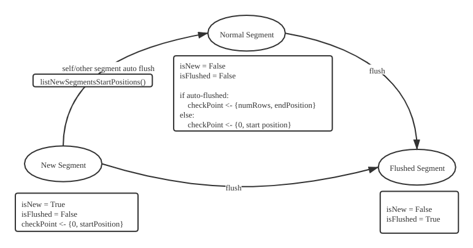

# DataNode Flowgraph Recovery Design

update: 6.4.2021, by [Goose](https://github.com/XuanYang-cn)
update: 6.21.2021, by [Goose](https://github.com/XuanYang-cn)

## 1. Common Sense

A. One message stream to one vchannel, so there are one start and one end position in one message pack.

B. Only when DataNode flushes, DataNode will update every segment's position.
An optimization: update position of

1. Current flushing segment
2. StartPosition of segments has never been flushed.

C. DataNode auto-flush is a valid flush.

D. DDL messages are now in DML Vchannels.

## 2. Segments in Flowgraph



## 3. Flowgraph Recovery

### A. Save checkpoints

When a flowgraph flushes a segment, we need to save these things:

- current segment's binlog paths.
- current segment positions.
- all other segments' current positions from the replica (If a segment hasn't been flushed, save the position when DataNode first meets it).

Whether save successfully:

- If succeeded, flowgraph updates all segments' positions to the replica.
- If not
  - For a grpc failure(this failure will appear after many times retry internally), crash itself.
  - For a normal failure, retry save 10 times, if still fails, crash itself.

### B. Recovery from a set of checkpoints

1. We need all positions of all segments in this vchannel `p1, p2, ... pn`.

Proto design for WatchDmChannelReq:

```proto
message VchannelInfo {
  int64 collectionID = 1;
  string channelName = 2;
  msgpb.MsgPosition seek_position = 3;
  repeated SegmentInfo unflushedSegments = 4;
  repeated int64 flushedSegments = 5;
}

message WatchDmChannelsRequest {
  common.MsgBase base = 1;
  repeated VchannelInfo vchannels = 2;
}
```

2. We want to filter msgPacks based on these positions.


Supposing we have segments `s1, s2, s3`, corresponding positions `p1, p2, p3`

- Sort positions in reverse order `p3, p2, p1`
- Get segments dup range time: `s3 ( p3 > mp_px > p1)`, `s2 (p2 > mp_px > p1)`, `s1(zero)`
- Seek from the earliest, in this example `p1`
- Then for every msgPack after seeking `p1`, the pseudocode:

```go
const filter_threshold = recovery_time
// mp means msgPack
for mp := seeking(p1) {
    if mp.position.endtime < filter_threshold {
        if mp.position < p3 {
            filter s3
        }
        if mp.position < p2 {
            filter s2
        }
    }
}
```
