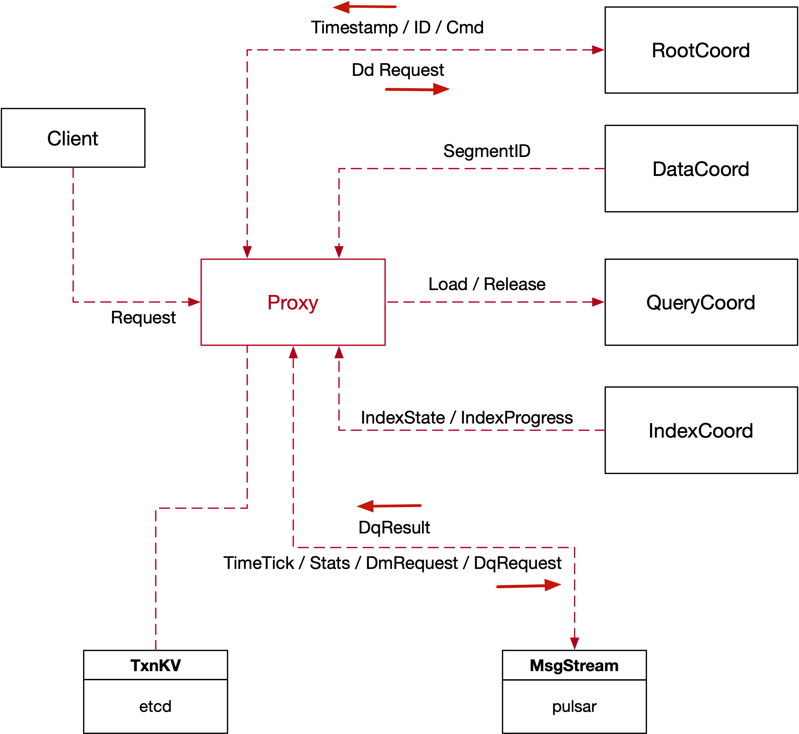
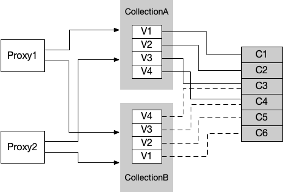
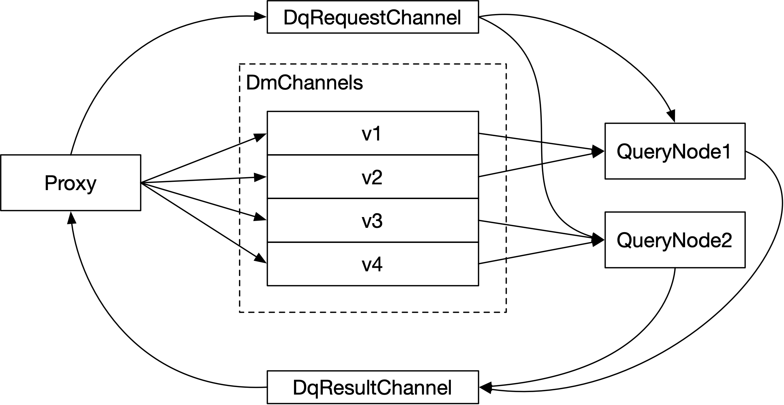
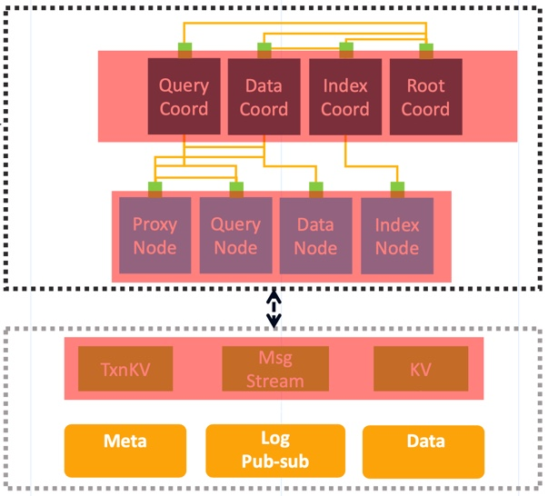
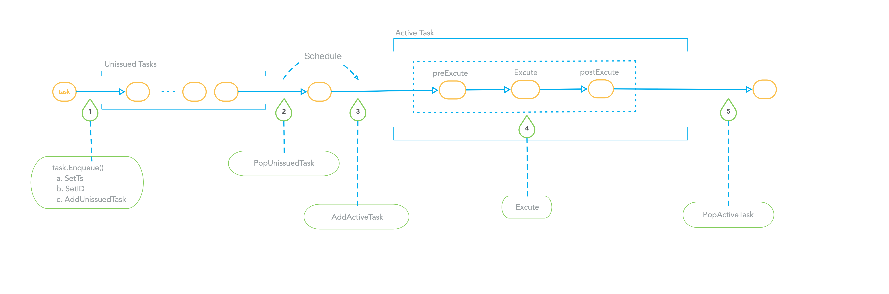
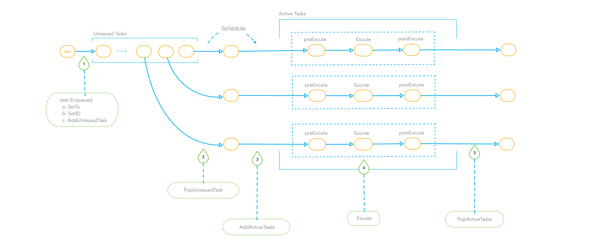

## 6. Proxy

As the user access layer of Milvus, Proxy mainly plays a role that does some checks and preprocessing for requests from
clients and then forwards these requests to other components, such as Root Coordinator, Data Coordinator, Query
Coordinator, Index Coordinator. The below figure shows how Proxy interacts with other components.



Proxy divides requests from clients into three classes: `DdRequest`, `DmRequest`, `DqRequest`.

DdRequest is the shorthand of `Data Definition Request`. It means an operation on the meta information of
collections, including two parts. One part is of the writing operations on collections, such as defining a schema,
creating or dropping a partition, creating or dropping the index, etc. Another part is of the reading operations on
collections, such as listing all collections or partitions, checking if a collection or a partition exists.

DmRequest means `Data Manipulation Request`. These requests perform a writing operation on collections, including
inserting records into a collection, deleting some specific records of a collection.

DqRequest means `Data Query Request`. These requests perform a reading operation on collections, such as searching on a
collection, querying for specific records of a collection, etc.

For every request, Proxy will first check if it's valid to be executed by Milvus and if the request is invalid then
Proxy will return the error to clients and won't continue to forward this request to other components. The check
operation of Proxy includes two parts, one part is static check and another is dynamic check. The static check includes
parameters check, constraints check, etc. The dynamic check will check some related dependencies of the request, take
search requests as an example, Proxy should check if the related collection exists in Milvus.

Also, Proxy will do some preprocessing for every request. Proxy will do little things for some requests in the
preprocessing stage and a lot more for other requests. Every object in Milvus will be assigned with an `ID`, such as
`CollectionID`, `PartitionID`, `IndexID`, `SegmentID`, etc. Components in Milvus communicate with each other by the
object IDs, however, users only know the object name. So as a user access layer of Milvus, Proxy should translate
the object name into object ID. Also taking search request as an example, Proxy should translate the `CollectionName` into
`CollectionID` and then the Query Node will recognize the request. Proxy holds a cache that translates object name into
object id and dynamically updates the cache.

#### 6.0 Service Discovery based on etcd

As you know, Proxy depends on some other components. So how Proxy knows the other nodes' information such as host and port,
it is also called how Milvus implements the service discovery mechanism? As a cloud-native vector database, Milvus uses
etcd to provide service registration and service discovery. Every node in Milvus registers its node information(including host,
port, ID etc) into etcd after startup. Nodes should specify the prefix and key of etcd when registration. Nodes with the
same type have the same prefix in etcd, while nodes with different types have different prefixes. Every key in etcd can be assigned with a lease, and you can specify the `time-to-live(ttl)` of the
lease. Milvus uses this mechanism to check if a node is online. When a node is healthy, it will continuously renew the
lease in etcd. Otherwise, if some exceptions occurred in a node, or a node stopped to renew the lease, etcd would delete
the related node information. By using this mechanism, nodes in Milvus know if there are any other nodes going to be
online or offline and synchronize the latest node information.

#### 6.1 Interaction with Root Coordinator

Proxy will forward the DdRequest to Root Coordinator. These requests include:

    - CreateCollection
    - DropCollection
    - HasCollection
    - DescribeCollection
    - ShowCollections
    - CreatePartition
    - DropPartition
    - HasPartition
    - ShowPartitions
    - CreateIndex
    - DropIndex
    - DescribeIndex
    - GetIndexBuildProgress
    - GetIndexState

Proxy handles the DdRequest sequentially. When and only when the earlier entered requests are done, the next request
would be handled. Proxy forwards these requests to Root Coordinator, waits until getting results from Root Coordinator, and then
returns to clients with results or errors.

Milvus does not support transactions, but it should guarantee the deterministic execution of every operation. A timestamp
is tagged on each request. When a request enters Milvus, Proxy tags a timestamp that was assigned by Root Coordinator.
The component that assigns timestamp in Root Coordinator is called `Timestamp Oracle (TSO)`. TSO ensures that each
timestamp is globally increasing.

Milvus 2.0 implements the unified Lambda architecture, which integrates the processing of the incremental and historical
data. Compared with the Kappa architecture, Milvus 2.0 introduces log backfill, which stores log snapshots and indexes
in the object storage to improve failure recovery efficiency and query performance. To break unbounded (stream) data
down into bounded windows, Milvus embraces a new watermark mechanism, which slices the stream data into multiple message
packs according to write time or event time, and maintains a timeline for users to query by time.

To support this watermark mechanism, Proxy should report the timestamp statistics of the physical channel to Root
Coordinator periodically. When Proxy knows all operations of a specific were done before a `ts`, then Proxy will report
the `ts` and inform Root Coordinator that updates the timestamp statistics.

Proxy holds a cache about meta information of collections. The meta information includes `CollectionID`, `Schema`,
`PartitionID`, etc. Components in Milvus communicate with each other using `CollectionID` and `PartitionID`, so the
object name in a request will be translated to object ID in Proxy. When the meta is not hit in the cache, Proxy will update
the cache from Root Coordinator. At the same time, in order to keep the consistency of cache, when there are any changes
of meta information in Root Coordinator, it will inform all Proxies to clear the related meta cache, and any newer
requests will get the latest meta information.

For inserts to a collection that is auto_id configured in the collection schema, Proxy assigns a primary key for
every row of insert requests. For now, the only supported data type of auto-generated primary field is `int64`. Proxy 
applies for a batch of primary keys from Root Coordinator and caches them for local assignments. When the primary keys in the cache
are not enough, Proxy will continue to apply for another batch of primary keys.

Proxy forwards ReleaseCollection and ReleasePartition to Query Coordinator, Query Coordinator then informs Root
Coordinator the events. After that, Root Coordinator will inform all Proxies to close the search-related and
search-result-related message streams.

#### 6.2 Interaction with MsgStream

In Milvus 2.0, the log broker serves as the system 'backbone': All data insert and update operations must go through the
log broker, and worker nodes execute CRUD operations by subscribing to and consuming logs. This design reduces system
complexity by moving core functions such as data persistence and flashback down to the storage layer, and log pub-sub
make the system even more flexible and better positioned for future scaling.

So, we should configure a group of Virtual Channels for every collection. Now every virtual channel has a unique related
physical channel. Take pulsar as an example, the physical channel mentioned here means the topic of pulsar.

For DmRequest, data will be written to DmChannels, while for DqRequest, requests will be written to DqRequestChannel,
and the corresponding results of query requests will be written to DqResultChannel.

As the number of tables increases, the number of DmChannels increases on demand, and the number of physical channels
also increases on demand. In the future, the number of physical channels in the system can also be limited to a fixed
number, such as 1024. In this case, the same physical channel will be mapped to virtual channels of different
collections. Shown in the figure below.



When a collection is created, Root Coordinator need to decide the number of its DmChannels and the physical
channels mapped by each virtual channel, and persist these kinds of information as the meta information of the collection; 
In addition, when the system finds that the collection receives DmRequest frequently, we can allocate more virtual channels
to the collection to increase the parallelism and thus increase the system throughput. This function is a key point of
future work.

For DqRequest, request and result data are written to the stream. The request data will be written to DqRequestChannel,
and the result data will be written to DqResultChannel. Proxy will write the request of the collection into the
DqRequestChannel, and the DqRequestChannel will be jointly subscribed by a group of query nodes. When all query nodes
receive the DqRequest, they will write the query results into the DqResultChannel corresponding to the collection. As
the consumer of the DqResultChannel, Proxy is responsible for collecting the query results and aggregating them,
The result is then returned to the client.

The allocation logic of DqRequestChannel and DqResultChannel of a collection is allocated by the Query Coordinator. Proxy needs to ask the Query Coordinator for the names of DqRequestChannel and DqResultChannel of a collection.
DqRequestChannel and DqResultChannel do not need to be persisted and can be freely allocated by Query Coordinator. In
the actual implementation, the DqRequestChannel of each collection can be exclusive, and the DqResultChannel can be
exclusive or shared by all collections on Proxy. When Proxy applies for the DqRequestChannel and DqResultChannel
information of the collection from the Query Coordinator, it can attach Proxy's own ID: ProxyID.

With DqRequestChannel of the collection, Proxy will create a msgstream object to generate data into
DqRequestChannel. With the DqResultChannel of the collection, Proxy will create a msgstream object, and Proxy will
consume the data in the DqResultChannel. When these msgstream objects are closed, messages cannot be written to or
consumed from them.



#### 6.3 Interaction with Data Coordinator

In Milvus, segment is the basic read-write and search unit of data. After consuming the data in DmChannel, the data
nodes will store the data in the object storage in the unit of segment (in the actual implementation, the segment will
be divided into multiple small files for writing). In Milvus, segment is uniquely identified by segment ID, and the
allocation logic of segment ID is the responsibility of the Data Coordinator. The SegmentID to which each row of data is
written needs to be determined before writing to DmChannel. For a write operation, Proxy will hash each row of data
again according to the hash value of its primary key, and then determine into which DmChannel each row of data enters. After
collecting the number of pieces to be written by each DmChannel, it applies to the data coordinator for which SegmentIDs the
newly written data of these dmchannels belong to. In the specific implementation, Proxy needs to preallocate some
quotas to the Data Coordinator to avoid frequent direct GRPC communication with the Data Coordinator.

One consideration for uniformly assigning SegmentIDs by Data Coordinator is that Data Coordinator is responsible for
coordinating the total number of each segment not to be too large, and the location is near a water level, so that the
size of the segment is limited to a certain range.

Other interactions between Proxy and Data Coordinator are mainly reflected in Proxy querying Data Coordinator for
the status and statistical information of the segment of the collection. LoadCollection is an example. The
synchronization semantics of the current LoadCollection needs to know the number of rows currently persisted, so the
Proxy needs to ask the Data Coordinator for the total number of rows currently persisted.

#### 6.4 Interaction with Query Coordinator

For LoadCollection, LoadPartition, ReleaseCollection, ReleasePartition requests, Proxy directly forwards these
requests to Query Coordinator for execution after checking and preprocessing these requests. When Proxy receives
feedback from Query Coordinator, it returns the feedback results to the clients.

The semantics of the Load operation is to load Collection or Partition from persistent storage into the memory of Query
Nodes, or import streaming data into QueryNode so that it can be queried. If the load operation is not performed, the
query operation on the Collection or Partition cannot be performed. For the Load operation, Query Coordinator is
responsible for allocating DmChannels to different queryNodes and subscribing to them, and is responsible for receiving
those stream data. QueryCoordinator also allocates and loads the segments that have been persisted in storage in
Query Nodes.

The semantics of the Release operation is the reverse operation of the Load operation, and the function is to unload the
data of the Collection or Partition from the memory. For Release operations, Query Coordinator is responsible for
notifying query nodes to unload the corresponding Collection or Partition in memory, and then sending the
ReleaseDqlMessageStream command to Root Coordinator, and Root Coordinator is responsible for broadcasting the
ReleaseDqlMessageStream command to all Proxies, so that all related streams used to send search requests and receive
search result in Proxy will be closed.

The other interaction between Proxy and Query Coordinator is that Proxy needs to query from Query Coordinator for statistics
about Collection, Partition, and Segment. Taking ShowCollections as an example, if the ShowCollections parameter
specifies that the query is for Collections that have been loaded into memory, the ShowCollection request will be
forwarded to QueryCoordinator, and QueryCoordinator will return a list of all the recorded Collections loaded into
memory. Taking LoadCollection as another example, its synchronization semantics is that the number of rows loaded in
the memory must be no less than the number of rows that have been persisted. This requires Proxy to ask the Query
Coordinator for the sum of the number of rows currently loaded into the query nodes in the Collection.

#### 6.5 Decouple Functionality and Communication



As shown in the figure above, there are interactions between various types of components in the Milvus2.0 system. The
implementation of these interactions will vary according to the deployment of Milvus. Milvus Standalone allows the
various components of Milvus as a whole independent process to be deployed on a single node. Milvus Cluster distributes
all components on multiple nodes. In Milvus Standalone, the interaction between components can be parameter transfer
between functions or communication between Grpc. The log system can be either Pulsar or RocksDb. In Milvus Cluster, the
communication between components is mostly undertaken by grpc, and the message flow is mostly by Pulsar.

Therefore, in the original design, Milvus 2.0 decoupled the core function of the component and the communication between
components. Taking Proxy as an example, the core function of Proxy component is determined and has nothing to do
with the deployment form. In the project's internal/proxy directory, it contains the functions of the core components of
Proxy; and internal/distributed/proxy contain the core functions of Proxy in the deployment of cluster distributed
which contains the re-encapsulation and communication implementation of Proxy. The following article will mainly
introduce the functions of Proxy core layer.

#### 6.6 Core Components of Proxy

Proxy is mainly composed of four modules: taskScheduler, channelsMgr, channelsTimeTicker, globalMetaCache. taskScheduler
is responsible for task scheduling; channelsMgr is responsible for the management of DmChannels, DqRequestChannel,
DqResultChannel and corresponding MsgStream objects of each Collection; channelsTimeTicker is responsible for collecting
the timestamp information of all physical Channels regularly; globalMetaCache is responsible for caching the metadata of
Collection and Partition.

##### 6.6.1 taskScheduler

There are three main functions in taskScheduler:

    - Schedule task
    - Maintain the snapshot of timestamp statistics
    - Receive the search results from all streams and then distribute them to related task

taskScheduler maintains three queues: ddQueue, dmQueue and dqQueue correspond to DdRequest, DmRequest, and DqRequest
respectively. The interface of taskQueue is defined as follows:

```go
type taskQueue interface {
  utChan() <-chan int
  utEmpty() bool
  utFull() bool
  addUnissuedTask(t task) error
  FrontUnissuedTask() task
  PopUnissuedTask() task
  AddActiveTask(t task)
  PopActiveTask(tID UniqueID) task
  getTaskByReqID(reqID UniqueID) task
  TaskDoneTest(ts Timestamp) bool
  Enqueue(t task) error
	setMaxTaskNum(num int64)
	getMaxTaskNum() int64
}
```

Proxy encapsulates each request with a corresponding task object. Each task object implements the task interface. The
definition of the task interface is as follows:

```go
type task interface {
  TraceCtx() context.Context
  ID() UniqueID       // return ReqID
  SetID(uid UniqueID) // set ReqID
  Name() string
  Type() commonpb.MsgType
  BeginTs() Timestamp
  EndTs() Timestamp
  SetTs(ts Timestamp)
  OnEnqueue() error
  PreExecute(ctx context.Context) error
  Execute(ctx context.Context) error
  PostExecute(ctx context.Context) error
  WaitToFinish() error
  Notify(err error)
}
```

Each specific task object must implement the interface defined by the task.

The key members of taskQueue are unissuedTasks of type List and activateTasks of type maps. Among them, unissuedTasks
contain all tasks that have not been scheduled, and activateTasks contain all tasks that are being scheduled.

When the external caller of taskScheduler stuffs the task into the corresponding taskQueue, it will call the OnEnqueue
interface of the task. When OnEnqueue is called, the SetID of the task will be called to assign the taskID to the task.
The taskID is globally unique and is used to identify the task. OnEnqueue will also call task.SetTs to set the timestamp
for the task. It can be seen that the timestamp of entering the queue must be greater than the timestamp that already
exists in the queue, and it will also be greater than the timestamp of the task that exists in activateTask. At the end
of the task's OnEnqueue, call the taskQueue's addUnissuedTask to add the task to the unissuedTasks. When OnEnqueue is
executed, the external caller of taskScheduler calls WaitToFinish of the task to synchronously block and wait for the
execution of the task to be done.

When taskScheduler's background scheduling coroutine decides to schedule a task, it will call the taskQueue's
PopUnissuedTask to remove a task from unissuedTasks, and then call the taskQueue's AddActivateTask to put the task in
the activateTasks Map. Then perform operations on the task. In the execution process of the task, its PreExecute,
Execute, and PostExecute interfaces will be called in sequence. If an exception occurs in a certain step, the error will
be returned in advance and the subsequent steps will be skipped. Whether it is a successful execution or an error, the
Notify method will be called, this method will wake up the coroutine that is blocking and waiting for the Task. When the
task is executed, the PopActivateTask of the taskQueue is called to take the task out of activateTasks.

The following figure is a schematic diagram of taskScheduler's scheduling of DdQueue.

For the task of taskScheduler in DdQueue, it must be scheduled serially, the task that enters the queue first is
executed, and at most only one task is executing. After the task at the head of the queue is executed, other tasks in
the queue can be scheduled.



The following figure is a schematic diagram of taskScheduler's scheduling of DmQueue.

The tasks in DmQueue can be scheduled in parallel. In a scheduling process, taskScheduler will execute several tasks
from each task concurrently.



The following figure is a schematic diagram of taskScheduler's scheduling of DqQueue.


The tasks in DqQueue can be scheduled in parallel. In a scheduling process, taskScheduler will execute several tasks
concurrently.

In order to facilitate the channelsTimeTicker component to obtain the synchronization point information corresponding to all
DmChannels, the taskScheduler needs to maintain a copy of the time statistics of the physical channels of all currently
unexecuted and executing tasks in the DmQueue. The member pChanSatisticsInfos is a map containing the mapping from pChan
to pChanStatInfo pointers. Among them, pChan is an alias of string, and pChanStatInfo is a custom structure, defined as
follows:

```go
type Timestamp = uint64
type pChan = string

type pChanStatInfo struct {
   maxTs Timestamp
   minTs Timestamp
  tsSet map[Timestamp] struct{}
}
```

pChan represents the name of the physical channel corresponding to the DmChannel. The pChanStatInfo structure contains 3
members minTs, maxTs and tsSet. minTs and maxTs respectively represent the minimum and maximum timestamps of all tasks
related to the pChan in the current DmQueue. tsSet represents the set of timestamps of all tasks in DmQueue. When the
task enters the DmQueue, it will call the addPChanStats method of the queue, add the task's own timestamp to the
collection of pChanStatInfo's tsSet, and use the task's own maxTs to recalculate the pChanStatInfo's maxTs. The
calculation method is if its own maxTs is greater than pChanStatInfo MaxTs in pChanStatInfo, then update maxTs in
pChanStatInfo. Since the newly added timestamp is definitely greater than the existing timestamp, there is no need to
update minTs. When the PopActivateTask interface of the Queue is called to take the task out of the DmTaskQueue, the
popPChanStats interface of the Queue is called to delete the task timestamp from the timestamp set tsSet of
pChanStatInfo, and recalculate the minimum timestamp minTs.

DmQueue maintains the timestamp statistics of pChans and provides the method getPChanStatsInfo to the caller.
pChanStatistics is defined as follows:

```go
type pChanStatistics struct {
	minTs Timestamp
	maxTs Timestamp
}

func (queue *DmTaskQueue) getPChanStatsInfo() (map[pChan]*pChanStatistics, error)
```

The return value of this method includes a pChan to pChanStatistics pointer mapping. pChanStatistics includes two
members minTs and maxTs, which respectively represent the minimum and maximum timestamps of all tasks that have not been
completed on pChan. The channelsTimeTicker collects timestamp information mainly depends on this method. The awakened
coroutine reduces the timestamp result and sends the final timestamp result back to the RootCoord.

taskScheduler is also responsible for collecting the results of search requests. For each search request, when Proxy
writes the request to the DqRequestChannel, it will attach the ReqID, and the query nodes will also bring the ReqID back
when writing the search result back to the DqResultChannel. taskScheduler will start a background coroutine to consume
search results from DqResultChannel, and then distribute messages according to the ReqID in it. When several results of
the same ReqID are collected and the termination condition is reached, these results will be passed to the blocking task
coroutine which is waiting. The waken task will reduce the search results and then send the final search result to
clients.

##### 6.6.2 channelsMgr

channelsMgr is responsible for the management of DmChannels, DqRequestChannel, DqResultChannel and corresponding
MsgStream objects of each Collection. The interface is defined as follows:

```go
type channelsMgr interface {
   getChannels(collectionID UniqueID) ([]pChan, error)
   getVChannels(collectionID UniqueID) ([]vChan, error)
   createDQLStream(collectionID UniqueID) error
   getDQLStream(collectionID UniqueID) (msgstream.MsgStream, error)
   removeDQLStream(collectionID UniqueID) error
   removeAllDQLStream() error
   createDMLMsgStream(collectionID UniqueID) error
   getDMLStream(collectionID UniqueID) (msgstream.MsgStream, error)
   removeDMLStream(collectionID UniqueID) error
   removeAllDMLStream() error
}
```

- getChannels and getVChannels

  getVChannels returns a list that represents all virtual DmChannels of collection, getChannels returns a list that
  represents all physical DmChannels of collection. The two lists correspond one-to-one according to a position.

- createDMLStream and getDMLStream

  createDMLStream creates the dml message stream of a collection;

  getDMLStream returns the dml message stream of a collection;

  Proxy uses these dml message streams to write dml data, such as insert requests.

- createDQLStream and getDQLStream

  createDQLStream creates the dql message stream of a collection;

  getDQLStream returns the dql message stream of a collection;

  Proxy uses these dql message streams to send search requests.

The Remove related operation is to delete the corresponding message stream object, but the stream is not immediately
closed because maybe there are some data that needs to be written into stream currently.

##### 6.6.3 channelsTimeTicker

channelsTimeTicker is responsible for regularly collecting the synchronization timestamp information of all physical channels.

```go
type channelsTimeTicker interface {
   start() error
   close() error
   addPChan(pchan pChan) error
   removePChan(pchan pChan) error
   getLastTick(pchan pChan) (Timestamp, error)
   getMinTsStatistics() (map[pChan]Timestamp, error)
}
```

- addPChan and removePChan

  addPChan adds a physical channel to channelsTimeTicker, channelsTimeTicker only sends the information of existing
  pChans to Root Coordinator;

- getMinTsStatistics

  getMinTsStatistics returns the timestamp statistics of physical channels, there is a background coroutine in Proxy
  that call getMinTsStatistics periodically and then send the timestamp statistics to Root Coordinator;

- getLastTick

  getLastTick returns the minimum timestamp which has already been synchronized of a physical channel;

channelsTimeTicker will maintain the map minTsStatistics that can be synchronized and the map currents that will be
synchronized. They are all mappings from pChan to Timestamp. The channelsTimeTicker itself has a background coroutine,
which periodically calls getPChanStatsInfo of DmQueue to obtain the minimum and maximum timestamp information pChanStats
of all unfinished tasks. channelsTimeTicker will also request a timestamp from Root Coordinator as now.
channelsTimeTicker updates minTsStatistics and currents according to the relationship between now, minTsStatistics,
currents, and pChanStats. The specific algorithm is as follows:

```go
now = get a timestamp from RootCoordinator
For each pChan in currents, do
	current = currents[pChan]
	if pChan not exists in pChanStats, then
		minTsStatistics[pChan] = current
		currents[pChan] = now
  else：
		minTs = pChanStats[pChan].minTs
		maxTs = pChanStats[pChan].maxTs
		if minTs > current，then
			minTsStatistics[pChan] = min(minTs, now)
      next:= min(now + sendTimeTickMsgInterval, maxTs)
      currents[pChan] = next
```

##### 6.6.4 globalMetaCache

globalMetaCache is responsible for caching the meta-information of Collection and Partition. These meta-information
include CollectionID, PartitionID, CollectionSchema, etc.

The interface of Cache is defined as follows:

```go
type Cache interface {
   GetCollectionID(ctx context.Context, collectionName string) (typeutil.UniqueID, error)
   GetPartitionID(ctx context.Context, collectionName string, partitionName string) (typeutil.UniqueID, error)
   GetPartitions(ctx context.Context, collectionName string) (map[string]typeutil.UniqueID, error)
   GetCollectionSchema(ctx context.Context, collectionName string) (*schemapb.CollectionSchema, error)
   RemoveCollection(ctx context.Context, collectionName string)
   RemovePartition(ctx context.Context, collectionName string, partitionName string)
}
```

- getCollectionID

  GetCollectionID returns the collection ID of collection;

- GetPartitions

  GetPartitions returns a mapping which maps all partition names to partition IDs of collection;

- GetPartition

  GetPartition returns the partition ID of a specific partition and collection;

- GetCollectionSchema

  GetCollectionSchema returns the schema of collection;

- RemoveCollection

  RemoveCollection removes the meta information of collection;

- RemovePartition

  RemovePartition removes the meta information of partition;
