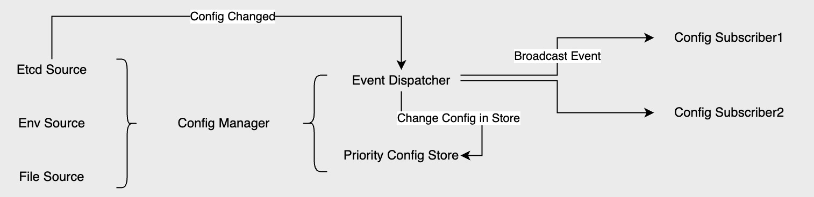

# MEP: Dynamic Configuration

Current state: "Accepted"

ISSUE: https://github.com/milvus-io/milvus/issues/18300

Keywords: config etcd

Released: 2.3.0

## Summary(required)

At present, there are numerous configurations in Milvus that require a restart of Milvus to take effect. This can interrupt service in production environments and is not friendly to operations and maintenance. In this MEP, a solution for dynamically updating configurations will be provided so that users can make configuration changes without restarting the cluster.

## Motivation(required)

Ability to dynamically modify configurations and expose current configuration information through API, simplifying operational complexity.

## Public Interfaces(optional)

No new public interfaces changed.

## Design Details(required)

### Goal

1. Support multiple config sources, including Etcd, environment variables, and configuration files. On this basis, add watch events for changes in the Etcd config path and file changes. When a change event occurs, broadcast it to subscribers through an event handler. Subscribers can decide on subsequent logic based on this to achieve the requirement of dynamically modifying configurations.
2. Configuration priority: Etcd > Environment > milvus.yaml; higher-priority configurations override lower-priority ones. Even if a higher-priority configuration is deleted, lower-priority configurations can still be used.
3. To ensure compatibility, ignore case sensitivity and characters such as / . \_ when dealing with configuration item keys.

ref: https://github.com/go-chassis/go-archaius/

No-Goal (Not in this release plan)

1. Configuration grading
1. Node override config
1. Collection override config
1. Support for more cloud configs such as Consul, Zookeeper, etc.

## Compatibility, Deprecation, and Migration Plan(optional)

Compatible with old versions.

## Test Plan(required)

- Verify the ability to dynamically modify configurations in etcd. 
- Verify the ability of helm and operator to deploy milvus.yaml and modify configurations. 
- Verify the effectiveness of business operations after partially modifying dynamic configurations. 
- Verify version compatibility under dynamic configuration.

## Rejected Alternatives(optional)

## References(optional)
