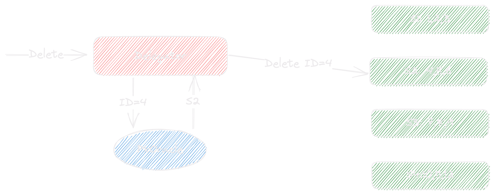

# MEP: Refactor QueryNode v2

Current state: Merged

ISSUE: [[Enhancement]: Refactor QueryNode #21624](https://github.com/milvus-io/milvus/issues/21624)

Keywords: Search, ANN

Released: v2.3.0

## Summary

By refactoring querynode, we plan to achieve:

- Separate "Delegator" and "Worker" 
- Remove delta channel for deletion forwarding
- Maintain growing segments in distribution
- Improve the readability of the code

## Delegator and Worker

`Delegator`, aka `ShardLeader` in querynode v1, handles the segment distribution and consumes data from the dml channel. All the distribution changes(load&release) shall be forwarded by delegators so that they shall always have the latest workable segment distribution information for the shard.

On the other hand, `Worker` serves as pure computing labor and provides search/query services on the segments on it.

One querynode could be `Delegator` and `Worker` at the same time for now. After separating them into two sub packages, we could easily rearrange them into different components in the future if needed.

### Interface Definition

```Go
// ShardDelegator is the interface definition.
type ShardDelegator interface {
        // Search & Query APIs
        Search(ctx context.Context, req *querypb.SearchRequest) ([]*internalpb.SearchResults, error)
        Query(ctx context.Context, req *querypb.QueryRequest) ([]*internalpb.RetrieveResults, error)
        GetStatistics(ctx context.Context, req *querypb.GetStatisticsRequest) ([]*internalpb.GetStatisticsResponse, error)


        // Distribution & dml related APIs
        ProcessInsert(insertRecords map[int64]*InsertData)
        ProcessDelete(deleteData []*DeleteData, ts uint64)
        LoadGrowing(ctx context.Context, infos []*querypb.SegmentLoadInfo, version int64) error
        LoadSegments(ctx context.Context, req *querypb.LoadSegmentsRequest) error
        ReleaseSegments(ctx context.Context, req *querypb.ReleaseSegmentsRequest, force bool) error
        SyncDistribution(ctx context.Context, entries ...SegmentEntry)
}
```
```Go
// Worker is the interface definition for querynode worker role.
type Worker interface {
        LoadSegments(context.Context, *querypb.LoadSegmentsRequest) error
        ReleaseSegments(context.Context, *querypb.ReleaseSegmentsRequest) error
        Delete(ctx context.Context, req *querypb.DeleteRequest) error
        Search(ctx context.Context, req *querypb.SearchRequest) (*internalpb.SearchResults, error)
        Query(ctx context.Context, req *querypb.QueryRequest) (*internalpb.RetrieveResults, error)
        GetStatistics(ctx context.Context, req *querypb.GetStatisticsRequest) (*internalpb.GetStatisticsResponse, error)


        IsHealthy() bool
        Stop()
}
```

## Remove delta channel

After supporting `Delete` operation in Milvus 2.0.x, delta channels are needed for forwarding delete operation to the querynodes on which there are no related DML channels. 

This mechanism makes the system require double the message queue topic compared to earlier Milvus version. Also, it couples the querynode search&query functionality with the forwarder of the delete records. Unfortunately, datanodes took this role, which may lead to search/query unavailability when some datanodes go down for some period of time.

Naturally, the Delegator shall become the forwarder since it could consume all the dml data(including delete) from the message queue. There are some critical points that need to be designed carefully:

- How to determine which segment/querynode shall be the target when forwarding the delete operations
- How to guarantee that all the segments have the whole picture of the deletion data

### Primary Key Oracle(PKOracle)

We need a component which could determine or estimate which segments might have the data with the provided pk value. Naming after PKOracle, it could be implemented in the following ways:

- Delegator has all the PK column data
- Delegator has all the statslog(Bloom filter) files
- A third party component stores the PK value-segment ID mapping

Since we implemented delete using BF before, it's the first choice to have option 2.



Delete grpc def:

```Go
Delete(context.Context, *querypb.DeleteRequest) (*commonpb.Status, error)
```
``` Protobuf
message DeleteRequest {
  common.MsgBase base = 1;
  int64 collection_id = 2;
  int64 partition_id = 3;
  string vchannel_name = 4;
  int64 segment_id = 5;
  schema.IDs primary_keys = 6;
  repeated uint64 timestamps = 7; 
}
```

### Delete Forwarding Policy

Delegators need to forward delete operation via grpc before any search/query operation can be executed. There are still several ways to forward the deletion data.

- Forward  the delete ASAP and blocks the consuming workflow if forwarding fails
- Forward the delete lazily. Which means deleting data could be forwarded in search or query request when needed with extra periodically "flush" jobs
- Forward the processed bitset only

Policy 3 can not be done without delegators having all the primary key data. So with pre-determined BF PKOracle implementation, we need to choose between policy 1 & 2.

After some investigation, it turned out to be that all the deletion records need to be applied strictly in the sequence order by its timestamp. Otherwise, the internal binary search may return wrong bitset for deletion. So  Policy 1 became the only choice before we changed the segment inner implementation.

### Data Integrity Guarantee

Since Milvus2.x could be deployed as a distributed system, there are several cases that may damage data integrity

- Load Asynchronizely 

In current design, there is no guarantee that all segments will be ready when delegators forward the deletion records while the collection is being loaded. 

- Load a new Segment

A new segment might be loaded after the collection loaded due to some compaction might happen. If the consumed position is after the safe point (all delete operations before is synced to delta log), some delete entries might be missing during this procedure.

- Balance, Node down or Rolling upgrade

Similar to the previous case, when balancing segments, some deletion records might be missing as well. The same logic could apply to node down recovery and rolling upgrade.

- Solution: Delete buffer with failure re-consume

To solve the cases in which delete data might be lost, delegators will have a delete buffer to store "recent" delete data. So anytime a segment is loaded, the delegator will try to patch all the "needed" delete data from this buffer.
By "recent", it means a limited double buffer with configurable size. 
And "needed" delete data means the delete records after the segment checkpoint.
If the segment checkpoint is beyond the delete buffer,the delegator will re-consume the delete data from the checkpoint as a last resort.

## Other changes

### Use pipeline instead of flowgraph

Pipeline was a simplified flowgraph that every node could have one in-degree and one out-degree at most.

Like an assembly line, pipeline splits a work that needs repeating over a period of time into many different parts. Every node was a single go routine work for one part of these. To improve  running speed by improving parallelism.  

At querynode, pipeline was used to deal with msg from MsgStream, FilterNode filterates the invalid part in msg, Insert Node Insert rows to segment from msg,Delete Node Insert delete rows to segment from Msg and update TSafe.

### Search/Query tsafe

Since the only consumer is the delegator, the waiting tsafer logic is moved to delegator for now.

## Interfaces

### Manager
```Go
type CollectionManager interface {
    // Get returns collection within a LRU cache,
    // it will pull the collection from QueryCoord if it's not in the cache,
    // returns error if failed to pull
    Get(collectionID int64) (*Collection, error)
}

type SegmentManager interface {
    // Put puts the given segments in,
    // and increases the ref count of the corresponding collection,
    // dup segments will not increase the ref count
    Put(segmentType SegmentType, segments ...*Segment)
    Get(segmentID UniqueID) *Segment
    GetSealed(segmentID UniqueID) *Segment 
    GetGrowing(segmentID UniqueID) *Segment
    // Remove removes the given segment,
    // and decreases the ref count of the corresponding collection,
    // will not decrease the ref count if the given segment not exists
    Remove(segmentID UniqueID, scope querypb.DataScope)
}
```

### Loader
```Go
type Loader interface {
    // Load loads binlogs, and spawn segments,
    // NOTE: make sure the ref count of the corresponding collection will never go down to 0 during this
    Load(ctx context.Context, collectionID int64, segmentType SegmentType, version int64, infos ...*querypb.SegmentLoadInfo) ([]Segment, error)
}
```

### Segment
```Go
type Segment interface {
    // Properties
    ID() int64
    Collection() int64
    Partition() int64
    Channel() string
    Version() int64
    StartPosition() *internalpb.MsgPosition
    Type() SegmentType

    // Index related
    AddIndex(fieldID int64, index *IndexedFieldInfo)
    GetIndex(fieldID int64) *IndexedFieldInfo
    HaveIndex(fieldID int64) bool

    // Insert related
    Insert(entityIDs []int64, timestamps []Timestamp, record *segcorepb.InsertRecord) error
    Delete(entityIDs []storage.PrimaryKey, timestamps []typeutil.Timestamp) error

    // Query related
    Search(searchReq *searchRequest) (*SearchResult, error)
    Retrieve(plan *RetrievePlan) (*segcorepb.RetrieveResults, error)
}

func NewSegment(collection *Collection,
    segmentID int64,
    partitionID int64,
    collectionID int64,
    channel string,
    segmentType SegmentType,
    version int64,
    startPosition *internalpb.MsgPosition) (*Segment, error)
func DeleteSegment(segment *Segment)
```

## Collection
```Go
type Collection struct {
}

func (c *Collection) ID() UniqueID
func (c *Collection) Schema() *schemapb.CollectionSchema
func (c *Collection) GetPartitions() []int64
func (c *Collection) HasPartition(partitionID int64) bool
func (c *Collection) AddPartition(partitionIDs ...int64)
func (c *Collection) RemovePartition(partitionID int64)
func (c *Collection) GetLoadType() querypb.LoadType
func NewCollection(collectionID int64, schema *schemapb.CollectionSchema, loadType querypb.LoadType) *Collection
func DeleteCollection(collection *Collection)
```

## PipelineManager
```Go
type PipelineManager struct {
}

func (m *PipelineManager) Num() int
func (m *PipelineManager) Add(collectionID UniqueID, dmlChannels []string) error
func (m *PipelineManager) Get(collectionID UniqueID, channel Channel) (*Pipeline, error)
func (m *PipelineManager) Remove(channels []Channel)
func (m *PipelineManager) Close()
```

## Test Plan

### Unit tests

All packages in querynode v2 coverage about 80%

### E2E Tests

All existing load/release/search/query test cases passes.

### Integration Tests

- Worker delete failed test cases
- Worker offline test cases

## References

None

