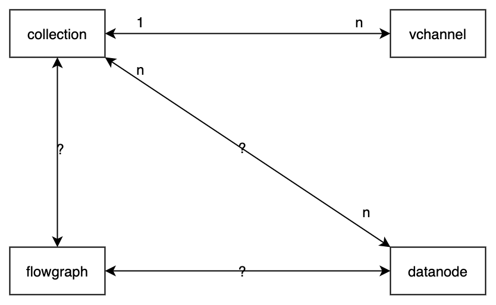
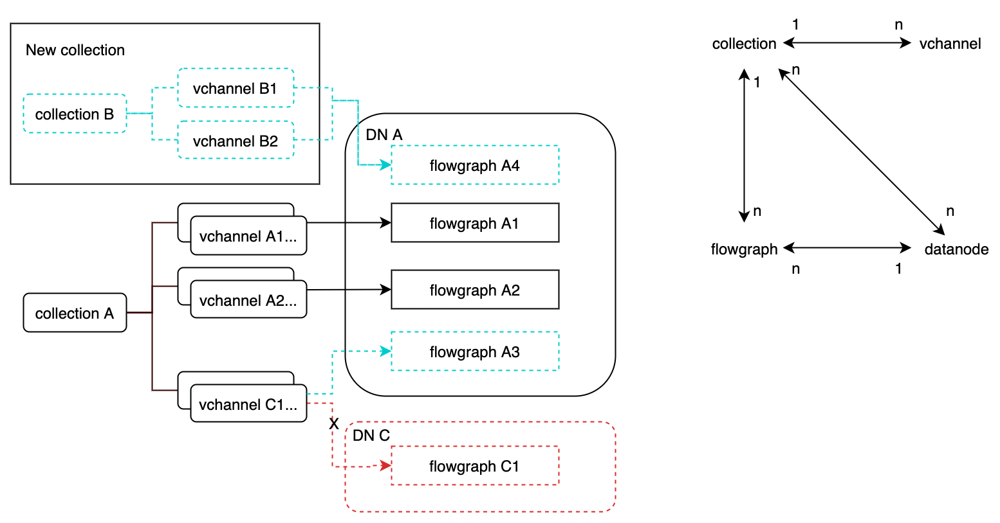

# DataNode Design
## Objective
### 故障恢复

1. 服务注册
DataNode grpc server 启动后，向 Etcd 注册，注册成功即处于初始化状态
2. 服务发现
DataNode 需要发现 DataService， MasterService 服务，发现之后即处于正常工作状态。
3. 恢复状态
1.  启动时的行为：
  1. DataNode 之间无法互相感知， 启动后，依赖 DataService 告诉自己需要订阅的 VChannel， 以及每个 Channel 订阅的 Positions。（DataService 需要在感知新的 DataNode 时，Load Balance DataNode 们订阅的 Channel。）
  2. 【现状】DataNode 启动时从 MasterService 请求到所有的 collection schema 来初始化 replica。DataNode 订阅 DDL channel 并实时更新内存中的 replica。在 DataNode buffer insert 数据时， 会使用 replica 中的 collection schema 对数据解码。
  3. 【问题1】启动时从 masterservice 请求到的 schema 是最新的，但 datanode 有可能从非最新的 DDL 数据开始消费，如果 schema 不可变；但如果 schema 可变。
  4. 【问题2】 启动时缓存所有的 collection 到每个 datanode 并不明智，至少要改为只缓存订阅的 vchannel 属于的 collection？
  5. 【问题3】 启动时是否需要从 masterservice 缓存？订阅 DDL channel 是否就能满足这一需求了？不能，如果 collection 创建的很早，但是在很久之后 insert，那么每个datanode 都需要从很早订阅 DDL channel，并重复执行很多操作。所以 MasterService 拿目前最新的collection 状态是不可少的行为，但不应该在启动时拿？
  6. 【问题4】datanode 使用 flowgraph 处理 ddl 和 dml channel 的作用是什么？datanode 以什么逻辑恢复对 ddl 的订阅？恢复订阅 ddl 之后，所有没有订阅的消息产生的 collection meta 从何而来（masterservice 必定只能拿到最新的 collection schema）？DataNode 需要的是最新的 collection schema 吗（如果 schema 不能更改，任何时候拿都可，被删除的 collection schema 会拿不到）？
  7. 【问题5】 datanode 是否可以不订阅 ddl，会有哪些问题？（不可以，这样flowgraph就失去了意义）
  8. 【问题6】 datanode 们会 flush 同样的 ddl 数据
  9. 【问题7】 数据是否能丢
2. 无法访问 DataService 时的行为?
3.  无法访问 MasterService 时的行为？
4.  无法访问 MinIO 时的行为？

### TODO

1. DataNode no longer interacts with Etcd except service registering.
    **O1-1**. DataService rather than DataNode saves binlog paths into Etcd.
    
    
    
    **O1-2**. DataNode registers itself to Etcd when started.
    
2. DataNode gets start and end MsgPositions of all channels, and report to DataService after flushing.

     **O2-1**. Set start and end positions while publishing ddl messages.
     **O2-2**. Get message positions in flowgraph and pass through nodes, report to DataService along with binlog paths. （ after **O4 **）
     **O2-3**. DataNode is no longer aware of whether if segment flushed, so SegmentFlushed messages should be sent by DataService (with **O1-1** ).

3. DataNode recovery
     **O3-1**. Flowgraph is initialized after DataService called WatchDmChannels, flowgraph is healthy if MasterService is available.

4. DataNode with collection with flowgraph with vchannel。

     

• If collection:flowgraph = 1 : 1, datanode must have ability to scale flowgraph.

•** [Winner]** If collection:flowgraph = 1 : n, datanode must have ability to scale flowgraph. Vchannel of collection is scalable.

• If collection:flowgraph = n : 1, in the blue cases, datanode must have ability to scale flowgraph. In the brown cases, flowgraph must be able to scale channels.

• If collection:flowgraph = n : n  , load balancing on vchannels.

