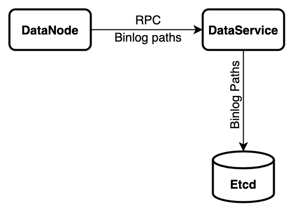
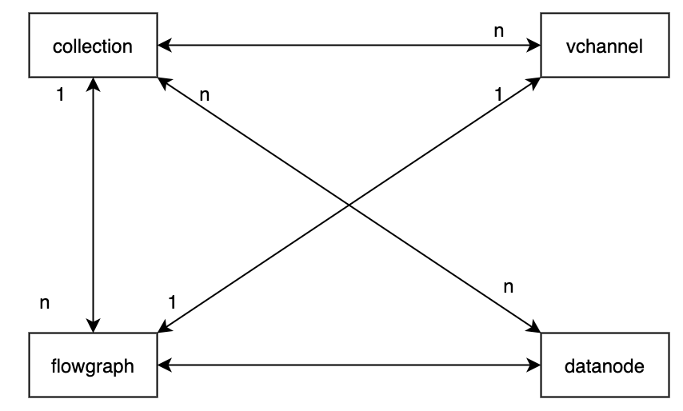
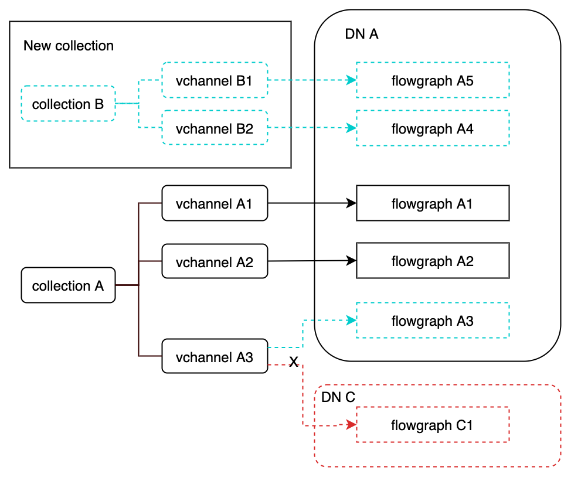
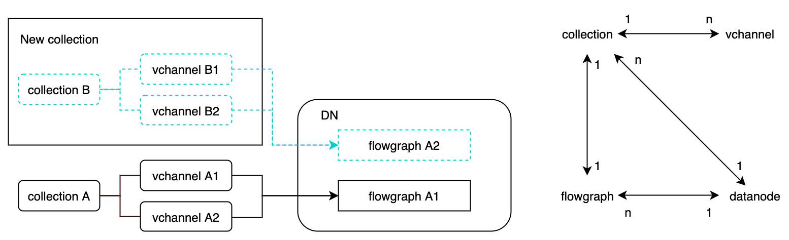
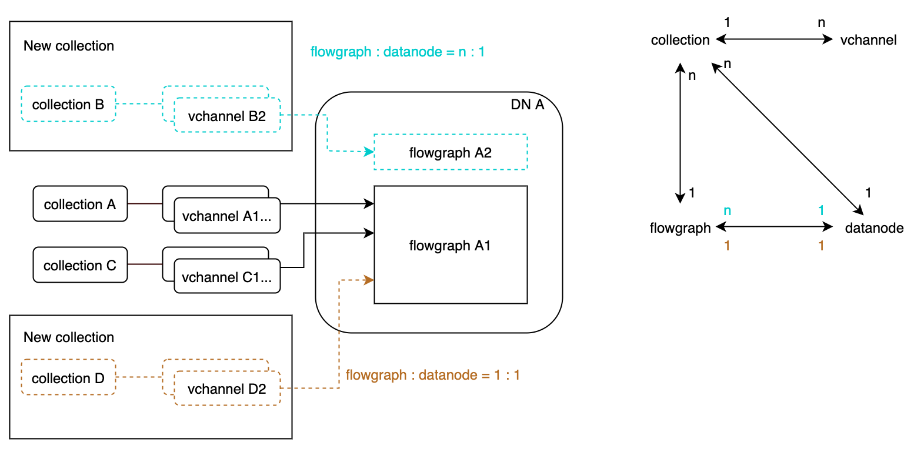
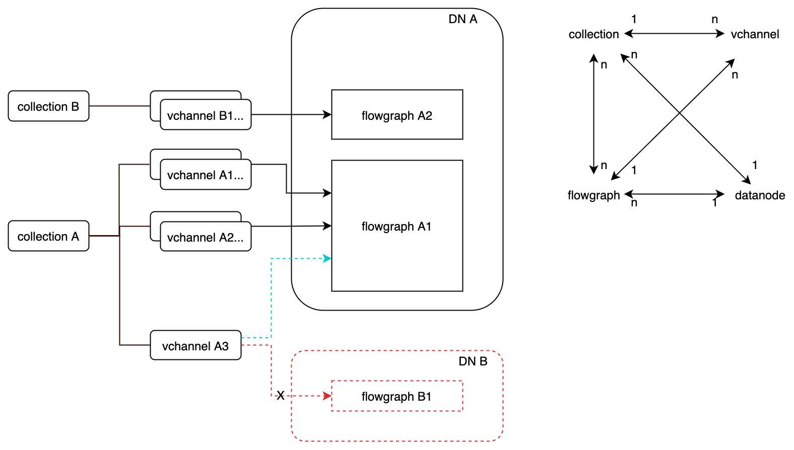

# DataNode Recovery Design

update: 5.21.2021, by [Goose](https://github.com/XuanYang-cn)  
update: 6.03.2021, by [Goose](https://github.com/XuanYang-cn)
update: 6.21.2021, by [Goose](https://github.com/XuanYang-cn)

## What's DataNode?

DataNode processes insert data and persists them.

DataNode is based on flowgraph; each flowgraph cares about only one vchannel. There are ddl messages, dml
messages, and timetick messages inside one vchannel, FIFO log stream.

One vchannel only contains dml messages of one collection. A collection consists of many segments, hence
a vchannel contains dml messsages of many segments. **Most importantly, the dml messages of the same segment
can appear in anywhere in vchannel.**

## What does DataNode recovery really mean?

DataNode is stateless, but vchannel has states. DataNode's statelessness is guaranteed by DataCoord, which
means the vchannel's state is maintained by DataCoord. So DataNode recovery is no different from starting.

So what's DataNode's starting procedure?

## Objectives

### 1. Serveice Registration

DataNode registers itself to etcd after grpc server started, in *INITIALIZING* state.

### 2. Service Discovery

DataNode discovers DataCoord and RootCoord, in *HEALTHY* and *IDLE* state.

### 3. Flowgraph Recovery

The detailed design can be found at [datanode flowgraph recovery design](datanode_flowgraph_recovery_design_0604_2021.md).

After DataNode subscribes to a stateful vchannel, DataNode starts to work, or more specifically, flowgraph starts to work.

Vchannel is stateful because we don't want to process twice what's already processed. And a "processed" message means its
already persistant. In DataNode's terminology, a message is processed if it's been flushed.

DataCoord tells DataNode stateful vchannel infos through RPC `WatchDmChannels`, so that DataNode won't process
the same messages over and over again. So flowgraph needs ability to consume messages in the middle of a vchannel.

DataNode tells DataCoord vchannel states after each flush through RPC `SaveBinlogPaths`, so that DataCoord
keep the vchannel states update.


## Some of the following interface/proto designs are outdated, will be updated soon

### 1. DataNode no longer interacts with etcd except service registering

#### DataCoord rather than DataNode saves binlog paths into etcd

   


##### DataCoord RPC Design

```proto
rpc SaveBinlogPaths(SaveBinlogPathsRequest) returns (common.Status){}
message ID2PathList {
    int64 ID = 1;
    repeated string Paths = 2;
}

message CheckPoint {
    int64 segmentID = 1;
    internal.MsgPosition position = 2;
    int64 num_of_rows = 3;
}

message SaveBinlogPathsRequest {
    common.MsgBase base = 1;
    int64 segmentID = 2;
    int64 collectionID = 3;
    repeated ID2PathList field2BinlogPaths = 4;
    repeated CheckPoint checkPoints = 7;
    repeated SegmentStartPosition start_positions = 6;
    bool flushed = 7;
 }
```

### 4. DataNode with collection with flowgraph with vchannel designs

#### The winner
  

  

**O4-1.** DataNode scales flowgraph 2 Day

Change `WatchDmChannelsRequest` proto.

``` proto
message VchannelInfo {
  int64 collectionID = 1;
  string channelName = 2;
  internal.MsgPosition seek_position = 3;
  repeated SegmentInfo unflushedSegments = 4;
  repeated int64 flushedSegments = 5;
}

message WatchDmChannelsRequest {
  common.MsgBase base = 1;
  repeated VchannelInfo vchannels = 2;
}
```

DataNode consists of multiple DataSyncService, each service controls one flowgraph.

```go
// DataNode
type DataNode struct {
    ...
    vchan2Sync map[string]*dataSyncService
    vchan2FlushCh map[string]chan<- *flushMsg

    clearSignal chan UniqueID
    ...
}

// DataSyncService
type dataSyncService struct {
	ctx          context.Context
	fg           *flowgraph.TimeTickedFlowGraph
	flushChan    <-chan *flushMsg
	replica      Replica
	idAllocator  allocatorInterface
	msFactory    msgstream.Factory
	collectionID UniqueID
}
```

DataNode Init -> Resigter to etcd -> Discovery data service -> Discover master service -> IDLE

WatchDmChannels -> new dataSyncService -> HEALTH

`WatchDmChannels:`

1. If `DataNode.vchan2Sync` is empty, DataNode is in IDLE, `WatchDmChannels` will create new dataSyncService for every unique vchannel, then DataNode is in HEALTH.
2. If vchannel name of `VchannelPair` is not in `DataNode.vchan2Sync`, create a new dataSyncService.
3. If vchannel name of `VchannelPair` is in `DataNode.vchan2Sync`, ignore.

```

#### The boring design

• If collection:flowgraph = 1 : 1, datanode must have ability to scale flowgraph.



•** [Winner]** If collection:flowgraph = 1 : n, flowgraph:vchannel = 1:1


• If collection:flowgraph = n : 1, in the blue cases, datanode must have ability to scale flowgraph. In the brown cases, flowgraph must be able to scale channels.



• If collection:flowgraph = n : n  , load balancing on vchannels.


