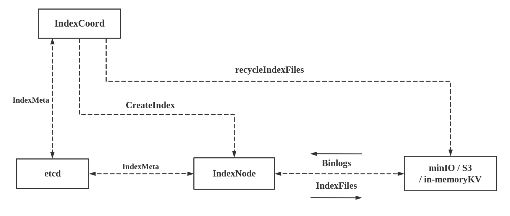
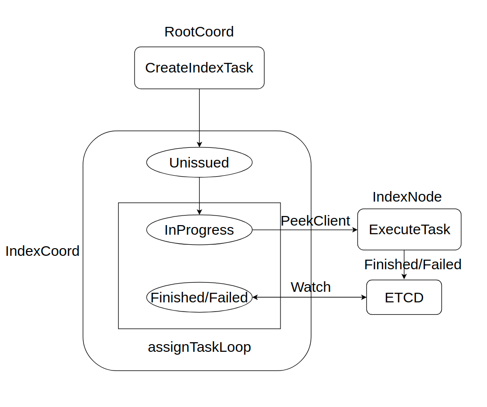

# 8. IndexCoord Design

update: 7.31.2021, by [Cai.Zhang](https://github.com/xiaocai2333)

## 8.0 Component Description

IndexCoord is a component responsible for scheduling index construction tasks and maintaining index status.
IndexCoord accepts requests from rootCoord to build indexes, delete indexes, and query index information.
IndexCoord is responsible for assigning IndexBuildID to the request to build the index, and forwarding the
request to build the index to IndexNode. IndexCoord records the status of the index, and the index file.

The following figure shows the design of the indexCoord component:



## 8.1 Use etcd as a reliable service

Based on etcd service discovery, IndexCoord components, like other Milvus components, rely on etcd to implement
service discovery. IndexCoord relies on the lease mechanism of etcd to sense the online and offline news of IndexNode.

In addition to service discovery, Milvus also uses etcd as a reliable meta storage, and writes all
persistent status information to etcd. The purpose is to restore a certain Milvus component to its original
state after power off and restart.

## 8.2 Receive requests about index from RootCoordinate

IndexCoordinate receives requests from RootCoordinate to build an index, delete an index, and query the status of an index.

In Milvus, index building is performed asynchronously. When IndexCoordinate receives a request to build an index from
RootCoordinate, it will first check whether the same index has been created according to the index parameters. If yes, it would 
return the IndexBuildID of the existing task. Otherwise, it would assign a globally unique IndexBuildID to the task, 
record the task in the MetaTable, write the MetaTable to etcd, and then return the IndexBuildID to RootCoordinate.  
RootCoordinate confirms the index building was generated successfully by the IndexBuildID. At this time, the index construction 
is completed yet. IndexCoordinate starts a background process to find all the index tasks that need to be 
allocated periodically, and then allocates them to IndexNode for actual execution.

When IndexCoordinate receives a request to delete an index from RootCoordinate, IndexCoordinate traverses the MetaTable,
marks the corresponding index task as deleted, and returns. It is not really deleted from the MetaTable at this time.
IndexCoordinate has another background process that periodically queries the index tasks that need to be deleted.
When the index task is marked as deleted, and the index status is complete, the corresponding index task is actually
deleted from the MetaTable.

When IndexCoordinate receives a query index status request from other components, first check whether the corresponding
index task is marked for deletion in the MetaTable. If marked for deletion, the return index does not exist, otherwise,
it returns the index information

## 8.3 Feature Design

IndexCoord has two main structures, NodeManager and MetaTable. NodeManager is used to manage IndexNode node information,
and MetaTable is used to maintain index related information.

IndexCoord mainly has these functions: `watchNodeLoop`, `watchMetaLoop`, `assignTaskLoop` and `recycleUnusedIndexFiles`.
`watchNodeLoop` is mainly responsible for monitoring the changes of IndexNode nodes, `watchMetaLoop` is mainly
responsible for monitoring the changes of Meta, `assignTaskLoop` is mainly responsible for assigning index building tasks,
and `recycleUnusedIndexFiles` is mainly responsible for cleaning up useless index files and deleted index records.

### 8.3.1 The relationship between IndexCoord and IndexNode

IndexCoord is responsible for assigning index construction tasks and maintaining index status, and IndexNode is the
node that executes index building tasks.

### 8.3.2 NodeManager

NodeManager is responsible for managing the node information of IndexNode, and contains a priority queue to save the
load information of each IndexNode. The load information of IndexNode is based on the number of tasks executed.
When the IndexCoord service starts, it first obtains the node information of all
current IndexNodes from etcd, and then adds the node information to the NodeManager. After that, the online and offline
information of IndexNode node is obtained from watchNodeLoop. Then it will traverse the entire MetaTable, get the load
information corresponding to each IndexNode node, and update the priority queue in the NodeManager. Whenever the task
of building an index needs to be allocated, the IndexNode with the lowest load will be selected according to the
priority queue to execute the task.

### 8.3.3 MetaTable

In order to maintain the status information of the index, we introduced MetaTable to record the status information
of the index. In order to ensure that the MetaTable information is not lost after IndexCoord is powered off and
restarted, we write the MetaTable information into etcd. When the IndexCoord service starts, it will first load the
existing Meta information from etcd, and then monitor the changes of Meta through watchNodeLoop. In order to distinguish
whether the modification of Meta was initiated by IndexCoord or IndexNode, revision was introduced in Meta.
When watchMetaLoop detects that the Meta in etcd is updated, compare the revision in Meta with the Event.Kv.Version
of the etcd event. If the revision is equal to Event.Kv.Version, it means that the update was initiated by IndexCoord.
If the revision is less than Event. .Kv.Version means that this Meta update was initiated by IndexNode, and IndexCoord
needs to update Meta. There will be no situation where revision is greater than Event.Kv.Version.

In order to prevent IndexNode from appearing in a suspended animation state, Version is introduced. When IndexCoord
finds that IndexNode is offline, it assigns the unfinished tasks that IndexNode is responsible for to other IndexNodes,
and adds 1 to Version. After the task is completed, it is found that the version corresponding to the task is already
larger than the version corresponding to the task it is executing, and the Meta is not updated.

### 8.3.4 watchNodeLoop

`watchNodeLoop` is used to monitor IndexNode going online and offline. When IndexNode goes online and offline,
IndexCoord adds or deletes the corresponding IndexNode information in NodeManager.

### 8.3.5 watchMetaLoop

`watchMetaLoop` is used to monitor whether the Meta in etcd has been changed. When the Meta in the etcd is monitored,
the result of the Meta update is obtained from the etcd, and the `Event.Kv.Version` of the update event is compared
with the `revision` in the MetaTable. If the `Event.Kv.Version` is greater than the `revision` in the MetaTable,
Explain that this update is initiated by IndexNode, and then update the MetaTable in IndexCoord. Since this update
is initiated by IndexNode, it indicates that this IndexNode has completed this task, so update the load of this
IndexNode in NodeManager, and the task amount is reduced by one.

### 8.3.6 assignTaskLoop

`assignTaskLoop` is used to assign index construction tasks. There is a timer here to traverse the MetaTable regularly
to filter out the tasks that need to be allocated, including unallocated tasks and tasks that have been failed due to
indexNode crash. Then sort according to the version size of each task, and assign tasks with a smaller
version first. The purpose is to prevent certain special tasks from occupying resources all the time and always fail
to execute successfully. When a task is assigned, its corresponding Version is increased by one. Then send the task to
IndexNode for execution, and update the index status in the MetaTable.

### 8.3.7 recycleUnusedIndexFiles

Delete useless index files, including lower version index files and index files corresponding to the deleted index.
In order to distinguish whether the low version index file corresponding to the index has been cleaned up, recycled is
introduced as a mark. Only after the index task is completed will the lower version index files be cleaned up, and the
index file corresponding to the lower version index file that has been cleaned up is marked as True.

This is also a timer, which periodically traverses the MetaTable to obtain the index corresponding to the index file
that needs to be cleaned up. If the index is marked as deleted, the information corresponding to the index is deleted
in the MetaTable. Otherwise, it just cleans up the index file of the lower version.

## 8.4 IndexNode Create Index

IndexNode is the execution node of index building tasks, and all index building tasks are forwarded to IndexNode by
IndexCoordinate for execution. When IndexNode executes an index build request, it first reads IndexMeta information
from etcd, and checks whether the index task is marked for deletion when IndexCoordinate is forwarded to IndexNode.
If it is marked as deleted, then there is no need to actually build the index, just mark the index task status as
completed, and then write it to etcd. When IndexCoordinate perceives that the status corresponding to the index is
complete, it deletes the index task from the MetaTable. If it is checked that the index is not marked for deletion,
then the index needs to be built. The original data must be loaded first when building the index. The original data
is stored in MinIO/S3, and the storage path is notified by RootCoordinate in the index build request. After loading the
original data, the data is deserialized into data blocks, and then cgo is called to build the index. When the index is
built, the index data is serialized into data blocks, and then written into the file. The directory organization of the
index file is "indexBuildID/IndexTaskVersion/partitionID/segmentID/key", where key corresponds to the serialized key
of index data. After the index is built, record the index file directory in IndexMeta, and then write it to etcd.

## 8.5 API

### 8.5.1 BuildIndex

Index building is asynchronous, so when an index building request comes, an IndexBuildID is assigned to the task and
the task is recorded in Meta. The background process assignTaskLoop will find this task and assign it to IndexNode for
execution.

The following figure shows the state machine of IndexTask during execution:



### 8.5.2 DropIndex

DropIndex deletes indexes based on IndexID. One IndexID corresponds to the index of an entire column. A column is
divided into many segments, and each segment corresponds to an IndexBuildID. IndexCoord uses IndexBuildID to record
index tasks. Therefore, when DropIndex, delete all tasks corresponding to IndexBuildID corresponding to IndexID.

## 8.6 Key Term

### 8.6.1 Meta

```go
type Meta struct {
        indexMeta *indexpb.IndexMeta
        revision  int64
}
```

Meta is used to record the state of the index.

- Revision: The number of times IndexMeta has been changed in etcd. It's the same as Event.Kv.Version in etcd.
  When IndexCoord watches the IndexMeta in etcd is changed, can compare `revision` and Event.Kv.Versionto determine
  this modification of IndexMeta is caused by IndexCoord or IndexNode. If it is caused by IndexNode, the Meta in
  IndexCoord must be updated.

### 8.6.2 IndexMeta

```ProtoBuf
message IndexMeta {
  int64 indexBuildID = 1;
  common.IndexState state = 2;
  string fail_reason = 3;
  BuildIndexRequest req = 4;
  repeated string index_file_paths = 5;
  bool mark_deleted = 6;
  int64 nodeID = 7;
  int64 version = 8;
  bool recycled = 9;
}
```

- indexBuildID: ID of the index task.
- state: The state of the index.
- fail_reason: The reason why the index build failed.
- req: The request for the building index.
- index_file_paths: The paths of index files.
- mark_deleted: Mark whether the index has been deleted.
- nodeID: ID of the IndexNode that built the index.
- version: Number of retries for the index.
- recycled: Mark whether the unused files of the index have been cleaned up.
