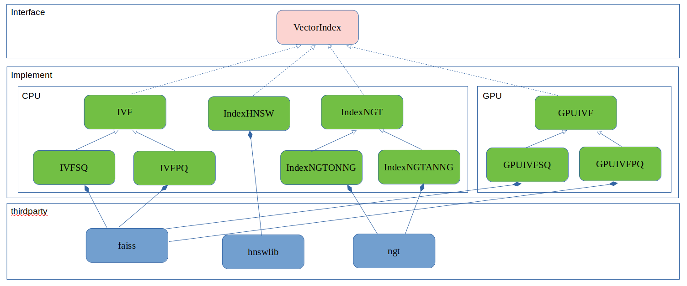
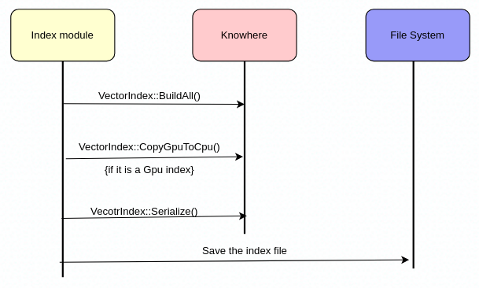
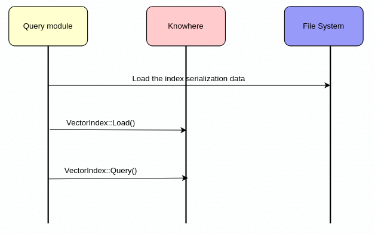

# What's Knowhere

## Concepts
Vector index is a time-efficient and space-efficient data structure built on vectors through a certain mathematical model. Through the vector index, we can efficiently query several vectors similar to the target vector.
Since accurate retrieval is usually very time-consuming, most of the vector index types of Milvus use ANNS (Approximate Nearest Neighbors Search). Compared with accurate retrieval, the core idea of ANNS is no longer limited to returning the most accurate result, but only searching for neighbors of the target. ANNS improves retrieval efficiency by sacrificing accuracy within an acceptable range.

## What can knowhere do
Knowhere is the vector index module of Milvus. It encapsulates many popular vector index algorithm libraries, such as faiss, hnswlib, NGT, annoy, and provides a set of unified interfaces. In addition, Knowhere also supports heterogeneous computing.

## Framework


For more index types and heterogeneous support, please refer to the vector index document.

## Major Interface
``` C++
/*
 * Serialize
 * @return: serialization data
 */
BinarySet
Serialize();

/*
 * Load from serialization data
 * @param dataset_ptr: serialization data
 */
void
Load(const BinarySet&);

/*
 * Create index
 * @param dataset_ptr: index data
 * @parma config: index param
 */
void
BuildAll(const DatasetPtr& dataset_ptr, const Config& config);

/*
 * KNN (K-Nearest Neighbors) Query
 * @param dataset_ptr: query data
 * @parma config: query param
 * @parma blacklist: mark for deletion
 * @return: query result
 */
DatasetPtr
Query(const DatasetPtr& dataset_ptr, const Config& config, BitsetView blacklist);

/*
 * Copy the index from GPU to CPU
 * @return: CPU vector index
 * @notes: Only valid of the GPU indexes
 */
VecIndexPtr
CopyGpuToCpu();

```

## Sequence
### Create index


### Query

