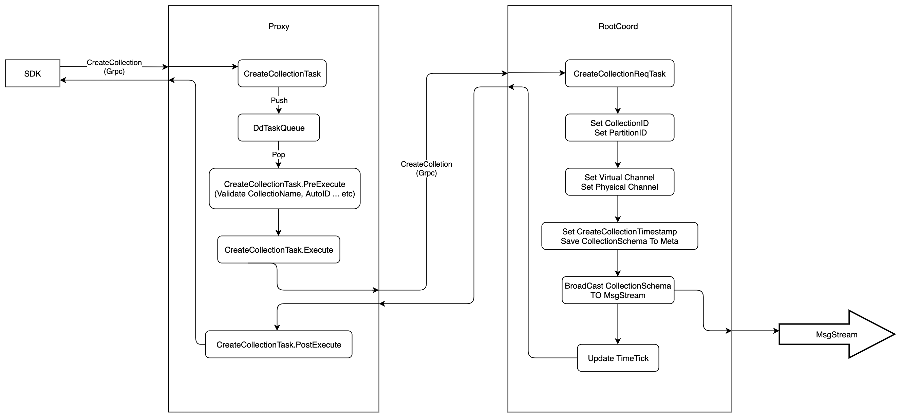

# Create Collections

`Milvus 2.0` use `Collection` to represent a set of data, like `Table` in traditional database. Users can create or drop `Collection`. Altering the `Schema` of `Collection` is not supported yet. This article introduces the execution path of `CreateCollection`, at the end of this article, you should know which components are involved in `CreateCollection`.


The execution flow of `CreateCollection` is shown in the following figure:



1. Firstly, `SDK` starts a `CreateCollection` request to `Proxy` via `Grpc`, the `proto` is defined as follows:
```proto
service MilvusService {
    ...

    rpc CreateCollection(CreateCollectionRequest) returns (common.Status) {}

    ...
}

message CreateCollectionRequest {
  common.MsgBase base = 1; // must
  string db_name = 2;
  string collection_name = 3; // must
  // `schema` is the serialized `schema.CollectionSchema`
  bytes schema = 4; // must
  int32 shards_num = 5; // must. Once set, no modification is allowed
}

message CollectionSchema {
  string name = 1;
  string description = 2;
  bool autoID = 3; // deprecated later, keep compatible with c++ part now
  repeated FieldSchema fields = 4;
}

```

1. When received the `CreateCollection` request, the `Proxy` would wraps this request into `CreateCollectionTask`, and pushes this task into `DdTaskQueue` queue. After that, `Proxy` would call method of `WatiToFinish`  to wait until the task is finished.
```go
type task interface {
	TraceCtx() context.Context
	ID() UniqueID // return ReqID
	SetID(uid UniqueID) // set ReqID
	Name() string
	Type() commonpb.MsgType
	BeginTs() Timestamp
	EndTs() Timestamp
	SetTs(ts Timestamp)
	OnEnqueue() error
	PreExecute(ctx context.Context) error
	Execute(ctx context.Context) error
	PostExecute(ctx context.Context) error
	WaitToFinish() error
	Notify(err error)
Notify(err error)

type CreateCollectionTask struct {
	Condition
	*milvuspb.CreateCollectionRequest
	ctx context.Context
	rootCoord types.RootCoord
	dataCoordClient types.DataCoord
	result *commonpb.Status
	schema *schemapb.CollectionSchema
}
```

3. There is a background service in `Proxy`, this service would get the `CreateCollectionTask` from `DdTaskQueue`, and execute it in three phases.
    - `PreExecute`, do some static checking at this phase, such as check if `Collection Name` and `Field Name` are legal, if there are duplicate columns, etc.
    - `Execute`, at this phase, `Proxy` would send `CreateCollection` request to `RootCoord` via `Grpc`, and wait for response, the `proto` is defined as follow:
    ```proto
    service RootCoord {
        ...

        rpc CreateCollection(milvus.CreateCollectionRequest) returns (common.Status){}

        ...
    }
    ```
    - `PostExecute`, `CreateCollectonTask` does nothing at this phase, and return directly.

4. `RootCoord` would wrap the `CreateCollection` request into `CreateCollectionReqTask`, and then call function `executeTask`. `executeTask` would return until the `context` is done or `CreateCollectionReqTask.Execute` is returned.
```go
type reqTask interface {
	Ctx() context.Context
	Type() commonpb.MsgType
	Execute(ctx context.Context) error
	Core() *Core
Core() *Core }

type CreateCollectionReqTask struct {
	baseReqTask
	Req *milvuspb.CreateCollectionRequest
}
```

5. `CreateCollectionReqTask.Execute` would alloc `CollecitonID` and default `PartitionID`, and set `Virtual Channel` and `Physical Channel`, which are used by `MsgStream`, then write the `Collection`'s meta into `metaTable`

6. After `Collection`'s meta writing into `metaTable`, `Milvus` would consider this collection has been created successfully.

7. `RootCoord` would alloc a timestamp from `TSO` before writing `Collection`'s meta into `metaTable`, and this timestamp is considered as the point when the collection was created

8. At last `RootCoord` will send a message of `CreateCollectionRequest` into `MsgStream`, and other components, who have subscribed to the `MsgStream`, would be notified. The `Proto` of `CreateCollectionRequest` is defined as follow:
```proto
message CreateCollectionRequest {
  common.MsgBase base = 1;
  string db_name = 2;
  string collectionName = 3;
  string partitionName = 4;
  int64 dbID = 5;
  int64 collectionID = 6;
  int64 partitionID = 7;
  // `schema` is the serialized `schema.CollectionSchema`
  bytes schema = 8;
  repeated string virtualChannelNames = 9;
  repeated string physicalChannelNames = 10;
}

```

9. After all these operations, `RootCoord` would update internal timestamp and return, so the `Proxy` would get the response.

*Notes:*
1. In the `Proxy`, all `DDL` requests will be wrapped into `task`, and push the `task` into `DdTaskQueue`, the background service will read a new `task` from `DdTaskQueue` only when the previous one is finished. So all the `DDL` requests are executed serially on the `Proxy`

2. In the `RootCoord`, all `DDL` requests will be wrapped into `reqTask`, but there is no task queue, so the `DDL` requests will be executed in parallel on `RootCoord`.
