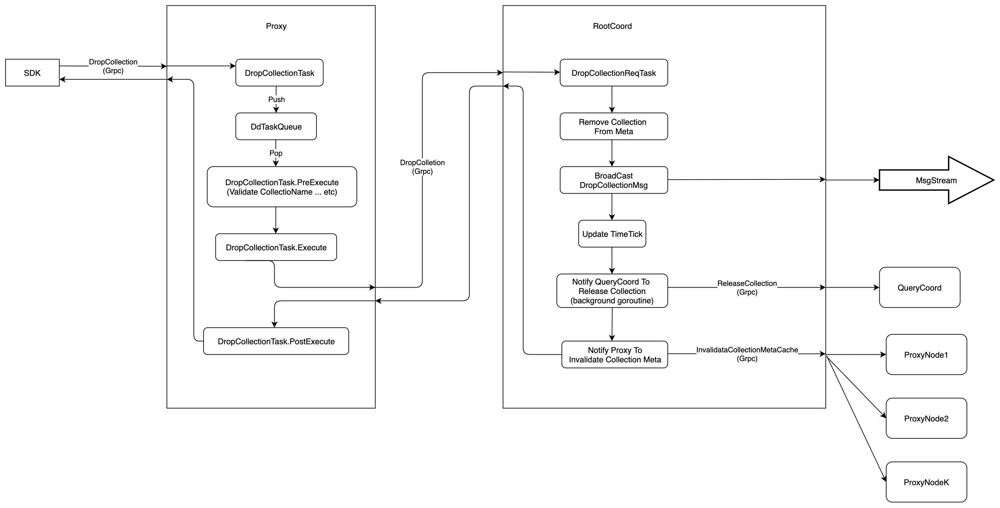
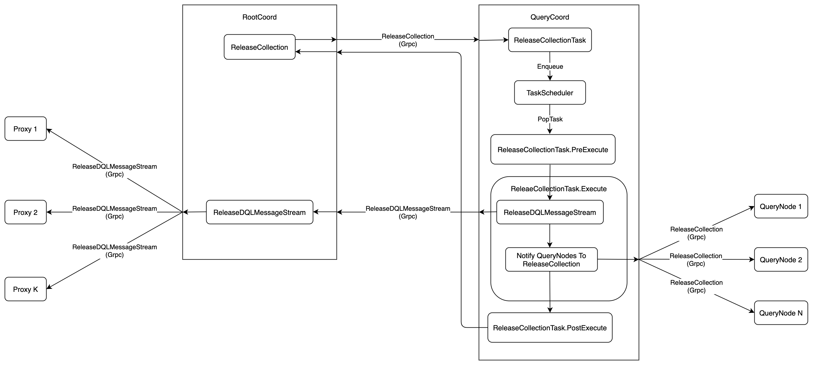
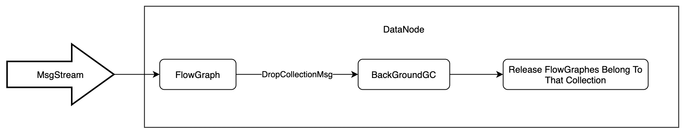

# Drop Collection
`Milvus 2.0` uses `Collection` to represent a set of data, like `Table` in traditional database. Users can create or drop `Collection`. Altering the `Schema` of `Collection` is not supported yet. This article introduces the execution path of `Drop Collection`. At the end of this article, you should know which components are involved in `Drop Collection`.

The execution flow of `Drop Collection` is shown in the following figure:



1. Firstly, `SDK` starts a `DropCollection` request to `Proxy` via `Grpc`, the `proto` is defined as follows:
```proto
service MilvusService {
    ...

    rpc DropCollection(DropCollectionRequest) returns (common.Status) {}

    ...
}

message DropCollectionRequest {
  common.MsgBase base = 1; // must
  string db_name = 2;
  string collection_name = 3; // must
}
```

2. Once the `DropCollection` request is received, the `Proxy` would wrap this request into `DropCollectionTask`, and push this task into `DdTaskQueue` queue. After that, `Proxy` would call method of `WatiToFinish` to wait until the task is finished.
```go
type task interface {
	TraceCtx() context.Context
	ID() UniqueID       // return ReqID
	SetID(uid UniqueID) // set ReqID
	Name() string
	Type() commonpb.MsgType
	BeginTs() Timestamp
	EndTs() Timestamp
	SetTs(ts Timestamp)
	OnEnqueue() error
	PreExecute(ctx context.Context) error
	Execute(ctx context.Context) error
	PostExecute(ctx context.Context) error
	WaitToFinish() error
	Notify(err error)
}

type DropCollectionTask struct {
	Condition
	*milvuspb.DropCollectionRequest
	ctx       context.Context
	rootCoord types.RootCoord
	result    *commonpb.Status
	chMgr     channelsMgr
	chTicker  channelsTimeTicker
}
```

3. There is a background service in `Proxy`, this service would get the `DropCollectionTask` from `DdTaskQueue`, and execute it in three phases:
    - `PreExecute`, do some static checking at this phase, such as check if `Collection Name` is legal etc.
    - `Execute`, at this phase, `Proxy` would send `DropCollection` request to `RootCoord` via `Grpc`, and wait the response, the `proto` is defined as below:
    ```proto
        service RootCoord {
          ...

           rpc DropCollection(milvus.DropCollectionRequest) returns (common.Status) {}

          ...
        }
    ```
    - `PostExecute`, `Proxy` would delete `Collection`'s meta from global meta table at this phase.

4. `RootCoord` would wrap the `DropCollection` request into `DropCollectionReqTask`, and then call function `executeTask`. `executeTask` would return until the `context` is done or `DropCollectionReqTask.Execute` is returned.
```go
type reqTask interface {
	Ctx() context.Context
	Type() commonpb.MsgType
	Execute(ctx context.Context) error
	Core() *Core
}

type DropCollectionReqTask struct {
	baseReqTask
	Req *milvuspb.DropCollectionRequest
}
```

5. Firstly, `RootCoord` would delete `Collection`'s meta from `metaTable`, including `schema`,`partition`, `segment`,`index`. All of these delete operations are committed in one transaction.

6. After `Collection`'s meta has been deleted from `metaTable`, `Milvus` would consider this collection has been deleted successfully.

7. `RootCoord` would alloc a timestamp from `TSO` before deleting `Collection`'s meta from `metaTable`. This timestamp is considered as the point when the collection was deleted.

8. `RootCoord` would send a message of `DropCollectionRequest` into `MsgStream`. Thus other components, who have subscribed to the `MsgStream`, would be notified. The `Proto` of `DropCollectionRequest` is defined as below:
```proto
message DropCollectionRequest {
  common.MsgBase base = 1;
  string db_name = 2;
  string collectionName = 3;
  int64 dbID = 4;
  int64 collectionID = 5;
}

```

9. After these operations, `RootCoord` would update internal timestamp.

10. Then `RootCoord` would start a `ReleaseCollection` request to `QueryCoord` via `Grpc` , notify `QueryCoord` to release all resources that related to this `Collection`. This `Grpc` request is done in another `goroutine`, so it would not block the main thread. The `proto` is defined as follows:
```proto
service QueryCoord {
    ...

    rpc ReleaseCollection(ReleaseCollectionRequest) returns (common.Status) {}

    ...
}

message ReleaseCollectionRequest {
  common.MsgBase base = 1;
  int64 dbID = 2;
  int64 collectionID = 3;
  int64 nodeID = 4;
}
```

11. At last, `RootCoord` would send `InvalidateCollectionMetaCache` request to each `Proxy`, notify `Proxy` to remove `Collection`'s meta. The `proto` is defined as follows:
```proto
service Proxy {
    ...

    rpc InvalidateCollectionMetaCache(InvalidateCollMetaCacheRequest) returns (common.Status) {}

    ...
}

message InvalidateCollMetaCacheRequest {
  common.MsgBase base = 1;
  string db_name = 2;
  string collection_name = 3;
}
```

12. The execution flow of `QueryCoord.ReleaseCollection` is shown in the following figure:



13. `QueryCoord` would wrap `ReleaseCollection` into `ReleaseCollectionTask`, and push the task into `TaskScheduler`

14. There is a background service in `QueryCoord`. This service would get the `ReleaseCollectionTask` from `TaskScheduler`, and execute it in three phases:
    - `PreExecute`, `ReleaseCollectionTask` would only print debug log at this phase.
    - `Execute`, there are two jobs at this phase:
        - send a `ReleaseDQLMessageStream` request to `RootCoord` via `Grpc`, `RootCoord` would redirect the `ReleaseDQLMessageStream` request to each `Proxy`, and notify the `Proxy` that stop processing any message of this `Collection` anymore. The `proto` is defined as follows:
        ```proto
            message ReleaseDQLMessageStreamRequest {
                common.MsgBase base = 1;
                int64 dbID = 2;
                int64 collectionID = 3;
            }
        ```
        - send a `ReleaseCollection` request to each `QueryNode` via `Grpc`, and notify the `QueryNode` to release all the resources related to this `Collection`, including `Index`, `Segment`, `FlowGraph`, etc. `QueryNode` would no longer read any message from this `Collection`'s `MsgStream` anymore  
        ```proto
            service QueryNode {
                ...

                rpc ReleaseCollection(ReleaseCollectionRequest) returns (common.Status) {}

                ...
            }

            message ReleaseCollectionRequest {
                common.MsgBase base = 1;
                int64 dbID = 2;
                int64 collectionID = 3;
                int64 nodeID = 4;
            }
        ```
    - `PostExecute`, `ReleaseCollectionTask` would only print debug log at this phase.

15. After these operations, `QueryCoord` would send `ReleaseCollection`'s response to `RootCoord`.

16. At `Step 8`, `RootCoord` has sent a message of `DropCollectionRequest` into `MsgStream`. `DataNode` would subscribe this `MsgStream`, so that it would be notified to release related resources. The execution flow is shown in the following figure.



17. In `DataNode`, each `MsgStream` will have a `FlowGraph`, which processes all messages. When the `DataNode` receives the message of `DropCollectionRequest`, `DataNode` would notify `BackGroundGC`, which is a background service on `DataNode`, to release resources.

*Notes*:
1. Currently, the `DataCoord` doesn't have response to the `DropCollection`. So the `Collection`'s `segment meta` still exists in the `DataCoord`'s `metaTable`, and the `Binlog` files belonging to this `Collection` still exist in the persistent storage.
2. Currently, the `IndexCoord` doesn't have response to the `DropCollection`. So the `Collection`'s `index file` still exists in the persistent storage.
