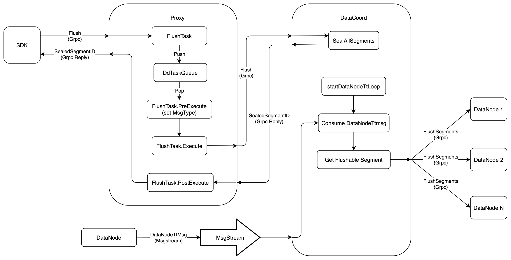

# Flush Collection 
`Flush` operation is used to make sure that inserted data will be written into persistent storage. This document will introduce how `Flush` operation works in `Milvus 2.0`. The following figure shows the execution flow of `Flush`.



1. Firstly, `SDK` starts a `Flush` request to `Proxy` via `Grpc`, the `proto` is defined as follows:
```proto
service MilvusService {
  ...
  rpc Flush(FlushRequest) returns (FlushResponse) {}
  ...
}

message FlushRequest {
  common.MsgBase base = 1;
  string db_name = 2;
  repeated string collection_names = 3;
}

message FlushResponse{
  common.Status status = 1;
  string db_name = 2;
  map<string, schema.LongArray> coll_segIDs = 3;
}
```


2. When `Proxy` receives `Flush` request, it would wrap this request into `FlushTask`, and push this task into `DdTaskQueue` queue. After that, `Proxy` would call method `WatiToFinish` to wait until the task finished.
```go
type task interface {
	TraceCtx() context.Context
	ID() UniqueID       // return ReqID
	SetID(uid UniqueID) // set ReqID
	Name() string
	Type() commonpb.MsgType
	BeginTs() Timestamp
	EndTs() Timestamp
	SetTs(ts Timestamp)
	OnEnqueue() error
	PreExecute(ctx context.Context) error
	Execute(ctx context.Context) error
	PostExecute(ctx context.Context) error
	WaitToFinish() error
	Notify(err error)
}

type FlushTask struct {
	Condition
	*milvuspb.FlushRequest
	ctx       context.Context
	dataCoord types.DataCoord
	result    *milvuspb.FlushResponse
}
```

3. There is a backgroud service in `Proxy`. This service gets `FlushTask` from `DdTaskQueue`, and executes in three phases:
    - `PreExecute`
    
      `FlushTask` does nothing at this phase, and returns directly
    
    - `Execute`

      `Proxy` sends `Flush` request to `DataCoord` via `Grpc`, and waits for the response, the `proto` is defined as follow:
    ```proto
    service DataCoord {
      ...
      rpc Flush(FlushRequest) returns (FlushResponse) {}
      ...
    }
    
    message FlushRequest {
      common.MsgBase base = 1;
      int64 dbID = 2;
      int64 collectionID = 4;
    }
    
    message FlushResponse {
      common.Status status = 1;
      int64 dbID = 2;
      int64 collectionID = 3;
      repeated int64 segmentIDs = 4;
    }
    ```
    - `PostExecute`
    
      `FlushTask` does nothing at this phase, and returns directly
    
4. After receiving `Flush` request from `Proxy`, `DataCoord` would call `SealAllSegments` to seal all the growing segments belonging to this `Collection`, and do not allocate new `ID`s for these segments any more. After that, `DataCoord` would send response to `Proxy`, which contain all the sealed segment `ID`s.

5. In `Milvus 2.0`,  `Flush` is an asynchronous operation. So when `SDK` receives the response of `Flush`, it only means that the `DataCoord` has sealed these segments. There are 2 problems that we have to solve.
    - The sealed segments might still in memory, and have not been written into persistent storage yet.
    - `DataCoord` would no longer allocate new `ID`s for these sealed segments, but how to make sure all the allocated `ID`s have been consumed by `DataNode`.


6. For the first problem, `SDK` should send `GetSegmentInfo` request to `DataCoord` periodically, until all sealed segments are in state of `Flushed`. The `proto` is defined as following.
```proto
service DataCoord {
  ...
  rpc GetSegmentInfo(GetSegmentInfoRequest) returns (GetSegmentInfoResponse) {}
  ...
}

message GetSegmentInfoRequest {
  common.MsgBase base = 1;
  repeated int64 segmentIDs = 2;
}

message GetSegmentInfoResponse {
  common.Status status = 1;
  repeated SegmentInfo infos = 2;
}

message SegmentInfo {
  int64 ID = 1;
  int64 collectionID = 2;
  int64 partitionID = 3;
  string insert_channel = 4;
  int64 num_of_rows = 5;
  common.SegmentState state = 6;
  internal.MsgPosition dml_position = 7;
  int64 max_row_num = 8;
  uint64 last_expire_time = 9;
  internal.MsgPosition start_position = 10;
}

enum SegmentState {
    SegmentStateNone = 0;
    NotExist = 1;
    Growing = 2;
    Sealed = 3;
    Flushed = 4;
    Flushing = 5;
}

```

7. For the second problem, `DataNode` would report a timestamp to `DataCoord` every time it consumes a package from `MsgStream`, the `proto` is define as follow.

 ```proto
message DataNodeTtMsg {
  common.MsgBase base = 1;
  string channel_name = 2;
  uint64 timestamp = 3;
}
 ```

8. There is a backgroud service, `startDataNodeTsLoop`, in `DataCoord` to process the message of `DataNodeTtMsg`.
    - Firstly, `DataCoord` would extract `channel_name` from `DataNodeTtMsg`, and filter out all sealed segments that attached on this `channel_name`
    - Compare the timestamp when the segment enters into state of `Sealed` with the `DataNodeTtMsg.timestamp`, if `DataNodeTtMsg.timestamp` is greater, which means that all `ID`s belonging to that segment have been consumed by `DataNode`, it's safe to notify `DataNode` to write that segment into persistent storage. The `proto` is defined as follow:
```proto
service DataNode {
  ...
  rpc FlushSegments(FlushSegmentsRequest) returns(common.Status) {}
  ...
}

message FlushSegmentsRequest {
  common.MsgBase base = 1;
  int64 dbID = 2;
  int64 collectionID = 3;
  repeated int64 segmentIDs = 4;
}
```

