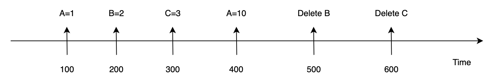
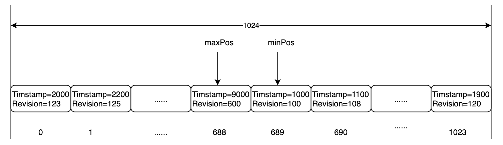

# metaSnapShot

`metaSnapShot` enables `RootCoord` to query historical meta based on timestamp, it provides `Key-Vaule` interface. Take an example to illustrate what `metaSnapShot` is. The following figure shows a series of operations happened on the timeline.



| Timestamp | Operation |
|-----------|-----------|
| 100       | Set A=1   |
| 200       | Set B=2   |
| 300       | Set C=3   |
| 400       | Set A=10  |
| 500       | Delete B  |
| 600       | Delete C  |

Now assuming the Wall-Clock is `Timestamp=700`, so `B` should have been deleted from the system. But I want to know the value of `B` at `Timesamp=450`, how to do it? `metaSnapShot` is invented to solve this problem.

We need to briefly introduce `etcd`'s `MVCC` before `metaSnapShot`. Here is the test program:

```go
package etcdkv

import (
	"context"
	"testing"
	"time"

	"github.com/stretchr/testify/assert"
	"go.etcd.io/etcd/clientv3"
)

func TestMVCC(t *testing.T) {
	addr := []string{"127.0.0.1:2379"}
	cli, err := clientv3.New(clientv3.Config{Endpoints: addr})
	assert.Nil(t, err)
	assert.NotNil(t, cli)
	ctx, cancel := context.WithTimeout(context.Background(), 10*time.Second)
	defer cancel()
	testKey := "test-key"

	rsp0, err := cli.Delete(ctx, testKey)
	assert.Nil(t, err)
	t.Logf("revision:%d", rsp0.Header.Revision)

	rsp1, err := cli.Put(ctx, testKey, "value1")
	assert.Nil(t, err)
	t.Logf("revision:%d,value1", rsp1.Header.Revision)

	rsp2, err := cli.Put(ctx, testKey, "value2")
	assert.Nil(t, err)
	t.Logf("revision:%d,value2", rsp2.Header.Revision)

	rsp3, err := cli.Get(ctx, testKey, clientv3.WithRev(rsp1.Header.Revision))
	assert.Nil(t, err)
	t.Logf("get at revision:%d, value=%s", rsp1.Header.Revision, string(rsp3.Kvs[0].Value))

}
```

The output of above test program should look like this:
```text
=== RUN   TestMVCC
    etcd_mvcc_test.go:23: revision:401
    etcd_mvcc_test.go:27: revision:402,value1
    etcd_mvcc_test.go:31: revision:403,value2
    etcd_mvcc_test.go:35: get at revision:402, value=value1
--- PASS: TestMVCC (0.01s)
```

In `etcd`, each write operation would add 1 to `Revision`. So if we specify the `Revision` value at query, we can get the historical value under that `Revision`.

`metaSnapShot` is based on this feature of `etcd`. We will write an extra `Timestamp` on each write operation. `etcd`'s `Txn` makes sure that the `Timestamp` would have the same `Revision` with user data.

When querying, `metaSnapShot` will find an appropriate `Revision` based on the input `Timestamp`, and then query on `etcd` with this `Revision`.

In order to speed up getting `Revision` by `Timestamp`, `metaSnapShot` would maintain an array mapping the `Timestamp` to `Revision`. The default length of this array is `1024`, which is a type of circular array.



- `maxPos` points to the position where `Timestamp` and `Revision` are maximum.
- `minPos` points to the position where `Timestamp` and `Revision` are minimum.
- For each update operation, we first add `1` to `maxPos`. So the new `maxPos` would cover the old `minPos` position, and then add `1` to the old `minPos`
- From `0` to `maxPos` and from `minPos` to `1023`, which are two incremental arrays. We can use binary search to quickly get the `Revision` by the input `Timestamp`
- If the input `Timestamp` is greater than the `Timestamp` where the `maxPos` is located, then the `Revision` at the position of the `maxPos` will be returned
- If the input `Timestamp` is less than the `Timestamp` where `minPos` is located, `metaSnapshot` will load the historical `Timestamp` and `Revision` from `etcd` to find an appropriate `Revision` value.

The interface of `metaSnapShot` is defined as follows:
```go
type SnapShotKV interface {
	Load(key string, ts typeutil.Timestamp) (string, error)
    LoadWithPrefix(key string, ts typeutil.Timestamp) ([]string, []string, error)

	Save(key, value string) (typeutil.Timestamp, error)
	MultiSave(kvs map[string]string, additions ...func(ts typeutil.Timestamp) (string, string, error)) (typeutil.Timestamp, error)
	MultiSaveAndRemoveWithPrefix(saves map[string]string, removals []string, additions ...func(ts typeutil.Timestamp) (string, string, error)) (typeutil.Timestamp, error)
}
```

For the `Read` operations (`Load` and `LoadWithPrefix`), the input parameter `typeutil.Timestamp` is used to tell `metaSnapShot` to load the value based on that `Timestamp`.

For the `Write` operations (`Save`, `MiltiSave`, `MultiSaveAndRemoveWithPrefix`), return values include `typeutil.Timestamp`, which is used to tell the caller when these write operations happened.

You might be curious about the parameter `additions` of `MultiSave` and `MultiSaveAndRemoveWithPrefix`: What does `additions` do, and why?

`additions` is an array of  `func(ts typeutil.Timestamp) (string, string, error)`. So it's a function, receiving `typeutil.Timestamp` as an input, and returns two `sting` which is `key-value` pair. If `error` is `nil` in the return value, `metaSnapShot` would write this `key-value` pair into `etcd`.

Refer to the document of `CreateCollection`, a timestamp is created for `Collection`, which is the timestamp when the `Collection`'s meta have been written into `etcd`, not the timestamp when `RootCoord` receives the request. So before writing the `Collection`'s meta into `etcd`, `metaSnapshot` would allocate a timestamp, and call all the `additions`. This would make sure the timestamp created for the `Collection` is correct.


