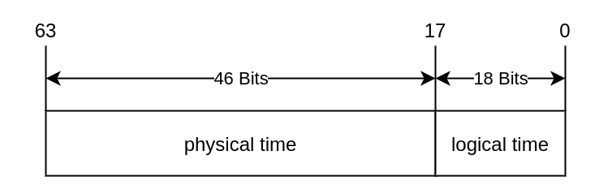
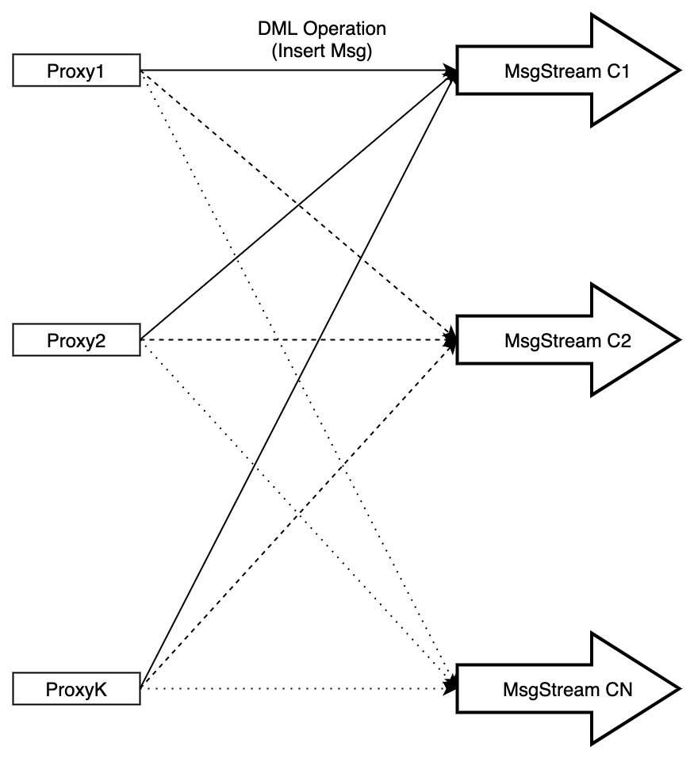
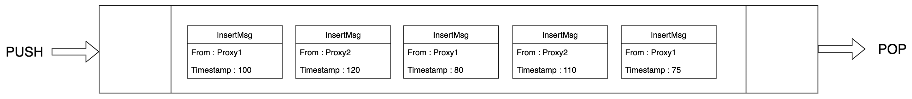
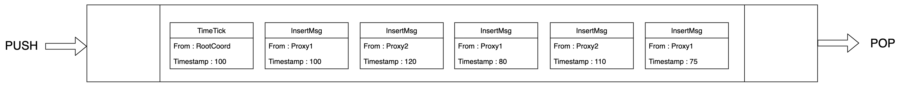

# Timesync -- All The things you should know

`Time Synchronization` is the kernel part of Milvus 2.0; it affects all components of the system. This document describes the detailed design of `Time Synchronization`.

There are 2 kinds of events in Milvus 2.0:
- DDL events
  - create collection
  - drop collection
  - create partition
  - drop partition
- DML events
  - insert
  - search
  - etc

All events have a `Timestamp` to indicate when this event occurs.

Suppose there are two users, `u1` and `u2`. They connect to Milvus and do the following operations at the respective timestamps.

| ts        | u1                   | u2           |
|-----------|----------------------|--------------|
| t0        | create Collection C0 | -            |
| t2        | -                    | search on C0 |
| t5        | insert A1 into C0    | -            |
| t7        | -                    | search on C0 |
| t10       | insert A2            | -            |
| t12       | -                    | search on C0 |
| t15       | delete A1 from C0    | -            |
| t17       | -                    | search on C0 |

Ideally, `u2` expects `C0` to be empty at `t2`, and could only see `A1` at `t7`; while `u2` could see both `A1` and `A2` at `t12`, but only see `A2` at `t17`.

It's easy to achieve this in a `single-node` database. But for a `Distributed System`, such like `Milvus`, it's a little difficult; the following problems need to be solved.

1. If `u1` and `u2` are on different nodes, and their time clock is not synchronized. To give an extreme example, suppose that the time of `u2` is 24 hours later than `u1`, then all the operations of `u1` can't been seen by `u2` until next day.
2. Network latency. If `u2` starts the `Search on C0` at `t17`, then how can it be guaranteed that all the `events` before `t17` have been processed? If the events of `delete A1 from C0` has been delayed due to the network latency, then it would lead to incorrect state: `u2` would see both `A1` and `A2` at `t17`.

`Time synchronization system` is used to solve the above problems.

## Timestamp Oracle(TSO)

Like [TiKV](https://github.com/tikv/tikv), Milvus 2.0 provides `TSO` service. All the events must alloc timestamp from `TSO`，not use local timestamp, so the first problem can be solved.

`TSO` is provided by the `RootCoord` component. Clients could alloc one or more timestamp in a single request; the `proto` is defined as following.

```proto
service RootCoord {
    ...
    rpc AllocTimestamp(AllocTimestampRequest) returns (AllocTimestampResponse) {}
    ...  
}

message AllocTimestampRequest {
  common.MsgBase base = 1;
  uint32 count = 3;
}

message AllocTimestampResponse {
    common.Status status = 1;
    uint64 timestamp = 2;
    uint32 count = 3;
}
```
`Timestamp` is of type `uint64`, containing physical and logical parts.

This is the format of `Timestamp`



In an `AllocTimestamp` request, if `AllocTimestampRequest.count` is greater than `1`, `AllocTimestampResponse.timestamp` indicates the first available timestamp in the response.

## Time Synchronization
To understand the `Time Synchronization` better, let's introduce the data operation of Milvus 2.0 briefly.
Taking `Insert Operation` as an example.
- User can configure lots of `Proxy` to achieve load balancing, in `Milvus 2.0`
- User can use `SDK` to connect to any `Proxy`
- When `Proxy` receives `Insert` Request from `SDK`, it splits `InsertMsg` into different `MsgStream` according to the hash value of `Primary Key`
- Each `InsertMsg` would be assigned with a `Timestamp` before sending to the `MsgStream`

>*Note: `MsgStream` is the wrapper of message queue, the default message queue in `Milvus 2.0` is `pulsar`*



Based on the above information, we know that the `MsgStream` has the following characteristics:
- In `MsgStream`, `InsertMsg` from the same `Proxy` must be incremented in timestamp
- In `MsgStream`, `InsertMsg` from different `Proxy` have no relationship in timestamp

The following figure shows an example of `InsertMsg` in `MsgStream`. The snippet contains 5 `InsertMsg`, 3 of them from `Proxy1` and others from `Proxy2`.

The 3 `InsertMsg` from `Proxy1` are incremented in timestamp, and the 2 `InsertMsg` from `Proxy2` are also incremented in timestamps, but there is no relationship between `Proxy1` and `Proxy2`.



So the second problem has turned into this: after reading a message from `MsgStream`, how to make sure that all the messages with smaller timestamp have been consumed?

For example, when reading a message with timestamp `110` produced by `Proxy2`, but the message with timestamp `80` produced by `Proxy1`, is still in the `MsgStream`. How can this situation be handled?

The following graph shows the core logic of `Time Synchronization System` in `Milvus 2.0`; it should solve the second problem.
- Each `Proxy` will periodically reports its latest timestamp of every `MsgStream` to `RootCoord`; the default interval is `200ms`
- For each `Msgstream`, `Rootcoord` finds the minimum timestamp of all `Proxy` on this `Msgstream`, and inserts this minimum timestamp into the `Msgstream`
- When the consumer reads the timestamp inserted by the `RootCoord` on the `MsgStream`, it indicates that all messages with smaller timestamp have been consumed, so all actions that depend on this timestamp can be executed safely
- The message inserted by `RootCoord` into `MsgStream` is of type `TimeTick`


This is the `Proto` that used by `Proxy` to report timestamp to `RootCoord`:

```proto
service RootCoord {
    ...
    rpc UpdateChannelTimeTick(internal.ChannelTimeTickMsg) returns (common.Status) {}
    ...  
}

message ChannelTimeTickMsg {
  common.MsgBase base = 1;
  repeated string channelNames = 2;
  repeated uint64 timestamps = 3;
  uint64 default_timestamp = 4;
}
```

After inserting `Timetick`, the `Msgstream` should look like this:


`MsgStream` will process the messages in batches according to `TimeTick`, and ensure that the output messages meet the requirements of timestamp. For more details, please refer to the `MsgStream` design detail.
