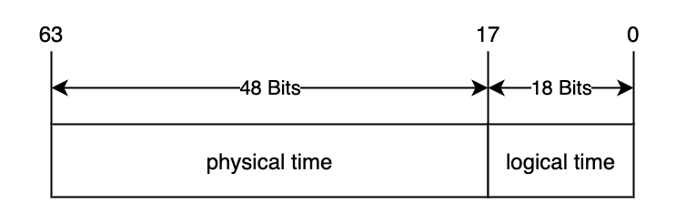

# Timesync -- All The things you should know

`Time Synchronization` is the core part of `Milvus 2.0`, it affects all components of the system. This article describes the desgin detail of `Time Synchronization`.

In the `Milvus 2.0`, all events (such as `Create Collection`, `Insert`, `Search`, `Drop Collection`, etc.) have a `Timestamp` to indicate when does this event occurred.

Suppose there are two users, `u1` and `u2`, have connected to the `Milvus`, and do the following actions at their respective timestamp.
| timestamp | u1                   | u2           |
|-----------|----------------------|--------------|
| t0        | create Collection C0 | -            |
| t2        | -                    | search on C0 |
| t5        | insert A1 into C0    | -            |
| t7        | -                    | search on C0 |
| t10       | insert A2            | -            |
| t12       | -                    | search on C0 |
| t15       | delete A1 from C0    | -            |
| t17       | -                    | search on C0 | 

Ideally, `u2` expects `C0` is empty when it searches at `t2`, and could only sees `A1` at `t7`; at `t12` , the search from `u2` could sees both `A1` and `A2`, but only sees `A2` at `t17`. It's much easier to achieve these targets in `single-node` database. But for `Distributed System` , such like `Milvus`,  it's a little difficult, and the following problems needs to be solved.

1. If `u1` and `u2` are on different nodes, and their time is not synchronized. To give an extreme example, suppose that the time of `u2` is 24 hours later than `u1`, then all the operations of `u1` can't been seen by `u2` until next day.
2. Network latency. If `u2` starts the `Search on C0` at `t17`, then how to ensure that all the `events` before `t17` have been processed. If the envents of `delete A1 from C0` has been delayed dure to the network latency, then it would lead to incorrect state: `u2` would see both `A1` and `A2` at `t17`.

`Time synchronization system` is used to solve the above problems.

## Timestamp Oracle(TSO)

Like [TiKV](https://github.com/tikv/tikv), `Milvus 2.0` provides `TSO` service, all the events must alloc timestamp from `TSO`，not use local timestamp any more, so the first problem should be solved.

`TSO` is provided by `RootCoord` component, clients could alloc one or more timestamp at single request, the `proto` is defined as follows.

```proto
service RootCoord {
    ...
    
    rpc AllocTimestamp(AllocTimestampRequest) returns (AllocTimestampResponse) {}
    
    ...  
}

message AllocTimestampRequest {
  common.MsgBase base = 1;
  uint32 count = 3;
}

message AllocTimestampResponse {
    common.Status status = 1;
    uint64 timestamp = 2;
    uint32 count = 3;
}

```
`Timestamp` is type of `uint64`, contains physical and logical parts. 

This is the format of `Timestamp`



In the `AllocTimestamp` request, if `AllocTimestampRequest.count` if greater than `1`, then in the response, `AllocTimestampResponse.timestamp` indicates the first available timestamp.

## Time Synchronization
In order to understand the `Time Synchronization` better, firstly we need to introduce the data operation of `Milvus 2.0` briefly, taking `Insert Operation` as example.
- Users can configure lots of `Proxy` to achieve load balancing, in `Milvus 2.0`
- `SDK` could connect to any `Proxy`
- When `Proxy` receieves `Insert` Request from `SDK`, it would hash the `InsrtMsg` by `Primary key`, and then split the `InsertMsg` into different `MsgStream` according to the hash value.
- Each `InsertMsg` would be assigned an `Timestamp` before send to the `MsgStream.`

*Note: `MsgStream` is the wrapper of message queue, the default message queue in `Milvus 2.0` is `pulsar`*


Based on the above information, we can know that the `MsgStream` have the following characteristics:
- In `MsgStream`, `InsertMsg` from the same `Proxy` must be incremented in timestamp
- In `MsgStream`, `InsertMsg` from different `Proxy` have no relationship in timestamp

The following figure shows an example of `InsertMsg` in `MsgStream`, the snippet contains 5 `InsertMsg`, 3 of them from `Proxy1` and others from `Proxy2`.

The 3 `InsertMsg` from `Proxy1` are incremented in timestamp, and the 2 `InsertMsg` from `Proxy2` are also incremented in timestamps, but there is no relationship between `Proxy1` and `Proxy2`.


So the second problem has turned into this: after reading a message from `MsgStream`, how to make sure that all the messages earlier than this timestamp have been consumed. For example, when I read a message , whoes timestamp is `110` and produced by `Proxy2`, from `MsgStream`, but the message ,whoes timestamp is `80` and produced by `Proxy1`, is still in the `MsgStream`, what shoudl I do on this status?

The following graph shows the core logic of `Time Synchronization System` in `Milvus 2.0`, it should solve the second problem.
- Each `Proxy` will periodically reports the latest timestamp of every `MsgStream` to `RootCoord`, the default interval is `200ms`
- For each `Msgstream`, `Rootcoord` finds the minimum timestamp of all `Proxies` on this `Msgstream`, and inserts this minimum timestamp into the `Msgstream`
- When the consumer reads the timestamp inserted by the `RootCoord` on the `MsgStream`, it indicates that the messages eariler than this timestamp have been consumed, so all actions that depend on this timestamp can be executed safely
- The message inserted by `RootCoord` into `MsgStream` is type of `TimeTick`


This is the `Proto` that usecd by `Proxy` to report timestamp to `RootCoord`:

```proto
service RootCoord {
    ...

    rpc UpdateChannelTimeTick(internal.ChannelTimeTickMsg) returns (common.Status) {}

    ...  
}

message ChannelTimeTickMsg {
  common.MsgBase base = 1;
  repeated string channelNames = 2;
  repeated uint64 timestamps = 3;
  uint64 default_timestamp = 4;
}
```

After inserting `Timetick`, the `Msgstream` should looks like this:


`MsgStream` will process the messages in batches according to `TimeTick` , and ensures that the output messages meet the requirements of timestamp. For more details, please refer to the `MsgStream` design detail.
