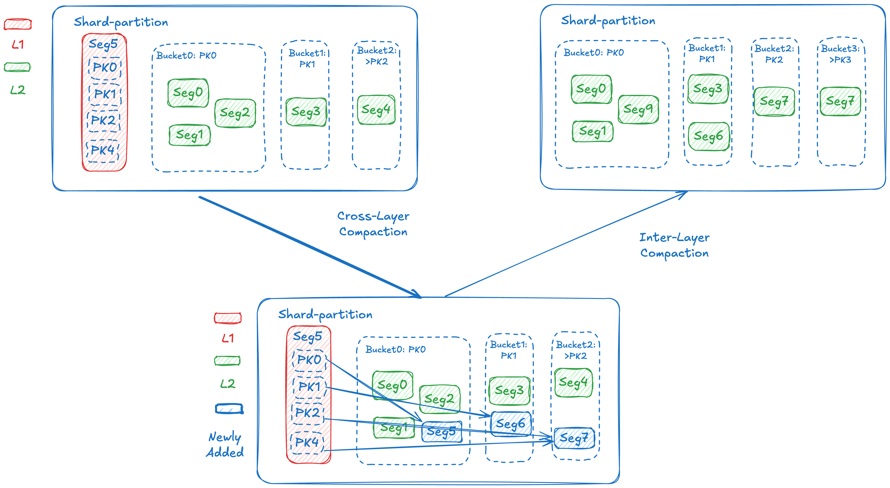

# Primary Key Index Design Document

## 1. Introduction

This document outlines the design of Milvus' primary key indexing system, which enables fast lookups of string or integer primary keys across multiple segments. The index will be loaded in the Delegator and persisted in S3 storage.

## 2. Objectives and Benefits

1. **Deduplication**: Identify duplicate data during write operations, automatically converting them to Insert + Delete operations
2. **Accelerate Partial Updates**: Improve performance of partial upsert and point query operations
3. **Optimize Delete Forwarding**: Reduce Bloom Filter check overhead in the Delegator during Delete operations

## 3. Design Overview

### 3.1 Core Components

1. **BBhash**: A space-efficient hash structure that maps keys to a continuous range of integers without collisions. The master branch works with Plain Old Data types (POD), while the "alltypes" branch supports other types including strings.
2. **Value Array**: A memory-mapped array storing segment position information for each primary key.

### 3.2 Architecture Details

1. **BBhash**:  
   BBhash is a minimal perfect hash library for static key collections, capable of mapping each key to a unique, compact integer index. For example:

   - "user123" → 0  
   - "user456" → 1  
   - "user789" → 2

   For string primary keys, BBhash processes the raw byte sequence directly without type conversion and supports variable-length strings. Key features include:
   - No need to store original strings
   - Full content hashing reduces collision probability
   - Extremely low memory usage

2. **Value Array**:  
   This array stores segment metadata for each primary key. It can be accessed directly using the BBhash mapping result, providing **O(1)** query efficiency:

3. **example code**
   ```cpp
   // Example code for building and using the primary key index
   
   // Building the index
   void buildPrimaryKeyIndex(const std::vector<std::string>& keys, const std::vector<SegmentInfo>& segmentInfos) {
       // Initialize BBhash with the keys
       bbhash::PerfectHasher<std::string> hasher(keys);
       
       // Initialize value array with appropriate size
       std::vector<SegmentInfo> valueArray(keys.size());
       
       // Populate value array with segment information
       for (size_t i = 0; i < keys.size(); i++) {
           size_t index = hasher.lookup(keys[i]);
           valueArray[index] = segmentInfos[i];
       }
       
       // Persist the index to storage
       hasher.save("bbhash.idx");
       saveValueArray(valueArray, "value_array.bin");
   }
   
   // Reading from the index
   SegmentInfo lookupPrimaryKey(const std::string& key) {
       // Load BBhash from storage (or use cached instance)
       bbhash::PerfectHasher<std::string> hasher;
       hasher.load("bbhash.idx");
       
       // Load value array (or use memory-mapped instance)
       std::vector<SegmentInfo> valueArray = loadValueArray("value_array.bin");
       
       // Lookup the key
       size_t index = hasher.lookup(key);
       if (index != bbhash::NOT_FOUND) {
           return valueArray[index];
       }
       
       return SegmentInfo(); // Return empty segment info if not found
   }
   ```

## 4. Index Structure Illustration

### 4.1 BBhash Workflow

BBhash (Bin Bloom Hash) maps keys to unique indices through multi-level hash functions:

1. The first level hash attempts to map all keys to non-conflicting positions
2. For keys with conflicts, a next-level hash function is used for remapping
3. This process iterates until all keys are mapped without conflicts

### 4.2 Value Array Storage Structure

Each entry in the value array contains:
- Segment ID (pointing to the segment containing the primary key)



For L1 Segments, we don't need primary key indexing and can use Bloom Filters for approximate filtering with false positives. For L2 Segments, we build PK → Segment mappings for data under each bucket. Note that false positives still exist here due to: 1. Data that has been deleted, and 2. BBhash's small probability of false positives (approximately 1/2³² ≈ 2.3×10⁻¹⁰).

3. **Memory Efficiency**:  
   - BBhash: 2–4 bits/key (1B keys ≈ 250–500MB)
   - Value Array: ~4 bytes/key (Segment ID)
   - Total: ~4.5 bytes/key → 1B keys ≈ 4.5GB
   - mmap implementation allows the operating system to load and reclaim memory as needed, supporting billion-scale datasets

### 3.3 Performance Analysis

#### 3.3.1 Index Building Performance

- **Single-thread Performance**: BBhash constructs a minimal perfect hash function (MPHF) for 100 million keys in about 10 seconds on a single thread, processing approximately 10 million keys/second
- **Multi-thread Scalability**: Using 8 threads, building an MPHF for 1 billion keys takes about 35 seconds, averaging approximately 28.57 million keys/second
- **Billion-scale Construction Feasibility**:
  - On a 32-core server, theoretical time to build a 1 billion key index is about 10-15 seconds
  - In actual testing, end-to-end time including data reading and index construction reaches 1 minute
  - Peak memory usage does not exceed 16GB

#### 3.3.2 Query Performance Comparison

- **Single Primary Key Index vs. Multiple Bloom Filters**:
  - **Query Latency**:
    - Primary Key Index: ~200 nanoseconds per query
    - 10,000 Bloom Filters: Sequential querying required, average latency ~10,000 × 10 nanoseconds = 0.1 milliseconds
    - **Performance Gap**: Primary key index query speed is approximately 500 times faster than the Bloom filter approach
  
  - **Throughput**:
    - Primary Key Index: ~10-20 million queries per second per node
    - Bloom Filter Approach: ~1,000 queries per second per node
    - **Advantage**: Primary key index supports higher query loads in high-concurrency scenarios

#### 3.3.3 Precision Comparison

- **BBhash Precision**:
  - Actual implementation may have an extremely small probability of hash collisions, but far lower than Bloom filters

- **Bloom Filter Precision**:
  - Single Bloom filter false positive rate is typically set to 0.1%
  - Cumulative false positive rate when querying 10,000 Bloom filters approaches 100%

## 4. Additional Considerations

1. Performance validation, including index construction and querying, comparing BBhash and other libraries such as CMPH 
2. Whether BBHash can also replace Bloom filters for individual Segments
3. How to handle false positives - ignore? verify in each segment
4. Value index redundancy fields for point query optimization, such as recording additional offset information or even fields