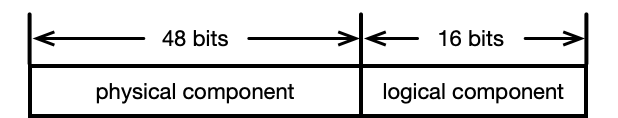

## Appendix A. Basic Components

#### A.1 System Component

Milvus has 9 different components and can be abstracted into basic Components.

```go
type Component interface {
	Init() error
	Start() error
	Stop() error
	GetComponentStates(ctx context.Context) (*milvuspb.ComponentStates, error)
	GetStatisticsChannel(ctx context.Context) (*milvuspb.StringResponse, error)
	Register() error
}
```

- _GetComponentStates_

```go

type StateCode = int

const (
	INITIALIZING StateCode = 0
	HEALTHY      StateCode = 1
	ABNORMAL     StateCode = 2
)

type ComponentInfo struct {
	NodeID    UniqueID
	Role      string
	StateCode StateCode
	ExtraInfo []*commonpb.KeyValuePair
}

type ComponentStates struct {
	State                *ComponentInfo
	SubcomponentStates   []*ComponentInfo
	Status               *commonpb.Status
}

```

If a component needs to process timetick message to align timetick, it needs to implement the TimeTickProvider interface.

```go
type TimeTickProvider interface {
	GetTimeTickChannel(ctx context.Context) (*milvuspb.StringResponse, error)
}
```

#### A.2 Session

###### ServerID

The ID is stored in a key-value pair on etcd. The key is metaRootPath + "/session/id". The initial value is 0. When a service is registered, it is incremented by 1 and returned to the next registered service.

###### Registration

- Registration is achieved through etcd's lease mechanism.

- The service creates a lease with etcd and stores a key-value pair in etcd. If the lease expires or the service goes offline, etcd will delete the key-value pair. You can judge whether this service is available through the key.

- key: metaRoot + "/session" + "/ServerName(-ServerID)(optional)"

- value: json format

  ```json
  {
    "ServerID": "ServerID",
    "ServerName": "ServerName",
    "Address": "ip:port",
    "Exclusive": "Exclusive"
  }
  ```

- By obtaining the address, you can establish a connection with other services

- If a service is exclusive, the key will not have **ServerID**. But **ServerID** still will be stored in value.

###### Discovery

- All currently available services can be obtained by obtaining all the key-value pairs deposited during registration. If you want to get all the available nodes for a certain type of service, you can pass in the prefix of the corresponding key

- Registration time can be compared with ServerID for ServerID will increase according to time.

###### Interface

````go
const (
	DefaultServiceRoot = "session/"
	DefaultIDKey       = "id"
	DefaultRetryTimes  = 30
	DefaultTTL         = 60
)

// Session is a struct to store service's session, including ServerID, ServerName,
// Address.
// Exclusive indicates that this server can only start one.
type Session struct {
	ctx        context.Context
	ServerID   int64  `json:"ServerID,omitempty"`
	ServerName string `json:"ServerName,omitempty"`
	Address    string `json:"Address,omitempty"`
	Exclusive  bool   `json:"Exclusive,omitempty"`
}

// NewSession is a helper to build Session object.
// ServerID, ServerName, Address, Exclusive will be assigned after registeration.
// metaRoot is a path in etcd to save session information.
// etcdEndpoints is to init etcdCli when NewSession
func NewSession(ctx context.Context, metaRoot string, etcdEndpoints []string) *Session {}

// Init will initialize base struct of the Session, including ServerName, ServerID,
// Address, Exclusive. ServerID is obtained in getServerID.
// Finally it will process keepAliveResponse to keep alive with etcd.
func (s *Session) Init(serverName, address string, exclusive bool) <-chan bool {}

// GetSessions will get all sessions registered in etcd.
// Revision is returned for WatchServices to prevent key events from being missed.
func (s *Session) GetSessions(prefix string) (map[string]*Session, int64, error) {}

// WatchServices watch the service's up and down in etcd, and send event to
// eventChannel.
// prefix is a parameter to know which service to watch and can be obtained in
// typeutil.type.go.
// revision is an etcd reversion to prevent missing key events and can be obtained
// in GetSessions.
// If a server up, an event will be added to channel with eventType SessionAddType.
// If a server down, an event will be added to channel with eventType SessionDelType.
func (s *Session) WatchServices(prefix string, revision int64) (eventChannel <-chan *SessionEvent) {}


#### A.3 Global Parameter Table

``` go
type BaseTable struct {
	params *memkv.MemoryKV
}

func (gp *BaseTable) Init()
func (gp *BaseTable) LoadFromKVPair(kvPairs []*commonpb.KeyValuePair) error
func (gp *BaseTable) Load(key string) (string, error)
func (gp *BaseTable) LoadRange(key, endKey string, limit int) ([]string, []string, error)
func (gp *BaseTable) LoadYaml(fileName string) error
func (gp *BaseTable) LoadYaml(fileName string) error
func (gp *BaseTable) LoadYaml(fileName string) error
func (gp *BaseTable) ParseFloat(key string) float64
func (gp *BaseTable) ParseInt64(key string) int64
func (gp *BaseTable) ParseInt32(key string) int32
func (gp *BaseTable) ParseInt(key string) int
func (gp *BaseTable) WriteNodeIDList() []UniqueID
func (gp *BaseTable) DataNodeIDList() []UniqueID
func (gp *BaseTable) ProxyIDList() []UniqueID
func (gp *BaseTable) QueryNodeIDList() []UniqueID
````

- _LoadYaml(filePath string)_ turns a YAML file into multiple key-value pairs. For example, given the following YAML

```yaml
etcd:
  address: localhost
  port: 2379
  rootpath: milvus/etcd
```

_BaseTable.LoadYaml_ will insert three key-value pairs into _params_

```go
	"etcd.address" -> "localhost"
	"etcd.port" -> "2379"
	"etcd.rootpath" -> "milvus/etcd"
```

#### A.4 Time Ticked Flow Graph

//TODO remove?

###### A.4.1 Flow Graph States

```go
type flowGraphStates struct {
	startTick         Timestamp
	numActiveTasks    map[string]int32
	numCompletedTasks map[string]int64
}
```

###### A.4.2 Message

```go
type Msg interface {
	TimeTick() Timestamp
}
```

###### A.4.3 Node

```go
type Node interface {
	Name() string
	MaxQueueLength() int32
	MaxParallelism() int32
	Operate(ctx context.Context, in []Msg) ([]Msg, context.Context)
	IsInputNode() bool
	Close()
}
```

```go
type BaseNode struct {
	maxQueueLength int32
	maxParallelism int32
}
```

###### A.4.4 Flow Graph

```go
type nodeCtx struct {
	node                   Node
	inputChannels          []chan Msg
	inputMessages          []Msg
	downstream             []*nodeCtx
	downstreamInputChanIdx map[string]int

	NumActiveTasks    int64
	NumCompletedTasks int64
}

func (nodeCtx *nodeCtx) Start(ctx context.Context) error
```

_Start()_ will enter a loop. In each iteration, it tries to collect input messages from _inputChan_, then prepares the node's input. When the input is ready, it will trigger _node.Operate_. When _node.Operate_ returns, it sends the returned _Msg_ to _outputChans_, which connects to the downstreams' _inputChans_.

```go
type TimeTickedFlowGraph struct {
	ctx     context.Context
	nodeCtx map[NodeName]*nodeCtx
}

func (*pipeline TimeTickedFlowGraph) AddNode(node Node)
func (*pipeline TimeTickedFlowGraph) SetEdges(nodeName string, in []string, out []string)
func (*pipeline TimeTickedFlowGraph) Start() error
func (*pipeline TimeTickedFlowGraph) Close() error

func NewTimeTickedFlowGraph(ctx context.Context) *TimeTickedFlowGraph
```

#### A.5 Allocator

```go
type Allocator struct {
	Ctx        context.Context
	CancelFunc context.CancelFunc

	wg sync.WaitGroup

	Reqs      chan Request
	ToDoReqs  []Request
	CanDoReqs []Request
	SyncReqs  []Request

	TChan         TickerChan
	ForceSyncChan chan Request

	SyncFunc    func() bool
	ProcessFunc func(req Request) error

	CheckSyncFunc func(timeout bool) bool
	PickCanDoFunc func()
	SyncErr       error
	Role          string
}
func (ta *Allocator) Start() error
func (ta *Allocator) Init() error
func (ta *Allocator) Close() error
func (ta *Allocator) CleanCache() error

```

#### A.6 ID Allocator

```go
type IDAllocator struct {
	Allocator

	rootCoordAddress string
	rootCoord types.RootCoord

	countPerRPC uint32

	idStart UniqueID
	idEnd   UniqueID

	PeerID UniqueID
}

func (ia *IDAllocator) Start() error
func (ia *IDAllocator) AllocOne() (UniqueID, error)
func (ia *IDAllocator) Alloc(count uint32) (UniqueID, UniqueID, error)

func NewIDAllocator(ctx context.Context, masterAddr string) (*IDAllocator, error)
```

#### A.6 Timestamp Allocator

###### A.6.1 Timestamp

Let's take a brief review of the Hybrid Logical Clock (HLC). HLC uses 64bits timestamps which are composed of a 46-bits physical component (thought of as and always close to local wall time) and an 18-bits logical component (used to distinguish between events with the same physical component).



HLC's logical part is advanced on each request. The physical part can be increased in two cases:

A. when the local wall time is greater than HLC's physical part,

B. or the logical part overflows.

In either case, the physical part will be updated, and the logical part will be set to 0.

Keeping the physical part close to local wall time may face non-monotonic problems such as updates to POSIX time that could turn time backward. HLC avoids such problems, since if 'local wall time < HLC's physical part' holds, only case B is satisfied, thus monotonicity is guaranteed.

Milvus does not support the transaction, but it should guarantee the deterministic execution of the multi-way WAL. The timestamp attached to each request should

- have its physical part close to wall time (has an acceptable bounded error, a.k.a. uncertainty interval in transaction scenarios),
- and be globally unique.

HLC leverages physical clocks at nodes that are synchronized using the NTP. NTP usually maintains time to within tens of milliseconds over local networks in the datacenter. Asymmetric routes and network congestion occasionally cause errors of hundreds of milliseconds. Both the normal time error and the spike are acceptable for Milvus use cases.

The interface of Timestamp is as follows.

```
type timestamp struct {
	physical uint64 // 18-63 bits
	logical uint64  // 0-17 bits
}

type Timestamp uint64
```

###### A.6.2 Timestamp Oracle

```go
type timestampOracle struct {
	key   string
	txnkv kv.TxnKV

	saveInterval  time.Duration
	maxResetTSGap func() time.Duration

	TSO           unsafe.Pointer
	lastSavedTime atomic.Value
}

func (t *timestampOracle) InitTimestamp() error
func (t *timestampOracle) ResetUserTimestamp(tso uint64) error
func (t *timestampOracle) UpdateTimestamp() error
func (t *timestampOracle) ResetTimestamp()
```

###### A.6.3 Timestamp Allocator

```go
type TimestampAllocator struct {
	Allocator

	rootCoordAddress string
	rootCoordClient  types.RootCoord

	countPerRPC uint32
	lastTsBegin Timestamp
	lastTsEnd   Timestamp
	PeerID      UniqueID
}

func (ta *TimestampAllocator) Start() error
func (ta *TimestampAllocator) AllocOne() (UniqueID, error)
func (ta *TimestampAllocator) Alloc(count uint32) (UniqueID, UniqueID, error)
func (ta *TimestampAllocator) ClearCache()

func NewTimestampAllocator(ctx context.Context, masterAddr string) (*TimestampAllocator, error)
```

- Batch Allocation of Timestamps

- Expiration of Timestamps

#### A.7 KV

###### A.7.1 KV Base

```go
type BaseKV interface {
	Load(key string) (string, error)
	MultiLoad(keys []string) ([]string, error)
	LoadWithPrefix(key string) ([]string, []string, error)
	Save(key, value string) error
	MultiSave(kvs map[string]string) error
	Remove(key string) error
	MultiRemove(keys []string) error
	RemoveWithPrefix(key string) error

	Close()
}
```

###### A.7.2 Txn Base

```go
type TxnKV interface {
	BaseKV

	MultiSaveAndRemove(saves map[string]string, removals []string) error
	MultiRemoveWithPrefix(keys []string) error
	MultiSaveAndRemoveWithPrefix(saves map[string]string, removals []string) error
}
```

###### A.7.3 MetaKv

```go
// MetaKv is TxnKV for meta data. It should save data with lease.
type MetaKv interface {
	TxnKV
	GetPath(key string) string
	LoadWithPrefix(key string) ([]string, []string, error)
	CompareVersionAndSwap(key string, version int64, target string) error
    WalkWithPrefix(prefix string, paginationSize int, fn func([]byte, []byte) error) error
}

```

###### A.7.4 WatchKV

```go
// WatchKV is watchable MetaKv.
//
//go:generate mockery --name=WatchKv --with-expecter
type WatchKV interface {
	MetaKv
	Watch(key string) clientv3.WatchChan
	WatchWithPrefix(key string) clientv3.WatchChan
	WatchWithRevision(key string, revision int64) clientv3.WatchChan
}

```

###### A.7.5 SnapShotKv

```go
// SnapShotKV is TxnKV for snapshot data. It must save timestamp.
type SnapShotKV interface {
	Save(key string, value string, ts typeutil.Timestamp) error
	Load(key string, ts typeutil.Timestamp) (string, error)
	MultiSave(kvs map[string]string, ts typeutil.Timestamp, additions ...func(ts typeutil.Timestamp) (string, string, error)) error
	LoadWithPrefix(key string, ts typeutil.Timestamp) ([]string, []string, error)
	MultiSaveAndRemoveWithPrefix(saves map[string]string, removals []string, ts typeutil.Timestamp, additions ...func(ts typeutil.Timestamp) (string, string, error)) error
```

###### A.7.6 Etcd KV

```go
type etcdKV struct {
	client   *clientv3.Client
	rootPath string
}

func (kv *etcdKV) Close()
func (kv *etcdKV) GetPath(key string) string
func (kv *etcdKV) LoadWithPrefix(key string) ([]string, []string, error)
func (kv *etcdKV) Load(key string) (string, error)
func (kv *etcdKV) GetCount(key string) (int64, error)
func (kv *etcdKV) MultiLoad(keys []string) ([]string, error)
func (kv *etcdKV) Save(key, value string) error
func (kv *etcdKV) MultiSave(kvs map[string]string) error
func (kv *etcdKV) RemoveWithPrefix(prefix string) error
func (kv *etcdKV) Remove(key string) error
func (kv *etcdKV) MultiRemove(keys []string) error
func (kv *etcdKV) MultiSaveAndRemove(saves map[string]string, removals []string) error
func (kv *etcdKV) Watch(key string) clientv3.WatchChan
func (kv *etcdKV) WatchWithPrefix(key string) clientv3.WatchChan
func (kv *etcdKV) WatchWithRevision(key string, revision int64) clientv3.WatchChan

func NewEtcdKV(etcdAddr string, rootPath string) *etcdKV
```

etcdKV implements all _TxnKV_ interfaces.

###### A.7.7 Memory KV

```go
type MemoryKV struct {
	sync.RWMutex
	tree *btree.BTree
}

func (s memoryKVItem) Less(than btree.Item) bool
func (kv *MemoryKV) Load(key string) (string, error)
func (kv *MemoryKV) LoadRange(key, endKey string, limit int) ([]string, []string, error)
func (kv *MemoryKV) Save(key, value string) error
func (kv *MemoryKV) Remove(key string) error
func (kv *MemoryKV) MultiLoad(keys []string) ([]string, error)
func (kv *MemoryKV) MultiSave(kvs map[string]string) error
func (kv *MemoryKV) MultiRemove(keys []string) error
func (kv *MemoryKV) MultiSaveAndRemove(saves map[string]string, removals []string) error
func (kv *MemoryKV) LoadWithPrefix(key string) ([]string, []string, error)
func (kv *MemoryKV) Close()
func (kv *MemoryKV) MultiRemoveWithPrefix(keys []string) error
func (kv *MemoryKV) MultiSaveAndRemoveWithPrefix(saves map[string]string, removals []string) error
```

MemoryKV implements all _TxnKV_ interfaces.

###### A.7.8 MinIO KV

```go
type MinIOKV struct {
	ctx         context.Context
	minioClient *minio.Client
	bucketName  string
}

func (kv *MinIOKV) LoadWithPrefix(key string) ([]string, []string, error)
func (kv *MinIOKV) Load(key string) (string, error)
func (kv *MinIOKV) MultiLoad(keys []string) ([]string, error)
func (kv *MinIOKV) Save(key, value string) error
func (kv *MinIOKV) MultiSave(kvs map[string]string) error
func (kv *MinIOKV) RemoveWithPrefix(key string) error
func (kv *MinIOKV) Remove(key string) error
func (kv *MinIOKV) MultiRemove(keys []string) error
func (kv *MinIOKV) Close()
```

MinIOKV implements all _KV_ interfaces.

###### A.7.9 RocksdbKV KV

```go
type RocksdbKV struct {
	opts         *gorocksdb.Options
	db           *gorocksdb.DB
	writeOptions *gorocksdb.WriteOptions
	readOptions  *gorocksdb.ReadOptions
	name         string
}

func (kv *RocksdbKV) Close()
func (kv *RocksdbKV) GetName() string
func (kv *RocksdbKV) Load(key string) (string, error)
func (kv *RocksdbKV) LoadWithPrefix(key string) ([]string, []string, error)
func (kv *RocksdbKV) MultiLoad(keys []string) ([]string, error)
func (kv *RocksdbKV) Save(key, value string) error
func (kv *RocksdbKV) MultiSave(kvs map[string]string) error
func (kv *RocksdbKV) RemoveWithPrefix(key string) error
func (kv *RocksdbKV) Remove(key string) error
func (kv *RocksdbKV) MultiRemove(keys []string) error
func (kv *RocksdbKV) MultiSaveAndRemove(saves map[string]string, removals []string) error
func (kv *RocksdbKV) MultiRemoveWithPrefix(keys []string) error
func (kv *RocksdbKV) MultiSaveAndRemoveWithPrefix(saves map[string]string, removals []string) error
```

RocksdbKV implements all _TxnKV_ interfaces.h
