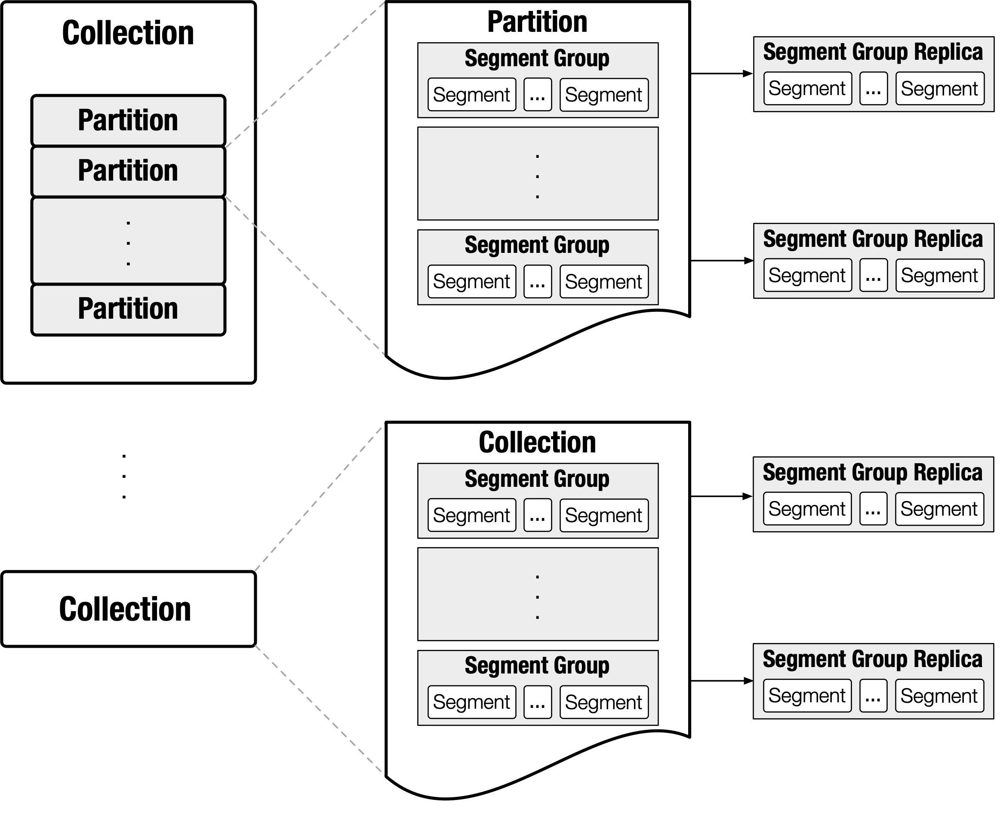
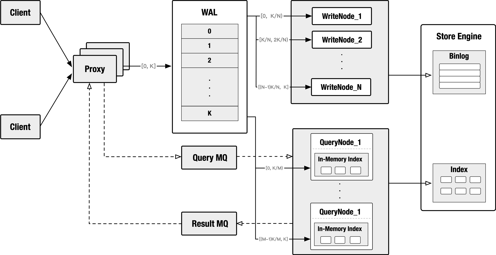
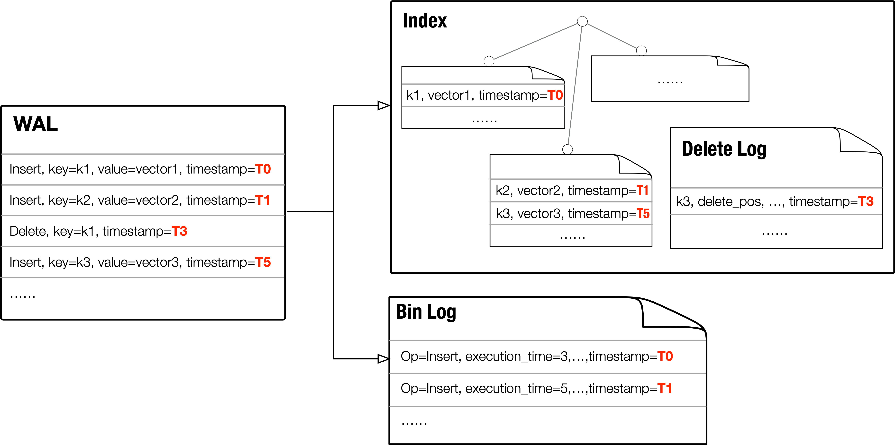

## 1. System Overview

In this section, we sketch the system design of Milvus, including the data model, data organization, architecture, and state synchronization.

#### 1.1 Data Model

Milvus exposes the following set of data features to applications:

* a data model based on schematized relational tables, in that rows must have primary-keys,

* a query language specifies data definition, data manipulation, and data query, where data definition includes create, drop, and data manipulation includes insert, upsert, delete, and data query falls into three types, primary key search, approximate nearest neighbor search (ANNS), ANNS with predicates.

The requests' execution order is strictly in accordance with their issue-time order. We take proxy's issue time as a request's issue time. For a batch request, all its sub-requests share the same issue time. In cases there are multiple proxies, issue time from different proxies are regarded as coming from a central clock.

Transaction is currently not supported by Milvus.

A batch insert/delete is guaranteed to become visible atomically.

#### 1.2 Data Organization

In Milvus, 'collection' refers to the concept of table. A collection can be optionally divided into several 'partitions'. Both collection and partition are the basic execution scopes of queries. When using partition, users should clearly know how a collection should be partitioned. In most cases, partition leads to more flexible data management and more efficient querying. For a partitioned collection, queries can be executed both on the collection or a set of specified partitions.

Each collection or partition contains a set of 'segment groups'. Segment group is the basic unit of data-to-node mapping. It's also the basic unit of replica. For instance, if a query node failed, its segment groups will be redistributed across other nodes. If a query node is overloaded, part of its segment groups will be migrated to underloaded ones. If a hot collection/partition is detected, its segment groups will be replicated to smooth the system load skewness.

'Segment' is the finest unit of data organization. It is where the data and indexes are actually kept. Each segment contains a set of rows. In order to reduce the memory footprint during a query execution and to fully utilize SIMD, the physical data layout within segments is organized in a column-based manner.

#### 1.3 Architecture Overview

The main components, proxy, WAL, query node and write node can scale to multiple instances. These components scale seperately for better tradeoff between availability and cost.

The WAL forms a hash ring. Requests (i.e. inserts and deletes) from clients will be repacked by proxy. Operations shared identical hash value (the hash value of primary key) will be routed to the same hash bucket. In addtion, some preprocessing work will be done by proxy, such as static validity checking, primary key assignment (if not given by user), timestamp assignment.

The query/write nodes are linked to the hash ring, with each node covers some portion of the buckets. Once the hash function and bucket coverage are settled, the chain 'proxy -> WAL -> query/write node' will act as a producer-consumer pipeline. Logs in each bucket is a determined operation stream. Via performing the operation stream in order, the query nodes keep themselves up to date.

The query nodes hold all the indexes in memory. Since building index is time-consuming, the query nodes will dump their index to disk (store engine) for fast failure recovery and cross node index copy.

The write nodes are stateless. They simply transforms the newly arrived WALs to binlog format, then append the binlog to store enginey.

Note that not all the components are necessarily replicated. The system provides failure tolerance by maintaining multiple copies of WAL and binlog. When there is no in-memory index replica and there occurs a query node failure, other query nodes will take over its indexes by loading the dumped index files, or rebuilding them from binlog and WALs. The links from query nodes to the hash ring will also be adjusted such that the failure node's input WAL stream can be properly handled by its neighbors.

#### 1.4 State Synchronization

Data in Milvus have three different forms, namely WAL, binlog, and index. As mentioned in the previous section, WAL can be viewed as a determined operation stream. Other two data forms keep themselves up to date by performing the operation stream in time order.

Each of the WAL is attached with a timestamp, which is the time when the log is sent to the hash bucket. Binlog records, table rows, index cells will also keep that timestamp. In this way, different data forms can offer consistent snapshots for a given time T. For example, requests such as "fetch binlogs before T for point-in-time recovery", "get the row with primary key K at time T", "launch a similarity search at time T for vector V" perform on binlog, index respectively. Though different data forms these three requests are performed, they observe identical snapshots, namely all the state changes before T.

For better throughput, Milvus allows asynchronous state synchronization between WAL and index/binlog/table. Whenever the data is not fresh enough to satisfy a query, the query will be suspended until the data is up-to-date, or timeout will be returned.

#### 1.5 Stream and Time

In order to boost throughput, we model Milvus as a stream-driven system.

