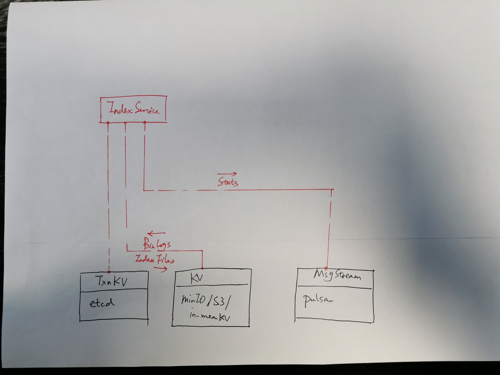

## 8. Index Service


#### 8.1 Overview



#### 8.2 API

```go
type Client interface {
  BuildIndex(req BuildIndexRequest) (BuildIndexResponse, error)
	GetIndexStates(req IndexStatesRequest) (IndexStatesResponse, error)
	GetIndexFilePaths(req IndexFilePathRequest) (IndexFilePathsResponse, error)
}
```


* *BuildIndex*

```go
type BuildIndexRequest struct {
  DataPaths []string
  TypeParams map[string]string
  IndexParams map[string]string
}

type BuildIndexResponse struct {
  IndexID UniqueID
}
```


* *GetIndexStates*

```go
type IndexStatesRequest struct {
	IndexID UniqueID 
}

enum IndexState {
    NONE = 0;
    UNISSUED = 1;
    INPROGRESS = 2;
    FINISHED = 3;
}

type IndexStatesResponse struct {
	ID                UniqueID
	State            IndexState
	EnqueueTime       time.Time
	ScheduleTime      time.Time
	BuildCompleteTime time.Time
}
```


* *GetIndexFilePaths*

```go
type IndexFilePathRequest struct {
  IndexID UniqueID
}

type IndexFilePathsResponse struct {
  FilePaths []string
}
```


#### 8.3 Index Node

```go
type IndexNode interface {
  Start() error
  Close() error
  
//  SetTimeTickChannel(channelID string) error
  SetStatsChannel(channelID string) error
  
  BuildIndex(req BuildIndexRequest) (BuildIndexResponse, error)
}
```

