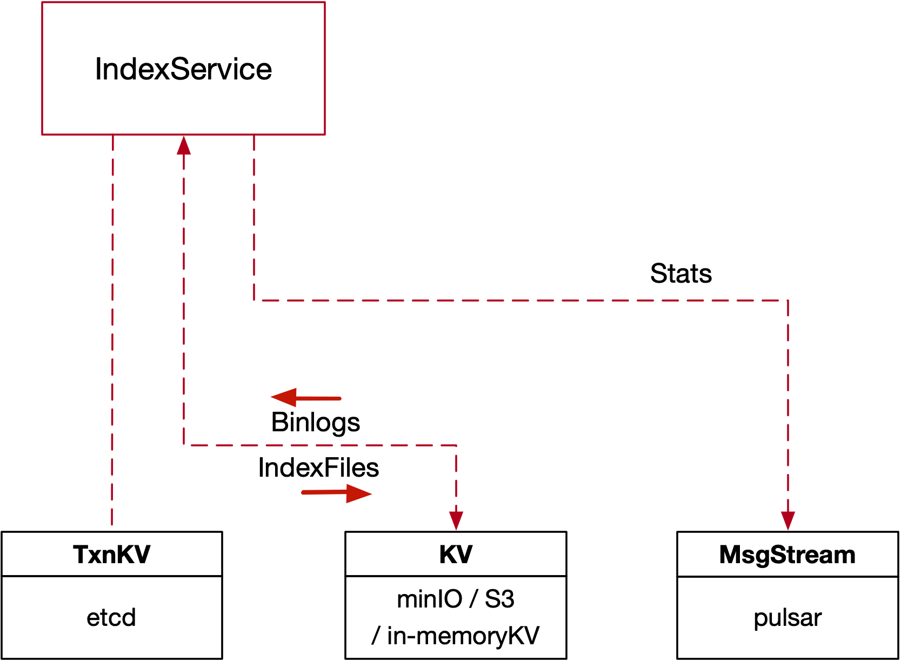

## 8. Index Service


#### 8.1 Overview



#### 8.2 Index Service Interface

```go
type IndexService interface {
  Service
  Component
  RegisterNode(ctx context.Context, req *indexpb.RegisterNodeRequest) (*indexpb.RegisterNodeResponse, error)
  BuildIndex(ctx context.Context, req *indexpb.BuildIndexRequest) (*indexpb.BuildIndexResponse, error)
  GetIndexStates(ctx context.Context, req *indexpb.IndexStatesRequest) (*indexpb.IndexStatesResponse, error)
  GetIndexFilePaths(ctx context.Context, req *indexpb.IndexFilePathsRequest) (*indexpb.IndexFilePathsResponse, error)
  NotifyBuildIndex(ctx context.Context, nty *indexpb.BuildIndexNotification) (*commonpb.Status, error)
}
```


* *RegisterNode*

```go
type MsgBase struct {
  MsgType   MsgType
  MsgID     UniqueID
  Timestamp uint64
  SourceID  UniqueID
}

type Address struct {
  Ip   string
  Port int64
}

type RegisterNodeRequest struct {
  Base    *commonpb.MsgBase
  Address *commonpb.Address
}

type InitParams struct {
  NodeID      UniqueID
  StartParams []*commonpb.KeyValuePair
}

type RegisterNodeResponse struct {
  InitParams *internalpb2.InitParams
  Status     *commonpb.Status
}
```

* *BuildIndex*

```go
type KeyValuePair struct {
  Key   string
  Value string
}

type BuildIndexRequest struct {
  IndexName   string
  IndexID     UniqueID
  DataPaths   []string
  TypeParams  []*commonpb.KeyValuePair
  IndexParams []*commonpb.KeyValuePair
}

type BuildIndexResponse struct {
  Status       *commonpb.Status
  IndexBuildID UniqueID
}
```

* *GetIndexStates*

```go
type IndexStatesRequest struct {
  IndexBuildIDs []UniqueID
}

enum IndexState {
  NONE       = 0;
  UNISSUED   = 1;
  INPROGRESS = 2;
  FINISHED   = 3;
  FAILED     = 4;
  DELETED    = 5;
}

type IndexInfo struct {
  State        commonpb.IndexState
  IndexBuildID UniqueID
  IndexID      UniqueID
  IndexName    string
  Reason       string
}

type IndexStatesResponse struct {
  Status *commonpb.Status
  States []*IndexInfo
}


```

* *GetIndexFilePaths*

```go
type IndexFilePathRequest struct {
  IndexBuildIDs []UniqueID
}

type IndexFilePathInfo struct {
  Status         *commonpb.Status
  IndexBuildID   UniqueID
  IndexFilePaths []string
}

type IndexFilePathsResponse struct {
  Status    *commonpb.Status
  FilePaths []*IndexFilePathInfo
}

```

* *NotifyBuildIndex*

```go
type BuildIndexNotification struct {
  Status         *commonpb.Status
  IndexBuildID   UniqueID
  IndexFilePaths []string
  NodeID         UniqueID
}
```


#### 8.3 Index Node Interface

```go
type IndexNode interface {
  Service
  Component
  BuildIndex(ctx context.Context, req *indexpb.BuildIndexCmd) (*commonpb.Status, error)
  DropIndex(ctx context.Context, req *indexpb.DropIndexRequest) (*commonpb.Status, error)
}
```

* *BuildIndex*

```go

type KeyValuePair struct {
  Key   string
  Value string
}

type BuildIndexRequest struct {
  IndexName   string
  IndexID     UniqueID
  DataPaths   []string
  TypeParams  []*commonpb.KeyValuePair
  IndexParams []*commonpb.KeyValuePair
}

type BuildIndexCmd struct {
  IndexBuildID UniqueID
  Req          *BuildIndexRequest
}
```

* *DropIndex*

```go
type DropIndexRequest struct {
  IndexID UniqueID
}
```
